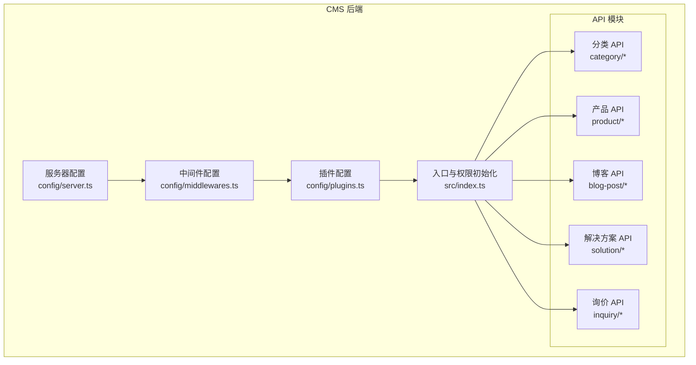
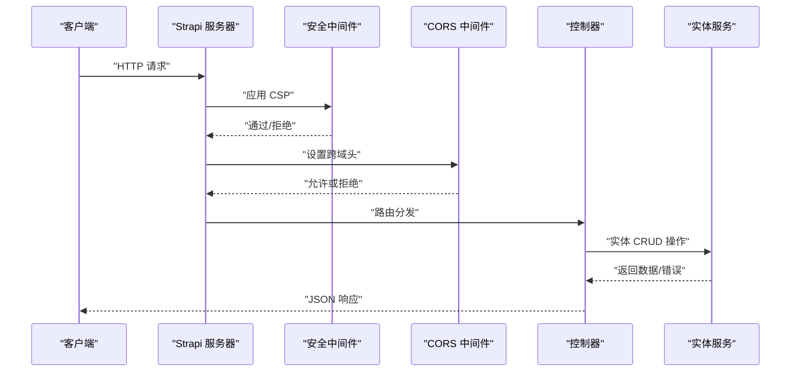
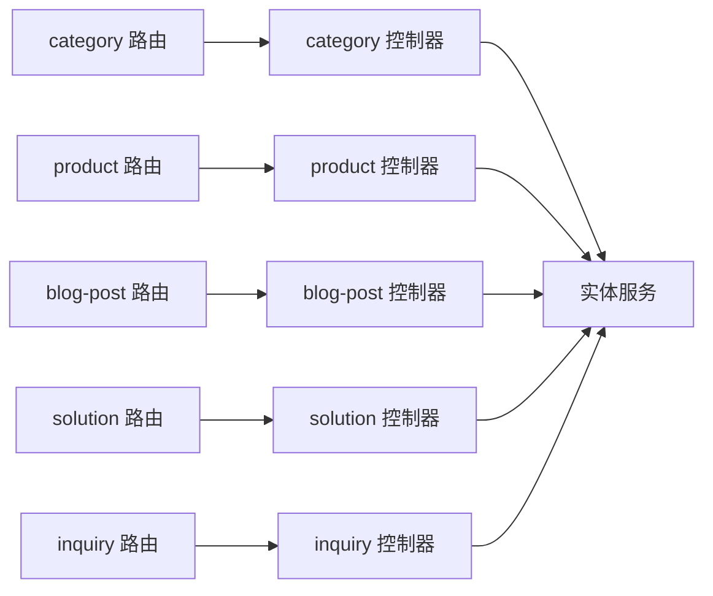

# API 接口参考

<cite>
**本文引用的文件**
- [cms/src/index.ts](file://cms/src/index.ts)
- [cms/config/server.ts](file://cms/config/server.ts)
- [cms/config/middlewares.ts](file://cms/config/middlewares.ts)
- [cms/config/plugins.ts](file://cms/config/plugins.ts)
- [cms/package.json](file://cms/package.json)
- [cms/src/api/category/controllers/category.ts](file://cms/src/api/category/controllers/category.ts)
- [cms/src/api/category/routes/category.ts](file://cms/src/api/category/routes/category.ts)
- [cms/src/api/product/controllers/product.ts](file://cms/src/api/product/controllers/product.ts)
- [cms/src/api/product/routes/product.ts](file://cms/src/api/product/routes/product.ts)
- [cms/src/api/blog-post/controllers/blog-post.ts](file://cms/src/api/blog-post/controllers/blog-post.ts)
- [cms/src/api/blog-post/routes/blog-post.ts](file://cms/src/api/blog-post/routes/blog-post.ts)
- [cms/src/api/solution/controllers/solution.ts](file://cms/src/api/solution/controllers/solution.ts)
- [cms/src/api/solution/routes/solution.ts](file://cms/src/api/solution/routes/solution.ts)
- [cms/src/api/inquiry/controllers/inquiry.ts](file://cms/src/api/inquiry/controllers/inquiry.ts)
- [cms/src/api/inquiry/routes/inquiry.ts](file://cms/src/api/inquiry/routes/inquiry.ts)
</cite>

## 目录
1. [简介](#简介)
2. [项目结构](#项目结构)
3. [核心组件](#核心组件)
4. [架构总览](#架构总览)
5. [详细组件分析](#详细组件分析)
6. [依赖关系分析](#依赖关系分析)
7. [性能考量](#性能考量)
8. [故障排查指南](#故障排查指南)
9. [结论](#结论)
10. [附录](#附录)

## 简介
本文件为 Battivus 项目的 API 接口参考文档，基于 Strapi v5 构建的 Headless CMS 后端。文档覆盖产品（Product）、分类（Category）、博客文章（Blog Post）、解决方案（Solution）与询价（Inquiry）相关的所有 REST API 端点，包括：
- HTTP 方法与 URL 模式
- 请求/响应数据结构与参数说明
- 认证与权限策略
- 错误处理与常见问题
- 常见使用场景、客户端实现建议与性能优化
- API 版本管理与向后兼容性说明
- 调试与监控方法

## 项目结构
后端采用 Strapi 的模块化结构，按功能域划分 API：category、product、blog-post、solution、inquiry。每个域包含控制器（controllers）、路由（routes）与服务（services）。系统通过中间件配置启用安全策略、CORS 与上传插件。

图表来源
- [cms/config/server.ts:1-11](file://cms/config/server.ts#L1-L11)
- [cms/config/middlewares.ts:1-32](file://cms/config/middlewares.ts#L1-L32)
- [cms/config/plugins.ts:1-19](file://cms/config/plugins.ts#L1-L19)
- [cms/src/index.ts:149-217](file://cms/src/index.ts#L149-L217)

章节来源
- [cms/config/server.ts:1-11](file://cms/config/server.ts#L1-L11)
- [cms/config/middlewares.ts:1-32](file://cms/config/middlewares.ts#L1-L32)
- [cms/config/plugins.ts:1-19](file://cms/config/plugins.ts#L1-L19)
- [cms/src/index.ts:149-217](file://cms/src/index.ts#L149-L217)

## 核心组件
- 服务器与环境配置：监听主机与端口，应用密钥，Webhook 配置。
- 中间件栈：日志、错误处理、安全策略（CSP）、CORS、查询解析、Body 解析、会话、静态资源等。
- 插件：上传至 Cloudinary，支持图片资源管理。
- 权限与公开访问：启动时为“公共角色”授予分类、产品、博客、解决方案的读取权限，并允许公开提交询价。

章节来源
- [cms/config/server.ts:1-11](file://cms/config/server.ts#L1-L11)
- [cms/config/middlewares.ts:1-32](file://cms/config/middlewares.ts#L1-L32)
- [cms/config/plugins.ts:1-19](file://cms/config/plugins.ts#L1-L19)
- [cms/src/index.ts:161-217](file://cms/src/index.ts#L161-L217)

## 架构总览
下图展示从客户端到各 API 的调用路径与权限控制要点：

图表来源
- [cms/config/middlewares.ts:1-32](file://cms/config/middlewares.ts#L1-L32)
- [cms/src/api/category/controllers/category.ts:1-40](file://cms/src/api/category/controllers/category.ts#L1-L40)
- [cms/src/api/product/controllers/product.ts:1-40](file://cms/src/api/product/controllers/product.ts#L1-L40)
- [cms/src/api/blog-post/controllers/blog-post.ts:1-53](file://cms/src/api/blog-post/controllers/blog-post.ts#L1-L53)
- [cms/src/api/solution/controllers/solution.ts:1-40](file://cms/src/api/solution/controllers/solution.ts#L1-L40)
- [cms/src/api/inquiry/controllers/inquiry.ts:1-40](file://cms/src/api/inquiry/controllers/inquiry.ts#L1-L40)

## 详细组件分析

### 分类 API（Category）
- 功能：提供分类列表与详情的读取能力；支持增删改（后台管理）。
- 公开访问：已为“公共角色”授权读取权限。
- 端点概览
  - GET /categories：获取分类列表
  - GET /categories/:id：按 ID 获取分类详情
  - POST /categories：创建分类（需鉴权）
  - PUT /categories/:id：更新分类（需鉴权）
  - DELETE /categories/:id：删除分类（需鉴权）

请求/响应
- 请求体：无（除创建/更新时传入数据）
- 响应体：包含 data 字段的对象，data 为实体对象或数组
- 查询参数：支持 Strapi 查询语法（如过滤、排序、分页、populate 等）

错误处理
- 未授权：返回 403
- 资源不存在：返回 404
- 参数错误/内部错误：返回 500

章节来源
- [cms/src/api/category/routes/category.ts:1-50](file://cms/src/api/category/routes/category.ts#L1-L50)
- [cms/src/api/category/controllers/category.ts:1-40](file://cms/src/api/category/controllers/category.ts#L1-L40)
- [cms/src/index.ts:172-188](file://cms/src/index.ts#L172-L188)

### 产品 API（Product）
- 功能：提供产品列表与详情的读取能力；支持增删改（后台管理）。
- 公开访问：已为“公共角色”授权读取权限。
- 端点概览
  - GET /products：获取产品列表
  - GET /products/:id：按 ID 获取产品详情
  - POST /products：创建产品（需鉴权）
  - PUT /products/:id：更新产品（需鉴权）
  - DELETE /products/:id：删除产品（需鉴权）

请求/响应
- 请求体：无（除创建/更新时传入数据）
- 响应体：包含 data 字段的对象，data 为实体对象或数组
- 查询参数：支持 Strapi 查询语法（filters、sort、populate、pagination 等）

错误处理
- 未授权：返回 403
- 资源不存在：返回 404
- 参数错误/内部错误：返回 500

章节来源
- [cms/src/api/product/routes/product.ts:1-35](file://cms/src/api/product/routes/product.ts#L1-L35)
- [cms/src/api/product/controllers/product.ts:1-40](file://cms/src/api/product/controllers/product.ts#L1-L40)
- [cms/src/index.ts:172-188](file://cms/src/index.ts#L172-L188)

### 博客文章 API（Blog Post）
- 功能：提供博客文章列表与详情的读取能力；支持增删改（后台管理）。
- 公开访问：已为“公共角色”授权读取权限。
- 端点概览
  - GET /blog-posts：获取文章列表
  - GET /blog-posts/:id：按 ID 或 slug 获取文章详情
- 特殊行为：当 :id 为纯数字时按 ID 查找；否则按 slug 查找

请求/响应
- 请求体：无（除创建/更新时传入数据）
- 响应体：包含 data 字段的对象，data 为实体对象或 null
- 查询参数：支持 Strapi 查询语法

错误处理
- 未授权：返回 403
- 资源不存在：返回 404
- 参数错误/内部错误：返回 500

章节来源
- [cms/src/api/blog-post/routes/blog-post.ts:1-35](file://cms/src/api/blog-post/routes/blog-post.ts#L1-L35)
- [cms/src/api/blog-post/controllers/blog-post.ts:1-53](file://cms/src/api/blog-post/controllers/blog-post.ts#L1-L53)
- [cms/src/index.ts:172-188](file://cms/src/index.ts#L172-L188)

### 解决方案 API（Solution）
- 功能：提供解决方案列表与详情的读取能力；支持增删改（后台管理）。
- 公开访问：已为“公共角色”授权读取权限。
- 端点概览
  - GET /solutions：获取解决方案列表
  - GET /solutions/:id：按 ID 获取解决方案详情
  - POST /solutions：创建解决方案（需鉴权）
  - PUT /solutions/:id：更新解决方案（需鉴权）
  - DELETE /solutions/:id：删除解决方案（需鉴权）

请求/响应
- 请求体：无（除创建/更新时传入数据）
- 响应体：包含 data 字段的对象，data 为实体对象或数组
- 查询参数：支持 Strapi 查询语法

错误处理
- 未授权：返回 403
- 资源不存在：返回 404
- 参数错误/内部错误：返回 500

章节来源
- [cms/src/api/solution/routes/solution.ts:1-35](file://cms/src/api/solution/routes/solution.ts#L1-L35)
- [cms/src/api/solution/controllers/solution.ts:1-40](file://cms/src/api/solution/controllers/solution.ts#L1-L40)
- [cms/src/index.ts:172-188](file://cms/src/index.ts#L172-L188)

### 询价 API（Inquiry）
- 功能：提供询价列表与详情的读取能力；支持前台表单提交（创建）。
- 公开访问：已为“公共角色”授权创建权限，适合前端表单提交。
- 端点概览
  - GET /inquiries：获取询价列表（需鉴权）
  - GET /inquiries/:id：按 ID 获取询价详情（需鉴权）
  - POST /inquiries：创建询价（公开，用于表单提交）
  - PUT /inquiries/:id：更新询价（需鉴权）
  - DELETE /inquiries/:id：删除询价（需鉴权）

请求/响应
- 请求体：无（除创建/更新时传入数据）
- 响应体：包含 data 字段的对象，data 为实体对象或数组
- 查询参数：支持 Strapi 查询语法

错误处理
- 未授权：返回 403
- 资源不存在：返回 404
- 参数错误/内部错误：返回 500

章节来源
- [cms/src/api/inquiry/routes/inquiry.ts:1-35](file://cms/src/api/inquiry/routes/inquiry.ts#L1-L35)
- [cms/src/api/inquiry/controllers/inquiry.ts:1-40](file://cms/src/api/inquiry/controllers/inquiry.ts#L1-L40)
- [cms/src/index.ts:186-188](file://cms/src/index.ts#L186-L188)

## 依赖关系分析
- 组件耦合：路由定义与控制器一一对应，控制器依赖 Strapi 实体服务进行数据操作。
- 外部依赖：Cloudinary 上传插件；数据库由 Strapi 管理（默认 SQLite/可替换为 PostgreSQL）。
- 安全与跨域：CSP 与 CORS 在中间件中集中配置，统一处理跨域与资源加载策略。

图表来源
- [cms/src/api/category/routes/category.ts:1-50](file://cms/src/api/category/routes/category.ts#L1-L50)
- [cms/src/api/product/routes/product.ts:1-35](file://cms/src/api/product/routes/product.ts#L1-L35)
- [cms/src/api/blog-post/routes/blog-post.ts:1-35](file://cms/src/api/blog-post/routes/blog-post.ts#L1-L35)
- [cms/src/api/solution/routes/solution.ts:1-35](file://cms/src/api/solution/routes/solution.ts#L1-L35)
- [cms/src/api/inquiry/routes/inquiry.ts:1-35](file://cms/src/api/inquiry/routes/inquiry.ts#L1-L35)

章节来源
- [cms/src/api/category/controllers/category.ts:1-40](file://cms/src/api/category/controllers/category.ts#L1-L40)
- [cms/src/api/product/controllers/product.ts:1-40](file://cms/src/api/product/controllers/product.ts#L1-L40)
- [cms/src/api/blog-post/controllers/blog-post.ts:1-53](file://cms/src/api/blog-post/controllers/blog-post.ts#L1-L53)
- [cms/src/api/solution/controllers/solution.ts:1-40](file://cms/src/api/solution/controllers/solution.ts#L1-L40)
- [cms/src/api/inquiry/controllers/inquiry.ts:1-40](file://cms/src/api/inquiry/controllers/inquiry.ts#L1-L40)

## 性能考量
- 查询优化
  - 使用 filters、sort、pagination 控制查询规模，避免一次性拉取大量数据。
  - 仅在需要时使用 populate，减少不必要的关联查询。
- 缓存策略
  - 前端可对静态内容（如分类、产品列表）实施缓存；变更频率低的数据适合长缓存。
- 传输与存储
  - 图片资源通过 Cloudinary 上传与优化，建议在前端按需加载与懒加载。
- 并发与限流
  - 生产环境建议在网关层或反向代理处配置限流与超时，防止突发流量冲击。
- 数据库选择
  - 默认 SQLite 适合开发与小规模部署；生产推荐 PostgreSQL 以获得更好的并发与稳定性。

## 故障排查指南
- CORS 问题
  - 当前配置允许任意来源与头部，便于本地与预览环境联调；生产环境建议收紧 origin 列表。
- 安全策略
  - CSP 已启用默认策略，确保媒体与图片资源来源安全；如遇资源加载失败，请检查 CSP 指令。
- 权限与鉴权
  - “公共角色”已授权读取权限；若出现 403，请确认请求是否使用了正确的公开端点。
  - 创建/更新/删除需管理员令牌；请在请求头中携带 Authorization: Bearer <token>。
- 日志与错误
  - 中间件包含日志与错误处理；可通过日志定位异常请求与堆栈信息。
- 上传与图片
  - Cloudinary 配置需正确设置云名称、密钥；若上传失败，请检查凭证与网络连通性。

章节来源
- [cms/config/middlewares.ts:1-32](file://cms/config/middlewares.ts#L1-L32)
- [cms/config/plugins.ts:1-19](file://cms/config/plugins.ts#L1-L19)
- [cms/src/index.ts:161-217](file://cms/src/index.ts#L161-L217)

## 结论
本 API 文档基于 Strapi v5 的实际实现，覆盖了产品、分类、博客、解决方案与询价的核心接口。通过明确的端点规范、权限策略与错误处理指引，可帮助前后端团队高效对接。建议在生产环境中进一步完善鉴权、CORS 与安全策略，并结合缓存与 CDN 提升性能与稳定性。

## 附录

### 认证与安全
- 认证方式
  - 管理端：使用 Strapi 用户权限插件生成的 JWT 令牌，置于 Authorization: Bearer <token> 请求头。
  - 公开端点：无需认证，适用于公开读取与前台表单提交。
- 安全建议
  - 生产环境限制 CORS 的 origin 与 headers。
  - 对敏感端点启用更严格的权限与速率限制。
  - 定期轮换 APP_KEYS 与上传凭证。

章节来源
- [cms/src/index.ts:161-217](file://cms/src/index.ts#L161-L217)
- [cms/config/middlewares.ts:1-32](file://cms/config/middlewares.ts#L1-L32)
- [cms/config/server.ts:1-11](file://cms/config/server.ts#L1-L11)

### API 版本管理与向后兼容
- 版本策略
  - 当前未显式提供 API 版本号；建议在 URL 中引入版本前缀（如 /api/v1/...），以便平滑演进。
- 向后兼容
  - 新增字段时保持默认值与可选性；变更现有字段需通过新版本端点提供兼容映射。
  - 对于破坏性变更，保留旧端点一段时间并标注弃用提示。

### 常见使用场景与客户端实现建议
- 列表与详情
  - 使用 GET /{resource} 与 GET /{resource}/:id 获取数据；根据页面需求决定是否一次性拉取全部或分页加载。
- 表单提交
  - 使用 POST /inquiries 提交询价；确保必填字段完整并通过后端校验。
- SEO 与链接
  - 博客文章支持按 slug 访问，利于搜索引擎优化与分享链接稳定。

### 调试与监控
- 开发与构建
  - 使用 npm 脚本进行开发与构建；构建后自动复制 Schema。
- 运行时监控
  - 结合日志中间件观察请求量、错误率与慢查询；必要时接入外部监控平台。
- 前端联调
  - 本地开发时可直接访问后端地址；预览环境注意 CORS 与 HTTPS 证书问题。

章节来源
- [cms/package.json:1-36](file://cms/package.json#L1-L36)