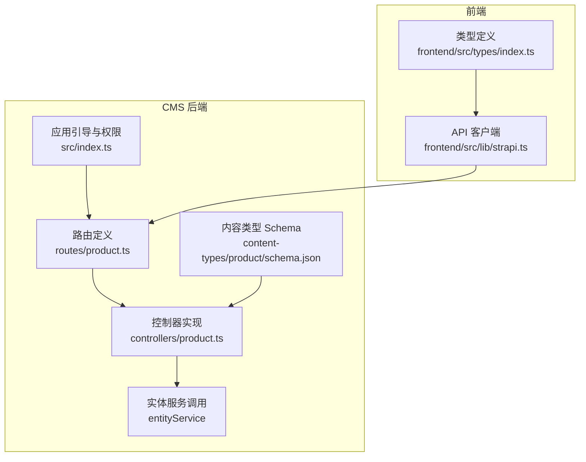
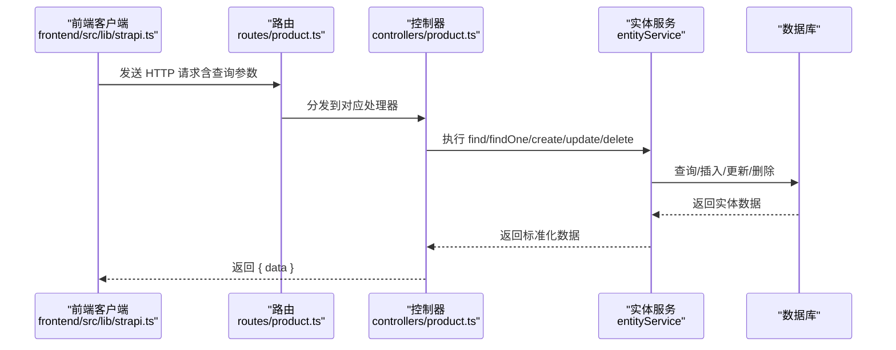
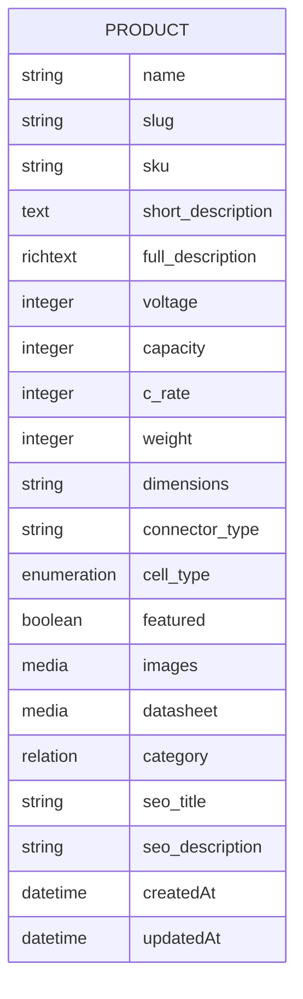
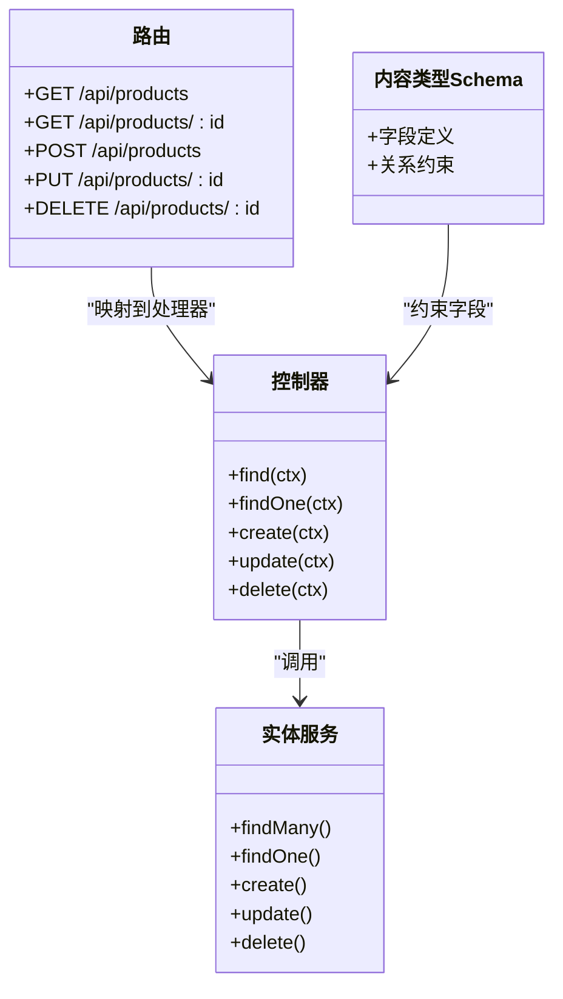

# 产品 API

<cite>
**本文引用的文件**
- [schema.json](file://cms/src/api/product/content-types/product/schema.json)
- [product.ts（控制器）](file://cms/src/api/product/controllers/product.ts)
- [product.ts（路由）](file://cms/src/api/product/routes/product.ts)
- [product.ts（服务）](file://cms/src/api/product/services/product.ts)
- [index.ts（应用引导）](file://cms/src/index.ts)
- [strapi.ts（前端客户端）](file://frontend/src/lib/strapi.ts)
- [index.ts（类型定义）](file://frontend/src/types/index.ts)
- [server.ts（服务器配置）](file://cms/config/server.ts)
- [plugins.ts（插件配置）](file://cms/config/plugins.ts)
</cite>

## 目录
1. [简介](#简介)
2. [项目结构](#项目结构)
3. [核心组件](#核心组件)
4. [架构总览](#架构总览)
5. [详细组件分析](#详细组件分析)
6. [依赖关系分析](#依赖关系分析)
7. [性能考虑](#性能考虑)
8. [故障排查指南](#故障排查指南)
9. [结论](#结论)
10. [附录](#附录)

## 简介
本文件为产品相关 API 的详细接口文档，覆盖产品 CRUD 操作的完整端点与规范，包括：
- GET /api/products：获取产品列表
- GET /api/products/:id：获取单个产品
- POST /api/products：创建产品
- PUT /api/products/:id：更新产品
- DELETE /api/products/:id：删除产品

文档将说明每个端点的请求参数、查询条件、响应格式、错误处理，并给出产品数据模型字段说明、排序与分页参数、过滤条件、实际请求/响应示例以及性能优化建议与最佳实践。

## 项目结构
该产品 API 基于 Strapi v5 构建，采用标准的“内容类型 + 控制器 + 路由 + 服务”的分层架构。前端通过统一的 API 客户端封装了查询参数（populate、filters、sort、pagination）的构建与发送逻辑。

图表来源
- [product.ts（路由）:1-35](file://cms/src/api/product/routes/product.ts#L1-L35)
- [product.ts（控制器）:1-40](file://cms/src/api/product/controllers/product.ts#L1-L40)
- [schema.json:1-33](file://cms/src/api/product/content-types/product/schema.json#L1-L33)
- [index.ts（应用引导）:161-217](file://cms/src/index.ts#L161-L217)
- [strapi.ts（前端客户端）:51-119](file://frontend/src/lib/strapi.ts#L51-L119)
- [index.ts（类型定义）:23-43](file://frontend/src/types/index.ts#L23-L43)

章节来源
- [product.ts（路由）:1-35](file://cms/src/api/product/routes/product.ts#L1-L35)
- [product.ts（控制器）:1-40](file://cms/src/api/product/controllers/product.ts#L1-L40)
- [schema.json:1-33](file://cms/src/api/product/content-types/product/schema.json#L1-L33)
- [index.ts（应用引导）:161-217](file://cms/src/index.ts#L161-L217)
- [strapi.ts（前端客户端）:51-119](file://frontend/src/lib/strapi.ts#L51-L119)
- [index.ts（类型定义）:23-43](file://frontend/src/types/index.ts#L23-L43)

## 核心组件
- 内容类型 Schema：定义产品实体的数据结构、字段约束与关系（如分类关联、媒体资源等）。
- 路由：声明产品 API 的 HTTP 端点与处理器映射。
- 控制器：封装业务逻辑，调用 Strapi 实体服务完成数据读写。
- 服务：当前为空实现，可扩展业务规则或钩子。
- 应用引导：在启动时为公共角色授予产品 API 的访问权限，并进行种子数据初始化。
- 前端客户端：统一封装查询参数与网络请求，支持 populate、filters、sort、pagination。

章节来源
- [schema.json:12-31](file://cms/src/api/product/content-types/product/schema.json#L12-L31)
- [product.ts（路由）:1-35](file://cms/src/api/product/routes/product.ts#L1-L35)
- [product.ts（控制器）:1-40](file://cms/src/api/product/controllers/product.ts#L1-L40)
- [product.ts（服务）:1-2](file://cms/src/api/product/services/product.ts#L1-L2)
- [index.ts（应用引导）:161-217](file://cms/src/index.ts#L161-L217)
- [strapi.ts（前端客户端）:51-119](file://frontend/src/lib/strapi.ts#L51-L119)

## 架构总览
产品 API 的调用链路如下：
- 前端通过 API 客户端发起 HTTP 请求，自动拼接查询参数。
- 路由将请求映射到对应控制器方法。
- 控制器调用实体服务执行数据操作。
- 实体服务与数据库交互，返回标准化结果。
- 响应以统一的数据结构返回给前端。

图表来源
- [strapi.ts（前端客户端）:51-119](file://frontend/src/lib/strapi.ts#L51-L119)
- [product.ts（路由）:1-35](file://cms/src/api/product/routes/product.ts#L1-L35)
- [product.ts（控制器）:1-40](file://cms/src/api/product/controllers/product.ts#L1-L40)

## 详细组件分析

### 数据模型：产品（Product）
产品实体由内容类型 Schema 定义，包含以下关键字段与约束：
- 基础信息：名称、别名（slug）、SKU、短描述、富文本详情、SEO 标题与描述
- 规格参数：电压（整数，S 数）、容量（整数，mAh）、放电倍率（整数）、重量（g）、尺寸（字符串）、连接器类型（字符串）
- 类型与状态：电池类型（枚举：LiPo/Li-ion/LiFePO4，默认 LiPo）、是否精选（布尔）
- 关系与媒体：多图媒体（images）、单文件资料（datasheet），关联分类（manyToOne），支持草稿与发布
- 元数据：createdAt、updatedAt

图表来源
- [schema.json:12-31](file://cms/src/api/product/content-types/product/schema.json#L12-L31)

章节来源
- [schema.json:12-31](file://cms/src/api/product/content-types/product/schema.json#L12-L31)

### 端点规范

#### GET /api/products
- 功能：获取产品列表
- 认证：公共访问（已授权）
- 查询参数（支持的查询键）：
  - populate：指定要填充的关系字段（如 category、images 等）
  - filters：过滤条件（支持嵌套关系过滤，如 category.slug 等）
  - sort：排序字段（支持多字段排序）
  - pagination：分页参数（page、pageSize）
- 响应格式：
  - 成功：{ data: 数组 }
  - 失败：HTTP 错误码（由前端客户端抛出异常）
- 示例请求：
  - GET /api/products?populate=*&filters[featured][$eq]=true&sort=createdAt:desc&pagination[page]=1&pagination[pageSize]=25
- 示例响应：
  - { "data": [ { "id": "...", "name": "...", "category": { ... }, "images": [ { "url": "..." } ], ... } ] }

章节来源
- [product.ts（控制器）:4-9](file://cms/src/api/product/controllers/product.ts#L4-L9)
- [strapi.ts（前端客户端）:51-119](file://frontend/src/lib/strapi.ts#L51-L119)
- [index.ts（应用引导）:177-179](file://cms/src/index.ts#L177-L179)

#### GET /api/products/:id
- 功能：按 ID 获取单个产品
- 认证：公共访问（已授权）
- 路径参数：id（产品 ID 或文档 ID）
- 查询参数：populate、filters、sort、pagination（同上）
- 响应格式：
  - 成功：{ data: 对象 }
  - 失败：HTTP 404（前端客户端返回 null）
- 示例请求：
  - GET /api/products/1?populate=*
- 示例响应：
  - { "data": { "id": "...", "name": "...", "category": { ... }, "images": [ { "url": "..." } ], ... } }

章节来源
- [product.ts（控制器）:11-17](file://cms/src/api/product/controllers/product.ts#L11-L17)
- [strapi.ts（前端客户端）:121-164](file://frontend/src/lib/strapi.ts#L121-L164)

#### POST /api/products
- 功能：创建产品
- 认证：需要管理员令牌（Authorization: Bearer <token>）
- 请求体：data 字段包含产品数据（字段需满足 Schema 约束）
- 响应格式：{ data: 新创建的对象 }
- 示例请求：
  - POST /api/products
  - Headers: Authorization: Bearer <token>
  - Body: { "data": { "name": "...", "slug": "...", "sku": "...", ... } }
- 示例响应：
  - { "data": { "id": "...", "name": "...", "documentId": "...", ... } }

章节来源
- [product.ts（控制器）:19-24](file://cms/src/api/product/controllers/product.ts#L19-L24)
- [plugins.ts（插件配置）:1-19](file://cms/config/plugins.ts#L1-L19)

#### PUT /api/products/:id
- 功能：更新产品
- 认证：需要管理员令牌（Authorization: Bearer <token>）
- 路径参数：id（产品 ID 或文档 ID）
- 请求体：data 字段包含要更新的产品数据
- 响应格式：{ data: 更新后的对象 }
- 示例请求：
  - PUT /api/products/1
  - Headers: Authorization: Bearer <token>
  - Body: { "data": { "featured": true } }
- 示例响应：
  - { "data": { "id": "...", "name": "...", "featured": true, ... } }

章节来源
- [product.ts（控制器）:26-32](file://cms/src/api/product/controllers/product.ts#L26-L32)
- [plugins.ts（插件配置）:1-19](file://cms/config/plugins.ts#L1-L19)

#### DELETE /api/products/:id
- 功能：删除产品
- 认证：需要管理员令牌（Authorization: Bearer <token>）
- 路径参数：id（产品 ID 或文档 ID）
- 响应格式：{ data: 被删除的对象 }
- 示例请求：
  - DELETE /api/products/1
  - Headers: Authorization: Bearer <token>
- 示例响应：
  - { "data": { "id": "...", "name": "...", ... } }

章节来源
- [product.ts（控制器）:34-38](file://cms/src/api/product/controllers/product.ts#L34-L38)
- [plugins.ts（插件配置）:1-19](file://cms/config/plugins.ts#L1-L19)

### 查询参数与过滤条件
- populate：用于填充关联字段（如 category、images 等）。前端客户端支持字符串或数组形式。
- filters：支持嵌套关系过滤（例如 category.slug 等），并支持集合/范围等操作符。
- sort：支持单字段或多字段排序。
- pagination：支持 page 与 pageSize。

章节来源
- [strapi.ts（前端客户端）:51-119](file://frontend/src/lib/strapi.ts#L51-L119)
- [strapi.ts（前端客户端）:184-234](file://frontend/src/lib/strapi.ts#L184-L234)

### 响应格式与错误处理
- 统一响应结构：{ data }（列表或对象）
- 错误处理：
  - 前端客户端对非 2xx 响应抛出异常；404 时返回 null（单对象获取场景）
  - 服务器端控制器直接透传实体服务返回值，错误由 Strapi 默认处理

章节来源
- [product.ts（控制器）:1-40](file://cms/src/api/product/controllers/product.ts#L1-L40)
- [strapi.ts（前端客户端）:114-164](file://frontend/src/lib/strapi.ts#L114-L164)

### 常见使用场景
- 列表与筛选：根据分类 slug、是否精选、电压/容量/放电倍率等条件组合筛选，并分页展示。
- 详情页：按 slug 获取产品详情，同时填充关联字段（如分类、图片、资料等）。
- 首页推荐：获取精选产品列表，限制数量。

章节来源
- [strapi.ts（前端客户端）:184-234](file://frontend/src/lib/strapi.ts#L184-L234)
- [strapi.ts（前端客户端）:221-225](file://frontend/src/lib/strapi.ts#L221-L225)
- [strapi.ts（前端客户端）:227-234](file://frontend/src/lib/strapi.ts#L227-L234)

## 依赖关系分析

图表来源
- [product.ts（路由）:1-35](file://cms/src/api/product/routes/product.ts#L1-L35)
- [product.ts（控制器）:1-40](file://cms/src/api/product/controllers/product.ts#L1-L40)
- [schema.json:12-31](file://cms/src/api/product/content-types/product/schema.json#L12-L31)

章节来源
- [product.ts（路由）:1-35](file://cms/src/api/product/routes/product.ts#L1-L35)
- [product.ts（控制器）:1-40](file://cms/src/api/product/controllers/product.ts#L1-L40)
- [schema.json:12-31](file://cms/src/api/product/content-types/product/schema.json#L12-L31)

## 性能考虑
- 使用 populate 精准控制关联字段加载，避免过度填充导致的 N+1 问题。
- 合理设置 pagination，避免一次性返回大量数据。
- 使用 filters 进行服务端筛选，减少前端二次处理。
- 对高频查询启用缓存策略（如 Next.js revalidate），降低后端压力。
- 媒体资源建议使用 CDN（Cloudinary 已配置），提升静态资源加载速度。
- 在高并发场景下，建议对热门端点增加限流与缓存中间件。

章节来源
- [strapi.ts（前端客户端）:109-119](file://frontend/src/lib/strapi.ts#L109-L119)
- [plugins.ts（插件配置）:1-19](file://cms/config/plugins.ts#L1-L19)

## 故障排查指南
- 权限错误：创建/更新/删除产品需要管理员令牌。请确认 Authorization 头与令牌有效。
- 参数错误：确保请求体 data 字段符合内容类型 Schema 约束（必填字段、唯一性、枚举值等）。
- 查询参数：populate、filters、sort、pagination 的格式需正确，嵌套关系过滤需遵循 Strapi 查询语法。
- 响应异常：前端客户端会抛出非 2xx 错误；404 表示资源不存在。
- 种子数据：应用引导会自动为公共角色授予产品 API 的访问权限，并在必要时重新播种数据。

章节来源
- [product.ts（控制器）:19-38](file://cms/src/api/product/controllers/product.ts#L19-L38)
- [strapi.ts（前端客户端）:114-164](file://frontend/src/lib/strapi.ts#L114-L164)
- [index.ts（应用引导）:172-217](file://cms/src/index.ts#L172-L217)

## 结论
本产品 API 提供了完整的 CRUD 能力，结合内容类型 Schema 与实体服务，能够稳定地支撑产品列表、筛选、详情与管理功能。通过前端统一的 API 客户端，开发者可以便捷地构建高性能、可维护的前端页面。建议在生产环境中配合 CDN、缓存与限流策略，进一步提升性能与稳定性。

## 附录

### 端点一览与参数对照
- GET /api/products
  - 查询参数：populate、filters、sort、pagination
  - 响应：{ data: 数组 }
- GET /api/products/:id
  - 路径参数：id
  - 查询参数：populate、filters、sort、pagination
  - 响应：{ data: 对象 }
- POST /api/products
  - 请求头：Authorization: Bearer <token>
  - 请求体：{ data: 产品对象 }
  - 响应：{ data: 新对象 }
- PUT /api/products/:id
  - 路径参数：id
  - 请求头：Authorization: Bearer <token>
  - 请求体：{ data: 更新对象 }
  - 响应：{ data: 更新对象 }
- DELETE /api/products/:id
  - 路径参数：id
  - 请求头：Authorization: Bearer <token>
  - 响应：{ data: 被删除对象 }

章节来源
- [product.ts（控制器）:4-38](file://cms/src/api/product/controllers/product.ts#L4-L38)
- [product.ts（路由）:1-35](file://cms/src/api/product/routes/product.ts#L1-L35)
- [strapi.ts（前端客户端）:51-119](file://frontend/src/lib/strapi.ts#L51-L119)