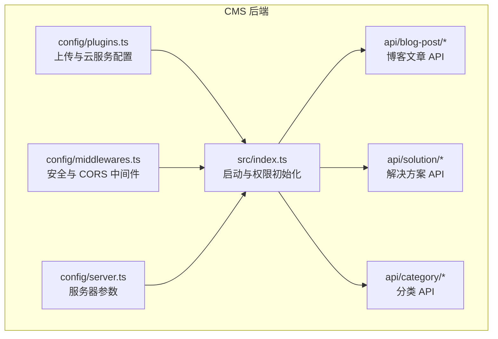
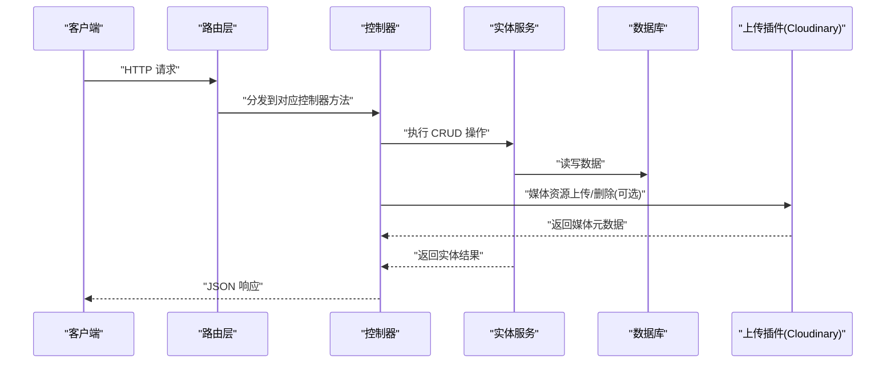
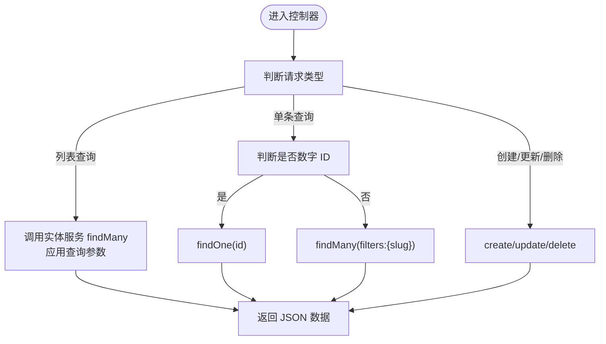
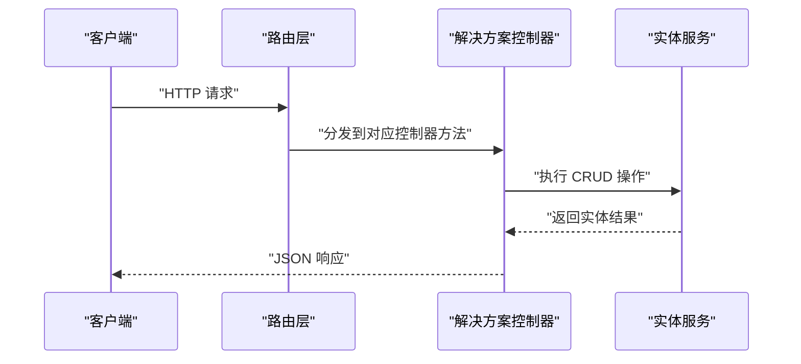
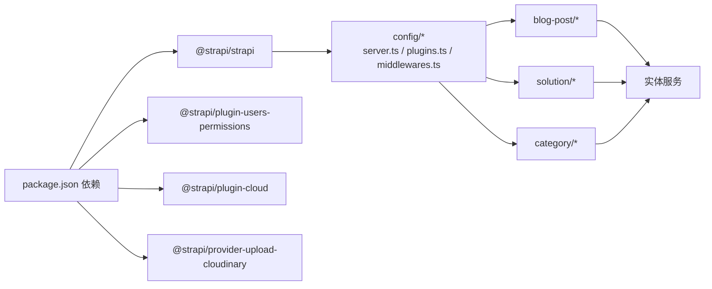

# 内容 API

<cite>
**本文引用的文件**
- [cms/src/index.ts](file://cms/src/index.ts)
- [cms/src/api/blog-post/content-types/blog-post/schema.json](file://cms/src/api/blog-post/content-types/blog-post/schema.json)
- [cms/src/api/blog-post/controllers/blog-post.ts](file://cms/src/api/blog-post/controllers/blog-post.ts)
- [cms/src/api/blog-post/routes/blog-post.ts](file://cms/src/api/blog-post/routes/blog-post.ts)
- [cms/src/api/solution/controllers/solution.ts](file://cms/src/api/solution/controllers/solution.ts)
- [cms/src/api/solution/routes/solution.ts](file://cms/src/api/solution/routes/solution.ts)
- [cms/src/api/category/content-types/category/schema.json](file://cms/src/api/category/content-types/category/schema.json)
- [cms/src/api/category/controllers/category.ts](file://cms/src/api/category/controllers/category.ts)
- [cms/src/api/category/routes/category.ts](file://cms/src/api/category/routes/category.ts)
- [cms/config/server.ts](file://cms/config/server.ts)
- [cms/config/plugins.ts](file://cms/config/plugins.ts)
- [cms/config/middlewares.ts](file://cms/config/middlewares.ts)
- [cms/package.json](file://cms/package.json)
</cite>

## 目录
1. [简介](#简介)
2. [项目结构](#项目结构)
3. [核心组件](#核心组件)
4. [架构总览](#架构总览)
5. [详细组件分析](#详细组件分析)
6. [依赖关系分析](#依赖关系分析)
7. [性能考虑](#性能考虑)
8. [故障排查指南](#故障排查指南)
9. [结论](#结论)
10. [附录](#附录)

## 简介
本文件为内容管理相关 API 的权威接口文档，覆盖博客文章与解决方案内容的管理端点，包括内容获取、创建、更新、删除的完整规范；详细说明内容数据模型、多语言支持现状、SEO 优化字段、媒体资源关联等；包含内容发布状态管理（草稿与发布）、版本控制现状说明、内容检索与过滤功能的使用说明；提供内容分类、标签等高级功能的实现示例；记录内容权限控制与内容审核流程现状。

本项目基于 Strapi v5 构建，采用 Headless CMS 架构，后端通过控制器与路由暴露 REST 风格 API，前端 Next.js 应用通过 Strapi 提供的数据模型进行内容消费。

## 项目结构
后端 CMS 位于 cms/ 目录，采用模块化组织方式：每个内容类型（如 blog-post、solution、category）均包含内容类型定义、控制器、路由和服务层。系统通过插件与中间件配置实现上传、安全策略、CORS 等能力。

图表来源
- [cms/src/index.ts:149-217](file://cms/src/index.ts#L149-L217)
- [cms/src/api/blog-post/routes/blog-post.ts:1-35](file://cms/src/api/blog-post/routes/blog-post.ts#L1-L35)
- [cms/src/api/solution/routes/solution.ts:1-35](file://cms/src/api/solution/routes/solution.ts#L1-L35)
- [cms/src/api/category/routes/category.ts:1-50](file://cms/src/api/category/routes/category.ts#L1-L50)
- [cms/config/plugins.ts:1-19](file://cms/config/plugins.ts#L1-L19)
- [cms/config/middlewares.ts:1-32](file://cms/config/middlewares.ts#L1-L32)
- [cms/config/server.ts:1-11](file://cms/config/server.ts#L1-L11)

章节来源
- [cms/src/index.ts:149-217](file://cms/src/index.ts#L149-L217)
- [cms/src/api/blog-post/routes/blog-post.ts:1-35](file://cms/src/api/blog-post/routes/blog-post.ts#L1-L35)
- [cms/src/api/solution/routes/solution.ts:1-35](file://cms/src/api/solution/routes/solution.ts#L1-L35)
- [cms/src/api/category/routes/category.ts:1-50](file://cms/src/api/category/routes/category.ts#L1-L50)
- [cms/config/plugins.ts:1-19](file://cms/config/plugins.ts#L1-L19)
- [cms/config/middlewares.ts:1-32](file://cms/config/middlewares.ts#L1-L32)
- [cms/config/server.ts:1-11](file://cms/config/server.ts#L1-L11)

## 核心组件
- 博客文章（Blog Post）
  - 数据模型：标题、别名、摘要、富文本内容、封面图、作者名、标签、SEO 标题、SEO 描述
  - 发布状态：支持草稿与发布
  - 端点：GET /blog-posts、GET /blog-posts/:id、POST /blog-posts、PUT /blog-posts/:id、DELETE /blog-posts/:id
  - 控制器：统一调用实体服务完成 CRUD 操作
- 解决方案（Solution）
  - 数据模型：未在服务层声明具体字段，但具备标准 CRUD 端点
  - 端点：GET /solutions、GET /solutions/:id、POST /solutions、PUT /solutions/:id、DELETE /solutions/:id
  - 控制器：统一调用实体服务完成 CRUD 操作
- 分类（Category）
  - 数据模型：名称、别名、描述、图片、SEO 标题、SEO 描述
  - 发布状态：支持草稿与发布
  - 端点：GET /categories、GET /categories/:id、POST /categories、PUT /categories/:id、DELETE /categories/:id
  - 控制器：统一调用实体服务完成 CRUD 操作

章节来源
- [cms/src/api/blog-post/content-types/blog-post/schema.json:1-24](file://cms/src/api/blog-post/content-types/blog-post/schema.json#L1-L24)
- [cms/src/api/blog-post/controllers/blog-post.ts:1-53](file://cms/src/api/blog-post/controllers/blog-post.ts#L1-L53)
- [cms/src/api/blog-post/routes/blog-post.ts:1-35](file://cms/src/api/blog-post/routes/blog-post.ts#L1-L35)
- [cms/src/api/solution/controllers/solution.ts:1-40](file://cms/src/api/solution/controllers/solution.ts#L1-L40)
- [cms/src/api/solution/routes/solution.ts:1-35](file://cms/src/api/solution/routes/solution.ts#L1-L35)
- [cms/src/api/category/content-types/category/schema.json:1-21](file://cms/src/api/category/content-types/category/schema.json#L1-L21)
- [cms/src/api/category/controllers/category.ts:1-40](file://cms/src/api/category/controllers/category.ts#L1-L40)
- [cms/src/api/category/routes/category.ts:1-50](file://cms/src/api/category/routes/category.ts#L1-L50)

## 架构总览
下图展示了内容 API 的端到端交互：客户端请求经由路由映射到控制器，控制器通过 Strapi 实体服务访问数据库，媒体资源通过 Cloudinary 上传插件处理。

图表来源
- [cms/src/api/blog-post/routes/blog-post.ts:1-35](file://cms/src/api/blog-post/routes/blog-post.ts#L1-L35)
- [cms/src/api/blog-post/controllers/blog-post.ts:1-53](file://cms/src/api/blog-post/controllers/blog-post.ts#L1-L53)
- [cms/config/plugins.ts:1-19](file://cms/config/plugins.ts#L1-L19)

章节来源
- [cms/src/api/blog-post/routes/blog-post.ts:1-35](file://cms/src/api/blog-post/routes/blog-post.ts#L1-L35)
- [cms/src/api/blog-post/controllers/blog-post.ts:1-53](file://cms/src/api/blog-post/controllers/blog-post.ts#L1-L53)
- [cms/config/plugins.ts:1-19](file://cms/config/plugins.ts#L1-L19)

## 详细组件分析

### 博客文章 API
- 数据模型与字段
  - 标题、别名、摘要、富文本内容、封面图、作者名、标签、SEO 标题、SEO 描述
  - 发布状态：启用草稿与发布
- 端点与行为
  - GET /blog-posts：列表查询，支持过滤、排序、分页等查询参数
  - GET /blog-posts/:id：单条查询，支持按 ID 或别名两种形式
  - POST /blog-posts：创建内容
  - PUT /blog-posts/:id：更新内容
  - DELETE /blog-posts/:id：删除内容
- 查询与过滤
  - 支持通过 ctx.query 透传到实体服务，实现过滤、排序、分页等
  - findOne 对别名与数字 ID 进行区分处理
- 媒体资源
  - 封面图为单张图片媒体字段，配合上传插件使用
- SEO 字段
  - 提供 SEO 标题与 SEO 描述字段，便于前端 SEO 优化

图表来源
- [cms/src/api/blog-post/controllers/blog-post.ts:1-53](file://cms/src/api/blog-post/controllers/blog-post.ts#L1-L53)

章节来源
- [cms/src/api/blog-post/content-types/blog-post/schema.json:1-24](file://cms/src/api/blog-post/content-types/blog-post/schema.json#L1-L24)
- [cms/src/api/blog-post/controllers/blog-post.ts:1-53](file://cms/src/api/blog-post/controllers/blog-post.ts#L1-L53)
- [cms/src/api/blog-post/routes/blog-post.ts:1-35](file://cms/src/api/blog-post/routes/blog-post.ts#L1-L35)

### 解决方案 API
- 数据模型
  - 服务层未声明具体字段，遵循通用 CRUD 端点
- 端点与行为
  - GET /solutions、GET /solutions/:id、POST /solutions、PUT /solutions/:id、DELETE /solutions/:id
  - 控制器统一调用实体服务完成操作

图表来源
- [cms/src/api/solution/routes/solution.ts:1-35](file://cms/src/api/solution/routes/solution.ts#L1-L35)
- [cms/src/api/solution/controllers/solution.ts:1-40](file://cms/src/api/solution/controllers/solution.ts#L1-L40)

章节来源
- [cms/src/api/solution/controllers/solution.ts:1-40](file://cms/src/api/solution/controllers/solution.ts#L1-L40)
- [cms/src/api/solution/routes/solution.ts:1-35](file://cms/src/api/solution/routes/solution.ts#L1-L35)

### 分类 API
- 数据模型与字段
  - 名称、别名、描述、图片、SEO 标题、SEO 描述
  - 发布状态：启用草稿与发布
- 端点与行为
  - GET /categories、GET /categories/:id、POST /categories、PUT /categories/:id、DELETE /categories/:id
  - 控制器统一调用实体服务完成操作

章节来源
- [cms/src/api/category/content-types/category/schema.json:1-21](file://cms/src/api/category/content-types/category/schema.json#L1-L21)
- [cms/src/api/category/controllers/category.ts:1-40](file://cms/src/api/category/controllers/category.ts#L1-L40)
- [cms/src/api/category/routes/category.ts:1-50](file://cms/src/api/category/routes/category.ts#L1-L50)

### 权限控制与内容审核
- 公共 API 权限
  - 启动时自动为公共角色授予分类、产品、博客文章、解决方案的读取权限，以及公开表单提交的创建权限
- 审核与发布
  - 博客文章与分类启用草稿与发布机制，可通过管理后台切换发布状态
- 用户权限插件
  - 使用 users-permissions 插件，支持角色与权限管理

章节来源
- [cms/src/index.ts:161-217](file://cms/src/index.ts#L161-L217)
- [cms/src/api/blog-post/content-types/blog-post/schema.json:9-11](file://cms/src/api/blog-post/content-types/blog-post/schema.json#L9-L11)
- [cms/src/api/category/content-types/category/schema.json:9-11](file://cms/src/api/category/content-types/category/schema.json#L9-L11)
- [package.json:14-25](file://cms/package.json#L14-L25)

### 多语言支持
- 当前内容模型未显式声明多语言字段或本地化策略
- 若需多语言，请在内容类型中添加 locale 与 localizations 关系，并在控制器中处理语言参数

章节来源
- [cms/src/api/blog-post/content-types/blog-post/schema.json:1-24](file://cms/src/api/blog-post/content-types/blog-post/schema.json#L1-L24)
- [cms/src/api/category/content-types/category/schema.json:1-21](file://cms/src/api/category/content-types/category/schema.json#L1-L21)

### 版本控制
- 当前未实现内容版本历史管理
- 如需版本控制，可在内容类型中引入版本字段或独立版本集合，并在控制器中扩展保存与回滚逻辑

章节来源
- [cms/src/api/blog-post/controllers/blog-post.ts:1-53](file://cms/src/api/blog-post/controllers/blog-post.ts#L1-L53)
- [cms/src/api/solution/controllers/solution.ts:1-40](file://cms/src/api/solution/controllers/solution.ts#L1-L40)
- [cms/src/api/category/controllers/category.ts:1-40](file://cms/src/api/category/controllers/category.ts#L1-L40)

### 内容检索与过滤
- 列表查询
  - 通过 ctx.query 传递过滤条件、排序、分页等参数
- 单条查询
  - 支持按 ID 数字或别名两种方式查询
- 示例
  - 获取已发布的博客文章：filters[publishedAt][_not_null]=true
  - 按标签过滤：filters[tags][$containsi]=关键词
  - 分页：pagination[page]=1&pagination[pageSize]=10
  - 排序：sort=title

章节来源
- [cms/src/api/blog-post/controllers/blog-post.ts:1-53](file://cms/src/api/blog-post/controllers/blog-post.ts#L1-L53)
- [cms/src/api/solution/routes/solution.ts:1-35](file://cms/src/api/solution/routes/solution.ts#L1-L35)
- [cms/src/api/category/routes/category.ts:1-50](file://cms/src/api/category/routes/category.ts#L1-L50)

### 高级功能示例

#### 内容分类与标签
- 分类
  - 通过分类 API 创建与维护分类，博客文章与产品可关联分类
- 标签
  - 博客文章提供标签 JSON 字段，可用于前端展示与筛选

章节来源
- [cms/src/api/category/content-types/category/schema.json:1-21](file://cms/src/api/category/content-types/category/schema.json#L1-L21)
- [cms/src/api/blog-post/content-types/blog-post/schema.json:19](file://cms/src/api/blog-post/content-types/blog-post/schema.json#L19)

#### 关联内容
- 产品与分类的关系：产品内容类型通过关系字段关联分类
- 建议：在博客文章中增加关联内容字段以实现相关内容推荐

章节来源
- [cms/src/index.ts:267-311](file://cms/src/index.ts#L267-L311)

#### 媒体资源关联
- 封面图与分类图片均为媒体字段，支持单张图片
- 上传插件：Cloudinary，支持上传与删除

章节来源
- [cms/src/api/blog-post/content-types/blog-post/schema.json:17](file://cms/src/api/blog-post/content-types/blog-post/schema.json#L17)
- [cms/src/api/category/content-types/category/schema.json:16](file://cms/src/api/category/content-types/category/schema.json#L16)
- [cms/config/plugins.ts:1-19](file://cms/config/plugins.ts#L1-L19)

## 依赖关系分析

图表来源
- [cms/package.json:14-25](file://cms/package.json#L14-L25)
- [cms/config/server.ts:1-11](file://cms/config/server.ts#L1-L11)
- [cms/config/plugins.ts:1-19](file://cms/config/plugins.ts#L1-L19)
- [cms/config/middlewares.ts:1-32](file://cms/config/middlewares.ts#L1-L32)

章节来源
- [cms/package.json:14-25](file://cms/package.json#L14-L25)
- [cms/config/server.ts:1-11](file://cms/config/server.ts#L1-L11)
- [cms/config/plugins.ts:1-19](file://cms/config/plugins.ts#L1-L19)
- [cms/config/middlewares.ts:1-32](file://cms/config/middlewares.ts#L1-L32)

## 性能考虑
- 查询参数优化
  - 合理使用 filters、sort、pagination，避免一次性返回大量数据
- 媒体资源
  - 使用 CDN（Cloudinary）加速图片加载，注意缓存策略
- 缓存
  - 在前端或网关层对静态内容进行缓存，减少重复请求
- 并发与事务
  - 批量导入或更新时，建议使用事务或批量操作以提升吞吐

## 故障排查指南
- CORS 问题
  - 当前中间件允许任意来源，若部署到生产环境建议限制来源
- 上传失败
  - 检查 Cloudinary 配置项是否正确，确保密钥与云名称有效
- 权限不足
  - 确认公共角色是否已授权相应 API 权限
- 发布状态异常
  - 检查草稿与发布字段是否正确设置

章节来源
- [cms/config/middlewares.ts:18-24](file://cms/config/middlewares.ts#L18-L24)
- [cms/config/plugins.ts:1-19](file://cms/config/plugins.ts#L1-L19)
- [cms/src/index.ts:161-217](file://cms/src/index.ts#L161-L217)

## 结论
本内容 API 提供了博客文章与解决方案的基础管理能力，结合分类体系与媒体资源插件，能够满足常见内容管理需求。当前未实现多语言、版本控制与关联内容字段，建议在内容类型中扩展相应字段并在控制器中完善业务逻辑。权限与发布机制已就绪，可直接用于生产环境。

## 附录

### 端点一览（按模块）

- 博客文章
  - GET /blog-posts
  - GET /blog-posts/:id
  - POST /blog-posts
  - PUT /blog-posts/:id
  - DELETE /blog-posts/:id
- 解决方案
  - GET /solutions
  - GET /solutions/:id
  - POST /solutions
  - PUT /solutions/:id
  - DELETE /solutions/:id
- 分类
  - GET /categories
  - GET /categories/:id
  - POST /categories
  - PUT /categories/:id
  - DELETE /categories/:id

章节来源
- [cms/src/api/blog-post/routes/blog-post.ts:1-35](file://cms/src/api/blog-post/routes/blog-post.ts#L1-L35)
- [cms/src/api/solution/routes/solution.ts:1-35](file://cms/src/api/solution/routes/solution.ts#L1-L35)
- [cms/src/api/category/routes/category.ts:1-50](file://cms/src/api/category/routes/category.ts#L1-L50)