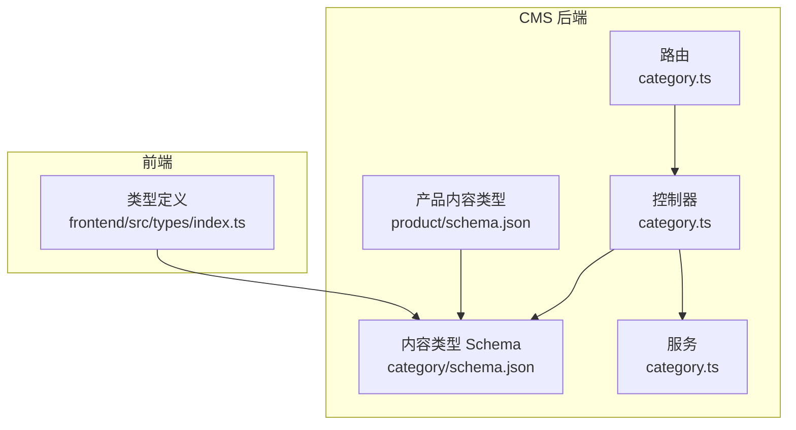
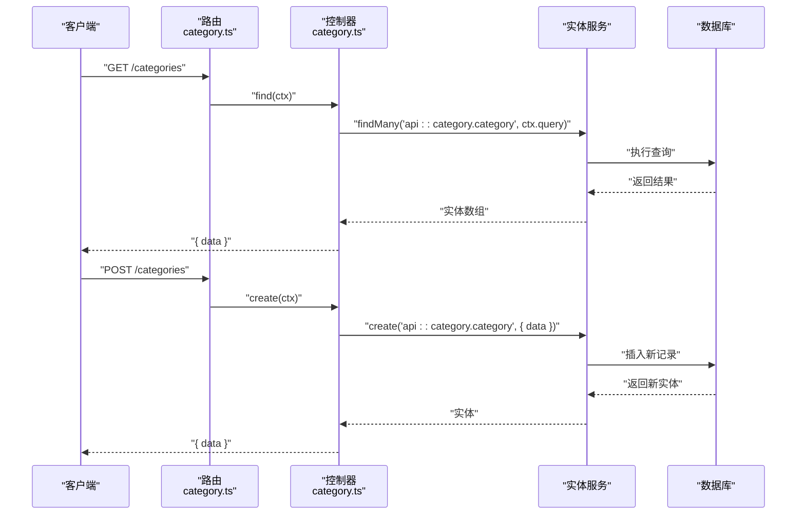
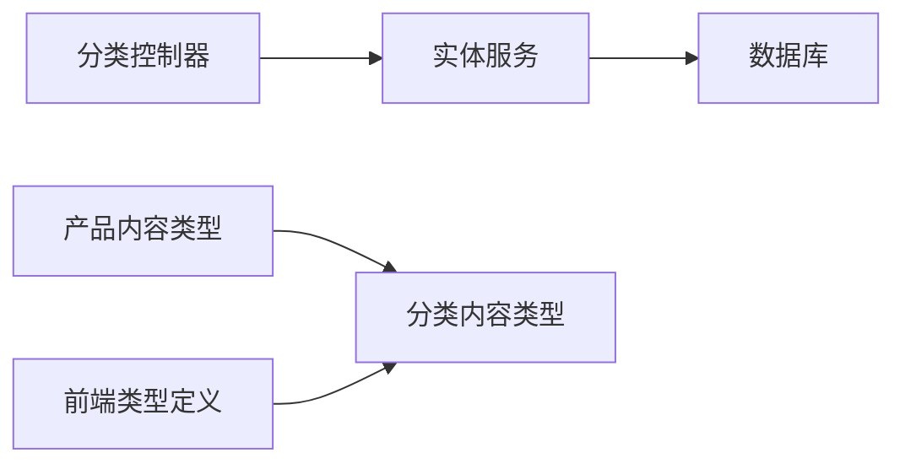

# 分类 API

<cite>
**本文引用的文件**
- [schema.json](file://cms/src/api/category/content-types/category/schema.json)
- [category.ts](file://cms/src/api/category/controllers/category.ts)
- [category.ts](file://cms/src/api/category/routes/category.ts)
- [category.ts](file://cms/src/api/category/services/category.ts)
- [schema.json](file://cms/src/api/product/content-types/product/schema.json)
- [product.ts](file://cms/src/api/product/controllers/product.ts)
- [middlewares.ts](file://cms/config/middlewares.ts)
- [admin.ts](file://cms/config/admin.ts)
- [plugins.ts](file://cms/config/plugins.ts)
- [index.ts](file://frontend/src/types/index.ts)
</cite>

## 目录
1. [简介](#简介)
2. [项目结构](#项目结构)
3. [核心组件](#核心组件)
4. [架构总览](#架构总览)
5. [详细组件分析](#详细组件分析)
6. [依赖分析](#依赖分析)
7. [性能考虑](#性能考虑)
8. [故障排查指南](#故障排查指南)
9. [结论](#结论)
10. [附录](#附录)

## 简介
本文件为分类（Category）相关 API 的详细接口文档，覆盖分类管理的完整端点：获取分类列表、获取分类详情、创建分类、更新分类、删除分类。同时说明分类数据模型、与产品（Product）的关联关系、查询参数与分页机制、以及如何在前端进行类型化消费。由于当前代码库未实现分类层级关系（父子分类）与专门的分类树形查询接口，本文将明确指出该能力现状，并给出可扩展建议。

## 项目结构
分类 API 位于 CMS 后端的 Strapi 应用中，采用标准的“内容类型 + 控制器 + 路由 + 服务”的分层组织方式；前端通过 TypeScript 类型定义消费分类数据。

图表来源
- [category.ts:1-50](file://cms/src/api/category/routes/category.ts#L1-L50)
- [category.ts:1-40](file://cms/src/api/category/controllers/category.ts#L1-L40)
- [schema.json:1-21](file://cms/src/api/category/content-types/category/schema.json#L1-L21)
- [category.ts:1-2](file://cms/src/api/category/services/category.ts#L1-L2)
- [schema.json:1-33](file://cms/src/api/product/content-types/product/schema.json#L1-L33)
- [index.ts:45-52](file://frontend/src/types/index.ts#L45-L52)

章节来源
- [category.ts:1-50](file://cms/src/api/category/routes/category.ts#L1-L50)
- [category.ts:1-40](file://cms/src/api/category/controllers/category.ts#L1-L40)
- [schema.json:1-21](file://cms/src/api/category/content-types/category/schema.json#L1-L21)
- [category.ts:1-2](file://cms/src/api/category/services/category.ts#L1-L2)
- [schema.json:1-33](file://cms/src/api/product/content-types/product/schema.json#L1-L33)
- [index.ts:45-52](file://frontend/src/types/index.ts#L45-L52)

## 核心组件
- 路由层：定义分类资源的 REST 端点，支持 GET/POST/PUT/DELETE。
- 控制器层：封装对实体服务的调用，透传查询参数与请求体。
- 内容类型：定义分类字段、唯一性约束与 UID 生成规则。
- 服务层：当前为空实现，预留扩展点。
- 前端类型：定义 Category 接口，用于类型安全消费。

章节来源
- [category.ts:1-50](file://cms/src/api/category/routes/category.ts#L1-L50)
- [category.ts:1-40](file://cms/src/api/category/controllers/category.ts#L1-L40)
- [schema.json:12-19](file://cms/src/api/category/content-types/category/schema.json#L12-L19)
- [category.ts:1-2](file://cms/src/api/category/services/category.ts#L1-L2)
- [index.ts:45-52](file://frontend/src/types/index.ts#L45-L52)

## 架构总览
下图展示从客户端到后端的典型请求流程，以及分类与产品之间的关系。

图表来源
- [category.ts:1-50](file://cms/src/api/category/routes/category.ts#L1-L50)
- [category.ts:4-8](file://cms/src/api/category/controllers/category.ts#L4-L8)

## 详细组件分析

### 数据模型与字段规范
- 分类内容类型字段
  - 名称：字符串，必填且唯一
  - 别名（UID）：基于名称生成，必填
  - 描述：文本
  - 图片：单媒体（图片）
  - SEO 标题与描述：字符串与文本
- 产品内容类型中的分类字段
  - 多分类字段：manyToOne 关系指向分类
- 前端类型
  - Category 接口包含 id、name、slug、description、image、parentCategory（可选）

章节来源
- [schema.json:12-19](file://cms/src/api/category/content-types/category/schema.json#L12-L19)
- [schema.json:28-28](file://cms/src/api/product/content-types/product/schema.json#L28-L28)
- [index.ts:45-52](file://frontend/src/types/index.ts#L45-L52)

### 端点规范

- 获取分类列表
  - 方法与路径：GET /categories
  - 查询参数：支持 Strapi 实体查询参数（如过滤、排序、分页、populate 等）
  - 返回：包含 data 数组的对象
- 获取分类详情
  - 方法与路径：GET /categories/:id
  - 参数：路径参数 id
  - 返回：包含 data 的对象
- 创建分类
  - 方法与路径：POST /categories
  - 请求体：data 字段承载分类数据
  - 返回：包含新建实体 data
- 更新分类
  - 方法与路径：PUT /categories/:id
  - 参数：路径参数 id
  - 请求体：data 字段承载更新数据
  - 返回：包含更新后的实体 data
- 删除分类
  - 方法与路径：DELETE /categories/:id
  - 参数：路径参数 id
  - 返回：被删除实体 data

章节来源
- [category.ts:1-50](file://cms/src/api/category/routes/category.ts#L1-L50)
- [category.ts:4-38](file://cms/src/api/category/controllers/category.ts#L4-L38)

### 查询参数、排序与分页
- 查询参数透传：控制器直接将 ctx.query 透传给实体服务，因此可使用 Strapi 默认查询能力，包括但不限于：
  - 过滤：如 name_eq、slug_like 等
  - 排序：如 _sort=name:asc 或 _sort=createdAt:desc
  - 分页：如 _page=1&_limit=10
  - 关联填充：populate 支持（例如 populate=*）
- 注意：具体可用参数取决于内容类型与实体服务行为。

章节来源
- [category.ts:5-7](file://cms/src/api/category/controllers/category.ts#L5-L7)
- [category.ts:5-7](file://cms/src/api/product/controllers/product.ts#L5-L7)

### 分类与产品关联
- 产品内容类型中存在多对一关系字段 category → api::category.category
- 可通过 populate 关联查询获取分类信息，或在产品查询时按分类过滤

章节来源
- [schema.json:28-28](file://cms/src/api/product/content-types/product/schema.json#L28-L28)

### 权限控制与安全中间件
- 当前路由配置未启用策略与中间件（policies 与 middlewares 均为空数组）
- 安全中间件已启用 CORS、CSP、错误处理等基础安全配置
- 管理员 JWT 与 API Token 配置位于 admin.ts 与 plugins.ts 中

章节来源
- [category.ts:7-10](file://cms/src/api/category/routes/category.ts#L7-L10)
- [middlewares.ts:1-32](file://cms/config/middlewares.ts#L1-L32)
- [admin.ts:1-21](file://cms/config/admin.ts#L1-L21)
- [plugins.ts:1-19](file://cms/config/plugins.ts#L1-L19)

### 高级功能与扩展建议
- 分类树形结构获取
  - 现状：当前未实现父子分类层级字段与树形查询接口
  - 建议：在内容类型中新增 parent 字段（relation to self），并在控制器中实现递归查询或构建树形结构的服务方法
- 分类筛选产品
  - 现状：可通过产品内容类型的 category 字段进行过滤
  - 建议：在产品控制器中增加按分类 ID 过滤的查询参数与示例

章节来源
- [schema.json:12-19](file://cms/src/api/category/content-types/category/schema.json#L12-L19)
- [schema.json:28-28](file://cms/src/api/product/content-types/product/schema.json#L28-L28)

## 依赖分析
- 分类控制器依赖实体服务进行 CRUD 操作
- 产品内容类型依赖分类内容类型（多对一关系）
- 前端类型定义依赖分类内容类型字段结构

图表来源
- [category.ts:1-40](file://cms/src/api/category/controllers/category.ts#L1-L40)
- [schema.json:1-21](file://cms/src/api/category/content-types/category/schema.json#L1-L21)
- [schema.json:1-33](file://cms/src/api/product/content-types/product/schema.json#L1-L33)
- [index.ts:45-52](file://frontend/src/types/index.ts#L45-L52)

章节来源
- [category.ts:1-40](file://cms/src/api/category/controllers/category.ts#L1-L40)
- [schema.json:1-21](file://cms/src/api/category/content-types/category/schema.json#L1-L21)
- [schema.json:1-33](file://cms/src/api/product/content-types/product/schema.json#L1-L33)
- [index.ts:45-52](file://frontend/src/types/index.ts#L45-L52)

## 性能考虑
- 使用 populate 时注意避免过度加载，仅在需要时填充关联字段
- 对高频查询建立合适的索引（如 name、slug）
- 合理设置分页大小，避免一次性返回过多数据
- 在前端缓存静态分类数据，减少重复请求

## 故障排查指南
- 404 Not Found：确认路径参数 id 存在且有效
- 400 Bad Request：检查请求体 data 结构是否符合内容类型 schema
- 401/403：若后续启用策略，请确认鉴权凭据与令牌配置
- CORS 问题：当前已启用宽松 CORS 配置，若仍异常请检查代理与网络环境
- 媒体上传：Cloudinary 提供商已配置，若上传失败请检查凭证与网络

章节来源
- [category.ts:19-38](file://cms/src/api/category/controllers/category.ts#L19-L38)
- [middlewares.ts:18-24](file://cms/config/middlewares.ts#L18-L24)
- [plugins.ts:3-16](file://cms/config/plugins.ts#L3-L16)

## 结论
当前分类 API 提供了完整的 CRUD 端点与基础查询能力，满足日常分类管理需求。若需更丰富的功能（如层级关系、树形查询、按分类筛选产品等），可在现有控制器与内容类型基础上进行扩展，保持与前端类型定义的一致性。

## 附录

### API 端点一览
- GET /categories
- GET /categories/:id
- POST /categories
- PUT /categories/:id
- DELETE /categories/:id

章节来源
- [category.ts:1-50](file://cms/src/api/category/routes/category.ts#L1-L50)