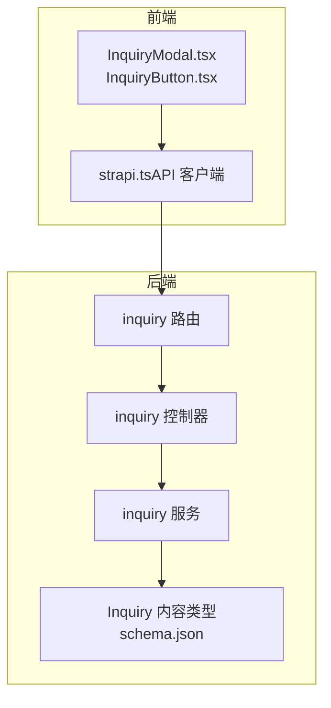
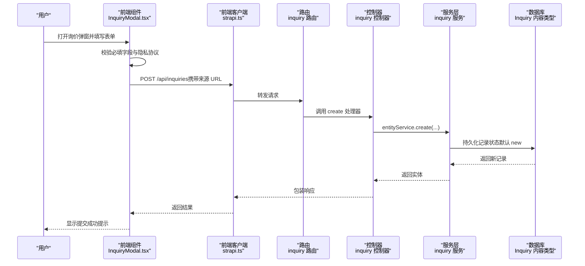
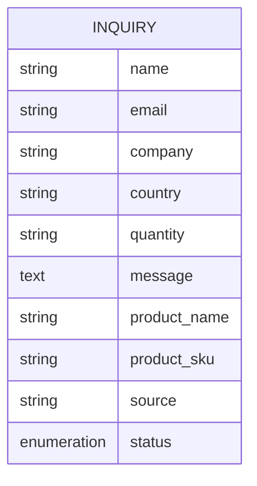
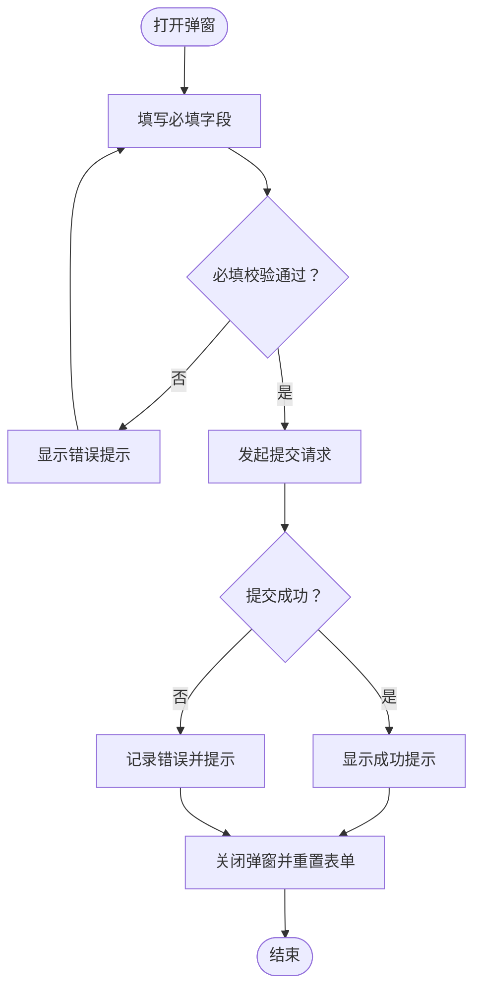
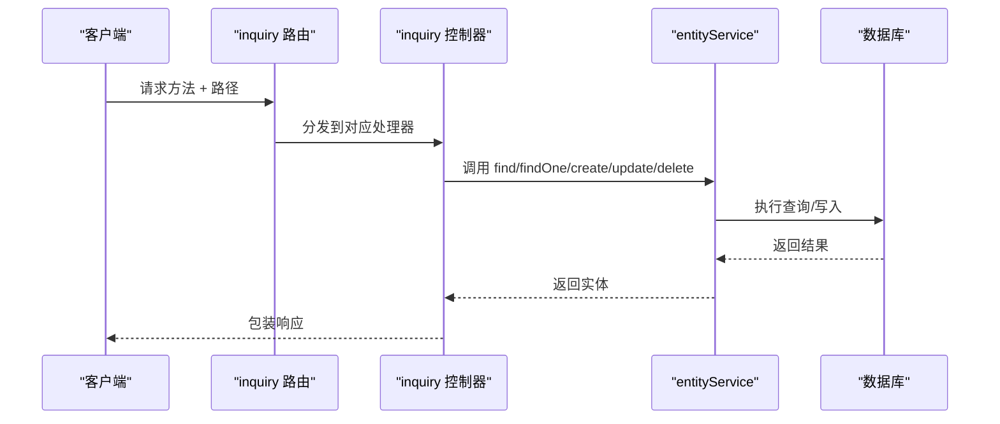
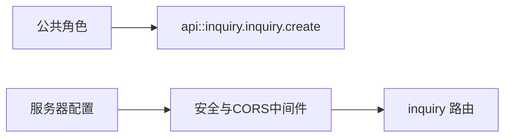
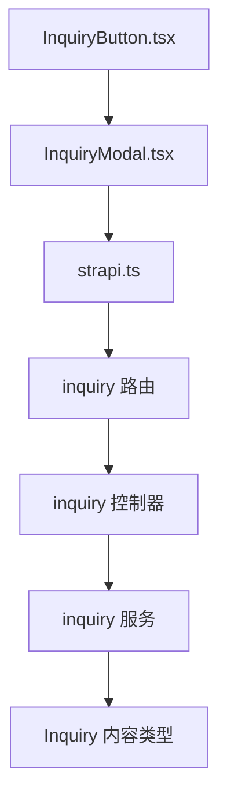

# 询价 API

<cite>
**本文引用的文件**
- [schema.json](file://cms/src/api/inquiry/content-types/inquiry/schema.json)
- [inquiry.ts（控制器）](file://cms/src/api/inquiry/controllers/inquiry.ts)
- [inquiry.ts（路由）](file://cms/src/api/inquiry/routes/inquiry.ts)
- [inquiry.ts（服务）](file://cms/src/api/inquiry/services/inquiry.ts)
- [strapi.ts（前端客户端）](file://frontend/src/lib/strapi.ts)
- [InquiryModal.tsx（前端组件）](file://frontend/src/components/forms/InquiryModal.tsx)
- [InquiryButton.tsx（前端组件）](file://frontend/src/components/forms/InquiryButton.tsx)
- [index.ts（CMS 引导与权限）](file://cms/src/index.ts)
- [middlewares.ts（中间件）](file://cms/config/middlewares.ts)
- [server.ts（服务器配置）](file://cms/config/server.ts)
- [plugins.ts（插件配置）](file://cms/config/plugins.ts)
</cite>

## 目录
1. [简介](#简介)
2. [项目结构](#项目结构)
3. [核心组件](#核心组件)
4. [架构总览](#架构总览)
5. [详细组件分析](#详细组件分析)
6. [依赖关系分析](#依赖关系分析)
7. [性能考量](#性能考量)
8. [故障排查指南](#故障排查指南)
9. [结论](#结论)
10. [附录：接口规范与使用示例](#附录接口规范与使用示例)

## 简介
本文件面向“询价”相关 API 的设计与使用，覆盖以下内容：
- 询价表单提交与记录管理的端点规范
- 询价数据模型、字段定义与业务约束
- 客户信息与产品关联字段的来源与用途
- 询价状态跟踪与默认值
- 表单验证规则与前端交互流程
- 邮件通知集成现状与建议
- 批量处理、导出与状态统计等管理能力的扩展建议
- 数据安全与隐私保护措施

## 项目结构
该系统采用前后端分离架构：
- 前端 Next.js 应用负责用户交互与表单提交
- 后端 Strapi CMS 提供内容类型与 API 路由
- 通过中间件与权限配置保障公开访问与安全策略

图表来源
- [inquiry.ts（路由）:1-35](file://cms/src/api/inquiry/routes/inquiry.ts#L1-L35)
- [inquiry.ts（控制器）:1-40](file://cms/src/api/inquiry/controllers/inquiry.ts#L1-L40)
- [inquiry.ts（服务）:1-2](file://cms/src/api/inquiry/services/inquiry.ts#L1-L2)
- [schema.json:1-25](file://cms/src/api/inquiry/content-types/inquiry/schema.json#L1-L25)
- [strapi.ts（前端客户端）:290-306](file://frontend/src/lib/strapi.ts#L290-L306)

章节来源
- [inquiry.ts（路由）:1-35](file://cms/src/api/inquiry/routes/inquiry.ts#L1-L35)
- [inquiry.ts（控制器）:1-40](file://cms/src/api/inquiry/controllers/inquiry.ts#L1-L40)
- [inquiry.ts（服务）:1-2](file://cms/src/api/inquiry/services/inquiry.ts#L1-L2)
- [schema.json:1-25](file://cms/src/api/inquiry/content-types/inquiry/schema.json#L1-L25)
- [strapi.ts（前端客户端）:290-306](file://frontend/src/lib/strapi.ts#L290-L306)

## 核心组件
- 内容类型：Inquiry（询价）
  - 字段：名称、邮箱、公司、国家、数量、消息、产品名称、产品 SKU、来源、状态（枚举，默认 new）
- 路由：提供列表查询、详情查询、创建、更新、删除
- 控制器：封装实体服务调用
- 服务：当前为空，可扩展业务逻辑（如状态流转、通知）
- 前端：提供弹窗表单与提交入口，自动注入来源 URL

章节来源
- [schema.json:12-22](file://cms/src/api/inquiry/content-types/inquiry/schema.json#L12-L22)
- [inquiry.ts（路由）:4-32](file://cms/src/api/inquiry/routes/inquiry.ts#L4-L32)
- [inquiry.ts（控制器）:4-38](file://cms/src/api/inquiry/controllers/inquiry.ts#L4-L38)
- [InquiryModal.tsx（前端组件）:46-65](file://frontend/src/components/forms/InquiryModal.tsx#L46-L65)
- [strapi.ts（前端客户端）:290-306](file://frontend/src/lib/strapi.ts#L290-L306)

## 架构总览
下图展示从前端到后端的请求链路与数据流。

图表来源
- [InquiryModal.tsx（前端组件）:46-95](file://frontend/src/components/forms/InquiryModal.tsx#L46-L95)
- [strapi.ts（前端客户端）:290-306](file://frontend/src/lib/strapi.ts#L290-L306)
- [inquiry.ts（路由）:16-19](file://cms/src/api/inquiry/routes/inquiry.ts#L16-L19)
- [inquiry.ts（控制器）:19-24](file://cms/src/api/inquiry/controllers/inquiry.ts#L19-L24)
- [schema.json:22-22](file://cms/src/api/inquiry/content-types/inquiry/schema.json#L22-L22)

## 详细组件分析

### 数据模型与字段说明
- 名称（必填）
- 邮箱（必填，邮箱格式）
- 公司（可选）
- 国家（可选）
- 数量（可选；前端提供预设区间）
- 消息（必填，文本）
- 产品名称（可选；用于记录来源产品）
- 产品 SKU（可选；用于记录来源产品）
- 来源（可选；记录提交页面 URL）
- 状态（枚举：new、contacted、quoted、closed；默认 new）

图表来源
- [schema.json:12-22](file://cms/src/api/inquiry/content-types/inquiry/schema.json#L12-L22)

章节来源
- [schema.json:12-22](file://cms/src/api/inquiry/content-types/inquiry/schema.json#L12-L22)

### 前端表单与提交流程
- 表单字段与必填校验：名称、邮箱、消息、隐私协议勾选
- 自动注入来源 URL（window.location.href），便于后续追踪
- 提交成功后短暂提示并关闭弹窗，同时清空表单

图表来源
- [InquiryModal.tsx（前端组件）:46-95](file://frontend/src/components/forms/InquiryModal.tsx#L46-L95)
- [strapi.ts（前端客户端）:290-306](file://frontend/src/lib/strapi.ts#L290-L306)

章节来源
- [InquiryModal.tsx（前端组件）:22-95](file://frontend/src/components/forms/InquiryModal.tsx#L22-L95)
- [strapi.ts（前端客户端）:290-306](file://frontend/src/lib/strapi.ts#L290-L306)

### 后端控制器与路由
- GET /api/inquiries：分页查询
- GET /api/inquiries/:id：按 ID 查询
- POST /api/inquiries：创建询价记录
- PUT /api/inquiries/:id：更新记录
- DELETE /api/inquiries/:id：删除记录

图表来源
- [inquiry.ts（路由）:4-32](file://cms/src/api/inquiry/routes/inquiry.ts#L4-L32)
- [inquiry.ts（控制器）:4-38](file://cms/src/api/inquiry/controllers/inquiry.ts#L4-L38)

章节来源
- [inquiry.ts（路由）:1-35](file://cms/src/api/inquiry/routes/inquiry.ts#L1-L35)
- [inquiry.ts（控制器）:1-40](file://cms/src/api/inquiry/controllers/inquiry.ts#L1-L40)

### 权限与安全配置
- 公共角色具备“创建询价”的 API 权限，允许匿名提交
- 中间件启用安全策略（CSP）、跨域（CORS）与公共资源访问
- 服务器配置包含密钥与 Webhook 关系填充开关

图表来源
- [index.ts（CMS 引导与权限）:186-188](file://cms/src/index.ts#L186-L188)
- [middlewares.ts（中间件）:5-24](file://cms/config/middlewares.ts#L5-L24)
- [server.ts（服务器配置）:1-11](file://cms/config/server.ts#L1-L11)

章节来源
- [index.ts（CMS 引导与权限）:186-210](file://cms/src/index.ts#L186-L210)
- [middlewares.ts（中间件）:1-32](file://cms/config/middlewares.ts#L1-L32)
- [server.ts（服务器配置）:1-11](file://cms/config/server.ts#L1-L11)

## 依赖关系分析
- 前端依赖 strapi.ts 发起 API 请求，使用环境变量控制目标地址与鉴权头
- 前端组件通过 InquiryButton 与 InquiryModal 组合，形成统一的提交入口
- 后端路由直接映射到控制器，控制器委托 entityService 进行数据持久化
- 服务层当前为空，便于扩展业务逻辑（如状态机、通知）

图表来源
- [InquiryButton.tsx（前端组件）:14-54](file://frontend/src/components/forms/InquiryButton.tsx#L14-L54)
- [InquiryModal.tsx（前端组件）:15-107](file://frontend/src/components/forms/InquiryModal.tsx#L15-L107)
- [strapi.ts（前端客户端）:290-306](file://frontend/src/lib/strapi.ts#L290-L306)
- [inquiry.ts（路由）:1-35](file://cms/src/api/inquiry/routes/inquiry.ts#L1-L35)
- [inquiry.ts（控制器）:1-40](file://cms/src/api/inquiry/controllers/inquiry.ts#L1-L40)
- [inquiry.ts（服务）:1-2](file://cms/src/api/inquiry/services/inquiry.ts#L1-L2)
- [schema.json:1-25](file://cms/src/api/inquiry/content-types/inquiry/schema.json#L1-L25)

章节来源
- [InquiryButton.tsx（前端组件）:1-55](file://frontend/src/components/forms/InquiryButton.tsx#L1-L55)
- [InquiryModal.tsx（前端组件）:1-370](file://frontend/src/components/forms/InquiryModal.tsx#L1-L370)
- [strapi.ts（前端客户端）:1-412](file://frontend/src/lib/strapi.ts#L1-L412)
- [inquiry.ts（路由）:1-35](file://cms/src/api/inquiry/routes/inquiry.ts#L1-L35)
- [inquiry.ts（控制器）:1-40](file://cms/src/api/inquiry/controllers/inquiry.ts#L1-L40)
- [inquiry.ts（服务）:1-2](file://cms/src/api/inquiry/services/inquiry.ts#L1-L2)
- [schema.json:1-25](file://cms/src/api/inquiry/content-types/inquiry/schema.json#L1-L25)

## 性能考量
- 前端 API 客户端使用标准 fetch，支持可选 Bearer Token 与查询参数
- 中间件开启缓存友好配置（revalidate），有利于静态站点生成场景
- 建议在后端引入分页、过滤与排序参数，避免一次性返回大量记录
- 对高频查询可考虑缓存策略与索引优化（基于具体部署）

章节来源
- [strapi.ts（前端客户端）:51-119](file://frontend/src/lib/strapi.ts#L51-L119)
- [middlewares.ts（中间件）:1-32](file://cms/config/middlewares.ts#L1-L32)

## 故障排查指南
- 提交失败
  - 检查前端网络请求是否成功（状态码与响应体）
  - 确认后端 CORS 配置允许来源域名
  - 查看后端日志与错误中间件输出
- 字段缺失或格式不正确
  - 确认必填字段已填写且格式符合要求（邮箱）
  - 检查前端表单校验逻辑与必填标记
- 权限问题
  - 确认公共角色具备“创建询价”权限
  - 检查是否启用了鉴权 Token 并正确设置请求头

章节来源
- [strapi.ts（前端客户端）:109-118](file://frontend/src/lib/strapi.ts#L109-L118)
- [middlewares.ts（中间件）:18-24](file://cms/config/middlewares.ts#L18-L24)
- [index.ts（CMS 引导与权限）:186-210](file://cms/src/index.ts#L186-L210)

## 结论
本系统已实现基础的询价表单提交与记录管理能力，具备清晰的数据模型与前后端交互流程。建议后续在服务层增加状态机与通知机制，并结合后台管理界面实现批量处理、导出与统计功能，以满足运营与管理需求。

## 附录：接口规范与使用示例

### 接口清单
- 列表查询
  - 方法：GET
  - 路径：/api/inquiries
  - 查询参数：分页、排序、过滤（支持字符串、枚举、范围等）
- 单条查询
  - 方法：GET
  - 路径：/api/inquiries/:id
- 新增
  - 方法：POST
  - 路径：/api/inquiries
  - 请求体字段：name、email、company、country、quantity、message、product_name、product_sku、source
  - 默认状态：new
- 更新
  - 方法：PUT
  - 路径：/api/inquiries/:id
  - 请求体字段：同新增（可部分更新）
- 删除
  - 方法：DELETE
  - 路径：/api/inquiries/:id

章节来源
- [inquiry.ts（路由）:4-32](file://cms/src/api/inquiry/routes/inquiry.ts#L4-L32)
- [schema.json:12-22](file://cms/src/api/inquiry/content-types/inquiry/schema.json#L12-L22)

### 表单验证规则
- 必填字段：name、email、message、隐私协议勾选
- 邮箱格式：需符合邮箱格式
- 数量字段：前端提供预设区间选项
- 来源字段：由前端自动注入当前页面 URL

章节来源
- [InquiryModal.tsx（前端组件）:176-318](file://frontend/src/components/forms/InquiryModal.tsx#L176-L318)
- [strapi.ts（前端客户端）:290-306](file://frontend/src/lib/strapi.ts#L290-L306)

### 状态跟踪与默认值
- 状态枚举：new、contacted、quoted、closed
- 默认值：new
- 建议在服务层实现状态机，确保状态变更合法与可审计

章节来源
- [schema.json:22-22](file://cms/src/api/inquiry/content-types/inquiry/schema.json#L22-L22)

### 邮件通知集成
- 当前实现：服务层未实现通知逻辑
- 建议方案：
  - 在创建成功后触发异步任务（队列/钩子）
  - 使用 SMTP 或第三方邮件服务发送通知
  - 支持模板化邮件与收件人配置

章节来源
- [inquiry.ts（服务）:1-2](file://cms/src/api/inquiry/services/inquiry.ts#L1-L2)

### 批量处理、导出与统计（扩展建议）
- 批量处理
  - 批量更新状态：接收 ID 列表与目标状态，逐条更新并记录操作日志
  - 批量删除：按条件筛选并删除
- 导出
  - 支持按时间范围、状态、来源等条件导出 CSV/Excel
  - 可选字段：创建时间、来源、状态、联系信息
- 统计
  - 按状态分布统计
  - 按来源渠道统计
  - 按时间维度趋势统计

章节来源
- [inquiry.ts（控制器）:4-38](file://cms/src/api/inquiry/controllers/inquiry.ts#L4-L38)

### 数据安全与隐私保护
- CORS 配置：允许跨域访问，注意生产环境限制来源
- CSP：严格内容安全策略，限制资源加载来源
- 传输加密：建议使用 HTTPS
- 隐私合规：仅收集必要字段；明确用途与存储期限；提供删除与更正请求通道

章节来源
- [middlewares.ts（中间件）:5-24](file://cms/config/middlewares.ts#L5-L24)
- [server.ts（服务器配置）:1-11](file://cms/config/server.ts#L1-L11)
- [plugins.ts（插件配置）:1-19](file://cms/config/plugins.ts#L1-L19)