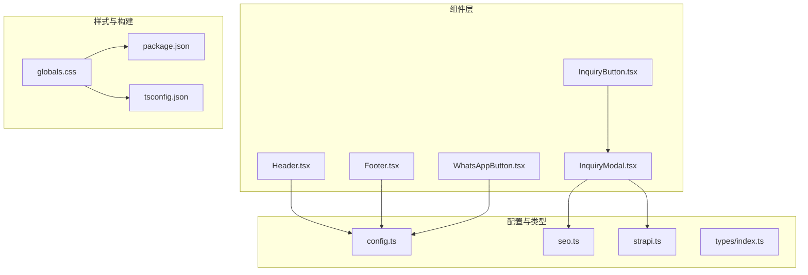
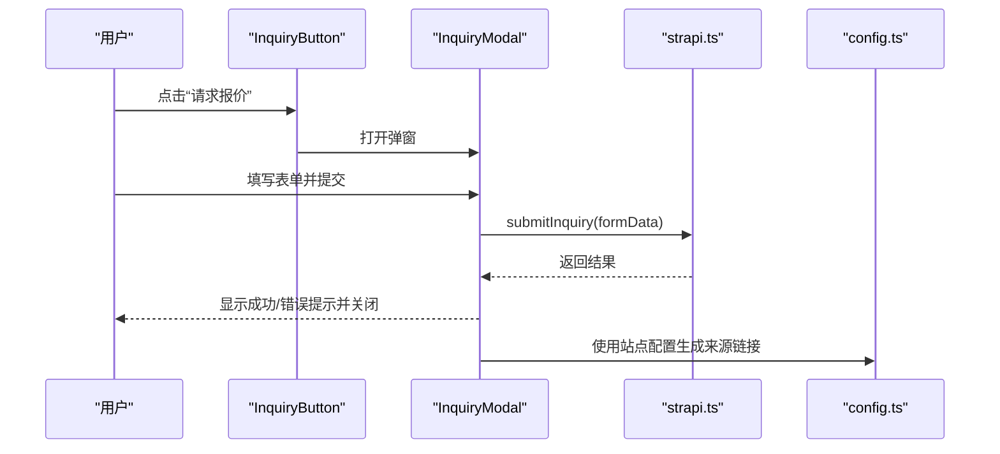
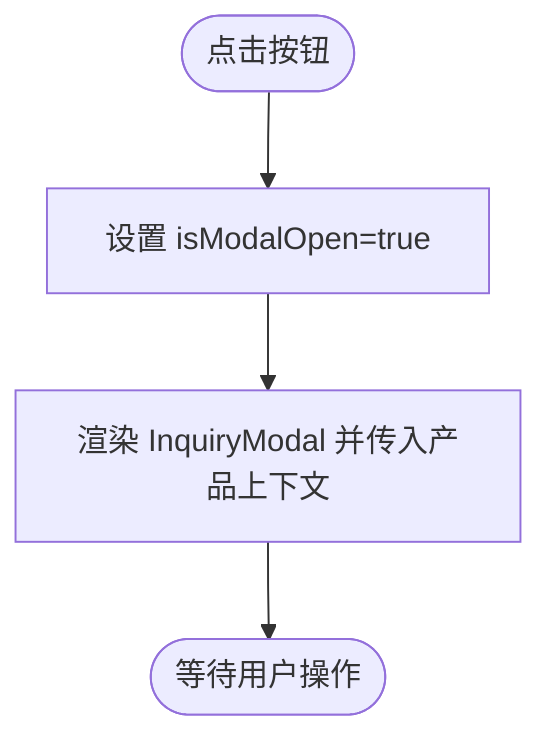
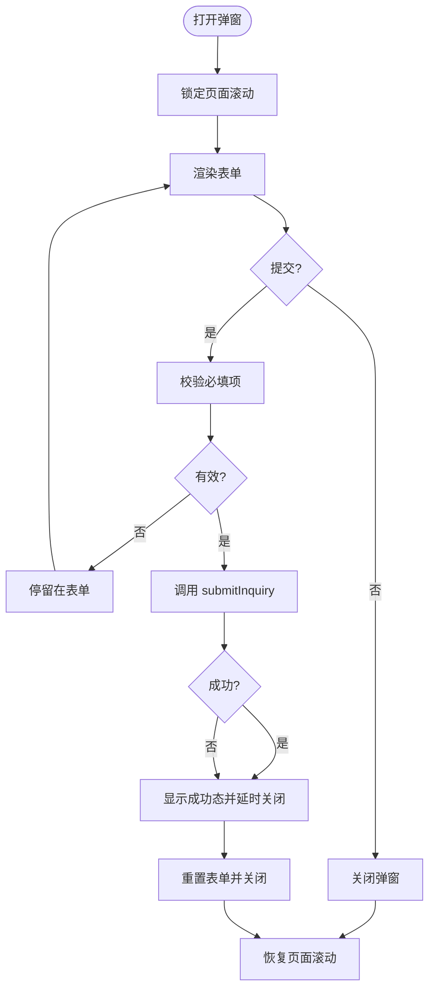
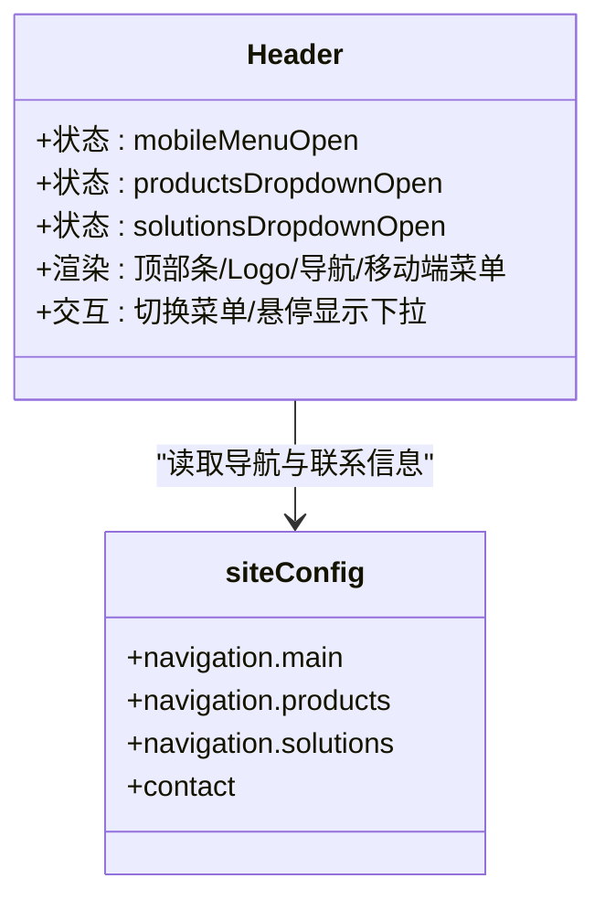
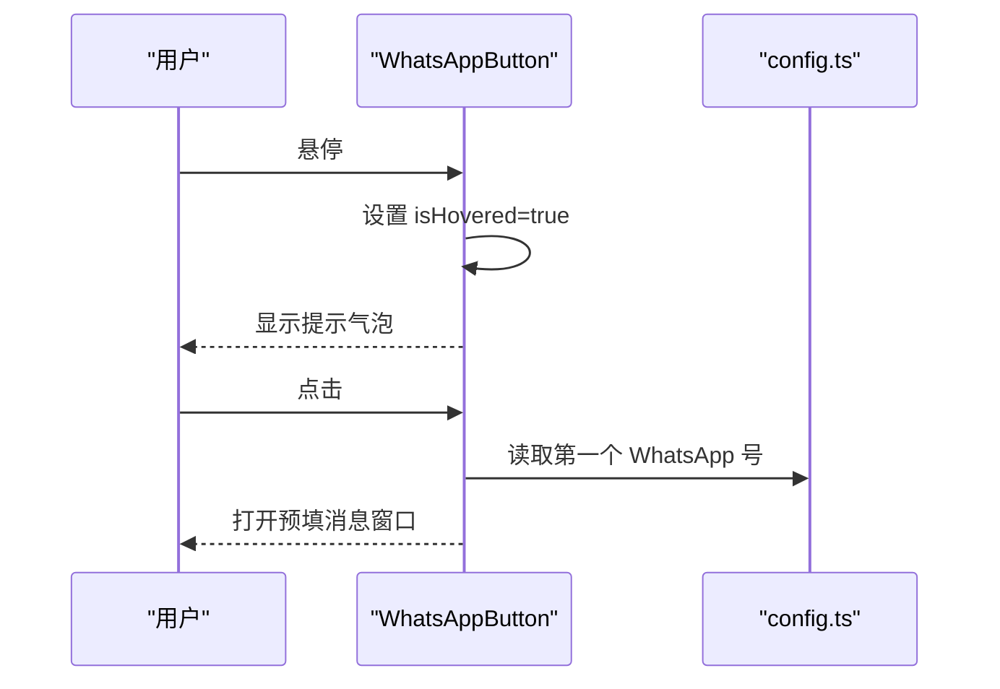
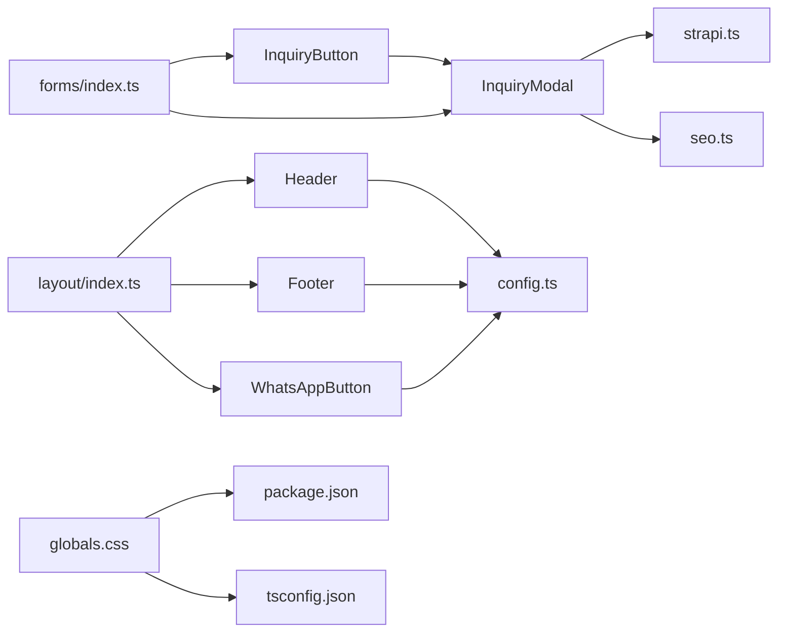

# UI 组件库

<cite>
**本文引用的文件**
- [frontend/src/components/forms/InquiryButton.tsx](file://frontend/src/components/forms/InquiryButton.tsx)
- [frontend/src/components/forms/InquiryModal.tsx](file://frontend/src/components/forms/InquiryModal.tsx)
- [frontend/src/components/layout/Header.tsx](file://frontend/src/components/layout/Header.tsx)
- [frontend/src/components/layout/Footer.tsx](file://frontend/src/components/layout/Footer.tsx)
- [frontend/src/components/layout/WhatsAppButton.tsx](file://frontend/src/components/layout/WhatsAppButton.tsx)
- [frontend/src/components/forms/index.ts](file://frontend/src/components/forms/index.ts)
- [frontend/src/components/layout/index.ts](file://frontend/src/components/layout/index.ts)
- [frontend/src/lib/config.ts](file://frontend/src/lib/config.ts)
- [frontend/src/lib/strapi.ts](file://frontend/src/lib/strapi.ts)
- [frontend/src/lib/seo.ts](file://frontend/src/lib/seo.ts)
- [frontend/src/types/index.ts](file://frontend/src/types/index.ts)
- [frontend/src/app/globals.css](file://frontend/src/app/globals.css)
- [frontend/package.json](file://frontend/package.json)
- [frontend/tsconfig.json](file://frontend/tsconfig.json)
</cite>

## 目录
1. [简介](#简介)
2. [项目结构](#项目结构)
3. [核心组件](#核心组件)
4. [架构总览](#架构总览)
5. [详细组件分析](#详细组件分析)
6. [依赖关系分析](#依赖关系分析)
7. [性能考量](#性能考量)
8. [故障排查指南](#故障排查指南)
9. [结论](#结论)
10. [附录](#附录)

## 简介
本文件为 Battivus 项目的 UI 组件库文档，聚焦于表单与布局类组件的视觉外观、行为与交互模式，系统化说明属性/参数、事件、插槽与自定义选项；提供使用示例与代码片段路径；覆盖响应式设计与无障碍访问建议；记录组件状态、动画与过渡效果；给出样式自定义与主题支持方案；并涵盖跨浏览器兼容性与性能优化建议。文档同时总结组件组合模式与与 CMS 的集成方式，提供最佳实践与设计原则。

## 项目结构
前端采用 Next.js 应用，UI 组件主要位于 frontend/src/components 下，按功能域拆分：forms（表单）、layout（布局）。样式通过 TailwindCSS 与全局 CSS 变量实现主题化。类型定义集中在 frontend/src/types，站点配置在 frontend/src/lib/config.ts，CMS 数据通过 frontend/src/lib/strapi.ts 封装调用。

**图表来源**
- [frontend/src/components/forms/InquiryButton.tsx:1-55](file://frontend/src/components/forms/InquiryButton.tsx#L1-L55)
- [frontend/src/components/forms/InquiryModal.tsx:1-370](file://frontend/src/components/forms/InquiryModal.tsx#L1-L370)
- [frontend/src/components/layout/Header.tsx:1-196](file://frontend/src/components/layout/Header.tsx#L1-L196)
- [frontend/src/components/layout/Footer.tsx:1-149](file://frontend/src/components/layout/Footer.tsx#L1-L149)
- [frontend/src/components/layout/WhatsAppButton.tsx:1-45](file://frontend/src/components/layout/WhatsAppButton.tsx#L1-L45)
- [frontend/src/lib/config.ts:1-177](file://frontend/src/lib/config.ts#L1-L177)
- [frontend/src/lib/seo.ts:1-225](file://frontend/src/lib/seo.ts#L1-L225)
- [frontend/src/lib/strapi.ts:1-412](file://frontend/src/lib/strapi.ts#L1-L412)
- [frontend/src/types/index.ts:1-157](file://frontend/src/types/index.ts#L1-L157)
- [frontend/src/app/globals.css:1-27](file://frontend/src/app/globals.css#L1-L27)
- [frontend/package.json:1-26](file://frontend/package.json#L1-L26)
- [frontend/tsconfig.json:1-35](file://frontend/tsconfig.json#L1-L35)

**章节来源**
- [frontend/src/components/forms/index.ts:1-3](file://frontend/src/components/forms/index.ts#L1-L3)
- [frontend/src/components/layout/index.ts:1-4](file://frontend/src/components/layout/index.ts#L1-L4)
- [frontend/src/app/globals.css:1-27](file://frontend/src/app/globals.css#L1-L27)
- [frontend/package.json:1-26](file://frontend/package.json#L1-L26)
- [frontend/tsconfig.json:1-35](file://frontend/tsconfig.json#L1-L35)

## 核心组件
- InquiryButton：触发询价弹窗的按钮，支持传入产品上下文信息与自定义样式类名。
- InquiryModal：完整的询价表单弹窗，包含表单校验、提交流程、成功反馈与滚动控制。
- Header：顶部导航栏，含移动端菜单、下拉菜单、联系入口与固定横幅。
- Footer：多列信息 Footer，包含公司信息、导航、社交链接与联系方式。
- WhatsAppButton：悬浮 WhatsApp 聊天按钮，带提示气泡与微光效果。

**章节来源**
- [frontend/src/components/forms/InquiryButton.tsx:1-55](file://frontend/src/components/forms/InquiryButton.tsx#L1-L55)
- [frontend/src/components/forms/InquiryModal.tsx:1-370](file://frontend/src/components/forms/InquiryModal.tsx#L1-L370)
- [frontend/src/components/layout/Header.tsx:1-196](file://frontend/src/components/layout/Header.tsx#L1-L196)
- [frontend/src/components/layout/Footer.tsx:1-149](file://frontend/src/components/layout/Footer.tsx#L1-L149)
- [frontend/src/components/layout/WhatsAppButton.tsx:1-45](file://frontend/src/components/layout/WhatsAppButton.tsx#L1-L45)

## 架构总览
组件间协作以“配置驱动 + CMS 集成”为核心：
- 配置驱动：站点名称、导航、联系方式等来自 siteConfig，用于 Header、Footer、WhatsAppButton 的渲染与链接生成。
- 表单流程：InquiryButton 触发 InquiryModal，后者收集表单数据并通过 strapi.ts 提交至 CMS。
- SEO 与 Schema：SEO 工具函数生成 JSON-LD 与元数据，供页面使用。
- 主题与样式：全局 CSS 变量与 Tailwind 类实现浅色/深色主题与响应式布局。

**图表来源**
- [frontend/src/components/forms/InquiryButton.tsx:1-55](file://frontend/src/components/forms/InquiryButton.tsx#L1-L55)
- [frontend/src/components/forms/InquiryModal.tsx:1-370](file://frontend/src/components/forms/InquiryModal.tsx#L1-L370)
- [frontend/src/lib/strapi.ts:290-306](file://frontend/src/lib/strapi.ts#L290-L306)
- [frontend/src/lib/config.ts:1-177](file://frontend/src/lib/config.ts#L1-L177)

## 详细组件分析

### InquiryButton 组件
- 视觉外观
  - 蓝色背景、白色文字、圆角、阴影、图标与文本水平排列。
  - 支持通过 className 自定义样式。
- 行为与交互
  - 点击切换内部状态打开弹窗。
  - 透传产品上下文（名称、SKU、URL）给弹窗。
- 属性/参数
  - productName?: string
  - productSku?: string
  - productUrl?: string
  - className?: string
  - buttonText?: string
- 事件
  - 无显式事件回调；通过内部状态控制弹窗。
- 插槽/自定义项
  - 通过 buttonText 自定义文案；通过 className 自定义样式。
- 使用示例（代码片段路径）
  - [InquiryButton 示例:14-54](file://frontend/src/components/forms/InquiryButton.tsx#L14-L54)

**图表来源**
- [frontend/src/components/forms/InquiryButton.tsx:14-54](file://frontend/src/components/forms/InquiryButton.tsx#L14-L54)

**章节来源**
- [frontend/src/components/forms/InquiryButton.tsx:6-20](file://frontend/src/components/forms/InquiryButton.tsx#L6-L20)

### InquiryModal 组件
- 视觉外观
  - 固定定位、半透明背景、居中卡片、可滚动内容区、关闭按钮、成功态对勾图标。
- 行为与交互
  - 打开时禁用页面滚动；点击背景或关闭按钮关闭。
  - 表单必填字段校验；提交时显示加载态；成功后自动重置并关闭。
  - 支持隐私协议复选框。
- 属性/参数
  - isOpen: boolean
  - onClose: () => void
  - productName?: string
  - productSku?: string
  - productUrl?: string
- 事件
  - onClose 在关闭时回调。
- 插槽/自定义项
  - 无插槽；通过属性传入产品上下文。
- 状态与动画
  - isSubmitting：提交中加载动画。
  - isSubmitted：提交成功反馈。
  - 内部表单状态管理：受控输入。
- 使用示例（代码片段路径）
  - [InquiryModal 完整实现:15-369](file://frontend/src/components/forms/InquiryModal.tsx#L15-L369)

**图表来源**
- [frontend/src/components/forms/InquiryModal.tsx:34-95](file://frontend/src/components/forms/InquiryModal.tsx#L34-L95)

**章节来源**
- [frontend/src/components/forms/InquiryModal.tsx:7-21](file://frontend/src/components/forms/InquiryModal.tsx#L7-L21)

### Header 组件
- 视觉外观
  - 顶部条（邮箱、WhatsApp）、Logo、主导航、移动端菜单按钮、桌面 CTA 按钮。
- 行为与交互
  - 移动端菜单开关；鼠标悬停触发“Products/Solutions”下拉菜单。
  - 导航项点击时关闭移动端菜单。
- 属性/参数
  - 无对外属性。
- 事件
  - 无显式事件回调。
- 插槽/自定义项
  - 无插槽；通过 siteConfig 动态生成导航。
- 状态与动画
  - mobileMenuOpen、productsDropdownOpen、solutionsDropdownOpen 控制菜单显示。
- 使用示例（代码片段路径）
  - [Header 实现:8-195](file://frontend/src/components/layout/Header.tsx#L8-L195)

**图表来源**
- [frontend/src/components/layout/Header.tsx:8-195](file://frontend/src/components/layout/Header.tsx#L8-L195)
- [frontend/src/lib/config.ts:26-50](file://frontend/src/lib/config.ts#L26-L50)

**章节来源**
- [frontend/src/components/layout/Header.tsx:8-195](file://frontend/src/components/layout/Header.tsx#L8-L195)
- [frontend/src/lib/config.ts:10-50](file://frontend/src/lib/config.ts#L10-L50)

### Footer 组件
- 视觉外观
  - 多列布局：公司信息、产品导航、解决方案、联系方式与快速入口。
- 行为与交互
  - 无交互逻辑；通过 siteConfig 渲染导航与社交链接。
- 属性/参数
  - 无对外属性。
- 事件
  - 无事件。
- 插槽/自定义项
  - 无插槽；通过 siteConfig 动态生成内容。
- 使用示例（代码片段路径）
  - [Footer 实现:4-148](file://frontend/src/components/layout/Footer.tsx#L4-L148)

**章节来源**
- [frontend/src/components/layout/Footer.tsx:4-148](file://frontend/src/components/layout/Footer.tsx#L4-L148)
- [frontend/src/lib/config.ts:10-50](file://frontend/src/lib/config.ts#L10-L50)

### WhatsAppButton 组件
- 视觉外观
  - 固定右下角绿色按钮，带提示气泡与微妙发光。
- 行为与交互
  - 悬停显示提示；点击跳转到 WhatsApp 预填消息。
- 属性/参数
  - 无对外属性。
- 事件
  - 无事件。
- 插槽/自定义项
  - 无插槽；通过 siteConfig 获取首个 WhatsApp 号码。
- 状态与动画
  - isHovered 控制提示气泡显示；按钮缩放与颜色过渡。
- 使用示例（代码片段路径）
  - [WhatsAppButton 实现:6-44](file://frontend/src/components/layout/WhatsAppButton.tsx#L6-L44)

**图表来源**
- [frontend/src/components/layout/WhatsAppButton.tsx:6-44](file://frontend/src/components/layout/WhatsAppButton.tsx#L6-L44)
- [frontend/src/lib/config.ts:10-17](file://frontend/src/lib/config.ts#L10-L17)

**章节来源**
- [frontend/src/components/layout/WhatsAppButton.tsx:6-44](file://frontend/src/components/layout/WhatsAppButton.tsx#L6-L44)
- [frontend/src/lib/config.ts:10-17](file://frontend/src/lib/config.ts#L10-L17)

## 依赖关系分析
- 组件导出入口
  - forms/index.ts 与 layout/index.ts 提供统一导出，便于上层页面按模块引入。
- 配置与类型
  - siteConfig 提供导航、联系、社交等静态配置；types/index.ts 定义产品、博客、问答等类型。
- CMS 集成
  - strapi.ts 封装 API 请求、筛选、分页、健康检查与数据模型类型。
- SEO 工具
  - seo.ts 生成 JSON-LD 与 Next.js 元数据，支持产品、文章、组织、面包屑等。
- 样式与主题
  - globals.css 使用 CSS 变量与 @theme inline 定义主题色与字体；配合 Tailwind 实现响应式与暗色模式。

**图表来源**
- [frontend/src/components/forms/index.ts:1-3](file://frontend/src/components/forms/index.ts#L1-L3)
- [frontend/src/components/layout/index.ts:1-4](file://frontend/src/components/layout/index.ts#L1-L4)
- [frontend/src/components/forms/InquiryButton.tsx:1-55](file://frontend/src/components/forms/InquiryButton.tsx#L1-L55)
- [frontend/src/components/forms/InquiryModal.tsx:1-370](file://frontend/src/components/forms/InquiryModal.tsx#L1-L370)
- [frontend/src/components/layout/Header.tsx:1-196](file://frontend/src/components/layout/Header.tsx#L1-L196)
- [frontend/src/components/layout/Footer.tsx:1-149](file://frontend/src/components/layout/Footer.tsx#L1-L149)
- [frontend/src/components/layout/WhatsAppButton.tsx:1-45](file://frontend/src/components/layout/WhatsAppButton.tsx#L1-L45)
- [frontend/src/lib/config.ts:1-177](file://frontend/src/lib/config.ts#L1-L177)
- [frontend/src/lib/strapi.ts:1-412](file://frontend/src/lib/strapi.ts#L1-L412)
- [frontend/src/lib/seo.ts:1-225](file://frontend/src/lib/seo.ts#L1-L225)
- [frontend/src/app/globals.css:1-27](file://frontend/src/app/globals.css#L1-L27)
- [frontend/package.json:1-26](file://frontend/package.json#L1-L26)
- [frontend/tsconfig.json:1-35](file://frontend/tsconfig.json#L1-L35)

**章节来源**
- [frontend/src/components/forms/index.ts:1-3](file://frontend/src/components/forms/index.ts#L1-L3)
- [frontend/src/components/layout/index.ts:1-4](file://frontend/src/components/layout/index.ts#L1-L4)
- [frontend/src/lib/config.ts:1-177](file://frontend/src/lib/config.ts#L1-L177)
- [frontend/src/lib/strapi.ts:1-412](file://frontend/src/lib/strapi.ts#L1-L412)
- [frontend/src/lib/seo.ts:1-225](file://frontend/src/lib/seo.ts#L1-L225)
- [frontend/src/app/globals.css:1-27](file://frontend/src/app/globals.css#L1-L27)

## 性能考量
- 组件层面
  - 使用 useState 控制本地状态，避免不必要的重渲染；InquiryModal 仅在 isOpen 为真时渲染。
  - 表单受控输入，减少非受控组件带来的回流压力。
- 网络与缓存
  - strapi.ts 对 API 请求设置 next.revalidate（60 秒），平衡新鲜度与缓存命中。
  - 健康检查接口 checkAPIHealth 可用于降级策略。
- 样式与主题
  - CSS 变量与 @theme inline 减少重复样式；Tailwind 原子类提升样式复用效率。
- 响应式与可访问性
  - 使用语义化标签与 aria-label；移动端菜单与下拉菜单通过键盘可达性增强。
- 跨浏览器兼容
  - TypeScript 编译目标 ES2017；Next.js 生态默认覆盖主流现代浏览器；如需兼容旧版 IE，需额外 polyfill 与构建配置。

[本节为通用指导，不直接分析具体文件，故无“章节来源”]

## 故障排查指南
- 表单提交失败
  - 现象：提交后仍显示成功态或报错。
  - 排查：确认 STRAPI_URL 与 STRAPI_TOKEN 是否正确配置；检查 submitInquiry 的返回状态；查看网络面板与控制台错误。
  - 参考路径：
    - [strapi.ts 提交询价:290-306](file://frontend/src/lib/strapi.ts#L290-L306)
    - [InquiryModal 提交处理:46-95](file://frontend/src/components/forms/InquiryModal.tsx#L46-L95)
- 弹窗无法关闭或滚动异常
  - 现象：弹窗关闭后页面仍不可滚动或无法再次打开。
  - 排查：确认 useEffect 的清理逻辑是否执行；确保每次打开/关闭都正确设置 document.body.style.overflow。
  - 参考路径：
    - [InquiryModal 滚动控制:34-44](file://frontend/src/components/forms/InquiryModal.tsx#L34-L44)
- 导航与社交链接为空
  - 现象：Header/Footer 中导航或社交链接缺失。
  - 排查：检查 siteConfig 中 navigation 与 social 字段是否完整。
  - 参考路径：
    - [siteConfig 导航与社交:26-24](file://frontend/src/lib/config.ts#L26-L24)
- WhatsApp 链接无效
  - 现象：点击 WhatsAppButton 未跳转或号码错误。
  - 排查：确认 siteConfig.contact.whatsapp 是否存在且格式正确。
  - 参考路径：
    - [WhatsAppButton 链接生成:10-13](file://frontend/src/components/layout/WhatsAppButton.tsx#L10-L13)

**章节来源**
- [frontend/src/lib/strapi.ts:290-306](file://frontend/src/lib/strapi.ts#L290-L306)
- [frontend/src/components/forms/InquiryModal.tsx:34-44](file://frontend/src/components/forms/InquiryModal.tsx#L34-L44)
- [frontend/src/lib/config.ts:26-24](file://frontend/src/lib/config.ts#L26-L24)
- [frontend/src/components/layout/WhatsAppButton.tsx:10-13](file://frontend/src/components/layout/WhatsAppButton.tsx#L10-L13)

## 结论
Battivus UI 组件库以简洁、可组合的方式实现了询价流程与站点布局，借助配置驱动与 CMS 集成，具备良好的扩展性与可维护性。通过统一的导出入口、类型定义与样式体系，开发者可以快速集成并定制组件。建议在生产环境中完善错误边界、国际化与更严格的可访问性测试，并根据业务增长逐步引入组件库文档与自动化测试。

[本节为总结，不直接分析具体文件，故无“章节来源”]

## 附录

### 属性/参数一览（按组件）
- InquiryButton
  - productName?: string
  - productSku?: string
  - productUrl?: string
  - className?: string
  - buttonText?: string
- InquiryModal
  - isOpen: boolean
  - onClose: () => void
  - productName?: string
  - productSku?: string
  - productUrl?: string
- Header / Footer / WhatsAppButton
  - 无对外属性（通过 siteConfig 驱动）

**章节来源**
- [frontend/src/components/forms/InquiryButton.tsx:6-20](file://frontend/src/components/forms/InquiryButton.tsx#L6-L20)
- [frontend/src/components/forms/InquiryModal.tsx:7-21](file://frontend/src/components/forms/InquiryModal.tsx#L7-L21)
- [frontend/src/components/layout/Header.tsx:8-195](file://frontend/src/components/layout/Header.tsx#L8-L195)
- [frontend/src/components/layout/Footer.tsx:4-148](file://frontend/src/components/layout/Footer.tsx#L4-L148)
- [frontend/src/components/layout/WhatsAppButton.tsx:6-44](file://frontend/src/components/layout/WhatsAppButton.tsx#L6-L44)

### 事件与回调
- InquiryButton
  - 无显式事件；通过内部状态控制弹窗。
- InquiryModal
  - onClose: 关闭时回调。
- Header
  - 移动端菜单开关、下拉菜单显示控制。
- Footer / WhatsAppButton
  - 无事件。

**章节来源**
- [frontend/src/components/forms/InquiryButton.tsx:14-54](file://frontend/src/components/forms/InquiryButton.tsx#L14-L54)
- [frontend/src/components/forms/InquiryModal.tsx:15-21](file://frontend/src/components/forms/InquiryModal.tsx#L15-L21)
- [frontend/src/components/layout/Header.tsx:8-195](file://frontend/src/components/layout/Header.tsx#L8-L195)
- [frontend/src/components/layout/WhatsAppButton.tsx:6-44](file://frontend/src/components/layout/WhatsAppButton.tsx#L6-L44)

### 插槽与自定义选项
- 当前组件未提供插槽；可通过以下方式自定义：
  - className：自定义样式类名（InquiryButton、InquiryModal、Header、Footer、WhatsAppButton 的容器类名均可传入）。
  - buttonText：自定义按钮文案（InquiryButton）。
  - siteConfig：统一修改导航、联系、社交等静态内容。

**章节来源**
- [frontend/src/components/forms/InquiryButton.tsx:18-19](file://frontend/src/components/forms/InquiryButton.tsx#L18-L19)
- [frontend/src/lib/config.ts:26-50](file://frontend/src/lib/config.ts#L26-L50)

### 使用示例（代码片段路径）
- 引入 forms 组件
  - [forms/index.ts:1-3](file://frontend/src/components/forms/index.ts#L1-L3)
- 引入 layout 组件
  - [layout/index.ts:1-4](file://frontend/src/components/layout/index.ts#L1-L4)
- 组件实现参考
  - [InquiryButton:14-54](file://frontend/src/components/forms/InquiryButton.tsx#L14-L54)
  - [InquiryModal:15-369](file://frontend/src/components/forms/InquiryModal.tsx#L15-L369)
  - [Header:8-195](file://frontend/src/components/layout/Header.tsx#L8-L195)
  - [Footer:4-148](file://frontend/src/components/layout/Footer.tsx#L4-L148)
  - [WhatsAppButton:6-44](file://frontend/src/components/layout/WhatsAppButton.tsx#L6-L44)

**章节来源**
- [frontend/src/components/forms/index.ts:1-3](file://frontend/src/components/forms/index.ts#L1-L3)
- [frontend/src/components/layout/index.ts:1-4](file://frontend/src/components/layout/index.ts#L1-L4)

### 响应式设计与无障碍访问
- 响应式
  - 使用 Tailwind 断点类实现移动端适配；Header 的移动端菜单与下拉菜单在小屏设备友好。
- 无障碍
  - 提供 aria-label（如“切换菜单”、“Chat on WhatsApp”）；使用语义化标签；确保键盘可达性。
- 主题与样式
  - CSS 变量与 @theme inline 支持浅色/深色主题；通过 className 覆盖默认样式。

**章节来源**
- [frontend/src/app/globals.css:1-27](file://frontend/src/app/globals.css#L1-L27)
- [frontend/src/components/layout/Header.tsx:151-155](file://frontend/src/components/layout/Header.tsx#L151-L155)
- [frontend/src/components/layout/WhatsAppButton.tsx:33-33](file://frontend/src/components/layout/WhatsAppButton.tsx#L33-L33)

### 组件状态、动画与过渡
- 状态
  - InquiryButton：isModalOpen
  - InquiryModal：isSubmitting、isSubmitted、表单字段状态
  - Header：mobileMenuOpen、productsDropdownOpen、solutionsDropdownOpen
  - WhatsAppButton：isHovered
- 动画与过渡
  - 按钮 hover 效果与 scale 过渡；加载态旋转图标；成功态对勾图标与淡入。

**章节来源**
- [frontend/src/components/forms/InquiryButton.tsx:21-21](file://frontend/src/components/forms/InquiryButton.tsx#L21-L21)
- [frontend/src/components/forms/InquiryModal.tsx:31-32](file://frontend/src/components/forms/InquiryModal.tsx#L31-L32)
- [frontend/src/components/layout/Header.tsx:9-11](file://frontend/src/components/layout/Header.tsx#L9-L11)
- [frontend/src/components/layout/WhatsAppButton.tsx:7-7](file://frontend/src/components/layout/WhatsAppButton.tsx#L7-L7)

### 样式自定义与主题支持
- 自定义
  - 通过 className 传入自定义样式类名；覆盖默认颜色、尺寸与阴影。
- 主题
  - CSS 变量控制背景与前景色；@media (prefers-color-scheme: dark) 自动切换深色主题。
- 字体
  - 通过 --font-sans 与 --font-mono 变量统一字体族。

**章节来源**
- [frontend/src/app/globals.css:3-20](file://frontend/src/app/globals.css#L3-L20)

### 跨浏览器兼容性与性能优化
- 兼容性
  - TypeScript 目标 ES2017；Next.js 生态覆盖主流现代浏览器。
- 性能
  - 合理拆分组件、使用受控表单、利用 revalidate 缓存策略、避免过度重渲染。

**章节来源**
- [frontend/tsconfig.json:3-3](file://frontend/tsconfig.json#L3-L3)
- [frontend/src/lib/strapi.ts:111-111](file://frontend/src/lib/strapi.ts#L111-L111)

### 组件组合模式与集成
- 组合模式
  - Header + Footer + 页面主体；InquiryButton + InquiryModal 形成询价闭环；WhatsAppButton 作为补充入口。
- 与 CMS 集成
  - 通过 strapi.ts 获取产品、博客、解决方案等数据；使用 siteConfig 驱动导航与联系信息；使用 seo.ts 生成 SEO 数据。

**章节来源**
- [frontend/src/lib/strapi.ts:170-288](file://frontend/src/lib/strapi.ts#L170-L288)
- [frontend/src/lib/config.ts:26-50](file://frontend/src/lib/config.ts#L26-L50)
- [frontend/src/lib/seo.ts:168-224](file://frontend/src/lib/seo.ts#L168-L224)

### 最佳实践与设计原则
- 设计原则
  - 以用户为中心：清晰的表单字段、明确的成功反馈、无障碍标签。
  - 一致性：颜色、字体、间距遵循全局主题。
  - 可组合性：通过 props 与 className 实现灵活定制。
- 开发实践
  - 使用类型定义约束数据结构；在组件内进行最小必要状态管理；将配置与静态资源集中管理。
  - 对外暴露稳定 API，内部实现可演进。

**章节来源**
- [frontend/src/types/index.ts:1-157](file://frontend/src/types/index.ts#L1-L157)
- [frontend/src/lib/config.ts:1-177](file://frontend/src/lib/config.ts#L1-L177)