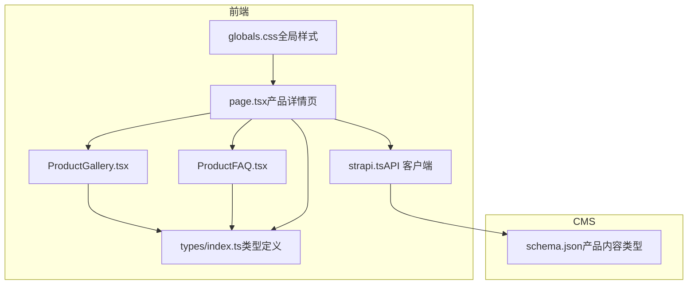
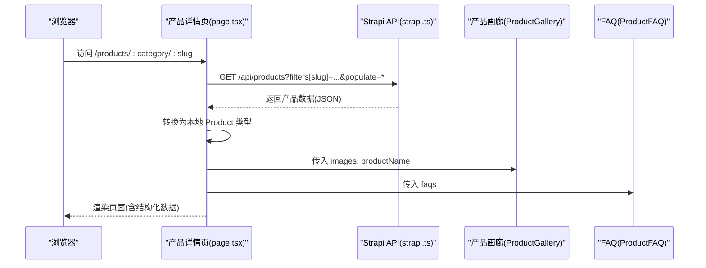
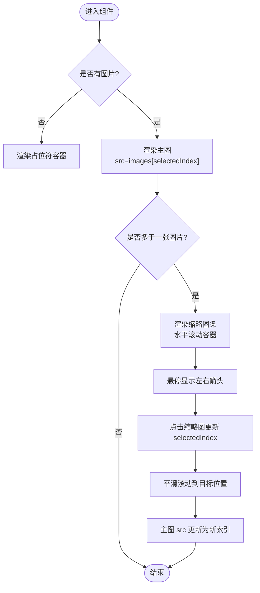
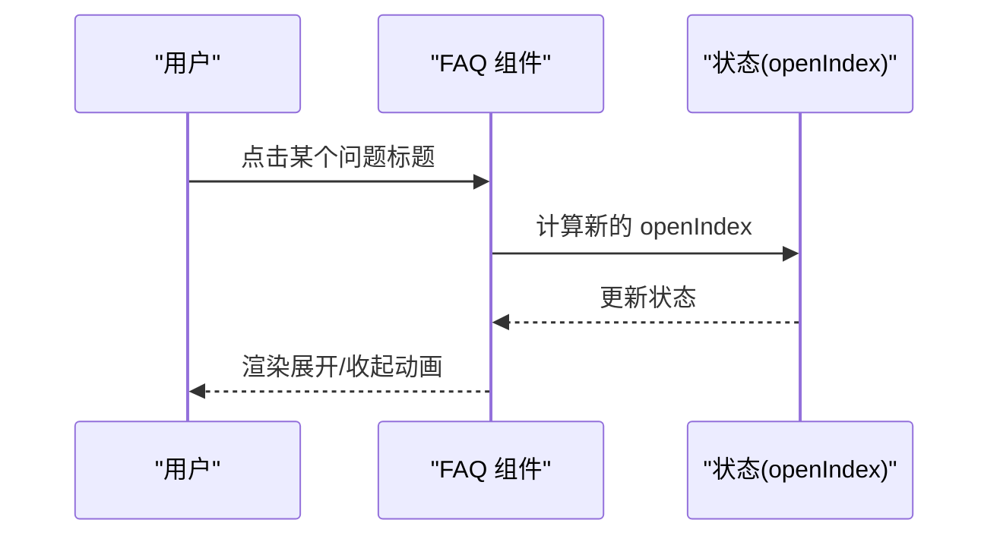
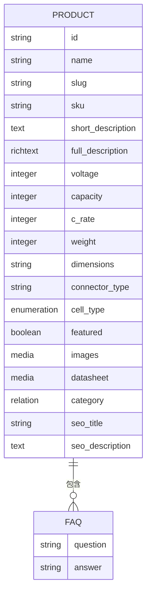
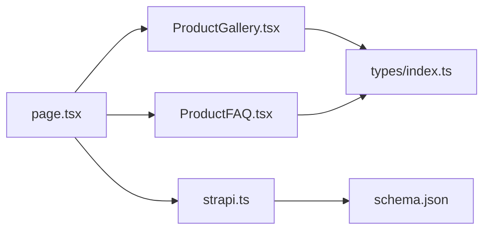

# 产品组件

<cite>
**本文引用的文件**
- [ProductGallery.tsx](file://frontend/src/components/products/ProductGallery.tsx)
- [ProductFAQ.tsx](file://frontend/src/components/products/ProductFAQ.tsx)
- [index.ts（产品组件导出）](file://frontend/src/components/products/index.ts)
- [schema.json（产品内容类型）](file://cms/src/api/product/content-types/product/schema.json)
- [page.tsx（产品详情页）](file://frontend/src/app/products/[category]/[slug]/page.tsx)
- [strapi.ts（Strapi 客户端）](file://frontend/src/lib/strapi.ts)
- [index.ts（类型定义）](file://frontend/src/types/index.ts)
- [globals.css（全局样式）](file://frontend/src/app/globals.css)
</cite>

## 目录
1. [简介](#简介)
2. [项目结构](#项目结构)
3. [核心组件](#核心组件)
4. [架构总览](#架构总览)
5. [详细组件分析](#详细组件分析)
6. [依赖关系分析](#依赖关系分析)
7. [性能考量](#性能考量)
8. [故障排查指南](#故障排查指南)
9. [结论](#结论)
10. [附录](#附录)

## 简介
本文件聚焦 Battivus 项目的“产品”相关组件，系统性地文档化以下能力：
- 产品画廊：主图展示、缩略图滚动、左右切换、占位符处理与无障碍支持
- 产品常见问题（FAQ）：折叠展开机制、交互状态管理、内容渲染与可访问性
- 图片资源管理：从 Strapi 媒体服务到前端的 URL 规范化与回退策略
- FAQ 内容的动态加载与结构化数据输出
- 组件配置选项、样式定制与响应式布局建议
- 性能优化与用户体验最佳实践

## 项目结构
产品组件位于前端侧的组件目录中，并在产品详情页中被消费。CMS 的产品内容类型定义了图片、规格、FAQ 等字段，前端通过 Strapi 客户端拉取数据并在页面中进行转换与渲染。

图表来源
- [ProductGallery.tsx:1-104](file://frontend/src/components/products/ProductGallery.tsx#L1-L104)
- [ProductFAQ.tsx:1-57](file://frontend/src/components/products/ProductFAQ.tsx#L1-L57)
- [page.tsx:1-566](file://frontend/src/app/products/[category]/[slug]/page.tsx#L1-L566)
- [strapi.ts:1-412](file://frontend/src/lib/strapi.ts#L1-L412)
- [schema.json:1-33](file://cms/src/api/product/content-types/product/schema.json#L1-L33)
- [globals.css:1-27](file://frontend/src/app/globals.css#L1-L27)

章节来源
- [ProductGallery.tsx:1-104](file://frontend/src/components/products/ProductGallery.tsx#L1-L104)
- [ProductFAQ.tsx:1-57](file://frontend/src/components/products/ProductFAQ.tsx#L1-L57)
- [page.tsx:1-566](file://frontend/src/app/products/[category]/[slug]/page.tsx#L1-L566)
- [strapi.ts:1-412](file://frontend/src/lib/strapi.ts#L1-L412)
- [schema.json:1-33](file://cms/src/api/product/content-types/product/schema.json#L1-L33)
- [globals.css:1-27](file://frontend/src/app/globals.css#L1-L27)

## 核心组件
- 产品画廊（ProductGallery）
  - 接收图片数组与产品名称，渲染主图与缩略图条，支持左右滚动与点击切换
  - 无图片时显示占位符，提升可用性
- 产品常见问题（ProductFAQ）
  - 接收 FAQ 数组，每个问题可独立折叠/展开，带旋转箭头指示状态
  - 使用无障碍属性与过渡动画增强交互体验

章节来源
- [ProductGallery.tsx:10-104](file://frontend/src/components/products/ProductGallery.tsx#L10-L104)
- [ProductFAQ.tsx:10-57](file://frontend/src/components/products/ProductFAQ.tsx#L10-L57)

## 架构总览
产品详情页从 Strapi 拉取产品数据，进行类型转换后传递给产品画廊与 FAQ 组件；同时生成结构化数据脚本以提升 SEO。

图表来源
- [page.tsx:20-73](file://frontend/src/app/products/[category]/[slug]/page.tsx#L20-L73)
- [strapi.ts:51-119](file://frontend/src/lib/strapi.ts#L51-L119)
- [ProductGallery.tsx:10-104](file://frontend/src/components/products/ProductGallery.tsx#L10-L104)
- [ProductFAQ.tsx:10-57](file://frontend/src/components/products/ProductFAQ.tsx#L10-L57)

## 详细组件分析

### 产品画廊（ProductGallery）
- 输入参数
  - images: 字符串数组（图片 URL 列表）
  - productName: 字符串（用于主图 alt 文本）
- 关键行为
  - 占位符：当 images 为空或长度为 0 时，渲染占位符容器与图标
  - 主图：根据当前选中索引显示对应图片，使用对象适配与内边距保证比例与留白
  - 缩略图条：水平滚动容器，按钮控制左右滚动；点击缩略图切换主图
  - 交互态：选中缩略图高亮边框与环形光晕；悬停显示左右箭头
  - 可访问性：按钮提供 aria-label；主图 alt 包含产品名与视图序号
- 样式与响应式
  - 主图容器使用等比容器与边框；缩略图条使用水平滚动与隐藏滚动条
  - 左右箭头仅在鼠标悬停时可见，减少视觉干扰
- 性能与优化
  - 使用平滑滚动与固定步进量，避免频繁重排
  - 缩略图尺寸固定，减少布局抖动
  - 图片使用对象适配与内边距，避免大图溢出

图表来源
- [ProductGallery.tsx:14-104](file://frontend/src/components/products/ProductGallery.tsx#L14-L104)

章节来源
- [ProductGallery.tsx:1-104](file://frontend/src/components/products/ProductGallery.tsx#L1-L104)

### 产品常见问题（ProductFAQ）
- 输入参数
  - faqs: FAQ[]（问题与答案数组）
- 关键行为
  - 状态：使用单个 openIndex 管理当前展开项，点击同一项可关闭
  - 展开/收起：通过 max-height 过渡与旋转箭头指示状态
  - 结构：每个 FAQ 为一个可点击标题与内容面板的组合
- 样式与交互
  - 标题区域支持悬停背景色变化与过渡
  - 内容面板使用 max-height 控制高度，配合 overflow 隐藏
  - 箭头旋转角度与状态绑定，提供直观反馈
- 可访问性
  - 使用 button 元素承载标题，便于键盘导航与屏幕阅读器识别

图表来源
- [ProductFAQ.tsx:10-57](file://frontend/src/components/products/ProductFAQ.tsx#L10-L57)

章节来源
- [ProductFAQ.tsx:1-57](file://frontend/src/components/products/ProductFAQ.tsx#L1-L57)

### 数据集成与图片资源管理
- CMS 产品内容类型
  - images: 多媒体字段，限定为图片类型
  - faqs: 自定义问答字段（question/answer）
  - 其他规格字段如 voltage、capacity、c_rate 等
- 前端数据流
  - 产品详情页通过 Strapi 客户端拉取数据，使用 populate=* 获取关联与媒体
  - 使用 getStrapiMedia 将相对路径补全为完整 URL
  - 将返回的 snake_case 字段映射为本地类型定义中的驼峰命名
- 错误与回退
  - 若拉取失败或无数据，页面使用 mock 数据作为回退
  - 图片缺失时，画廊组件自动渲染占位符

图表来源
- [schema.json:12-31](file://cms/src/api/product/content-types/product/schema.json#L12-L31)
- [index.ts（类型定义）:23-43](file://frontend/src/types/index.ts#L23-L43)

章节来源
- [schema.json:1-33](file://cms/src/api/product/content-types/product/schema.json#L1-L33)
- [page.tsx:20-73](file://frontend/src/app/products/[category]/[slug]/page.tsx#L20-L73)
- [strapi.ts:11-23](file://frontend/src/lib/strapi.ts#L11-L23)
- [index.ts（类型定义）:12-43](file://frontend/src/types/index.ts#L12-L43)

## 依赖关系分析
- 组件依赖
  - ProductGallery 依赖 React 状态与 DOM 引用，负责滚动与选中态
  - ProductFAQ 依赖 React 状态，负责展开/收起逻辑
- 页面依赖
  - 产品详情页依赖 Strapi 客户端与类型定义，负责数据获取与转换
- CMS 依赖
  - 产品内容类型定义了图片与问答字段，支撑前端渲染

图表来源
- [page.tsx:1-566](file://frontend/src/app/products/[category]/[slug]/page.tsx#L1-L566)
- [ProductGallery.tsx:1-104](file://frontend/src/components/products/ProductGallery.tsx#L1-L104)
- [ProductFAQ.tsx:1-57](file://frontend/src/components/products/ProductFAQ.tsx#L1-L57)
- [strapi.ts:1-412](file://frontend/src/lib/strapi.ts#L1-L412)
- [schema.json:1-33](file://cms/src/api/product/content-types/product/schema.json#L1-L33)
- [index.ts（类型定义）:1-157](file://frontend/src/types/index.ts#L1-L157)

章节来源
- [page.tsx:1-566](file://frontend/src/app/products/[category]/[slug]/page.tsx#L1-L566)
- [ProductGallery.tsx:1-104](file://frontend/src/components/products/ProductGallery.tsx#L1-L104)
- [ProductFAQ.tsx:1-57](file://frontend/src/components/products/ProductFAQ.tsx#L1-L57)
- [strapi.ts:1-412](file://frontend/src/lib/strapi.ts#L1-L412)
- [schema.json:1-33](file://cms/src/api/product/content-types/product/schema.json#L1-L33)
- [index.ts（类型定义）:1-157](file://frontend/src/types/index.ts#L1-L157)

## 性能考量
- 图片加载
  - 使用对象适配与内边距避免大图溢出，减少重绘
  - 缩略图尺寸固定，降低布局计算成本
- 动画与滚动
  - 平滑滚动与过渡动画在现代浏览器上性能良好，但应避免在大量元素上同时触发
- 数据获取
  - 页面对 Strapi 请求设置缓存与再验证策略，减少重复请求
- 可访问性
  - 提供 aria-label 与语义化标签，改善屏幕阅读器体验

## 故障排查指南
- 无图片显示
  - 检查 CMS 中产品是否上传了图片
  - 确认 getStrapiMedia 是否正确拼接 URL
  - 查看页面是否回退到 mock 数据
- 缩略图不滚动
  - 确认 scrollContainerRef 是否正确挂载
  - 检查容器是否设置了水平滚动与隐藏滚动条
- FAQ 不展开
  - 确认 faqs 数组非空且结构正确
  - 检查 openIndex 状态是否被意外覆盖
- SEO 结构化数据
  - 确认页面生成了产品与 FAQ 的结构化数据脚本

章节来源
- [page.tsx:20-73](file://frontend/src/app/products/[category]/[slug]/page.tsx#L20-L73)
- [strapi.ts:11-23](file://frontend/src/lib/strapi.ts#L11-L23)
- [ProductGallery.tsx:25-38](file://frontend/src/components/products/ProductGallery.tsx#L25-L38)
- [ProductFAQ.tsx:13-15](file://frontend/src/components/products/ProductFAQ.tsx#L13-L15)

## 结论
产品画廊与 FAQ 组件在结构与交互上简洁明确，分别解决了“图片展示与切换”和“问答内容折叠”的核心需求。通过 CMS 的产品内容类型与前端类型定义的配合，实现了从数据到界面的稳定映射。建议在生产环境中进一步完善图片懒加载、骨架屏与错误边界，以提升性能与稳定性。

## 附录
- 组件导出
  - 产品 FAQ 组件已导出，可在其他模块中直接引入
- 全局样式
  - 全局样式采用 Tailwind，组件样式通过类名组合实现，便于统一主题与响应式布局

章节来源
- [index.ts（产品组件导出）:1-2](file://frontend/src/components/products/index.ts#L1-L2)
- [globals.css:1-27](file://frontend/src/app/globals.css#L1-L27)