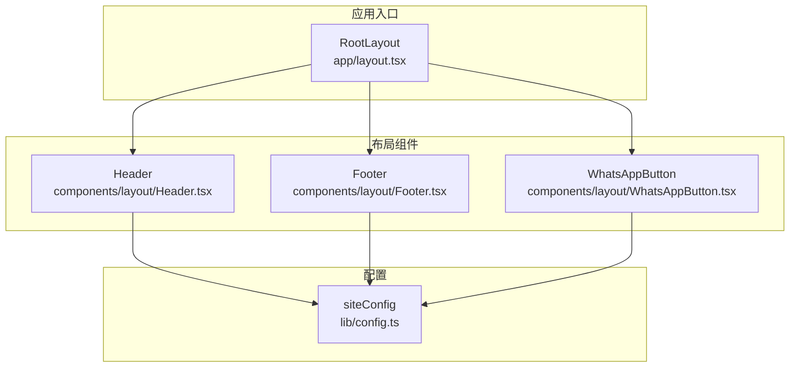
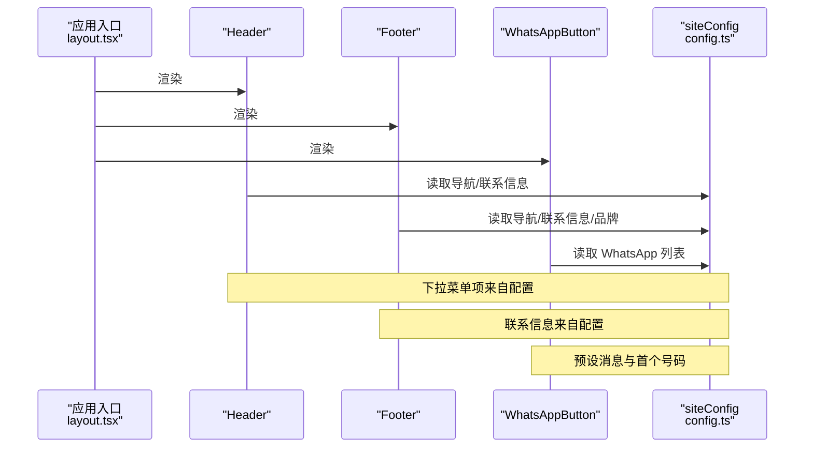
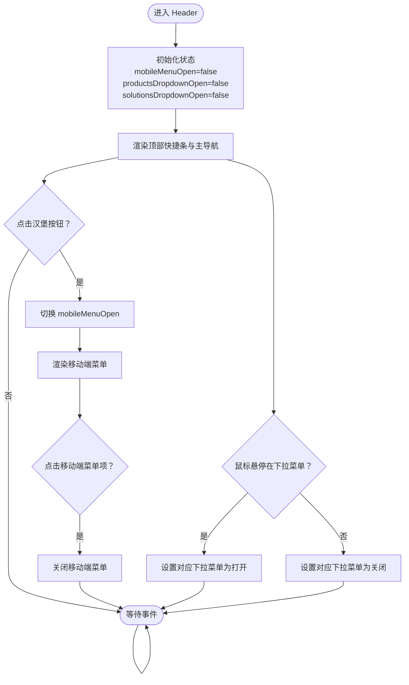
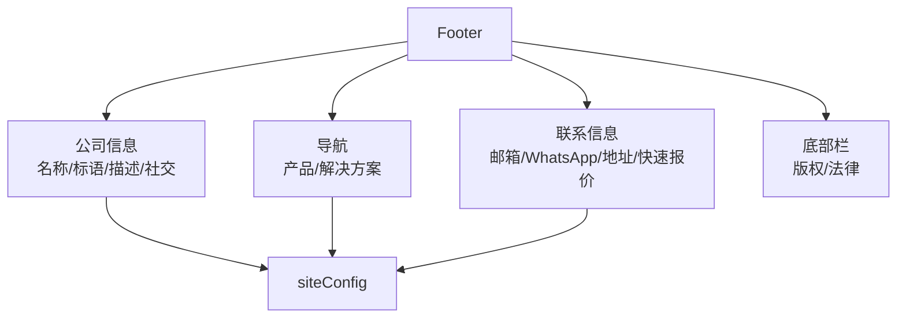
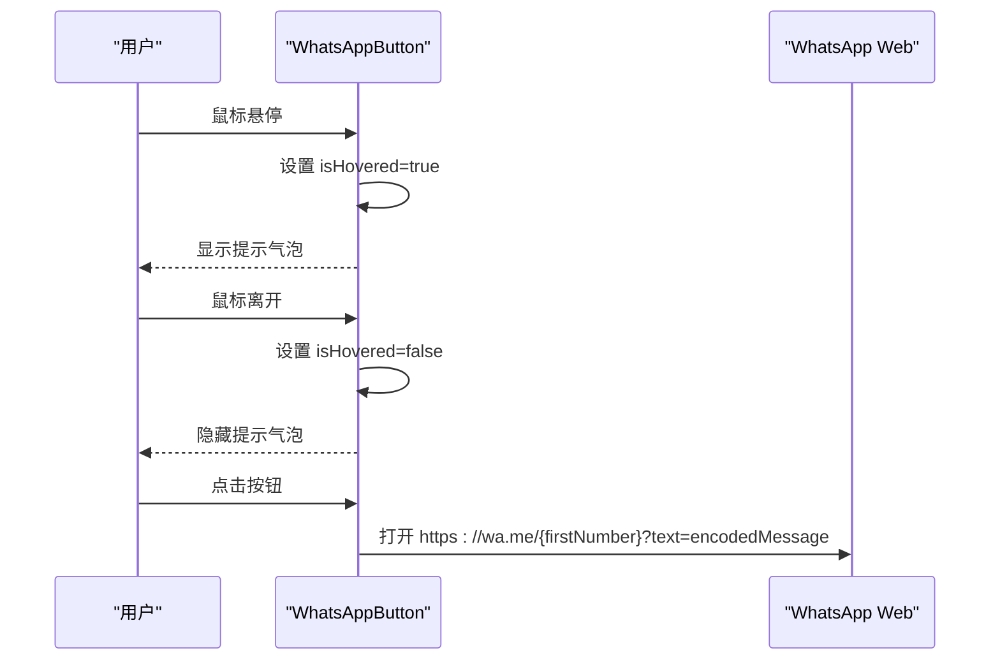
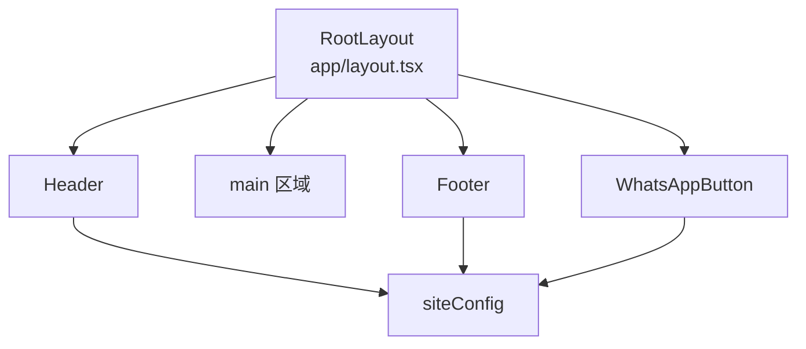
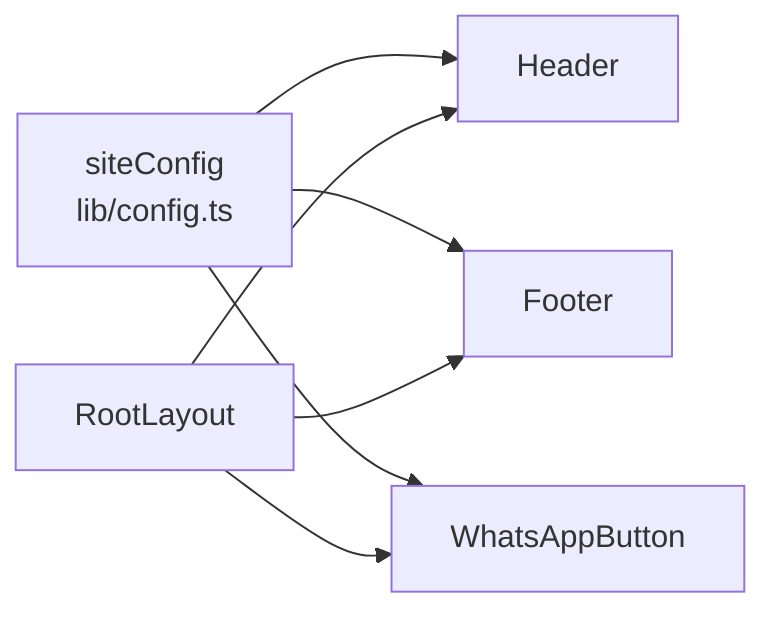

# 布局组件

<cite>
**本文引用的文件**
- [Header.tsx](file://frontend/src/components/layout/Header.tsx)
- [Footer.tsx](file://frontend/src/components/layout/Footer.tsx)
- [WhatsAppButton.tsx](file://frontend/src/components/layout/WhatsAppButton.tsx)
- [layout/index.ts](file://frontend/src/components/layout/index.ts)
- [config.ts](file://frontend/src/lib/config.ts)
- [layout.tsx](file://frontend/src/app/layout.tsx)
- [globals.css](file://frontend/src/app/globals.css)
- [page.tsx](file://frontend/src/app/page.tsx)
- [contact/page.tsx](file://frontend/src/app/contact/page.tsx)
</cite>

## 目录
1. [简介](#简介)
2. [项目结构](#项目结构)
3. [核心组件](#核心组件)
4. [架构总览](#架构总览)
5. [组件详细分析](#组件详细分析)
6. [依赖关系分析](#依赖关系分析)
7. [性能考量](#性能考量)
8. [故障排查指南](#故障排查指南)
9. [结论](#结论)
10. [附录](#附录)

## 简介
本文件系统性地文档化 Battivus 项目的布局组件，重点覆盖：
- 头部导航栏：响应式设计、移动端菜单切换、下拉菜单展开逻辑
- 页脚：多列布局、社交链接、联系信息、快速导航
- WhatsApp 浮动按钮：悬浮交互、提示气泡、消息预设
- 组件状态管理：移动端菜单开关、下拉菜单展开、悬浮提示
- 事件处理与响应式行为：鼠标悬停、点击、键盘可访问性
- 样式定制与主题支持：Tailwind 类名、CSS 变量、深色模式
- 与站点配置的集成：导航链接、联系方式、品牌信息的动态加载
- 使用示例与最佳实践

## 项目结构
布局组件位于前端应用的组件层，通过应用入口统一挂载到根布局中，并由站点配置驱动内容与导航。

图表来源
- [layout.tsx:66-99](file://frontend/src/app/layout.tsx#L66-L99)
- [Header.tsx:1-196](file://frontend/src/components/layout/Header.tsx#L1-L196)
- [Footer.tsx:1-149](file://frontend/src/components/layout/Footer.tsx#L1-L149)
- [WhatsAppButton.tsx:1-45](file://frontend/src/components/layout/WhatsAppButton.tsx#L1-L45)
- [config.ts:1-177](file://frontend/src/lib/config.ts#L1-L177)

章节来源
- [layout.tsx:66-99](file://frontend/src/app/layout.tsx#L66-L99)
- [layout/index.ts:1-4](file://frontend/src/components/layout/index.ts#L1-L4)

## 核心组件
- Header：顶部邮箱与 WhatsApp 快捷条 + 主导航（桌面端）+ 移动端汉堡菜单 + 产品/解决方案下拉菜单
- Footer：公司信息、产品/解决方案导航、联系信息（邮箱、WhatsApp、地址）、版权与法律链接
- WhatsAppButton：悬浮聊天按钮，带提示气泡与预设消息

章节来源
- [Header.tsx:8-196](file://frontend/src/components/layout/Header.tsx#L8-L196)
- [Footer.tsx:4-149](file://frontend/src/components/layout/Footer.tsx#L4-L149)
- [WhatsAppButton.tsx:6-45](file://frontend/src/components/layout/WhatsAppButton.tsx#L6-L45)

## 架构总览
组件通过单一配置源 siteConfig 驱动导航、联系信息与品牌数据，确保全局一致性与可维护性。

图表来源
- [layout.tsx:66-99](file://frontend/src/app/layout.tsx#L66-L99)
- [Header.tsx:1-196](file://frontend/src/components/layout/Header.tsx#L1-L196)
- [Footer.tsx:1-149](file://frontend/src/components/layout/Footer.tsx#L1-L149)
- [WhatsAppButton.tsx:1-45](file://frontend/src/components/layout/WhatsAppButton.tsx#L1-L45)
- [config.ts:1-177](file://frontend/src/lib/config.ts#L1-L177)

## 组件详细分析

### 头部导航栏（Header）
- 结构与职责
  - 顶部快捷条：展示邮箱与 WhatsApp 链接
  - 主导航：Logo、主导航链接、产品/解决方案下拉菜单、CTA 按钮
  - 移动端：汉堡菜单，点击切换显示/隐藏
- 状态管理
  - mobileMenuOpen：控制移动端菜单显隐
  - productsDropdownOpen / solutionsDropdownOpen：控制下拉菜单显隐
- 事件处理
  - 移动端菜单：点击汉堡按钮切换状态
  - 下拉菜单：鼠标进入/离开时切换状态
  - 移动端菜单项点击后自动收起菜单
- 响应式行为
  - 桌面端：完整导航 + 下拉菜单
  - 移动端：仅汉堡菜单，点击后显示主菜单与 CTA
- 与站点配置的集成
  - 导航项来源于 siteConfig.navigation.main、products、solutions
  - 邮箱与 WhatsApp 来源于 siteConfig.contact
- 样式与主题
  - 使用 Tailwind 类名组织布局与颜色
  - 支持深色模式（通过 CSS 变量与媒体查询）

图表来源
- [Header.tsx:8-196](file://frontend/src/components/layout/Header.tsx#L8-L196)

章节来源
- [Header.tsx:8-196](file://frontend/src/components/layout/Header.tsx#L8-L196)
- [config.ts:26-50](file://frontend/src/lib/config.ts#L26-L50)

### 页脚（Footer）
- 结构与职责
  - 公司信息区：品牌标识、标语、描述、社交链接
  - 导航区：产品与解决方案分类链接
  - 联系区：邮箱、WhatsApp（支持多号码与自定义显示文案）、地址、快速报价按钮
  - 底部栏：版权与法律链接
- 与站点配置的集成
  - 名称、描述、社交链接、导航项均来自 siteConfig
  - 联系信息（邮箱、WhatsApp、地址）来自 siteConfig.contact
- 响应式行为
  - 使用 CSS Grid 在大屏分四列，在中小屏自动换行
- 样式与主题
  - 深色背景配浅色文字，强调品牌色

图表来源
- [Footer.tsx:4-149](file://frontend/src/components/layout/Footer.tsx#L4-L149)
- [config.ts:10-50](file://frontend/src/lib/config.ts#L10-L50)

章节来源
- [Footer.tsx:4-149](file://frontend/src/components/layout/Footer.tsx#L4-L149)
- [config.ts:10-50](file://frontend/src/lib/config.ts#L10-L50)

### WhatsApp 浮动按钮（WhatsAppButton）
- 结构与职责
  - 固定定位的圆形按钮，悬浮在右下角
  - 悬停显示提示气泡，包含“在 WhatsApp 聊天”说明
  - 点击跳转至 https://wa.me/{第一个号码}?text=预设消息
- 状态管理
  - isHovered：控制提示气泡显隐
- 事件处理
  - 鼠标进入/离开切换提示气泡
- 与站点配置的集成
  - 从 siteConfig.contact.whatsapp 读取号码列表，使用第一个号码生成链接
  - 预设消息通过 URL 编码注入
- 样式与主题
  - 绿色主题色，带轻微发光效果与缩放动画

图表来源
- [WhatsAppButton.tsx:6-45](file://frontend/src/components/layout/WhatsAppButton.tsx#L6-L45)
- [config.ts:10-17](file://frontend/src/lib/config.ts#L10-L17)

章节来源
- [WhatsAppButton.tsx:6-45](file://frontend/src/components/layout/WhatsAppButton.tsx#L6-L45)
- [config.ts:10-17](file://frontend/src/lib/config.ts#L10-L17)

### 组件导出与应用入口集成
- 组件导出
  - 通过 layout/index.ts 统一导出 Header、Footer、WhatsAppButton
- 应用入口
  - RootLayout 在 body 中依次渲染 Header、main 区域、Footer、WhatsAppButton
  - 使用 siteConfig 生成 SEO 元数据与结构化数据

图表来源
- [layout.tsx:66-99](file://frontend/src/app/layout.tsx#L66-L99)
- [layout/index.ts:1-4](file://frontend/src/components/layout/index.ts#L1-L4)

章节来源
- [layout.tsx:66-99](file://frontend/src/app/layout.tsx#L66-L99)
- [layout/index.ts:1-4](file://frontend/src/components/layout/index.ts#L1-L4)

## 依赖关系分析
- 组件间耦合
  - Header、Footer、WhatsAppButton 均依赖 siteConfig，形成松耦合
  - 根布局负责装配，不直接关心具体实现
- 外部依赖
  - Next.js Link 用于内部导航
  - Tailwind CSS 提供样式基础
  - 图标使用 SVG，无额外图标库依赖
- 潜在循环依赖
  - 未发现循环导入；组件通过配置单向依赖

图表来源
- [config.ts:1-177](file://frontend/src/lib/config.ts#L1-L177)
- [layout.tsx:66-99](file://frontend/src/app/layout.tsx#L66-L99)
- [Header.tsx:1-196](file://frontend/src/components/layout/Header.tsx#L1-L196)
- [Footer.tsx:1-149](file://frontend/src/components/layout/Footer.tsx#L1-L149)
- [WhatsAppButton.tsx:1-45](file://frontend/src/components/layout/WhatsAppButton.tsx#L1-L45)

章节来源
- [config.ts:1-177](file://frontend/src/lib/config.ts#L1-L177)
- [layout.tsx:66-99](file://frontend/src/app/layout.tsx#L66-L99)

## 性能考量
- 渲染优化
  - 下拉菜单与移动端菜单采用条件渲染，避免不必要的 DOM
  - 悬浮提示气泡仅在悬停时渲染，减少常驻节点
- 状态最小化
  - 使用 useState 控制少量布尔状态，避免复杂状态树
- 样式优化
  - Tailwind 类名按需组合，减少自定义样式开销
  - 深色模式通过 CSS 变量与媒体查询实现，无需额外 JS 计算
- 链接与外部资源
  - WhatsApp 链接为外部服务，不阻塞首屏渲染

## 故障排查指南
- 导航项不显示或为空
  - 检查 siteConfig.navigation.main/products/solutions 是否正确配置
  - 确认配置文件路径与导出是否正确
- WhatsApp 链接无效
  - 确认 siteConfig.contact.whatsapp 至少包含一个号码
  - 检查预设消息编码是否正确
- 移动端菜单无法关闭
  - 确认移动端菜单项点击回调是否触发状态更新
- 深色模式不生效
  - 检查 globals.css 中 CSS 变量与媒体查询是否正确
  - 确认浏览器系统偏好设置与页面样式一致

章节来源
- [config.ts:10-50](file://frontend/src/lib/config.ts#L10-L50)
- [Header.tsx:167-191](file://frontend/src/components/layout/Header.tsx#L167-L191)
- [globals.css:1-27](file://frontend/src/app/globals.css#L1-L27)

## 结论
Battivus 的布局组件以简洁、可维护为核心目标：通过单一配置源驱动导航与联系信息，配合响应式设计与轻量状态管理，实现了良好的用户体验与可扩展性。WhatsApp 浮动按钮增强了即时沟通能力，而 Footer 则提供了完整的品牌与联系信息展示。整体架构清晰，易于在后续迭代中扩展更多导航项或主题变体。

## 附录

### Props 接口与配置要点
- Header
  - 无显式 props，依赖 siteConfig.navigation.* 与 siteConfig.contact
- Footer
  - 无显式 props，依赖 siteConfig.name/description/social/navigation/contact
- WhatsAppButton
  - 无显式 props，依赖 siteConfig.contact.whatsapp 与预设消息
- 配置要点
  - navigation.main/products/solutions：数组对象，包含 name 与 href
  - contact：包含 email、phone、whatsapp（数组）、whatsappDisplay（可选）、address
  - social：包含 linkedin/youtube/twiter（可选）

章节来源
- [config.ts:10-50](file://frontend/src/lib/config.ts#L10-L50)

### 样式定制与主题支持
- Tailwind 类名
  - 使用容器、间距、颜色、阴影、圆角等类名组织布局
- CSS 变量与深色模式
  - globals.css 定义 :root 与媒体查询，实现深色模式切换
- 主题色
  - Header 与 Footer 使用蓝色系，WhatsAppButton 使用绿色系

章节来源
- [globals.css:1-27](file://frontend/src/app/globals.css#L1-L27)
- [Header.tsx:14-196](file://frontend/src/components/layout/Header.tsx#L14-L196)
- [Footer.tsx:8-149](file://frontend/src/components/layout/Footer.tsx#L8-L149)
- [WhatsAppButton.tsx:16-45](file://frontend/src/components/layout/WhatsAppButton.tsx#L16-L45)

### 屏幕尺寸下的表现与交互模式
- 小屏（移动端）
  - 汉堡菜单替代桌面导航
  - 下拉菜单通过点击触发，移动端菜单项点击后自动收起
  - Footer 采用网格自动换行
- 中屏（平板）
  - 保持汉堡菜单，但导航项更紧凑
- 大屏（桌面）
  - 完整导航与下拉菜单，悬浮提示气泡增强交互体验

章节来源
- [Header.tsx:57-191](file://frontend/src/components/layout/Header.tsx#L57-L191)
- [Footer.tsx:11-134](file://frontend/src/components/layout/Footer.tsx#L11-L134)

### 与站点配置的集成方式
- 导航链接
  - Header 与 Footer 通过 siteConfig.navigation.main/products/solutions 动态生成
- 联系方式
  - Header 顶部条与 Footer 联系区均使用 siteConfig.contact.email/whatsapp/address
- 品牌信息
  - Header 与 Footer 使用 siteConfig.name/tagline/description/social

章节来源
- [Header.tsx:16-138](file://frontend/src/components/layout/Header.tsx#L16-L138)
- [Footer.tsx:10-133](file://frontend/src/components/layout/Footer.tsx#L10-L133)
- [config.ts:3-25](file://frontend/src/lib/config.ts#L3-L25)

### 实际使用示例与最佳实践
- 在应用入口中引入并渲染组件
  - RootLayout 已在 body 中装配 Header、main、Footer、WhatsAppButton
- 自定义导航与联系信息
  - 修改 siteConfig.navigation.* 与 siteConfig.contact 即可更新所有布局组件
- 添加更多下拉菜单项
  - 在 siteConfig.navigation.products/solutions 中新增对象，组件会自动渲染
- 多 WhatsApp 号码支持
  - 在 siteConfig.contact.whatsapp 中添加多个号码，Footer 会逐个展示，WhatsAppButton 使用第一个号码
- 最佳实践
  - 保持 siteConfig 的结构稳定，避免频繁变更键名
  - 为移动端菜单项提供明确的点击回调以提升可用性
  - 为图标与链接提供合适的 aria-label 以增强可访问性

章节来源
- [layout.tsx:66-99](file://frontend/src/app/layout.tsx#L66-L99)
- [config.ts:10-50](file://frontend/src/lib/config.ts#L10-L50)
- [Header.tsx:167-191](file://frontend/src/components/layout/Header.tsx#L167-L191)
- [Footer.tsx:103-114](file://frontend/src/components/layout/Footer.tsx#L103-L114)
- [WhatsAppButton.tsx:10-13](file://frontend/src/components/layout/WhatsAppButton.tsx#L10-L13)