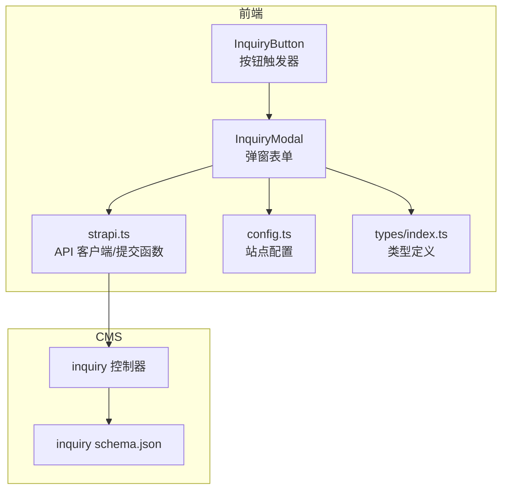
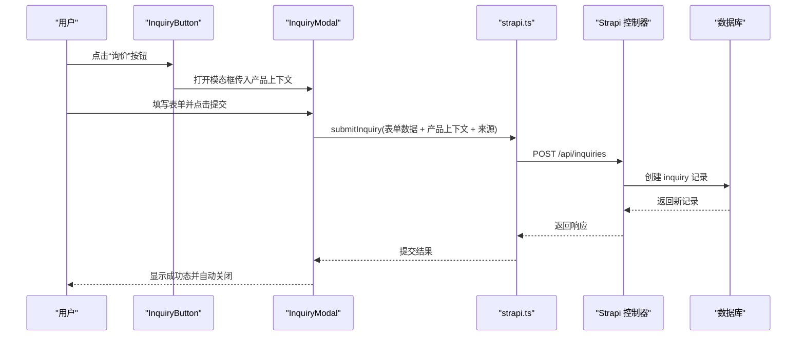
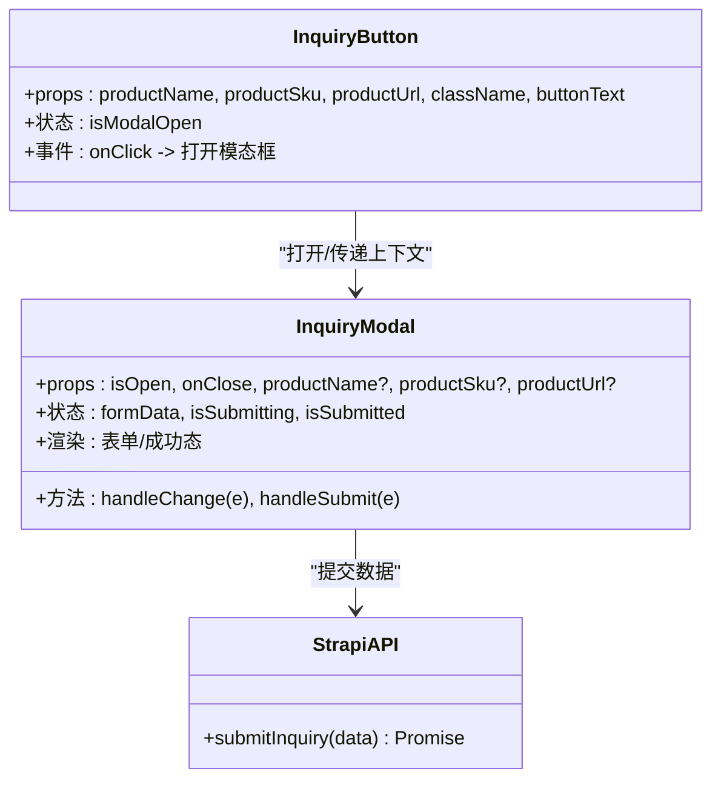
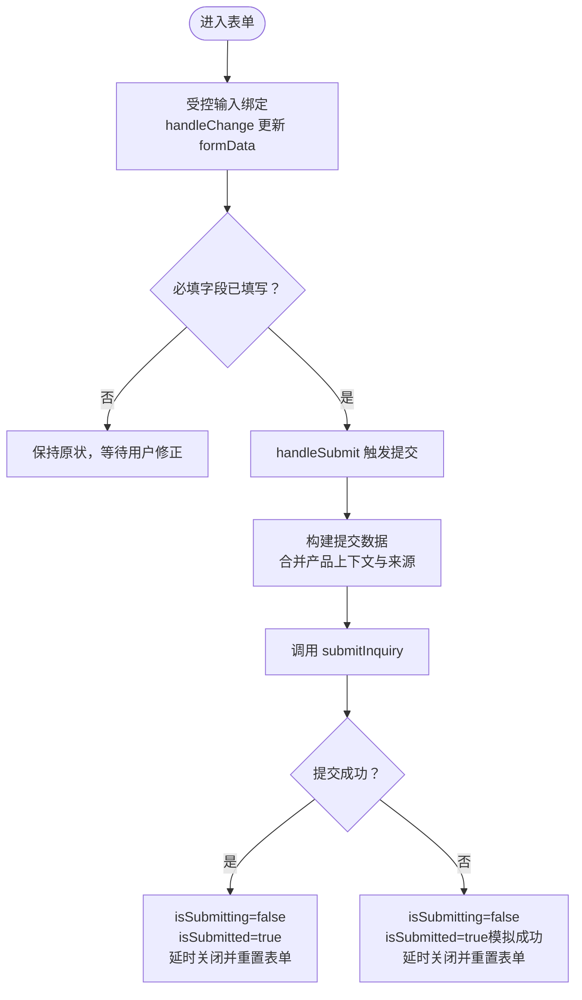
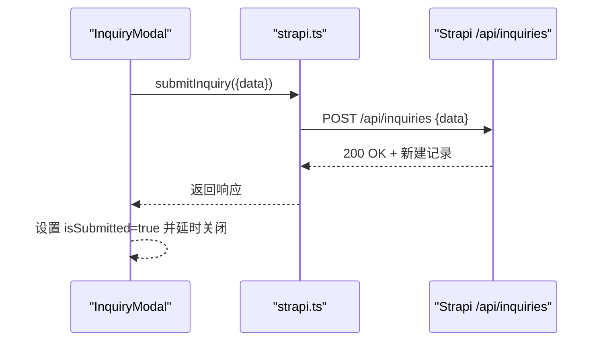
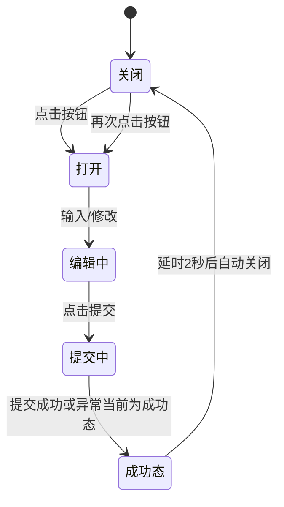
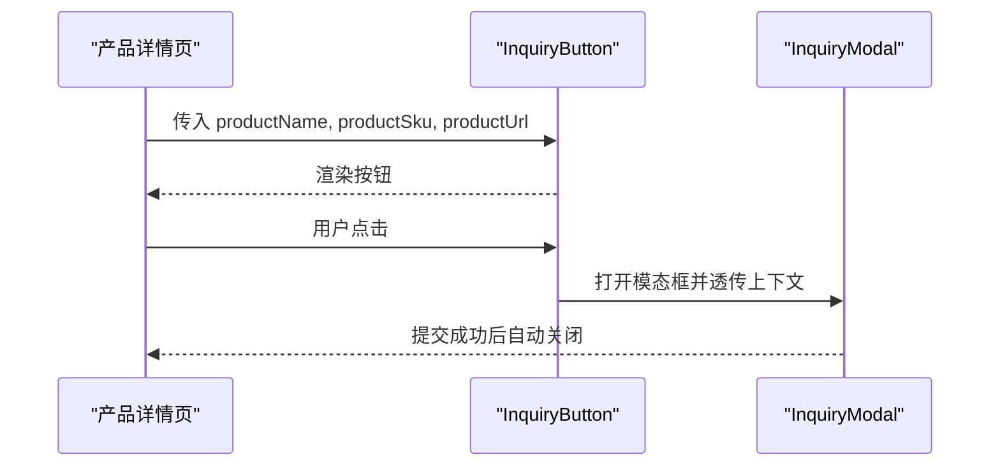
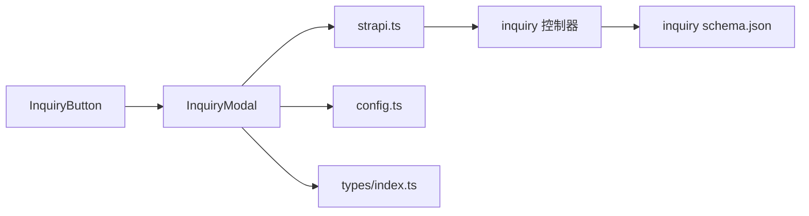

# 表单组件

<cite>
**本文引用的文件**
- [InquiryModal.tsx](file://frontend/src/components/forms/InquiryModal.tsx)
- [InquiryButton.tsx](file://frontend/src/components/forms/InquiryButton.tsx)
- [index.ts](file://frontend/src/components/forms/index.ts)
- [strapi.ts](file://frontend/src/lib/strapi.ts)
- [config.ts](file://frontend/src/lib/config.ts)
- [types/index.ts](file://frontend/src/types/index.ts)
- [inquiry.ts](file://cms/src/api/inquiry/controllers/inquiry.ts)
- [schema.json](file://cms/src/api/inquiry/content-types/inquiry/schema.json)
- [page.tsx（产品详情页）](file://frontend/src/app/products/[category]/[slug]/page.tsx)
- [ContactForm.tsx](file://frontend/src/app/contact/ContactForm.tsx)
</cite>

## 目录
1. [简介](#简介)
2. [项目结构](#项目结构)
3. [核心组件](#核心组件)
4. [架构总览](#架构总览)
5. [组件详细分析](#组件详细分析)
6. [依赖关系分析](#依赖关系分析)
7. [性能考量](#性能考量)
8. [故障排查指南](#故障排查指南)
9. [结论](#结论)
10. [附录](#附录)

## 简介
本文件系统性地文档化 Battivus 项目的“询价模态框”和“询价按钮”表单组件，覆盖以下方面：
- 组件职责与交互流程：从按钮到模态框再到后端提交的完整链路
- 数据绑定与状态管理：本地状态、提交状态、成功反馈与重置逻辑
- 表单验证与必填项：前端原生验证与必填标记
- 错误处理与用户反馈：加载态、成功态、异常兜底与关闭逻辑
- 样式与可访问性：无障碍标签、键盘导航与视觉反馈
- 后端集成：请求地址、请求头、数据结构与状态枚举
- 国际化与多语言：文案与链接路径的国际化建议
- 使用示例与最佳实践：在产品详情页中嵌入组件的方式与参数传递

## 项目结构
表单组件位于前端侧，采用按功能分层组织：
- 组件层：InquiryButton 与 InquiryModal
- 工具层：strapi.ts 提供统一 API 客户端与提交函数
- 配置层：config.ts 提供站点信息与联系信息
- 类型层：types/index.ts 定义表单数据结构
- CMS 层：Strapi 的 inquiry 内容类型与控制器

**图表来源**
- [InquiryButton.tsx:14-55](file://frontend/src/components/forms/InquiryButton.tsx#L14-L55)
- [InquiryModal.tsx:15-370](file://frontend/src/components/forms/InquiryModal.tsx#L15-L370)
- [strapi.ts:291-306](file://frontend/src/lib/strapi.ts#L291-L306)
- [inquiry.ts:1-40](file://cms/src/api/inquiry/controllers/inquiry.ts#L1-L40)
- [schema.json:1-25](file://cms/src/api/inquiry/content-types/inquiry/schema.json#L1-L25)

**章节来源**
- [InquiryButton.tsx:1-55](file://frontend/src/components/forms/InquiryButton.tsx#L1-L55)
- [InquiryModal.tsx:1-370](file://frontend/src/components/forms/InquiryModal.tsx#L1-L370)
- [strapi.ts:1-412](file://frontend/src/lib/strapi.ts#L1-L412)
- [config.ts:1-177](file://frontend/src/lib/config.ts#L1-L177)
- [types/index.ts:109-121](file://frontend/src/types/index.ts#L109-L121)
- [inquiry.ts:1-40](file://cms/src/api/inquiry/controllers/inquiry.ts#L1-L40)
- [schema.json:1-25](file://cms/src/api/inquiry/content-types/inquiry/schema.json#L1-L25)

## 核心组件
- InquiryButton：负责打开模态框，接收产品上下文参数（名称、SKU、URL），并渲染按钮。
- InquiryModal：负责展示表单、收集用户输入、提交到后端、显示成功反馈与自动关闭。

关键特性：
- 状态管理：本地状态管理表单字段、提交中、已提交、模态框开关
- 原生验证：必填字段通过 required 属性进行前端校验
- 提交流程：将表单数据与产品上下文合并，调用 strapi.ts 的 submitInquiry
- 反馈机制：加载态、成功态、异常时的提示与关闭逻辑
- 可访问性：按钮与输入均具备 aria-label 或语义化 label

**章节来源**
- [InquiryButton.tsx:14-55](file://frontend/src/components/forms/InquiryButton.tsx#L14-L55)
- [InquiryModal.tsx:15-370](file://frontend/src/components/forms/InquiryModal.tsx#L15-L370)
- [strapi.ts:291-306](file://frontend/src/lib/strapi.ts#L291-L306)

## 架构总览
下图展示了从前端组件到 CMS 的完整调用链路：

**图表来源**
- [InquiryButton.tsx:45-51](file://frontend/src/components/forms/InquiryButton.tsx#L45-L51)
- [InquiryModal.tsx:46-95](file://frontend/src/components/forms/InquiryModal.tsx#L46-L95)
- [strapi.ts:291-306](file://frontend/src/lib/strapi.ts#L291-L306)
- [inquiry.ts:19-24](file://cms/src/api/inquiry/controllers/inquiry.ts#L19-L24)

## 组件详细分析

### 组件类图

**图表来源**
- [InquiryButton.tsx:6-20](file://frontend/src/components/forms/InquiryButton.tsx#L6-L20)
- [InquiryModal.tsx:7-31](file://frontend/src/components/forms/InquiryModal.tsx#L7-L31)
- [strapi.ts:291-306](file://frontend/src/lib/strapi.ts#L291-L306)

**章节来源**
- [InquiryButton.tsx:1-55](file://frontend/src/components/forms/InquiryButton.tsx#L1-L55)
- [InquiryModal.tsx:1-370](file://frontend/src/components/forms/InquiryModal.tsx#L1-L370)
- [strapi.ts:291-306](file://frontend/src/lib/strapi.ts#L291-L306)

### 表单字段与数据绑定
- 字段清单：姓名、邮箱、公司、国家、数量范围、留言、隐私协议勾选
- 数据绑定：受控组件，通过 handleChange 统一更新 formData
- 必填项：姓名、邮箱、留言、隐私协议勾选
- 产品上下文：自动附加到提交数据中（名称、SKU、URL、来源）

**图表来源**
- [InquiryModal.tsx:97-95](file://frontend/src/components/forms/InquiryModal.tsx#L97-L95)
- [strapi.ts:291-306](file://frontend/src/lib/strapi.ts#L291-L306)

**章节来源**
- [InquiryModal.tsx:22-95](file://frontend/src/components/forms/InquiryModal.tsx#L22-L95)
- [types/index.ts:109-121](file://frontend/src/types/index.ts#L109-L121)

### 提交流程与后端集成
- 请求地址：/api/inquiries
- 方法：POST
- 头部：Content-Type: application/json；若存在令牌则附加 Authorization: Bearer {token}
- 请求体：data 字段承载表单数据
- 响应：返回新建记录对象
- 异常：非 2xx 抛出错误，当前前端以“成功态”兜底并关闭

**图表来源**
- [strapi.ts:291-306](file://frontend/src/lib/strapi.ts#L291-L306)
- [inquiry.ts:19-24](file://cms/src/api/inquiry/controllers/inquiry.ts#L19-L24)

**章节来源**
- [strapi.ts:291-306](file://frontend/src/lib/strapi.ts#L291-L306)
- [inquiry.ts:19-24](file://cms/src/api/inquiry/controllers/inquiry.ts#L19-L24)

### 状态管理与用户反馈
- 模态框状态：由按钮控制 isOpen/onClose
- 表单状态：formData（含隐私协议勾选）、isSubmitting、isSubmitted
- 成功态：显示绿色对勾图标与提示文本，2 秒后自动关闭并重置
- 加载态：提交按钮禁用并显示加载动画
- 异常兜底：当前前端在异常时也切换为成功态并关闭，便于演示

**图表来源**
- [InquiryButton.tsx:21-21](file://frontend/src/components/forms/InquiryButton.tsx#L21-L21)
- [InquiryModal.tsx:31-95](file://frontend/src/components/forms/InquiryModal.tsx#L31-L95)

**章节来源**
- [InquiryButton.tsx:21-21](file://frontend/src/components/forms/InquiryButton.tsx#L21-L21)
- [InquiryModal.tsx:31-95](file://frontend/src/components/forms/InquiryModal.tsx#L31-L95)

### 样式与可访问性
- 样式：Tailwind 类名用于边框、圆角、阴影、焦点环、禁用态与居中布局
- 可访问性：按钮包含 aria-label；表单项均有对应 label；必填项使用红色星号标识
- 响应式：容器最大宽度与垂直滚动，确保在小屏设备上可读可用

**章节来源**
- [InquiryModal.tsx:118-367](file://frontend/src/components/forms/InquiryModal.tsx#L118-L367)

### 在页面中的使用示例
在产品详情页中，通过 InquiryButton 将产品名称、SKU、URL 作为上下文传入，从而在提交时自动携带产品信息。

**图表来源**
- [page.tsx（产品详情页）:343-347](file://frontend/src/app/products/[category]/[slug]/page.tsx#L343-L347)
- [InquiryButton.tsx:45-51](file://frontend/src/components/forms/InquiryButton.tsx#L45-L51)

**章节来源**
- [page.tsx（产品详情页）:343-347](file://frontend/src/app/products/[category]/[slug]/page.tsx#L343-L347)
- [InquiryButton.tsx:45-51](file://frontend/src/components/forms/InquiryButton.tsx#L45-L51)

## 依赖关系分析
- 组件依赖：InquiryButton 依赖 InquiryModal；InquiryModal 依赖 strapi.ts 与 config.ts
- 类型依赖：表单数据结构由 types/index.ts 统一定义
- CMS 依赖：控制器直接操作内容类型 inquiry，schema.json 定义字段与默认状态

**图表来源**
- [InquiryButton.tsx:3-4](file://frontend/src/components/forms/InquiryButton.tsx#L3-L4)
- [InquiryModal.tsx:3-5](file://frontend/src/components/forms/InquiryModal.tsx#L3-L5)
- [strapi.ts:291-306](file://frontend/src/lib/strapi.ts#L291-L306)
- [types/index.ts:109-121](file://frontend/src/types/index.ts#L109-L121)
- [inquiry.ts:1-40](file://cms/src/api/inquiry/controllers/inquiry.ts#L1-L40)
- [schema.json:1-25](file://cms/src/api/inquiry/content-types/inquiry/schema.json#L1-L25)

**章节来源**
- [InquiryButton.tsx:1-55](file://frontend/src/components/forms/InquiryButton.tsx#L1-L55)
- [InquiryModal.tsx:1-370](file://frontend/src/components/forms/InquiryModal.tsx#L1-L370)
- [strapi.ts:1-412](file://frontend/src/lib/strapi.ts#L1-L412)
- [types/index.ts:109-121](file://frontend/src/types/index.ts#L109-L121)
- [inquiry.ts:1-40](file://cms/src/api/inquiry/controllers/inquiry.ts#L1-L40)
- [schema.json:1-25](file://cms/src/api/inquiry/content-types/inquiry/schema.json#L1-L25)

## 性能考量
- 网络请求：使用 fetch 发送一次 POST 请求，避免重复提交
- 状态更新：受控组件逐字段更新，复杂度 O(n)（n 为字段数）
- DOM 操作：仅在打开/关闭时设置 body 滚动属性，生命周期内无额外 DOM 变更
- 缓存策略：Next.js 的 revalidate 仅影响页面级数据获取，不影响表单提交

[本节为通用指导，不直接分析具体文件]

## 故障排查指南
- 提交失败但前端显示成功
  - 现象：catch 分支中仍设置 isSubmitted=true 并关闭
  - 建议：在真实环境中抛出错误并显示错误消息，避免误导用户
- 无法连接 CMS
  - 现象：submitInquiry 抛出错误
  - 排查：检查 NEXT_PUBLIC_STRAPI_URL 与 STRAPI_API_TOKEN 是否正确配置
- 表单未清空
  - 现象：提交成功后再次打开仍保留上次输入
  - 排查：确认延时回调是否执行，以及 formData 重置逻辑是否被中断
- 产品上下文缺失
  - 现象：提交数据缺少 productName/productSku/productUrl
  - 排查：确认调用方是否传入相应 props

**章节来源**
- [InquiryModal.tsx:85-94](file://frontend/src/components/forms/InquiryModal.tsx#L85-L94)
- [strapi.ts:291-306](file://frontend/src/lib/strapi.ts#L291-L306)

## 结论
InquiryButton 与 InquiryModal 组件提供了简洁、可复用的询价入口，结合 strapi.ts 的统一 API 客户端与 CMS 的 inquiry 内容类型，实现了从前端到后端的闭环。当前实现注重用户体验与可访问性，建议在生产环境完善错误处理与国际化支持，以提升可靠性与全球化能力。

[本节为总结性内容，不直接分析具体文件]

## 附录

### 表单字段配置与类型
- 字段与类型：参见 types/index.ts 中的 InquiryFormData
- 必填项：name、email、message、agreedToPrivacy
- 产品上下文：productName、productSku、productUrl、source

**章节来源**
- [types/index.ts:109-121](file://frontend/src/types/index.ts#L109-L121)

### 后端数据模型与状态
- 字段：name、email、company、country、quantity、message、product_name、product_sku、source、status
- 默认状态：status 默认为 new

**章节来源**
- [schema.json:12-23](file://cms/src/api/inquiry/content-types/inquiry/schema.json#L12-L23)

### 国际化与多语言适配建议
- 文案本地化：将“Request Quote”、“Submit Inquiry”等文案抽取至 i18n 资源文件
- 链接本地化：隐私政策链接指向本地路由或多语言版本
- 日期/数字格式：根据区域设置调整显示格式（如需要）

[本节为通用指导，不直接分析具体文件]

### 最佳实践
- 在生产环境捕获并展示后端错误，避免“成功态”误导
- 对必填字段添加实时校验提示
- 为表单提供键盘可访问性（Tab 导航、Enter 提交）
- 在移动端优化触摸目标尺寸与间距
- 为敏感字段（如邮箱）启用浏览器自动完成功能

[本节为通用指导，不直接分析具体文件]