# SEO 优化与性能

<cite>
**本文档引用的文件**
- [seo.ts](file://frontend/src/lib/seo.ts)
- [layout.tsx](file://frontend/src/app/layout.tsx)
- [robots.ts](file://frontend/src/app/robots.ts)
- [sitemap.ts](file://frontend/src/app/sitemap.ts)
- [config.ts](file://frontend/src/lib/config.ts)
- [strapi.ts](file://frontend/src/lib/strapi.ts)
- [page.tsx](file://frontend/src/app/page.tsx)
- [Header.tsx](file://frontend/src/components/layout/Header.tsx)
- [Footer.tsx](file://frontend/src/components/layout/Footer.tsx)
- [product page.tsx](file://frontend/src/app/products/[category]/[slug]/page.tsx)
- [blog post page.tsx](file://frontend/src/app/blog/[slug]/page.tsx)
- [next.config.ts](file://frontend/next.config.ts)
- [package.json](file://frontend/package.json)
</cite>

## 目录
1. [简介](#简介)
2. [项目结构概览](#项目结构概览)
3. [核心组件分析](#核心组件分析)
4. [架构总览](#架构总览)
5. [详细组件分析](#详细组件分析)
6. [依赖关系分析](#依赖关系分析)
7. [性能考虑因素](#性能考虑因素)
8. [故障排除指南](#故障排除指南)
9. [结论](#结论)

## 简介

Battivus 是一个专业的无人机电池制造商网站，采用 Next.js 16 构建，专注于 SEO 优化和性能监控。该项目展示了现代前端应用在搜索引擎优化方面的最佳实践，包括结构化数据标记、元标签管理、社交媒体分享配置以及页面加载性能优化。

该应用通过动态内容管理系统（Strapi）提供产品、博客和解决方案的动态内容，同时实现了完整的 SEO 策略，包括站点地图生成、robots.txt 配置和结构化数据标记。

## 项目结构概览

Battivus 前端应用采用模块化的文件组织方式，主要分为以下几个核心部分：

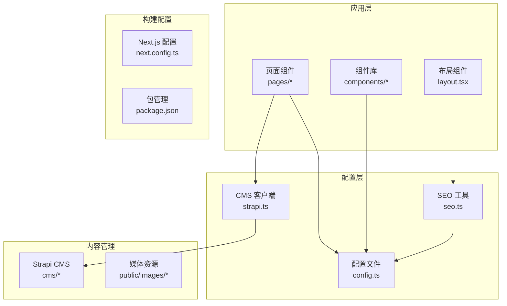

**图表来源**
- [layout.tsx:1-100](file://frontend/src/app/layout.tsx#L1-L100)
- [config.ts:1-177](file://frontend/src/lib/config.ts#L1-L177)
- [seo.ts:1-225](file://frontend/src/lib/seo.ts#L1-L225)

**章节来源**
- [layout.tsx:1-100](file://frontend/src/app/layout.tsx#L1-L100)
- [config.ts:1-177](file://frontend/src/lib/config.ts#L1-L177)
- [seo.ts:1-225](file://frontend/src/lib/seo.ts#L1-L225)

## 核心组件分析

### SEO 工具库

SEO 工具库是整个应用 SEO 优化的核心，提供了完整的结构化数据生成和元标签管理功能。

#### 结构化数据生成器

应用实现了多种类型的结构化数据标记，包括产品、FAQ、组织信息、面包屑导航和文章内容：

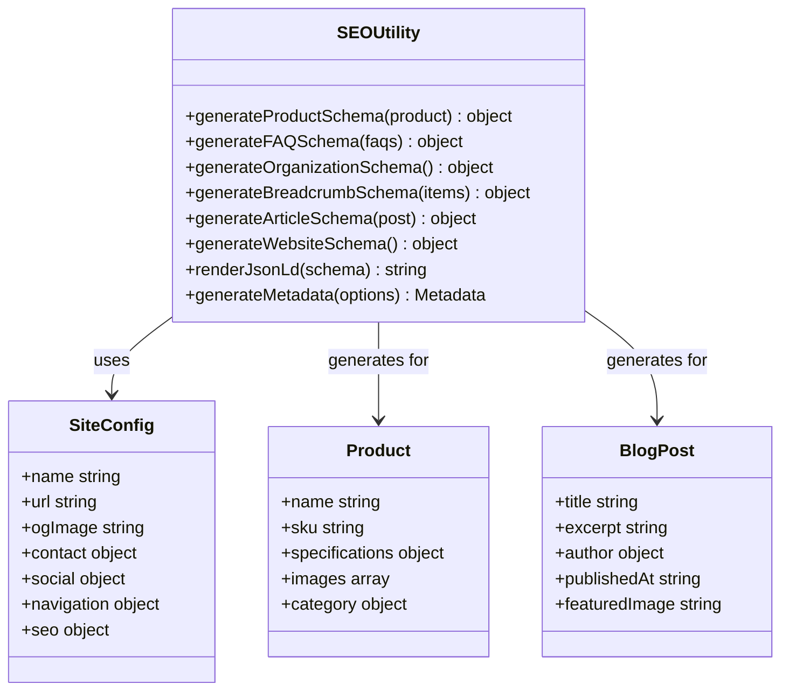

**图表来源**
- [seo.ts:1-225](file://frontend/src/lib/seo.ts#L1-L225)
- [config.ts:1-177](file://frontend/src/lib/config.ts#L1-L177)

#### 元标签管理系统

应用使用 Next.js 的 Metadata API 来管理所有 SEO 相关的元标签，包括：

- **标题管理**：支持模板化标题系统
- **描述优化**：自动生成页面描述
- **关键词管理**：维护全局关键词列表
- **社交网络优化**：Open Graph 和 Twitter Card 配置
- **搜索引擎友好**：Robots 和 Canonical URL 设置

**章节来源**
- [seo.ts:168-225](file://frontend/src/lib/seo.ts#L168-L225)
- [layout.tsx:13-64](file://frontend/src/app/layout.tsx#L13-L64)

### 内容管理系统集成

应用通过 Strapi CMS 提供动态内容管理，实现了以下功能：

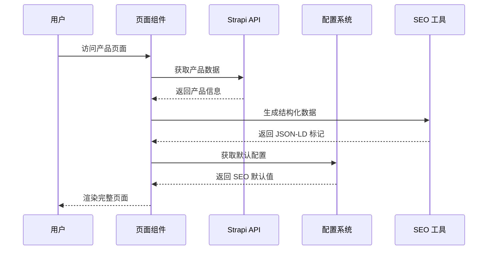

**图表来源**
- [product page.tsx:164-200](file://frontend/src/app/products/[category]/[slug]/page.tsx#L164-L200)
- [strapi.ts:51-119](file://frontend/src/lib/strapi.ts#L51-L119)

**章节来源**
- [strapi.ts:1-412](file://frontend/src/lib/strapi.ts#L1-L412)
- [product page.tsx:1-566](file://frontend/src/app/products/[category]/[slug]/page.tsx#L1-L566)

## 架构总览

Battivus 应用采用了现代化的全栈架构，结合了静态生成、动态内容管理和 SEO 优化的最佳实践：

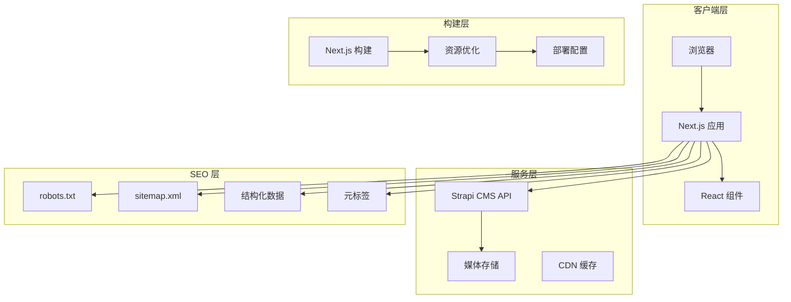

**图表来源**
- [layout.tsx:1-100](file://frontend/src/app/layout.tsx#L1-L100)
- [robots.ts:1-14](file://frontend/src/app/robots.ts#L1-L14)
- [sitemap.ts:1-50](file://frontend/src/app/sitemap.ts#L1-L50)

## 详细组件分析

### 布局系统

应用的布局系统是 SEO 优化的重要基础，提供了统一的头部、页脚和结构化数据标记：

#### 主布局配置

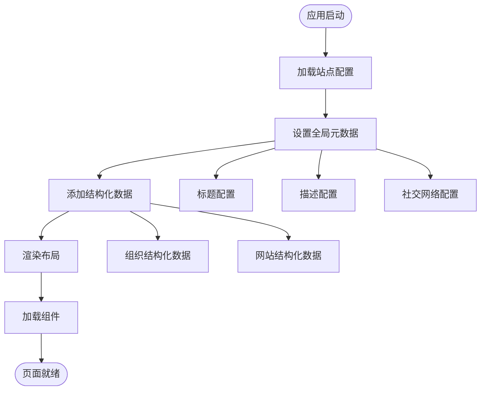

**图表来源**
- [layout.tsx:13-88](file://frontend/src/app/layout.tsx#L13-L88)

#### 结构化数据实现

应用在主布局中集成了两种核心的结构化数据：

1. **组织信息结构化数据**：提供公司基本信息、联系方式和品牌标识
2. **网站结构化数据**：定义网站搜索功能和用户交互行为

**章节来源**
- [layout.tsx:74-88](file://frontend/src/app/layout.tsx#L74-L88)
- [seo.ts:70-97](file://frontend/src/lib/seo.ts#L70-L97)
- [seo.ts:144-161](file://frontend/src/lib/seo.ts#L144-L161)

### 产品页面 SEO 优化

产品页面是应用中最重要的 SEO 页面之一，实现了全面的优化策略：

#### 动态元数据生成

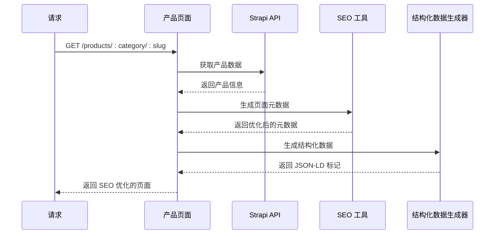

**图表来源**
- [product page.tsx:164-200](file://frontend/src/app/products/[category]/[slug]/page.tsx#L164-L200)

#### 结构化数据实现

产品页面生成了三种关键的结构化数据：

1. **产品结构化数据**：包含产品规格、价格信息和库存状态
2. **FAQ 结构化数据**：为常见问题提供结构化答案
3. **面包屑导航结构化数据**：提供清晰的页面层级信息

**章节来源**
- [product page.tsx:223-249](file://frontend/src/app/products/[category]/[slug]/page.tsx#L223-L249)
- [seo.ts:4-52](file://frontend/src/lib/seo.ts#L4-L52)
- [seo.ts:54-68](file://frontend/src/lib/seo.ts#L54-L68)
- [seo.ts:99-113](file://frontend/src/lib/seo.ts#L99-L113)

### 博客页面 SEO 优化

博客页面实现了完整的文章 SEO 优化策略：

#### 文章元数据管理

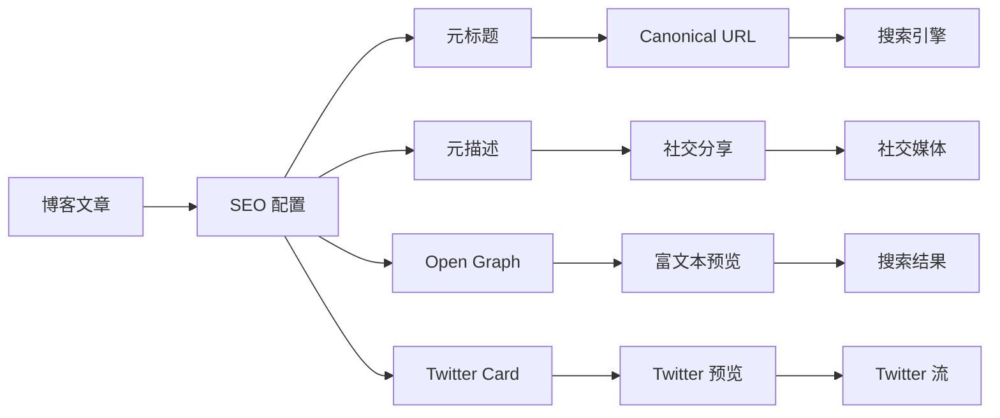

**图表来源**
- [blog post page.tsx:48-82](file://frontend/src/app/blog/[slug]/page.tsx#L48-L82)

**章节来源**
- [blog post page.tsx:48-82](file://frontend/src/app/blog/[slug]/page.tsx#L48-L82)
- [seo.ts:115-142](file://frontend/src/lib/seo.ts#L115-L142)

### 导航系统

应用的导航系统不仅提供了良好的用户体验，还包含了 SEO 优化元素：

#### 多级导航结构

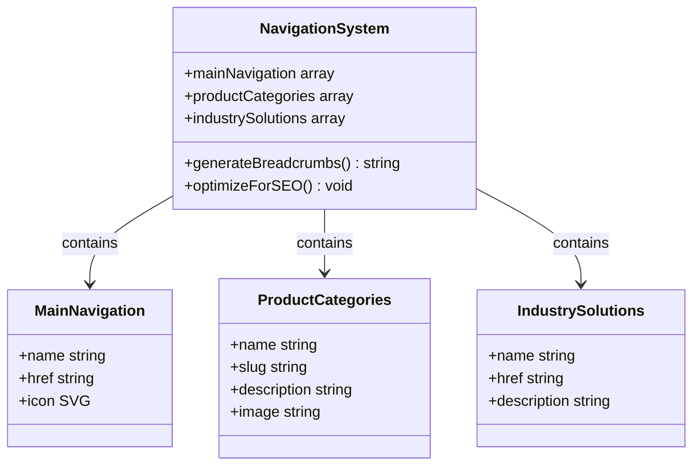

**图表来源**
- [config.ts:26-50](file://frontend/src/lib/config.ts#L26-L50)
- [Header.tsx:58-138](file://frontend/src/components/layout/Header.tsx#L58-L138)

**章节来源**
- [Header.tsx:1-196](file://frontend/src/components/layout/Header.tsx#L1-L196)
- [config.ts:26-50](file://frontend/src/lib/config.ts#L26-L50)

## 依赖关系分析

### 核心依赖关系

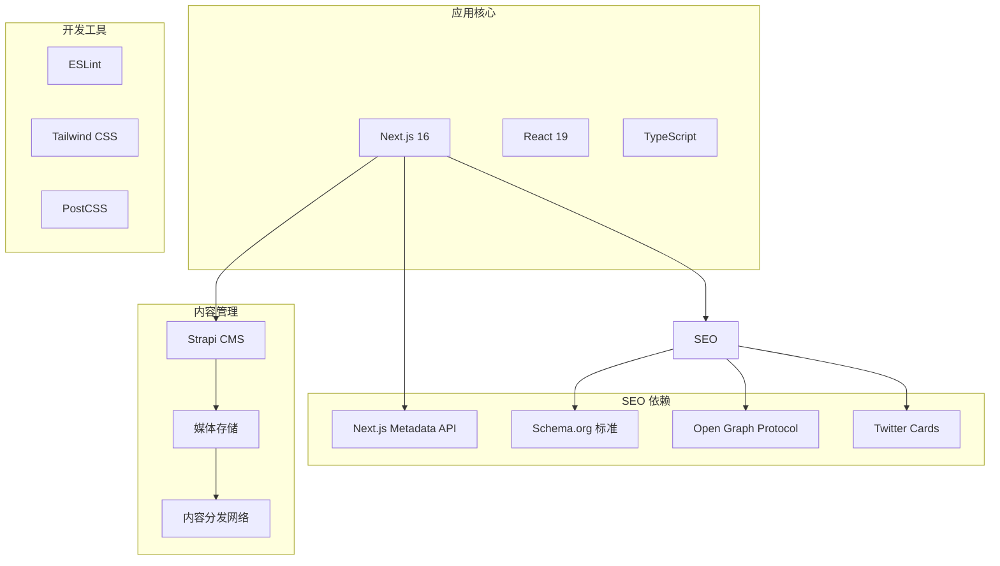

**图表来源**
- [package.json:11-25](file://frontend/package.json#L11-L25)

### 数据流分析

应用的数据流遵循严格的层次结构：

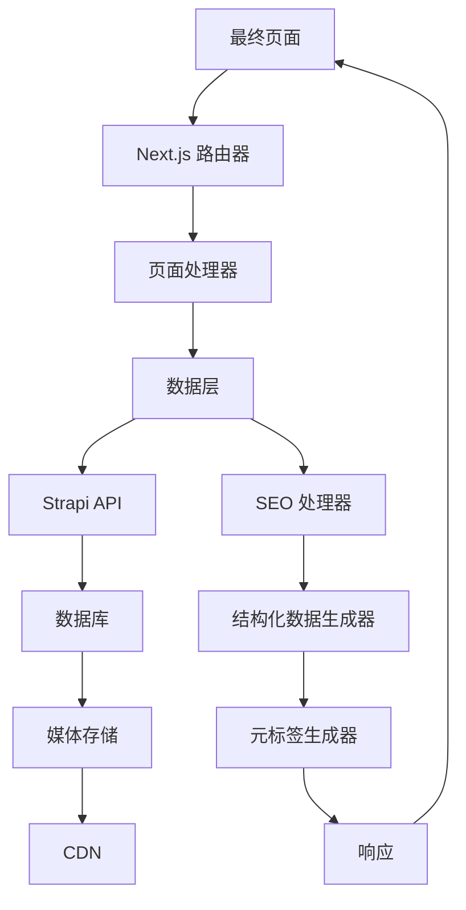

**图表来源**
- [strapi.ts:51-119](file://frontend/src/lib/strapi.ts#L51-L119)
- [seo.ts:168-225](file://frontend/src/lib/seo.ts#L168-L225)

**章节来源**
- [package.json:1-26](file://frontend/package.json#L1-L26)
- [strapi.ts:1-412](file://frontend/src/lib/strapi.ts#L1-L412)

## 性能考虑因素

### 页面加载性能优化

Battivus 应用在多个层面实现了性能优化：

#### 静态生成与增量更新

应用使用 Next.js 的静态生成功能，结合增量静态再生（ISR）来平衡性能和内容新鲜度：

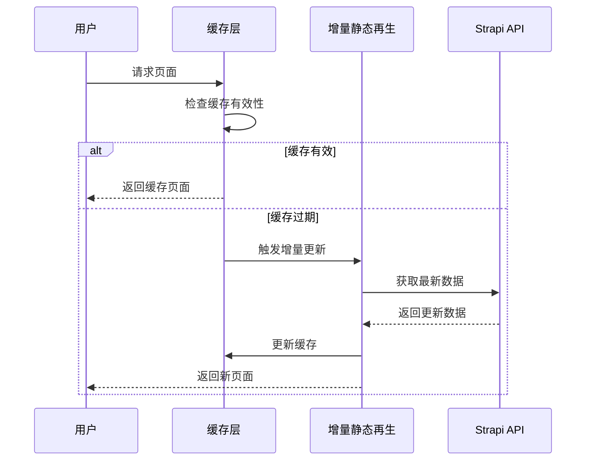

**图表来源**
- [strapi.ts:109-118](file://frontend/src/lib/strapi.ts#L109-L118)

#### 资源优化策略

应用实施了多种资源优化策略：

1. **图片优化**：使用 Next.js 的内置图片优化功能
2. **代码分割**：自动进行代码分割以减少初始加载时间
3. **懒加载**：对非关键资源实施懒加载策略
4. **缓存策略**：利用 CDN 和浏览器缓存机制

**章节来源**
- [strapi.ts:109-118](file://frontend/src/lib/strapi.ts#L109-L118)
- [next.config.ts:1-9](file://frontend/next.config.ts#L1-L9)

### SEO 性能监控

应用提供了完整的 SEO 性能监控框架：

#### 关键性能指标

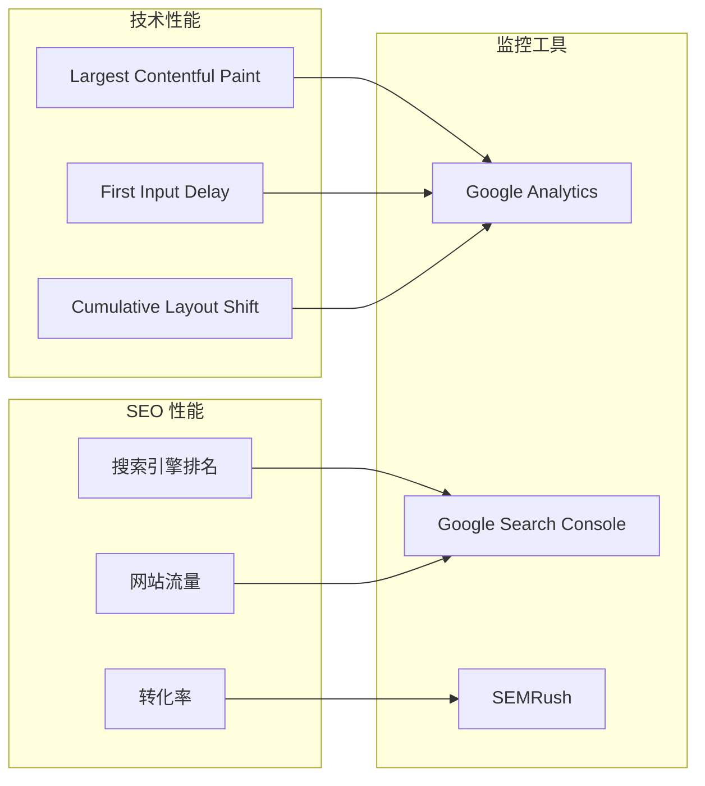

**图表来源**
- [layout.tsx:60-63](file://frontend/src/app/layout.tsx#L60-L63)

## 故障排除指南

### 常见 SEO 问题诊断

#### 结构化数据验证

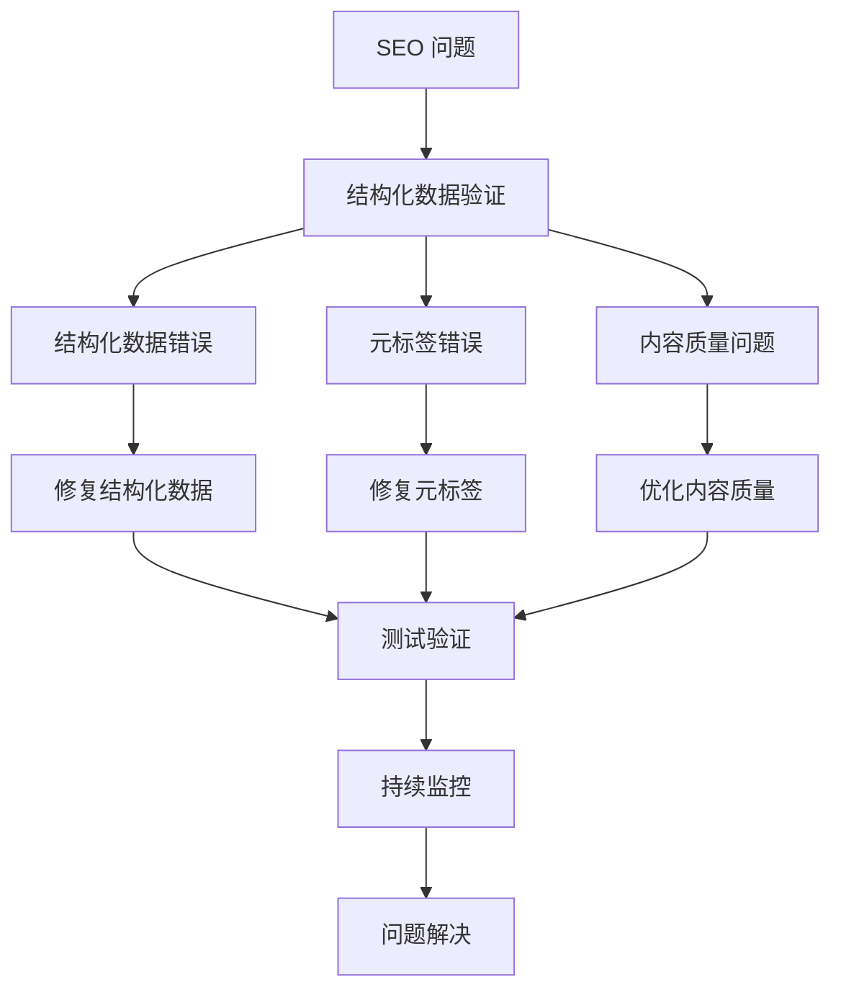

**图表来源**
- [seo.ts:164-166](file://frontend/src/lib/seo.ts#L164-L166)

#### 性能问题排查

应用提供了多种性能监控和调试工具：

1. **Next.js DevTools**：用于开发环境的性能分析
2. **浏览器开发者工具**：Network 和 Performance 面板
3. **Google PageSpeed Insights**：自动化性能评估
4. **Lighthouse**：深度性能和 SEO 分析

**章节来源**
- [layout.tsx:60-63](file://frontend/src/app/layout.tsx#L60-L63)
- [seo.ts:164-166](file://frontend/src/lib/seo.ts#L164-L166)

### 部署和维护

#### 自动化部署流程

**图表来源**
- [package.json:5-9](file://frontend/package.json#L5-L9)

**章节来源**
- [package.json:1-26](file://frontend/package.json#L1-L26)

## 结论

Battivus 前端应用展现了现代 Web 开发中 SEO 优化和性能监控的最佳实践。通过集成结构化数据、动态元标签管理和完整的 CMS 集成，该应用为搜索引擎提供了丰富的页面信息，同时通过多种性能优化策略确保了优秀的用户体验。

### 主要成就

1. **全面的 SEO 策略**：实现了从基础元标签到高级结构化数据的完整 SEO 体系
2. **动态内容管理**：通过 Strapi CMS 提供灵活的内容管理能力
3. **性能优化**：采用静态生成、增量更新和 CDN 缓存等策略
4. **可扩展架构**：模块化的组件设计便于功能扩展和维护

### 未来改进方向

1. **PWA 功能集成**：考虑添加渐进式 Web 应用特性
2. **实时性能监控**：集成更详细的性能监控和告警系统
3. **多语言支持**：扩展国际化功能以服务全球市场
4. **AI 辅助 SEO**：利用人工智能优化内容和关键词策略

该应用为其他企业网站的 SEO 优化和性能提升提供了宝贵的参考案例，展示了如何在保持技术先进性的同时实现卓越的搜索引擎表现。