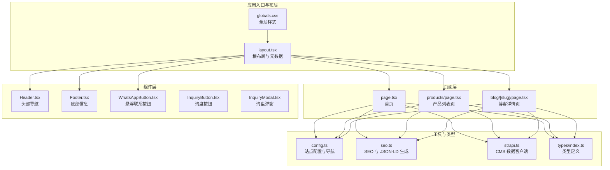
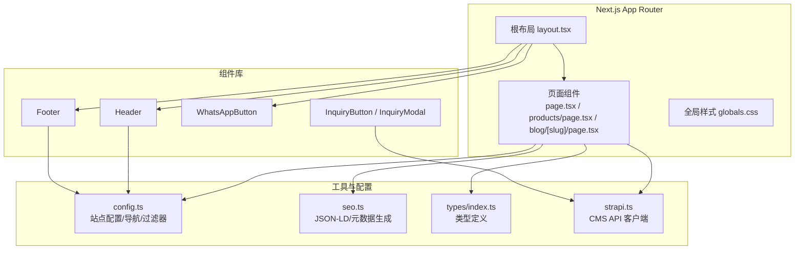
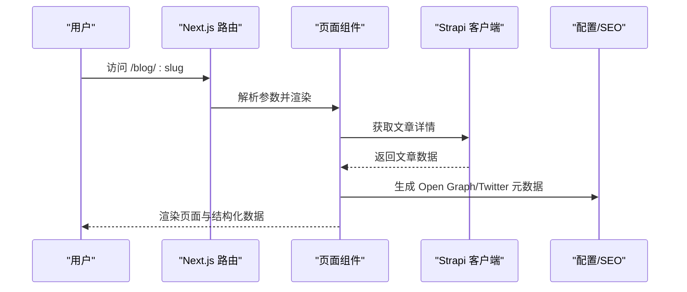
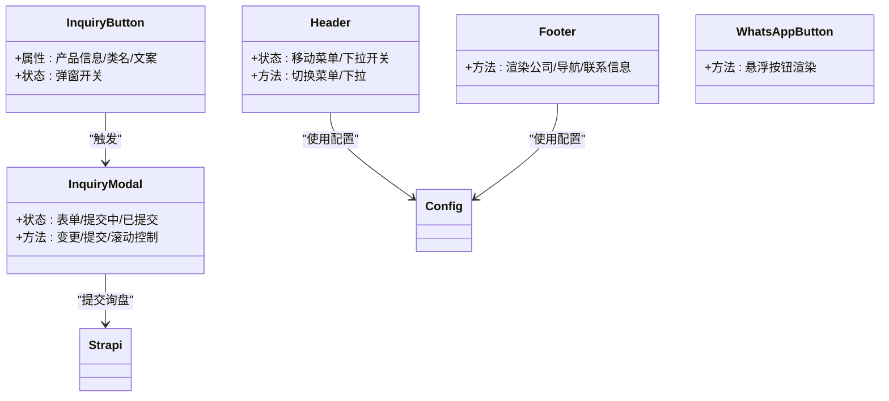
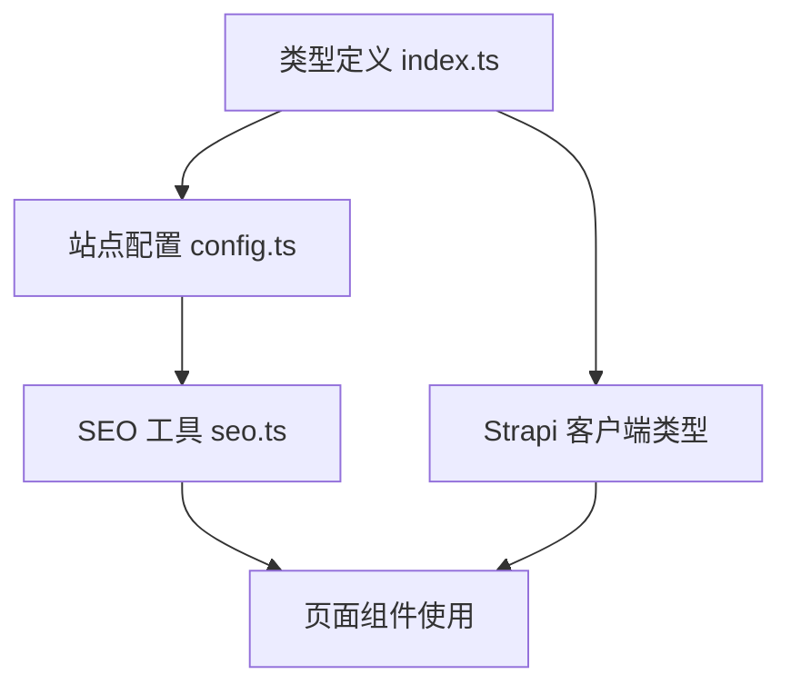
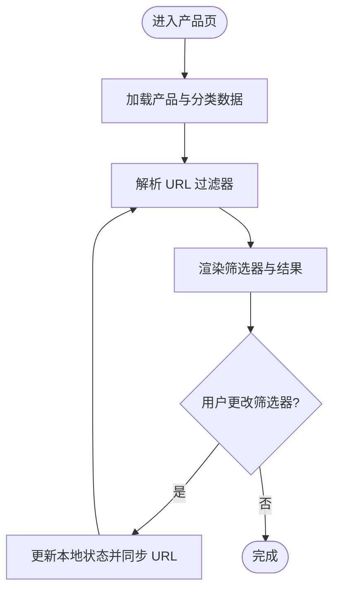
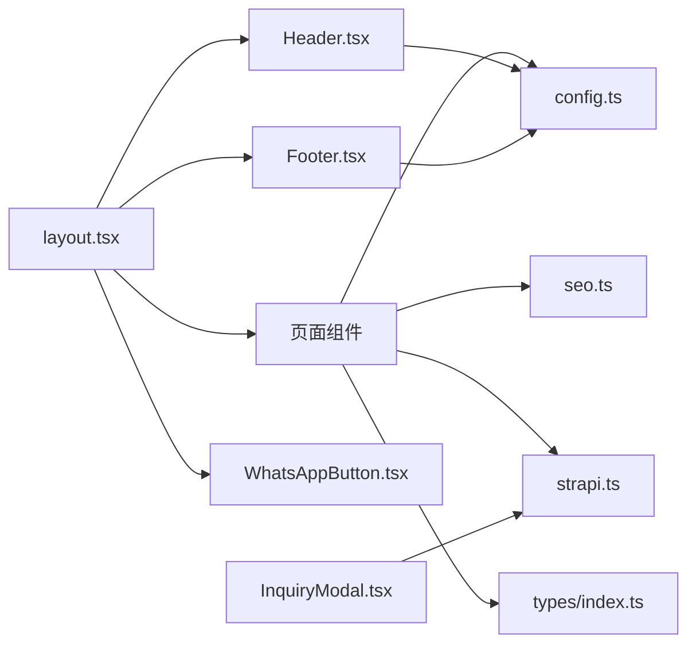

# 前端应用（Next.js）

<cite>
**本文引用的文件**
- [package.json](file://frontend/package.json)
- [next.config.ts](file://frontend/next.config.ts)
- [src/app/layout.tsx](file://frontend/src/app/layout.tsx)
- [src/app/globals.css](file://frontend/src/app/globals.css)
- [src/lib/config.ts](file://frontend/src/lib/config.ts)
- [src/lib/seo.ts](file://frontend/src/lib/seo.ts)
- [src/lib/strapi.ts](file://frontend/src/lib/strapi.ts)
- [src/types/index.ts](file://frontend/src/types/index.ts)
- [src/components/layout/Header.tsx](file://frontend/src/components/layout/Header.tsx)
- [src/components/layout/Footer.tsx](file://frontend/src/components/layout/Footer.tsx)
- [src/components/layout/WhatsAppButton.tsx](file://frontend/src/components/layout/WhatsAppButton.tsx)
- [src/components/forms/InquiryButton.tsx](file://frontend/src/components/forms/InquiryButton.tsx)
- [src/components/forms/InquiryModal.tsx](file://frontend/src/components/forms/InquiryModal.tsx)
- [src/app/page.tsx](file://frontend/src/app/page.tsx)
- [src/app/products/page.tsx](file://frontend/src/app/products/page.tsx)
- [src/app/blog/[slug]/page.tsx](file://frontend/src/app/blog/[slug]/page.tsx)
</cite>

## 目录
1. [简介](#简介)
2. [项目结构](#项目结构)
3. [核心组件](#核心组件)
4. [架构总览](#架构总览)
5. [详细组件分析](#详细组件分析)
6. [依赖关系分析](#依赖关系分析)
7. [性能考量](#性能考量)
8. [故障排查指南](#故障排查指南)
9. [结论](#结论)
10. [附录](#附录)

## 简介
本文件为 Battivus 前端应用的 Next.js 文档，覆盖应用结构、页面路由系统、组件架构与样式系统；详解 App Router 使用、页面组织方式与路由配置；文档化组件库设计理念、使用模式与自定义组件实现；包含状态管理策略、类型定义与配置选项；提供实际代码示例路径与使用模式；解释 SEO 优化策略、性能优化技巧与响应式设计实现。内容面向初学者提供概念解释，同时为有经验的开发者提供技术细节。

## 项目结构
前端采用 Next.js App Router 结构，页面位于 src/app 下，按功能模块组织；组件位于 src/components 下，按职责拆分；类型定义位于 src/types；通用配置与 SEO 工具位于 src/lib；全局样式位于 src/app/globals.css。

**图表来源**
- [src/app/layout.tsx:1-100](file://frontend/src/app/layout.tsx#L1-L100)
- [src/app/globals.css:1-27](file://frontend/src/app/globals.css#L1-L27)
- [src/app/page.tsx:1-395](file://frontend/src/app/page.tsx#L1-L395)
- [src/app/products/page.tsx:1-580](file://frontend/src/app/products/page.tsx#L1-L580)
- [src/app/blog/[slug]/page.tsx](file://frontend/src/app/blog/[slug]/page.tsx#L1-L290)
- [src/components/layout/Header.tsx:1-196](file://frontend/src/components/layout/Header.tsx#L1-L196)
- [src/components/layout/Footer.tsx:1-149](file://frontend/src/components/layout/Footer.tsx#L1-L149)
- [src/components/layout/WhatsAppButton.tsx](file://frontend/src/components/layout/WhatsAppButton.tsx)
- [src/components/forms/InquiryButton.tsx:1-55](file://frontend/src/components/forms/InquiryButton.tsx#L1-L55)
- [src/components/forms/InquiryModal.tsx:1-370](file://frontend/src/components/forms/InquiryModal.tsx#L1-L370)
- [src/lib/config.ts:1-177](file://frontend/src/lib/config.ts#L1-L177)
- [src/lib/seo.ts:1-225](file://frontend/src/lib/seo.ts#L1-L225)
- [src/lib/strapi.ts:1-412](file://frontend/src/lib/strapi.ts#L1-L412)
- [src/types/index.ts:1-157](file://frontend/src/types/index.ts#L1-L157)

**章节来源**
- [package.json:1-26](file://frontend/package.json#L1-L26)
- [next.config.ts:1-9](file://frontend/next.config.ts#L1-L9)
- [src/app/layout.tsx:1-100](file://frontend/src/app/layout.tsx#L1-L100)
- [src/app/globals.css:1-27](file://frontend/src/app/globals.css#L1-L27)

## 核心组件
- 根布局与元数据：在根布局中集中配置站点标题、描述、Open Graph、Twitter 卡片、robots、验证等，并注入组织与网站结构化数据脚本标签。
- 导航与页脚：Header 提供桌面与移动端菜单、下拉子导航；Footer 展示公司信息、产品与解决方案导航、联系方式与社交媒体链接。
- 交互组件：InquiryButton 与 InquiryModal 实现“询盘”交互，支持预填产品信息、表单校验与提交反馈。
- 页面组件：首页聚合分类、优势、认证、解决方案与博客预览；产品页提供参数化筛选器与结果展示；博客详情页支持静态生成与 SEO 元数据。

**章节来源**
- [src/app/layout.tsx:1-100](file://frontend/src/app/layout.tsx#L1-L100)
- [src/components/layout/Header.tsx:1-196](file://frontend/src/components/layout/Header.tsx#L1-L196)
- [src/components/layout/Footer.tsx:1-149](file://frontend/src/components/layout/Footer.tsx#L1-L149)
- [src/components/forms/InquiryButton.tsx:1-55](file://frontend/src/components/forms/InquiryButton.tsx#L1-L55)
- [src/components/forms/InquiryModal.tsx:1-370](file://frontend/src/components/forms/InquiryModal.tsx#L1-L370)
- [src/app/page.tsx:1-395](file://frontend/src/app/page.tsx#L1-L395)
- [src/app/products/page.tsx:1-580](file://frontend/src/app/products/page.tsx#L1-L580)
- [src/app/blog/[slug]/page.tsx](file://frontend/src/app/blog/[slug]/page.tsx#L1-L290)

## 架构总览
应用采用“页面即服务”的 App Router 模式，页面通过异步数据获取与客户端交互结合，组件按职责拆分，类型定义统一管理，CMS 通过 Strapi 客户端封装访问。

**图表来源**
- [src/app/layout.tsx:1-100](file://frontend/src/app/layout.tsx#L1-L100)
- [src/app/page.tsx:1-395](file://frontend/src/app/page.tsx#L1-L395)
- [src/app/products/page.tsx:1-580](file://frontend/src/app/products/page.tsx#L1-L580)
- [src/app/blog/[slug]/page.tsx](file://frontend/src/app/blog/[slug]/page.tsx#L1-L290)
- [src/lib/config.ts:1-177](file://frontend/src/lib/config.ts#L1-L177)
- [src/lib/seo.ts:1-225](file://frontend/src/lib/seo.ts#L1-L225)
- [src/lib/strapi.ts:1-412](file://frontend/src/lib/strapi.ts#L1-L412)
- [src/types/index.ts:1-157](file://frontend/src/types/index.ts#L1-L157)

## 详细组件分析

### 页面与路由系统
- 首页：聚合产品分类、优势卡片、认证徽章、解决方案预览与博客文章预览，使用异步数据获取与回退逻辑。
- 产品列表页：参数化筛选（电压、容量、放电率、电池类型、分类），URL 同步与本地状态联动，支持移动端筛选抽屉与加载骨架。
- 博客详情页：支持静态生成参数、动态元数据生成、面包屑导航、分享按钮与相关内容引导。

**图表来源**
- [src/app/blog/[slug]/page.tsx](file://frontend/src/app/blog/[slug]/page.tsx#L1-L290)
- [src/lib/strapi.ts:237-274](file://frontend/src/lib/strapi.ts#L237-L274)
- [src/lib/seo.ts:115-142](file://frontend/src/lib/seo.ts#L115-L142)

**章节来源**
- [src/app/page.tsx:1-395](file://frontend/src/app/page.tsx#L1-L395)
- [src/app/products/page.tsx:1-580](file://frontend/src/app/products/page.tsx#L1-L580)
- [src/app/blog/[slug]/page.tsx](file://frontend/src/app/blog/[slug]/page.tsx#L1-L290)

### 组件库与交互
- 头部导航：支持移动端菜单、鼠标悬停触发的产品与解决方案下拉菜单，使用站点配置驱动导航项。
- 询盘组件：InquiryButton 触发 InquiryModal，收集用户信息并调用 Strapi 提交接口，支持预填产品信息与隐私条款勾选。
- 页脚：网格布局展示公司信息、产品与解决方案导航、联系方式与社交媒体链接，包含版权与隐私条款链接。

**图表来源**
- [src/components/layout/Header.tsx:1-196](file://frontend/src/components/layout/Header.tsx#L1-L196)
- [src/components/layout/Footer.tsx:1-149](file://frontend/src/components/layout/Footer.tsx#L1-L149)
- [src/components/layout/WhatsAppButton.tsx](file://frontend/src/components/layout/WhatsAppButton.tsx)
- [src/components/forms/InquiryButton.tsx:1-55](file://frontend/src/components/forms/InquiryButton.tsx#L1-L55)
- [src/components/forms/InquiryModal.tsx:1-370](file://frontend/src/components/forms/InquiryModal.tsx#L1-L370)
- [src/lib/config.ts:1-177](file://frontend/src/lib/config.ts#L1-L177)
- [src/lib/strapi.ts:290-306](file://frontend/src/lib/strapi.ts#L290-L306)

**章节来源**
- [src/components/layout/Header.tsx:1-196](file://frontend/src/components/layout/Header.tsx#L1-L196)
- [src/components/layout/Footer.tsx:1-149](file://frontend/src/components/layout/Footer.tsx#L1-L149)
- [src/components/forms/InquiryButton.tsx:1-55](file://frontend/src/components/forms/InquiryButton.tsx#L1-L55)
- [src/components/forms/InquiryModal.tsx:1-370](file://frontend/src/components/forms/InquiryModal.tsx#L1-L370)

### 类型系统与配置
- 类型定义：涵盖产品、博客、解决方案、页面、询盘表单、过滤器与公司信息等，确保前后端字段一致性。
- 站点配置：集中管理品牌信息、联系信息、社交链接、导航菜单、SEO 默认值与筛选器选项。
- SEO 工具：生成产品、FAQ、组织、面包屑、文章与网站结构化数据，以及 Next.js Metadata 对象。

**图表来源**
- [src/types/index.ts:1-157](file://frontend/src/types/index.ts#L1-L157)
- [src/lib/config.ts:1-177](file://frontend/src/lib/config.ts#L1-L177)
- [src/lib/seo.ts:1-225](file://frontend/src/lib/seo.ts#L1-L225)
- [src/lib/strapi.ts:320-412](file://frontend/src/lib/strapi.ts#L320-L412)

**章节来源**
- [src/types/index.ts:1-157](file://frontend/src/types/index.ts#L1-L157)
- [src/lib/config.ts:1-177](file://frontend/src/lib/config.ts#L1-L177)
- [src/lib/seo.ts:1-225](file://frontend/src/lib/seo.ts#L1-L225)

### 状态管理策略
- 页面内状态：产品筛选页使用 useState 管理过滤条件与加载状态，useMemo 进行结果过滤缓存，useEffect 同步 URL 参数与状态。
- 客户端交互：询盘弹窗使用 useState 控制可见性与提交流程，useEffect 控制滚动锁定。
- 服务器端数据：首页与博客详情页通过异步函数获取数据，失败时提供回退方案或错误提示。

**图表来源**
- [src/app/products/page.tsx:278-401](file://frontend/src/app/products/page.tsx#L278-L401)

**章节来源**
- [src/app/products/page.tsx:1-580](file://frontend/src/app/products/page.tsx#L1-L580)
- [src/components/forms/InquiryModal.tsx:1-370](file://frontend/src/components/forms/InquiryModal.tsx#L1-L370)

### 样式系统与响应式设计
- 全局样式：Tailwind CSS 作为基础，使用 CSS 变量控制明暗主题，body 字体与背景色随主题切换。
- 组件样式：使用 Tailwind 类进行布局与响应式断点控制，如网格列数、间距与文字大小在不同屏幕尺寸下的适配。
- 图像处理：通过 Strapi 媒体工具拼接完整 URL，图片懒加载与占位符提升体验。

**章节来源**
- [src/app/globals.css:1-27](file://frontend/src/app/globals.css#L1-L27)
- [src/app/page.tsx:1-395](file://frontend/src/app/page.tsx#L1-L395)
- [src/app/products/page.tsx:1-580](file://frontend/src/app/products/page.tsx#L1-L580)

### SEO 优化策略
- 结构化数据：在根布局注入组织与网站结构化数据脚本；页面级根据内容生成产品、文章、面包屑等 JSON-LD。
- 动态元数据：博客详情页根据文章 SEO 字段生成 Open Graph 与 Twitter 卡片，设置 canonical 链接。
- 站点配置：集中管理默认标题、描述、关键词、OG 图与验证信息，便于统一维护。

**章节来源**
- [src/app/layout.tsx:1-100](file://frontend/src/app/layout.tsx#L1-L100)
- [src/lib/seo.ts:1-225](file://frontend/src/lib/seo.ts#L1-L225)
- [src/app/blog/[slug]/page.tsx](file://frontend/src/app/blog/[slug]/page.tsx#L48-L82)

### 性能优化技巧
- 缓存与增量更新：Strapi 客户端使用 next.revalidate 控制缓存刷新周期，降低请求开销。
- 骨架屏与渐进增强：产品列表页在加载时显示骨架屏，提升感知性能。
- 静态生成：博客详情页在构建期生成静态参数，减少运行时负载。
- 资源优化：图像通过媒体工具拼接完整 URL，避免重复请求与跨域问题。

**章节来源**
- [src/lib/strapi.ts:109-118](file://frontend/src/lib/strapi.ts#L109-L118)
- [src/app/products/page.tsx:492-511](file://frontend/src/app/products/page.tsx#L492-L511)
- [src/app/blog/[slug]/page.tsx](file://frontend/src/app/blog/[slug]/page.tsx#L32-L46)

## 依赖关系分析
- 依赖关系：页面组件依赖配置、SEO 工具与 Strapi 客户端；组件依赖配置与类型；根布局依赖组件与 SEO 工具。
- 外部依赖：Next.js、React、Tailwind CSS、TypeScript；开发依赖包括 ESLint、Tailwind PostCSS 插件等。

**图表来源**
- [src/app/page.tsx:1-395](file://frontend/src/app/page.tsx#L1-L395)
- [src/app/products/page.tsx:1-580](file://frontend/src/app/products/page.tsx#L1-L580)
- [src/app/blog/[slug]/page.tsx](file://frontend/src/app/blog/[slug]/page.tsx#L1-L290)
- [src/lib/config.ts:1-177](file://frontend/src/lib/config.ts#L1-L177)
- [src/lib/seo.ts:1-225](file://frontend/src/lib/seo.ts#L1-L225)
- [src/lib/strapi.ts:1-412](file://frontend/src/lib/strapi.ts#L1-L412)
- [src/types/index.ts:1-157](file://frontend/src/types/index.ts#L1-L157)
- [src/app/layout.tsx:1-100](file://frontend/src/app/layout.tsx#L1-L100)
- [src/components/layout/Header.tsx:1-196](file://frontend/src/components/layout/Header.tsx#L1-L196)
- [src/components/layout/Footer.tsx:1-149](file://frontend/src/components/layout/Footer.tsx#L1-L149)
- [src/components/layout/WhatsAppButton.tsx](file://frontend/src/components/layout/WhatsAppButton.tsx)
- [src/components/forms/InquiryModal.tsx:1-370](file://frontend/src/components/forms/InquiryModal.tsx#L1-L370)

**章节来源**
- [package.json:1-26](file://frontend/package.json#L1-L26)
- [next.config.ts:1-9](file://frontend/next.config.ts#L1-L9)

## 性能考量
- 数据获取：合理使用 revalidate 与缓存策略，避免频繁请求；对可预测的页面（如博客）启用静态生成。
- 渲染优化：在数据加载阶段使用骨架屏与占位符；对复杂列表使用虚拟化或分页。
- 资源优化：优先使用现代图片格式与合适的尺寸；利用 CDN 与缓存头。
- 交互优化：将非关键 JS 与样式延迟加载；减少不必要的重渲染，使用 useMemo/useCallback。

## 故障排查指南
- Strapi 连接失败：检查 NEXT_PUBLIC_STRAPI_URL 与 API Token 环境变量；确认网络可达与 CORS 设置。
- 页面空白或加载失败：查看浏览器控制台错误；检查页面异步数据获取的错误分支与回退逻辑。
- SEO 数据缺失：确认 generateMetadata 与 JSON-LD 注入是否正确；检查 SEO 字段是否在 CMS 中填写。
- 询盘提交异常：检查提交接口返回状态与错误日志；确认必填字段与隐私条款勾选。

**章节来源**
- [src/lib/strapi.ts:8-9](file://frontend/src/lib/strapi.ts#L8-L9)
- [src/app/blog/[slug]/page.tsx](file://frontend/src/app/blog/[slug]/page.tsx#L10-L30)
- [src/lib/seo.ts:163-225](file://frontend/src/lib/seo.ts#L163-L225)
- [src/components/forms/InquiryModal.tsx:46-95](file://frontend/src/components/forms/InquiryModal.tsx#L46-L95)

## 结论
该 Next.js 前端应用以 App Router 为核心，结合类型系统、配置与 SEO 工具，实现了清晰的页面组织与组件复用。通过 Strapi 客户端统一数据访问，配合参数化筛选、静态生成与缓存策略，兼顾了性能与可维护性。组件库以职责分离与可扩展为目标，适合在多页面场景中持续演进。

## 附录
- 开发与构建命令：dev、build、start、lint。
- Next 配置：开发指示器关闭，便于生产环境更简洁输出。
- 关键实现路径参考：
  - 根布局与元数据：[src/app/layout.tsx:1-100](file://frontend/src/app/layout.tsx#L1-L100)
  - 全局样式：[src/app/globals.css:1-27](file://frontend/src/app/globals.css#L1-L27)
  - 站点配置：[src/lib/config.ts:1-177](file://frontend/src/lib/config.ts#L1-L177)
  - SEO 工具：[src/lib/seo.ts:1-225](file://frontend/src/lib/seo.ts#L1-L225)
  - CMS 客户端：[src/lib/strapi.ts:1-412](file://frontend/src/lib/strapi.ts#L1-L412)
  - 类型定义：[src/types/index.ts:1-157](file://frontend/src/types/index.ts#L1-L157)
  - 首页：[src/app/page.tsx:1-395](file://frontend/src/app/page.tsx#L1-L395)
  - 产品页：[src/app/products/page.tsx:1-580](file://frontend/src/app/products/page.tsx#L1-L580)
  - 博客详情页：[src/app/blog/[slug]/page.tsx](file://frontend/src/app/blog/[slug]/page.tsx#L1-L290)
  - 头部组件：[src/components/layout/Header.tsx:1-196](file://frontend/src/components/layout/Header.tsx#L1-L196)
  - 页脚组件：[src/components/layout/Footer.tsx:1-149](file://frontend/src/components/layout/Footer.tsx#L1-L149)
  - 询盘按钮与弹窗：[src/components/forms/InquiryButton.tsx:1-55](file://frontend/src/components/forms/InquiryButton.tsx#L1-L55)、[src/components/forms/InquiryModal.tsx:1-370](file://frontend/src/components/forms/InquiryModal.tsx#L1-L370)