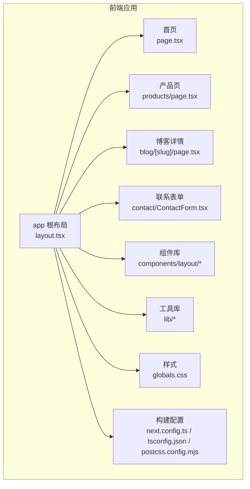
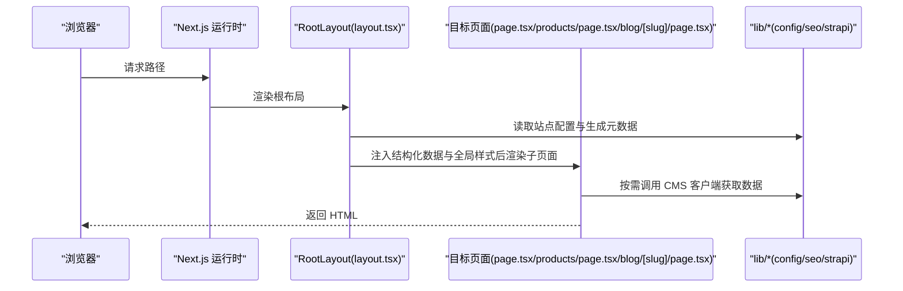
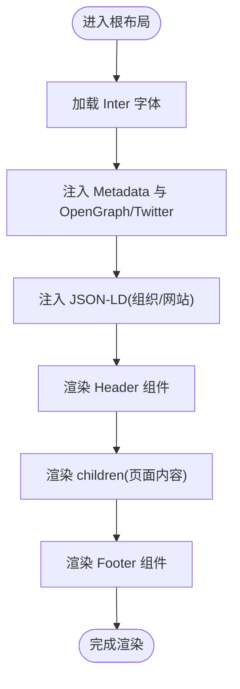
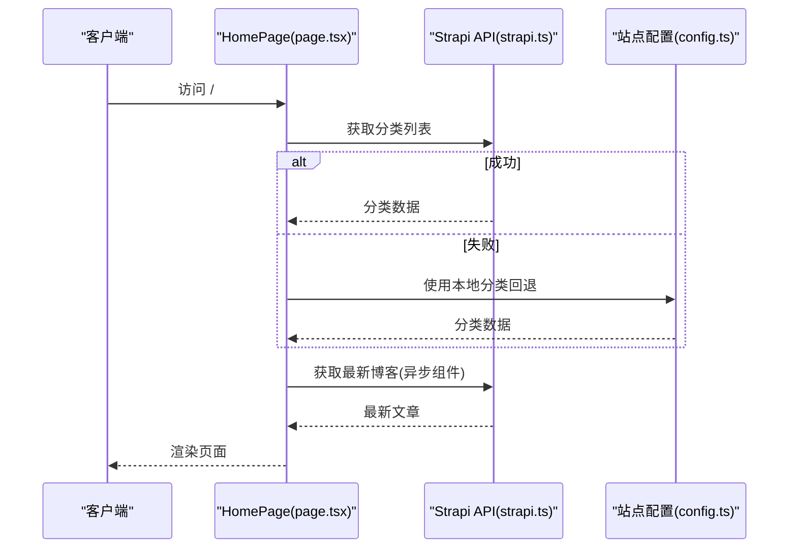
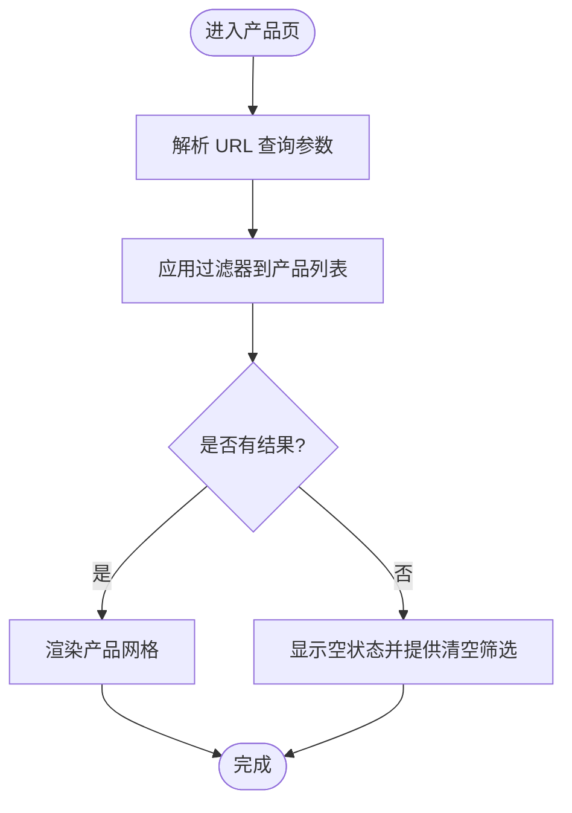
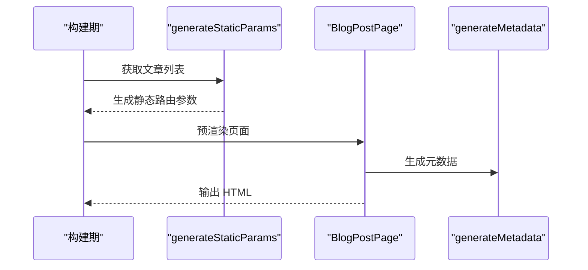
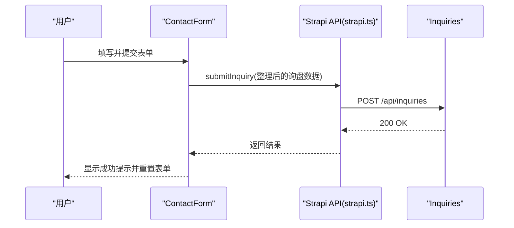
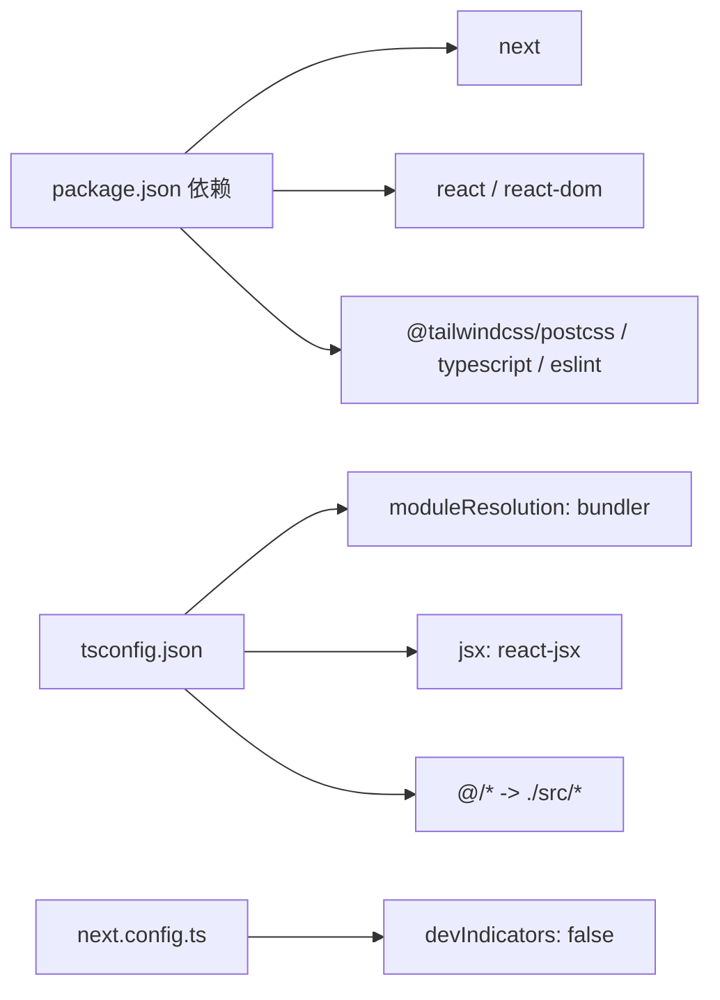

# 应用结构分析

<cite>
**本文引用的文件**
- [frontend/src/app/layout.tsx](file://frontend/src/app/layout.tsx)
- [frontend/src/app/page.tsx](file://frontend/src/app/page.tsx)
- [frontend/src/app/globals.css](file://frontend/src/app/globals.css)
- [frontend/next.config.ts](file://frontend/next.config.ts)
- [frontend/package.json](file://frontend/package.json)
- [frontend/src/lib/config.ts](file://frontend/src/lib/config.ts)
- [frontend/src/lib/seo.ts](file://frontend/src/lib/seo.ts)
- [frontend/src/lib/strapi.ts](file://frontend/src/lib/strapi.ts)
- [frontend/src/components/layout/Header.tsx](file://frontend/src/components/layout/Header.tsx)
- [frontend/src/components/layout/Footer.tsx](file://frontend/src/components/layout/Footer.tsx)
- [frontend/src/app/products/page.tsx](file://frontend/src/app/products/page.tsx)
- [frontend/src/app/blog/[slug]/page.tsx](file://frontend/src/app/blog/[slug]/page.tsx)
- [frontend/src/app/contact/ContactForm.tsx](file://frontend/src/app/contact/ContactForm.tsx)
- [frontend/tsconfig.json](file://frontend/tsconfig.json)
- [frontend/postcss.config.mjs](file://frontend/postcss.config.mjs)
</cite>

## 目录
1. [引言](#引言)
2. [项目结构](#项目结构)
3. [核心组件](#核心组件)
4. [架构总览](#架构总览)
5. [详细组件分析](#详细组件分析)
6. [依赖分析](#依赖分析)
7. [性能考虑](#性能考虑)
8. [故障排除指南](#故障排除指南)
9. [结论](#结论)
10. [附录](#附录)

## 引言
本文件针对 Battivus 前端应用进行系统性结构分析，重点围绕 Next.js App Router 的架构设计、文件系统路由约定与页面组织方式进行深入解读，并结合项目实际代码，说明根布局组件的实现、元数据配置与全局样式管理，梳理应用程序的层次结构、组件嵌套关系与渲染流程。文档同时涵盖国际化支持、主题配置与响应式设计的基础架构说明，并提供面向初学者的概念解释与面向有经验开发者的架构细节与最佳实践。

## 项目结构
前端项目采用 Next.js App Router 的 app 目录结构，页面与布局通过文件系统自动映射路由，配合 src 下的组件、库与类型定义，形成清晰的分层组织：
- app：页面与布局（含动态路由段、静态生成等）
- components：可复用 UI 组件（布局、表单等）
- lib：配置、SEO、CMS 客户端封装
- types：共享类型定义
- public/images：公共资源
- 配置文件：next.config.ts、tsconfig.json、postcss.config.mjs 等

图表来源
- [frontend/src/app/layout.tsx:66-99](file://frontend/src/app/layout.tsx#L66-L99)
- [frontend/src/app/page.tsx:1-395](file://frontend/src/app/page.tsx#L1-L395)
- [frontend/src/app/products/page.tsx:1-580](file://frontend/src/app/products/page.tsx#L1-L580)
- [frontend/src/app/blog/[slug]/page.tsx](file://frontend/src/app/blog/[slug]/page.tsx#L1-L290)
- [frontend/src/app/contact/ContactForm.tsx:1-269](file://frontend/src/app/contact/ContactForm.tsx#L1-L269)
- [frontend/src/components/layout/Header.tsx:1-196](file://frontend/src/components/layout/Header.tsx#L1-L196)
- [frontend/src/components/layout/Footer.tsx:1-149](file://frontend/src/components/layout/Footer.tsx#L1-L149)
- [frontend/src/lib/config.ts:1-177](file://frontend/src/lib/config.ts#L1-L177)
- [frontend/src/lib/seo.ts:1-225](file://frontend/src/lib/seo.ts#L1-L225)
- [frontend/src/lib/strapi.ts:1-412](file://frontend/src/lib/strapi.ts#L1-L412)
- [frontend/src/app/globals.css:1-27](file://frontend/src/app/globals.css#L1-L27)
- [frontend/next.config.ts:1-9](file://frontend/next.config.ts#L1-L9)
- [frontend/tsconfig.json:1-35](file://frontend/tsconfig.json#L1-L35)
- [frontend/postcss.config.mjs:1-8](file://frontend/postcss.config.mjs#L1-L8)

章节来源
- [frontend/src/app/layout.tsx:1-100](file://frontend/src/app/layout.tsx#L1-L100)
- [frontend/src/app/page.tsx:1-395](file://frontend/src/app/page.tsx#L1-L395)
- [frontend/src/app/products/page.tsx:1-580](file://frontend/src/app/products/page.tsx#L1-L580)
- [frontend/src/app/blog/[slug]/page.tsx](file://frontend/src/app/blog/[slug]/page.tsx#L1-L290)
- [frontend/src/app/contact/ContactForm.tsx:1-269](file://frontend/src/app/contact/ContactForm.tsx#L1-L269)
- [frontend/src/components/layout/Header.tsx:1-196](file://frontend/src/components/layout/Header.tsx#L1-L196)
- [frontend/src/components/layout/Footer.tsx:1-149](file://frontend/src/components/layout/Footer.tsx#L1-L149)
- [frontend/src/lib/config.ts:1-177](file://frontend/src/lib/config.ts#L1-L177)
- [frontend/src/lib/seo.ts:1-225](file://frontend/src/lib/seo.ts#L1-L225)
- [frontend/src/lib/strapi.ts:1-412](file://frontend/src/lib/strapi.ts#L1-L412)
- [frontend/src/app/globals.css:1-27](file://frontend/src/app/globals.css#L1-L27)
- [frontend/next.config.ts:1-9](file://frontend/next.config.ts#L1-L9)
- [frontend/tsconfig.json:1-35](file://frontend/tsconfig.json#L1-L35)
- [frontend/postcss.config.mjs:1-8](file://frontend/postcss.config.mjs#L1-L8)

## 核心组件
- 根布局与元数据：根布局负责注入全局样式、设置语言、渲染头部结构化数据与社交元信息，并包裹所有页面内容。
- 页面与路由：首页、产品页、博客详情页、联系页等均以文件系统命名与嵌套组织，支持动态路由段与静态生成。
- 组件体系：Header、Footer、WhatsAppButton 等布局组件在根布局中统一渲染；ContactForm 独立封装联系表单交互逻辑。
- 工具库：config 提供站点配置与导航；seo 提供 JSON-LD 与 Next.js 元数据生成；strapi 封装 CMS 数据访问与缓存策略。
- 样式与主题：Tailwind 与 CSS 变量驱动的主题切换与暗色模式适配；全局字体与基础排版。

章节来源
- [frontend/src/app/layout.tsx:1-100](file://frontend/src/app/layout.tsx#L1-L100)
- [frontend/src/app/page.tsx:1-395](file://frontend/src/app/page.tsx#L1-L395)
- [frontend/src/lib/config.ts:1-177](file://frontend/src/lib/config.ts#L1-L177)
- [frontend/src/lib/seo.ts:1-225](file://frontend/src/lib/seo.ts#L1-L225)
- [frontend/src/lib/strapi.ts:1-412](file://frontend/src/lib/strapi.ts#L1-L412)
- [frontend/src/app/globals.css:1-27](file://frontend/src/app/globals.css#L1-L27)
- [frontend/src/components/layout/Header.tsx:1-196](file://frontend/src/components/layout/Header.tsx#L1-L196)
- [frontend/src/components/layout/Footer.tsx:1-149](file://frontend/src/components/layout/Footer.tsx#L1-L149)
- [frontend/src/app/contact/ContactForm.tsx:1-269](file://frontend/src/app/contact/ContactForm.tsx#L1-L269)

## 架构总览
Next.js App Router 通过 app 目录下的文件系统约定自动建立路由映射，根布局作为所有页面的容器，负责：
- 全局样式与字体加载
- 元数据与结构化数据注入
- 顶层组件（Header、Footer、WhatsAppButton）渲染
- 子页面内容(children)的占位与渲染

图表来源
- [frontend/src/app/layout.tsx:13-99](file://frontend/src/app/layout.tsx#L13-L99)
- [frontend/src/app/page.tsx:1-395](file://frontend/src/app/page.tsx#L1-L395)
- [frontend/src/app/products/page.tsx:1-580](file://frontend/src/app/products/page.tsx#L1-L580)
- [frontend/src/app/blog/[slug]/page.tsx](file://frontend/src/app/blog/[slug]/page.tsx#L1-L290)
- [frontend/src/lib/config.ts:1-177](file://frontend/src/lib/config.ts#L1-L177)
- [frontend/src/lib/seo.ts:1-225](file://frontend/src/lib/seo.ts#L1-L225)
- [frontend/src/lib/strapi.ts:1-412](file://frontend/src/lib/strapi.ts#L1-L412)

## 详细组件分析

### 根布局与元数据配置
- 全局样式：导入 Tailwind 并引入全局 CSS，设置字体与基础排版。
- 元数据：使用 Next.js Metadata API，集中配置标题模板、描述、关键词、OpenGraph、Twitter 卡片、robots 等。
- 结构化数据：在 head 中注入 JSON-LD（组织、网站），提升 SEO 与社交分享体验。
- 内容容器：在 body 中渲染 Header、main 区域与 Footer，并在根节点设置语言属性。

图表来源
- [frontend/src/app/layout.tsx:1-100](file://frontend/src/app/layout.tsx#L1-L100)
- [frontend/src/lib/seo.ts:70-161](file://frontend/src/lib/seo.ts#L70-L161)

章节来源
- [frontend/src/app/layout.tsx:1-100](file://frontend/src/app/layout.tsx#L1-L100)
- [frontend/src/lib/seo.ts:1-225](file://frontend/src/lib/seo.ts#L1-L225)

### 首页页面与数据流
- 功能概览：首页聚合产品分类、特性介绍、认证徽章、行业解决方案、博客预览与 CTA。
- 数据获取：优先从 Strapi 获取分类数据，失败时回退到本地配置；博客卡片通过独立异步组件拉取最新文章。
- 响应式设计：使用 Tailwind 实现多列网格与移动端适配。

图表来源
- [frontend/src/app/page.tsx:1-395](file://frontend/src/app/page.tsx#L1-L395)
- [frontend/src/lib/strapi.ts:170-176](file://frontend/src/lib/strapi.ts#L170-L176)
- [frontend/src/lib/config.ts:118-147](file://frontend/src/lib/config.ts#L118-L147)

章节来源
- [frontend/src/app/page.tsx:1-395](file://frontend/src/app/page.tsx#L1-L395)
- [frontend/src/lib/strapi.ts:1-412](file://frontend/src/lib/strapi.ts#L1-L412)
- [frontend/src/lib/config.ts:1-177](file://frontend/src/lib/config.ts#L1-L177)

### 产品页：参数化搜索与过滤
- 动态路由：支持 /products 与 /products/[category]/[slug] 的嵌套结构。
- 参数化搜索：通过 URL 查询参数（电压、容量、放电率、电池类型、分类）进行筛选。
- 本地状态与 URL 同步：使用 next/navigation 的 useSearchParams 与 useRouter 同步过滤状态与地址栏。
- 加载与错误处理：加载阶段显示骨架屏，错误时降级提示并回退到配置数据。
- 移动端筛选：提供抽屉式筛选面板，支持清空筛选条件。

图表来源
- [frontend/src/app/products/page.tsx:278-580](file://frontend/src/app/products/page.tsx#L278-L580)

章节来源
- [frontend/src/app/products/page.tsx:1-580](file://frontend/src/app/products/page.tsx#L1-L580)

### 博客详情页：动态路由与静态生成
- 动态路由段：使用 [slug] 表示动态路由，支持按 slug 获取文章。
- 静态参数生成：generateStaticParams 在构建期枚举所有文章 slug，提升 SEO 与首屏性能。
- 元数据生成：generateMetadata 基于文章内容生成 OpenGraph、Twitter 与 Canonical。
- 错误处理：未找到文章时返回 404。

图表来源
- [frontend/src/app/blog/[slug]/page.tsx](file://frontend/src/app/blog/[slug]/page.tsx#L32-L82)

章节来源
- [frontend/src/app/blog/[slug]/page.tsx](file://frontend/src/app/blog/[slug]/page.tsx#L1-L290)

### 联系表单：提交与反馈
- 表单组件：封装联系表单字段与校验，提交时调用 Strapi 客户端提交询盘。
- 提交流程：防重复提交、错误捕获、成功后清空表单并提示。
- 与 CMS 集成：通过 submitInquiry 将数据写入 Strapi 的 inquiries 接口。

图表来源
- [frontend/src/app/contact/ContactForm.tsx:20-58](file://frontend/src/app/contact/ContactForm.tsx#L20-L58)
- [frontend/src/lib/strapi.ts:290-306](file://frontend/src/lib/strapi.ts#L290-L306)

章节来源
- [frontend/src/app/contact/ContactForm.tsx:1-269](file://frontend/src/app/contact/ContactForm.tsx#L1-L269)
- [frontend/src/lib/strapi.ts:290-306](file://frontend/src/lib/strapi.ts#L290-L306)

### 布局组件：Header 与 Footer
- Header：包含顶部邮箱/WhatsApp 信息条、Logo、主导航、下拉菜单（Products/Solutions）、移动端菜单与 CTA。
- Footer：公司信息、产品与解决方案导航、联系方式与社交媒体链接、底部版权与条款链接。
- 交互：Header 使用客户端状态控制移动端菜单与下拉展开，保持良好的移动端体验。

章节来源
- [frontend/src/components/layout/Header.tsx:1-196](file://frontend/src/components/layout/Header.tsx#L1-L196)
- [frontend/src/components/layout/Footer.tsx:1-149](file://frontend/src/components/layout/Footer.tsx#L1-L149)

### 全局样式与主题
- 样式框架：Tailwind 通过 PostCSS 插件启用，使用 @tailwindcss/postcss。
- 主题变量：CSS 变量驱动背景与前景色，支持 prefers-color-scheme 暗色模式。
- 字体：通过 Next Font 加载 Inter 字体，设置字体类名与显示策略。
- 全局样式：在根布局中引入全局 CSS，确保页面一致的排版与颜色基线。

章节来源
- [frontend/src/app/globals.css:1-27](file://frontend/src/app/globals.css#L1-L27)
- [frontend/postcss.config.mjs:1-8](file://frontend/postcss.config.mjs#L1-L8)
- [frontend/src/app/layout.tsx:1-11](file://frontend/src/app/layout.tsx#L1-L11)

## 依赖分析
- 运行时依赖：Next.js、React、React DOM
- 开发依赖：Tailwind、TypeScript、ESLint、PostCSS 插件
- 构建配置：tsconfig.json 使用 bundler 解析与 react-jsx；next.config.ts 控制开发指示器等选项

图表来源
- [frontend/package.json:1-26](file://frontend/package.json#L1-L26)
- [frontend/tsconfig.json:1-35](file://frontend/tsconfig.json#L1-L35)
- [frontend/next.config.ts:1-9](file://frontend/next.config.ts#L1-L9)

章节来源
- [frontend/package.json:1-26](file://frontend/package.json#L1-L26)
- [frontend/tsconfig.json:1-35](file://frontend/tsconfig.json#L1-L35)
- [frontend/next.config.ts:1-9](file://frontend/next.config.ts#L1-L9)

## 性能考虑
- 缓存与增量更新：Strapi 客户端在请求头中设置 revalidate，实现增量静态再生与缓存刷新。
- 骨架屏与懒加载：产品页在加载阶段使用骨架屏提升感知性能；图片通过 Next/image 与媒体 URL 处理优化加载。
- 静态生成：博客详情页在构建期生成静态路由参数，减少运行时查询开销。
- 资源优化：Tailwind 按需生成样式，CSS 变量减少主题切换成本。

章节来源
- [frontend/src/lib/strapi.ts:109-118](file://frontend/src/lib/strapi.ts#L109-L118)
- [frontend/src/app/products/page.tsx:493-511](file://frontend/src/app/products/page.tsx#L493-L511)
- [frontend/src/app/blog/[slug]/page.tsx](file://frontend/src/app/blog/[slug]/page.tsx#L32-L46)

## 故障排除指南
- CMS 不可用或网络异常：产品页与首页对 Strapi 调用进行错误捕获与降级，使用本地配置回退。
- 博客详情 404：当根据 slug 无法获取文章时，页面返回 404。
- 表单提交失败：ContactForm 捕获异常并提示用户，避免页面崩溃。
- SEO 元数据缺失：根布局集中注入默认元数据，必要时通过页面级 generateMetadata 进一步细化。

章节来源
- [frontend/src/app/products/page.tsx:314-360](file://frontend/src/app/products/page.tsx#L314-L360)
- [frontend/src/app/blog/[slug]/page.tsx](file://frontend/src/app/blog/[slug]/page.tsx#L88-L94)
- [frontend/src/app/contact/ContactForm.tsx:53-58](file://frontend/src/app/contact/ContactForm.tsx#L53-L58)
- [frontend/src/app/layout.tsx:13-64](file://frontend/src/app/layout.tsx#L13-L64)

## 结论
Battivus 前端应用基于 Next.js App Router 的文件系统路由与布局容器模式，实现了清晰的页面组织与可扩展的组件体系。通过集中化的元数据与结构化数据配置、完善的 CMS 集成与缓存策略、以及 Tailwind 驱动的主题与响应式设计，应用在功能完整性与开发体验上达到良好平衡。建议后续可进一步完善国际化支持（如 i18n）与主题切换的持久化方案，以增强全球化与个性化体验。

## 附录
- 国际化支持：当前项目未见 i18n 配置与多语言路由约定，若需国际化可在 next.config 中启用 i18n 并扩展路由与元数据生成逻辑。
- 主题配置：已通过 CSS 变量与暗色模式适配，可扩展为主题切换开关与持久化存储。
- 响应式设计：广泛使用 Tailwind 断点与组件化布局，建议在新增页面时遵循现有断点与间距规范。