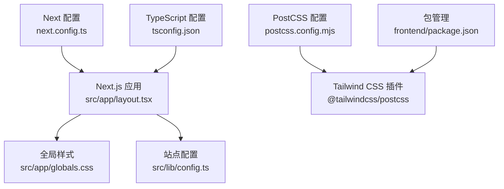
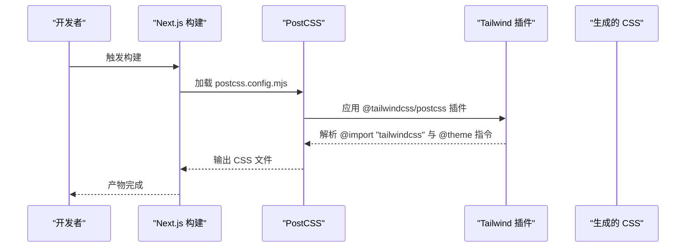
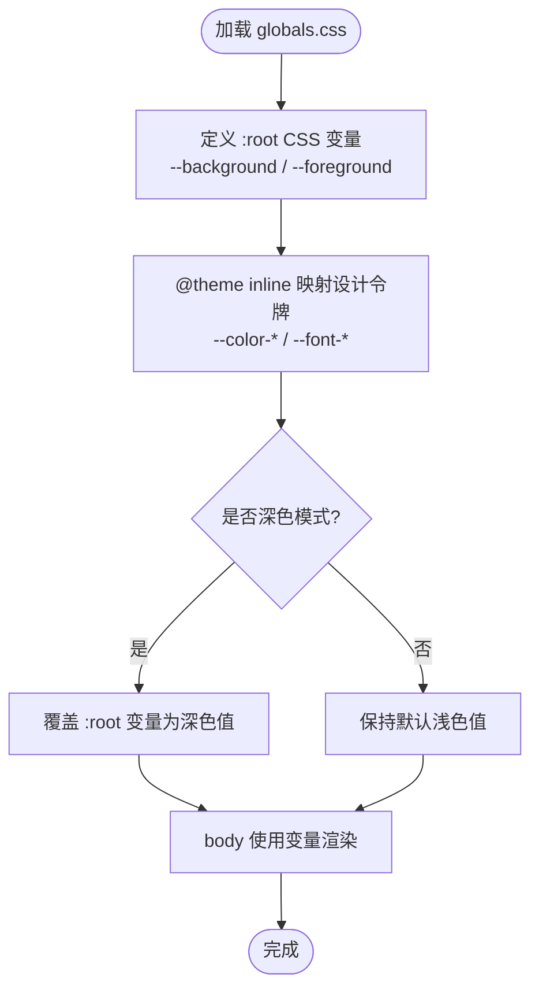
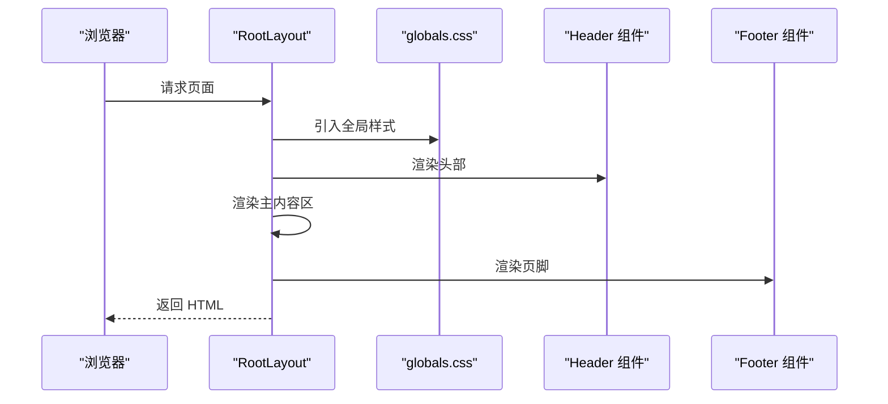
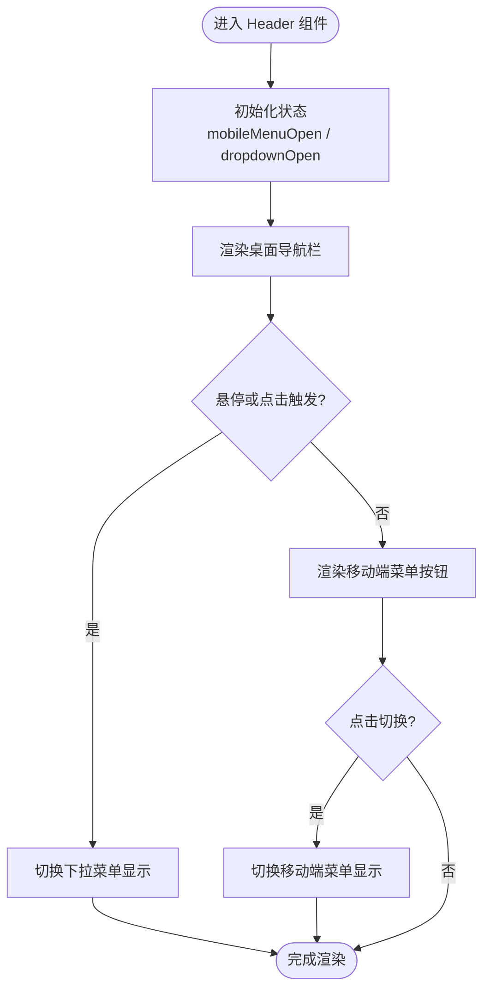
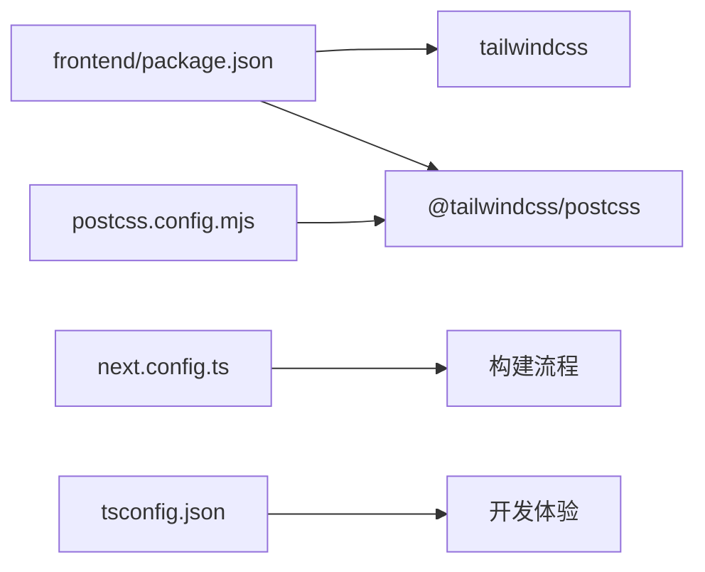

# 样式系统与主题

<cite>
**本文引用的文件**
- [package.json](file://frontend/package.json)
- [postcss.config.mjs](file://frontend/postcss.config.mjs)
- [globals.css](file://frontend/src/app/globals.css)
- [layout.tsx](file://frontend/src/app/layout.tsx)
- [Header.tsx](file://frontend/src/components/layout/Header.tsx)
- [config.ts](file://frontend/src/lib/config.ts)
- [next.config.ts](file://frontend/next.config.ts)
- [tsconfig.json](file://frontend/tsconfig.json)
</cite>

## 目录
1. [简介](#简介)
2. [项目结构](#项目结构)
3. [核心组件](#核心组件)
4. [架构总览](#架构总览)
5. [详细组件分析](#详细组件分析)
6. [依赖分析](#依赖分析)
7. [性能考虑](#性能考虑)
8. [故障排查指南](#故障排查指南)
9. [结论](#结论)
10. [附录](#附录)

## 简介
本文件系统性梳理 Battivus 前端应用的样式体系与主题机制，重点覆盖以下方面：
- Tailwind CSS v4 在本项目中的启用与配置路径（通过 PostCSS 插件）
- 全局样式与主题变量（CSS 变量）的组织方式
- 组件级样式与响应式设计的落地实践
- 主题切换与深色模式适配策略
- 样式构建流程、PostCSS 配置与打包优化建议
- 面向初学者的基础知识与面向进阶开发者的最佳实践

## 项目结构
前端工程采用 Next.js 应用程序目录结构，样式相关的核心位置如下：
- 全局样式入口：src/app/globals.css
- 应用根布局：src/app/layout.tsx
- 主题与站点配置：src/lib/config.ts
- 构建工具链：postcss.config.mjs、next.config.ts、tsconfig.json
- 包管理与依赖：frontend/package.json

图表来源
- [layout.tsx:1-100](file://frontend/src/app/layout.tsx#L1-L100)
- [globals.css:1-27](file://frontend/src/app/globals.css#L1-L27)
- [postcss.config.mjs:1-8](file://frontend/postcss.config.mjs#L1-L8)
- [package.json:1-26](file://frontend/package.json#L1-L26)
- [next.config.ts:1-9](file://frontend/next.config.ts#L1-L9)
- [tsconfig.json:1-35](file://frontend/tsconfig.json#L1-L35)

章节来源
- [layout.tsx:1-100](file://frontend/src/app/layout.tsx#L1-L100)
- [globals.css:1-27](file://frontend/src/app/globals.css#L1-L27)
- [postcss.config.mjs:1-8](file://frontend/postcss.config.mjs#L1-L8)
- [package.json:1-26](file://frontend/package.json#L1-L26)
- [next.config.ts:1-9](file://frontend/next.config.ts#L1-L9)
- [tsconfig.json:1-35](file://frontend/tsconfig.json#L1-L35)

## 核心组件
- 全局样式与主题变量
  - 使用 CSS 变量定义背景与前景色，并在深色模式下自动切换
  - 通过 @theme inline 将变量映射到 Tailwind 的设计令牌别名，便于在类名中统一使用
  - 在 body 上直接消费变量，确保页面基础色彩一致
- 应用根布局
  - 引入全局样式并设置字体类名与抗锯齿
  - 注入 JSON-LD 结构化数据脚本
- 组件样式
  - 头部导航使用 Tailwind 类进行布局、颜色与交互态控制
  - 移动端菜单与下拉菜单通过条件渲染与悬停事件控制显示状态
- 主题与站点配置
  - 站点信息、导航、关键词等集中管理，供布局与 SEO 使用

章节来源
- [globals.css:1-27](file://frontend/src/app/globals.css#L1-L27)
- [layout.tsx:1-100](file://frontend/src/app/layout.tsx#L1-L100)
- [Header.tsx:1-196](file://frontend/src/components/layout/Header.tsx#L1-L196)
- [config.ts:1-177](file://frontend/src/lib/config.ts#L1-L177)

## 架构总览
Tailwind v4 在本项目中通过 PostCSS 插件启用，构建时由 Next.js 调用 PostCSS 完成样式生成。全局样式负责主题变量与基础排版，组件层通过 Tailwind 类实现视觉与交互。

图表来源
- [postcss.config.mjs:1-8](file://frontend/postcss.config.mjs#L1-L8)
- [package.json:16-25](file://frontend/package.json#L16-L25)
- [globals.css:1-13](file://frontend/src/app/globals.css#L1-L13)

## 详细组件分析

### 全局样式与主题变量（globals.css）
- CSS 变量定义与深色模式
  - 在 :root 中定义 --background 与 --foreground
  - 使用 @media (prefers-color-scheme: dark) 在深色模式下覆盖变量值
- 设计令牌映射
  - 使用 @theme inline 将变量映射为 --color-background、--color-foreground、--font-sans、--font-mono
- 基础排版与颜色
  - 在 body 上使用变量作为背景与文字色，确保全站一致性
- 与 Tailwind 的集成
  - 通过 @import "tailwindcss" 启用 Tailwind 指令与工具类

图表来源
- [globals.css:1-27](file://frontend/src/app/globals.css#L1-L27)

章节来源
- [globals.css:1-27](file://frontend/src/app/globals.css#L1-L27)

### 应用根布局（layout.tsx）
- 全局样式引入
  - 在根布局中引入全局样式文件，确保主题变量与基础样式在整站生效
- 字体与 SEO
  - 设置 Inter 字体类名与抗锯齿
  - 注入组织与网站结构化数据脚本
- 页面骨架
  - 渲染 Header、主内容区与 Footer，并在底部放置 WhatsApp 悬浮按钮

图表来源
- [layout.tsx:1-100](file://frontend/src/app/layout.tsx#L1-L100)
- [globals.css:1-27](file://frontend/src/app/globals.css#L1-L27)

章节来源
- [layout.tsx:1-100](file://frontend/src/app/layout.tsx#L1-L100)

### 导航组件（Header.tsx）
- 交互与状态
  - 使用 useState 控制移动端菜单与两个下拉菜单的显示状态
- 样式与响应式
  - 使用 Tailwind 类实现容器、间距、颜色、阴影、过渡与悬停效果
  - 通过隐藏/显示断点实现桌面端与移动端的差异化布局
- 可访问性
  - 提供 aria-label 以提升可访问性

图表来源
- [Header.tsx:1-196](file://frontend/src/components/layout/Header.tsx#L1-L196)

章节来源
- [Header.tsx:1-196](file://frontend/src/components/layout/Header.tsx#L1-L196)

### 主题切换与深色模式
- 自动检测
  - 利用 prefers-color-scheme 媒体查询自动切换深色/浅色变量
- 手动切换（建议扩展）
  - 可在客户端通过设置 localStorage 或 Cookie 并更新 :root 变量实现手动切换
  - 建议配合系统偏好与用户偏好的合并策略，避免闪烁与不一致

章节来源
- [globals.css:15-20](file://frontend/src/app/globals.css#L15-L20)

### 响应式设计
- 断点与可见性
  - 使用 lg、md 等 Tailwind 断点控制元素在不同屏幕尺寸下的显示/隐藏
- 移动优先
  - 默认提供移动端体验，通过断点逐步增强桌面端布局
- 交互式响应
  - 下拉菜单与移动端菜单通过状态切换实现动态响应

章节来源
- [Header.tsx:58-191](file://frontend/src/components/layout/Header.tsx#L58-L191)

### CSS-in-JS 与样式隔离
- 当前方案
  - 本项目未使用 CSS-in-JS，而是采用全局 CSS + Tailwind 类的方式，具备良好的样式隔离与可维护性
- 若引入 CSS-in-JS
  - 建议结合主题上下文与动态注入，确保与全局变量与 @theme 令牌协同
  - 注意 SSR 与 hydration 期间的样式同步问题

章节来源
- [globals.css:1-27](file://frontend/src/app/globals.css#L1-L27)
- [layout.tsx:1-100](file://frontend/src/app/layout.tsx#L1-L100)

## 依赖分析
- 构建与样式
  - package.json 中声明 tailwindcss 与 @tailwindcss/postcss
  - postcss.config.mjs 仅启用 @tailwindcss/postcss 插件
- Next.js 集成
  - next.config.ts 保持默认配置，构建时由 PostCSS 处理样式
- TypeScript
  - tsconfig.json 配置了路径别名与严格模式，不影响样式系统但有助于类型安全

图表来源
- [package.json:16-25](file://frontend/package.json#L16-L25)
- [postcss.config.mjs:1-8](file://frontend/postcss.config.mjs#L1-L8)
- [next.config.ts:1-9](file://frontend/next.config.ts#L1-L9)
- [tsconfig.json:1-35](file://frontend/tsconfig.json#L1-L35)

章节来源
- [package.json:1-26](file://frontend/package.json#L1-L26)
- [postcss.config.mjs:1-8](file://frontend/postcss.config.mjs#L1-L8)
- [next.config.ts:1-9](file://frontend/next.config.ts#L1-L9)
- [tsconfig.json:1-35](file://frontend/tsconfig.json#L1-L35)

## 性能考虑
- 构建体积
  - 仅启用 Tailwind 插件，减少不必要的 PostCSS 插件链
  - 全局样式按需使用，避免过度引入未使用的类名
- 运行时性能
  - 使用 CSS 变量与 @theme inline 减少重复定义
  - 组件内交互使用状态切换而非频繁重排
- 开发体验
  - 严格 TypeScript 配置有助于早期发现样式相关错误
  - Next.js 的增量构建与缓存提升开发效率

## 故障排查指南
- 样式未生效
  - 确认 globals.css 已在根布局中被正确引入
  - 检查 @import "tailwindcss" 与 @theme inline 是否存在且无语法错误
- 主题切换异常
  - 检查 prefers-color-scheme 媒体查询是否被覆盖
  - 如需手动切换，确认 :root 变量更新逻辑与持久化存储
- 响应式布局错乱
  - 核对断点类名与容器宽度类（如 container、mx-auto）的组合
  - 确保移动端菜单与下拉菜单的状态切换逻辑正确

章节来源
- [layout.tsx:1-100](file://frontend/src/app/layout.tsx#L1-L100)
- [globals.css:1-27](file://frontend/src/app/globals.css#L1-L27)
- [Header.tsx:1-196](file://frontend/src/components/layout/Header.tsx#L1-L196)

## 结论
本项目采用简洁高效的样式架构：以 Tailwind v4 为核心，通过 PostCSS 插件与全局 CSS 变量实现主题与设计令牌的统一管理；组件层以 Tailwind 类为主，辅以少量状态驱动的交互式样式，兼顾可维护性与性能。建议在现有基础上扩展手动主题切换与更细粒度的主题变量拆分，以满足更复杂的品牌与多主题场景。

## 附录

### 基础知识：Tailwind 与 CSS 变量
- Tailwind v4 指令
  - @import "tailwindcss"：启用核心指令
  - @theme inline：将 CSS 变量映射为设计令牌，便于在类名中统一使用
- CSS 变量最佳实践
  - 将颜色、字体、间距等抽象为变量，集中管理
  - 通过媒体查询实现深色/浅色模式的自动切换

章节来源
- [globals.css:1-27](file://frontend/src/app/globals.css#L1-L27)

### 实战示例：编写样式组件、主题切换与媒体查询
- 编写样式组件
  - 在组件中使用 Tailwind 类组织布局与交互态
  - 示例参考：[Header.tsx:1-196](file://frontend/src/components/layout/Header.tsx#L1-L196)
- 主题切换
  - 参考深色模式自动切换思路，扩展手动切换逻辑
  - 示例参考：[globals.css:15-20](file://frontend/src/app/globals.css#L15-L20)
- 媒体查询
  - 使用 Tailwind 断点类与状态切换实现响应式行为
  - 示例参考：[Header.tsx:58-191](file://frontend/src/components/layout/Header.tsx#L58-L191)

章节来源
- [Header.tsx:1-196](file://frontend/src/components/layout/Header.tsx#L1-L196)
- [globals.css:15-20](file://frontend/src/app/globals.css#L15-L20)