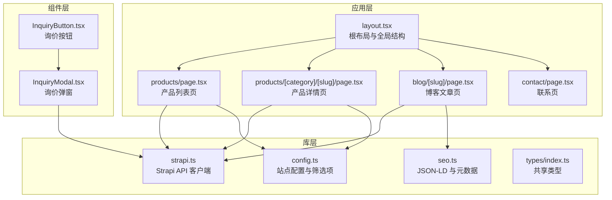
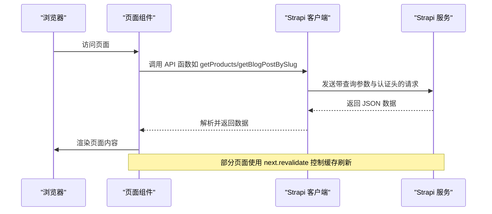
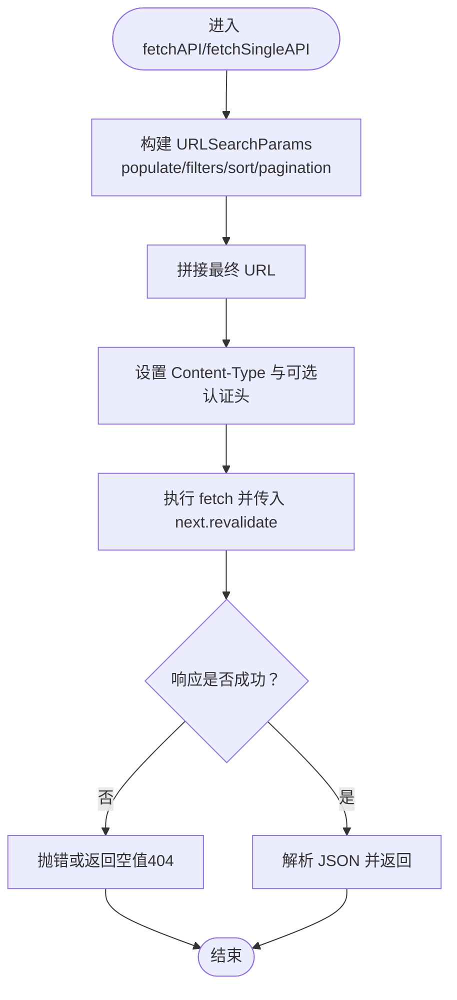
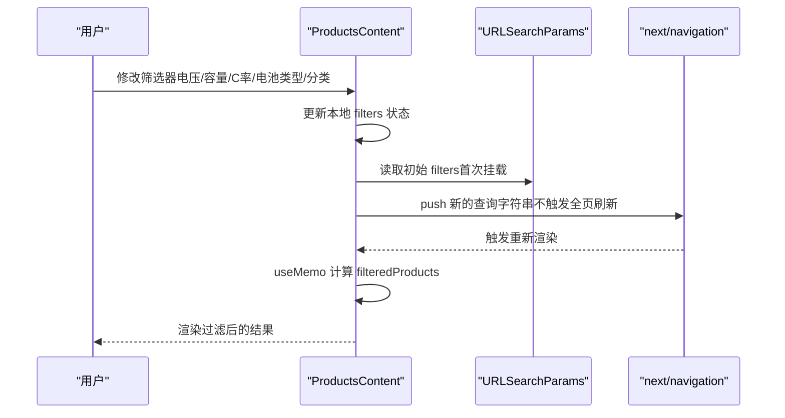
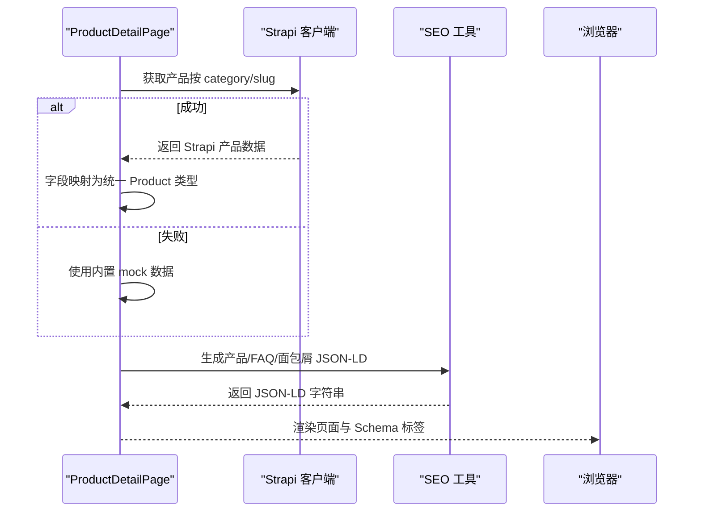
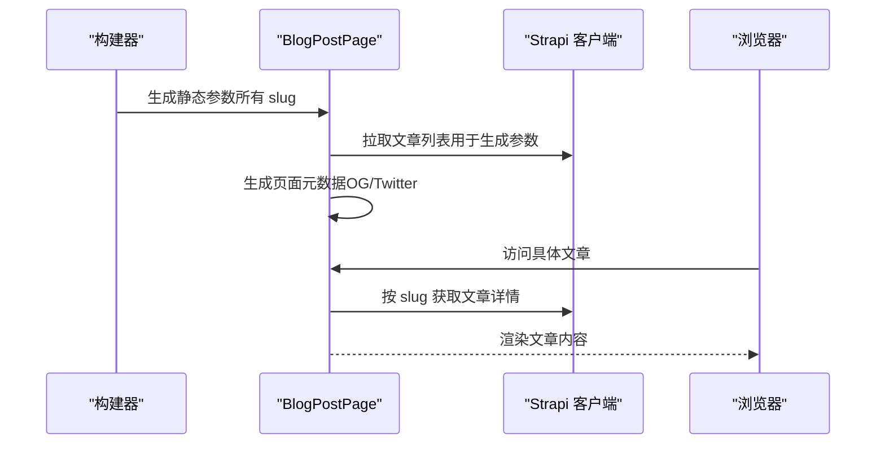
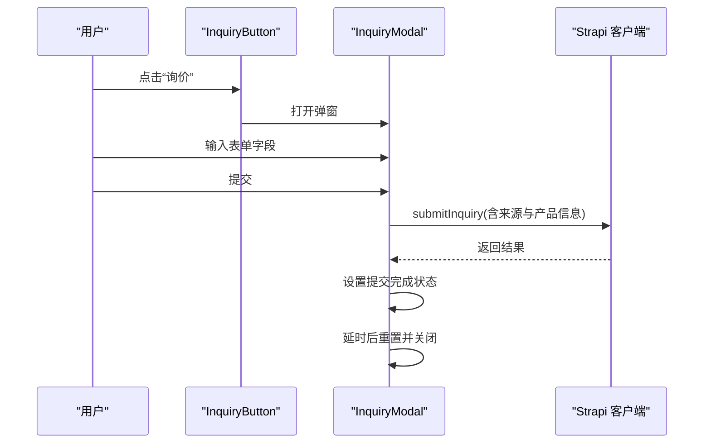
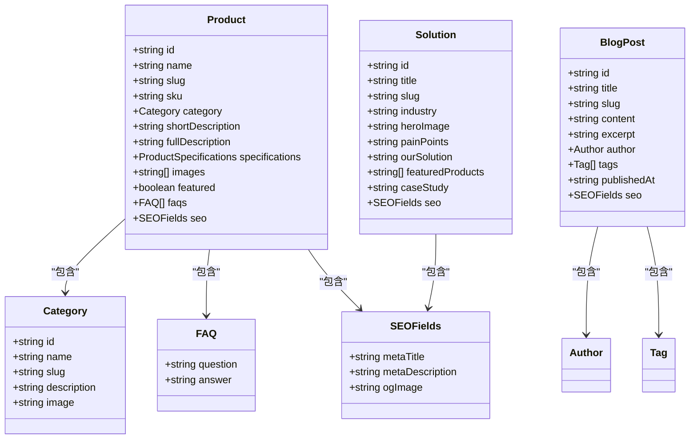
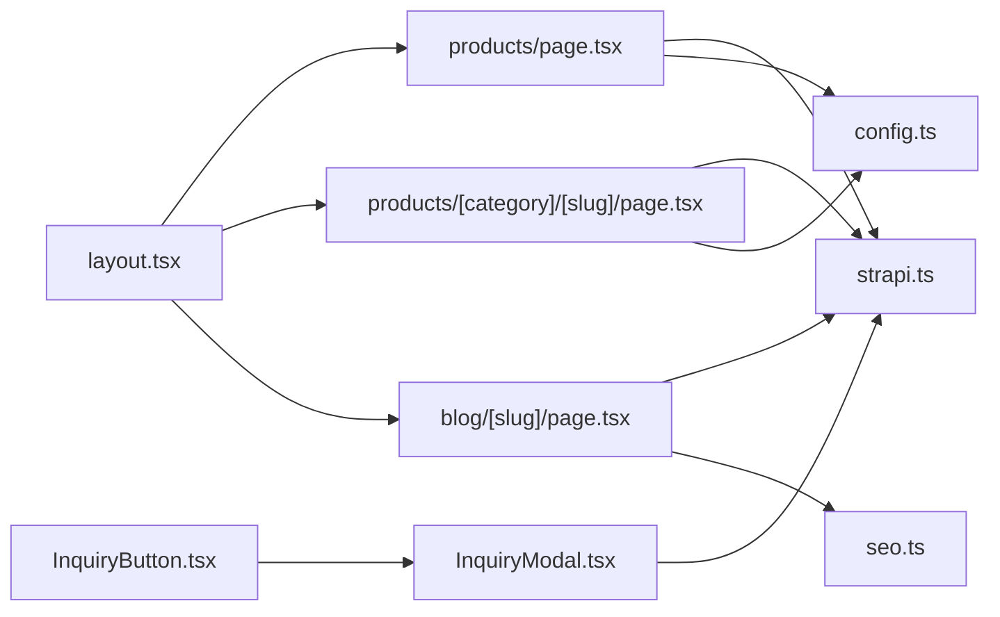

# 状态管理与数据流

<cite>
**本文引用的文件**
- [frontend/src/lib/strapi.ts](file://frontend/src/lib/strapi.ts)
- [frontend/src/types/index.ts](file://frontend/src/types/index.ts)
- [frontend/src/app/layout.tsx](file://frontend/src/app/layout.tsx)
- [frontend/src/app/products/page.tsx](file://frontend/src/app/products/page.tsx)
- [frontend/src/app/products/[category]/[slug]/page.tsx](file://frontend/src/app/products/[category]/[slug]/page.tsx)
- [frontend/src/app/blog/[slug]/page.tsx](file://frontend/src/app/blog/[slug]/page.tsx)
- [frontend/src/components/forms/InquiryModal.tsx](file://frontend/src/components/forms/InquiryModal.tsx)
- [frontend/src/components/forms/InquiryButton.tsx](file://frontend/src/components/forms/InquiryButton.tsx)
- [frontend/src/lib/config.ts](file://frontend/src/lib/config.ts)
- [frontend/src/lib/seo.ts](file://frontend/src/lib/seo.ts)
- [frontend/next.config.ts](file://frontend/next.config.ts)
</cite>

## 目录
1. [引言](#引言)
2. [项目结构](#项目结构)
3. [核心组件](#核心组件)
4. [架构总览](#架构总览)
5. [详细组件分析](#详细组件分析)
6. [依赖关系分析](#依赖关系分析)
7. [性能考量](#性能考量)
8. [故障排查指南](#故障排查指南)
9. [结论](#结论)
10. [附录](#附录)

## 引言
本文件系统性梳理 Battivus 前端应用的状态管理与数据流，重点覆盖以下方面：
- React 状态管理策略：客户端本地状态、URL 同步、静态生成与增量更新（revalidation）。
- 数据获取模式：服务端直连 Strapi API、类型安全的数据接口封装、SEO 友好的元数据生成。
- 状态同步机制：URL 参数驱动的筛选器同步、路由参数驱动的产品详情页。
- 缓存策略：基于 Next.js App Router 的 revalidate 与静态生成（SSG）。
- API 集成与错误处理：统一的 Strapi 客户端、错误捕获与降级策略。
- 实际示例路径：组件状态管理、异步数据处理、状态持久化（URL）、Context API 使用建议。

## 项目结构
前端采用 Next.js App Router 架构，核心目录与职责如下：
- app：页面与布局，支持动态路由、静态生成、元数据生成与 revalidate。
- components：可复用 UI 组件（表单、布局等）。
- lib：配置、Strapi API 客户端、SEO Schema 生成。
- types：共享 TypeScript 类型定义。

**图表来源**
- [frontend/src/app/layout.tsx:66-99](file://frontend/src/app/layout.tsx#L66-L99)
- [frontend/src/app/products/page.tsx:1-580](file://frontend/src/app/products/page.tsx#L1-L580)
- [frontend/src/app/products/[category]/[slug]/page.tsx](file://frontend/src/app/products/[category]/[slug]/page.tsx#L1-L566)
- [frontend/src/app/blog/[slug]/page.tsx](file://frontend/src/app/blog/[slug]/page.tsx#L1-L290)
- [frontend/src/components/forms/InquiryButton.tsx:1-55](file://frontend/src/components/forms/InquiryButton.tsx#L1-L55)
- [frontend/src/components/forms/InquiryModal.tsx:1-370](file://frontend/src/components/forms/InquiryModal.tsx#L1-L370)
- [frontend/src/lib/strapi.ts:1-412](file://frontend/src/lib/strapi.ts#L1-L412)
- [frontend/src/lib/config.ts:1-177](file://frontend/src/lib/config.ts#L1-L177)
- [frontend/src/lib/seo.ts:1-225](file://frontend/src/lib/seo.ts#L1-L225)
- [frontend/src/types/index.ts:1-157](file://frontend/src/types/index.ts#L1-L157)

**章节来源**
- [frontend/src/app/layout.tsx:1-100](file://frontend/src/app/layout.tsx#L1-L100)
- [frontend/src/lib/strapi.ts:1-412](file://frontend/src/lib/strapi.ts#L1-L412)
- [frontend/src/lib/config.ts:1-177](file://frontend/src/lib/config.ts#L1-L177)
- [frontend/src/lib/seo.ts:1-225](file://frontend/src/lib/seo.ts#L1-L225)
- [frontend/src/types/index.ts:1-157](file://frontend/src/types/index.ts#L1-L157)

## 核心组件
- Strapi API 客户端：统一封装 fetch 请求、查询参数构建、分页与排序、认证头、revalidate 控制与错误处理。
- 页面组件：产品列表页、产品详情页、博客文章页均通过 Strapi 客户端获取数据，并结合 Next.js 的 revalidate 与静态生成。
- 表单组件：询价按钮与弹窗负责收集用户输入并提交到 Strapi，包含加载态与成功反馈。
- 配置与类型：站点配置、筛选选项、产品/博客/Solution 类型定义，确保前后端一致。

**章节来源**
- [frontend/src/lib/strapi.ts:51-164](file://frontend/src/lib/strapi.ts#L51-L164)
- [frontend/src/app/products/page.tsx:278-580](file://frontend/src/app/products/page.tsx#L278-L580)
- [frontend/src/app/products/[category]/[slug]/page.tsx](file://frontend/src/app/products/[category]/[slug]/page.tsx#L19-L73)
- [frontend/src/app/blog/[slug]/page.tsx](file://frontend/src/app/blog/[slug]/page.tsx#L9-L30)
- [frontend/src/components/forms/InquiryModal.tsx:15-95](file://frontend/src/components/forms/InquiryModal.tsx#L15-L95)
- [frontend/src/lib/config.ts:149-177](file://frontend/src/lib/config.ts#L149-L177)
- [frontend/src/types/index.ts:23-157](file://frontend/src/types/index.ts#L23-L157)

## 架构总览
整体数据流从浏览器发起请求，经由页面组件调用 Strapi 客户端，再由客户端拼装查询参数、设置认证头并执行 fetch；服务端返回数据后，页面组件进行渲染或转换（如产品详情页的类型映射）。Next.js 在构建期或运行时对部分页面启用静态生成与 revalidate，以平衡性能与新鲜度。

**图表来源**
- [frontend/src/lib/strapi.ts:51-164](file://frontend/src/lib/strapi.ts#L51-L164)
- [frontend/src/app/products/page.tsx:314-360](file://frontend/src/app/products/page.tsx#L314-L360)
- [frontend/src/app/blog/[slug]/page.tsx](file://frontend/src/app/blog/[slug]/page.tsx#L9-L30)
- [frontend/src/app/products/[category]/[slug]/page.tsx](file://frontend/src/app/products/[category]/[slug]/page.tsx#L19-L73)

## 详细组件分析

### Strapi API 客户端（数据获取与缓存）
- 查询参数构建：支持 populate、filters（含嵌套关系）、sort、分页参数，自动序列化为查询字符串。
- 认证与头部：在存在令牌时添加 Bearer 头。
- 缓存控制：通过 fetch 的 next.revalidate 设置缓存刷新周期（例如 60 秒）。
- 错误处理：非 2xx 抛出错误；单对象读取在 404 时返回空值，便于降级。
- 类型安全：导出接口与泛型函数，保证返回数据结构与 Strapi schema 对齐。

**图表来源**
- [frontend/src/lib/strapi.ts:51-164](file://frontend/src/lib/strapi.ts#L51-L164)

**章节来源**
- [frontend/src/lib/strapi.ts:51-164](file://frontend/src/lib/strapi.ts#L51-L164)
- [frontend/src/lib/strapi.ts:170-316](file://frontend/src/lib/strapi.ts#L170-L316)

### 产品列表页（URL 同步与筛选）
- 本地状态：使用 useState 管理产品、分类、加载与错误状态。
- URL 同步：useSearchParams 读取初始筛选条件；useEffect 将 URL 变化同步到本地 filters。
- 过滤逻辑：useMemo 基于当前 filters 与产品数据计算过滤结果，避免重复计算。
- 导航更新：handleFilterChange 将筛选器写回 URL，保持可分享与可回溯。
- 降级策略：产品与分类分别拉取，分类失败时回退到配置中的默认分类集合。

**图表来源**
- [frontend/src/app/products/page.tsx:278-401](file://frontend/src/app/products/page.tsx#L278-L401)
- [frontend/src/app/products/page.tsx:362-376](file://frontend/src/app/products/page.tsx#L362-L376)

**章节来源**
- [frontend/src/app/products/page.tsx:278-401](file://frontend/src/app/products/page.tsx#L278-L401)
- [frontend/src/app/products/page.tsx:362-376](file://frontend/src/app/products/page.tsx#L362-L376)

### 产品详情页（类型转换与 Schema）
- 数据来源：优先通过 Strapi 客户端获取，失败时回退到内置 mock 数据。
- 类型转换：将 Strapi 返回的字段（snake_case、可选字段）映射为统一的 Product 类型。
- 元数据与 Schema：生成 JSON-LD（产品、面包屑、FAQ），用于 SEO 优化。
- 静态参数：generateStaticParams 基于 Strapi 或 mock 生成静态路由参数，提升首屏性能。

**图表来源**
- [frontend/src/app/products/[category]/[slug]/page.tsx](file://frontend/src/app/products/[category]/[slug]/page.tsx#L19-L73)
- [frontend/src/app/products/[category]/[slug]/page.tsx](file://frontend/src/app/products/[category]/[slug]/page.tsx#L142-L161)
- [frontend/src/lib/seo.ts:4-68](file://frontend/src/lib/seo.ts#L4-L68)

**章节来源**
- [frontend/src/app/products/[category]/[slug]/page.tsx](file://frontend/src/app/products/[category]/[slug]/page.tsx#L19-L73)
- [frontend/src/app/products/[category]/[slug]/page.tsx](file://frontend/src/app/products/[category]/[slug]/page.tsx#L142-L161)
- [frontend/src/lib/seo.ts:4-68](file://frontend/src/lib/seo.ts#L4-L68)

### 博客文章页（静态生成与元数据）
- 静态参数：generateStaticParams 从 Strapi 拉取文章列表，生成所有 slug 的静态路由。
- 元数据：generateMetadata 动态生成 Open Graph、Twitter 等标签，支持 SEO。
- 降级：当 Strapi 不可用时返回空参数，避免构建失败。

**图表来源**
- [frontend/src/app/blog/[slug]/page.tsx](file://frontend/src/app/blog/[slug]/page.tsx#L32-L46)
- [frontend/src/app/blog/[slug]/page.tsx](file://frontend/src/app/blog/[slug]/page.tsx#L48-L82)

**章节来源**
- [frontend/src/app/blog/[slug]/page.tsx](file://frontend/src/app/blog/[slug]/page.tsx#L32-L82)

### 询价表单（组件状态与提交）
- 组件状态：useState 管理表单字段、提交中与提交完成状态。
- 提交流程：收集表单数据，调用 submitInquiry 提交至 Strapi，成功后重置并关闭弹窗。
- 交互细节：打开时禁用滚动，关闭时恢复；根据 URL 与产品信息预填来源与产品信息。

**图表来源**
- [frontend/src/components/forms/InquiryButton.tsx:14-54](file://frontend/src/components/forms/InquiryButton.tsx#L14-L54)
- [frontend/src/components/forms/InquiryModal.tsx:15-95](file://frontend/src/components/forms/InquiryModal.tsx#L15-L95)
- [frontend/src/lib/strapi.ts:290-306](file://frontend/src/lib/strapi.ts#L290-L306)

**章节来源**
- [frontend/src/components/forms/InquiryButton.tsx:14-54](file://frontend/src/components/forms/InquiryButton.tsx#L14-L54)
- [frontend/src/components/forms/InquiryModal.tsx:15-95](file://frontend/src/components/forms/InquiryModal.tsx#L15-L95)
- [frontend/src/lib/strapi.ts:290-306](file://frontend/src/lib/strapi.ts#L290-L306)

### 类型系统与配置
- 类型定义：Product、Category、BlogPost、Solution、SEOFields、FAQ 等，确保页面与客户端一致。
- 配置：站点信息、公司信息、证书、产品分类、筛选选项（电压、C-rate、容量范围、电池类型）。
- SEO：统一的 JSON-LD 生成工具，支持产品、文章、组织、网站、面包屑与 FAQ。

**图表来源**
- [frontend/src/types/index.ts:23-157](file://frontend/src/types/index.ts#L23-L157)

**章节来源**
- [frontend/src/types/index.ts:1-157](file://frontend/src/types/index.ts#L1-L157)
- [frontend/src/lib/config.ts:72-177](file://frontend/src/lib/config.ts#L72-L177)
- [frontend/src/lib/seo.ts:4-166](file://frontend/src/lib/seo.ts#L4-L166)

## 依赖关系分析
- 页面组件依赖 Strapi 客户端进行数据获取，部分页面依赖 SEO 工具生成结构化数据。
- 产品列表页依赖配置中的筛选选项与默认分类，作为降级数据源。
- 询价表单组件独立于页面，仅依赖 Strapi 客户端与站点配置。
- Next.js 配置启用开发指示器关闭，减少开发环境噪音。

**图表来源**
- [frontend/src/app/products/page.tsx:1-580](file://frontend/src/app/products/page.tsx#L1-L580)
- [frontend/src/app/products/[category]/[slug]/page.tsx](file://frontend/src/app/products/[category]/[slug]/page.tsx#L1-L566)
- [frontend/src/app/blog/[slug]/page.tsx](file://frontend/src/app/blog/[slug]/page.tsx#L1-L290)
- [frontend/src/components/forms/InquiryButton.tsx:1-55](file://frontend/src/components/forms/InquiryButton.tsx#L1-L55)
- [frontend/src/components/forms/InquiryModal.tsx:1-370](file://frontend/src/components/forms/InquiryModal.tsx#L1-L370)
- [frontend/src/lib/strapi.ts:1-412](file://frontend/src/lib/strapi.ts#L1-L412)
- [frontend/src/lib/config.ts:1-177](file://frontend/src/lib/config.ts#L1-L177)
- [frontend/src/lib/seo.ts:1-225](file://frontend/src/lib/seo.ts#L1-L225)
- [frontend/src/app/layout.tsx:66-99](file://frontend/src/app/layout.tsx#L66-L99)

**章节来源**
- [frontend/src/app/products/page.tsx:1-580](file://frontend/src/app/products/page.tsx#L1-L580)
- [frontend/src/app/products/[category]/[slug]/page.tsx](file://frontend/src/app/products/[category]/[slug]/page.tsx#L1-L566)
- [frontend/src/app/blog/[slug]/page.tsx](file://frontend/src/app/blog/[slug]/page.tsx#L1-L290)
- [frontend/src/components/forms/InquiryButton.tsx:1-55](file://frontend/src/components/forms/InquiryButton.tsx#L1-L55)
- [frontend/src/components/forms/InquiryModal.tsx:1-370](file://frontend/src/components/forms/InquiryModal.tsx#L1-L370)
- [frontend/src/lib/strapi.ts:1-412](file://frontend/src/lib/strapi.ts#L1-L412)
- [frontend/src/lib/config.ts:1-177](file://frontend/src/lib/config.ts#L1-L177)
- [frontend/src/lib/seo.ts:1-225](file://frontend/src/lib/seo.ts#L1-L225)
- [frontend/src/app/layout.tsx:66-99](file://frontend/src/app/layout.tsx#L66-L99)

## 性能考量
- 缓存与增量更新：通过 fetch 的 next.revalidate 设置缓存刷新周期，平衡新鲜度与性能。
- 静态生成：博客文章页与产品详情页使用 generateStaticParams 生成静态路由，降低首屏延迟。
- 本地过滤与去抖：产品列表页使用 useMemo 缓存过滤结果，避免每次渲染重复计算。
- URL 同步：将筛选器写回 URL，减少不必要的状态提升与跨层级传递。
- 降级策略：分类与产品数据分别拉取，分类失败时回退到配置数据，提升鲁棒性。

**章节来源**
- [frontend/src/lib/strapi.ts:111-118](file://frontend/src/lib/strapi.ts#L111-L118)
- [frontend/src/app/blog/[slug]/page.tsx](file://frontend/src/app/blog/[slug]/page.tsx#L32-L46)
- [frontend/src/app/products/page.tsx:378-401](file://frontend/src/app/products/page.tsx#L378-L401)
- [frontend/src/app/products/page.tsx:362-376](file://frontend/src/app/products/page.tsx#L362-L376)

## 故障排查指南
- API 请求失败：检查 STRAPI_URL 与 STRAPI_TOKEN 环境变量，确认网络可达与认证头正确。
- 404 场景：单对象读取在 404 时返回空值，页面需具备降级逻辑（如产品详情页的 mock 回退）。
- 分类数据缺失：产品列表页会回退到配置中的默认分类，确认配置数据是否完整。
- 提交询价失败：检查 submitInquiry 的返回状态与错误日志，确认表单必填项与隐私同意已勾选。
- SEO Schema 问题：核对 JSON-LD 生成函数与页面渲染顺序，确保脚本标签正确注入。

**章节来源**
- [frontend/src/lib/strapi.ts:101-118](file://frontend/src/lib/strapi.ts#L101-L118)
- [frontend/src/lib/strapi.ts:153-163](file://frontend/src/lib/strapi.ts#L153-L163)
- [frontend/src/app/products/[category]/[slug]/page.tsx](file://frontend/src/app/products/[category]/[slug]/page.tsx#L174-L179)
- [frontend/src/components/forms/InquiryModal.tsx:85-95](file://frontend/src/components/forms/InquiryModal.tsx#L85-L95)
- [frontend/src/lib/seo.ts:164-166](file://frontend/src/lib/seo.ts#L164-L166)

## 结论
本项目采用“页面直连 API + Next.js 缓存”的混合策略：页面组件负责状态与 UI，Strapi 客户端负责数据获取与类型安全，SEO 工具负责结构化数据输出。通过 URL 同步筛选器、静态生成与 revalidate，实现了高性能与高可用的前端数据流。对于更复杂的业务场景，可在现有基础上引入 Context API 或轻量状态库进行状态提升与共享，但当前实现已满足核心需求。

## 附录
- 开发配置：关闭开发指示器，减少开发环境干扰。
- 环境变量：STRAPI_URL、STRAPI_API_TOKEN 用于区分开发与生产环境的 API 地址与认证。

**章节来源**
- [frontend/next.config.ts:1-9](file://frontend/next.config.ts#L1-L9)
- [frontend/src/lib/strapi.ts:8-9](file://frontend/src/lib/strapi.ts#L8-L9)