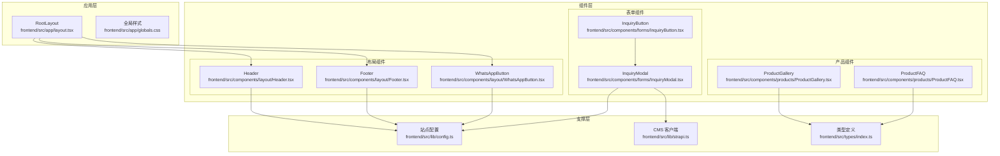
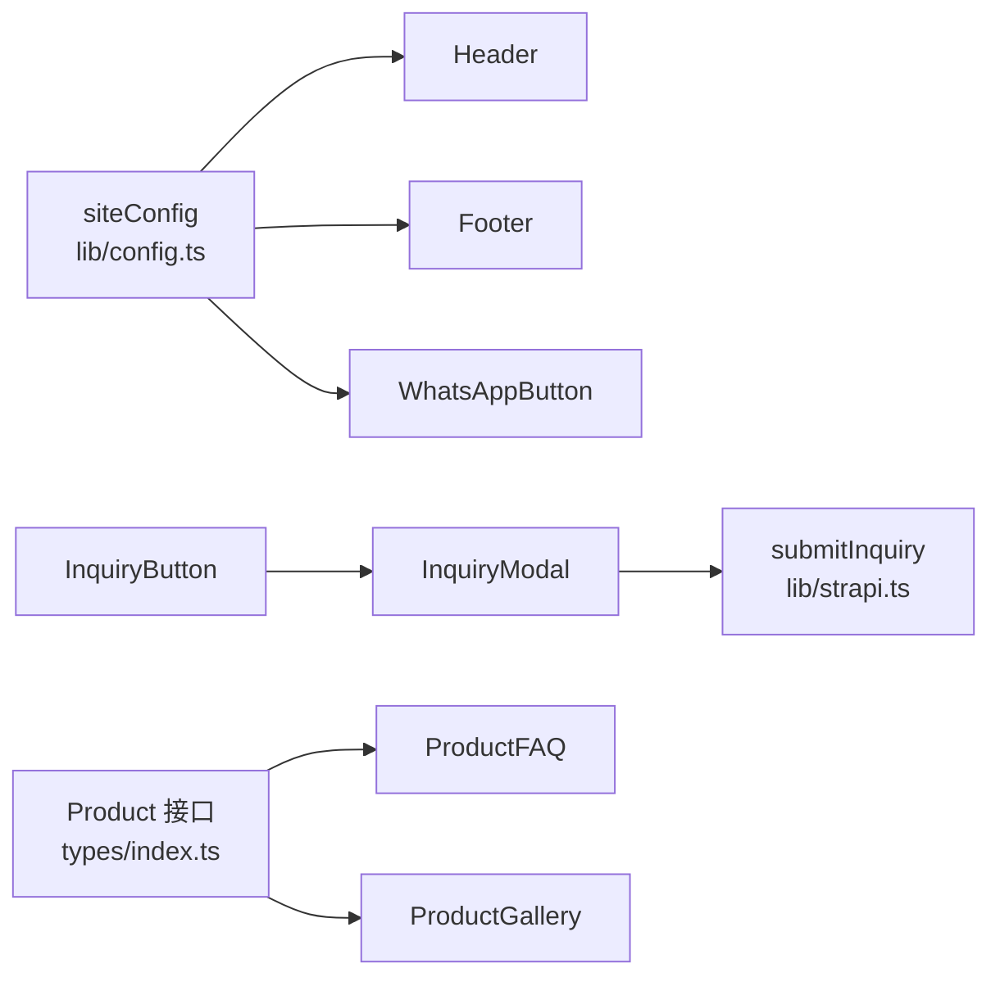
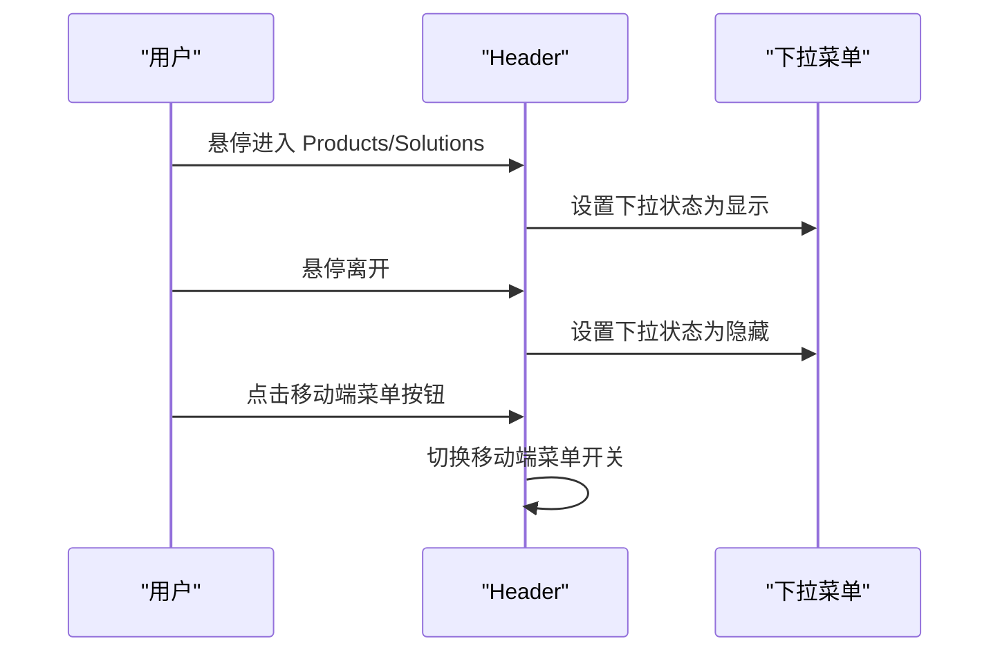
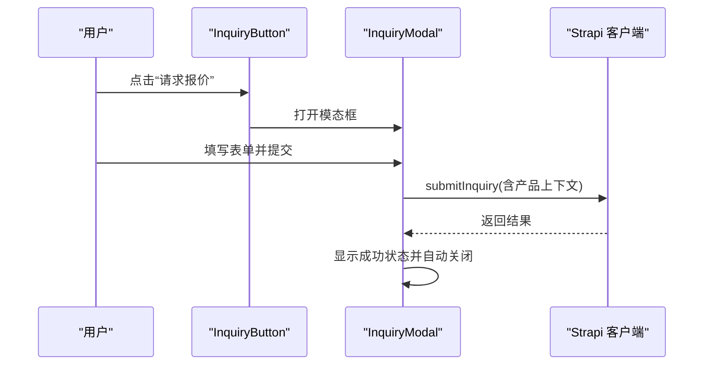
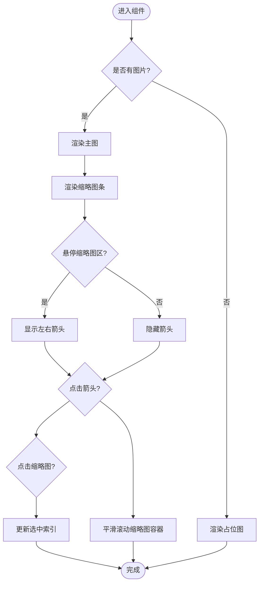
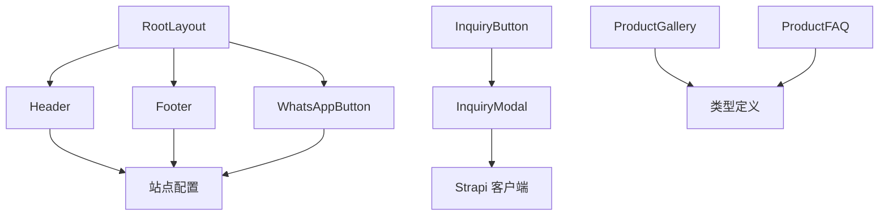

# 组件库架构

<cite>
**本文引用的文件**
- [frontend/src/app/layout.tsx](file://frontend/src/app/layout.tsx)
- [frontend/src/app/globals.css](file://frontend/src/app/globals.css)
- [frontend/src/components/layout/Header.tsx](file://frontend/src/components/layout/Header.tsx)
- [frontend/src/components/layout/Footer.tsx](file://frontend/src/components/layout/Footer.tsx)
- [frontend/src/components/layout/WhatsAppButton.tsx](file://frontend/src/components/layout/WhatsAppButton.tsx)
- [frontend/src/components/layout/index.ts](file://frontend/src/components/layout/index.ts)
- [frontend/src/components/forms/InquiryButton.tsx](file://frontend/src/components/forms/InquiryButton.tsx)
- [frontend/src/components/forms/InquiryModal.tsx](file://frontend/src/components/forms/InquiryModal.tsx)
- [frontend/src/components/forms/index.ts](file://frontend/src/components/forms/index.ts)
- [frontend/src/components/products/ProductGallery.tsx](file://frontend/src/components/products/ProductGallery.tsx)
- [frontend/src/components/products/ProductFAQ.tsx](file://frontend/src/components/products/ProductFAQ.tsx)
- [frontend/src/components/products/index.ts](file://frontend/src/components/products/index.ts)
- [frontend/src/lib/config.ts](file://frontend/src/lib/config.ts)
- [frontend/src/lib/strapi.ts](file://frontend/src/lib/strapi.ts)
- [frontend/src/types/index.ts](file://frontend/src/types/index.ts)
</cite>

## 目录
1. [引言](#引言)
2. [项目结构](#项目结构)
3. [核心组件](#核心组件)
4. [架构总览](#架构总览)
5. [详细组件分析](#详细组件分析)
6. [依赖关系分析](#依赖关系分析)
7. [性能考量](#性能考量)
8. [故障排查指南](#故障排查指南)
9. [结论](#结论)
10. [附录](#附录)

## 引言
本文件系统性梳理 Battivus 前端应用的组件库架构，聚焦以下目标：
- 解释组件设计原则（可复用、可组合、低耦合高内聚）
- 建立组件分类体系：布局组件、业务组件、通用组件
- 文档化组件 Props 接口、事件处理与状态管理
- 展示组件样式封装、主题定制与响应式设计
- 提供初学者入门路径与资深开发者优化建议

## 项目结构
前端采用按功能域分层的组织方式：
- 应用层：根布局与全局样式
- 组件层：layout、forms、products 等子目录
- 配置与类型：站点配置、CMS API 客户端、共享类型定义

图表来源
- [frontend/src/app/layout.tsx:66-99](file://frontend/src/app/layout.tsx#L66-L99)
- [frontend/src/components/layout/Header.tsx:8-196](file://frontend/src/components/layout/Header.tsx#L8-L196)
- [frontend/src/components/layout/Footer.tsx:4-149](file://frontend/src/components/layout/Footer.tsx#L4-L149)
- [frontend/src/components/layout/WhatsAppButton.tsx:6-45](file://frontend/src/components/layout/WhatsAppButton.tsx#L6-L45)
- [frontend/src/components/forms/InquiryButton.tsx:14-55](file://frontend/src/components/forms/InquiryButton.tsx#L14-L55)
- [frontend/src/components/forms/InquiryModal.tsx:15-370](file://frontend/src/components/forms/InquiryModal.tsx#L15-L370)
- [frontend/src/components/products/ProductGallery.tsx:10-104](file://frontend/src/components/products/ProductGallery.tsx#L10-L104)
- [frontend/src/components/products/ProductFAQ.tsx:10-57](file://frontend/src/components/products/ProductFAQ.tsx#L10-L57)
- [frontend/src/lib/config.ts:3-70](file://frontend/src/lib/config.ts#L3-L70)
- [frontend/src/lib/strapi.ts:291-306](file://frontend/src/lib/strapi.ts#L291-L306)
- [frontend/src/types/index.ts:12-43](file://frontend/src/types/index.ts#L12-L43)

章节来源
- [frontend/src/app/layout.tsx:66-99](file://frontend/src/app/layout.tsx#L66-L99)
- [frontend/src/app/globals.css:1-27](file://frontend/src/app/globals.css#L1-L27)

## 核心组件
- 布局组件：Header、Footer、WhatsAppButton，负责站点导航、品牌信息与联系入口
- 表单组件：InquiryButton、InquiryModal，负责询盘触发与提交流程
- 产品组件：ProductGallery、ProductFAQ，负责产品图片轮播与常见问题展开收起

章节来源
- [frontend/src/components/layout/Header.tsx:8-196](file://frontend/src/components/layout/Header.tsx#L8-L196)
- [frontend/src/components/layout/Footer.tsx:4-149](file://frontend/src/components/layout/Footer.tsx#L4-L149)
- [frontend/src/components/layout/WhatsAppButton.tsx:6-45](file://frontend/src/components/layout/WhatsAppButton.tsx#L6-L45)
- [frontend/src/components/forms/InquiryButton.tsx:14-55](file://frontend/src/components/forms/InquiryButton.tsx#L14-L55)
- [frontend/src/components/forms/InquiryModal.tsx:15-370](file://frontend/src/components/forms/InquiryModal.tsx#L15-L370)
- [frontend/src/components/products/ProductGallery.tsx:10-104](file://frontend/src/components/products/ProductGallery.tsx#L10-L104)
- [frontend/src/components/products/ProductFAQ.tsx:10-57](file://frontend/src/components/products/ProductFAQ.tsx#L10-L57)

## 架构总览
组件库遵循“配置驱动 + 类型安全 + 组合优先”的设计原则：
- 配置驱动：站点信息、导航、联系方式等集中于配置模块，组件通过导入使用
- 类型安全：所有数据模型在类型文件中定义，组件 Props 严格约束
- 组合优先：复杂交互通过小而专一的子组件组合而成，如 InquiryButton + InquiryModal

图表来源
- [frontend/src/lib/config.ts:3-70](file://frontend/src/lib/config.ts#L3-L70)
- [frontend/src/components/layout/Header.tsx:8-196](file://frontend/src/components/layout/Header.tsx#L8-L196)
- [frontend/src/components/layout/Footer.tsx:4-149](file://frontend/src/components/layout/Footer.tsx#L4-L149)
- [frontend/src/components/layout/WhatsAppButton.tsx:6-45](file://frontend/src/components/layout/WhatsAppButton.tsx#L6-L45)
- [frontend/src/components/forms/InquiryButton.tsx:14-55](file://frontend/src/components/forms/InquiryButton.tsx#L14-L55)
- [frontend/src/components/forms/InquiryModal.tsx:15-370](file://frontend/src/components/forms/InquiryModal.tsx#L15-L370)
- [frontend/src/lib/strapi.ts:291-306](file://frontend/src/lib/strapi.ts#L291-L306)
- [frontend/src/types/index.ts:12-43](file://frontend/src/types/index.ts#L12-L43)

## 详细组件分析

### 布局组件
- Header：包含顶部邮箱/WhatsApp 信息条、Logo、主导航、移动端菜单与下拉菜单；使用受控状态控制菜单开关与下拉显示
- Footer：网格布局展示公司信息、产品与解决方案导航、联系方式与快速报价按钮
- WhatsAppButton：悬浮聊天按钮，悬停显示提示气泡，点击跳转到 WhatsApp

图表来源
- [frontend/src/components/layout/Header.tsx:64-121](file://frontend/src/components/layout/Header.tsx#L64-L121)
- [frontend/src/components/layout/Header.tsx:167-191](file://frontend/src/components/layout/Header.tsx#L167-L191)

章节来源
- [frontend/src/components/layout/Header.tsx:8-196](file://frontend/src/components/layout/Header.tsx#L8-L196)
- [frontend/src/components/layout/Footer.tsx:4-149](file://frontend/src/components/layout/Footer.tsx#L4-L149)
- [frontend/src/components/layout/WhatsAppButton.tsx:6-45](file://frontend/src/components/layout/WhatsAppButton.tsx#L6-L45)

### 表单组件
- InquiryButton：接收产品上下文参数（名称、SKU、URL），内部维护模态框开关状态，渲染触发按钮
- InquiryModal：负责表单字段收集、提交状态与成功反馈；提交时调用 CMS 客户端接口，支持隐私条款勾选与滚动锁定

图表来源
- [frontend/src/components/forms/InquiryButton.tsx:14-55](file://frontend/src/components/forms/InquiryButton.tsx#L14-L55)
- [frontend/src/components/forms/InquiryModal.tsx:15-370](file://frontend/src/components/forms/InquiryModal.tsx#L15-L370)
- [frontend/src/lib/strapi.ts:291-306](file://frontend/src/lib/strapi.ts#L291-L306)

章节来源
- [frontend/src/components/forms/InquiryButton.tsx:14-55](file://frontend/src/components/forms/InquiryButton.tsx#L14-L55)
- [frontend/src/components/forms/InquiryModal.tsx:15-370](file://frontend/src/components/forms/InquiryModal.tsx#L15-L370)
- [frontend/src/lib/strapi.ts:291-306](file://frontend/src/lib/strapi.ts#L291-L306)

### 产品组件
- ProductGallery：根据传入图片数组渲染主图与缩略图条，支持左右滚动与选中态切换；无图片时显示占位
- ProductFAQ：根据 FAQ 数组渲染可折叠面板，点击切换展开/收起

图表来源
- [frontend/src/components/products/ProductGallery.tsx:10-104](file://frontend/src/components/products/ProductGallery.tsx#L10-L104)

章节来源
- [frontend/src/components/products/ProductGallery.tsx:10-104](file://frontend/src/components/products/ProductGallery.tsx#L10-L104)
- [frontend/src/components/products/ProductFAQ.tsx:10-57](file://frontend/src/components/products/ProductFAQ.tsx#L10-L57)

### 组件分类与复用策略
- 布局组件：以 Header/Footer/WhatsAppButton 为代表，职责单一、高度复用；通过配置模块注入内容，避免硬编码
- 业务组件：以 InquiryButton/InquiryModal 为代表，围绕业务闭环构建，通过组合实现复杂交互
- 通用组件：以 ProductGallery/ProductFAQ 为代表，抽象数据结构（FAQ、Product），便于跨页面复用

章节来源
- [frontend/src/components/layout/index.ts:1-4](file://frontend/src/components/layout/index.ts#L1-L4)
- [frontend/src/components/forms/index.ts:1-3](file://frontend/src/components/forms/index.ts#L1-L3)
- [frontend/src/components/products/index.ts:1-2](file://frontend/src/components/products/index.ts#L1-L2)

## 依赖关系分析
- 组件间依赖：InquiryButton 依赖 InquiryModal；RootLayout 统一引入 Header/Footer/WhatsAppButton
- 外部依赖：组件通过配置模块与 CMS 客户端进行数据交互
- 类型依赖：组件 Props 与返回数据严格对齐类型定义

图表来源
- [frontend/src/app/layout.tsx:66-99](file://frontend/src/app/layout.tsx#L66-L99)
- [frontend/src/components/forms/InquiryButton.tsx:14-55](file://frontend/src/components/forms/InquiryButton.tsx#L14-L55)
- [frontend/src/components/forms/InquiryModal.tsx:15-370](file://frontend/src/components/forms/InquiryModal.tsx#L15-L370)
- [frontend/src/components/products/ProductGallery.tsx:10-104](file://frontend/src/components/products/ProductGallery.tsx#L10-L104)
- [frontend/src/components/products/ProductFAQ.tsx:10-57](file://frontend/src/components/products/ProductFAQ.tsx#L10-L57)
- [frontend/src/lib/config.ts:3-70](file://frontend/src/lib/config.ts#L3-L70)
- [frontend/src/lib/strapi.ts:291-306](file://frontend/src/lib/strapi.ts#L291-L306)
- [frontend/src/types/index.ts:12-43](file://frontend/src/types/index.ts#L12-L43)

章节来源
- [frontend/src/app/layout.tsx:66-99](file://frontend/src/app/layout.tsx#L66-L99)
- [frontend/src/lib/config.ts:3-70](file://frontend/src/lib/config.ts#L3-L70)
- [frontend/src/lib/strapi.ts:291-306](file://frontend/src/lib/strapi.ts#L291-L306)
- [frontend/src/types/index.ts:12-43](file://frontend/src/types/index.ts#L12-L43)

## 性能考量
- 渲染优化
  - 使用受控组件与局部状态，避免不必要的重渲染
  - 下拉菜单与移动端菜单仅在交互时切换，减少常驻 DOM
- 数据访问
  - CMS 客户端统一处理查询参数与分页，避免重复逻辑
- 交互体验
  - 模态框打开时锁定背景滚动，提升可用性
  - 图片懒加载与占位符，改善首屏表现
- 可访问性
  - 为图标与按钮提供语义化标签（aria-label）

## 故障排查指南
- 模态框无法关闭或背景滚动异常
  - 检查模态框开关状态与副作用清理逻辑
  - 确认关闭回调正确执行并恢复 body 的 overflow 状态
- 表单提交失败
  - 查看网络面板与错误日志，确认 API 地址与令牌配置
  - 核对提交数据结构与必填字段
- 导航与下拉菜单不显示
  - 确认配置模块中的导航项存在且格式正确
  - 检查鼠标事件绑定与状态切换逻辑

章节来源
- [frontend/src/components/forms/InquiryModal.tsx:34-44](file://frontend/src/components/forms/InquiryModal.tsx#L34-L44)
- [frontend/src/components/forms/InquiryModal.tsx:85-95](file://frontend/src/components/forms/InquiryModal.tsx#L85-L95)
- [frontend/src/lib/strapi.ts:8-10](file://frontend/src/lib/strapi.ts#L8-L10)
- [frontend/src/components/layout/Header.tsx:64-121](file://frontend/src/components/layout/Header.tsx#L64-L121)

## 结论
该组件库以“配置驱动 + 类型安全 + 组合优先”为核心理念，通过清晰的组件分类与稳定的依赖关系，实现了高复用、易维护的前端架构。建议在后续迭代中持续完善类型覆盖、增强可访问性与性能监控，进一步提升开发效率与用户体验。

## 附录

### 组件 Props 与事件接口速览
- Header
  - 无显式外部 Props（通过配置注入）
- Footer
  - 无显式外部 Props（通过配置注入）
- WhatsAppButton
  - 无显式外部 Props（通过配置注入）
- InquiryButton
  - 输入：productName?: string, productSku?: string, productUrl?: string, className?: string, buttonText?: string
  - 输出：点击事件触发打开模态框
- InquiryModal
  - 输入：isOpen: boolean, onClose: () => void, productName?: string, productSku?: string, productUrl?: string
  - 输出：提交成功/失败状态，关闭回调
- ProductGallery
  - 输入：images: string[], productName: string
  - 输出：点击缩略图更新主图索引，点击箭头滚动缩略图容器
- ProductFAQ
  - 输入：faqs: FAQ[]
  - 输出：点击切换展开/收起对应项

章节来源
- [frontend/src/components/forms/InquiryButton.tsx:6-20](file://frontend/src/components/forms/InquiryButton.tsx#L6-L20)
- [frontend/src/components/forms/InquiryModal.tsx:7-21](file://frontend/src/components/forms/InquiryModal.tsx#L7-L21)
- [frontend/src/components/products/ProductGallery.tsx:5-8](file://frontend/src/components/products/ProductGallery.tsx#L5-L8)
- [frontend/src/components/products/ProductFAQ.tsx:6-8](file://frontend/src/components/products/ProductFAQ.tsx#L6-L8)
- [frontend/src/types/index.ts:12-15](file://frontend/src/types/index.ts#L12-L15)

### 样式封装、主题定制与响应式设计
- 样式封装
  - 使用 Tailwind 类名进行原子化样式声明，组件内部类名隔离
- 主题定制
  - 全局 CSS 变量控制背景与前景色，支持深色模式媒体查询
- 响应式设计
  - 移动端菜单、网格布局与弹性容器配合断点实现自适应

章节来源
- [frontend/src/app/globals.css:1-27](file://frontend/src/app/globals.css#L1-L27)
- [frontend/src/components/layout/Header.tsx:13-196](file://frontend/src/components/layout/Header.tsx#L13-L196)
- [frontend/src/components/layout/Footer.tsx:10-149](file://frontend/src/components/layout/Footer.tsx#L10-L149)