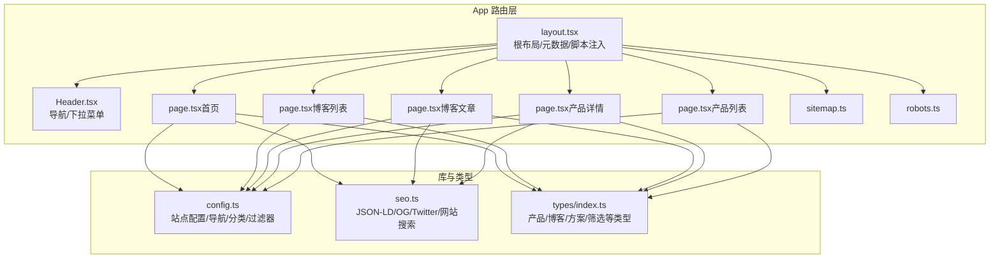
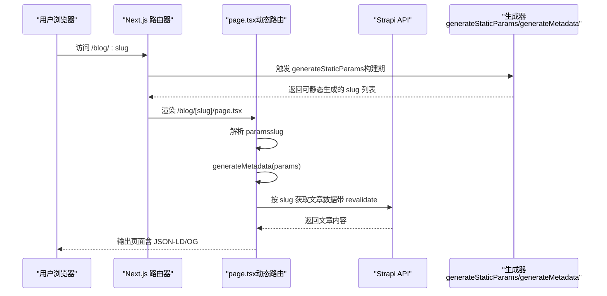
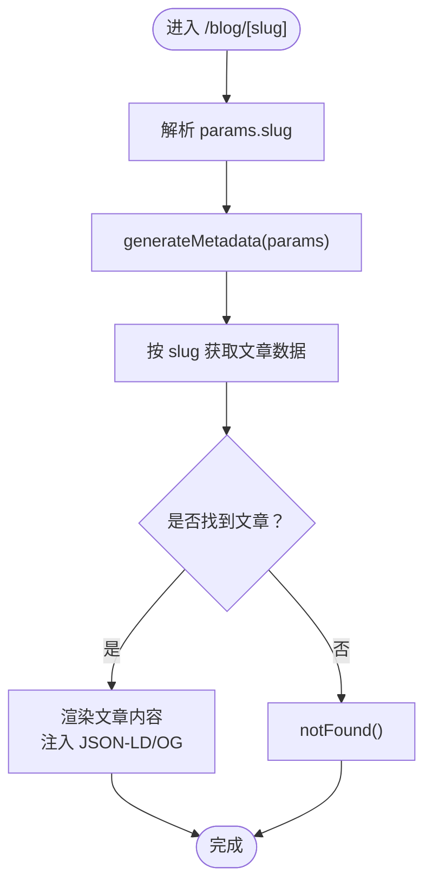
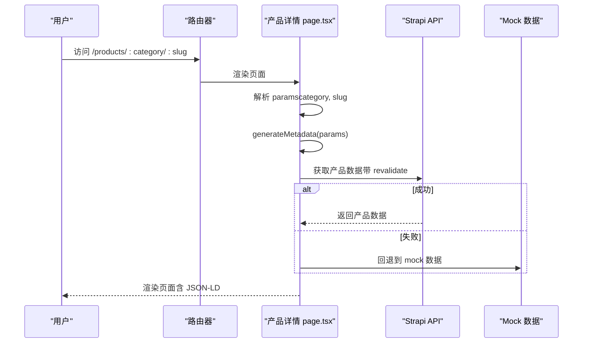
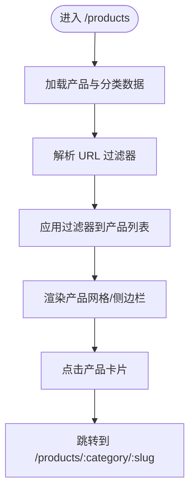
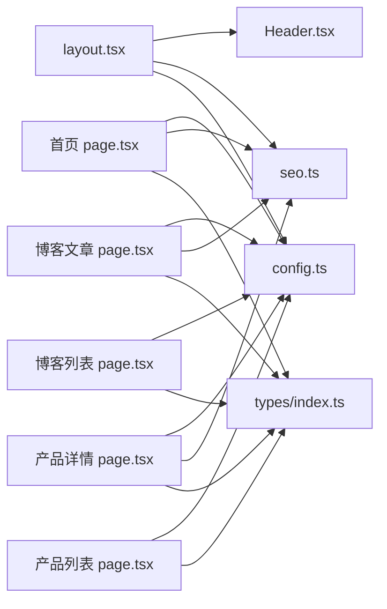

# 页面与路由系统

<cite>
**本文引用的文件**
- [layout.tsx](file://frontend/src/app/layout.tsx)
- [page.tsx（首页）](file://frontend/src/app/page.tsx)
- [page.tsx（博客文章）](file://frontend/src/app/blog/[slug]/page.tsx)
- [page.tsx（产品详情）](file://frontend/src/app/products/[category]/[slug]/page.tsx)
- [next.config.ts](file://frontend/next.config.ts)
- [config.ts](file://frontend/src/lib/config.ts)
- [seo.ts](file://frontend/src/lib/seo.ts)
- [sitemap.ts](file://frontend/src/app/sitemap.ts)
- [robots.ts](file://frontend/src/app/robots.ts)
- [package.json](file://frontend/package.json)
- [Header.tsx](file://frontend/src/components/layout/Header.tsx)
- [page.tsx（产品列表）](file://frontend/src/app/products/page.tsx)
- [page.tsx（博客列表）](file://frontend/src/app/blog/page.tsx)
- [types/index.ts](file://frontend/src/types/index.ts)
</cite>

## 目录
1. [简介](#简介)
2. [项目结构](#项目结构)
3. [核心组件](#核心组件)
4. [架构总览](#架构总览)
5. [详细组件分析](#详细组件分析)
6. [依赖关系分析](#依赖关系分析)
7. [性能考量](#性能考量)
8. [故障排查指南](#故障排查指南)
9. [结论](#结论)
10. [附录](#附录)

## 简介
本文件系统性梳理 Battivus 前端应用的页面与路由体系，基于 Next.js App Router 的现代路由模型，覆盖静态页面、动态路由与参数化页面的实现方式；阐述页面生命周期、数据获取策略与预渲染配置；给出 SEO 友好 URL 结构、页面缓存策略与性能优化建议。文档既面向初学者提供基础概念，也为有经验的开发者提供高级特性与最佳实践参考。

## 项目结构
前端采用 Next.js App Router 的目录约定式路由：
- 根布局与全局样式：src/app/layout.tsx 提供根 HTML 结构、元数据与全局样式注入。
- 静态页面：src/app/page.tsx、/about、/privacy、/terms、/technology、/solutions、/contact、/customization 等。
- 动态路由页面：
  - 博客文章：src/app/blog/[slug]/page.tsx
  - 产品详情：src/app/products/[category]/[slug]/page.tsx
- SEO 与站点地图：src/app/robots.ts、src/app/sitemap.ts
- 配置与工具：src/lib/config.ts、src/lib/seo.ts
- 组件：src/components/layout/Header.tsx 等

图表来源
- [layout.tsx:66-99](file://frontend/src/app/layout.tsx#L66-L99)
- [Header.tsx:8-195](file://frontend/src/components/layout/Header.tsx#L8-L195)
- [page.tsx（首页）:1-395](file://frontend/src/app/page.tsx#L1-L395)
- [page.tsx（博客列表）:1-203](file://frontend/src/app/blog/page.tsx#L1-L203)
- [page.tsx（博客文章）:1-290](file://frontend/src/app/blog/[slug]/page.tsx#L1-L290)
- [page.tsx（产品详情）:1-566](file://frontend/src/app/products/[category]/[slug]/page.tsx#L1-L566)
- [page.tsx（产品列表）:1-580](file://frontend/src/app/products/page.tsx#L1-L580)
- [config.ts:1-177](file://frontend/src/lib/config.ts#L1-L177)
- [seo.ts:1-225](file://frontend/src/lib/seo.ts#L1-L225)
- [types/index.ts:1-157](file://frontend/src/types/index.ts#L1-L157)

章节来源
- [layout.tsx:1-100](file://frontend/src/app/layout.tsx#L1-L100)
- [Header.tsx:1-196](file://frontend/src/components/layout/Header.tsx#L1-L196)
- [config.ts:1-177](file://frontend/src/lib/config.ts#L1-L177)

## 核心组件
- 根布局与元数据：在根布局中集中定义站点标题模板、描述、Open Graph、Twitter 卡片、robots 策略与 JSON-LD 结构化数据脚本注入，确保所有页面共享一致的 SEO 基线。
- 页面组件：每个路由层级的 page.tsx 承担页面级数据获取、参数解析、元数据生成与内容渲染职责。
- SEO 工具：通过 generateMetadata/generateProductSchema/generateArticleSchema 等函数统一生成结构化数据与 Open Graph/Twitter 元信息。
- 导航组件：Header.tsx 提供桌面/移动端导航、下拉菜单与移动端菜单切换逻辑，配合站点配置中的导航项。

章节来源
- [layout.tsx:13-64](file://frontend/src/app/layout.tsx#L13-L64)
- [seo.ts:4-225](file://frontend/src/lib/seo.ts#L4-L225)
- [Header.tsx:8-195](file://frontend/src/components/layout/Header.tsx#L8-L195)

## 架构总览
Next.js App Router 将页面组织为“路由段”，动态段以方括号表示，支持多层级嵌套。系统通过以下机制实现：
- 路由段到组件映射：如 /blog/[slug] 对应 src/app/blog/[slug]/page.tsx。
- 参数提取：通过 params Promise 解析动态参数（如 slug、category、slug）。
- 预渲染与增量更新：使用 fetch 的 next.revalidate 控制缓存刷新；generateStaticParams 用于静态生成。
- 元数据生成：generateMetadata 在构建期或请求期生成页面级 SEO 元信息。
- 结构化数据：通过 renderJsonLd 注入 JSON-LD，提升 SEO 与社交分享质量。

图表来源
- [page.tsx（博客文章）:34-82](file://frontend/src/app/blog/[slug]/page.tsx#L34-L82)
- [seo.ts:115-142](file://frontend/src/lib/seo.ts#L115-L142)

章节来源
- [page.tsx（博客文章）:1-290](file://frontend/src/app/blog/[slug]/page.tsx#L1-L290)
- [page.tsx（产品详情）:1-566](file://frontend/src/app/products/[category]/[slug]/page.tsx#L1-L566)

## 详细组件分析

### 静态页面与根布局
- 根布局负责：
  - 定义全局 Metadata（标题模板、描述、Open Graph、Twitter、robots）。
  - 注入 JSON-LD（组织结构、网站结构化数据）。
  - 包裹子树 children，承载 Header/Footer/WhatsAppButton 等全局组件。
- 首页 page.tsx 展示了：
  - 异步获取分类数据，失败时回退到配置数据。
  - 使用 Link 进行页面内导航，构建产品分类入口与导航链接。
  - 内联 BlogList 子组件进行最新文章展示。

章节来源
- [layout.tsx:13-99](file://frontend/src/app/layout.tsx#L13-L99)
- [page.tsx（首页）:1-395](file://frontend/src/app/page.tsx#L1-L395)

### 动态路由：博客文章页面
- 路由段：/blog/[slug]
- 关键点：
  - generateStaticParams：从 Strapi 获取文章列表，生成静态参数，提升构建期预渲染能力。
  - generateMetadata：根据文章 slug 动态生成标题、描述、OG 图像与 canonical。
  - 数据获取：优先使用封装的 getBlogPostBySlug，失败时回退到直接 API 请求并设置 next.revalidate。
  - 错误处理：未找到文章时调用 notFound()，返回 404。
  - 结构化数据：注入 Article Schema 与 Website Schema，增强 SEO 与社交分享体验。

图表来源
- [page.tsx（博客文章）:34-82](file://frontend/src/app/blog/[slug]/page.tsx#L34-L82)
- [seo.ts:115-142](file://frontend/src/lib/seo.ts#L115-L142)

章节来源
- [page.tsx（博客文章）:1-290](file://frontend/src/app/blog/[slug]/page.tsx#L1-L290)
- [seo.ts:115-142](file://frontend/src/lib/seo.ts#L115-L142)

### 动态路由：产品详情页面
- 路由段：/products/[category]/[slug]
- 关键点：
  - generateStaticParams：尝试从 Strapi 获取产品列表，失败则回退到本地 mock 数据，保证构建期可生成。
  - generateMetadata：根据产品信息生成标题、描述、OG 图像与 canonical。
  - 数据获取：封装 fetch 逻辑，将 Strapi 响应转换为内部 Product 类型；失败时回退 mock。
  - 结构化数据：注入 Product Schema、FAQ Schema、面包屑 Schema，提升 SEO 与富媒体展示。
  - 页面渲染：包含图片画廊、规格表格、FAQ、下载资料等模块化组件。

图表来源
- [page.tsx（产品详情）:142-200](file://frontend/src/app/products/[category]/[slug]/page.tsx#L142-L200)
- [seo.ts:4-68](file://frontend/src/lib/seo.ts#L4-L68)

章节来源
- [page.tsx（产品详情）:1-566](file://frontend/src/app/products/[category]/[slug]/page.tsx#L1-L566)
- [seo.ts:4-68](file://frontend/src/lib/seo.ts#L4-L68)

### 参数化页面：产品列表与筛选
- 路由段：/products
- 关键点：
  - 客户端状态管理：使用 useSearchParams/router 实现 URL 查询参数与 UI 状态同步。
  - 过滤器：电压、容量、放电率、电池类型、分类等多维筛选，支持清空与移动端弹窗。
  - 数据获取：并行获取产品与分类，失败时回退到配置数据；加载状态与错误提示。
  - 导航：点击产品卡片跳转至 /products/:category/:slug。

图表来源
- [page.tsx（产品列表）:278-580](file://frontend/src/app/products/page.tsx#L278-L580)

章节来源
- [page.tsx（产品列表）:1-580](file://frontend/src/app/products/page.tsx#L1-L580)
- [config.ts:118-177](file://frontend/src/lib/config.ts#L118-L177)

### SEO 与站点地图
- robots.ts：定义爬虫规则与 sitemap 地址。
- sitemap.ts：生成静态页面、产品分类页、解决方案页的站点地图条目；注释中预留产品页条目生成位置。
- SEO 工具：统一生成 JSON-LD（组织、网站、产品、文章、FAQ、面包屑），以及 Open Graph/Twitter 元信息。

章节来源
- [robots.ts:1-14](file://frontend/src/app/robots.ts#L1-L14)
- [sitemap.ts:1-50](file://frontend/src/app/sitemap.ts#L1-L50)
- [seo.ts:1-225](file://frontend/src/lib/seo.ts#L1-L225)

## 依赖关系分析
- 组件耦合：
  - layout.tsx 作为根容器，依赖 Header/Footer/WhatsAppButton 与 SEO 工具。
  - 各页面组件依赖 config.ts（导航、分类、过滤器）、seo.ts（结构化数据）、types.ts（类型约束）。
- 外部依赖：
  - Next.js App Router（路由段、params、metadata、静态生成）。
  - Strapi（CMS 数据源，通过封装的 lib/strapi 获取）。
  - TailwindCSS（样式框架）。

图表来源
- [layout.tsx:1-100](file://frontend/src/app/layout.tsx#L1-L100)
- [Header.tsx:1-196](file://frontend/src/components/layout/Header.tsx#L1-L196)
- [config.ts:1-177](file://frontend/src/lib/config.ts#L1-L177)
- [seo.ts:1-225](file://frontend/src/lib/seo.ts#L1-L225)
- [types/index.ts:1-157](file://frontend/src/types/index.ts#L1-L157)

章节来源
- [layout.tsx:1-100](file://frontend/src/app/layout.tsx#L1-L100)
- [config.ts:1-177](file://frontend/src/lib/config.ts#L1-L177)
- [seo.ts:1-225](file://frontend/src/lib/seo.ts#L1-L225)
- [types/index.ts:1-157](file://frontend/src/types/index.ts#L1-L157)

## 性能考量
- 预渲染与增量更新
  - 在数据获取处使用 fetch 并传入 { next: { revalidate } }，控制缓存刷新周期，平衡新鲜度与性能。
  - 对于可预测的动态路由，使用 generateStaticParams 在构建期生成静态页面，减少运行时开销。
- 缓存策略
  - 使用 revalidate 控制页面缓存刷新；结合 CDN 与边缘缓存可进一步提升响应速度。
- 客户端交互
  - 产品列表页面使用 Suspense 提供骨架屏，改善首屏体验；URL 与状态双向绑定避免重复请求。
- SEO 与社交分享
  - 通过 JSON-LD 与 Open Graph/Twitter 元信息提升 SEO 与社交平台分享质量，间接提升流量与转化。

章节来源
- [page.tsx（博客文章）:17-30](file://frontend/src/app/blog/[slug]/page.tsx#L17-L30)
- [page.tsx（产品详情）:20-33](file://frontend/src/app/products/[category]/[slug]/page.tsx#L20-L33)
- [page.tsx（产品列表）:314-360](file://frontend/src/app/products/page.tsx#L314-L360)

## 故障排查指南
- 博客文章 404
  - 现象：访问 /blog/:slug 返回 404。
  - 排查：确认 generateStaticParams 是否正确返回该 slug；检查 Strapi 中是否存在对应文章；确认 generateMetadata 是否正确解析 params。
- 产品详情 404 或空白
  - 现象：访问 /products/:category/:slug 返回 404 或无内容。
  - 排查：确认 generateStaticParams 是否包含该组合；检查 Strapi 中是否存在对应产品；确认回退 mock 数据是否可用。
- 产品列表筛选无效
  - 现象：调整筛选器后 URL 更新但结果不变。
  - 排查：确认 handleFilterChange 是否正确拼接查询字符串；确认 useMemo 过滤逻辑是否匹配当前 filters。
- SEO 元信息缺失
  - 现象：页面缺少 Open Graph/Twitter 元信息或 JSON-LD。
  - 排查：确认 generateMetadata 是否返回；确认 renderJsonLd 是否正确注入；确认 SEO 工具函数参数是否完整。

章节来源
- [page.tsx（博客文章）:84-94](file://frontend/src/app/blog/[slug]/page.tsx#L84-L94)
- [page.tsx（产品详情）:202-221](file://frontend/src/app/products/[category]/[slug]/page.tsx#L202-L221)
- [page.tsx（产品列表）:362-376](file://frontend/src/app/products/page.tsx#L362-L376)
- [seo.ts:163-225](file://frontend/src/lib/seo.ts#L163-L225)

## 结论
Battivus 前端应用基于 Next.js App Router 构建，采用“路由段 + 动态参数 + 预渲染”的现代模式，结合统一的 SEO 工具链与结构化数据，实现了 SEO 友好、性能优良且易于维护的页面与路由体系。通过 generateStaticParams、generateMetadata、fetch + revalidate 等机制，系统在保证内容新鲜度的同时兼顾性能与可扩展性。对于产品与博客两类高价值内容，分别采用静态生成与增量更新策略，满足不同场景下的需求。

## 附录
- Next.js 版本与依赖：frontend/package.json 显示使用 Next.js 16.1.1 与 React 19.2.3。
- 开发配置：next.config.ts 设置 devIndicators 为 false，减少开发时指示器干扰。
- 类型系统：types/index.ts 定义了产品、博客、方案、筛选等核心类型，为路由与页面组件提供强类型保障。

章节来源
- [package.json:1-26](file://frontend/package.json#L1-L26)
- [next.config.ts:1-9](file://frontend/next.config.ts#L1-L9)
- [types/index.ts:1-157](file://frontend/src/types/index.ts#L1-L157)