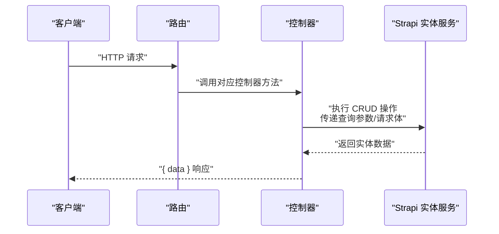
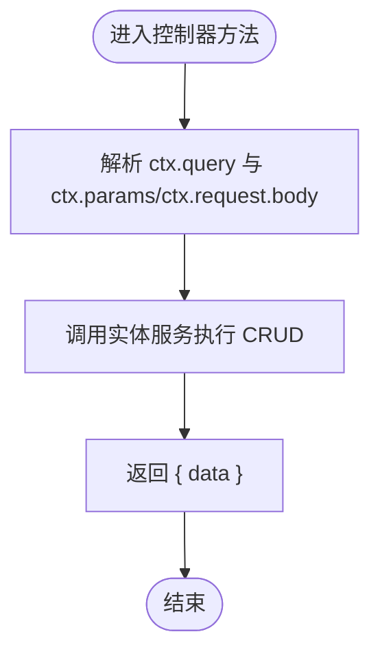
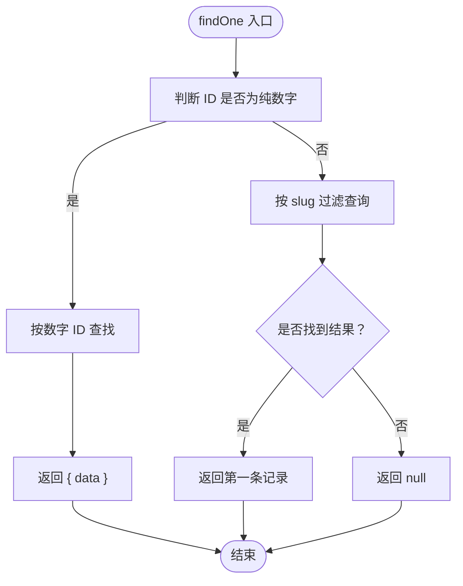
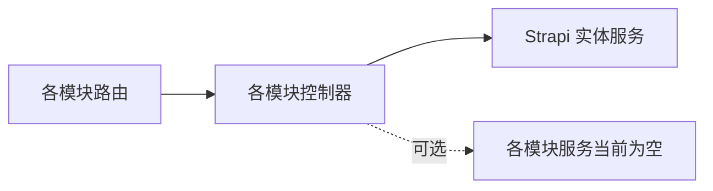

# API 控制器

<cite>
**本文引用的文件**
- [cms/src/api/product/controllers/product.ts](file://cms/src/api/product/controllers/product.ts)
- [cms/src/api/category/controllers/category.ts](file://cms/src/api/category/controllers/category.ts)
- [cms/src/api/blog-post/controllers/blog-post.ts](file://cms/src/api/blog-post/controllers/blog-post.ts)
- [cms/src/api/solution/controllers/solution.ts](file://cms/src/api/solution/controllers/solution.ts)
- [cms/src/api/inquiry/controllers/inquiry.ts](file://cms/src/api/inquiry/controllers/inquiry.ts)
- [cms/src/api/product/routes/product.ts](file://cms/src/api/product/routes/product.ts)
- [cms/src/api/category/routes/category.ts](file://cms/src/api/category/routes/category.ts)
- [cms/src/api/blog-post/routes/blog-post.ts](file://cms/src/api/blog-post/routes/blog-post.ts)
- [cms/src/api/solution/routes/solution.ts](file://cms/src/api/solution/routes/solution.ts)
- [cms/src/api/inquiry/routes/inquiry.ts](file://cms/src/api/inquiry/routes/inquiry.ts)
- [cms/src/api/product/services/product.ts](file://cms/src/api/product/services/product.ts)
- [cms/src/api/category/services/category.ts](file://cms/src/api/category/services/category.ts)
- [cms/src/api/blog-post/services/blog-post.ts](file://cms/src/api/blog-post/services/blog-post.ts)
- [cms/src/api/solution/services/solution.ts](file://cms/src/api/solution/services/solution.ts)
- [cms/src/api/inquiry/services/inquiry.ts](file://cms/src/api/inquiry/services/inquiry.ts)
</cite>

## 目录
1. [简介](#简介)
2. [项目结构](#项目结构)
3. [核心组件](#核心组件)
4. [架构总览](#架构总览)
5. [详细组件分析](#详细组件分析)
6. [依赖关系分析](#依赖关系分析)
7. [性能考量](#性能考量)
8. [故障排查指南](#故障排查指南)
9. [结论](#结论)
10. [附录](#附录)

## 简介
本文件聚焦于 Battivus CMS 的 API 控制器层，系统性梳理产品、分类、博客文章、解决方案与询价表单等模块的控制器实现。内容涵盖：
- 标准 CRUD 方法的实现细节与调用链路
- 数据处理流程与返回格式标准化
- 错误处理机制与边界条件（如博客文章支持数字 ID 与 slug 双入口）
- 控制器与服务层的交互模式与职责边界
- 权限策略与中间件配置位置
- 扩展指南：如何新增自定义方法、集成中间件与策略

## 项目结构
控制器与路由按功能域分层组织，每个实体（产品、分类、博客文章、解决方案、询价）均包含：
- 路由定义：声明 HTTP 方法、路径与处理器映射
- 控制器：接收请求上下文，调用 Strapi 实体服务执行业务操作
- 服务：当前为空实现，预留扩展点

```mermaid
graph TB
subgraph "产品模块"
PRoute["路由: product.ts"]
PCtrl["控制器: product.ts"]
PService["服务: product.ts"]
end
subgraph "分类模块"
CRoute["路由: category.ts"]
CCtrl["控制器: category.ts"]
CService["服务: category.ts"]
end
subgraph "博客文章模块"
BPRoute["路由: blog-post.ts"]
BPCtrl["控制器: blog-post.ts"]
BPService["服务: blog-post.ts"]
end
subgraph "解决方案模块"
SRoute["路由: solution.ts"]
SCtrl["控制器: solution.ts"]
SService["服务: solution.ts"]
end
subgraph "询价模块"
IRoute["路由: inquiry.ts"]
ICtrl["控制器: inquiry.ts"]
IService["服务: inquiry.ts"]
end
PRoute --> PCtrl --> PService
CRoute --> CCtrl --> CService
BPRoute --> BPCtrl --> BPService
SRoute --> SCtrl --> SService
IRoute --> ICtrl --> IService
```

图表来源
- [cms/src/api/product/routes/product.ts:1-35](file://cms/src/api/product/routes/product.ts#L1-L35)
- [cms/src/api/product/controllers/product.ts:1-40](file://cms/src/api/product/controllers/product.ts#L1-L40)
- [cms/src/api/product/services/product.ts:1-2](file://cms/src/api/product/services/product.ts#L1-L2)
- [cms/src/api/category/routes/category.ts:1-50](file://cms/src/api/category/routes/category.ts#L1-L50)
- [cms/src/api/category/controllers/category.ts:1-40](file://cms/src/api/category/controllers/category.ts#L1-L40)
- [cms/src/api/category/services/category.ts:1-2](file://cms/src/api/category/services/category.ts#L1-L2)
- [cms/src/api/blog-post/routes/blog-post.ts:1-35](file://cms/src/api/blog-post/routes/blog-post.ts#L1-L35)
- [cms/src/api/blog-post/controllers/blog-post.ts:1-53](file://cms/src/api/blog-post/controllers/blog-post.ts#L1-L53)
- [cms/src/api/blog-post/services/blog-post.ts:1-2](file://cms/src/api/blog-post/services/blog-post.ts#L1-L2)
- [cms/src/api/solution/routes/solution.ts:1-35](file://cms/src/api/solution/routes/solution.ts#L1-L35)
- [cms/src/api/solution/controllers/solution.ts:1-40](file://cms/src/api/solution/controllers/solution.ts#L1-L40)
- [cms/src/api/solution/services/solution.ts:1-2](file://cms/src/api/solution/services/solution.ts#L1-L2)
- [cms/src/api/inquiry/routes/inquiry.ts:1-35](file://cms/src/api/inquiry/routes/inquiry.ts#L1-L35)
- [cms/src/api/inquiry/controllers/inquiry.ts:1-40](file://cms/src/api/inquiry/controllers/inquiry.ts#L1-L40)
- [cms/src/api/inquiry/services/inquiry.ts:1-2](file://cms/src/api/inquiry/services/inquiry.ts#L1-L2)

章节来源
- [cms/src/api/product/controllers/product.ts:1-40](file://cms/src/api/product/controllers/product.ts#L1-L40)
- [cms/src/api/category/controllers/category.ts:1-40](file://cms/src/api/category/controllers/category.ts#L1-L40)
- [cms/src/api/blog-post/controllers/blog-post.ts:1-53](file://cms/src/api/blog-post/controllers/blog-post.ts#L1-L53)
- [cms/src/api/solution/controllers/solution.ts:1-40](file://cms/src/api/solution/controllers/solution.ts#L1-L40)
- [cms/src/api/inquiry/controllers/inquiry.ts:1-40](file://cms/src/api/inquiry/controllers/inquiry.ts#L1-L40)

## 核心组件
- 控制器统一通过 Strapi 实体服务执行 CRUD 操作，返回统一的 data 包裹对象。
- 路由层负责 HTTP 方法与路径到控制器方法的映射，并预留策略与中间件配置项。
- 服务层当前为空实现，便于后续注入业务逻辑、事务与钩子。

关键要点
- 统一响应格式：所有控制器方法返回 { data } 结构，便于前端一致处理。
- 查询参数透传：控制器将 ctx.query 透传给实体服务，支持分页、排序、过滤等。
- 请求体数据提取：控制器从 ctx.request.body.data 获取写入数据。
- 单条查询增强：博客文章控制器支持数字 ID 与 slug 双入口，提升访问灵活性。

章节来源
- [cms/src/api/product/controllers/product.ts:4-8](file://cms/src/api/product/controllers/product.ts#L4-L8)
- [cms/src/api/product/controllers/product.ts:11-16](file://cms/src/api/product/controllers/product.ts#L11-L16)
- [cms/src/api/product/controllers/product.ts:19-23](file://cms/src/api/product/controllers/product.ts#L19-L23)
- [cms/src/api/product/controllers/product.ts:26-31](file://cms/src/api/product/controllers/product.ts#L26-L31)
- [cms/src/api/product/controllers/product.ts:34-38](file://cms/src/api/product/controllers/product.ts#L34-L38)
- [cms/src/api/category/controllers/category.ts:4-8](file://cms/src/api/category/controllers/category.ts#L4-L8)
- [cms/src/api/category/controllers/category.ts:11-16](file://cms/src/api/category/controllers/category.ts#L11-L16)
- [cms/src/api/category/controllers/category.ts:19-23](file://cms/src/api/category/controllers/category.ts#L19-L23)
- [cms/src/api/category/controllers/category.ts:26-31](file://cms/src/api/category/controllers/category.ts#L26-L31)
- [cms/src/api/category/controllers/category.ts:34-38](file://cms/src/api/category/controllers/category.ts#L34-L38)
- [cms/src/api/blog-post/controllers/blog-post.ts:4-8](file://cms/src/api/blog-post/controllers/blog-post.ts#L4-L8)
- [cms/src/api/blog-post/controllers/blog-post.ts:11-30](file://cms/src/api/blog-post/controllers/blog-post.ts#L11-L30)
- [cms/src/api/blog-post/controllers/blog-post.ts:32-36](file://cms/src/api/blog-post/controllers/blog-post.ts#L32-L36)
- [cms/src/api/blog-post/controllers/blog-post.ts:39-44](file://cms/src/api/blog-post/controllers/blog-post.ts#L39-L44)
- [cms/src/api/blog-post/controllers/blog-post.ts:47-51](file://cms/src/api/blog-post/controllers/blog-post.ts#L47-L51)
- [cms/src/api/solution/controllers/solution.ts:4-8](file://cms/src/api/solution/controllers/solution.ts#L4-L8)
- [cms/src/api/solution/controllers/solution.ts:11-16](file://cms/src/api/solution/controllers/solution.ts#L11-L16)
- [cms/src/api/solution/controllers/solution.ts:19-23](file://cms/src/api/solution/controllers/solution.ts#L19-L23)
- [cms/src/api/solution/controllers/solution.ts:26-31](file://cms/src/api/solution/controllers/solution.ts#L26-L31)
- [cms/src/api/solution/controllers/solution.ts:34-38](file://cms/src/api/solution/controllers/solution.ts#L34-L38)
- [cms/src/api/inquiry/controllers/inquiry.ts:4-8](file://cms/src/api/inquiry/controllers/inquiry.ts#L4-L8)
- [cms/src/api/inquiry/controllers/inquiry.ts:11-16](file://cms/src/api/inquiry/controllers/inquiry.ts#L11-L16)
- [cms/src/api/inquiry/controllers/inquiry.ts:19-23](file://cms/src/api/inquiry/controllers/inquiry.ts#L19-L23)
- [cms/src/api/inquiry/controllers/inquiry.ts:26-31](file://cms/src/api/inquiry/controllers/inquiry.ts#L26-L31)
- [cms/src/api/inquiry/controllers/inquiry.ts:34-38](file://cms/src/api/inquiry/controllers/inquiry.ts#L34-L38)

## 架构总览
控制器层采用“薄控制器、厚服务”的设计：控制器仅负责参数解析、调用实体服务与封装响应；业务逻辑可逐步下沉至服务层或通过实体服务钩子实现。

图表来源
- [cms/src/api/product/routes/product.ts:1-35](file://cms/src/api/product/routes/product.ts#L1-L35)
- [cms/src/api/product/controllers/product.ts:1-40](file://cms/src/api/product/controllers/product.ts#L1-L40)
- [cms/src/api/category/routes/category.ts:1-50](file://cms/src/api/category/routes/category.ts#L1-L50)
- [cms/src/api/category/controllers/category.ts:1-40](file://cms/src/api/category/controllers/category.ts#L1-L40)
- [cms/src/api/blog-post/routes/blog-post.ts:1-35](file://cms/src/api/blog-post/routes/blog-post.ts#L1-L35)
- [cms/src/api/blog-post/controllers/blog-post.ts:1-53](file://cms/src/api/blog-post/controllers/blog-post.ts#L1-L53)
- [cms/src/api/solution/routes/solution.ts:1-35](file://cms/src/api/solution/routes/solution.ts#L1-L35)
- [cms/src/api/solution/controllers/solution.ts:1-40](file://cms/src/api/solution/controllers/solution.ts#L1-L40)
- [cms/src/api/inquiry/routes/inquiry.ts:1-35](file://cms/src/api/inquiry/routes/inquiry.ts#L1-L35)
- [cms/src/api/inquiry/controllers/inquiry.ts:1-40](file://cms/src/api/inquiry/controllers/inquiry.ts#L1-L40)

## 详细组件分析

### 产品控制器（Product）
- 方法覆盖：find、findOne、create、update、delete
- 数据流：读取 ctx.query 与 ctx.request.body.data，调用实体服务，返回 { data }
- 错误处理：未显式 try/catch，遵循 Strapi 默认异常传播机制
- 扩展建议：在服务层增加校验与钩子，或在控制器中加入输入校验与权限检查

图表来源
- [cms/src/api/product/controllers/product.ts:4-38](file://cms/src/api/product/controllers/product.ts#L4-L38)

章节来源
- [cms/src/api/product/controllers/product.ts:1-40](file://cms/src/api/product/controllers/product.ts#L1-L40)
- [cms/src/api/product/routes/product.ts:1-35](file://cms/src/api/product/routes/product.ts#L1-L35)

### 分类控制器（Category）
- 方法覆盖：find、findOne、create、update、delete
- 特殊点：与产品控制器一致，无额外业务逻辑
- 适用场景：基础分类管理，后续可在服务层引入层级结构、唯一键约束等

章节来源
- [cms/src/api/category/controllers/category.ts:1-40](file://cms/src/api/category/controllers/category.ts#L1-L40)
- [cms/src/api/category/routes/category.ts:1-50](file://cms/src/api/category/routes/category.ts#L1-L50)

### 博客文章控制器（Blog Post）
- 方法覆盖：find、findOne、create、update、delete
- 关键增强：findOne 支持数字 ID 与 slug 双入口
  - 数字 ID：直接调用实体服务查找
  - slug：通过 filters: { slug: id } 查询第一条匹配记录
- 返回空值：当 slug 未命中时返回 null，便于前端处理

图表来源
- [cms/src/api/blog-post/controllers/blog-post.ts:11-30](file://cms/src/api/blog-post/controllers/blog-post.ts#L11-L30)

章节来源
- [cms/src/api/blog-post/controllers/blog-post.ts:1-53](file://cms/src/api/blog-post/controllers/blog-post.ts#L1-L53)
- [cms/src/api/blog-post/routes/blog-post.ts:1-35](file://cms/src/api/blog-post/routes/blog-post.ts#L1-L35)

### 解决方案控制器（Solution）
- 方法覆盖：find、findOne、create、update、delete
- 设计：与产品、分类类似，保持一致的薄控制器模式
- 后续：可在服务层加入关联关系处理与状态机

章节来源
- [cms/src/api/solution/controllers/solution.ts:1-40](file://cms/src/api/solution/controllers/solution.ts#L1-L40)
- [cms/src/api/solution/routes/solution.ts:1-35](file://cms/src/api/solution/routes/solution.ts#L1-L35)

### 询价控制器（Inquiry）
- 方法覆盖：find、findOne、create、update、delete
- 用途：收集用户询价信息，后续可在服务层加入邮件通知、状态流转等

章节来源
- [cms/src/api/inquiry/controllers/inquiry.ts:1-40](file://cms/src/api/inquiry/controllers/inquiry.ts#L1-L40)
- [cms/src/api/inquiry/routes/inquiry.ts:1-35](file://cms/src/api/inquiry/routes/inquiry.ts#L1-L35)

## 依赖关系分析
- 控制器依赖：统一依赖 Strapi 实体服务进行数据持久化
- 路由依赖：路由定义决定 HTTP 接口形态与处理器绑定
- 服务依赖：当前为空实现，未来可注入业务规则、事务与钩子

图表来源
- [cms/src/api/product/routes/product.ts:1-35](file://cms/src/api/product/routes/product.ts#L1-L35)
- [cms/src/api/category/routes/category.ts:1-50](file://cms/src/api/category/routes/category.ts#L1-L50)
- [cms/src/api/blog-post/routes/blog-post.ts:1-35](file://cms/src/api/blog-post/routes/blog-post.ts#L1-L35)
- [cms/src/api/solution/routes/solution.ts:1-35](file://cms/src/api/solution/routes/solution.ts#L1-L35)
- [cms/src/api/inquiry/routes/inquiry.ts:1-35](file://cms/src/api/inquiry/routes/inquiry.ts#L1-L35)
- [cms/src/api/product/controllers/product.ts:1-40](file://cms/src/api/product/controllers/product.ts#L1-L40)
- [cms/src/api/category/controllers/category.ts:1-40](file://cms/src/api/category/controllers/category.ts#L1-L40)
- [cms/src/api/blog-post/controllers/blog-post.ts:1-53](file://cms/src/api/blog-post/controllers/blog-post.ts#L1-L53)
- [cms/src/api/solution/controllers/solution.ts:1-40](file://cms/src/api/solution/controllers/solution.ts#L1-L40)
- [cms/src/api/inquiry/controllers/inquiry.ts:1-40](file://cms/src/api/inquiry/controllers/inquiry.ts#L1-L40)

章节来源
- [cms/src/api/product/services/product.ts:1-2](file://cms/src/api/product/services/product.ts#L1-L2)
- [cms/src/api/category/services/category.ts:1-2](file://cms/src/api/category/services/category.ts#L1-L2)
- [cms/src/api/blog-post/services/blog-post.ts:1-2](file://cms/src/api/blog-post/services/blog-post.ts#L1-L2)
- [cms/src/api/solution/services/solution.ts:1-2](file://cms/src/api/solution/services/solution.ts#L1-L2)
- [cms/src/api/inquiry/services/inquiry.ts:1-2](file://cms/src/api/inquiry/services/inquiry.ts#L1-L2)

## 性能考量
- 查询参数透传：利用 ctx.query 实现分页与过滤，避免一次性加载全量数据
- 单条查询优化：博客文章按 slug 查询时建议在数据库层建立索引以提升命中率
- 服务层扩展：将耗时逻辑迁移至服务层，结合钩子减少控制器负担
- 缓存策略：对热点列表（如产品、分类、解决方案）可考虑在服务层引入缓存

## 故障排查指南
- 统一响应格式问题：确认控制器均返回 { data }，避免前端解析差异
- 查询参数无效：检查路由配置中的 config.policies 与 middlewares 是否正确设置
- 博客文章未命中：确认 slug 唯一性与大小写敏感性，必要时在服务层增加规范化处理
- 权限与中间件：当前路由配置中 policies 与 middlewares 为空数组，若需鉴权或限流，请在相应模块中补充策略与中间件

章节来源
- [cms/src/api/blog-post/controllers/blog-post.ts:24-28](file://cms/src/api/blog-post/controllers/blog-post.ts#L24-L28)
- [cms/src/api/product/routes/product.ts](file://cms/src/api/product/routes/product.ts#L7)
- [cms/src/api/category/routes/category.ts:8-9](file://cms/src/api/category/routes/category.ts#L8-L9)
- [cms/src/api/blog-post/routes/blog-post.ts](file://cms/src/api/blog-post/routes/blog-post.ts#L7)
- [cms/src/api/solution/routes/solution.ts](file://cms/src/api/solution/routes/solution.ts#L7)
- [cms/src/api/inquiry/routes/inquiry.ts](file://cms/src/api/inquiry/routes/inquiry.ts#L7)

## 结论
Battivus 的控制器层实现了统一、简洁的 CRUD 接口，配合路由层清晰地暴露 REST 风格端点。博客文章模块通过增强单条查询能力提升了可用性。当前服务层为空，为后续引入业务规则、事务与钩子提供了良好扩展空间。建议在服务层逐步沉淀业务逻辑，并在路由层完善权限与中间件配置。

## 附录

### 标准 CRUD 实施清单
- GET /{entity}：使用 ctx.query 进行分页与过滤
- GET /{entity}/:id：支持数字 ID 与 slug（博客文章）
- POST /{entity}：从 ctx.request.body.data 写入
- PUT /{entity}/:id：更新指定实体
- DELETE /{entity}/:id：删除指定实体

章节来源
- [cms/src/api/product/controllers/product.ts:4-38](file://cms/src/api/product/controllers/product.ts#L4-L38)
- [cms/src/api/category/controllers/category.ts:4-38](file://cms/src/api/category/controllers/category.ts#L4-L38)
- [cms/src/api/blog-post/controllers/blog-post.ts:4-51](file://cms/src/api/blog-post/controllers/blog-post.ts#L4-L51)
- [cms/src/api/solution/controllers/solution.ts:4-38](file://cms/src/api/solution/controllers/solution.ts#L4-L38)
- [cms/src/api/inquiry/controllers/inquiry.ts:4-38](file://cms/src/api/inquiry/controllers/inquiry.ts#L4-L38)

### 扩展指南与最佳实践
- 新增自定义方法
  - 在控制器中添加新方法，遵循 { data } 返回格式
  - 在路由中注册新端点，设置 method、path 与 handler
- 集成中间件与策略
  - 在路由 config.policies 与 middlewares 中添加所需策略与中间件
  - 常见用途：鉴权、限流、日志、审计
- 服务层扩展
  - 将复杂业务逻辑迁移到服务层，保持控制器薄化
  - 使用实体服务钩子实现前置/后置处理（如数据校验、事件触发）
- 数据验证与约束
  - 在服务层或实体层定义字段校验与唯一性约束
  - 对 slug 等易冲突字段进行规范化与去重处理
- 响应一致性
  - 统一返回 { data } 结构，必要时在控制器层包装 meta 或 links 字段

章节来源
- [cms/src/api/product/routes/product.ts:1-35](file://cms/src/api/product/routes/product.ts#L1-L35)
- [cms/src/api/category/routes/category.ts:1-50](file://cms/src/api/category/routes/category.ts#L1-L50)
- [cms/src/api/blog-post/routes/blog-post.ts:1-35](file://cms/src/api/blog-post/routes/blog-post.ts#L1-L35)
- [cms/src/api/solution/routes/solution.ts:1-35](file://cms/src/api/solution/routes/solution.ts#L1-L35)
- [cms/src/api/inquiry/routes/inquiry.ts:1-35](file://cms/src/api/inquiry/routes/inquiry.ts#L1-L35)