# 产品控制器

<cite>
**本文档引用的文件**
- [cms/src/api/product/controllers/product.ts](file://cms/src/api/product/controllers/product.ts)
- [cms/src/api/product/services/product.ts](file://cms/src/api/product/services/product.ts)
- [cms/src/api/product/routes/product.ts](file://cms/src/api/product/routes/product.ts)
- [cms/src/api/product/content-types/product/schema.json](file://cms/src/api/product/content-types/product/schema.json)
- [cms/src/index.ts](file://cms/src/index.ts)
- [cms/config/middlewares.ts](file://cms/config/middlewares.ts)
- [cms/config/plugins.ts](file://cms/config/plugins.ts)
- [cms/src/api/category/controllers/category.ts](file://cms/src/api/category/controllers/category.ts)
- [cms/src/api/blog-post/controllers/blog-post.ts](file://cms/src/api/blog-post/controllers/blog-post.ts)
- [frontend/src/lib/strapi.ts](file://frontend/src/lib/strapi.ts)
- [frontend/src/types/index.ts](file://frontend/src/types/index.ts)
</cite>

## 目录
1. [简介](#简介)
2. [项目结构](#项目结构)
3. [核心组件](#核心组件)
4. [架构概览](#架构概览)
5. [详细组件分析](#详细组件分析)
6. [依赖关系分析](#依赖关系分析)
7. [性能考虑](#性能考虑)
8. [故障排除指南](#故障排除指南)
9. [结论](#结论)
10. [附录](#附录)

## 简介

产品控制器是 Strapi CMS 中负责管理产品数据的核心模块。它提供了完整的 CRUD（创建、读取、更新、删除）操作，支持 RESTful API 接口，并与产品内容类型紧密集成。该控制器实现了标准化的数据访问模式，确保了与其他 API 控制器的一致性。

本控制器特别设计用于支持电池产品管理，包括电压、容量、放电率等关键规格参数，以及产品分类、SEO 优化等功能特性。

## 项目结构

产品控制器遵循 Strapi 的标准目录结构，采用按功能分组的组织方式：

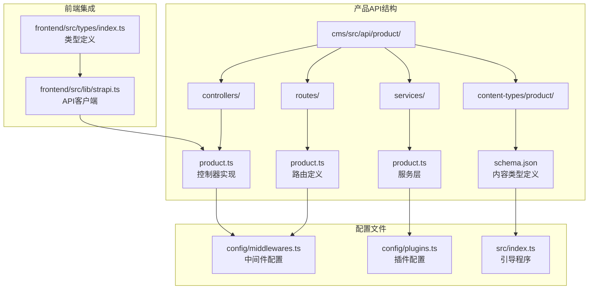

**图表来源**
- [cms/src/api/product/controllers/product.ts:1-40](file://cms/src/api/product/controllers/product.ts#L1-L40)
- [cms/src/api/product/routes/product.ts:1-35](file://cms/src/api/product/routes/product.ts#L1-L35)
- [cms/config/middlewares.ts:1-32](file://cms/config/middlewares.ts#L1-L32)

**章节来源**
- [cms/src/api/product/controllers/product.ts:1-40](file://cms/src/api/product/controllers/product.ts#L1-L40)
- [cms/src/api/product/routes/product.ts:1-35](file://cms/src/api/product/routes/product.ts#L1-L35)
- [cms/src/api/product/content-types/product/schema.json:1-33](file://cms/src/api/product/content-types/product/schema.json#L1-L33)

## 核心组件

产品控制器由四个主要组件构成：控制器类、服务层、路由配置和内容类型定义。每个组件都有明确的职责分工，确保了代码的可维护性和扩展性。

### 控制器架构

控制器采用简洁的设计模式，每个 CRUD 方法都遵循相同的结构：
- 接收 HTTP 请求上下文
- 调用实体服务进行数据操作
- 返回标准化的响应格式

### 数据模型

产品内容类型定义了完整的数据结构，包括必需字段和可选字段：

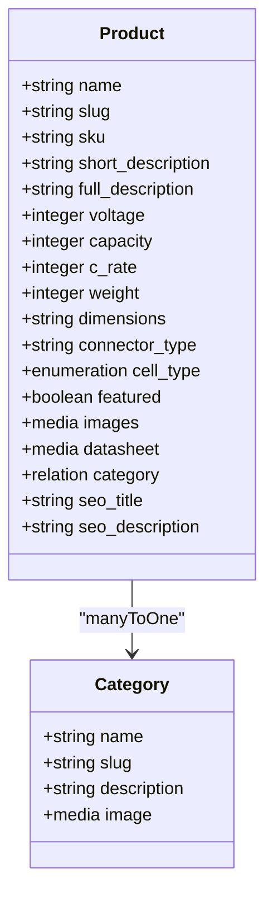

**图表来源**
- [cms/src/api/product/content-types/product/schema.json:12-31](file://cms/src/api/product/content-types/product/schema.json#L12-L31)

**章节来源**
- [cms/src/api/product/content-types/product/schema.json:1-33](file://cms/src/api/product/content-types/product/schema.json#L1-L33)

## 架构概览

产品控制器在整个系统架构中扮演着关键角色，连接前端应用、CMS 后端和数据库存储层。

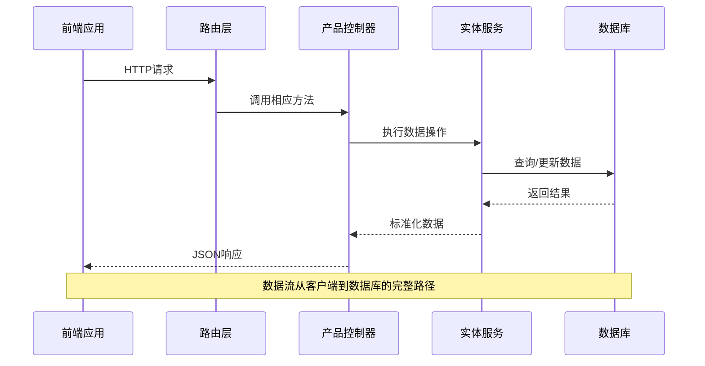

**图表来源**
- [cms/src/api/product/controllers/product.ts:4-38](file://cms/src/api/product/controllers/product.ts#L4-L38)
- [cms/src/api/product/routes/product.ts:1-35](file://cms/src/api/product/routes/product.ts#L1-L35)

## 详细组件分析

### 产品控制器实现

产品控制器实现了标准的 CRUD 操作，每个方法都经过精心设计以确保一致性和可靠性。

#### 查找操作 (find)

查找操作支持多种查询参数，包括分页、排序和过滤：

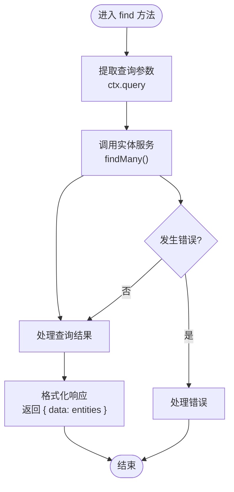

**图表来源**
- [cms/src/api/product/controllers/product.ts:4-9](file://cms/src/api/product/controllers/product.ts#L4-L9)

#### 单项查找 (findOne)

单项查找支持通过 ID 或其他标识符获取特定产品：

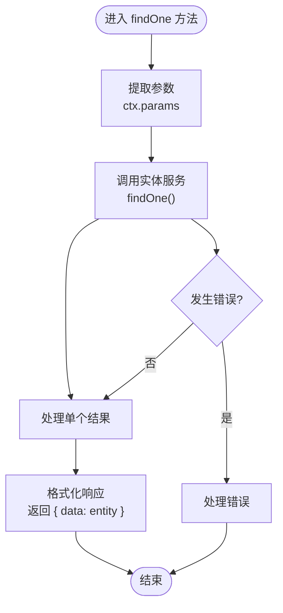

**图表来源**
- [cms/src/api/product/controllers/product.ts:11-17](file://cms/src/api/product/controllers/product.ts#L11-L17)

#### 创建操作 (create)

创建操作处理新产品的数据验证和持久化：

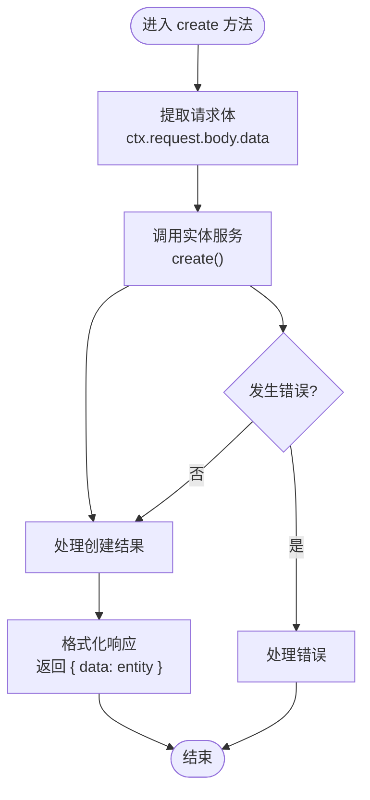

**图表来源**
- [cms/src/api/product/controllers/product.ts:19-24](file://cms/src/api/product/controllers/product.ts#L19-L24)

#### 更新操作 (update)

更新操作支持部分更新和完整更新：

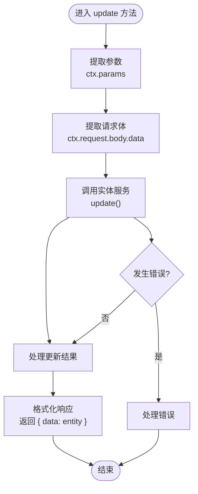

**图表来源**
- [cms/src/api/product/controllers/product.ts:26-32](file://cms/src/api/product/controllers/product.ts#L26-L32)

#### 删除操作 (delete)

删除操作提供安全的产品移除功能：

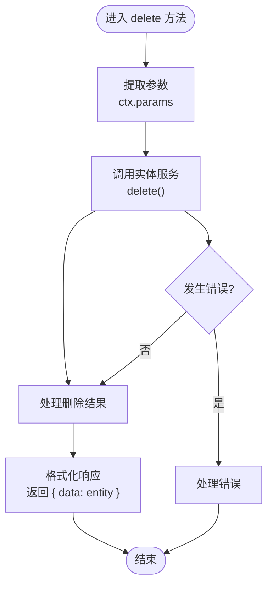

**图表来源**
- [cms/src/api/product/controllers/product.ts:34-38](file://cms/src/api/product/controllers/product.ts#L34-L38)

**章节来源**
- [cms/src/api/product/controllers/product.ts:1-40](file://cms/src/api/product/controllers/product.ts#L1-L40)

### 路由配置

路由配置定义了所有 API 端点及其对应的控制器方法：

| HTTP 方法 | 路径 | 控制器方法 | 功能描述 |
|-----------|------|------------|----------|
| GET | `/products` | `product.find` | 获取产品列表 |
| GET | `/products/:id` | `product.findOne` | 获取单个产品 |
| POST | `/products` | `product.create` | 创建新产品 |
| PUT | `/products/:id` | `product.update` | 更新产品信息 |
| DELETE | `/products/:id` | `product.delete` | 删除产品 |

**章节来源**
- [cms/src/api/product/routes/product.ts:1-35](file://cms/src/api/product/routes/product.ts#L1-L35)

### 服务层架构

当前产品服务层是一个空实现，这为未来的业务逻辑扩展提供了灵活性：

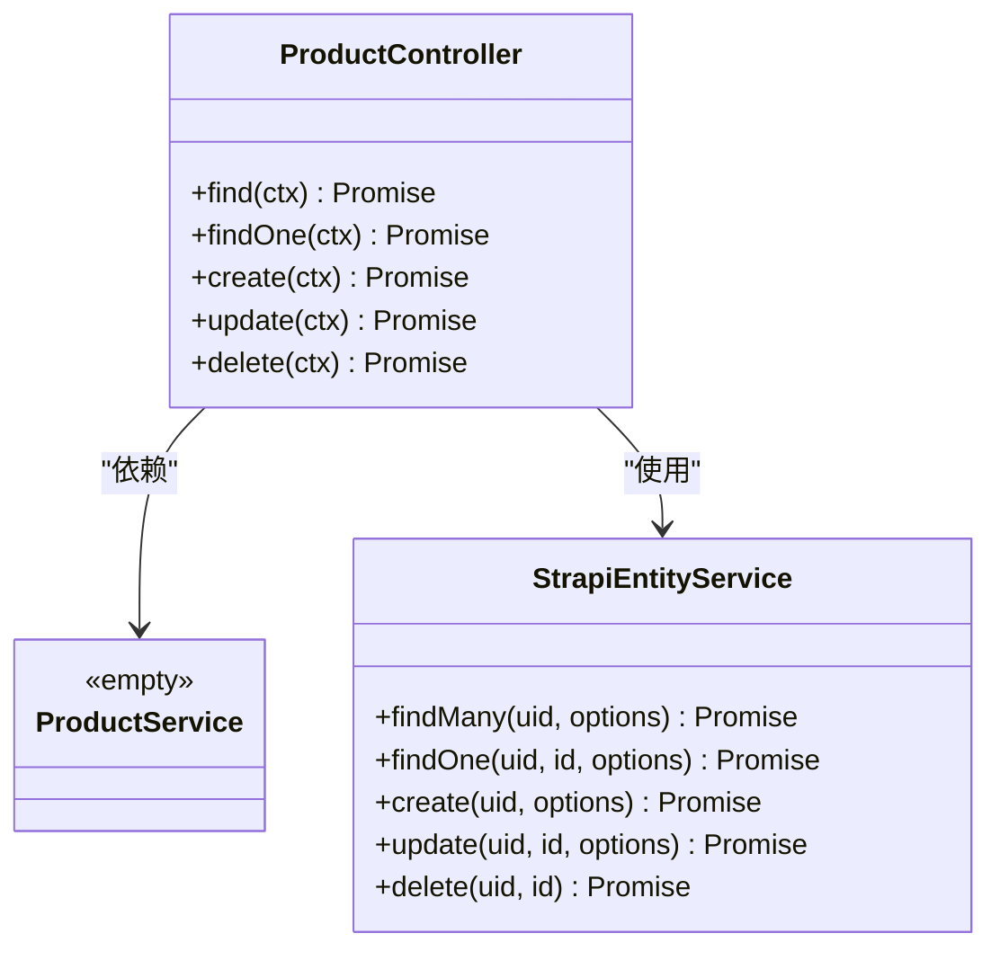

**图表来源**
- [cms/src/api/product/services/product.ts:1-2](file://cms/src/api/product/services/product.ts#L1-L2)
- [cms/src/api/product/controllers/product.ts:1-40](file://cms/src/api/product/controllers/product.ts#L1-L40)

**章节来源**
- [cms/src/api/product/services/product.ts:1-2](file://cms/src/api/product/services/product.ts#L1-L2)

### 数据验证规则

产品内容类型定义了严格的数据验证规则：

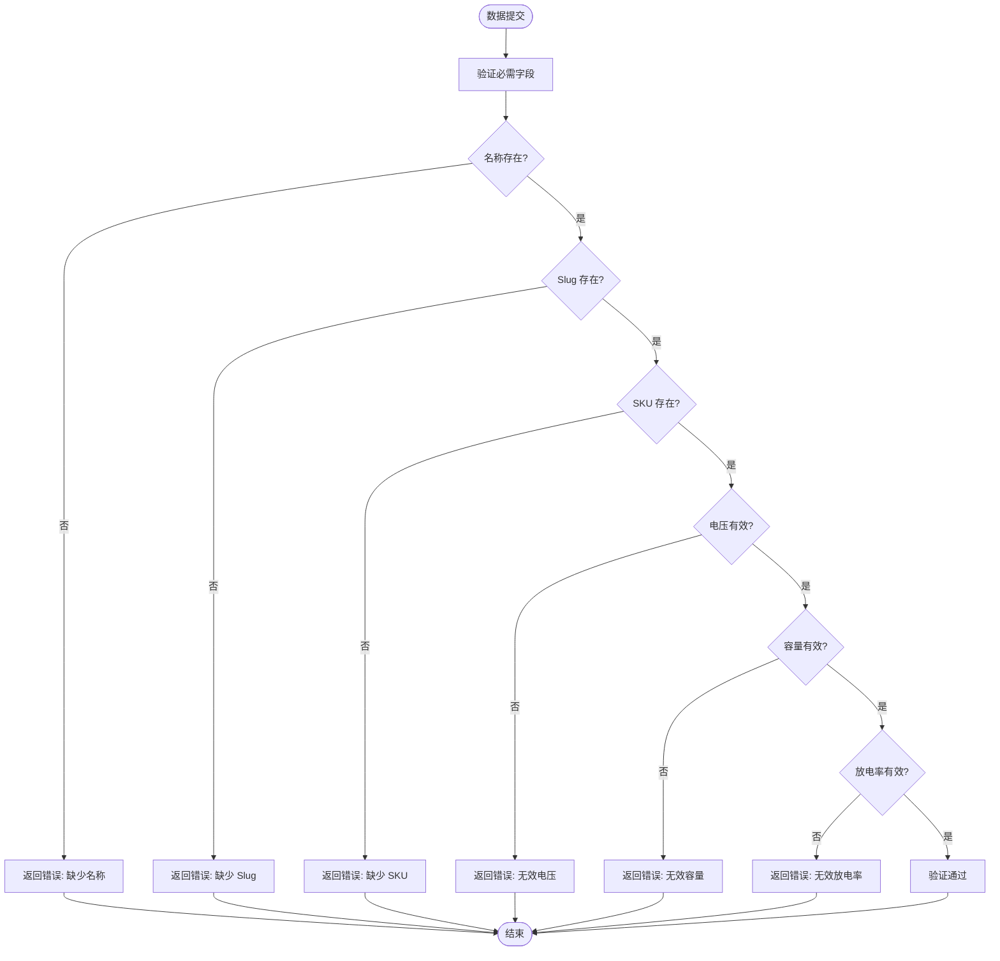

**图表来源**
- [cms/src/api/product/content-types/product/schema.json:13-25](file://cms/src/api/product/content-types/product/schema.json#L13-L25)

**章节来源**
- [cms/src/api/product/content-types/product/schema.json:1-33](file://cms/src/api/product/content-types/product/schema.json#L1-L33)

## 依赖关系分析

产品控制器与其他系统组件之间存在清晰的依赖关系：

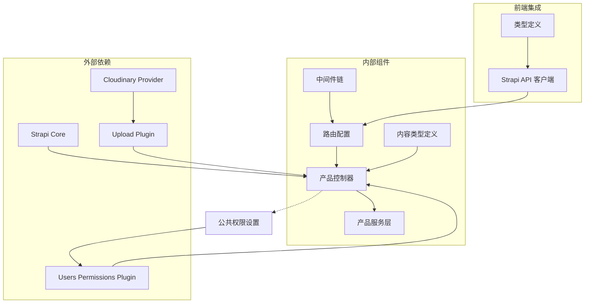

**图表来源**
- [cms/src/index.ts:172-210](file://cms/src/index.ts#L172-L210)
- [cms/config/plugins.ts:3-16](file://cms/config/plugins.ts#L3-L16)
- [cms/config/middlewares.ts:1-32](file://cms/config/middlewares.ts#L1-L32)

**章节来源**
- [cms/src/index.ts:161-217](file://cms/src/index.ts#L161-L217)
- [cms/config/plugins.ts:1-19](file://cms/config/plugins.ts#L1-L19)
- [cms/config/middlewares.ts:1-32](file://cms/config/middlewares.ts#L1-L32)

### 权限检查机制

系统通过用户权限插件实现细粒度的访问控制：

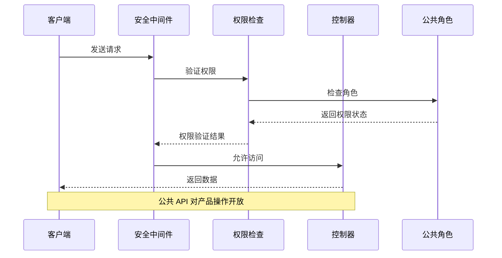

**图表来源**
- [cms/src/index.ts:172-210](file://cms/src/index.ts#L172-L210)

**章节来源**
- [cms/src/index.ts:161-217](file://cms/src/index.ts#L161-L217)

## 性能考虑

### 查询优化策略

1. **分页处理**: 支持分页参数以限制返回记录数量
2. **选择性加载**: 通过 populate 参数控制关联数据加载
3. **索引优化**: 建议为常用查询字段建立数据库索引

### 缓存策略

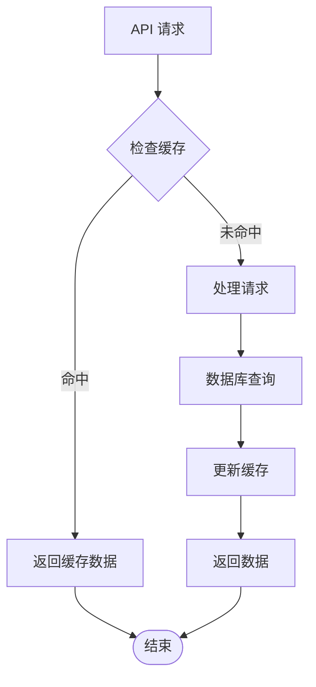

### 错误处理优化

系统采用统一的错误处理机制，确保错误信息的一致性和可诊断性。

## 故障排除指南

### 常见问题及解决方案

1. **权限错误**: 确保公共角色具有相应的产品操作权限
2. **数据验证失败**: 检查必需字段是否正确填写
3. **关联数据缺失**: 验证产品与分类的关系是否正确建立

### 调试技巧

- 使用浏览器开发者工具监控网络请求
- 检查服务器日志获取详细错误信息
- 验证 API 端点的正确性

**章节来源**
- [cms/src/index.ts:275-310](file://cms/src/index.ts#L275-L310)

## 结论

产品控制器提供了一个完整、可扩展的产品管理解决方案。其设计遵循了 Strapi 的最佳实践，确保了代码的可维护性和性能。通过标准化的 CRUD 操作、严格的验证规则和灵活的服务层架构，该控制器能够满足各种产品管理需求。

未来可以考虑添加以下增强功能：
- 更复杂的业务逻辑验证
- 自定义查询方法
- 性能监控和优化
- 更丰富的错误处理机制

## 附录

### API 端点参考

| 端点 | 方法 | 描述 | 认证要求 |
|------|------|------|----------|
| `/api/products` | GET | 获取产品列表 | 无需认证 |
| `/api/products/:id` | GET | 获取单个产品 | 无需认证 |
| `/api/products` | POST | 创建新产品 | 需要认证 |
| `/api/products/:id` | PUT | 更新产品 | 需要认证 |
| `/api/products/:id` | DELETE | 删除产品 | 需要认证 |

### 数据转换指南

前端应用通过 Strapi API 客户端自动处理数据转换，包括：
- 字段名转换（snake_case 到 camelCase）
- 关联数据的扁平化处理
- 媒体资源 URL 的完整化

**章节来源**
- [frontend/src/lib/strapi.ts:333-365](file://frontend/src/lib/strapi.ts#L333-L365)
- [frontend/src/types/index.ts:23-43](file://frontend/src/types/index.ts#L23-L43)