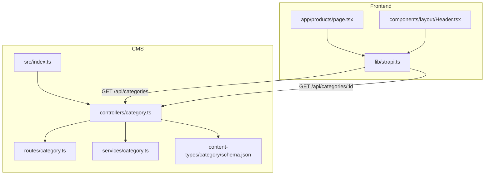
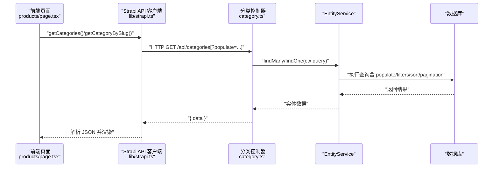
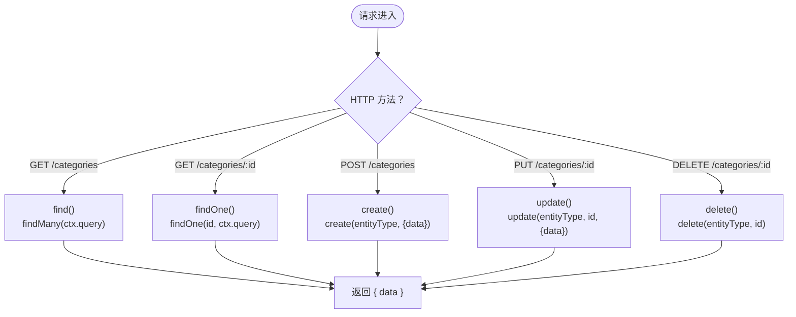
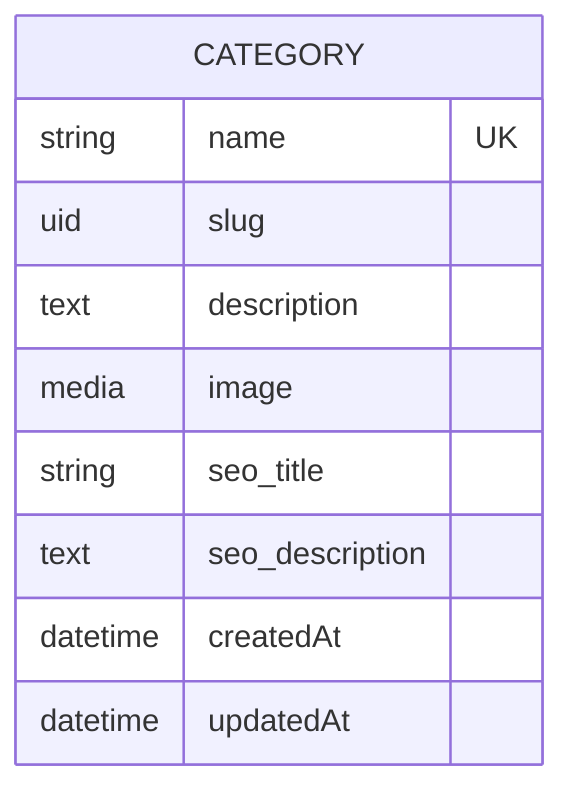
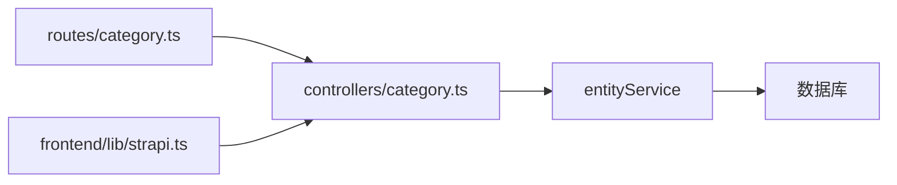

# 分类控制器

<cite>
**本文引用的文件**
- [cms/src/api/category/controllers/category.ts](file://cms/src/api/category/controllers/category.ts)
- [cms/src/api/category/routes/category.ts](file://cms/src/api/category/routes/category.ts)
- [cms/src/api/category/services/category.ts](file://cms/src/api/category/services/category.ts)
- [cms/src/api/category/content-types/category/schema.json](file://cms/src/api/category/content-types/category/schema.json)
- [cms/src/index.ts](file://cms/src/index.ts)
- [frontend/src/lib/strapi.ts](file://frontend/src/lib/strapi.ts)
- [frontend/src/app/products/page.tsx](file://frontend/src/app/products/page.tsx)
- [frontend/src/components/layout/Header.tsx](file://frontend/src/components/layout/Header.tsx)
- [cms/config/plugins.ts](file://cms/config/plugins.ts)
- [cms/config/server.ts](file://cms/config/server.ts)
</cite>

## 目录
1. [引言](#引言)
2. [项目结构](#项目结构)
3. [核心组件](#核心组件)
4. [架构总览](#架构总览)
5. [详细组件分析](#详细组件分析)
6. [依赖分析](#依赖分析)
7. [性能考虑](#性能考虑)
8. [故障排查指南](#故障排查指南)
9. [结论](#结论)
10. [附录](#附录)

## 引言
本文件围绕“分类”内容类型的控制器进行系统化文档化，覆盖以下主题：
- CRUD 实现：find、findOne、create、update、delete 的调用链与参数传递
- 层级结构与父子关系：当前模型未声明层级字段，但可扩展为父子关系或树形结构
- 分类树构建：基于现有关系的树形展示思路与建议
- 查询优化：populate、filters、分页与排序的使用
- 关联数据加载：前端通过 populate 获取关联产品
- 导航生成：前端如何消费分类数据生成导航
- 数据校验与业务规则：schema 中的必填、唯一性与 SEO 字段
- 控制器与服务层协作：控制器直接委托 entityService，服务层为空占位
- 缓存与性能：Next.js revalidate 配置与 Strapi 文档 API 使用建议
- 扩展指南：新增字段、自定义查询、多语言支持与层级化改造

## 项目结构
分类功能位于 CMS 的 api::category 命名空间下，采用标准的控制器-路由-服务-内容类型 Schema 组织方式。前端通过统一的 Strapi 客户端封装访问 API。

图表来源
- [cms/src/api/category/controllers/category.ts:1-40](file://cms/src/api/category/controllers/category.ts#L1-L40)
- [cms/src/api/category/routes/category.ts:1-50](file://cms/src/api/category/routes/category.ts#L1-L50)
- [cms/src/api/category/services/category.ts:1-2](file://cms/src/api/category/services/category.ts#L1-L2)
- [cms/src/api/category/content-types/category/schema.json:1-21](file://cms/src/api/category/content-types/category/schema.json#L1-L21)
- [cms/src/index.ts:1-315](file://cms/src/index.ts#L1-L315)
- [frontend/src/lib/strapi.ts:1-412](file://frontend/src/lib/strapi.ts#L1-L412)
- [frontend/src/app/products/page.tsx:1-580](file://frontend/src/app/products/page.tsx#L1-L580)
- [frontend/src/components/layout/Header.tsx:1-196](file://frontend/src/components/layout/Header.tsx#L1-L196)

章节来源
- [cms/src/api/category/controllers/category.ts:1-40](file://cms/src/api/category/controllers/category.ts#L1-L40)
- [cms/src/api/category/routes/category.ts:1-50](file://cms/src/api/category/routes/category.ts#L1-L50)
- [cms/src/api/category/services/category.ts:1-2](file://cms/src/api/category/services/category.ts#L1-L2)
- [cms/src/api/category/content-types/category/schema.json:1-21](file://cms/src/api/category/content-types/category/schema.json#L1-L21)
- [cms/src/index.ts:1-315](file://cms/src/index.ts#L1-L315)
- [frontend/src/lib/strapi.ts:1-412](file://frontend/src/lib/strapi.ts#L1-L412)
- [frontend/src/app/products/page.tsx:1-580](file://frontend/src/app/products/page.tsx#L1-L580)
- [frontend/src/components/layout/Header.tsx:1-196](file://frontend/src/components/layout/Header.tsx#L1-L196)

## 核心组件
- 控制器（Category Controller）
  - 提供 find、findOne、create、update、delete 方法，均通过 strapi.entityService 调用
  - 支持 ctx.query 透传给 entityService，用于 populate、filters、sort、pagination 等
- 路由（Category Routes）
  - 定义 GET /categories、GET /categories/:id、POST /categories、PUT /categories/:id、DELETE /categories/:id
  - 默认 policies/middlewares 为空
- 服务（Category Service）
  - 当前为空对象，预留扩展点（如自定义查询、事务、缓存）
- 内容类型 Schema（Category Schema）
  - 字段：name（必填、唯一）、slug（UID，必填）、description、image、seo_title、seo_description
  - draftAndPublish 启用
- 初始化脚本（Bootstrap）
  - 自动授予公共角色对分类 API 的访问权限
  - 数据种子：按 slug 匹配创建分类与产品，并建立关系

章节来源
- [cms/src/api/category/controllers/category.ts:1-40](file://cms/src/api/category/controllers/category.ts#L1-L40)
- [cms/src/api/category/routes/category.ts:1-50](file://cms/src/api/category/routes/category.ts#L1-L50)
- [cms/src/api/category/services/category.ts:1-2](file://cms/src/api/category/services/category.ts#L1-L2)
- [cms/src/api/category/content-types/category/schema.json:1-21](file://cms/src/api/category/content-types/category/schema.json#L1-L21)
- [cms/src/index.ts:161-217](file://cms/src/index.ts#L161-L217)

## 架构总览
分类控制器遵循“控制器直连实体服务”的轻量架构，前端通过统一客户端封装访问 API。

图表来源
- [frontend/src/app/products/page.tsx:314-360](file://frontend/src/app/products/page.tsx#L314-L360)
- [frontend/src/lib/strapi.ts:170-182](file://frontend/src/lib/strapi.ts#L170-L182)
- [cms/src/api/category/controllers/category.ts:4-17](file://cms/src/api/category/controllers/category.ts#L4-L17)

章节来源
- [frontend/src/app/products/page.tsx:314-360](file://frontend/src/app/products/page.tsx#L314-L360)
- [frontend/src/lib/strapi.ts:170-182](file://frontend/src/lib/strapi.ts#L170-L182)
- [cms/src/api/category/controllers/category.ts:4-17](file://cms/src/api/category/controllers/category.ts#L4-L17)

## 详细组件分析

### 控制器方法与调用链
- find
  - 入口：GET /api/categories
  - 行为：将 ctx.query 透传至 entityService.findMany，支持 populate、filters、sort、pagination
- findOne
  - 入口：GET /api/categories/:id 或按 slug
  - 行为：entityService.findOne(id, ctx.query)，支持 populate
- create
  - 入口：POST /api/categories
  - 行为：entityService.create('api::category.category', { data: ctx.request.body.data })
- update
  - 入口：PUT /api/categories/:id
  - 行为：entityService.update('api::category.category', id, { data: ctx.request.body.data })
- delete
  - 入口：DELETE /api/categories/:id
  - 行为：entityService.delete('api::category.category', id)

图表来源
- [cms/src/api/category/controllers/category.ts:4-38](file://cms/src/api/category/controllers/category.ts#L4-L38)

章节来源
- [cms/src/api/category/controllers/category.ts:4-38](file://cms/src/api/category/controllers/category.ts#L4-L38)

### 路由映射与权限
- 路由定义：见 routes/category.ts
- 权限授予：bootstrap 中为公共角色启用 api::category.category.find、findOne
- 注意：当前未在路由 config 中显式配置 policies/middlewares，需结合业务需求补充

章节来源
- [cms/src/api/category/routes/category.ts:1-50](file://cms/src/api/category/routes/category.ts#L1-L50)
- [cms/src/index.ts:173-208](file://cms/src/index.ts#L173-L208)

### 数据模型与约束
- 字段与约束
  - name：必填、唯一
  - slug：UID，基于 name，必填
  - description：文本
  - image：媒体（单图）
  - seo_title、seo_description：SEO 字段
- draftAndPublish：启用，支持发布状态

图表来源
- [cms/src/api/category/content-types/category/schema.json:12-19](file://cms/src/api/category/content-types/category/schema.json#L12-L19)

章节来源
- [cms/src/api/category/content-types/category/schema.json:1-21](file://cms/src/api/category/content-types/category/schema.json#L1-L21)

### 查询优化与关联加载
- populate
  - 前端在获取分类时使用 populate: '*'，确保关联字段完整返回
  - 建议：仅 populate 必要字段，避免过度加载
- filters
  - 支持嵌套关系过滤（如 category.slug），前端在产品页按分类 slug 过滤产品
- sort、pagination
  - 可通过 ctx.query 传入，控制器原样透传 entityService
- Next.js revalidate
  - 前端 fetchAPI 设置 next: { revalidate: 60 }，提升静态/增量更新性能

章节来源
- [frontend/src/lib/strapi.ts:170-182](file://frontend/src/lib/strapi.ts#L170-L182)
- [frontend/src/lib/strapi.ts:184-219](file://frontend/src/lib/strapi.ts#L184-L219)
- [frontend/src/lib/strapi.ts:51-99](file://frontend/src/lib/strapi.ts#L51-L99)
- [frontend/src/lib/strapi.ts:109-119](file://frontend/src/lib/strapi.ts#L109-L119)

### 分类导航生成逻辑
- 前端从 /api/categories 获取分类列表
- 产品页根据分类 slug 生成链接，Header 组件中存在产品导航项（示例配置）
- 建议：在 Header 中动态拉取分类并生成下拉菜单，或维护静态配置

章节来源
- [frontend/src/app/products/page.tsx:333-349](file://frontend/src/app/products/page.tsx#L333-L349)
- [frontend/src/components/layout/Header.tsx:78-90](file://frontend/src/components/layout/Header.tsx#L78-L90)

### 分类层级结构与父子关系
- 当前 Schema 未声明层级字段（如 parent、children）
- 若需层级：可在 Schema 新增 relation 字段；或通过自定义服务实现树构建
- 建议：使用 documents API 或自定义查询，按父节点聚合子节点，形成树形结构

章节来源
- [cms/src/api/category/content-types/category/schema.json:12-19](file://cms/src/api/category/content-types/category/schema.json#L12-L19)
- [cms/src/api/category/services/category.ts:1-2](file://cms/src/api/category/services/category.ts#L1-L2)

### 与服务层协作模式
- 控制器直接调用 entityService，服务层为空
- 扩展建议：
  - 在服务层封装复杂查询（如树构建、统计）
  - 在服务层引入缓存（如 Redis）与事务控制
  - 在服务层实现业务规则校验与数据转换

章节来源
- [cms/src/api/category/controllers/category.ts:4-38](file://cms/src/api/category/controllers/category.ts#L4-L38)
- [cms/src/api/category/services/category.ts:1-2](file://cms/src/api/category/services/category.ts#L1-L2)

### 缓存策略与性能优化
- 前端缓存：Next.js revalidate 60 秒
- 后端缓存：可在服务层引入缓存键（如 categories:tree、categories:list）
- 查询优化：
  - 限制 populate 字段
  - 使用 filters 减少结果集
  - 对高频查询建立索引（如 slug）

章节来源
- [frontend/src/lib/strapi.ts:109-112](file://frontend/src/lib/strapi.ts#L109-L112)
- [cms/src/api/category/controllers/category.ts:4-17](file://cms/src/api/category/controllers/category.ts#L4-L17)

### 数据验证与业务规则
- 必填：name、slug
- 唯一：name、slug
- SEO：seo_title、seo_description
- 发布：draftAndPublish 启用
- 建议：在服务层增加输入校验与冲突检测（如重复 slug）

章节来源
- [cms/src/api/category/content-types/category/schema.json:13-18](file://cms/src/api/category/content-types/category/schema.json#L13-L18)
- [cms/src/index.ts:219-315](file://cms/src/index.ts#L219-L315)

### 扩展指南与最佳实践
- 新增字段
  - 在 schema.json 添加新属性
  - 更新控制器与服务层以适配新字段
- 自定义查询
  - 在 services/category.ts 实现自定义方法，如按层级构建树
- 多语言支持
  - 在 schema 中添加 locale 与 localizations
  - 在控制器/服务层处理多语言 populate 与回退策略
- 关系与导航
  - 通过 populate 获取关联产品，前端据此生成导航与面包屑
  - 保持 slug 唯一，便于 URL 与 SEO

章节来源
- [cms/src/api/category/content-types/category/schema.json:1-21](file://cms/src/api/category/content-types/category/schema.json#L1-L21)
- [frontend/src/lib/strapi.ts:170-182](file://frontend/src/lib/strapi.ts#L170-L182)

## 依赖分析
- 控制器依赖 entityService（由 Strapi 注入）
- 路由依赖控制器方法字符串（handler: 'category.find' 等）
- 服务层为空，耦合度低，便于扩展
- 前端依赖统一 API 客户端封装

图表来源
- [cms/src/api/category/routes/category.ts:1-50](file://cms/src/api/category/routes/category.ts#L1-L50)
- [cms/src/api/category/controllers/category.ts:1-40](file://cms/src/api/category/controllers/category.ts#L1-L40)
- [frontend/src/lib/strapi.ts:1-412](file://frontend/src/lib/strapi.ts#L1-L412)

章节来源
- [cms/src/api/category/routes/category.ts:1-50](file://cms/src/api/category/routes/category.ts#L1-L50)
- [cms/src/api/category/controllers/category.ts:1-40](file://cms/src/api/category/controllers/category.ts#L1-L40)
- [frontend/src/lib/strapi.ts:1-412](file://frontend/src/lib/strapi.ts#L1-L412)

## 性能考虑
- 前端：利用 Next.js revalidate 缓存，减少重复请求
- 后端：entityService 已内置查询优化；建议在服务层增加缓存与索引
- 查询：优先使用 filters 与分页，避免一次性加载全量数据
- 关联：仅 populate 必要字段，避免 N+1 查询

## 故障排查指南
- 403/无权限
  - 检查 bootstrap 是否已为公共角色授予 api::category.category.find/findOne
- 404/找不到分类
  - 确认 slug 正确；前端支持按 slug 访问
- 数据不一致
  - 检查种子脚本是否成功创建分类与产品关系
- 查询性能差
  - 检查 populate 字段数量；确认 filters 是否合理

章节来源
- [cms/src/index.ts:173-210](file://cms/src/index.ts#L173-L210)
- [frontend/src/lib/strapi.ts:178-182](file://frontend/src/lib/strapi.ts#L178-L182)
- [cms/src/index.ts:219-315](file://cms/src/index.ts#L219-L315)

## 结论
分类控制器采用最小可行设计，通过 entityService 提供标准 CRUD 能力。当前未实现层级与服务层扩展，但具备良好的演进空间。建议在服务层引入缓存、自定义查询与业务校验，并在前端按需 populate 以平衡性能与体验。

## 附录
- 配置参考
  - 插件配置：上传 provider（Cloudinary）
  - 服务器配置：host、port、keys、webhooks
- 常用路径
  - GET /api/categories
  - GET /api/categories/:id
  - POST /api/categories
  - PUT /api/categories/:id
  - DELETE /api/categories/:id

章节来源
- [cms/config/plugins.ts:1-19](file://cms/config/plugins.ts#L1-L19)
- [cms/config/server.ts:1-11](file://cms/config/server.ts#L1-L11)
- [cms/src/api/category/routes/category.ts:1-50](file://cms/src/api/category/routes/category.ts#L1-L50)