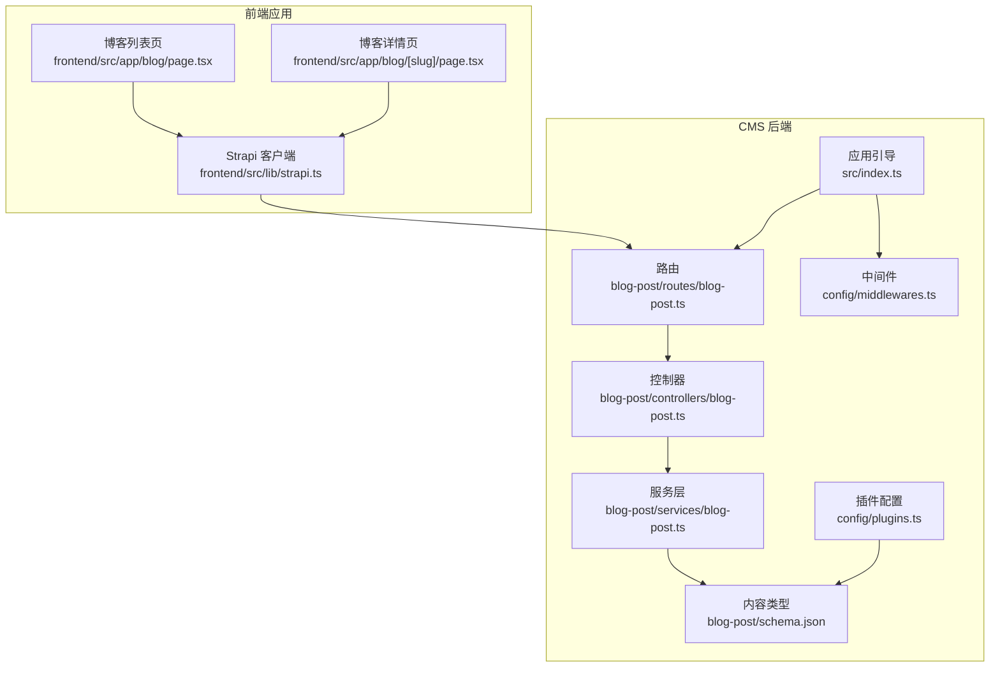
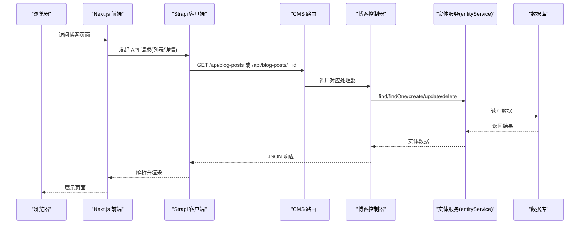
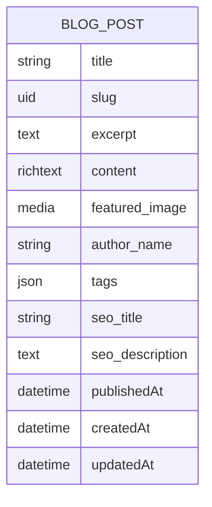
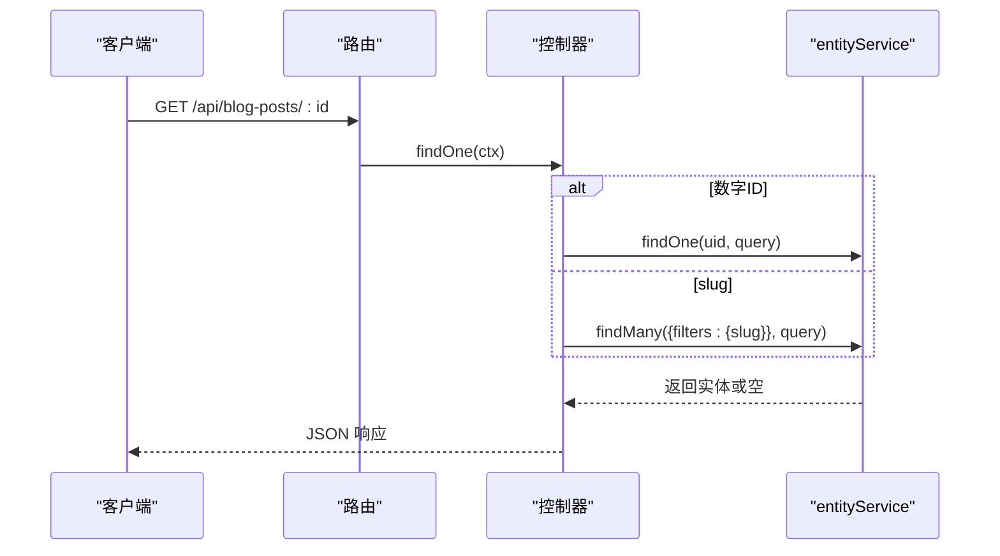
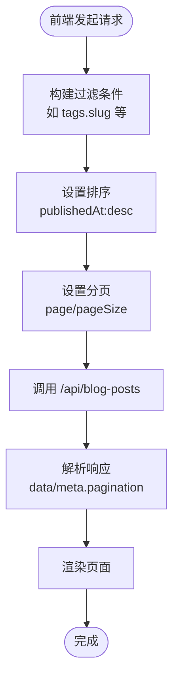
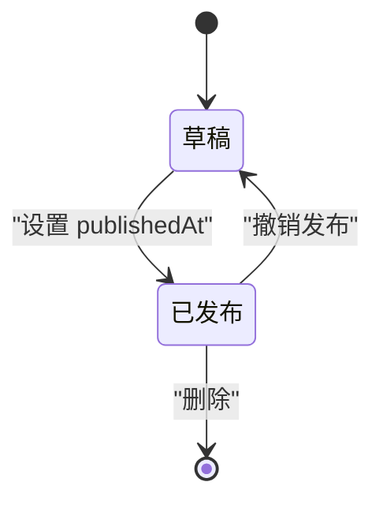
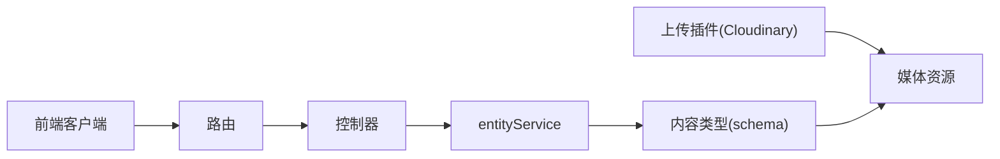

# 博客文章控制器

<cite>
**本文档引用的文件**
- [cms/src/api/blog-post/controllers/blog-post.ts](file://cms/src/api/blog-post/controllers/blog-post.ts)
- [cms/src/api/blog-post/services/blog-post.ts](file://cms/src/api/blog-post/services/blog-post.ts)
- [cms/src/api/blog-post/routes/blog-post.ts](file://cms/src/api/blog-post/routes/blog-post.ts)
- [cms/src/api/blog-post/content-types/blog-post/schema.json](file://cms/src/api/blog-post/content-types/blog-post/schema.json)
- [cms/src/index.ts](file://cms/src/index.ts)
- [cms/config/middlewares.ts](file://cms/config/middlewares.ts)
- [cms/config/plugins.ts](file://cms/config/plugins.ts)
- [frontend/src/lib/strapi.ts](file://frontend/src/lib/strapi.ts)
- [frontend/src/app/blog/page.tsx](file://frontend/src/app/blog/page.tsx)
- [frontend/src/app/blog/[slug]/page.tsx](file://frontend/src/app/blog/[slug]/page.tsx)
- [cms/config/admin.ts](file://cms/config/admin.ts)
- [cms/config/server.ts](file://cms/config/server.ts)
</cite>

## 目录
1. [简介](#简介)
2. [项目结构](#项目结构)
3. [核心组件](#核心组件)
4. [架构总览](#架构总览)
5. [详细组件分析](#详细组件分析)
6. [依赖关系分析](#依赖关系分析)
7. [性能考虑](#性能考虑)
8. [故障排除指南](#故障排除指南)
9. [结论](#结论)
10. [附录](#附录)

## 简介
本文件面向博客文章控制器的实现与使用，围绕以下目标展开：发布流程与草稿状态管理、内容处理与 SEO 字段管理、媒体资源关联、查询过滤与分页排序、搜索能力、控制器与内容服务交互模式、权限控制与数据安全、扩展指南（自定义字段、内容模板）。文档同时提供可视化图示与最佳实践建议，帮助开发者快速构建高效稳定的博客系统。

## 项目结构
博客文章功能由 CMS 后端与前端 Next.js 应用共同组成：
- CMS 后端提供内容模型、路由、控制器与服务层，并通过 Strapi 的 entityService 进行数据持久化与查询。
- 前端 Next.js 应用通过统一的 Strapi 客户端封装调用后端 API，实现列表、详情、分页、筛选与 SEO 元数据生成。

**图表来源**
- [cms/src/api/blog-post/content-types/blog-post/schema.json:1-24](file://cms/src/api/blog-post/content-types/blog-post/schema.json#L1-L24)
- [cms/src/api/blog-post/routes/blog-post.ts:1-35](file://cms/src/api/blog-post/routes/blog-post.ts#L1-L35)
- [cms/src/api/blog-post/controllers/blog-post.ts:1-53](file://cms/src/api/blog-post/controllers/blog-post.ts#L1-L53)
- [cms/src/api/blog-post/services/blog-post.ts:1-2](file://cms/src/api/blog-post/services/blog-post.ts#L1-L2)
- [cms/config/middlewares.ts:1-32](file://cms/config/middlewares.ts#L1-L32)
- [cms/config/plugins.ts:1-19](file://cms/config/plugins.ts#L1-L19)
- [cms/src/index.ts:161-216](file://cms/src/index.ts#L161-L216)
- [frontend/src/lib/strapi.ts:236-274](file://frontend/src/lib/strapi.ts#L236-L274)
- [frontend/src/app/blog/page.tsx:1-203](file://frontend/src/app/blog/page.tsx#L1-L203)
- [frontend/src/app/blog/[slug]/page.tsx](file://frontend/src/app/blog/[slug]/page.tsx#L1-L290)

**章节来源**
- [cms/src/api/blog-post/controllers/blog-post.ts:1-53](file://cms/src/api/blog-post/controllers/blog-post.ts#L1-L53)
- [cms/src/api/blog-post/routes/blog-post.ts:1-35](file://cms/src/api/blog-post/routes/blog-post.ts#L1-L35)
- [cms/src/api/blog-post/content-types/blog-post/schema.json:1-24](file://cms/src/api/blog-post/content-types/blog-post/schema.json#L1-L24)
- [frontend/src/lib/strapi.ts:236-274](file://frontend/src/lib/strapi.ts#L236-L274)

## 核心组件
- 内容类型定义：包含标题、UID（slug）、摘要、富文本内容、封面图、作者名、标签、SEO 标题与描述等字段，并启用草稿与发布能力。
- 路由定义：提供 GET/POST/PUT/DELETE 接口，支持按 ID 或 slug 查询单条记录。
- 控制器：封装 find/findOne/create/update/delete，内部委托 Strapi entityService 执行业务逻辑。
- 服务层：当前为空实现，预留扩展点。
- 前端客户端：统一封装查询参数（populate/filters/sort/pagination），并提供博客列表与详情接口。
- 权限与安全：通过应用引导自动为公共角色授予博客 API 访问权限；中间件配置包含安全策略与 CORS；上传插件集成 Cloudinary。

**章节来源**
- [cms/src/api/blog-post/content-types/blog-post/schema.json:9-22](file://cms/src/api/blog-post/content-types/blog-post/schema.json#L9-L22)
- [cms/src/api/blog-post/routes/blog-post.ts:1-35](file://cms/src/api/blog-post/routes/blog-post.ts#L1-L35)
- [cms/src/api/blog-post/controllers/blog-post.ts:4-51](file://cms/src/api/blog-post/controllers/blog-post.ts#L4-L51)
- [cms/src/api/blog-post/services/blog-post.ts:1-2](file://cms/src/api/blog-post/services/blog-post.ts#L1-L2)
- [frontend/src/lib/strapi.ts:236-274](file://frontend/src/lib/strapi.ts#L236-L274)
- [cms/src/index.ts:180-182](file://cms/src/index.ts#L180-L182)
- [cms/config/middlewares.ts:5-24](file://cms/config/middlewares.ts#L5-L24)
- [cms/config/plugins.ts:3-16](file://cms/config/plugins.ts#L3-L16)

## 架构总览
下图展示从浏览器到 CMS 的请求链路，以及前后端职责分工：

**图表来源**
- [frontend/src/lib/strapi.ts:51-119](file://frontend/src/lib/strapi.ts#L51-L119)
- [cms/src/api/blog-post/routes/blog-post.ts:1-35](file://cms/src/api/blog-post/routes/blog-post.ts#L1-L35)
- [cms/src/api/blog-post/controllers/blog-post.ts:4-51](file://cms/src/api/blog-post/controllers/blog-post.ts#L4-L51)

## 详细组件分析

### 博客文章内容模型与字段设计
- 关键字段
  - 标题与 UID：标题必填，UID 自动从标题生成且唯一。
  - 摘要与富文本内容：摘要必填，内容为富文本。
  - 媒体资源：封面图为单张图片。
  - 作者名：默认“Battivus Team”。
  - 标签：JSON 结构，用于分类与筛选。
  - SEO：SEO 标题与描述字段，供前端生成元数据。
-  草稿与发布：开启 draftAndPublish，支持草稿与发布状态切换。

**图表来源**
- [cms/src/api/blog-post/content-types/blog-post/schema.json:12-22](file://cms/src/api/blog-post/content-types/blog-post/schema.json#L12-L22)

**章节来源**
- [cms/src/api/blog-post/content-types/blog-post/schema.json:9-22](file://cms/src/api/blog-post/content-types/blog-post/schema.json#L9-L22)

### 路由与控制器交互
- 路由定义：暴露列表查询、按 ID/Slug 查询、创建、更新、删除接口。
- 控制器行为：
  - find：透传查询参数给 entityService。
  - findOne：支持数字 ID 或 slug；slug 使用 filters 过滤。
  - create/update/delete：分别调用 entityService 对应方法。

**图表来源**
- [cms/src/api/blog-post/routes/blog-post.ts:9-14](file://cms/src/api/blog-post/routes/blog-post.ts#L9-L14)
- [cms/src/api/blog-post/controllers/blog-post.ts:11-30](file://cms/src/api/blog-post/controllers/blog-post.ts#L11-L30)

**章节来源**
- [cms/src/api/blog-post/routes/blog-post.ts:1-35](file://cms/src/api/blog-post/routes/blog-post.ts#L1-L35)
- [cms/src/api/blog-post/controllers/blog-post.ts:4-51](file://cms/src/api/blog-post/controllers/blog-post.ts#L4-L51)

### 前端查询与分页排序
- 列表查询：支持 filters/tags、populate、sort、pagination 参数拼装。
- 详情查询：支持按 slug 获取单篇文章，populate 所有关系。
- 分页：默认 pageSize=10，按 publishedAt 降序排列。
- SEO：详情页根据 seo.metaTitle/metaDescription 或 fallback 到 title/excerpt 动态生成。

**图表来源**
- [frontend/src/lib/strapi.ts:236-274](file://frontend/src/lib/strapi.ts#L236-L274)
- [frontend/src/app/blog/page.tsx:14-22](file://frontend/src/app/blog/page.tsx#L14-L22)
- [frontend/src/app/blog/[slug]/page.tsx](file://frontend/src/app/blog/[slug]/page.tsx#L49-L82)

**章节来源**
- [frontend/src/lib/strapi.ts:236-274](file://frontend/src/lib/strapi.ts#L236-L274)
- [frontend/src/app/blog/page.tsx:14-22](file://frontend/src/app/blog/page.tsx#L14-L22)
- [frontend/src/app/blog/[slug]/page.tsx](file://frontend/src/app/blog/[slug]/page.tsx#L49-L82)

### 发布流程与草稿管理
- 草稿与发布：内容类型启用 draftAndPublish，可在后台切换 publishedAt 状态。
- 公共访问：应用引导阶段为公共角色授权 find/findOne，确保前端可读取已发布文章。
- 数据安全：未发布内容对公共用户不可见，除非具备相应权限。

**图表来源**
- [cms/src/api/blog-post/content-types/blog-post/schema.json](file://cms/src/api/blog-post/content-types/blog-post/schema.json#L10)
- [cms/src/index.ts:180-182](file://cms/src/index.ts#L180-L182)

**章节来源**
- [cms/src/api/blog-post/content-types/blog-post/schema.json:9-11](file://cms/src/api/blog-post/content-types/blog-post/schema.json#L9-L11)
- [cms/src/index.ts:180-182](file://cms/src/index.ts#L180-L182)

### 内容处理与 SEO 优化
- 富文本内容：content 字段为富文本，前端直接渲染 HTML。
- SEO 字段：支持 seo_title 与 seo_description；详情页优先使用 seo.metaTitle/metaDescription，否则回退到 title/excerpt。
- 封面图：featured_image 支持媒体上传，前端通过 getStrapiMedia 统一处理 URL。

**章节来源**
- [cms/src/api/blog-post/content-types/blog-post/schema.json:16-21](file://cms/src/api/blog-post/content-types/blog-post/schema.json#L16-L21)
- [frontend/src/app/blog/[slug]/page.tsx](file://frontend/src/app/blog/[slug]/page.tsx#L63-L81)
- [frontend/src/lib/strapi.ts:11-23](file://frontend/src/lib/strapi.ts#L11-L23)

### 媒体资源关联与上传
- 上传插件：Cloudinary 提供云端存储，支持上传与删除操作。
- 媒体访问：中间件 CSP 配置允许加载 Cloudinary 资源，保证图片与视频正常显示。
- 前端 URL 处理：getStrapiMedia 自动拼接完整 URL，兼容相对路径与绝对路径。

**章节来源**
- [cms/config/plugins.ts:3-16](file://cms/config/plugins.ts#L3-L16)
- [cms/config/middlewares.ts:10-14](file://cms/config/middlewares.ts#L10-L14)
- [frontend/src/lib/strapi.ts:11-23](file://frontend/src/lib/strapi.ts#L11-L23)

### 查询过滤、分页排序与搜索
- 过滤：前端通过 filters 构建嵌套关系过滤（如 tags.slug）。
- 排序：默认按 publishedAt 降序。
- 分页：支持 page 与 pageSize。
- 搜索：当前未提供全文检索接口，可通过 tags 等结构化字段进行筛选。

**章节来源**
- [frontend/src/lib/strapi.ts:68-96](file://frontend/src/lib/strapi.ts#L68-L96)
- [frontend/src/lib/strapi.ts:244-246](file://frontend/src/lib/strapi.ts#L244-L246)
- [frontend/src/lib/strapi.ts:251-256](file://frontend/src/lib/strapi.ts#L251-L256)

### 权限控制与数据安全
- 公共权限：应用引导自动为公共角色授予博客 API 的 find/findOne 权限。
- CORS 与安全：中间件配置包含 CORS 与 CSP，限制媒体来源并允许 Cloudinary。
- 管理员与令牌：管理员 JWT 与 API Token 在配置中定义，用于后台管理与受控访问。

**章节来源**
- [cms/src/index.ts:180-182](file://cms/src/index.ts#L180-L182)
- [cms/config/middlewares.ts:18-24](file://cms/config/middlewares.ts#L18-L24)
- [cms/config/admin.ts:2-7](file://cms/config/admin.ts#L2-L7)

## 依赖关系分析

**图表来源**
- [cms/src/api/blog-post/routes/blog-post.ts:1-35](file://cms/src/api/blog-post/routes/blog-post.ts#L1-L35)
- [cms/src/api/blog-post/controllers/blog-post.ts:4-51](file://cms/src/api/blog-post/controllers/blog-post.ts#L4-L51)
- [cms/src/api/blog-post/content-types/blog-post/schema.json:12-21](file://cms/src/api/blog-post/content-types/blog-post/schema.json#L12-L21)
- [frontend/src/lib/strapi.ts:236-274](file://frontend/src/lib/strapi.ts#L236-L274)
- [cms/config/plugins.ts:3-16](file://cms/config/plugins.ts#L3-L16)

**章节来源**
- [cms/src/api/blog-post/routes/blog-post.ts:1-35](file://cms/src/api/blog-post/routes/blog-post.ts#L1-L35)
- [cms/src/api/blog-post/controllers/blog-post.ts:4-51](file://cms/src/api/blog-post/controllers/blog-post.ts#L4-L51)
- [cms/src/api/blog-post/content-types/blog-post/schema.json:12-21](file://cms/src/api/blog-post/content-types/blog-post/schema.json#L12-L21)
- [frontend/src/lib/strapi.ts:236-274](file://frontend/src/lib/strapi.ts#L236-L274)

## 性能考虑
- 分页与排序：合理设置 pageSize，避免一次性返回大量数据；对高频查询字段建立索引（如 slug、publishedAt）。
- 关系查询：populate 所有关系会增加查询成本，建议仅在必要时使用，或按需指定 populate 字段。
- 缓存与预取：利用 Next.js 的 revalidate 机制缓存 API 响应；静态生成详情页时可结合 generateStaticParams。
- 媒体优化：使用 CDN（Cloudinary）加速图片加载，避免内联大图。

[本节为通用指导，不涉及具体文件分析]

## 故障排除指南
- 404 文章：详情页在找不到文章时返回 404，前端使用 notFound() 中断渲染。
- CORS 问题：中间件允许跨域访问，若仍出现跨域错误，请检查前端域名与 CORS 配置。
- 媒体无法加载：确认 CSP 配置允许 Cloudinary 资源，检查上传插件配置是否正确。
- 权限不足：若公共用户无法访问文章，请检查应用引导阶段的权限授权逻辑。

**章节来源**
- [frontend/src/app/blog/[slug]/page.tsx](file://frontend/src/app/blog/[slug]/page.tsx#L92-L94)
- [cms/config/middlewares.ts:18-24](file://cms/config/middlewares.ts#L18-L24)
- [cms/config/plugins.ts:3-16](file://cms/config/plugins.ts#L3-L16)
- [cms/src/index.ts:180-182](file://cms/src/index.ts#L180-L182)

## 结论
该博客文章控制器采用简洁清晰的分层架构：内容类型定义明确、路由与控制器职责单一、前端客户端统一封装查询参数。配合草稿发布、SEO 字段与媒体资源管理，能够满足大多数博客场景需求。后续可在服务层扩展业务逻辑、在内容类型中增加更多字段与关系，并完善搜索与推荐能力。

[本节为总结性内容，不涉及具体文件分析]

## 附录

### 扩展指南与最佳实践
- 添加自定义字段
  - 在内容类型 schema 中新增字段（如阅读时长、字数统计），并在控制器与前端查询中同步使用。
  - 参考字段定义位置：[cms/src/api/blog-post/content-types/blog-post/schema.json:12-22](file://cms/src/api/blog-post/content-types/blog-post/schema.json#L12-L22)
- 自定义内容模板
  - 建议在富文本中使用语义化的 HTML 结构，便于前端样式复用与 SEO 优化。
  - 参考渲染位置：[frontend/src/app/blog/[slug]/page.tsx](file://frontend/src/app/blog/[slug]/page.tsx#L205-L208)
- 查询与搜索增强
  - 当前未提供全文检索，可考虑引入外部搜索服务或在字段上建立索引以提升过滤性能。
  - 参考查询封装：[frontend/src/lib/strapi.ts:236-274](file://frontend/src/lib/strapi.ts#L236-L274)
- 权限与安全加固
  - 为编辑类操作（创建/更新/删除）配置更严格的权限策略，避免公开可写。
  - 参考权限授权：[cms/src/index.ts:180-182](file://cms/src/index.ts#L180-L182)
- 媒体与性能
  - 使用 Cloudinary 进行媒体压缩与格式优化；在 CSP 中严格控制媒体来源。
  - 参考配置：[cms/config/plugins.ts:3-16](file://cms/config/plugins.ts#L3-L16)，[cms/config/middlewares.ts:10-14](file://cms/config/middlewares.ts#L10-L14)

[本节为概念性内容，不涉及具体文件分析]