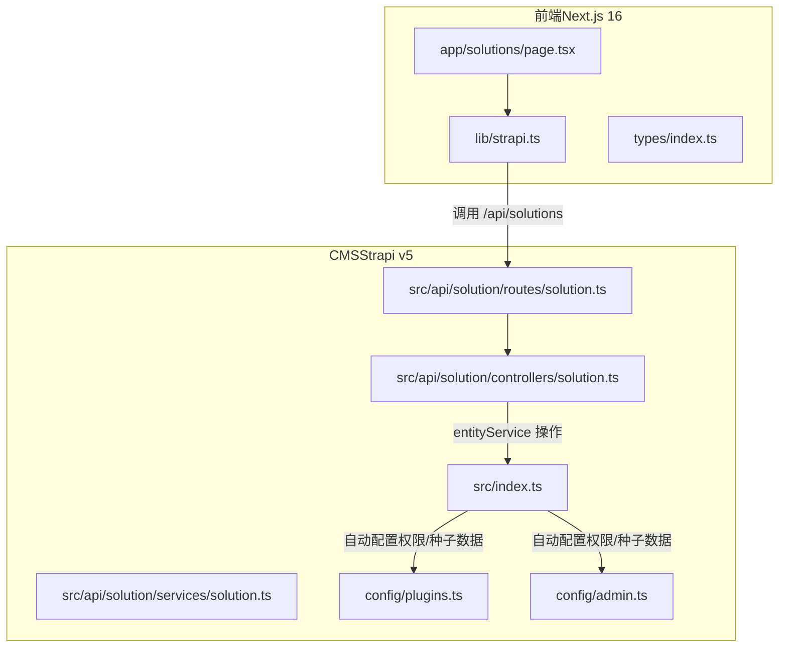
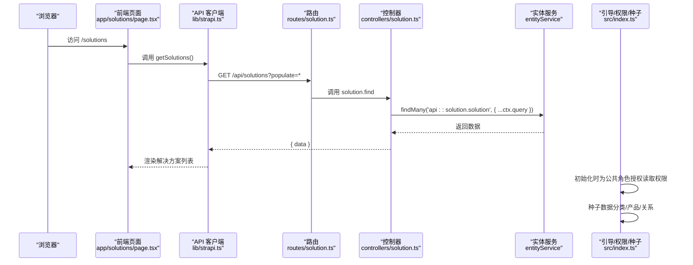
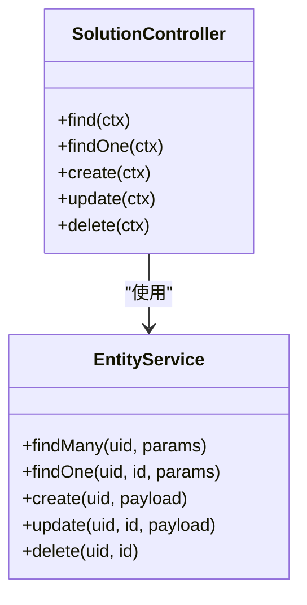
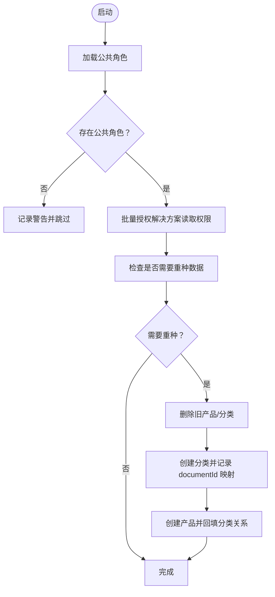
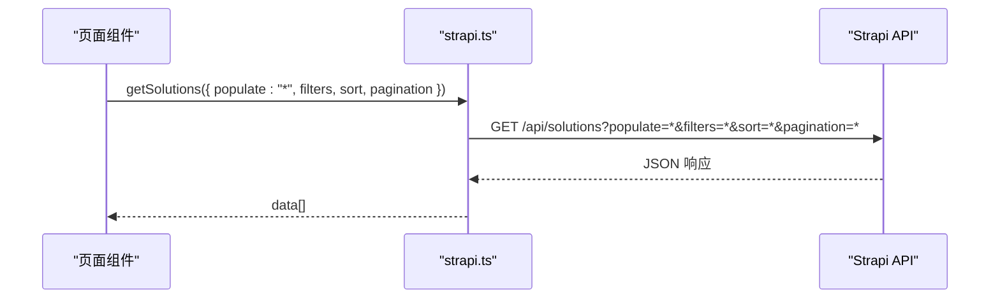
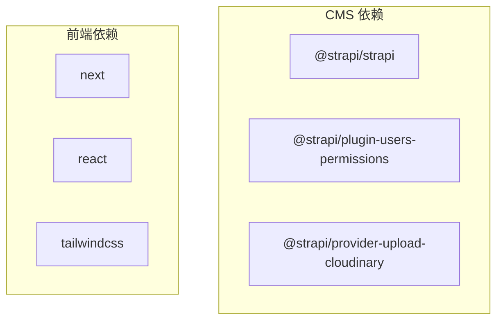

# 解决方案控制器

<cite>
**本文引用的文件**
- [cms/src/api/solution/controllers/solution.ts](file://cms/src/api/solution/controllers/solution.ts)
- [cms/src/api/solution/routes/solution.ts](file://cms/src/api/solution/routes/solution.ts)
- [cms/src/api/solution/services/solution.ts](file://cms/src/api/solution/services/solution.ts)
- [cms/src/index.ts](file://cms/src/index.ts)
- [cms/config/plugins.ts](file://cms/config/plugins.ts)
- [cms/config/admin.ts](file://cms/config/admin.ts)
- [frontend/src/app/solutions/page.tsx](file://frontend/src/app/solutions/page.tsx)
- [frontend/src/lib/strapi.ts](file://frontend/src/lib/strapi.ts)
- [frontend/src/types/index.ts](file://frontend/src/types/index.ts)
- [cms/package.json](file://cms/package.json)
- [frontend/package.json](file://frontend/package.json)
</cite>

## 目录
1. [简介](#简介)
2. [项目结构](#项目结构)
3. [核心组件](#核心组件)
4. [架构总览](#架构总览)
5. [详细组件分析](#详细组件分析)
6. [依赖分析](#依赖分析)
7. [性能考虑](#性能考虑)
8. [故障排查指南](#故障排查指南)
9. [结论](#结论)
10. [附录](#附录)

## 简介
本文件面向“解决方案控制器”的企业级实现，围绕内容管理、案例研究展示与应用领域分类展开，系统性阐述以下主题：
- 结构化数据处理：如何在 Strapi v5 中通过实体服务进行增删改查与关系管理
- 多媒体内容管理：基于 Cloudinary 的上传与访问策略
- 相关产品关联：通过文档 ID 关联产品与解决方案
- 查询优化与分页：前端 API 客户端对 populate、filters、sort、pagination 的统一封装
- 推荐与个性化：前端页面中针对行业场景的静态化解决方案展示
- 控制器与内容服务协作：路由到控制器再到实体服务的调用链
- 权限管理与版本控制：公共角色权限配置与数据库种子脚本
- 扩展指南与多语言支持：可扩展点与国际化建议
- 实际代码示例与最佳实践：帮助开发者快速构建专业级解决方案展示系统

## 项目结构
该仓库采用前后端分离架构：
- CMS（Strapi v5）：提供内容模型、API 路由、权限与种子数据
- 前端（Next.js 16）：消费 CMS 数据，渲染解决方案页面与其它业务页面

图表来源
- [cms/src/api/solution/controllers/solution.ts:1-40](file://cms/src/api/solution/controllers/solution.ts#L1-L40)
- [cms/src/api/solution/routes/solution.ts:1-35](file://cms/src/api/solution/routes/solution.ts#L1-L35)
- [cms/src/api/solution/services/solution.ts:1-2](file://cms/src/api/solution/services/solution.ts#L1-L2)
- [cms/src/index.ts:161-217](file://cms/src/index.ts#L161-L217)
- [cms/config/plugins.ts:1-19](file://cms/config/plugins.ts#L1-L19)
- [cms/config/admin.ts:1-21](file://cms/config/admin.ts#L1-L21)
- [frontend/src/app/solutions/page.tsx:1-274](file://frontend/src/app/solutions/page.tsx#L1-L274)
- [frontend/src/lib/strapi.ts:51-119](file://frontend/src/lib/strapi.ts#L51-L119)

章节来源
- [cms/src/api/solution/controllers/solution.ts:1-40](file://cms/src/api/solution/controllers/solution.ts#L1-L40)
- [cms/src/api/solution/routes/solution.ts:1-35](file://cms/src/api/solution/routes/solution.ts#L1-L35)
- [cms/src/api/solution/services/solution.ts:1-2](file://cms/src/api/solution/services/solution.ts#L1-L2)
- [cms/src/index.ts:161-217](file://cms/src/index.ts#L161-L217)
- [cms/config/plugins.ts:1-19](file://cms/config/plugins.ts#L1-L19)
- [cms/config/admin.ts:1-21](file://cms/config/admin.ts#L1-L21)
- [frontend/src/app/solutions/page.tsx:1-274](file://frontend/src/app/solutions/page.tsx#L1-L274)
- [frontend/src/lib/strapi.ts:51-119](file://frontend/src/lib/strapi.ts#L51-L119)

## 核心组件
- 解决方案控制器（Solution Controller）
  - 提供标准 CRUD：find、findOne、create、update、delete
  - 使用 Strapi 实体服务直接读写数据
- 解决方案路由（Solution Routes）
  - 定义 /solutions 与 /solutions/:id 的 GET/POST/PUT/DELETE
- 解决方案服务（Solution Services）
  - 当前为空实现，预留扩展点（如业务规则、事件钩子等）
- CMS 引导与权限（Bootstrap）
  - 自动为公共角色授予解决方案 API 的读取权限
  - 数据库种子：创建分类与产品并建立关系
- 前端 API 客户端（Strapi Client）
  - 统一封装 populate、filters、sort、pagination 参数
  - 支持 Bearer Token 认证与 Next.js revalidate 缓存策略
- 前端解决方案页面（Solutions Page）
  - 静态化展示四大行业解决方案（映射到后端内容模型）

章节来源
- [cms/src/api/solution/controllers/solution.ts:3-39](file://cms/src/api/solution/controllers/solution.ts#L3-L39)
- [cms/src/api/solution/routes/solution.ts:1-35](file://cms/src/api/solution/routes/solution.ts#L1-L35)
- [cms/src/api/solution/services/solution.ts:1-2](file://cms/src/api/solution/services/solution.ts#L1-L2)
- [cms/src/index.ts:161-217](file://cms/src/index.ts#L161-L217)
- [frontend/src/lib/strapi.ts:51-119](file://frontend/src/lib/strapi.ts#L51-L119)
- [frontend/src/app/solutions/page.tsx:10-96](file://frontend/src/app/solutions/page.tsx#L10-L96)

## 架构总览
下图展示了从浏览器到 CMS 的完整请求链路，以及权限与种子数据初始化流程。

图表来源
- [frontend/src/app/solutions/page.tsx:1-274](file://frontend/src/app/solutions/page.tsx#L1-L274)
- [frontend/src/lib/strapi.ts:276-288](file://frontend/src/lib/strapi.ts#L276-L288)
- [cms/src/api/solution/routes/solution.ts:1-35](file://cms/src/api/solution/routes/solution.ts#L1-L35)
- [cms/src/api/solution/controllers/solution.ts:4-9](file://cms/src/api/solution/controllers/solution.ts#L4-L9)
- [cms/src/index.ts:161-217](file://cms/src/index.ts#L161-L217)

## 详细组件分析

### 解决方案控制器（Solution Controller）
- 功能职责
  - find：返回解决方案集合，透传查询参数
  - findOne：按 ID 获取单条记录
  - create/update/delete：基于请求体进行写操作
- 设计要点
  - 与实体服务解耦，便于替换底层存储
  - 无业务逻辑，保持薄控制器原则
- 可扩展点
  - 在 service 层加入校验、审计、事件触发
  - 在 controller 层增加输入验证与错误包装

图表来源
- [cms/src/api/solution/controllers/solution.ts:3-39](file://cms/src/api/solution/controllers/solution.ts#L3-L39)

章节来源
- [cms/src/api/solution/controllers/solution.ts:3-39](file://cms/src/api/solution/controllers/solution.ts#L3-L39)

### 解决方案路由（Solution Routes）
- 路由定义
  - GET /solutions → solution.find
  - GET /solutions/:id → solution.findOne
  - POST /solutions → solution.create
  - PUT /solutions/:id → solution.update
  - DELETE /solutions/:id → solution.delete
- 策略与中间件
  - 当前未启用策略与中间件，公共角色已授权读取权限

章节来源
- [cms/src/api/solution/routes/solution.ts:1-35](file://cms/src/api/solution/routes/solution.ts#L1-L35)

### 解决方案服务（Solution Services）
- 现状
  - 空实现，预留扩展空间
- 建议扩展方向
  - 业务规则校验
  - 事件钩子（如 afterCreate/afterUpdate）
  - 与外部系统集成（如推荐引擎、搜索引擎索引）

章节来源
- [cms/src/api/solution/services/solution.ts:1-2](file://cms/src/api/solution/services/solution.ts#L1-L2)

### CMS 引导与权限（Bootstrap）
- 公共角色权限
  - 自动为公共角色授予解决方案的 find/findOne 权限
  - 允许公开提交咨询（inquiry.create）
- 数据库种子
  - 若检测到缺失或孤儿数据，重新导入分类与产品
  - 使用文档 ID 建立产品与分类的关系
- 版本与兼容
  - 针对 Strapi v5 的关系语法与文档 API 进行适配

图表来源
- [cms/src/index.ts:161-217](file://cms/src/index.ts#L161-L217)
- [cms/src/index.ts:219-315](file://cms/src/index.ts#L219-L315)

章节来源
- [cms/src/index.ts:161-217](file://cms/src/index.ts#L161-L217)
- [cms/src/index.ts:219-315](file://cms/src/index.ts#L219-L315)

### 前端 API 客户端（Strapi Client）
- 统一参数处理
  - populate：支持字符串或数组
  - filters：递归构建嵌套过滤条件（如 relation.slug）
  - sort：支持数组与字符串
  - pagination：page/pageSize
- 认证与缓存
  - 可选 Bearer Token
  - Next.js revalidate 缓存策略
- 解决方案接口
  - getSolutions/getSolutionBySlug：基于 populate=* 获取完整关系数据

图表来源
- [frontend/src/lib/strapi.ts:51-119](file://frontend/src/lib/strapi.ts#L51-L119)
- [frontend/src/lib/strapi.ts:276-288](file://frontend/src/lib/strapi.ts#L276-L288)

章节来源
- [frontend/src/lib/strapi.ts:51-119](file://frontend/src/lib/strapi.ts#L51-L119)
- [frontend/src/lib/strapi.ts:276-288](file://frontend/src/lib/strapi.ts#L276-L288)

### 前端解决方案页面（Solutions Page）
- 内容结构
  - 四大行业解决方案：航测/农业喷洒/工业巡检/重载运输
  - 每个方案包含：图标、标题、描述、痛点、解决思路、规格标签
- 交互与导航
  - 通过锚点滚动定位到各方案区块
  - 提供“定制报价”与“联系项目”的入口链接
- 与后端的衔接
  - 当前页面以静态数据渲染
  - 建议替换为调用前端 API 客户端获取后端内容模型数据

章节来源
- [frontend/src/app/solutions/page.tsx:10-96](file://frontend/src/app/solutions/page.tsx#L10-L96)

### 多媒体内容管理（Cloudinary）
- 配置位置
  - 上传提供程序为 Cloudinary
- 使用方式
  - 媒体资源通过 Strapi 后台上传，前端通过 getStrapiMedia 组合完整 URL
- 建议
  - 在内容模型中为解决方案添加 heroImage 字段
  - 前端通过 getStrapiMedia 处理图片 URL

章节来源
- [cms/config/plugins.ts:1-19](file://cms/config/plugins.ts#L1-L19)
- [frontend/src/lib/strapi.ts:11-23](file://frontend/src/lib/strapi.ts#L11-L23)

### 相关产品关联
- 类型定义
  - 解决方案模型包含 featuredProducts（产品 ID 数组）
  - 产品模型包含 applications（解决方案 ID 数组）
- 建议实现
  - 在控制器层提供“根据解决方案获取关联产品”的查询接口
  - 在前端通过 populate 关联字段渲染“推荐产品”模块

章节来源
- [frontend/src/types/index.ts:82-93](file://frontend/src/types/index.ts#L82-L93)
- [frontend/src/types/index.ts:23-43](file://frontend/src/types/index.ts#L23-L43)

### 查询优化与分页
- 前端客户端已内置
  - filters：支持嵌套关系过滤
  - sort/pagination：标准化参数传递
- 建议
  - 对高频查询开启数据库索引（如 slug、publishedAt）
  - 合理设置 pageSize，避免一次性返回过多数据

章节来源
- [frontend/src/lib/strapi.ts:68-96](file://frontend/src/lib/strapi.ts#L68-L96)

### 推荐算法与个性化展示
- 现状
  - 页面为静态数据展示
- 建议
  - 基于用户行为（浏览、收藏、询盘）构建简单协同过滤
  - 将推荐结果注入到解决方案详情页的“相关方案/产品”区域
  - 使用前端缓存与增量更新提升体验

[本节为概念性建议，不直接分析具体文件]

### 控制器与内容服务协作模式
- 路由 → 控制器 → 实体服务 → 数据库
- 通过 ctx.query 透传查询参数，确保控制器与服务层解耦

章节来源
- [cms/src/api/solution/routes/solution.ts:1-35](file://cms/src/api/solution/routes/solution.ts#L1-L35)
- [cms/src/api/solution/controllers/solution.ts:4-9](file://cms/src/api/solution/controllers/solution.ts#L4-L9)

### 权限管理与版本控制机制
- 权限
  - 启动时为公共角色授权解决方案读取权限
  - 允许公开提交咨询
- 版本控制
  - 种子脚本检测现有数据，必要时重建以保证一致性
  - 使用文档 ID 建立关系，适配 Strapi v5

章节来源
- [cms/src/index.ts:161-217](file://cms/src/index.ts#L161-L217)
- [cms/src/index.ts:219-315](file://cms/src/index.ts#L219-L315)

## 依赖分析
- 技术栈
  - CMS：Strapi v5、Users Permissions、Cloudinary 上传
  - 前端：Next.js 16、TypeScript、TailwindCSS
- 关键依赖
  - @strapi/strapi：核心框架
  - @strapi/plugin-users-permissions：权限插件
  - @strapi/provider-upload-cloudinary：云上传
  - next：前端运行时与构建工具

图表来源
- [cms/package.json:14-25](file://cms/package.json#L14-L25)
- [frontend/package.json:11-15](file://frontend/package.json#L11-L15)

章节来源
- [cms/package.json:14-25](file://cms/package.json#L14-L25)
- [frontend/package.json:11-15](file://frontend/package.json#L11-L15)

## 性能考虑
- API 查询
  - 合理使用 populate 与 filters，避免过度加载
  - 对高频字段建立数据库索引
- 前端缓存
  - 利用 Next.js revalidate 策略平衡新鲜度与性能
  - 对静态页面采用静态生成（SSG）或增量静态再生（ISR）
- 媒体优化
  - 使用 Cloudinary 的自适应压缩与格式转换
  - 懒加载与骨架屏提升首屏体验

[本节提供通用指导，不直接分析具体文件]

## 故障排查指南
- 无法访问解决方案 API
  - 检查公共角色是否已授权解决方案读取权限
  - 确认路由已注册且未被策略拦截
- 数据不一致或关系丢失
  - 触发种子脚本重建分类与产品关系
  - 确认使用文档 ID 建立关系
- 媒体资源 404
  - 检查 Cloudinary 配置与上传状态
  - 使用 getStrapiMedia 组合完整 URL
- 前端报错
  - 检查 NEXT_PUBLIC_STRAPI_URL 与 API Token
  - 查看 Next.js revalidate 是否导致缓存问题

章节来源
- [cms/src/index.ts:161-217](file://cms/src/index.ts#L161-L217)
- [cms/src/index.ts:219-315](file://cms/src/index.ts#L219-L315)
- [cms/config/plugins.ts:1-19](file://cms/config/plugins.ts#L1-L19)
- [frontend/src/lib/strapi.ts:8-9](file://frontend/src/lib/strapi.ts#L8-L9)

## 结论
本解决方案控制器以最小实现覆盖了企业级内容管理的核心需求：结构化数据的增删改查、权限与种子数据的自动化、以及前端的统一 API 客户端封装。在此基础上，建议进一步完善：
- 在服务层引入业务规则与事件钩子
- 扩展推荐与个性化能力
- 增强多媒体与 SEO 字段的标准化
- 建立完善的测试与监控体系

[本节为总结性内容，不直接分析具体文件]

## 附录

### 扩展指南
- 新增解决方案字段
  - 在内容模型中添加所需字段（如 heroImage、caseStudy、seo）
  - 更新前端类型定义与页面渲染逻辑
- 关联推荐
  - 在控制器新增“根据解决方案获取产品”接口
  - 在前端通过 populate 关联字段渲染推荐模块
- 多语言支持
  - 使用 Strapi 多语言插件
  - 前端按语言切换渲染对应内容
- 版本控制与迁移
  - 使用 Strapi 的内容类型迁移机制
  - 通过种子脚本保障生产环境一致性

[本节为概念性建议，不直接分析具体文件]

### 代码示例路径
- 解决方案控制器实现：[cms/src/api/solution/controllers/solution.ts:3-39](file://cms/src/api/solution/controllers/solution.ts#L3-L39)
- 解决方案路由定义：[cms/src/api/solution/routes/solution.ts:1-35](file://cms/src/api/solution/routes/solution.ts#L1-L35)
- CMS 引导与权限配置：[cms/src/index.ts:161-217](file://cms/src/index.ts#L161-L217)
- 前端 API 客户端封装：[frontend/src/lib/strapi.ts:51-119](file://frontend/src/lib/strapi.ts#L51-L119)
- 前端解决方案页面：[frontend/src/app/solutions/page.tsx:10-96](file://frontend/src/app/solutions/page.tsx#L10-L96)
- 前端类型定义（含解决方案模型）：[frontend/src/types/index.ts:82-93](file://frontend/src/types/index.ts#L82-L93)