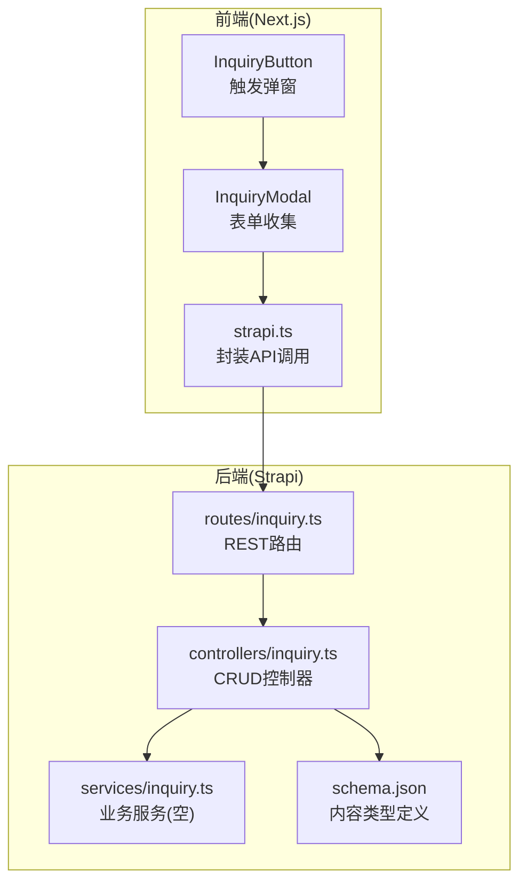
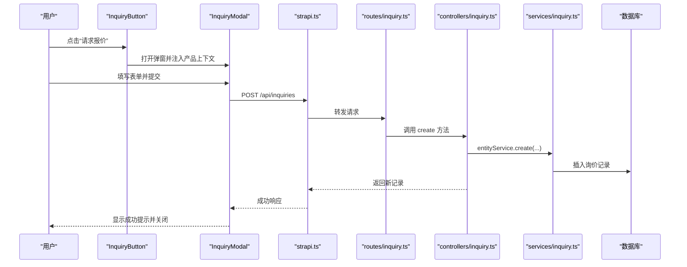
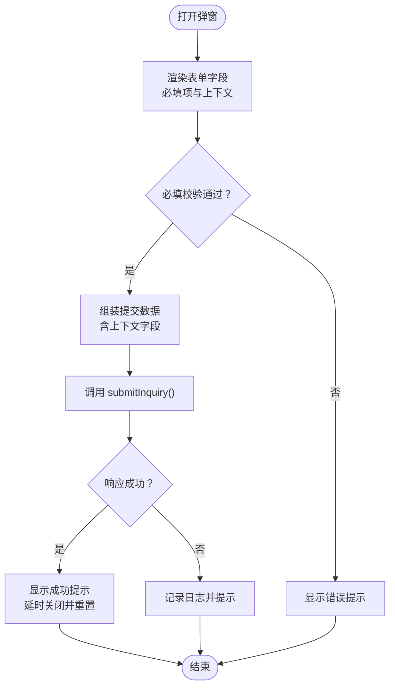
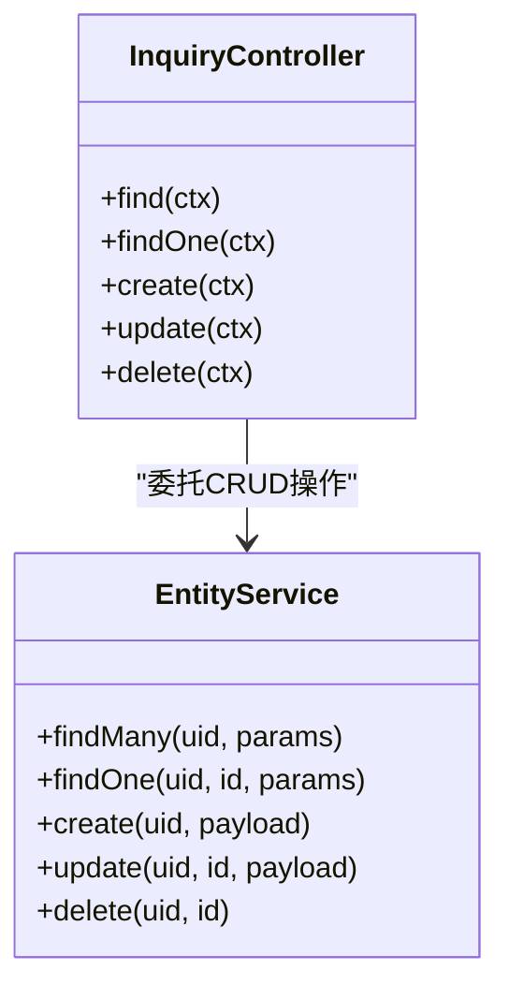
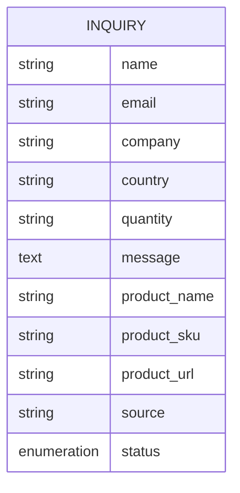
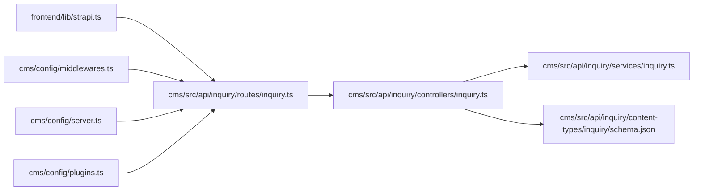

# 询价表单控制器

<cite>
**本文档引用的文件**
- [cms/src/api/inquiry/controllers/inquiry.ts](file://cms/src/api/inquiry/controllers/inquiry.ts)
- [cms/src/api/inquiry/services/inquiry.ts](file://cms/src/api/inquiry/services/inquiry.ts)
- [cms/src/api/inquiry/content-types/inquiry/schema.json](file://cms/src/api/inquiry/content-types/inquiry/schema.json)
- [cms/src/api/inquiry/routes/inquiry.ts](file://cms/src/api/inquiry/routes/inquiry.ts)
- [frontend/src/components/forms/InquiryModal.tsx](file://frontend/src/components/forms/InquiryModal.tsx)
- [frontend/src/components/forms/InquiryButton.tsx](file://frontend/src/components/forms/InquiryButton.tsx)
- [frontend/src/lib/strapi.ts](file://frontend/src/lib/strapi.ts)
- [cms/config/server.ts](file://cms/config/server.ts)
- [cms/config/middlewares.ts](file://cms/config/middlewares.ts)
- [cms/config/plugins.ts](file://cms/config/plugins.ts)
- [frontend/src/app/products/[category]/[slug]/page.tsx](file://frontend/src/app/products/[category]/[slug]/page.tsx)
- [frontend/src/app/contact/page.tsx](file://frontend/src/app/contact/page.tsx)
</cite>

## 目录
1. [简介](#简介)
2. [项目结构](#项目结构)
3. [核心组件](#核心组件)
4. [架构总览](#架构总览)
5. [详细组件分析](#详细组件分析)
6. [依赖关系分析](#依赖关系分析)
7. [性能考虑](#性能考虑)
8. [故障排除指南](#故障排除指南)
9. [结论](#结论)
10. [附录](#附录)

## 简介
本文件面向“询价表单控制器”的实现与使用，围绕以下目标展开：  
- 详述询价请求的接收、验证与处理流程（含用户信息收集与产品咨询管理）  
- 解释数据持久化与状态跟踪机制  
- 文档化数据验证规则、防垃圾邮件机制与数据安全保护  
- 说明控制器与邮件服务的集成方式、通知模板管理与自动化响应流程  
- 提供功能扩展指南（自定义字段、报表统计等）与用户体验优化建议  

当前仓库中，前端通过 Next.js 组件提交询价数据至 Strapi 后端；后端提供标准 CRUD 控制器与内容类型定义，但未内置邮件通知与状态流转的业务逻辑。因此，本文在现有实现基础上，给出可落地的扩展方案与最佳实践。

## 项目结构
该功能由前后端协作完成：  
- 前端：Next.js 页面与组件负责展示与收集用户输入，并调用 Strapi API 提交询价  
- 后端：Strapi 的 inquiry 内容类型与控制器提供数据模型与接口  
- 配置：服务器、中间件与插件配置确保运行时安全与跨域策略

图表来源
- [frontend/src/components/forms/InquiryButton.tsx:14-55](file://frontend/src/components/forms/InquiryButton.tsx#L14-L55)
- [frontend/src/components/forms/InquiryModal.tsx:15-370](file://frontend/src/components/forms/InquiryModal.tsx#L15-L370)
- [frontend/src/lib/strapi.ts:291-306](file://frontend/src/lib/strapi.ts#L291-L306)
- [cms/src/api/inquiry/routes/inquiry.ts:1-35](file://cms/src/api/inquiry/routes/inquiry.ts#L1-L35)
- [cms/src/api/inquiry/controllers/inquiry.ts:1-40](file://cms/src/api/inquiry/controllers/inquiry.ts#L1-L40)
- [cms/src/api/inquiry/services/inquiry.ts:1-2](file://cms/src/api/inquiry/services/inquiry.ts#L1-L2)
- [cms/src/api/inquiry/content-types/inquiry/schema.json:1-25](file://cms/src/api/inquiry/content-types/inquiry/schema.json#L1-L25)

章节来源
- [frontend/src/components/forms/InquiryButton.tsx:14-55](file://frontend/src/components/forms/InquiryButton.tsx#L14-L55)
- [frontend/src/components/forms/InquiryModal.tsx:15-370](file://frontend/src/components/forms/InquiryModal.tsx#L15-L370)
- [frontend/src/lib/strapi.ts:291-306](file://frontend/src/lib/strapi.ts#L291-L306)
- [cms/src/api/inquiry/routes/inquiry.ts:1-35](file://cms/src/api/inquiry/routes/inquiry.ts#L1-L35)
- [cms/src/api/inquiry/controllers/inquiry.ts:1-40](file://cms/src/api/inquiry/controllers/inquiry.ts#L1-L40)
- [cms/src/api/inquiry/services/inquiry.ts:1-2](file://cms/src/api/inquiry/services/inquiry.ts#L1-L2)
- [cms/src/api/inquiry/content-types/inquiry/schema.json:1-25](file://cms/src/api/inquiry/content-types/inquiry/schema.json#L1-L25)

## 核心组件
- 前端按钮组件：用于唤起询价弹窗，传递产品上下文信息  
- 前端弹窗表单：收集姓名、邮箱、公司、国家、数量、消息、隐私协议勾选等字段，并附加产品名称、SKU、URL、来源页等上下文  
- Strapi API 客户端：封装 POST /api/inquiries 请求，支持鉴权头  
- Strapi 路由：暴露 GET/POST/PUT/DELETE 接口  
- Strapi 控制器：基于 entityService 执行 CRUD 操作  
- 内容类型 schema：定义必填字段、枚举状态与扩展字段  
- 服务层：当前为空，可用于扩展业务逻辑（如邮件通知、状态机）

章节来源
- [frontend/src/components/forms/InquiryButton.tsx:14-55](file://frontend/src/components/forms/InquiryButton.tsx#L14-L55)
- [frontend/src/components/forms/InquiryModal.tsx:46-95](file://frontend/src/components/forms/InquiryModal.tsx#L46-L95)
- [frontend/src/lib/strapi.ts:291-306](file://frontend/src/lib/strapi.ts#L291-L306)
- [cms/src/api/inquiry/routes/inquiry.ts:1-35](file://cms/src/api/inquiry/routes/inquiry.ts#L1-L35)
- [cms/src/api/inquiry/controllers/inquiry.ts:19-38](file://cms/src/api/inquiry/controllers/inquiry.ts#L19-L38)
- [cms/src/api/inquiry/content-types/inquiry/schema.json:12-22](file://cms/src/api/inquiry/content-types/inquiry/schema.json#L12-L22)
- [cms/src/api/inquiry/services/inquiry.ts:1-2](file://cms/src/api/inquiry/services/inquiry.ts#L1-L2)

## 架构总览
下图展示了从用户点击到数据入库的整体流程，以及可扩展的邮件通知与状态跟踪位置：

图表来源
- [frontend/src/components/forms/InquiryButton.tsx:14-55](file://frontend/src/components/forms/InquiryButton.tsx#L14-L55)
- [frontend/src/components/forms/InquiryModal.tsx:46-95](file://frontend/src/components/forms/InquiryModal.tsx#L46-L95)
- [frontend/src/lib/strapi.ts:291-306](file://frontend/src/lib/strapi.ts#L291-L306)
- [cms/src/api/inquiry/routes/inquiry.ts:16-20](file://cms/src/api/inquiry/routes/inquiry.ts#L16-L20)
- [cms/src/api/inquiry/controllers/inquiry.ts:19-24](file://cms/src/api/inquiry/controllers/inquiry.ts#L19-L24)
- [cms/src/api/inquiry/services/inquiry.ts:1-2](file://cms/src/api/inquiry/services/inquiry.ts#L1-L2)

## 详细组件分析

### 前端组件：InquiryButton 与 InquiryModal
- 功能职责
  - InquiryButton：作为入口组件，负责打开弹窗并传入产品名称、SKU、URL 等上下文  
  - InquiryModal：负责表单渲染、字段校验（必填、隐私协议）、提交处理、成功反馈与自动关闭  
- 数据流
  - 表单字段映射到后端 schema 中的 name、email、company、country、quantity、message 等  
  - 附加字段：productName、productSku、productUrl、source（来源页 URL）  
- 用户体验
  - 提交中显示加载态、成功后短暂提示并自动重置与关闭  
  - 隐私协议必选项，提升合规性  

图表来源
- [frontend/src/components/forms/InquiryModal.tsx:46-95](file://frontend/src/components/forms/InquiryModal.tsx#L46-L95)
- [frontend/src/lib/strapi.ts:291-306](file://frontend/src/lib/strapi.ts#L291-L306)

章节来源
- [frontend/src/components/forms/InquiryButton.tsx:14-55](file://frontend/src/components/forms/InquiryButton.tsx#L14-L55)
- [frontend/src/components/forms/InquiryModal.tsx:15-370](file://frontend/src/components/forms/InquiryModal.tsx#L15-L370)
- [frontend/src/lib/strapi.ts:291-306](file://frontend/src/lib/strapi.ts#L291-L306)

### 后端控制器：inquiry 控制器
- 能力范围
  - 提供 find/findOne/create/update/delete 四个标准方法，均委托给 entityService  
  - 当前未实现业务扩展（如邮件通知、状态机），可通过服务层或中间件增强  
- 数据持久化
  - create/update 使用 ctx.request.body.data 将前端提交的数据写入数据库  
  - 返回值包含 data 字段，便于前端消费  

图表来源
- [cms/src/api/inquiry/controllers/inquiry.ts:3-38](file://cms/src/api/inquiry/controllers/inquiry.ts#L3-L38)

章节来源
- [cms/src/api/inquiry/controllers/inquiry.ts:1-40](file://cms/src/api/inquiry/controllers/inquiry.ts#L1-L40)

### 内容类型与数据模型：inquiry schema
- 关键字段
  - 必填：name、email、message  
  - 可选：company、country、quantity  
  - 产品上下文：product_name、product_sku、product_url  
  - 来源：source  
  - 状态：status（枚举 new/contacted/quoted/closed，默认 new）  
- 设计意图
  - 支持产品级询价追踪与状态闭环  
  - 便于后续报表统计与自动化流程  

图表来源
- [cms/src/api/inquiry/content-types/inquiry/schema.json:12-22](file://cms/src/api/inquiry/content-types/inquiry/schema.json#L12-L22)

章节来源
- [cms/src/api/inquiry/content-types/inquiry/schema.json:1-25](file://cms/src/api/inquiry/content-types/inquiry/schema.json#L1-L25)

### 路由与中间件：inquiry 路由与全局中间件
- 路由
  - 暴露 /api/inquiries 的 GET/POST/PUT/DELETE 接口，无策略与中间件限制  
- 中间件
  - 安全中间件启用 CSP 与连接源限制  
  - CORS 允许任意来源以适配预览环境  
  - 身份认证与会话中间件已启用，便于后续接入权限控制  

章节来源
- [cms/src/api/inquiry/routes/inquiry.ts:1-35](file://cms/src/api/inquiry/routes/inquiry.ts#L1-L35)
- [cms/config/middlewares.ts:1-32](file://cms/config/middlewares.ts#L1-L32)

### 邮件通知与状态跟踪扩展设计
当前实现未包含邮件通知与状态机逻辑。以下为推荐扩展方案：  
- 在服务层（services/inquiry.ts）增加钩子或中间件，监听 create/update 事件  
- 新增邮件服务集成点：当 status 从 new 变更为 contacted/quoted 时触发模板渲染与发送  
- 通知模板管理：采用 Strapi 的内容类型或外部模板引擎（如 Handlebars/MJML）管理多语言模板  
- 自动化响应：根据状态变化自动向用户发送确认邮件（如收到询价确认、报价生成等）  
- 防垃圾邮件：结合 IP 限流、reCAPTCHA、关键词过滤与白名单策略  
- 数据安全：对敏感字段进行脱敏存储与传输加密，遵循最小权限原则  

（本节为概念性扩展说明，不直接分析具体文件）

## 依赖关系分析
- 前端依赖
  - strapi.ts 封装了 /api/inquiries 的 POST 请求，支持鉴权头  
  - 页面组件通过 InquiryButton/InquiryModal 注入产品上下文  
- 后端依赖
  - routes/inquiry.ts 将请求映射到 controllers/inquiry.ts  
  - controllers/inquiry.ts 委托 entityService 进行数据持久化  
  - schema.json 定义字段约束与默认值  
- 运行时依赖
  - middlewares.ts 提供安全与 CORS 配置  
  - server.ts 提供主机、端口与应用密钥配置  
  - plugins.ts 提供媒体上传能力（与询价表单无直接关系，但影响整体运行环境）

图表来源
- [frontend/src/lib/strapi.ts:291-306](file://frontend/src/lib/strapi.ts#L291-L306)
- [cms/src/api/inquiry/routes/inquiry.ts:1-35](file://cms/src/api/inquiry/routes/inquiry.ts#L1-L35)
- [cms/src/api/inquiry/controllers/inquiry.ts:1-40](file://cms/src/api/inquiry/controllers/inquiry.ts#L1-L40)
- [cms/src/api/inquiry/services/inquiry.ts:1-2](file://cms/src/api/inquiry/services/inquiry.ts#L1-L2)
- [cms/src/api/inquiry/content-types/inquiry/schema.json:1-25](file://cms/src/api/inquiry/content-types/inquiry/schema.json#L1-L25)
- [cms/config/middlewares.ts:1-32](file://cms/config/middlewares.ts#L1-L32)
- [cms/config/server.ts:1-11](file://cms/config/server.ts#L1-L11)
- [cms/config/plugins.ts:1-19](file://cms/config/plugins.ts#L1-L19)

章节来源
- [frontend/src/lib/strapi.ts:291-306](file://frontend/src/lib/strapi.ts#L291-L306)
- [cms/src/api/inquiry/routes/inquiry.ts:1-35](file://cms/src/api/inquiry/routes/inquiry.ts#L1-L35)
- [cms/src/api/inquiry/controllers/inquiry.ts:1-40](file://cms/src/api/inquiry/controllers/inquiry.ts#L1-L40)
- [cms/src/api/inquiry/services/inquiry.ts:1-2](file://cms/src/api/inquiry/services/inquiry.ts#L1-L2)
- [cms/src/api/inquiry/content-types/inquiry/schema.json:1-25](file://cms/src/api/inquiry/content-types/inquiry/schema.json#L1-L25)
- [cms/config/middlewares.ts:1-32](file://cms/config/middlewares.ts#L1-L32)
- [cms/config/server.ts:1-11](file://cms/config/server.ts#L1-L11)
- [cms/config/plugins.ts:1-19](file://cms/config/plugins.ts#L1-L19)

## 性能考虑
- 前端
  - 表单提交采用异步请求，避免阻塞 UI  
  - 使用加载态与成功提示减少用户等待焦虑  
- 后端
  - entityService 的 CRUD 操作具备良好性能基线  
  - 建议在高并发场景下引入缓存与限流策略  
- 网络与安全
  - CORS 已允许任意来源，生产环境建议限定可信域名  
  - CSP 已启用，注意 connect-src 仅允许 https，避免混合内容问题  

（本节为通用指导，不直接分析具体文件）

## 故障排除指南
- 前端提交失败
  - 检查 STRAPI_URL 与 API Token 配置是否正确  
  - 查看浏览器网络面板与控制台错误  
  - 确认后端路由是否可达且未被中间件拦截  
- 后端返回异常
  - 核对请求体格式是否符合 { data: {...} } 结构  
  - 检查必填字段是否缺失（name/email/message）  
  - 查看 Strapi 日志与错误中间件输出  
- 邮件通知未送达
  - 若已扩展邮件服务，请检查服务可用性与模板渲染结果  
  - 核对收件人邮箱格式与状态变更条件  

章节来源
- [frontend/src/lib/strapi.ts:291-306](file://frontend/src/lib/strapi.ts#L291-L306)
- [cms/src/api/inquiry/controllers/inquiry.ts:19-24](file://cms/src/api/inquiry/controllers/inquiry.ts#L19-L24)
- [cms/config/middlewares.ts:1-32](file://cms/config/middlewares.ts#L1-L32)

## 结论
- 现有实现提供了完整的前端表单与后端接口，满足基础询价数据收集与持久化需求  
- 通过在服务层或中间件中扩展业务逻辑，可无缝集成邮件通知、状态跟踪与自动化响应  
- 建议优先完善数据验证、防垃圾邮件与数据安全措施，再逐步引入报表统计与高级自动化功能  

（本节为总结性内容，不直接分析具体文件）

## 附录

### 数据验证规则与安全保护
- 前端
  - 必填字段与隐私协议勾选为强制项  
  - 输入类型使用 email/text/textarea/select 等，提升输入约束  
- 后端
  - schema.json 定义必填与类型约束  
  - 建议在控制器层增加额外校验（长度、格式、黑名单词）  
- 安全
  - 使用中间件限制连接源与图片/媒体资源来源  
  - 生产环境收紧 CORS 策略，启用 HTTPS 与安全头  

章节来源
- [frontend/src/components/forms/InquiryModal.tsx:176-318](file://frontend/src/components/forms/InquiryModal.tsx#L176-L318)
- [cms/src/api/inquiry/content-types/inquiry/schema.json:12-22](file://cms/src/api/inquiry/content-types/inquiry/schema.json#L12-L22)
- [cms/config/middlewares.ts:7-24](file://cms/config/middlewares.ts#L7-L24)

### 防垃圾邮件机制建议
- IP 限流：限制同一 IP 的请求频率  
- 人机验证：引入 reCAPTCHA v3/v2  
- 关键词过滤：对 message 字段进行敏感词检测  
- 白名单：对已知可信来源放行  
- CAPTCHA：对高风险来源要求二次验证  

（本节为通用建议，不直接分析具体文件）

### 报表统计与状态跟踪实现指引
- 状态机
  - new → contacted → quoted → closed  
  - 每次状态变更记录时间戳与操作者  
- 报表
  - 按产品维度统计询价量与转化率  
  - 按来源页统计流量质量  
  - 按国家/地区统计区域分布  
- 自动化
  - 状态变更触发邮件模板发送  
  - 超时未跟进自动升级或提醒  

（本节为通用建议，不直接分析具体文件）

### 实际使用示例路径
- 在产品详情页集成询价入口
  - [frontend/src/app/products/[category]/[slug]/page.tsx](file://frontend/src/app/products/[category]/[slug]/page.tsx#L342-L347)
- 在联系页提供替代联系方式
  - [frontend/src/app/contact/page.tsx:139-143](file://frontend/src/app/contact/page.tsx#L139-L143)

章节来源
- [frontend/src/app/products/[category]/[slug]/page.tsx](file://frontend/src/app/products/[category]/[slug]/page.tsx#L342-L347)
- [frontend/src/app/contact/page.tsx:139-143](file://frontend/src/app/contact/page.tsx#L139-L143)