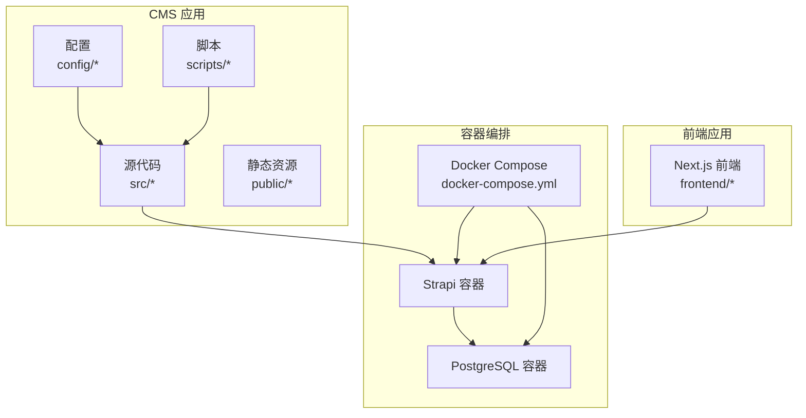
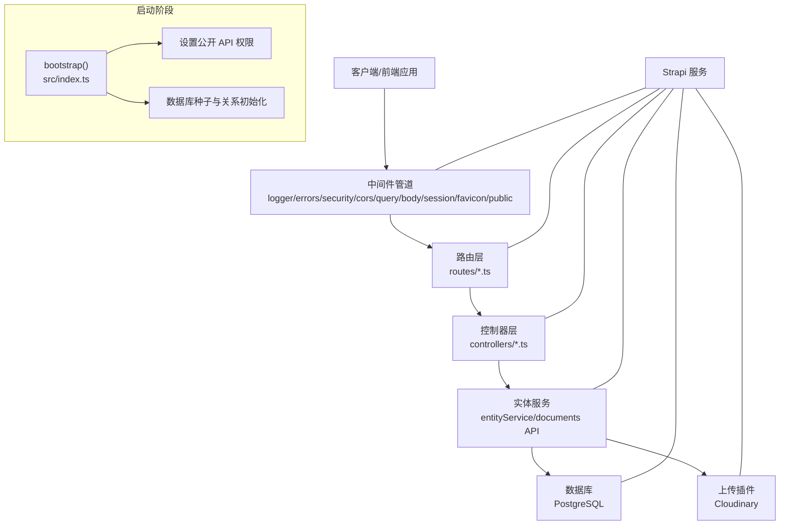
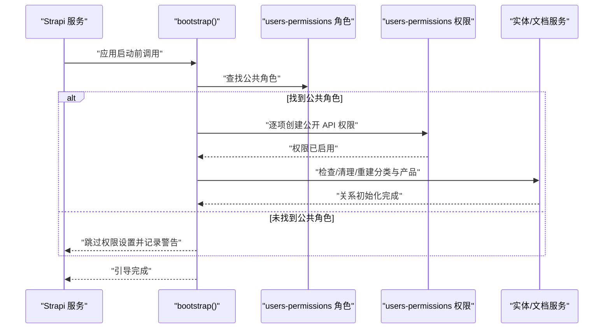
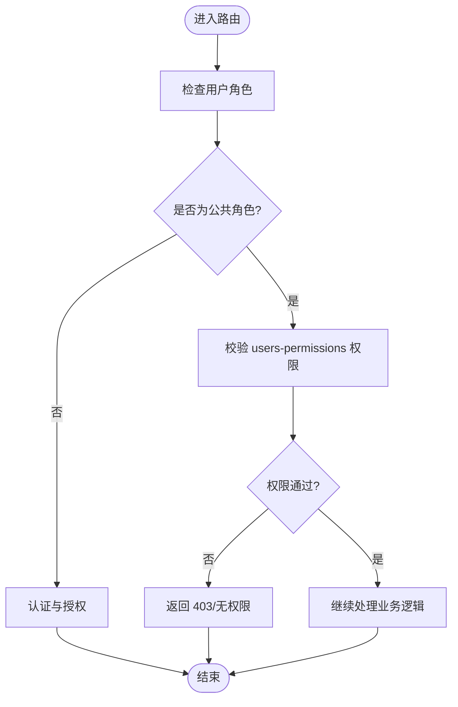
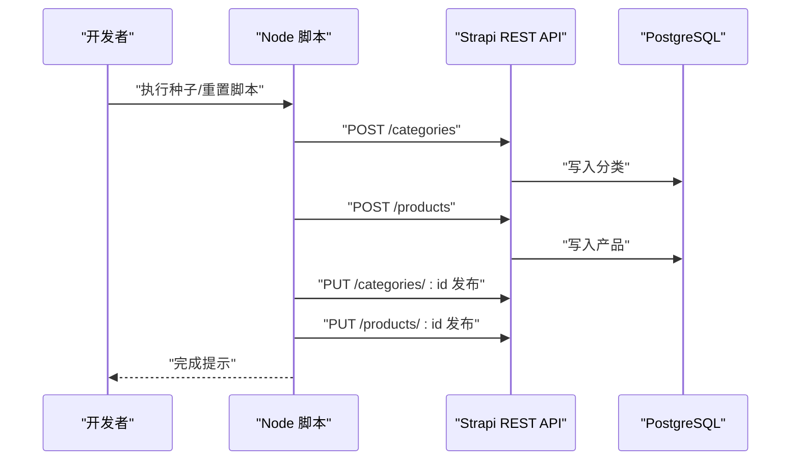
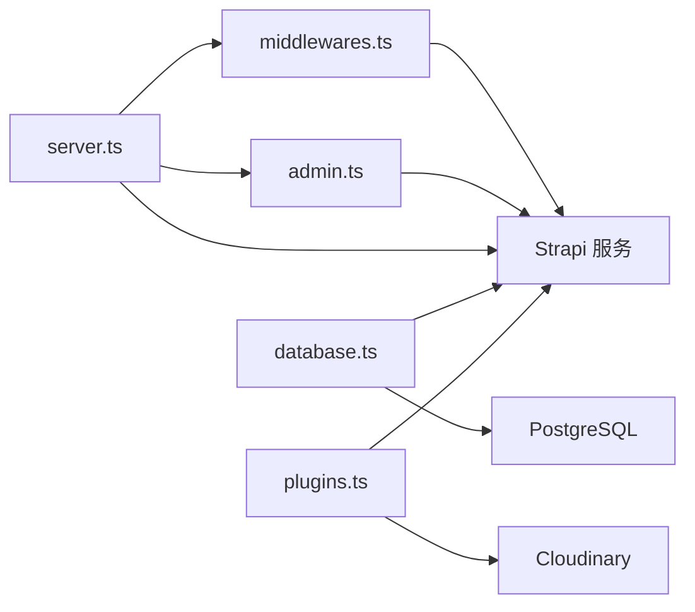
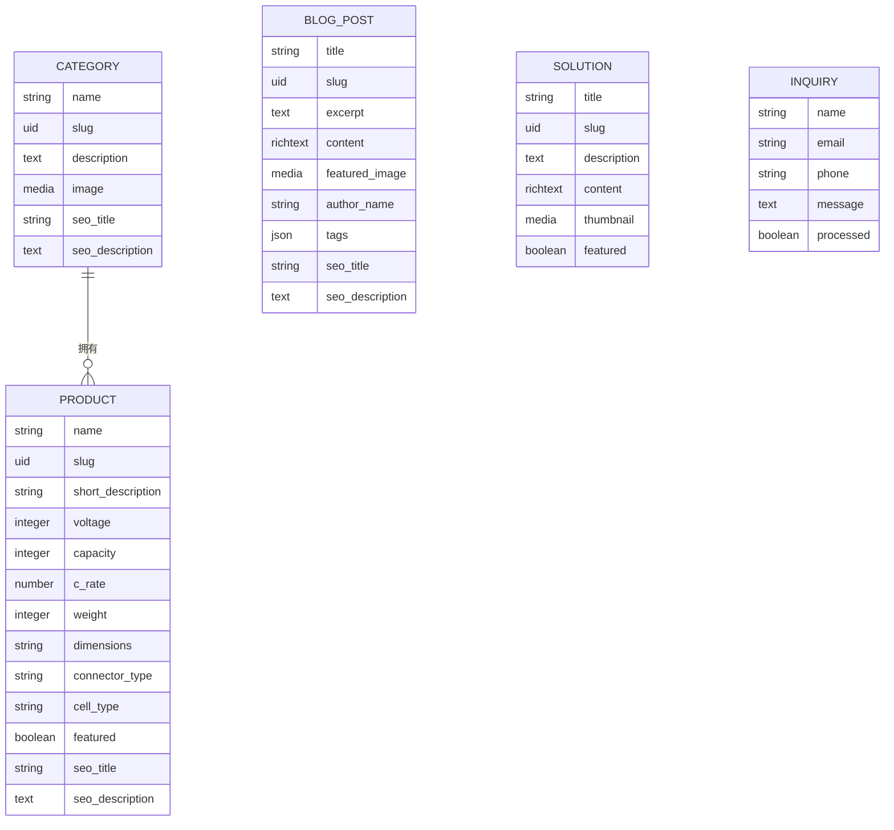
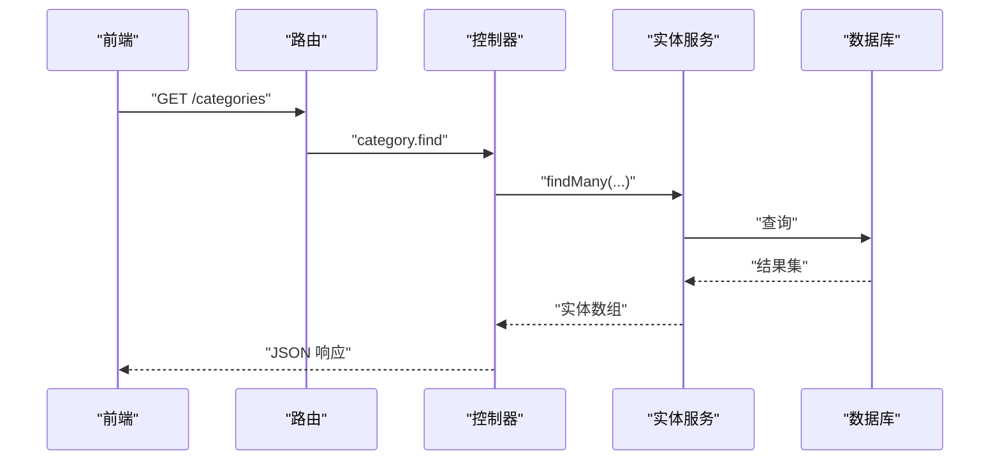
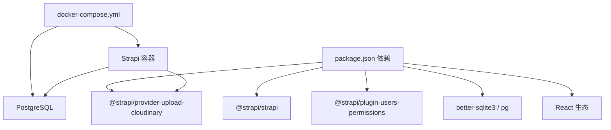

# CMS 架构设计

<cite>
**本文引用的文件**
- [package.json](file://cms/package.json)
- [docker-compose.yml](file://cms/docker-compose.yml)
- [src/index.ts](file://cms/src/index.ts)
- [config/server.ts](file://cms/config/server.ts)
- [config/database.ts](file://cms/config/database.ts)
- [config/plugins.ts](file://cms/config/plugins.ts)
- [config/middlewares.ts](file://cms/config/middlewares.ts)
- [config/admin.ts](file://cms/config/admin.ts)
- [scripts/seed-data.js](file://cms/scripts/seed-data.js)
- [scripts/reseed-data.js](file://cms/scripts/reseed-data.js)
- [src/api/category/content-types/category/schema.json](file://cms/src/api/category/content-types/category/schema.json)
- [src/api/blog-post/content-types/blog-post/schema.json](file://cms/src/api/blog-post/content-types/blog-post/schema.json)
- [src/api/category/controllers/category.ts](file://cms/src/api/category/controllers/category.ts)
- [src/api/product/controllers/product.ts](file://cms/src/api/product/controllers/product.ts)
- [src/api/category/routes/category.ts](file://cms/src/api/category/routes/category.ts)
- [src/api/product/routes/product.ts](file://cms/src/api/product/routes/product.ts)
- [src/api/blog-post/routes/blog-post.ts](file://cms/src/api/blog-post/routes/blog-post.ts)
- [src/api/solution/routes/solution.ts](file://cms/src/api/solution/routes/solution.ts)
- [src/api/inquiry/routes/inquiry.ts](file://cms/src/api/inquiry/routes/inquiry.ts)
</cite>

## 目录
1. [引言](#引言)
2. [项目结构](#项目结构)
3. [核心组件](#核心组件)
4. [架构总览](#架构总览)
5. [详细组件分析](#详细组件分析)
6. [依赖分析](#依赖分析)
7. [性能考虑](#性能考虑)
8. [故障排查指南](#故障排查指南)
9. [结论](#结论)
10. [附录](#附录)

## 引言
本文件面向 Battivus Strapi CMS 的架构设计与实现，系统性阐述整体架构模式、核心组件职责、系统边界与控制流；重点解析 Bootstrap 流程、权限管理机制、数据库初始化与自动化种子脚本；梳理配置文件之间的协作关系（服务器、数据库、中间件、插件）；并结合 Strapi v5 的新特性（文档 API、关系管理、数据验证）给出技术考量、性能优化与可扩展性建议。文中提供多幅架构图与时序图，帮助开发者快速把握系统设计思路。

## 项目结构
CMS 采用 Strapi v5 的标准目录组织方式，核心位于 cms 子目录，包含配置、API 模块、上传与脚本等资源。前端位于 frontend 子目录，通过 Next.js 提供网站展示与交互。Docker Compose 将数据库与 CMS 容器编排，便于本地开发与部署。

**图表来源**
- [docker-compose.yml:1-67](file://cms/docker-compose.yml#L1-L67)
- [package.json:1-36](file://cms/package.json#L1-L36)

**章节来源**
- [package.json:1-36](file://cms/package.json#L1-L36)
- [docker-compose.yml:1-67](file://cms/docker-compose.yml#L1-L67)

## 核心组件
- 启动与引导模块：在应用启动前执行权限配置与数据库种子逻辑，确保公开 API 可用且初始数据就绪。
- 配置系统：集中管理服务器、数据库、中间件、插件与后台安全参数。
- API 层：按领域划分的 Content Type 与 CRUD 控制器、路由定义。
- 数据模型：基于 Strapi v5 文档 API 的关系与校验规则。
- 自动化脚本：提供一次性种子与重置种子能力，支持开发与演示环境。

**章节来源**
- [src/index.ts:149-217](file://cms/src/index.ts#L149-L217)
- [config/server.ts:1-11](file://cms/config/server.ts#L1-L11)
- [config/database.ts:1-15](file://cms/config/database.ts#L1-L15)
- [config/plugins.ts:1-19](file://cms/config/plugins.ts#L1-L19)
- [config/middlewares.ts:1-32](file://cms/config/middlewares.ts#L1-L32)
- [config/admin.ts:1-21](file://cms/config/admin.ts#L1-L21)

## 架构总览
下图展示了从请求到数据库与上传服务的整体交互路径，以及 Bootstrap 在启动阶段对权限与数据的初始化作用。

**图表来源**
- [config/middlewares.ts:1-32](file://cms/config/middlewares.ts#L1-L32)
- [src/api/category/routes/category.ts:1-50](file://cms/src/api/category/routes/category.ts#L1-L50)
- [src/api/product/routes/product.ts:1-35](file://cms/src/api/product/routes/product.ts#L1-L35)
- [src/api/blog-post/routes/blog-post.ts:1-35](file://cms/src/api/blog-post/routes/blog-post.ts#L1-L35)
- [src/api/solution/routes/solution.ts:1-35](file://cms/src/api/solution/routes/solution.ts#L1-L35)
- [src/api/inquiry/routes/inquiry.ts:1-35](file://cms/src/api/inquiry/routes/inquiry.ts#L1-L35)
- [src/api/category/controllers/category.ts:1-40](file://cms/src/api/category/controllers/category.ts#L1-L40)
- [src/api/product/controllers/product.ts:1-40](file://cms/src/api/product/controllers/product.ts#L1-L40)
- [src/index.ts:161-216](file://cms/src/index.ts#L161-L216)
- [config/plugins.ts:1-19](file://cms/config/plugins.ts#L1-L19)
- [config/database.ts:1-15](file://cms/config/database.ts#L1-L15)

## 详细组件分析

### 启动与引导（Bootstrap）
- 公开角色权限配置：在应用启动前，读取“public”角色并批量启用公开 API 的读取与提交权限，确保前端可直接访问产品、分类、博客与解决方案列表，并允许访客提交询盘。
- 数据库种子与关系初始化：检查现有数据完整性，若发现缺失或孤儿关系，则删除旧数据并重新创建分类与产品，使用 Strapi v5 的文档 API 建立关系字段，保证数据一致性与可查询性。
- 日志与容错：对权限创建、实体删除、关系更新过程进行日志记录，并对异常进行捕获与告警，避免阻断启动流程。

**图表来源**
- [src/index.ts:161-216](file://cms/src/index.ts#L161-L216)
- [src/index.ts:219-314](file://cms/src/index.ts#L219-L314)

**章节来源**
- [src/index.ts:149-217](file://cms/src/index.ts#L149-L217)
- [src/index.ts:219-314](file://cms/src/index.ts#L219-L314)

### 权限管理机制
- 插件驱动：通过 users-permissions 插件实现基于角色的访问控制（RBAC），在 bootstrap 中为“public”角色授予最小必要权限集合。
- 策略与中间件：路由层默认不附加策略与中间件，权限由 users-permissions 统一管控；中间件层提供安全策略（CSP）、跨域（CORS）与查询处理等通用能力。
- 管理后台安全：管理员 JWT 密钥、API Token Salt、传输令牌 Salt 等参数集中配置，提升后台访问安全性。

**图表来源**
- [config/middlewares.ts:1-32](file://cms/config/middlewares.ts#L1-L32)
- [src/index.ts:172-210](file://cms/src/index.ts#L172-L210)

**章节来源**
- [src/index.ts:172-210](file://cms/src/index.ts#L172-L210)
- [config/middlewares.ts:1-32](file://cms/config/middlewares.ts#L1-L32)
- [config/admin.ts:1-21](file://cms/config/admin.ts#L1-L21)

### 数据库初始化与自动化种子
- 开发脚本：提供两类种子脚本，分别用于不同场景的数据填充与重置，支持通过 API 创建分类与产品，并发布为可公开访问。
- 关系建立：使用 Strapi v5 文档 API 对关系字段进行更新，确保产品与分类之间建立稳定关联。
- 重置流程：先删除现有产品与分类，再重建，保证前后端导航与数据一致。

**图表来源**
- [scripts/seed-data.js:364-397](file://cms/scripts/seed-data.js#L364-L397)
- [scripts/reseed-data.js:409-458](file://cms/scripts/reseed-data.js#L409-L458)

**章节来源**
- [scripts/seed-data.js:1-398](file://cms/scripts/seed-data.js#L1-L398)
- [scripts/reseed-data.js:1-461](file://cms/scripts/reseed-data.js#L1-L461)

### 配置文件体系与相互关系
- 服务器配置：主机地址、监听端口、应用密钥、Webhook 关系预加载开关。
- 数据库配置：PostgreSQL 客户端、连接参数（主机、端口、库名、用户名、密码、SSL）与调试开关。
- 中间件管道：统一的安全策略（CSP）、跨域配置、查询与请求体解析、会话与静态资源。
- 插件配置：上传插件 Cloudinary 的凭证与操作选项。
- 管理后台：管理员 JWT 密钥、API Token Salt、传输令牌 Salt 与功能开关。

**图表来源**
- [config/server.ts:1-11](file://cms/config/server.ts#L1-L11)
- [config/database.ts:1-15](file://cms/config/database.ts#L1-L15)
- [config/plugins.ts:1-19](file://cms/config/plugins.ts#L1-L19)
- [config/middlewares.ts:1-32](file://cms/config/middlewares.ts#L1-L32)
- [config/admin.ts:1-21](file://cms/config/admin.ts#L1-L21)

**章节来源**
- [config/server.ts:1-11](file://cms/config/server.ts#L1-L11)
- [config/database.ts:1-15](file://cms/config/database.ts#L1-L15)
- [config/plugins.ts:1-19](file://cms/config/plugins.ts#L1-L19)
- [config/middlewares.ts:1-32](file://cms/config/middlewares.ts#L1-L32)
- [config/admin.ts:1-21](file://cms/config/admin.ts#L1-L21)

### Strapi v5 新特性与实现要点
- 文档 API：在种子脚本中使用文档 API 更新关系字段，确保关系以 documentId 形式维护，提升查询与更新的稳定性。
- 关系管理：产品与分类之间为一对多关系，通过文档 API 写入关系字段，避免传统实体 ID 的复杂性。
- 数据验证：内容类型 schema 中声明必填字段、UID、富文本与媒体字段，配合 Strapi 的内置校验保障数据质量。
- Draft/Publish：内容类型开启草稿与发布开关，通过 PUT 请求设置 publishedAt 字段实现发布流程。

**图表来源**
- [src/api/category/content-types/category/schema.json:1-21](file://cms/src/api/category/content-types/category/schema.json#L1-L21)
- [src/api/blog-post/content-types/blog-post/schema.json:1-24](file://cms/src/api/blog-post/content-types/blog-post/schema.json#L1-L24)
- [src/index.ts:290-305](file://cms/src/index.ts#L290-L305)

**章节来源**
- [src/index.ts:290-305](file://cms/src/index.ts#L290-L305)
- [src/api/category/content-types/category/schema.json:1-21](file://cms/src/api/category/content-types/category/schema.json#L1-L21)
- [src/api/blog-post/content-types/blog-post/schema.json:1-24](file://cms/src/api/blog-post/content-types/blog-post/schema.json#L1-L24)

### API 层设计与路由
- 路由定义：每个领域（category、product、blog-post、solution、inquiry）均提供完整的 CRUD 路由，方法与路径清晰，便于前端调用。
- 控制器实现：控制器通过实体服务执行数据读写，保持业务逻辑与路由解耦。
- 中间件集成：路由层默认不附加策略与中间件，权限由 users-permissions 与中间件层统一处理。

**图表来源**
- [src/api/category/routes/category.ts:1-50](file://cms/src/api/category/routes/category.ts#L1-L50)
- [src/api/category/controllers/category.ts:1-40](file://cms/src/api/category/controllers/category.ts#L1-L40)

**章节来源**
- [src/api/category/routes/category.ts:1-50](file://cms/src/api/category/routes/category.ts#L1-L50)
- [src/api/product/routes/product.ts:1-35](file://cms/src/api/product/routes/product.ts#L1-L35)
- [src/api/blog-post/routes/blog-post.ts:1-35](file://cms/src/api/blog-post/routes/blog-post.ts#L1-L35)
- [src/api/solution/routes/solution.ts:1-35](file://cms/src/api/solution/routes/solution.ts#L1-L35)
- [src/api/inquiry/routes/inquiry.ts:1-35](file://cms/src/api/inquiry/routes/inquiry.ts#L1-L35)
- [src/api/category/controllers/category.ts:1-40](file://cms/src/api/category/controllers/category.ts#L1-L40)
- [src/api/product/controllers/product.ts:1-40](file://cms/src/api/product/controllers/product.ts#L1-L40)

## 依赖分析
- 外部依赖：Strapi 核心、Users-Permissions 插件、Cloudinary 上传提供程序、better-sqlite3/pg（开发/生产数据库驱动）、React 生态。
- 容器依赖：PostgreSQL 作为持久化存储，Strapi 通过环境变量与卷挂载与之通信。
- 脚本依赖：Node 脚本依赖 Strapi REST API 与 Cloudinary 上传服务。

**图表来源**
- [package.json:14-24](file://cms/package.json#L14-L24)
- [docker-compose.yml:1-67](file://cms/docker-compose.yml#L1-L67)

**章节来源**
- [package.json:14-24](file://cms/package.json#L14-L24)
- [docker-compose.yml:1-67](file://cms/docker-compose.yml#L1-L67)

## 性能考虑
- 数据库连接：使用 PostgreSQL 并关闭调试日志，减少开销；合理设置连接池参数（建议在生产环境通过环境变量调整）。
- 中间件顺序：将轻量级中间件（如 logger、poweredBy、favicon）置于前部，将较重的 body、query 放在靠后位置，避免对静态资源造成额外负担。
- 上传优化：Cloudinary 提供 CDN 与图片处理能力，建议在前端按需裁剪与懒加载，降低带宽与首屏时间。
- 缓存策略：可在网关或 CDN 层引入缓存头，针对静态资源与非敏感内容设置合理的缓存策略。
- 启动性能：bootstrap 中的权限与种子逻辑仅在首次或数据不一致时执行，避免重复工作；建议在生产环境固定 APP_KEYS，减少启动时的密钥生成成本。

## 故障排查指南
- CORS 问题：中间件已允许任意来源与通配符头，若仍出现跨域错误，请检查前端部署域名与代理配置。
- 权限不足：确认“public”角色已存在且对应权限已启用；可通过管理后台或脚本重新执行权限配置。
- 数据不一致：若产品缺少分类关系，执行重置种子脚本清理并重建；注意备份生产数据后再运行。
- 上传失败：核对 Cloudinary 凭证与网络连通性；检查上传中间件与 CSP 配置中的媒体源白名单。
- 数据库连接失败：检查数据库主机、端口、凭据与 SSL 设置；确认容器网络与健康检查状态。

**章节来源**
- [config/middlewares.ts:18-24](file://cms/config/middlewares.ts#L18-L24)
- [src/index.ts:167-210](file://cms/src/index.ts#L167-L210)
- [scripts/reseed-data.js:313-344](file://cms/scripts/reseed-data.js#L313-L344)
- [config/plugins.ts:3-16](file://cms/config/plugins.ts#L3-L16)
- [config/database.ts:4-11](file://cms/config/database.ts#L4-L11)

## 结论
该 CMS 架构围绕 Strapi v5 的文档 API 与 RBAC 体系构建，通过启动阶段的权限与数据初始化，确保前端可直接消费内容与表单提交。配置文件集中化管理服务器、数据库、中间件与插件，形成清晰的职责边界。API 层采用标准化的 CRUD 路由与控制器，配合内容类型 schema 的数据校验，满足业务需求的同时兼顾可维护性。结合容器化与脚本化工具，系统具备良好的开发体验与可扩展性。

## 附录
- 开发命令：开发模式、构建、复制 Schema、启动等命令在 package.json 中定义。
- 容器编排：docker-compose.yml 提供数据库与 CMS 的一键部署方案。
- 内容类型：分类、博客文章等 schema 定义了字段约束与发布开关。

**章节来源**
- [package.json:6-12](file://cms/package.json#L6-L12)
- [docker-compose.yml:1-67](file://cms/docker-compose.yml#L1-L67)
- [src/api/category/content-types/category/schema.json:1-21](file://cms/src/api/category/content-types/category/schema.json#L1-L21)
- [src/api/blog-post/content-types/blog-post/schema.json:1-24](file://cms/src/api/blog-post/content-types/blog-post/schema.json#L1-L24)