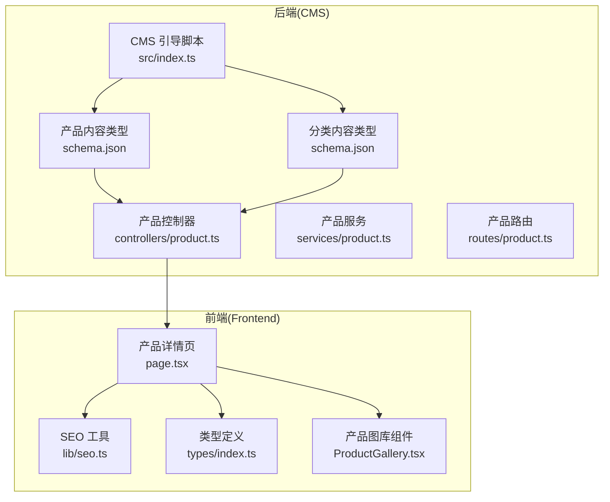
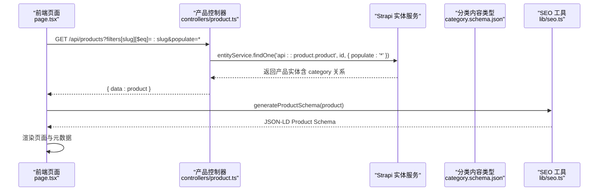
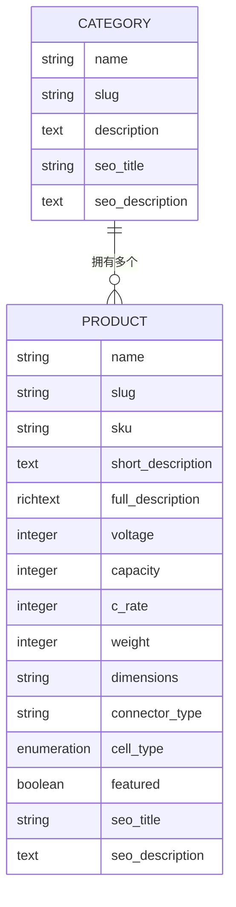
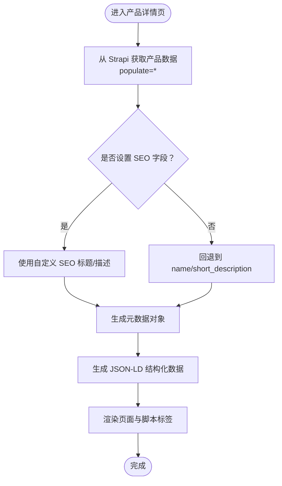
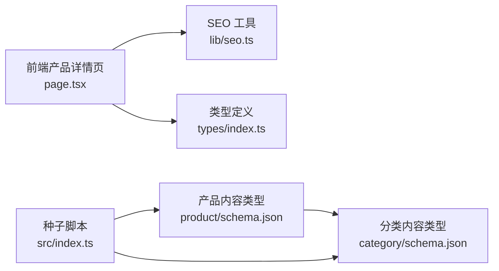

# 产品内容类型

<cite>
**本文引用的文件**
- [cms/src/api/product/content-types/product/schema.json](file://cms/src/api/product/content-types/product/schema.json)
- [cms/src/api/category/content-types/category/schema.json](file://cms/src/api/category/content-types/category/schema.json)
- [cms/src/api/product/controllers/product.ts](file://cms/src/api/product/controllers/product.ts)
- [cms/src/api/product/services/product.ts](file://cms/src/api/product/services/product.ts)
- [cms/src/api/category/controllers/category.ts](file://cms/src/api/category/controllers/category.ts)
- [cms/src/api/product/routes/product.ts](file://cms/src/api/product/routes/product.ts)
- [cms/src/api/category/routes/category.ts](file://cms/src/api/category/routes/category.ts)
- [cms/src/index.ts](file://cms/src/index.ts)
- [frontend/src/app/products/[category]/[slug]/page.tsx](file://frontend/src/app/products/[category]/[slug]/page.tsx)
- [frontend/src/lib/seo.ts](file://frontend/src/lib/seo.ts)
- [frontend/src/types/index.ts](file://frontend/src/types/index.ts)
- [frontend/src/components/products/ProductGallery.tsx](file://frontend/src/components/products/ProductGallery.tsx)
</cite>

## 目录
1. [简介](#简介)
2. [项目结构](#项目结构)
3. [核心组件](#核心组件)
4. [架构总览](#架构总览)
5. [详细组件分析](#详细组件分析)
6. [依赖关系分析](#依赖关系分析)
7. [性能考虑](#性能考虑)
8. [故障排除指南](#故障排除指南)
9. [结论](#结论)
10. [附录](#附录)

## 简介
本文件面向产品内容类型（Product Content Type）的完整说明，涵盖字段定义、数据类型、验证规则、业务约束、与分类的多对一关系、draftAndPublish 选项的作用、SEO 优化字段及最佳实践，以及字段配置示例与实际使用场景。文档同时结合 Strapi 后端与 Next.js 前端的实现，帮助内容编辑者与开发者高效理解与使用产品模型。

## 项目结构
产品内容类型位于 Strapi 的 API 模块中，采用标准的“内容类型”目录结构：
- 后端：cms/src/api/product/content-types/product/schema.json 定义产品模型
- 前端：frontend/src/app/products/[category]/[slug]/page.tsx 展示产品详情页
- SEO：frontend/src/lib/seo.ts 提供 JSON-LD 结构化数据生成
- 类型定义：frontend/src/types/index.ts 统一前后端类型契约

图表来源
- [cms/src/api/product/content-types/product/schema.json:1-33](file://cms/src/api/product/content-types/product/schema.json#L1-L33)
- [cms/src/api/category/content-types/category/schema.json:1-21](file://cms/src/api/category/content-types/category/schema.json#L1-L21)
- [cms/src/api/product/controllers/product.ts:1-40](file://cms/src/api/product/controllers/product.ts#L1-L40)
- [cms/src/api/product/services/product.ts:1-2](file://cms/src/api/product/services/product.ts#L1-L2)
- [cms/src/api/product/routes/product.ts:1-35](file://cms/src/api/product/routes/product.ts#L1-L35)
- [cms/src/index.ts:1-315](file://cms/src/index.ts#L1-L315)
- [frontend/src/app/products/[category]/[slug]/page.tsx](file://frontend/src/app/products/[category]/[slug]/page.tsx#L1-L566)
- [frontend/src/lib/seo.ts:1-225](file://frontend/src/lib/seo.ts#L1-L225)
- [frontend/src/types/index.ts:1-157](file://frontend/src/types/index.ts#L1-L157)
- [frontend/src/components/products/ProductGallery.tsx:1-104](file://frontend/src/components/products/ProductGallery.tsx#L1-L104)

章节来源
- [cms/src/api/product/content-types/product/schema.json:1-33](file://cms/src/api/product/content-types/product/schema.json#L1-L33)
- [cms/src/api/category/content-types/category/schema.json:1-21](file://cms/src/api/category/content-types/category/schema.json#L1-L21)
- [frontend/src/app/products/[category]/[slug]/page.tsx](file://frontend/src/app/products/[category]/[slug]/page.tsx#L1-L566)

## 核心组件
- 产品内容类型：定义产品实体的字段、关系与选项（如 draftAndPublish）
- 分类内容类型：定义产品所属的分类，支持 SEO 字段
- 产品控制器与路由：提供 CRUD 接口
- 前端产品详情页：展示产品信息、技术规格、媒体资源与 SEO 元数据
- SEO 工具：生成 JSON-LD 结构化数据与 Open Graph/Twitter 元数据
- 类型定义：统一前后端数据契约，确保字段一致性

章节来源
- [cms/src/api/product/content-types/product/schema.json:1-33](file://cms/src/api/product/content-types/product/schema.json#L1-L33)
- [cms/src/api/category/content-types/category/schema.json:1-21](file://cms/src/api/category/content-types/category/schema.json#L1-L21)
- [cms/src/api/product/controllers/product.ts:1-40](file://cms/src/api/product/controllers/product.ts#L1-L40)
- [cms/src/api/product/routes/product.ts:1-35](file://cms/src/api/product/routes/product.ts#L1-L35)
- [frontend/src/app/products/[category]/[slug]/page.tsx](file://frontend/src/app/products/[category]/[slug]/page.tsx#L1-L566)
- [frontend/src/lib/seo.ts:1-225](file://frontend/src/lib/seo.ts#L1-L225)
- [frontend/src/types/index.ts:1-157](file://frontend/src/types/index.ts#L1-L157)

## 架构总览
产品内容类型通过多对一关系关联到分类，支持草稿/发布流程；前端通过 API 获取产品数据并渲染详情页，同时注入 SEO 结构化数据。

图表来源
- [cms/src/api/product/controllers/product.ts:11-16](file://cms/src/api/product/controllers/product.ts#L11-L16)
- [frontend/src/app/products/[category]/[slug]/page.tsx](file://frontend/src/app/products/[category]/[slug]/page.tsx#L20-L73)
- [frontend/src/lib/seo.ts:4-52](file://frontend/src/lib/seo.ts#L4-L52)

## 详细组件分析

### 字段定义与数据类型
以下字段来自产品内容类型 schema，按类别分组说明其数据类型、验证规则与业务约束：

- 基础属性
  - name：字符串，必填。用于显示与 SEO 标题回退。
  - slug：UID，基于 name 自动生成，必填且唯一。用于 URL 路径与静态生成。
  - sku：字符串，必填且唯一。用于库存与订单管理。
  - short_description：文本，必填。用于列表页摘要与 SEO 描述回退。
  - full_description：富文本，可选。用于详情页完整描述。

- 技术规格属性
  - voltage：整数，必填。表示电池串联节数（S），用于计算额定电压。
  - capacity：整数，必填。单位毫安时（mAh）。
  - c_rate：整数，必填。连续放电倍率（C）。
  - weight：整数，可选。单位克（g）。
  - dimensions：字符串，可选。格式建议为“长×宽×高 mm”。
  - connector_type：字符串，可选。连接器类型标识。
  - cell_type：枚举，取值范围为 ["LiPo", "Li-ion", "LiFePO4"]，默认 "LiPo"。

- SEO 优化字段
  - seo_title：字符串，可选。覆盖默认标题。
  - seo_description：文本，可选。覆盖默认描述。

- 媒体资源字段
  - images：媒体（图片，多图），可选。用于产品图库展示。
  - datasheet：媒体（文件，单个），可选。用于下载数据表 PDF。

- 关系字段
  - category：多对一关系，目标为 api::category.category。用于产品分类导航与筛选。

- 其他
  - featured：布尔，默认 false。用于首页或推荐位展示。

章节来源
- [cms/src/api/product/content-types/product/schema.json:12-31](file://cms/src/api/product/content-types/product/schema.json#L12-L31)
- [cms/src/api/category/content-types/category/schema.json:12-19](file://cms/src/api/category/content-types/category/schema.json#L12-L19)

### 验证规则与业务约束
- 必填字段：name、slug、sku、short_description、voltage、capacity、c_rate
- 唯一性：sku 唯一；slug 由 UID 自动生成且唯一
- 关系完整性：category 为必填关系，需先存在分类再创建产品
- 数据类型：整数字段（voltage/capacity/c_rate/weight）应为正数
- 枚举约束：cell_type 仅允许指定值
- SEO 回退：若未设置 seo_title 或 seo_description，则回退到 name 与 short_description

章节来源
- [cms/src/api/product/content-types/product/schema.json:13-30](file://cms/src/api/product/content-types/product/schema.json#L13-L30)
- [frontend/src/app/products/[category]/[slug]/page.tsx](file://frontend/src/app/products/[category]/[slug]/page.tsx#L60-L63)

### draftAndPublish 选项
- 在产品内容类型中启用 draftAndPublish：允许在发布前保存草稿，控制内容上线时机
- 对应的分类也启用了该选项，保证内容状态一致
- 前端通过 populate=* 获取已发布内容，避免草稿被公开

章节来源
- [cms/src/api/product/content-types/product/schema.json:9-11](file://cms/src/api/product/content-types/product/schema.json#L9-L11)
- [cms/src/api/category/content-types/category/schema.json:9-11](file://cms/src/api/category/content-types/category/schema.json#L9-L11)

### 与分类的多对一关系
- 产品通过 category 字段关联到分类，关系类型为 manyToOne
- 前端根据 category.slug 生成面包屑与分类链接
- 后端在种子脚本中通过 documentId 建立关系，确保 Strapi v5 的关系语法正确

图表来源
- [cms/src/api/category/content-types/category/schema.json:12-19](file://cms/src/api/category/content-types/category/schema.json#L12-L19)
- [cms/src/api/product/content-types/product/schema.json:12-31](file://cms/src/api/product/content-types/product/schema.json#L12-L31)

章节来源
- [cms/src/api/product/content-types/product/schema.json:28-28](file://cms/src/api/product/content-types/product/schema.json#L28-L28)
- [cms/src/index.ts:267-311](file://cms/src/index.ts#L267-L311)
- [frontend/src/app/products/[category]/[slug]/page.tsx](file://frontend/src/app/products/[category]/[slug]/page.tsx#L40-L45)

### 字段配置示例与使用场景
- 基础属性
  - 示例：name="22000mAh 12S 农业无人机电池"，sku="BV-AG-22000-12S"，short_description="高容量电池，适用于喷洒作业"
  - 使用场景：列表页展示、SEO 描述回退、购买确认页显示

- 技术规格属性
  - 示例：voltage=12，capacity=22000，c_rate=25，weight=4850，dimensions="205×90×68mm"，connector_type="AS150U"，cell_type="LiPo"
  - 使用场景：技术参数表格、能量密度计算、兼容性判断

- SEO 优化字段
  - 示例：seo_title="22000mAh 12S 农业无人机电池 | Battivus"，seo_description="高容量 22000mAh 12S 锂聚合物电池，25C 放电速率，AS150U 连接器。兼容 DJI Agras"
  - 使用场景：搜索引擎结果预览、社交分享卡片

- 媒体资源字段
  - 示例：images=["/uploads/...jpg"]，datasheet="/downloads/BV-AG-22000-12S-datasheet.pdf"
  - 使用场景：产品图库轮播、数据表下载

- 关系字段
  - 示例：category={ id, name, slug, description }
  - 使用场景：面包屑导航、分类筛选、URL 生成

章节来源
- [cms/src/api/product/content-types/product/schema.json:12-31](file://cms/src/api/product/content-types/product/schema.json#L12-L31)
- [frontend/src/app/products/[category]/[slug]/page.tsx](file://frontend/src/app/products/[category]/[slug]/page.tsx#L35-L66)
- [frontend/src/lib/seo.ts:4-52](file://frontend/src/lib/seo.ts#L4-L52)

### SEO 优化最佳实践
- 结构化数据
  - 使用 generateProductSchema 生成 JSON-LD Product，包含品牌、制造商、图像、价格等
  - 使用 generateBreadcrumbSchema 生成面包屑，提升搜索体验
- 元数据
  - 使用 generateMetadata 动态生成 title/description/openGraph/twitter/canonical
  - 若未设置 seo_title/seo_description，自动回退到 name/short_description
- 前端集成
  - 在产品详情页注入 JSON-LD 脚本标签
  - 面包屑导航与 Canonical URL 设置

图表来源
- [frontend/src/app/products/[category]/[slug]/page.tsx](file://frontend/src/app/products/[category]/[slug]/page.tsx#L164-L200)
- [frontend/src/lib/seo.ts:168-224](file://frontend/src/lib/seo.ts#L168-L224)

章节来源
- [frontend/src/app/products/[category]/[slug]/page.tsx](file://frontend/src/app/products/[category]/[slug]/page.tsx#L164-L200)
- [frontend/src/lib/seo.ts:4-52](file://frontend/src/lib/seo.ts#L4-L52)
- [frontend/src/lib/seo.ts:168-224](file://frontend/src/lib/seo.ts#L168-L224)

### 前端展示与交互
- 产品详情页
  - 从 Strapi 获取数据并转换为前端类型 Product
  - 渲染快速规格、技术参数表、媒体资源与下载按钮
  - 注入 JSON-LD 与元数据，生成面包屑
- 图库组件
  - 支持主图与缩略图切换，滚动浏览
  - 无图时显示占位符图标

章节来源
- [frontend/src/app/products/[category]/[slug]/page.tsx](file://frontend/src/app/products/[category]/[slug]/page.tsx#L20-L73)
- [frontend/src/app/products/[category]/[slug]/page.tsx](file://frontend/src/app/products/[category]/[slug]/page.tsx#L288-L427)
- [frontend/src/components/products/ProductGallery.tsx:10-104](file://frontend/src/components/products/ProductGallery.tsx#L10-L104)

## 依赖关系分析
- 产品内容类型依赖分类内容类型（多对一关系）
- 前端产品详情页依赖 SEO 工具与类型定义
- 种子脚本负责初始化分类与产品数据，并建立关系

图表来源
- [cms/src/api/product/content-types/product/schema.json:28-28](file://cms/src/api/product/content-types/product/schema.json#L28-L28)
- [cms/src/api/category/content-types/category/schema.json:12-19](file://cms/src/api/category/content-types/category/schema.json#L12-L19)
- [frontend/src/app/products/[category]/[slug]/page.tsx](file://frontend/src/app/products/[category]/[slug]/page.tsx#L1-L16)
- [frontend/src/lib/seo.ts:1-225](file://frontend/src/lib/seo.ts#L1-L225)
- [frontend/src/types/index.ts:23-43](file://frontend/src/types/index.ts#L23-L43)
- [cms/src/index.ts:267-311](file://cms/src/index.ts#L267-L311)

章节来源
- [cms/src/api/product/content-types/product/schema.json:1-33](file://cms/src/api/product/content-types/product/schema.json#L1-L33)
- [cms/src/api/category/content-types/category/schema.json:1-21](file://cms/src/api/category/content-types/category/schema.json#L1-L21)
- [frontend/src/app/products/[category]/[slug]/page.tsx](file://frontend/src/app/products/[category]/[slug]/page.tsx#L1-L16)
- [frontend/src/lib/seo.ts:1-225](file://frontend/src/lib/seo.ts#L1-L225)
- [frontend/src/types/index.ts:1-157](file://frontend/src/types/index.ts#L1-L157)
- [cms/src/index.ts:219-315](file://cms/src/index.ts#L219-L315)

## 性能考虑
- API 查询：前端使用 populate=* 获取关联数据，减少多次请求；建议在高频访问场景下开启缓存与 CDN
- 图片加载：使用合适的尺寸与格式，必要时引入懒加载与 WebP
- 结构化数据：仅在详情页生成 JSON-LD，避免重复计算
- 静态生成：利用 generateStaticParams 生成静态路径，提升首屏性能

## 故障排除指南
- 无法获取产品详情
  - 检查 slug 是否正确，确认产品已发布（draftAndPublish）
  - 确认分类关系已建立，category 文档 ID 正确
- SEO 字段未生效
  - 确认未设置 seo_title/seo_description 时，系统会回退到 name/short_description
- 关系缺失
  - 种子脚本会检查并重新建立关系；若出现孤儿产品，可触发重新播种
- 前端类型不匹配
  - 前端类型定义与后端 schema 保持一致，避免字段名差异导致解析错误

章节来源
- [frontend/src/app/products/[category]/[slug]/page.tsx](file://frontend/src/app/products/[category]/[slug]/page.tsx#L171-L180)
- [cms/src/index.ts:220-236](file://cms/src/index.ts#L220-L236)
- [frontend/src/types/index.ts:23-43](file://frontend/src/types/index.ts#L23-L43)

## 结论
产品内容类型通过清晰的字段定义、严格的验证规则与完善的 SEO 支持，为产品管理与展示提供了坚实基础。配合分类的多对一关系与草稿/发布机制，能够满足从内容编辑到前端展示的全链路需求。建议在实际使用中遵循字段命名规范、完善 SEO 字段、合理组织媒体资源，并持续优化前端性能与用户体验。

## 附录
- 字段映射参考
  - 前端类型 Product 与后端 schema 的字段对应关系见类型定义与页面转换逻辑
- API 路由参考
  - 产品 CRUD 路由定义于 routes/product.ts，控制器位于 controllers/product.ts
- 种子数据参考
  - 种子脚本在 src/index.ts 中定义了分类与产品的初始数据，包含关系建立逻辑

章节来源
- [frontend/src/types/index.ts:23-43](file://frontend/src/types/index.ts#L23-L43)
- [cms/src/api/product/routes/product.ts:1-35](file://cms/src/api/product/routes/product.ts#L1-L35)
- [cms/src/api/product/controllers/product.ts:1-40](file://cms/src/api/product/controllers/product.ts#L1-L40)
- [cms/src/index.ts:34-147](file://cms/src/index.ts#L34-L147)