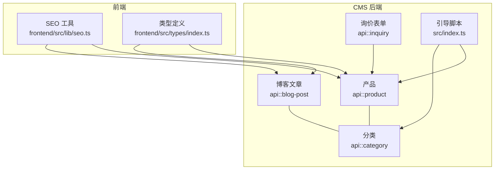
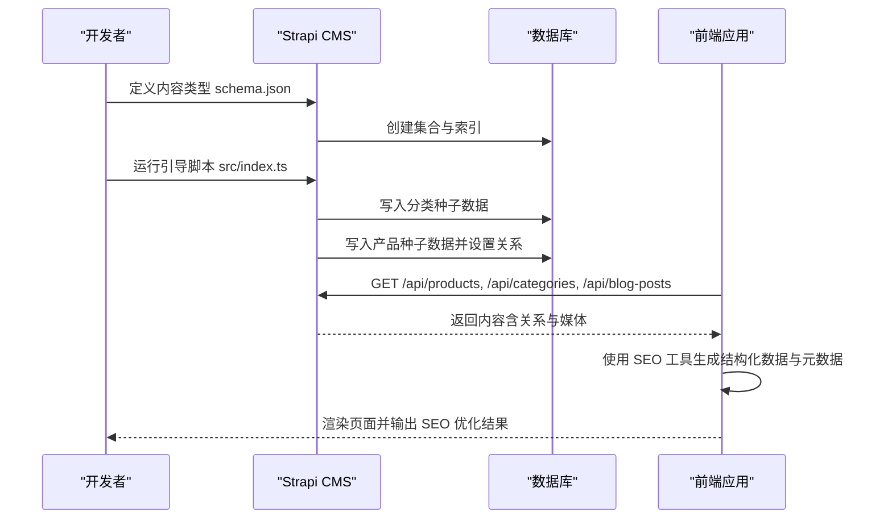
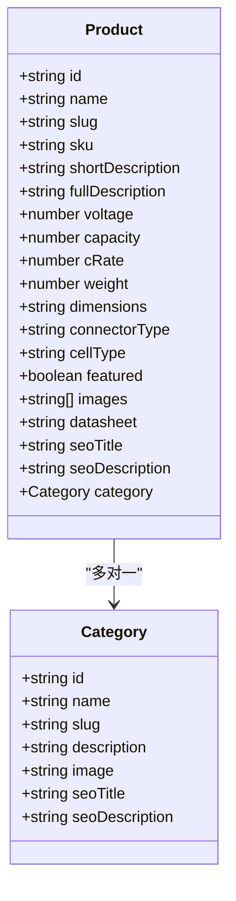
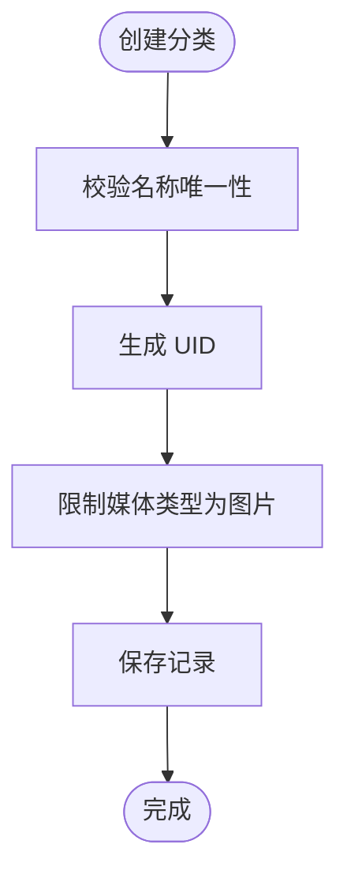
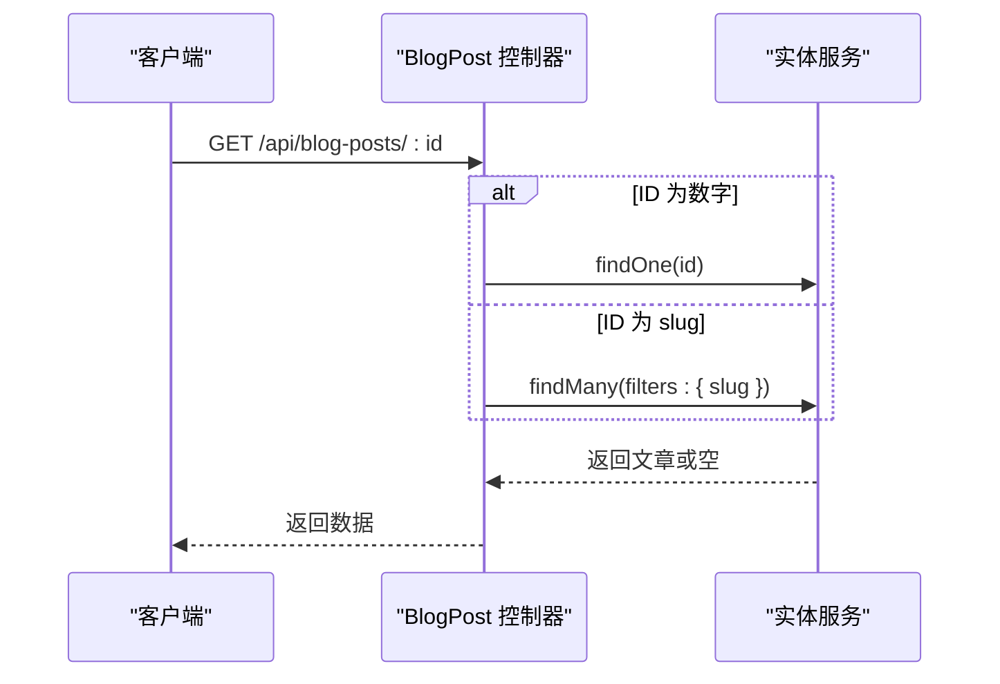
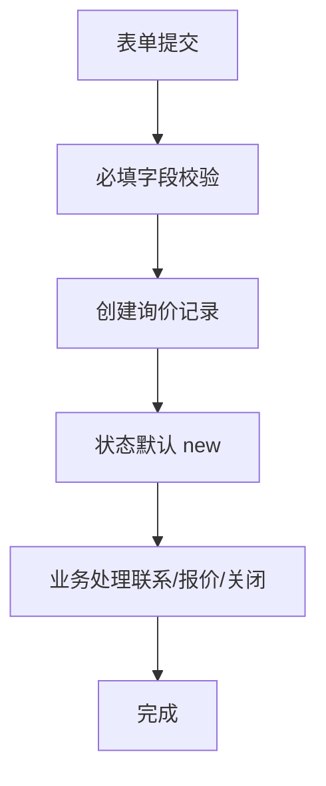
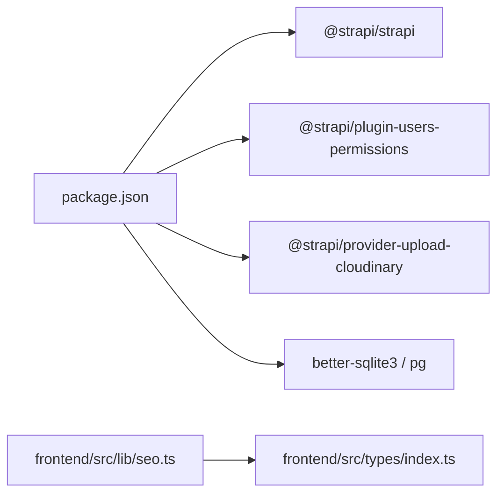

# 内容类型管理

<cite>
**本文引用的文件**
- [cms/src/api/product/content-types/product/schema.json](file://cms/src/api/product/content-types/product/schema.json)
- [cms/src/api/category/content-types/category/schema.json](file://cms/src/api/category/content-types/category/schema.json)
- [cms/src/api/blog-post/content-types/blog-post/schema.json](file://cms/src/api/blog-post/content-types/blog-post/schema.json)
- [cms/src/api/inquiry/content-types/inquiry/schema.json](file://cms/src/api/inquiry/content-types/inquiry/schema.json)
- [cms/src/index.ts](file://cms/src/index.ts)
- [cms/src/api/product/controllers/product.ts](file://cms/src/api/product/controllers/product.ts)
- [cms/src/api/category/controllers/category.ts](file://cms/src/api/category/controllers/category.ts)
- [cms/src/api/blog-post/controllers/blog-post.ts](file://cms/src/api/blog-post/controllers/blog-post.ts)
- [cms/src/api/inquiry/controllers/inquiry.ts](file://cms/src/api/inquiry/controllers/inquiry.ts)
- [frontend/src/lib/seo.ts](file://frontend/src/lib/seo.ts)
- [frontend/src/types/index.ts](file://frontend/src/types/index.ts)
- [cms/package.json](file://cms/package.json)
- [cms/tsconfig.json](file://cms/tsconfig.json)
</cite>

## 目录
1. [简介](#简介)
2. [项目结构](#项目结构)
3. [核心组件](#核心组件)
4. [架构总览](#架构总览)
5. [详细组件分析](#详细组件分析)
6. [依赖分析](#依赖分析)
7. [性能考量](#性能考量)
8. [故障排查指南](#故障排查指南)
9. [结论](#结论)
10. [附录](#附录)

## 简介
本文件为 Battivus 内容类型管理系统提供全面文档，覆盖产品、分类、博客文章与询价表单四大内容模型的设计与实现。重点说明字段定义、数据类型、验证规则、字段间关联关系、SEO 优化字段以及媒体资源管理；同时解释 Strapi v5 的内容类型语法变化（关系字段新写法、文档 ID 管理）；并给出内容类型扩展的最佳实践、字段重命名策略与向后兼容性建议。文末提供 schema.json 示例路径与字段配置说明，便于开发者理解与自定义内容模型。

## 项目结构
CMS 后端采用 Strapi v5 架构，内容类型以“按功能模块”组织在 src/api 下，每个模块包含 content-types、controllers、routes、services 等目录。前端使用 Next.js，通过 Strapi 提供的 REST API 获取内容，并在渲染层进行 SEO 优化与结构化数据输出。

图表来源
- [cms/src/api/product/content-types/product/schema.json:1-33](file://cms/src/api/product/content-types/product/schema.json#L1-L33)
- [cms/src/api/category/content-types/category/schema.json:1-21](file://cms/src/api/category/content-types/category/schema.json#L1-L21)
- [cms/src/api/blog-post/content-types/blog-post/schema.json:1-24](file://cms/src/api/blog-post/content-types/blog-post/schema.json#L1-L24)
- [cms/src/api/inquiry/content-types/inquiry/schema.json:1-25](file://cms/src/api/inquiry/content-types/inquiry/schema.json#L1-L25)
- [cms/src/index.ts:149-315](file://cms/src/index.ts#L149-L315)
- [frontend/src/lib/seo.ts:1-225](file://frontend/src/lib/seo.ts#L1-L225)
- [frontend/src/types/index.ts:1-157](file://frontend/src/types/index.ts#L1-L157)

章节来源
- [cms/package.json:1-36](file://cms/package.json#L1-L36)
- [cms/tsconfig.json:1-19](file://cms/tsconfig.json#L1-L19)

## 核心组件
本节概述四大内容类型的核心字段与约束，帮助快速建立对内容模型的理解。

- 产品（Product）
  - 关键字段：名称、唯一标识（UID）、SKU（唯一）、短描述、富文本详情、电气参数（电压、容量、放电倍率）、重量、尺寸、连接器类型、电池类型枚举、是否推荐、媒体资源（图片、数据手册）、所属分类、SEO 标题与描述。
  - 验证规则：必填字段明确标注；UID 基于名称生成；SKU 唯一；布尔默认值；媒体类型限定。
  - 关联关系：多对一关联到分类；可选关联到解决方案（在前端类型中体现）。
  - 参考路径：[schema.json:1-33](file://cms/src/api/product/content-types/product/schema.json#L1-L33)

- 分类（Category）
  - 关键字段：名称（唯一）、UID、描述、图片、SEO 标题与描述。
  - 验证规则：名称唯一；UID 基于名称生成；媒体类型限定。
  - 关联关系：被产品反向引用。
  - 参考路径：[schema.json:1-21](file://cms/src/api/category/content-types/category/schema.json#L1-L21)

- 博客文章（Blog Post）
  - 关键字段：标题、UID、摘要、富文本内容、特色图、作者名（默认值）、标签（JSON）、SEO 标题与描述。
  - 验证规则：必填字段明确标注；UID 基于标题生成；作者默认值。
  - 关联关系：与作者信息在前端类型中体现。
  - 参考路径：[schema.json:1-24](file://cms/src/api/blog-post/content-types/blog-post/schema.json#L1-L24)

- 询价表单（Inquiry）
  - 关键字段：姓名、邮箱、公司、国家、数量、消息、产品名称/SKU、来源、状态（枚举，默认 new）。
  - 验证规则：必填字段明确标注；状态枚举限定。
  - 关联关系：可与产品信息联动（前端表单提交时携带产品上下文）。
  - 参考路径：[schema.json:1-25](file://cms/src/api/inquiry/content-types/inquiry/schema.json#L1-L25)

章节来源
- [cms/src/api/product/content-types/product/schema.json:12-31](file://cms/src/api/product/content-types/product/schema.json#L12-L31)
- [cms/src/api/category/content-types/category/schema.json:12-19](file://cms/src/api/category/content-types/category/schema.json#L12-L19)
- [cms/src/api/blog-post/content-types/blog-post/schema.json:12-22](file://cms/src/api/blog-post/content-types/blog-post/schema.json#L12-L22)
- [cms/src/api/inquiry/content-types/inquiry/schema.json:12-23](file://cms/src/api/inquiry/content-types/inquiry/schema.json#L12-L23)

## 架构总览
下图展示内容模型在后端的定义、种子数据初始化、以及前端消费与 SEO 输出的关系。

图表来源
- [cms/src/index.ts:219-315](file://cms/src/index.ts#L219-L315)
- [cms/src/api/product/content-types/product/schema.json:1-33](file://cms/src/api/product/content-types/product/schema.json#L1-L33)
- [cms/src/api/category/content-types/category/schema.json:1-21](file://cms/src/api/category/content-types/category/schema.json#L1-L21)
- [frontend/src/lib/seo.ts:1-225](file://frontend/src/lib/seo.ts#L1-L225)

## 详细组件分析

### 产品内容模型（Product）
- 字段与类型
  - 名称：字符串，必填
  - UID：基于名称生成，必填
  - SKU：字符串，必填且唯一
  - 描述：文本/富文本
  - 电气参数：整数（电压、容量、放电倍率），部分必填
  - 物理属性：整数（重量）、字符串（尺寸、连接器类型）
  - 电池类型：枚举（LiPo/Li-ion/LiFePO4），默认 LiPo
  - 推荐位：布尔，默认 false
  - 媒体：图片多图、数据手册单文件
  - 关系：多对一关联到分类
  - SEO：标题与描述
- 关系与导航
  - 产品属于一个分类；前端通过分类 slug 与产品 slug 组合路由访问。
- SEO 与结构化数据
  - 前端生成 Product 类型的 JSON-LD，包含品牌、制造商、图像、价格有效期、规格属性等。
- 控制器与服务
  - 提供标准 CRUD 能力；服务为空实现，便于后续扩展。
- 参考路径
  - [schema.json:12-31](file://cms/src/api/product/content-types/product/schema.json#L12-L31)
  - [controller:1-40](file://cms/src/api/product/controllers/product.ts#L1-L40)
  - [service:1-2](file://cms/src/api/product/services/product.ts#L1-L2)
  - [前端类型定义:23-43](file://frontend/src/types/index.ts#L23-L43)
  - [前端 SEO 生成:4-52](file://frontend/src/lib/seo.ts#L4-L52)

图表来源
- [cms/src/api/product/content-types/product/schema.json:12-31](file://cms/src/api/product/content-types/product/schema.json#L12-L31)
- [cms/src/api/category/content-types/category/schema.json:12-19](file://cms/src/api/category/content-types/category/schema.json#L12-L19)
- [frontend/src/types/index.ts:23-52](file://frontend/src/types/index.ts#L23-L52)

章节来源
- [cms/src/api/product/content-types/product/schema.json:12-31](file://cms/src/api/product/content-types/product/schema.json#L12-L31)
- [cms/src/api/product/controllers/product.ts:1-40](file://cms/src/api/product/controllers/product.ts#L1-L40)
- [frontend/src/types/index.ts:23-43](file://frontend/src/types/index.ts#L23-L43)
- [frontend/src/lib/seo.ts:4-52](file://frontend/src/lib/seo.ts#L4-L52)

### 分类内容模型（Category）
- 字段与类型
  - 名称：字符串，唯一且必填
  - UID：基于名称生成，必填
  - 描述：文本
  - 图片：媒体（单图）
  - SEO：标题与描述
- 关系与用途
  - 作为产品的上级分类，用于站点导航与筛选。
- 参考路径
  - [schema.json:12-19](file://cms/src/api/category/content-types/category/schema.json#L12-L19)
  - [controller:1-40](file://cms/src/api/category/controllers/category.ts#L1-L40)

图表来源
- [cms/src/api/category/content-types/category/schema.json:12-19](file://cms/src/api/category/content-types/category/schema.json#L12-L19)

章节来源
- [cms/src/api/category/content-types/category/schema.json:12-19](file://cms/src/api/category/content-types/category/schema.json#L12-L19)
- [cms/src/api/category/controllers/category.ts:1-40](file://cms/src/api/category/controllers/category.ts#L1-L40)

### 博客文章内容模型（Blog Post）
- 字段与类型
  - 标题：字符串，必填
  - UID：基于标题生成，必填
  - 摘要：文本，必填
  - 内容：富文本，必填
  - 特色图：媒体（单图）
  - 作者名：字符串，默认团队名称
  - 标签：JSON
  - SEO：标题与描述
- 访问方式
  - 支持按 ID 或 slug 查询；slug 查询返回第一条匹配项。
- 参考路径
  - [schema.json:12-22](file://cms/src/api/blog-post/content-types/blog-post/schema.json#L12-L22)
  - [controller:1-53](file://cms/src/api/blog-post/controllers/blog-post.ts#L1-L53)
  - [前端类型定义:68-79](file://frontend/src/types/index.ts#L68-L79)
  - [前端 SEO 生成:115-142](file://frontend/src/lib/seo.ts#L115-L142)

图表来源
- [cms/src/api/blog-post/controllers/blog-post.ts:14-30](file://cms/src/api/blog-post/controllers/blog-post.ts#L14-L30)

章节来源
- [cms/src/api/blog-post/content-types/blog-post/schema.json:12-22](file://cms/src/api/blog-post/content-types/blog-post/schema.json#L12-L22)
- [cms/src/api/blog-post/controllers/blog-post.ts:1-53](file://cms/src/api/blog-post/controllers/blog-post.ts#L1-L53)
- [frontend/src/types/index.ts:68-79](file://frontend/src/types/index.ts#L68-L79)
- [frontend/src/lib/seo.ts:115-142](file://frontend/src/lib/seo.ts#L115-L142)

### 询价表单内容模型（Inquiry）
- 字段与类型
  - 姓名、邮箱、公司、国家、数量、消息（必填）
  - 产品名称/SKU、来源
  - 状态：枚举[new, contacted, quoted, closed]，默认 new
- 公共权限
  - 引导脚本为公共角色开启创建权限，支持前端表单直接提交。
- 参考路径
  - [schema.json:12-23](file://cms/src/api/inquiry/content-types/inquiry/schema.json#L12-L23)
  - [controller:1-40](file://cms/src/api/inquiry/controllers/inquiry.ts#L1-L40)
  - [引导脚本权限配置:186-188](file://cms/src/index.ts#L186-L188)

图表来源
- [cms/src/api/inquiry/content-types/inquiry/schema.json:12-23](file://cms/src/api/inquiry/content-types/inquiry/schema.json#L12-L23)
- [cms/src/index.ts:186-188](file://cms/src/index.ts#L186-L188)

章节来源
- [cms/src/api/inquiry/content-types/inquiry/schema.json:12-23](file://cms/src/api/inquiry/content-types/inquiry/schema.json#L12-L23)
- [cms/src/api/inquiry/controllers/inquiry.ts:1-40](file://cms/src/api/inquiry/controllers/inquiry.ts#L1-L40)
- [cms/src/index.ts:186-188](file://cms/src/index.ts#L186-L188)

## 依赖分析
- 技术栈
  - 后端：Strapi v5（@strapi/strapi ^5.5.1），用户权限插件 @strapi/plugin-users-permissions，云存储提供商 @strapi/provider-upload-cloudinary。
  - 数据库：better-sqlite3（开发）或 pg（生产）。
  - 前端：Next.js（类型定义与 SEO 工具）。
- 关键依赖路径
  - [package.json 依赖声明:14-25](file://cms/package.json#L14-L25)
  - [tsconfig 编译选项:2-15](file://cms/tsconfig.json#L2-L15)

图表来源
- [cms/package.json:14-25](file://cms/package.json#L14-L25)
- [cms/tsconfig.json:2-15](file://cms/tsconfig.json#L2-L15)
- [frontend/src/lib/seo.ts:1-225](file://frontend/src/lib/seo.ts#L1-L225)
- [frontend/src/types/index.ts:1-157](file://frontend/src/types/index.ts#L1-L157)

章节来源
- [cms/package.json:14-25](file://cms/package.json#L14-L25)
- [cms/tsconfig.json:2-15](file://cms/tsconfig.json#L2-L15)

## 性能考量
- 关系查询与分页
  - 在控制器中使用 entityService 的 findMany/findOne 并结合 filters/populate，避免 N+1 查询。
- 媒体资源
  - 限制媒体类型（图片/文件）减少无效上传；合理使用 CDN 与缓存。
- 种子数据与文档 ID
  - 使用 documents API 更新关系字段，确保 Strapi v5 的 documentId 正确关联。
- SEO 与前端渲染
  - 将结构化数据与元数据在服务端或构建期生成，降低运行时开销。

## 故障排查指南
- 权限问题
  - 若公共用户无法访问公开 API，请检查引导脚本中的权限创建逻辑。
  - 参考：[权限配置与创建:172-210](file://cms/src/index.ts#L172-L210)
- 关系缺失或孤儿产品
  - 引导脚本会检测是否存在无分类的产品并触发重新播种。
  - 参考：[种子数据与关系更新:219-315](file://cms/src/index.ts#L219-L315)
- 博客文章按 slug 查询失败
  - 确认 slug 是否存在重复；控制器按 slug 查询返回第一条匹配项。
  - 参考：[按 slug 查询逻辑:22-29](file://cms/src/api/blog-post/controllers/blog-post.ts#L22-L29)
- 前端类型不一致导致渲染异常
  - 对照前端类型定义，确保字段名称与后端 schema 保持一致。
  - 参考：[前端类型定义:23-79](file://frontend/src/types/index.ts#L23-L79)

章节来源
- [cms/src/index.ts:172-210](file://cms/src/index.ts#L172-L210)
- [cms/src/index.ts:219-315](file://cms/src/index.ts#L219-L315)
- [cms/src/api/blog-post/controllers/blog-post.ts:22-29](file://cms/src/api/blog-post/controllers/blog-post.ts#L22-L29)
- [frontend/src/types/index.ts:23-79](file://frontend/src/types/index.ts#L23-L79)

## 结论
本系统以 Strapi v5 为核心，围绕产品、分类、博客文章与询价表单构建了清晰的内容模型与 API 流程。通过 UID 自动生成、媒体类型限制、SEO 字段与结构化数据输出，实现了良好的可维护性与 SEO 表现。种子数据脚本与文档 ID 关系更新确保了初始数据的一致性与可扩展性。建议在扩展内容类型时遵循统一的字段命名规范、版本化 schema 与迁移策略，以保障长期演进的稳定性。

## 附录

### Strapi v5 内容类型语法要点
- 关系字段写法
  - 使用 target 指向目标 API，如 manyToOne 关系指向 api::category.category。
  - 参考：[产品关系字段:28-28](file://cms/src/api/product/content-types/product/schema.json#L28-L28)
- 文档 ID 管理
  - 创建实体后使用 documents API 更新关系字段，传入 documentId。
  - 参考：[关系更新流程:299-305](file://cms/src/index.ts#L299-L305)

章节来源
- [cms/src/api/product/content-types/product/schema.json:28-28](file://cms/src/api/product/content-types/product/schema.json#L28-L28)
- [cms/src/index.ts:299-305](file://cms/src/index.ts#L299-L305)

### 字段重命名与向后兼容最佳实践
- 重命名策略
  - 新增字段并保留旧字段一段时间，提供映射与转换逻辑。
  - 使用中间层服务或自定义控制器处理字段别名。
- 版本化与迁移
  - 通过 schema.json 的版本号与迁移脚本管理字段变更。
  - 前端类型定义同步更新，避免运行时报错。
- 兼容性测试
  - 对历史数据执行字段映射与回填，确保查询与渲染不受影响。

### 实际 schema.json 示例与字段配置说明
- 产品（Product）
  - 关键字段与验证参考：[schema.json:12-31](file://cms/src/api/product/content-types/product/schema.json#L12-L31)
- 分类（Category）
  - 关键字段与验证参考：[schema.json:12-19](file://cms/src/api/category/content-types/category/schema.json#L12-L19)
- 博客文章（Blog Post）
  - 关键字段与验证参考：[schema.json:12-22](file://cms/src/api/blog-post/content-types/blog-post/schema.json#L12-L22)
- 询价表单（Inquiry）
  - 关键字段与验证参考：[schema.json:12-23](file://cms/src/api/inquiry/content-types/inquiry/schema.json#L12-L23)