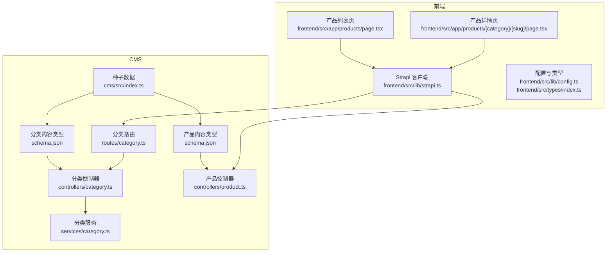
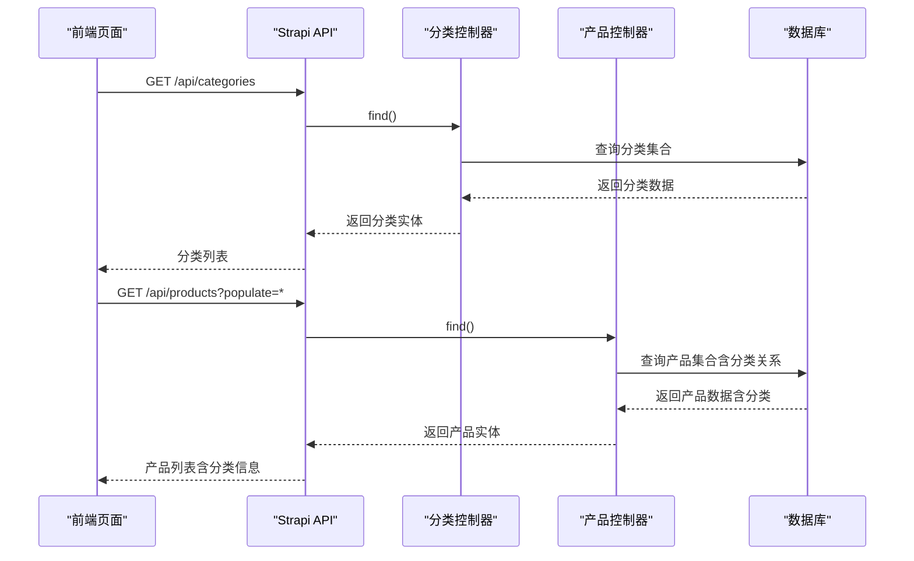
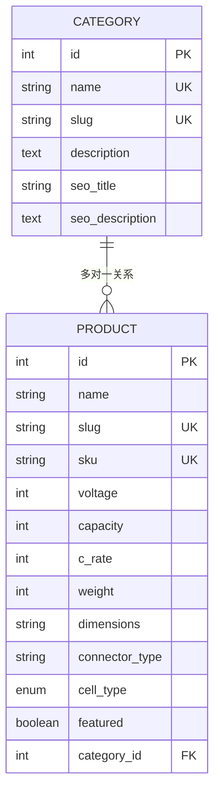
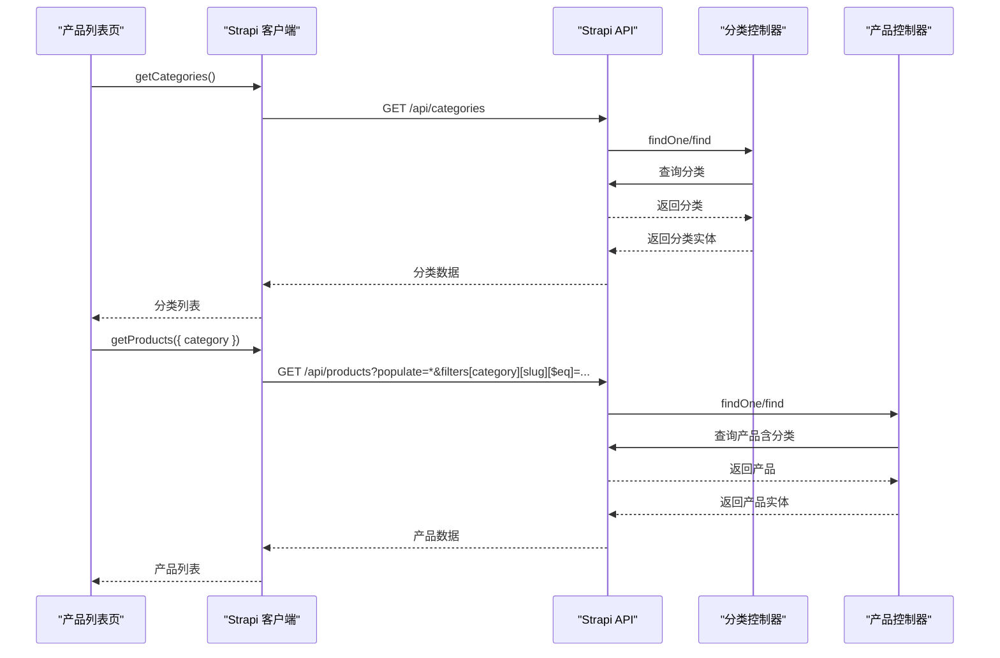
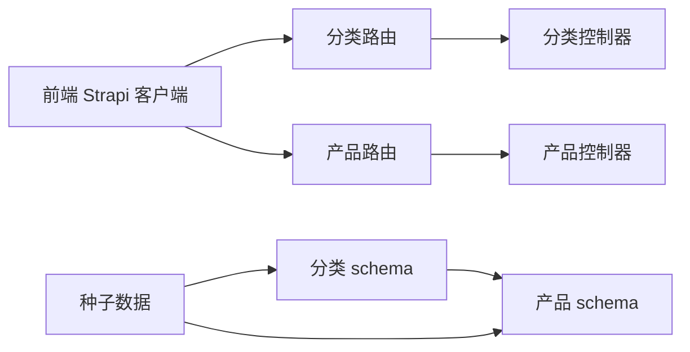

# 分类内容类型

<cite>
**本文档引用的文件**
- [schema.json](file://cms/src/api/category/content-types/category/schema.json)
- [category.ts](file://cms/src/api/category/controllers/category.ts)
- [category.ts](file://cms/src/api/category/services/category.ts)
- [category.ts](file://cms/src/api/category/routes/category.ts)
- [schema.json](file://cms/src/api/product/content-types/product/schema.json)
- [product.ts](file://cms/src/api/product/controllers/product.ts)
- [index.ts](file://cms/src/index.ts)
- [page.tsx](file://frontend/src/app/products/page.tsx)
- [page.tsx](file://frontend/src/app/products/[category]/[slug]/page.tsx)
- [strapi.ts](file://frontend/src/lib/strapi.ts)
- [config.ts](file://frontend/src/lib/config.ts)
- [index.ts](file://frontend/src/types/index.ts)
</cite>

## 目录
1. [简介](#简介)
2. [项目结构](#项目结构)
3. [核心组件](#核心组件)
4. [架构总览](#架构总览)
5. [详细组件分析](#详细组件分析)
6. [依赖关系分析](#依赖关系分析)
7. [性能考虑](#性能考虑)
8. [故障排除指南](#故障排除指南)
9. [结论](#结论)

## 简介
本文件面向分类内容类型（Category）的完整技术文档，涵盖字段定义、用途说明、在产品系统中的作用、层级结构设计思路、与产品的多对一关系配置、以及前端页面中的使用场景与数据获取方式。目标是帮助内容编辑者、开发者与运维人员快速理解并正确使用分类体系。

## 项目结构
分类内容类型位于 CMS 的 API 模块中，采用标准的 Strapi 内容类型目录结构：
- CMS 层：定义分类内容类型、控制器、服务、路由
- 前端层：通过 API 客户端获取分类与产品数据，并在页面中渲染导航与筛选

图表来源
- [schema.json:1-21](file://cms/src/api/category/content-types/category/schema.json#L1-L21)
- [category.ts:1-40](file://cms/src/api/category/controllers/category.ts#L1-L40)
- [category.ts:1-50](file://cms/src/api/category/routes/category.ts#L1-L50)
- [schema.json:1-33](file://cms/src/api/product/content-types/product/schema.json#L1-L33)
- [product.ts:1-40](file://cms/src/api/product/controllers/product.ts#L1-L40)
- [index.ts:1-315](file://cms/src/index.ts#L1-L315)
- [page.tsx:1-580](file://frontend/src/app/products/page.tsx#L1-L580)
- [page.tsx:1-566](file://frontend/src/app/products/[category]/[slug]/page.tsx#L1-L566)
- [strapi.ts:1-412](file://frontend/src/lib/strapi.ts#L1-L412)
- [config.ts:1-177](file://frontend/src/lib/config.ts#L1-L177)
- [index.ts:1-157](file://frontend/src/types/index.ts#L1-L157)

章节来源
- [schema.json:1-21](file://cms/src/api/category/content-types/category/schema.json#L1-L21)
- [category.ts:1-40](file://cms/src/api/category/controllers/category.ts#L1-L40)
- [category.ts:1-50](file://cms/src/api/category/routes/category.ts#L1-L50)
- [schema.json:1-33](file://cms/src/api/product/content-types/product/schema.json#L1-L33)
- [product.ts:1-40](file://cms/src/api/product/controllers/product.ts#L1-L40)
- [index.ts:1-315](file://cms/src/index.ts#L1-L315)
- [page.tsx:1-580](file://frontend/src/app/products/page.tsx#L1-L580)
- [page.tsx:1-566](file://frontend/src/app/products/[category]/[slug]/page.tsx#L1-L566)
- [strapi.ts:1-412](file://frontend/src/lib/strapi.ts#L1-L412)
- [config.ts:1-177](file://frontend/src/lib/config.ts#L1-L177)
- [index.ts:1-157](file://frontend/src/types/index.ts#L1-L157)

## 核心组件
- 分类内容类型（Category）
  - 字段：名称、URL 友好标识符（UID）、描述、图片、SEO 标题、SEO 描述
  - 关系：作为产品内容类型的多对一关联目标
- 产品内容类型（Product）
  - 字段：名称、UID、SKU、短描述、富文本描述、电压、容量、放电率、重量、尺寸、连接器类型、电池类型枚举、精选标志、媒体图集、数据表、SEO 字段等
  - 关系：与分类建立多对一关系，支持按分类筛选与导航
- 前端数据访问
  - 通过 Strapi 客户端封装的 API 方法获取分类与产品数据
  - 在产品列表页与详情页中使用分类进行导航与筛选

章节来源
- [schema.json:12-19](file://cms/src/api/category/content-types/category/schema.json#L12-L19)
- [schema.json:12-31](file://cms/src/api/product/content-types/product/schema.json#L12-L31)
- [strapi.ts:170-225](file://frontend/src/lib/strapi.ts#L170-L225)

## 架构总览
分类在系统中的作用：
- 组织产品：通过分类将不同应用场景的产品归类（如 FPV、农业、VTOL、工业）
- 导航与筛选：前端根据分类生成导航菜单与筛选项，用户可按分类浏览或筛选
- SEO 优化：每个分类可配置独立的 SEO 标题与描述，提升搜索可见性
- 数据一致性：产品与分类之间建立稳定的多对一关系，确保查询与展示一致

图表来源
- [category.ts:4-9](file://cms/src/api/category/controllers/category.ts#L4-L9)
- [product.ts:4-9](file://cms/src/api/product/controllers/product.ts#L4-L9)
- [page.tsx:314-360](file://frontend/src/app/products/page.tsx#L314-L360)
- [strapi.ts:170-225](file://frontend/src/lib/strapi.ts#L170-L225)

## 详细组件分析

### 分类内容类型字段定义与用途
- 名称（name）
  - 类型：字符串
  - 必填：是
  - 唯一：是
  - 用途：显示给用户与 SEO 标题
- URL 友好标识符（slug）
  - 类型：UID（基于名称生成）
  - 必填：是
  - 用途：用于 URL 路径与筛选参数（如 /products?category=slug）
- 描述（description）
  - 类型：文本
  - 用途：页面描述、SEO 描述、分类介绍
- 图片（image）
  - 类型：媒体（单张图片）
  - 用途：分类封面图、导航图标
- SEO 标题（seo_title）
  - 类型：字符串
  - 用途：覆盖默认 SEO 标题
- SEO 描述（seo_description）
  - 类型：文本
  - 用途：覆盖默认 SEO 描述

章节来源
- [schema.json:12-19](file://cms/src/api/category/content-types/category/schema.json#L12-L19)

### 产品与分类的关系配置
- 关系类型：多对一（manyToOne）
- 目标：api::category.category
- 影响：
  - 产品实体包含分类字段，可在查询时通过 populate 获取分类信息
  - 前端可直接从产品数据中读取分类名称、slug，用于导航与面包屑
  - 支持按分类 slug 进行筛选（如 /products?category=fpv）

图表来源
- [schema.json:12-19](file://cms/src/api/category/content-types/category/schema.json#L12-L19)
- [schema.json:28-28](file://cms/src/api/product/content-types/product/schema.json#L28-L28)

章节来源
- [schema.json:28-28](file://cms/src/api/product/content-types/product/schema.json#L28-L28)

### 分类在产品系统中的作用
- 产品组织
  - 将不同应用场景的产品分组，便于管理与展示
  - 种子数据中预置了四类典型分类（FPV、农业、VTOL、工业），与前端导航保持一致
- 导航与筛选
  - 前端导航栏直接链接到对应分类的产品列表
  - 产品列表页提供按分类的单选筛选，支持清空筛选
- SEO 优化
  - 每个分类可设置独立的 SEO 标题与描述，提升搜索可见性
- 数据一致性
  - 产品与分类之间的关系在种子脚本中建立，确保数据库初始状态正确

章节来源
- [index.ts:1-31](file://cms/src/index.ts#L1-L31)
- [config.ts:38-43](file://frontend/src/lib/config.ts#L38-L43)
- [page.tsx:184-209](file://frontend/src/app/products/page.tsx#L184-L209)

### 分类层级结构的设计思路与实现
当前实现为平面分类结构（一级分类）。若需扩展为层级结构（父子分类），建议：
- 新增父分类字段（parent_category）
- 在内容类型中添加层级关系校验（避免循环引用）
- 在前端渲染时递归生成面包屑与侧边导航
- 在 API 查询中支持层级过滤与排序

注意：当前仓库未实现层级结构，以上为扩展建议。

### 分类与产品的一对多关系配置说明
- 当前关系：产品（多）→ 分类（一）
- 配置位置：产品内容类型的 attributes 中定义 relation 字段
- 影响：一个分类可包含多个产品；删除分类不会自动删除产品，但会形成孤儿产品

章节来源
- [schema.json:28-28](file://cms/src/api/product/content-types/product/schema.json#L28-L28)

### 前端页面中的使用场景与数据获取方式
- 产品列表页
  - 获取分类列表：用于渲染筛选区的分类选项
  - 获取产品列表：通过 populate 获取产品及其分类信息
  - 使用 URL 参数 category 进行筛选
- 产品详情页
  - 通过 slug 获取产品详情，同时包含分类信息
  - 使用分类信息生成面包屑与相关链接
- 数据获取方式
  - 直接调用 Strapi API（/api/categories、/api/products）
  - 通过封装的客户端方法（getCategories、getProducts、getProductBySlug）
  - 支持 populate 以获取关联数据

图表来源
- [page.tsx:314-360](file://frontend/src/app/products/page.tsx#L314-L360)
- [page.tsx:20-73](file://frontend/src/app/products/[category]/[slug]/page.tsx#L20-L73)
- [strapi.ts:170-225](file://frontend/src/lib/strapi.ts#L170-L225)
- [category.ts:11-17](file://cms/src/api/category/controllers/category.ts#L11-L17)
- [product.ts:4-9](file://cms/src/api/product/controllers/product.ts#L4-L9)

章节来源
- [page.tsx:314-360](file://frontend/src/app/products/page.tsx#L314-L360)
- [page.tsx:20-73](file://frontend/src/app/products/[category]/[slug]/page.tsx#L20-L73)
- [strapi.ts:170-225](file://frontend/src/lib/strapi.ts#L170-L225)

## 依赖关系分析
- 分类内容类型依赖于 Strapi 的 UID 与媒体字段类型
- 产品内容类型依赖于分类内容类型的关系字段
- 前端依赖于 Strapi 客户端提供的 API 方法
- 种子数据在应用启动时自动注入，确保初始分类与产品关系正确

图表来源
- [schema.json:12-19](file://cms/src/api/category/content-types/category/schema.json#L12-L19)
- [schema.json:28-28](file://cms/src/api/product/content-types/product/schema.json#L28-L28)
- [category.ts:1-50](file://cms/src/api/category/routes/category.ts#L1-L50)
- [product.ts:1-40](file://cms/src/api/product/controllers/product.ts#L1-L40)
- [strapi.ts:1-412](file://frontend/src/lib/strapi.ts#L1-L412)
- [index.ts:219-315](file://cms/src/index.ts#L219-L315)

章节来源
- [schema.json:12-19](file://cms/src/api/category/content-types/category/schema.json#L12-L19)
- [schema.json:28-28](file://cms/src/api/product/content-types/product/schema.json#L28-L28)
- [category.ts:1-50](file://cms/src/api/category/routes/category.ts#L1-L50)
- [product.ts:1-40](file://cms/src/api/product/controllers/product.ts#L1-L40)
- [strapi.ts:1-412](file://frontend/src/lib/strapi.ts#L1-L412)
- [index.ts:219-315](file://cms/src/index.ts#L219-L315)

## 性能考虑
- API 查询优化
  - 使用 populate 控制关联数据加载范围，避免过度加载
  - 对高频查询（如产品列表）启用缓存策略（Next.js revalidate）
- 前端渲染优化
  - 列表页使用骨架屏与懒加载，提升首屏体验
  - 筛选参数同步到 URL，支持浏览器前进后退与分享
- 数据一致性
  - 种子脚本在启动时检查并重建关系，避免孤儿产品与缺失分类

## 故障排除指南
- 无法获取分类或产品
  - 检查 Strapi API 是否可用（健康检查）
  - 确认公共权限已启用（bootstrap 中已配置）
  - 检查网络代理与环境变量（NEXT_PUBLIC_STRAPI_URL）
- 分类筛选无效
  - 确认 URL 参数 category 与分类 slug 一致
  - 检查前端筛选逻辑是否正确处理空值与清空操作
- 产品详情页 404
  - 确认产品 slug 正确且存在
  - 检查 populate 参数是否包含分类关系
- SEO 标题/描述不生效
  - 确认分类 SEO 字段已填写
  - 检查前端元数据生成逻辑是否优先使用分类字段

章节来源
- [strapi.ts:308-316](file://frontend/src/lib/strapi.ts#L308-L316)
- [page.tsx:314-360](file://frontend/src/app/products/page.tsx#L314-L360)
- [page.tsx:163-200](file://frontend/src/app/products/[category]/[slug]/page.tsx#L163-L200)
- [index.ts:161-217](file://cms/src/index.ts#L161-L217)

## 结论
分类内容类型为产品系统提供了清晰的组织与导航基础。通过 UID 标识符、SEO 字段与多对一关系，系统实现了稳定的数据结构与良好的用户体验。建议在现有平面分类基础上，结合业务需求逐步引入层级结构与更丰富的元数据，以进一步提升可维护性与可扩展性。