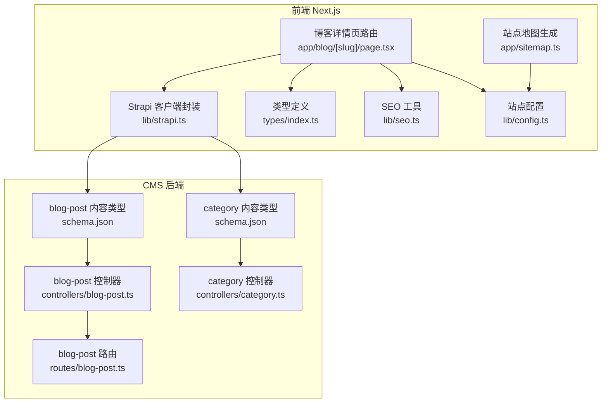
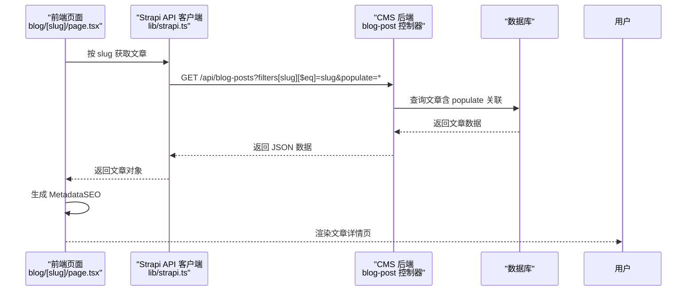
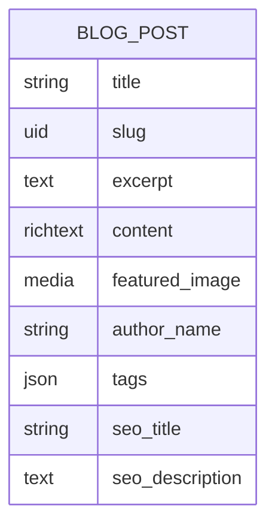
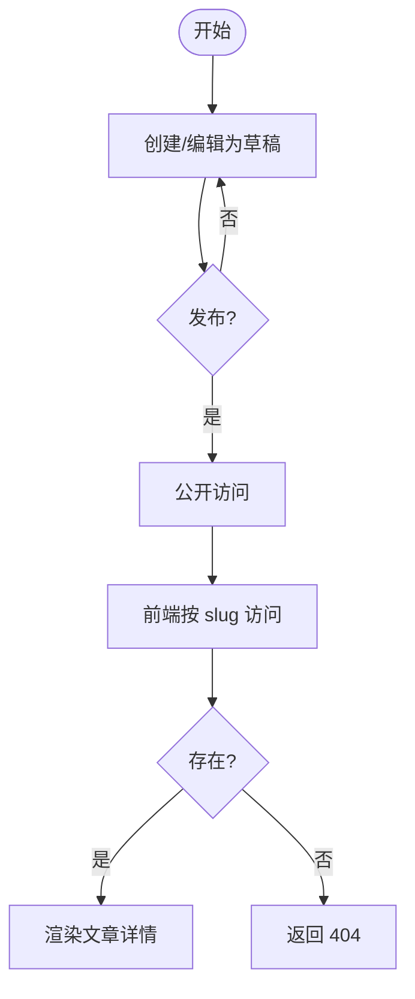
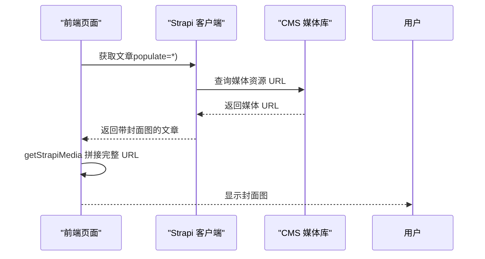
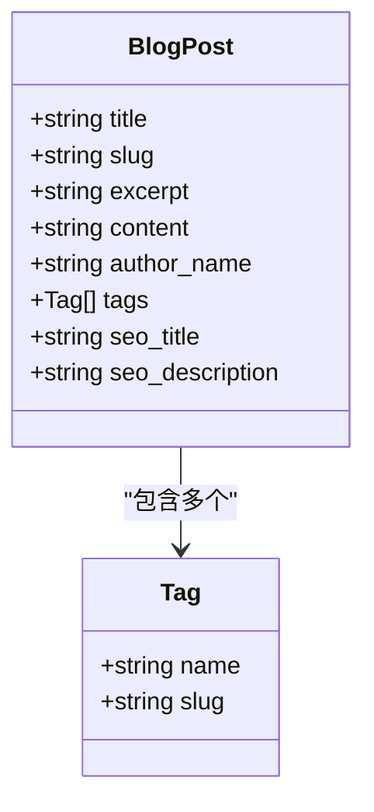
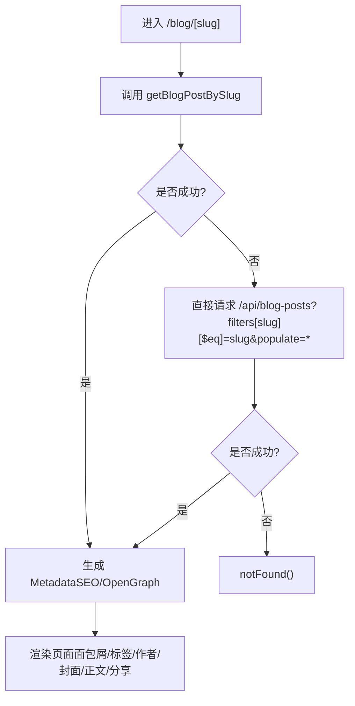
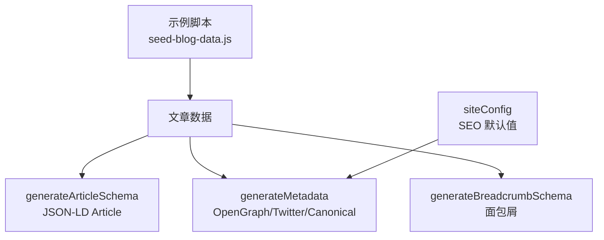
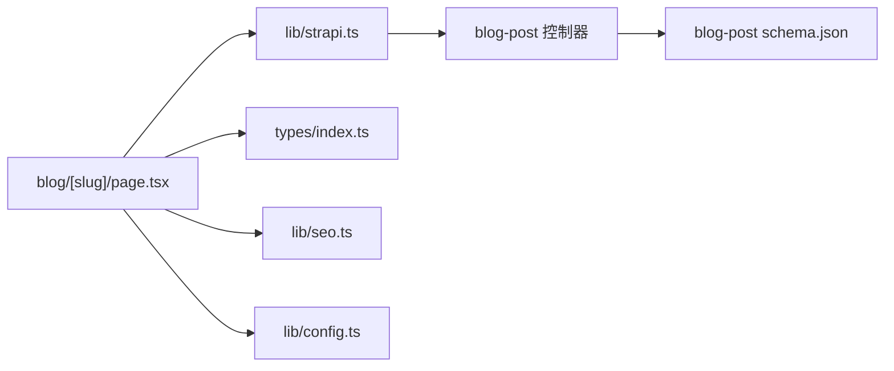

# 博客文章内容类型

<cite>
**本文引用的文件**
- [cms/src/api/blog-post/content-types/blog-post/schema.json](file://cms/src/api/blog-post/content-types/blog-post/schema.json)
- [cms/src/api/blog-post/controllers/blog-post.ts](file://cms/src/api/blog-post/controllers/blog-post.ts)
- [cms/src/api/blog-post/routes/blog-post.ts](file://cms/src/api/blog-post/routes/blog-post.ts)
- [cms/src/api/blog-post/services/blog-post.ts](file://cms/src/api/blog-post/services/blog-post.ts)
- [cms/src/api/category/content-types/category/schema.json](file://cms/src/api/category/content-types/category/schema.json)
- [cms/src/api/category/controllers/category.ts](file://cms/src/api/category/controllers/category.ts)
- [frontend/src/app/blog/[slug]/page.tsx](file://frontend/src/app/blog/[slug]/page.tsx)
- [frontend/src/lib/strapi.ts](file://frontend/src/lib/strapi.ts)
- [frontend/src/types/index.ts](file://frontend/src/types/index.ts)
- [frontend/src/lib/seo.ts](file://frontend/src/lib/seo.ts)
- [frontend/src/lib/config.ts](file://frontend/src/lib/config.ts)
- [cms/scripts/seed-blog-data.js](file://cms/scripts/seed-blog-data.js)
- [frontend/src/app/sitemap.ts](file://frontend/src/app/sitemap.ts)
</cite>

## 目录
1. [简介](#简介)
2. [项目结构](#项目结构)
3. [核心组件](#核心组件)
4. [架构总览](#架构总览)
5. [详细组件分析](#详细组件分析)
6. [依赖关系分析](#依赖关系分析)
7. [性能考量](#性能考量)
8. [故障排查指南](#故障排查指南)
9. [结论](#结论)
10. [附录](#附录)

## 简介
本文件针对博客文章内容类型进行系统化文档化，覆盖以下主题：
- 博客文章模型字段定义（标题、别名、正文、摘要、发布状态、SEO 字段）
- 发布流程与草稿功能
- 博客文章与媒体资源（图片、附件）的关系与管理
- 分类与标签系统设计
- 前端展示逻辑与路由配置
- SEO 优化策略与内容管理最佳实践

## 项目结构
该仓库采用前后端分离架构：CMS 使用 Strapi，前端使用 Next.js。博客相关内容位于 CMS 的 blog-post 内容类型与前端 Next.js 路由中。

图表来源
- [cms/src/api/blog-post/content-types/blog-post/schema.json:1-24](file://cms/src/api/blog-post/content-types/blog-post/schema.json#L1-L24)
- [cms/src/api/blog-post/controllers/blog-post.ts:1-53](file://cms/src/api/blog-post/controllers/blog-post.ts#L1-L53)
- [cms/src/api/blog-post/routes/blog-post.ts:1-35](file://cms/src/api/blog-post/routes/blog-post.ts#L1-L35)
- [cms/src/api/category/content-types/category/schema.json:1-21](file://cms/src/api/category/content-types/category/schema.json#L1-L21)
- [cms/src/api/category/controllers/category.ts:1-40](file://cms/src/api/category/controllers/category.ts#L1-L40)
- [frontend/src/app/blog/[slug]/page.tsx:1-290](file://frontend/src/app/blog/[slug]/page.tsx#L1-L290)
- [frontend/src/lib/strapi.ts:1-412](file://frontend/src/lib/strapi.ts#L1-L412)
- [frontend/src/types/index.ts:1-157](file://frontend/src/types/index.ts#L1-L157)
- [frontend/src/lib/seo.ts:1-225](file://frontend/src/lib/seo.ts#L1-L225)
- [frontend/src/lib/config.ts:1-177](file://frontend/src/lib/config.ts#L1-L177)
- [frontend/src/app/sitemap.ts:1-50](file://frontend/src/app/sitemap.ts#L1-L50)

章节来源
- [cms/src/api/blog-post/content-types/blog-post/schema.json:1-24](file://cms/src/api/blog-post/content-types/blog-post/schema.json#L1-L24)
- [frontend/src/app/blog/[slug]/page.tsx:1-290](file://frontend/src/app/blog/[slug]/page.tsx#L1-L290)

## 核心组件
- 博客文章内容类型：定义了标题、别名、正文、摘要、作者名、标签、SEO 标题与描述、以及媒体资源（封面图）等字段；启用草稿与发布能力。
- 分类内容类型：定义名称、别名、描述、图片与 SEO 字段；同样支持草稿与发布。
- 前端博客详情页：通过 Strapi 客户端按 slug 获取文章，动态生成 SEO 元数据与 Open Graph 图片，渲染文章内容与分享按钮。
- Strapi 客户端封装：统一处理 API 请求、查询参数构建、populate、分页与错误处理。
- 类型定义：前后端一致的接口契约，确保数据结构稳定。
- SEO 工具：生成 JSON-LD 结构化数据（Article）、面包屑、网站信息等。
- 站点配置：全局站点信息、导航、默认 SEO 参数。
- 站点地图：静态页面与产品分类页的 sitemap 配置（博客文章可扩展）。

章节来源
- [cms/src/api/blog-post/content-types/blog-post/schema.json:12-22](file://cms/src/api/blog-post/content-types/blog-post/schema.json#L12-L22)
- [cms/src/api/category/content-types/category/schema.json:12-19](file://cms/src/api/category/content-types/category/schema.json#L12-L19)
- [frontend/src/app/blog/[slug]/page.tsx:49-82](file://frontend/src/app/blog/[slug]/page.tsx#L49-L82)
- [frontend/src/lib/strapi.ts:51-119](file://frontend/src/lib/strapi.ts#L51-L119)
- [frontend/src/types/index.ts:68-79](file://frontend/src/types/index.ts#L68-L79)
- [frontend/src/lib/seo.ts:115-142](file://frontend/src/lib/seo.ts#L115-L142)
- [frontend/src/lib/config.ts:3-70](file://frontend/src/lib/config.ts#L3-L70)
- [frontend/src/app/sitemap.ts:4-49](file://frontend/src/app/sitemap.ts#L4-L49)

## 架构总览
博客文章从 CMS 内容模型到前端展示的完整链路如下：

图表来源
- [frontend/src/app/blog/[slug]/page.tsx:10-30](file://frontend/src/app/blog/[slug]/page.tsx#L10-L30)
- [frontend/src/lib/strapi.ts:261-265](file://frontend/src/lib/strapi.ts#L261-L265)
- [cms/src/api/blog-post/controllers/blog-post.ts:4-30](file://cms/src/api/blog-post/controllers/blog-post.ts#L4-L30)

章节来源
- [frontend/src/app/blog/[slug]/page.tsx:10-30](file://frontend/src/app/blog/[slug]/page.tsx#L10-L30)
- [frontend/src/lib/strapi.ts:261-265](file://frontend/src/lib/strapi.ts#L261-L265)
- [cms/src/api/blog-post/controllers/blog-post.ts:4-30](file://cms/src/api/blog-post/controllers/blog-post.ts#L4-L30)

## 详细组件分析

### 博客文章模型字段定义
- 标题：必填字符串
- 别名（slug）：UID 字段，自动基于标题生成，必填
- 摘要：必填文本字段
- 正文：富文本字段，必填
- 封面图：单张图片媒体资源
- 作者名：字符串，默认“Battivus Team”
- 标签：JSON 字段（示例脚本中为字符串数组）
- SEO 标题与描述：用于覆盖默认 SEO 元信息
- 草稿与发布：启用 draftAndPublish，支持草稿与发布

图表来源
- [cms/src/api/blog-post/content-types/blog-post/schema.json:12-22](file://cms/src/api/blog-post/content-types/blog-post/schema.json#L12-L22)

章节来源
- [cms/src/api/blog-post/content-types/blog-post/schema.json:12-22](file://cms/src/api/blog-post/content-types/blog-post/schema.json#L12-L22)

### 发布流程与草稿功能
- CMS 层：启用 draftAndPublish，可在后台以草稿形式保存，完成后发布上线。
- 前端层：Next.js 在构建期或运行时通过 Strapi 客户端获取文章，若未找到则返回 404。
- 示例脚本：提供批量创建示例数据，包含标题、别名、摘要、正文、作者名、标签与 SEO 字段。

图表来源
- [cms/src/api/blog-post/content-types/blog-post/schema.json:9-11](file://cms/src/api/blog-post/content-types/blog-post/schema.json#L9-L11)
- [frontend/src/app/blog/[slug]/page.tsx:84-95](file://frontend/src/app/blog/[slug]/page.tsx#L84-L95)
- [cms/scripts/seed-blog-data.js:408-426](file://cms/scripts/seed-blog-data.js#L408-L426)

章节来源
- [cms/src/api/blog-post/content-types/blog-post/schema.json:9-11](file://cms/src/api/blog-post/content-types/blog-post/schema.json#L9-L11)
- [frontend/src/app/blog/[slug]/page.tsx:84-95](file://frontend/src/app/blog/[slug]/page.tsx#L84-L95)
- [cms/scripts/seed-blog-data.js:408-426](file://cms/scripts/seed-blog-data.js#L408-L426)

### 博客文章与媒体资源的关系
- 封面图：作为媒体资源（单张图片），通过 getStrapiMedia 统一拼接完整 URL。
- 前端渲染：若存在封面图则显示图片，否则显示占位图。
- 媒体资源管理：通过 Strapi 的媒体库上传与关联，前端按需 populate。

图表来源
- [frontend/src/app/blog/[slug]/page.tsx:174-202](file://frontend/src/app/blog/[slug]/page.tsx#L174-L202)
- [frontend/src/lib/strapi.ts:11-23](file://frontend/src/lib/strapi.ts#L11-L23)

章节来源
- [frontend/src/app/blog/[slug]/page.tsx:174-202](file://frontend/src/app/blog/[slug]/page.tsx#L174-L202)
- [frontend/src/lib/strapi.ts:11-23](file://frontend/src/lib/strapi.ts#L11-L23)

### 分类与标签系统设计
- 分类（Category）：包含名称、别名、描述、图片与 SEO 字段，支持草稿与发布。
- 标签（Tags）：在博客文章模型中为 JSON 字段；示例脚本中以字符串数组形式提供，前端按字符串或对象属性渲染。
- 前端类型定义：BlogPost 接口中的 tags 为 Tag 数组，Tag 包含 name 与 slug。

图表来源
- [frontend/src/types/index.ts:68-79](file://frontend/src/types/index.ts#L68-L79)
- [frontend/src/types/index.ts:62-66](file://frontend/src/types/index.ts#L62-L66)
- [cms/scripts/seed-blog-data.js:74](file://cms/scripts/seed-blog-data.js#L74)

章节来源
- [cms/src/api/category/content-types/category/schema.json:12-19](file://cms/src/api/category/content-types/category/schema.json#L12-L19)
- [frontend/src/types/index.ts:68-79](file://frontend/src/types/index.ts#L68-L79)
- [cms/scripts/seed-blog-data.js:74](file://cms/scripts/seed-blog-data.js#L74)

### 前端展示逻辑与路由配置
- 路由：Next.js App Router 中的动态路由 app/blog/[slug]/page.tsx。
- 获取数据：优先调用 getBlogPostBySlug，失败回退到直接 API 请求；支持 populate 扩展关联。
- 动态元数据：根据文章的 seo.metaTitle 或 title、seo.metaDescription 或 excerpt 生成 Open Graph 与描述；设置 canonical 链接。
- 渲染：面包屑导航、标签、作者与时间、封面图、正文 HTML、分享按钮。
- 静态参数：generateStaticParams 根据文章列表生成静态路径，提升 SEO 与性能。

图表来源
- [frontend/src/app/blog/[slug]/page.tsx:10-30](file://frontend/src/app/blog/[slug]/page.tsx#L10-L30)
- [frontend/src/app/blog/[slug]/page.tsx:49-82](file://frontend/src/app/blog/[slug]/page.tsx#L49-L82)
- [frontend/src/app/blog/[slug]/page.tsx:32-46](file://frontend/src/app/blog/[slug]/page.tsx#L32-L46)

章节来源
- [frontend/src/app/blog/[slug]/page.tsx:10-30](file://frontend/src/app/blog/[slug]/page.tsx#L10-L30)
- [frontend/src/app/blog/[slug]/page.tsx:49-82](file://frontend/src/app/blog/[slug]/page.tsx#L49-L82)
- [frontend/src/app/blog/[slug]/page.tsx:32-46](file://frontend/src/app/blog/[slug]/page.tsx#L32-L46)

### SEO 优化策略与内容管理最佳实践
- 结构化数据：使用 generateArticleSchema 生成 Article JSON-LD，增强搜索引擎理解。
- 元数据：generateMetadata 统一生成 title、description、keywords、Open Graph 与 Twitter 卡片；支持自定义 canonical。
- 面包屑：generateBreadcrumbSchema 提供面包屑结构化数据。
- 站点配置：siteConfig 提供默认 SEO 标题模板、关键词与描述，便于全局一致性。
- 内容管理：示例脚本提供批量创建博客文章的数据样例，包含 SEO 标题与描述，便于测试与上线。

图表来源
- [frontend/src/lib/seo.ts:115-142](file://frontend/src/lib/seo.ts#L115-L142)
- [frontend/src/lib/seo.ts:168-224](file://frontend/src/lib/seo.ts#L168-L224)
- [frontend/src/lib/seo.ts:99-113](file://frontend/src/lib/seo.ts#L99-L113)
- [frontend/src/lib/config.ts:52-70](file://frontend/src/lib/config.ts#L52-L70)
- [cms/scripts/seed-blog-data.js:6-444](file://cms/scripts/seed-blog-data.js#L6-L444)

章节来源
- [frontend/src/lib/seo.ts:115-142](file://frontend/src/lib/seo.ts#L115-L142)
- [frontend/src/lib/seo.ts:168-224](file://frontend/src/lib/seo.ts#L168-L224)
- [frontend/src/lib/seo.ts:99-113](file://frontend/src/lib/seo.ts#L99-L113)
- [frontend/src/lib/config.ts:52-70](file://frontend/src/lib/config.ts#L52-L70)
- [cms/scripts/seed-blog-data.js:6-444](file://cms/scripts/seed-blog-data.js#L6-L444)

## 依赖关系分析
- 前端页面依赖 Strapi 客户端封装，后者负责构建查询参数、populate、分页与错误处理。
- 控制器支持按 ID 或 slug 查找文章，兼容数字 ID 与字符串 slug。
- 类型定义在前后端保持一致，避免数据不匹配问题。
- SEO 工具与站点配置解耦，便于维护与扩展。

图表来源
- [frontend/src/app/blog/[slug]/page.tsx:1-290](file://frontend/src/app/blog/[slug]/page.tsx#L1-L290)
- [frontend/src/lib/strapi.ts:1-412](file://frontend/src/lib/strapi.ts#L1-L412)
- [cms/src/api/blog-post/controllers/blog-post.ts:1-53](file://cms/src/api/blog-post/controllers/blog-post.ts#L1-L53)
- [cms/src/api/blog-post/content-types/blog-post/schema.json:1-24](file://cms/src/api/blog-post/content-types/blog-post/schema.json#L1-L24)
- [frontend/src/types/index.ts:1-157](file://frontend/src/types/index.ts#L1-L157)
- [frontend/src/lib/seo.ts:1-225](file://frontend/src/lib/seo.ts#L1-L225)
- [frontend/src/lib/config.ts:1-177](file://frontend/src/lib/config.ts#L1-L177)

章节来源
- [frontend/src/app/blog/[slug]/page.tsx:1-290](file://frontend/src/app/blog/[slug]/page.tsx#L1-L290)
- [frontend/src/lib/strapi.ts:1-412](file://frontend/src/lib/strapi.ts#L1-L412)
- [cms/src/api/blog-post/controllers/blog-post.ts:1-53](file://cms/src/api/blog-post/controllers/blog-post.ts#L1-L53)
- [cms/src/api/blog-post/content-types/blog-post/schema.json:1-24](file://cms/src/api/blog-post/content-types/blog-post/schema.json#L1-L24)
- [frontend/src/types/index.ts:1-157](file://frontend/src/types/index.ts#L1-L157)
- [frontend/src/lib/seo.ts:1-225](file://frontend/src/lib/seo.ts#L1-L225)
- [frontend/src/lib/config.ts:1-177](file://frontend/src/lib/config.ts#L1-L177)

## 性能考量
- 缓存与增量更新：Strapi 客户端在 fetchAPI 中设置 next.revalidate，控制缓存刷新频率，平衡新鲜度与性能。
- populate 选择：仅在需要时使用 populate，避免不必要的关联数据加载。
- 静态生成：generateStaticParams 基于已知文章生成静态路径，减少运行时请求。
- 媒体资源：getStrapiMedia 统一处理 URL，避免重复拼接逻辑，减少错误与提升可维护性。

章节来源
- [frontend/src/lib/strapi.ts:109-118](file://frontend/src/lib/strapi.ts#L109-L118)
- [frontend/src/lib/strapi.ts:261-265](file://frontend/src/lib/strapi.ts#L261-L265)
- [frontend/src/app/blog/[slug]/page.tsx:32-46](file://frontend/src/app/blog/[slug]/page.tsx#L32-L46)
- [frontend/src/lib/strapi.ts:11-23](file://frontend/src/lib/strapi.ts#L11-L23)

## 故障排查指南
- 文章不存在：前端在未找到文章时调用 notFound()，确保返回 404。
- API 错误：fetchAPI 与 fetchSingleAPI 对非 2xx 响应抛出错误或返回 null，便于定位问题。
- Slug 冲突：CMS 启用 UID 自动生成，确保 slug 唯一；如需手动修改需保证唯一性。
- 媒体资源缺失：getStrapiMedia 返回空时，前端显示占位图，避免页面布局破坏。
- SEO 元数据异常：检查 generateMetadata 输入参数与 siteConfig 默认值，确认 canonical 与 Open Graph 图片路径正确。

章节来源
- [frontend/src/app/blog/[slug]/page.tsx:84-95](file://frontend/src/app/blog/[slug]/page.tsx#L84-L95)
- [frontend/src/lib/strapi.ts:114-118](file://frontend/src/lib/strapi.ts#L114-L118)
- [frontend/src/lib/strapi.ts:153-156](file://frontend/src/lib/strapi.ts#L153-L156)
- [frontend/src/lib/strapi.ts:11-23](file://frontend/src/lib/strapi.ts#L11-L23)
- [frontend/src/lib/seo.ts:168-224](file://frontend/src/lib/seo.ts#L168-L224)
- [frontend/src/lib/config.ts:52-70](file://frontend/src/lib/config.ts#L52-L70)

## 结论
该博客文章内容类型在 Strapi 中具备完善的字段定义与草稿发布能力，结合前端 Next.js 的动态路由与 SEO 工具，实现了从内容创作到前端展示的一体化流程。通过媒体资源统一处理、结构化数据与静态参数生成，系统在可用性、SEO 与性能方面均具备良好基础。建议后续扩展：在分类与标签之间建立一对一/多对多关系，完善博客列表页与筛选功能，并在生产环境为博客文章生成站点地图条目以进一步提升 SEO。

## 附录
- API 路由：提供标准 CRUD 接口，支持按 ID 或 slug 查询。
- 控制器：实现 find、findOne（支持数字 ID 与 slug）、create、update、delete。
- 服务：当前为空实现，可扩展业务逻辑。
- 示例脚本：提供批量创建博客文章的示例数据，便于快速填充与测试。

章节来源
- [cms/src/api/blog-post/routes/blog-post.ts:1-35](file://cms/src/api/blog-post/routes/blog-post.ts#L1-L35)
- [cms/src/api/blog-post/controllers/blog-post.ts:1-53](file://cms/src/api/blog-post/controllers/blog-post.ts#L1-L53)
- [cms/src/api/blog-post/services/blog-post.ts:1-2](file://cms/src/api/blog-post/services/blog-post.ts#L1-L2)
- [cms/scripts/seed-blog-data.js:408-426](file://cms/scripts/seed-blog-data.js#L408-L426)