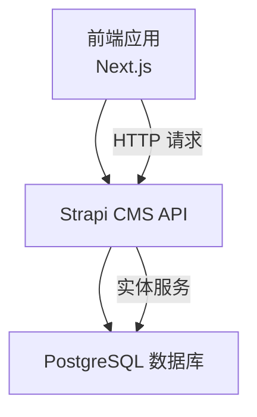
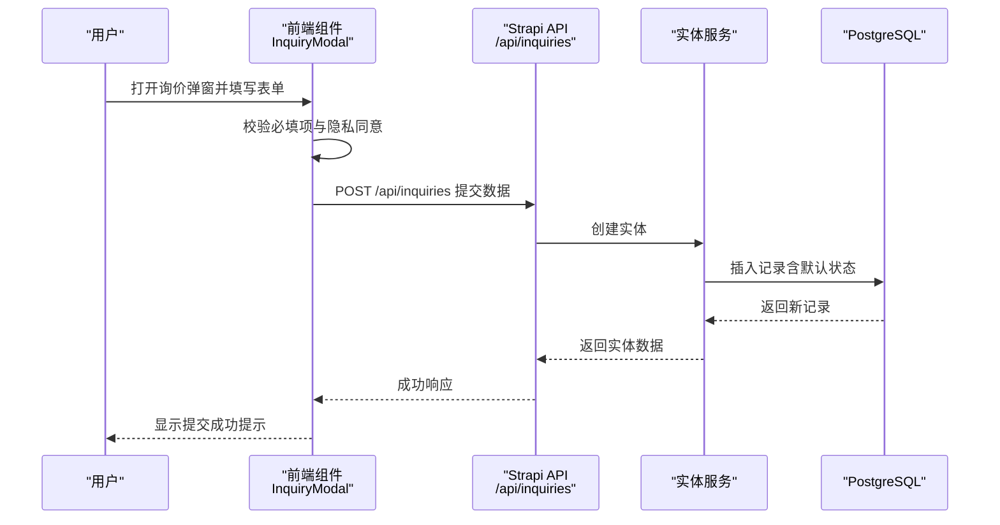
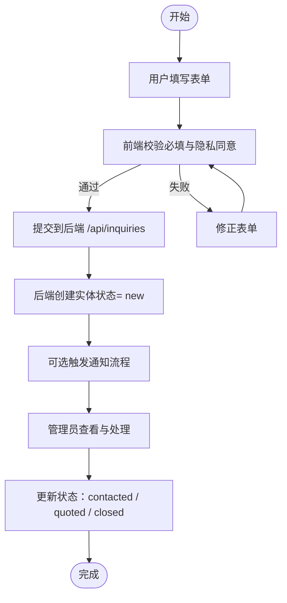
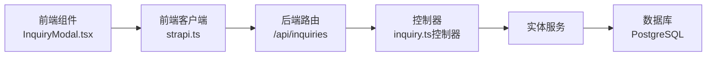

# 询价表单内容类型

<cite>
**本文引用的文件**
- [schema.json](file://cms/src/api/inquiry/content-types/inquiry/schema.json)
- [inquiry.ts（控制器）](file://cms/src/api/inquiry/controllers/inquiry.ts)
- [inquiry.ts（路由）](file://cms/src/api/inquiry/routes/inquiry.ts)
- [inquiry.ts（服务）](file://cms/src/api/inquiry/services/inquiry.ts)
- [strapi.ts（前端客户端）](file://frontend/src/lib/strapi.ts)
- [InquiryModal.tsx（前端组件）](file://frontend/src/components/forms/InquiryModal.tsx)
- [index.ts（CMS引导与权限）](file://cms/src/index.ts)
- [database.ts（数据库配置）](file://cms/config/database.ts)
- [middlewares.ts（中间件配置）](file://cms/config/middlewares.ts)
- [plugins.ts（插件配置）](file://cms/config/plugins.ts)
- [index.ts（前端类型定义）](file://frontend/src/types/index.ts)
</cite>

## 目录
1. [简介](#简介)
2. [项目结构](#项目结构)
3. [核心组件](#核心组件)
4. [架构总览](#架构总览)
5. [详细组件分析](#详细组件分析)
6. [依赖关系分析](#依赖关系分析)
7. [性能考虑](#性能考虑)
8. [故障排查指南](#故障排查指南)
9. [结论](#结论)
10. [附录](#附录)

## 简介
本文件围绕“询价表单内容类型”进行系统化技术文档编写，覆盖以下方面：
- 询价模型字段定义与用途
- 用户提交到管理员处理的完整工作流
- 数据存储结构与查询优化建议
- 通知邮件集成与自动化处理思路
- 安全性与隐私保护措施
- 通过 API 管理与导出统计报告的方法

## 项目结构
该系统采用前后端分离架构：前端 Next.js 应用负责展示与交互；后端 Strapi CMS 提供内容管理与数据持久化。询价功能由 CMS 的内容类型与 API 控制器共同实现，并通过前端组件触发提交。

图表来源
- [database.ts:1-15](file://cms/config/database.ts#L1-L15)
- [middlewares.ts:1-32](file://cms/config/middlewares.ts#L1-L32)
- [plugins.ts:1-19](file://cms/config/plugins.ts#L1-L19)

章节来源
- [database.ts:1-15](file://cms/config/database.ts#L1-L15)
- [middlewares.ts:1-32](file://cms/config/middlewares.ts#L1-L32)
- [plugins.ts:1-19](file://cms/config/plugins.ts#L1-L19)

## 核心组件
- 内容类型定义：在 CMS 中定义了“询价”集合类型，包含客户信息、产品信息与处理状态等字段。
- 前端表单组件：提供弹窗式询价表单，收集必要信息并调用后端 API 提交。
- 后端控制器：提供标准 CRUD 接口，支持查询、创建、更新与删除。
- 路由映射：将 HTTP 方法映射到控制器方法。
- 权限与引导：CMS 引导脚本自动为公共角色开启“创建”权限，确保前端可匿名提交。

章节来源
- [schema.json:1-25](file://cms/src/api/inquiry/content-types/inquiry/schema.json#L1-L25)
- [InquiryModal.tsx:1-370](file://frontend/src/components/forms/InquiryModal.tsx#L1-L370)
- [inquiry.ts（控制器）:1-40](file://cms/src/api/inquiry/controllers/inquiry.ts#L1-L40)
- [inquiry.ts（路由）:1-35](file://cms/src/api/inquiry/routes/inquiry.ts#L1-L35)
- [index.ts（CMS引导与权限）:161-217](file://cms/src/index.ts#L161-L217)

## 架构总览
从前端到后端的数据流如下：

图表来源
- [InquiryModal.tsx:46-95](file://frontend/src/components/forms/InquiryModal.tsx#L46-L95)
- [strapi.ts:290-306](file://frontend/src/lib/strapi.ts#L290-L306)
- [inquiry.ts（控制器）:19-24](file://cms/src/api/inquiry/controllers/inquiry.ts#L19-L24)
- [schema.json:12-23](file://cms/src/api/inquiry/content-types/inquiry/schema.json#L12-L23)

## 详细组件分析

### 字段定义与用途
- 客户基本信息
  - 姓名：字符串，必填
  - 邮箱：邮箱格式，必填
  - 公司：字符串（可选）
  - 国家：字符串（可选）
- 产品相关信息
  - 产品名称：字符串（可选）
  - 产品 SKU：字符串（可选）
  - 产品链接：字符串（可选）
  - 来源页面：字符串（可选），用于追踪来源
- 处理状态
  - 状态：枚举，取值为 new、contacted、quoted、closed，默认 new
- 其他
  - 备注/需求描述：文本，必填

字段来源与默认值
- 字段定义与默认状态均来自内容类型 schema
- 默认状态为 new，表示刚提交待处理

章节来源
- [schema.json:12-23](file://cms/src/api/inquiry/content-types/inquiry/schema.json#L12-L23)

### 前端表单组件
- 表单字段与后端一致，包含必填校验与隐私政策勾选
- 提交时将产品名称、SKU、URL 与来源页面一并传给后端
- 提交成功后显示确认提示并自动关闭弹窗

章节来源
- [InquiryModal.tsx:22-95](file://frontend/src/components/forms/InquiryModal.tsx#L22-L95)
- [strapi.ts:290-306](file://frontend/src/lib/strapi.ts#L290-L306)
- [index.ts（CMS引导与权限）:186-188](file://cms/src/index.ts#L186-L188)

### 后端控制器与路由
- 控制器提供标准 CRUD 方法：find、findOne、create、update、delete
- 路由将 HTTP 方法映射到对应控制器方法
- 服务层为空实现，便于后续扩展业务逻辑（如发送邮件、状态流转）

章节来源
- [inquiry.ts（控制器）:1-40](file://cms/src/api/inquiry/controllers/inquiry.ts#L1-L40)
- [inquiry.ts（路由）:1-35](file://cms/src/api/inquiry/routes/inquiry.ts#L1-L35)
- [inquiry.ts（服务）:1-2](file://cms/src/api/inquiry/services/inquiry.ts#L1-L2)

### 权限与公开访问
- CMS 引导脚本为公共角色授予“创建”权限，允许匿名提交
- 其余读取接口未显式开放，需结合实际安全策略调整

章节来源
- [index.ts（CMS引导与权限）:186-210](file://cms/src/index.ts#L186-L210)

### 数据存储与查询优化
- 存储介质：PostgreSQL
- 查询优化建议
  - 在状态字段上建立索引以加速筛选
  - 在来源字段与产品相关字段上建立复合索引以提升报表与筛选效率
  - 对时间戳字段建立索引以便按时间范围查询
  - 使用分页参数限制返回条数，避免一次性拉取过多数据

章节来源
- [database.ts:1-15](file://cms/config/database.ts#L1-L15)

### 工作流程（从提交到处理）

图表来源
- [InquiryModal.tsx:46-95](file://frontend/src/components/forms/InquiryModal.tsx#L46-L95)
- [inquiry.ts（控制器）:19-24](file://cms/src/api/inquiry/controllers/inquiry.ts#L19-L24)
- [schema.json:22](file://cms/src/api/inquiry/content-types/inquiry/schema.json#L22)

### API 管理与导出统计
- 列表查询：GET /api/inquiries 支持分页与过滤
- 单条查询：GET /api/inquiries/:id
- 更新状态：PUT /api/inquiries/:id
- 删除：DELETE /api/inquiries/:id
- 导出统计：可在后端或前端基于查询结果生成报表，建议按状态、来源、时间维度聚合

章节来源
- [inquiry.ts（路由）:1-35](file://cms/src/api/inquiry/routes/inquiry.ts#L1-L35)
- [inquiry.ts（控制器）:4-38](file://cms/src/api/inquiry/controllers/inquiry.ts#L4-L38)

### 通知邮件与自动化处理
- 当前代码未包含邮件发送逻辑
- 建议在控制器或服务层增加钩子，在创建成功后触发异步任务（如队列或 Webhook），调用邮件服务
- 可结合第三方邮件服务（如 SMTP、SendGrid、Mailgun）实现模板化通知

章节来源
- [inquiry.ts（服务）:1-2](file://cms/src/api/inquiry/services/inquiry.ts#L1-L2)

### 安全性与隐私保护
- CORS 配置允许跨域请求，便于前端部署在不同域名
- CSRF/CSP 策略已在中间件中配置
- 建议
  - 为敏感接口启用鉴权（如管理员端）
  - 对输入进行严格清洗与长度限制
  - 隐私政策勾选为必选项，前端已强制
  - 如需上传附件，使用受控的媒体服务（当前配置为 Cloudinary）

章节来源
- [middlewares.ts:1-32](file://cms/config/middlewares.ts#L1-L32)
- [plugins.ts:1-19](file://cms/config/plugins.ts#L1-L19)
- [InquiryModal.tsx:298-318](file://frontend/src/components/forms/InquiryModal.tsx#L298-L318)

## 依赖关系分析

图表来源
- [InquiryModal.tsx:5-6](file://frontend/src/components/forms/InquiryModal.tsx#L5-L6)
- [strapi.ts:290-306](file://frontend/src/lib/strapi.ts#L290-L306)
- [inquiry.ts（路由）:1-35](file://cms/src/api/inquiry/routes/inquiry.ts#L1-L35)
- [inquiry.ts（控制器）:19-24](file://cms/src/api/inquiry/controllers/inquiry.ts#L19-L24)
- [database.ts:1-15](file://cms/config/database.ts#L1-L15)

章节来源
- [strapi.ts:290-306](file://frontend/src/lib/strapi.ts#L290-L306)
- [inquiry.ts（路由）:1-35](file://cms/src/api/inquiry/routes/inquiry.ts#L1-L35)
- [inquiry.ts（控制器）:19-24](file://cms/src/api/inquiry/controllers/inquiry.ts#L19-L24)
- [database.ts:1-15](file://cms/config/database.ts#L1-L15)

## 性能考虑
- 分页与排序：列表查询应使用分页与排序参数，避免一次性加载大量数据
- 过滤条件：根据常用筛选维度（状态、来源、时间）建立索引
- 缓存策略：前端可利用缓存减少重复请求，但注意询价数据的时效性
- 数据库连接池与 SSL：生产环境建议开启 SSL 并合理配置连接池参数

## 故障排查指南
- 提交失败
  - 检查前端网络请求是否成功到达后端
  - 查看后端日志与错误响应
- 权限问题
  - 确认公共角色具备“创建”权限
- CORS 报错
  - 检查中间件中的 CORS 配置
- 数据库异常
  - 检查 PostgreSQL 连接参数与 SSL 设置

章节来源
- [index.ts（CMS引导与权限）:186-210](file://cms/src/index.ts#L186-L210)
- [middlewares.ts:18-24](file://cms/config/middlewares.ts#L18-L24)
- [database.ts:1-15](file://cms/config/database.ts#L1-L15)

## 结论
本系统通过简洁的“询价”内容类型与标准 API 实现了从用户提交到后台管理的完整闭环。建议在现有基础上增强：
- 自动化通知与状态流转
- 更细粒度的权限控制
- 查询与导出的统计能力
- 输入验证与隐私合规

## 附录
- 类型定义参考：前端类型与后端 schema 保持一致，便于统一维护
- 部署与运行：数据库为 PostgreSQL，中间件与插件配置位于 cms/config 下

章节来源
- [index.ts（前端类型定义）:109-121](file://frontend/src/types/index.ts#L109-L121)
- [schema.json:12-23](file://cms/src/api/inquiry/content-types/inquiry/schema.json#L12-L23)