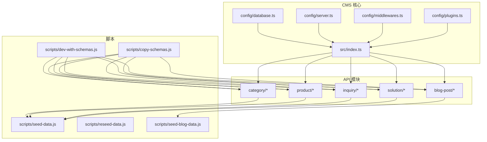
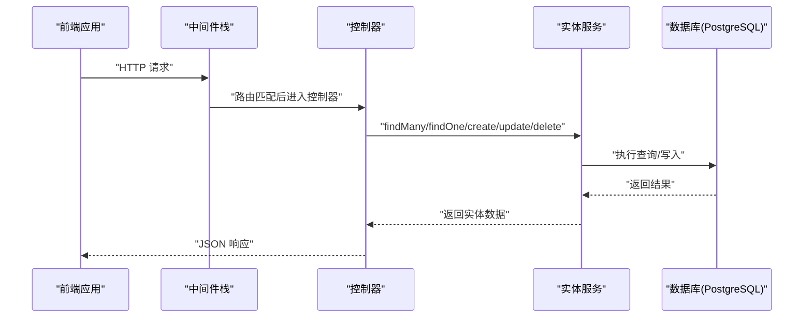
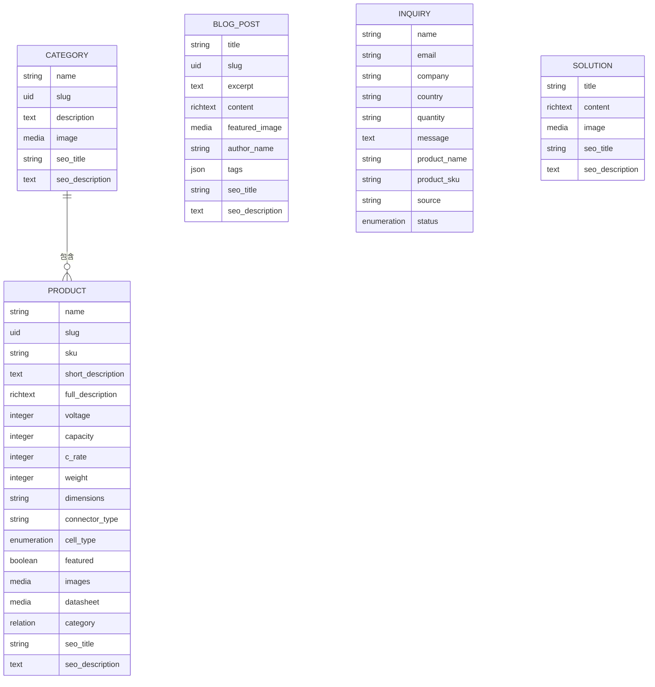
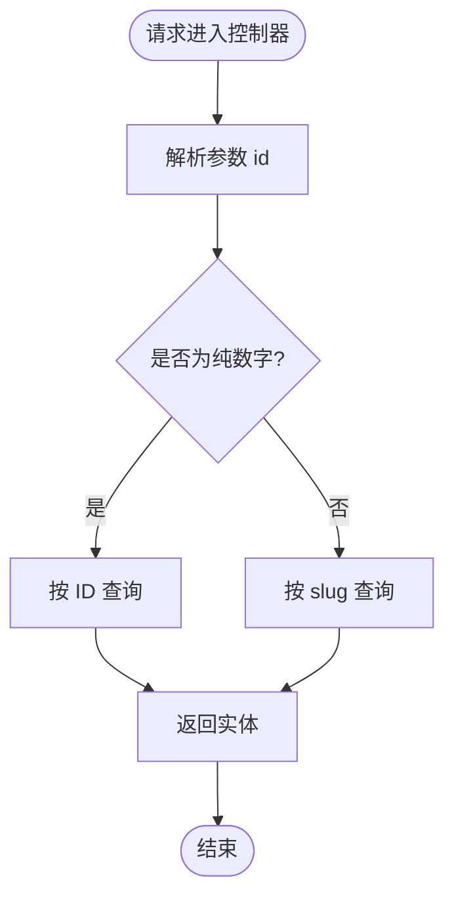
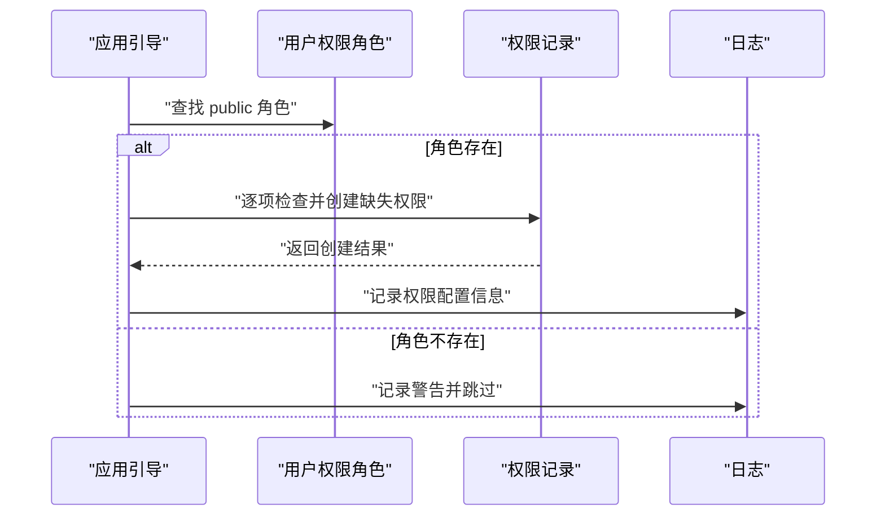
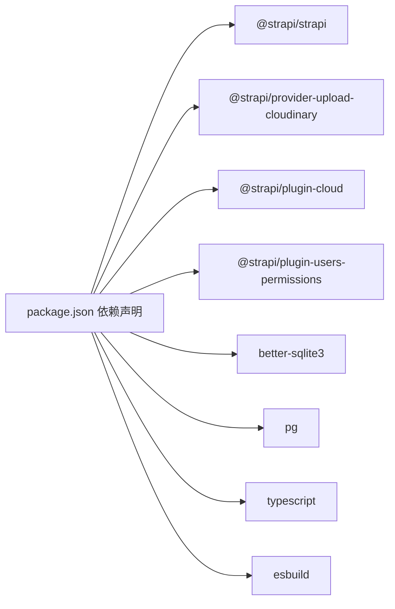

# 后端系统（Strapi CMS）

<cite>
**本文引用的文件**
- [package.json](file://cms/package.json)
- [src/index.ts](file://cms/src/index.ts)
- [config/server.ts](file://cms/config/server.ts)
- [config/database.ts](file://cms/config/database.ts)
- [config/plugins.ts](file://cms/config/plugins.ts)
- [config/middlewares.ts](file://cms/config/middlewares.ts)
- [src/api/category/content-types/category/schema.json](file://cms/src/api/category/content-types/category/schema.json)
- [src/api/product/content-types/product/schema.json](file://cms/src/api/product/content-types/product/schema.json)
- [src/api/blog-post/content-types/blog-post/schema.json](file://cms/src/api/blog-post/content-types/blog-post/schema.json)
- [src/api/inquiry/content-types/inquiry/schema.json](file://cms/src/api/inquiry/content-types/inquiry/schema.json)
- [src/api/category/controllers/category.ts](file://cms/src/api/category/controllers/category.ts)
- [src/api/product/controllers/product.ts](file://cms/src/api/product/controllers/product.ts)
- [src/api/blog-post/controllers/blog-post.ts](file://cms/src/api/blog-post/controllers/blog-post.ts)
- [src/api/inquiry/controllers/inquiry.ts](file://cms/src/api/inquiry/controllers/inquiry.ts)
- [src/api/solution/controllers/solution.ts](file://cms/src/api/solution/controllers/solution.ts)
- [src/api/category/services/category.ts](file://cms/src/api/category/services/category.ts)
- [src/api/product/services/product.ts](file://cms/src/api/product/services/product.ts)
- [src/api/blog-post/services/blog-post.ts](file://cms/src/api/blog-post/services/blog-post.ts)
- [scripts/seed-data.js](file://cms/scripts/seed-data.js)
- [scripts/reseed-data.js](file://cms/scripts/reseed-data.js)
- [scripts/seed-blog-data.js](file://cms/scripts/seed-blog-data.js)
- [scripts/dev-with-schemas.js](file://cms/scripts/dev-with-schemas.js)
- [scripts/copy-schemas.js](file://cms/scripts/copy-schemas.js)
- [Dockerfile](file://cms/Dockerfile)
- [docker-compose.yml](file://cms/docker-compose.yml)
- [DEPLOYMENT.md](file://DEPLOYMENT.md)
- [WEBSITE_ARCHITECTURE.md](file://WEBSITE_ARCHITECTURE.md)
</cite>

## 目录
1. [简介](#简介)
2. [项目结构](#项目结构)
3. [核心组件](#核心组件)
4. [架构总览](#架构总览)
5. [详细组件分析](#详细组件分析)
6. [依赖关系分析](#依赖关系分析)
7. [性能考虑](#性能考虑)
8. [故障排查指南](#故障排查指南)
9. [结论](#结论)
10. [附录](#附录)

## 简介
本文件为 Battivus 后端系统（基于 Strapi 的 Headless CMS）的综合技术文档，覆盖架构设计、内容类型定义、API 接口规范、控制器与服务层实现、权限与中间件配置、插件系统、数据模型关系、SEO 与媒体资源策略、以及与前端的交互模式与性能优化建议。文档同时提供最佳实践、数据验证规则与业务逻辑说明，并通过图示帮助开发者理解与扩展 CMS 功能。

## 项目结构
CMS 采用 Strapi v5 的标准目录结构，按功能域划分 API 模块（category、product、blog-post、inquiry、solution），每个模块包含内容类型定义、控制器、服务层与路由文件。配置位于 config 目录，脚本位于 scripts 目录，静态资源与上传由 Cloudinary 提供支持。

图表来源
- [src/index.ts:149-217](file://cms/src/index.ts#L149-L217)
- [config/database.ts:1-15](file://cms/config/database.ts#L1-L15)
- [config/server.ts:1-11](file://cms/config/server.ts#L1-L11)
- [config/middlewares.ts:1-32](file://cms/config/middlewares.ts#L1-L32)
- [config/plugins.ts:1-19](file://cms/config/plugins.ts#L1-L19)

章节来源
- [package.json:1-36](file://cms/package.json#L1-L36)
- [src/index.ts:149-217](file://cms/src/index.ts#L149-L217)

## 核心组件
- 应用引导与种子数据：在应用启动时自动配置公共角色的 API 权限，并根据期望的分类与产品数据进行数据库重播种，确保内容与前端导航一致。
- 配置中心：数据库连接（PostgreSQL）、服务器参数（host/port/app keys/webhooks）、中间件（CORS/安全策略/日志/查询等）、插件（Cloudinary 上传）。
- 内容类型：Category、Product、Blog Post、Inquiry、Solution，均启用草稿/发布（draftAndPublish）以支持预览与发布流程。
- 控制器：统一的 CRUD 控制器，部分模块（如 Blog Post）对 slug/ID 做了兼容处理。
- 服务层：当前为空实现，便于扩展业务逻辑（如数据转换、事件钩子、第三方集成）。
- 脚本工具：开发与构建流程自动化，包括复制 schema、增量开发模式、种子数据与博客数据导入。

章节来源
- [src/index.ts:161-217](file://cms/src/index.ts#L161-L217)
- [config/server.ts:1-11](file://cms/config/server.ts#L1-L11)
- [config/database.ts:1-15](file://cms/config/database.ts#L1-L15)
- [config/plugins.ts:1-19](file://cms/config/plugins.ts#L1-L19)
- [config/middlewares.ts:1-32](file://cms/config/middlewares.ts#L1-L32)

## 架构总览
下图展示了从客户端到 Strapi 后端的典型请求路径，包括中间件处理、控制器调用与实体服务访问。

图表来源
- [config/middlewares.ts:1-32](file://cms/config/middlewares.ts#L1-L32)
- [src/api/category/controllers/category.ts:1-40](file://cms/src/api/category/controllers/category.ts#L1-L40)
- [src/api/product/controllers/product.ts:1-40](file://cms/src/api/product/controllers/product.ts#L1-L40)
- [src/api/blog-post/controllers/blog-post.ts:1-53](file://cms/src/api/blog-post/controllers/blog-post.ts#L1-L53)
- [src/api/inquiry/controllers/inquiry.ts:1-40](file://cms/src/api/inquiry/controllers/inquiry.ts#L1-L40)
- [src/api/solution/controllers/solution.ts:1-40](file://cms/src/api/solution/controllers/solution.ts#L1-L40)

## 详细组件分析

### 数据模型与内容类型
- Category（分类）
  - 关键字段：名称、唯一标识（UID）、描述、图片、SEO 标题与描述。
  - 草稿/发布：启用。
  - 关系：Product 多对一关联至 Category。
- Product（产品）
  - 关键字段：名称、SKU（唯一）、短描述、富文本详情、电压/容量/C-rate/重量/尺寸/连接器/电芯类型、是否精选、图片集、数据表、所属分类、SEO 标题与描述。
  - 草稿/发布：启用。
  - 关系：Category 多对一。
- Blog Post（博客文章）
  - 关键字段：标题、UID、摘要、富文本内容、特色图片、作者名、标签（JSON）、SEO 标题与描述。
  - 草稿/发布：启用。
- Inquiry（询价单）
  - 关键字段：姓名、邮箱、公司、国家、数量、消息、产品名/编号、来源、状态（枚举，默认 new）。
  - 草稿/发布：禁用。
- Solution（解决方案）
  - 控制器存在，内容类型定义未在当前快照中提供；可按 Category/Product 模式扩展。

图表来源
- [src/api/category/content-types/category/schema.json:1-21](file://cms/src/api/category/content-types/category/schema.json#L1-L21)
- [src/api/product/content-types/product/schema.json:1-33](file://cms/src/api/product/content-types/product/schema.json#L1-L33)
- [src/api/blog-post/content-types/blog-post/schema.json:1-24](file://cms/src/api/blog-post/content-types/blog-post/schema.json#L1-L24)
- [src/api/inquiry/content-types/inquiry/schema.json:1-25](file://cms/src/api/inquiry/content-types/inquiry/schema.json#L1-L25)

章节来源
- [src/api/category/content-types/category/schema.json:1-21](file://cms/src/api/category/content-types/category/schema.json#L1-L21)
- [src/api/product/content-types/product/schema.json:1-33](file://cms/src/api/product/content-types/product/schema.json#L1-L33)
- [src/api/blog-post/content-types/blog-post/schema.json:1-24](file://cms/src/api/blog-post/content-types/blog-post/schema.json#L1-L24)
- [src/api/inquiry/content-types/inquiry/schema.json:1-25](file://cms/src/api/inquiry/content-types/inquiry/schema.json#L1-L25)

### 控制器与 API 行为
- Category/Product/Solution 控制器
  - 统一提供 find/findOne/create/update/delete，使用 strapi.entityService 访问数据。
  - 返回结构为 { data: ... }，遵循 Strapi JSON API 约定。
- Blog Post 控制器
  - findOne 支持数字 ID 与 slug 两种形式：若为纯数字则按 ID 查询；否则按 slug 查询首条记录。
- Inquiry 控制器
  - 标准 CRUD，用于接收前端询价表单提交。

图表来源
- [src/api/blog-post/controllers/blog-post.ts:11-30](file://cms/src/api/blog-post/controllers/blog-post.ts#L11-L30)

章节来源
- [src/api/category/controllers/category.ts:1-40](file://cms/src/api/category/controllers/category.ts#L1-L40)
- [src/api/product/controllers/product.ts:1-40](file://cms/src/api/product/controllers/product.ts#L1-L40)
- [src/api/blog-post/controllers/blog-post.ts:1-53](file://cms/src/api/blog-post/controllers/blog-post.ts#L1-L53)
- [src/api/inquiry/controllers/inquiry.ts:1-40](file://cms/src/api/inquiry/controllers/inquiry.ts#L1-L40)
- [src/api/solution/controllers/solution.ts:1-40](file://cms/src/api/solution/controllers/solution.ts#L1-L40)

### 服务层与业务逻辑
- 当前服务层为空实现，适合后续扩展：
  - 数据转换与标准化
  - 事件钩子（如发布后通知）
  - 第三方集成（邮件、库存、报价系统）
  - SEO 与元数据生成
  - 批量导入/导出

章节来源
- [src/api/category/services/category.ts:1-2](file://cms/src/api/category/services/category.ts#L1-L2)
- [src/api/product/services/product.ts:1-2](file://cms/src/api/product/services/product.ts#L1-L2)
- [src/api/blog-post/services/blog-post.ts:1-2](file://cms/src/api/blog-post/services/blog-post.ts#L1-L2)

### 权限管理与中间件
- 公共 API 权限
  - 在应用启动时，为“public”角色自动授予以下动作：
    - 分类：find、findOne
    - 产品：find、findOne
    - 博文：find、findOne
    - 解决方案：find、findOne
    - 询价：create
  - 若角色不存在或权限已存在，则跳过或记录告警。
- 中间件栈
  - 安全策略（CSP）限制资源来源，允许 Cloudinary 图片与媒体加载。
  - CORS 允许任意来源与头部，便于前端部署在不同域名/预览环境。
  - 日志、错误处理、查询、Body 解析、会话、favicon、静态资源等。
- 服务器配置
  - 主机、端口、应用密钥数组、Webhook 关系填充开关。

图表来源
- [src/index.ts:161-210](file://cms/src/index.ts#L161-L210)

章节来源
- [src/index.ts:161-210](file://cms/src/index.ts#L161-L210)
- [config/middlewares.ts:1-32](file://cms/config/middlewares.ts#L1-L32)
- [config/server.ts:1-11](file://cms/config/server.ts#L1-L11)

### 插件系统与媒体上传
- 上传插件：Cloudinary 提供商，支持上传与删除操作选项。
- 环境变量：云名称、API Key、Secret。
- 媒体类型：图片与文件，分别用于产品图片、数据表、博文特色图等。

章节来源
- [config/plugins.ts:1-19](file://cms/config/plugins.ts#L1-L19)

### 数据库与连接
- 连接类型：PostgreSQL
- 默认主机、端口、数据库名、用户名、密码、SSL 开关均可通过环境变量覆盖
- 生产环境建议开启 SSL 并使用强密码

章节来源
- [config/database.ts:1-15](file://cms/config/database.ts#L1-L15)

### 种子数据与开发脚本
- 种子数据
  - 分类：FPV、农业无人机、VTOL、工业巡检四大类，含 SEO 标题与描述。
  - 产品：按分类分组，包含电压、容量、C-rate、重量、尺寸、连接器、电芯类型、是否精选等属性。
  - 博文：标题、摘要、内容、作者、标签、SEO 字段。
- 重播种逻辑
  - 检测现有分类与产品关系完整性，若不满足则删除旧数据并重新创建。
  - 使用 Strapi v5 的 documentId 关联方式设置多对一关系。
- 开发脚本
  - 复制 schema、增量开发模式、种子与博客数据导入、构建后复制 schema。

章节来源
- [src/index.ts:1-315](file://cms/src/index.ts#L1-L315)
- [scripts/seed-data.js](file://cms/scripts/seed-data.js)
- [scripts/reseed-data.js](file://cms/scripts/reseed-data.js)
- [scripts/seed-blog-data.js](file://cms/scripts/seed-blog-data.js)
- [scripts/dev-with-schemas.js](file://cms/scripts/dev-with-schemas.js)
- [scripts/copy-schemas.js](file://cms/scripts/copy-schemas.js)

## 依赖关系分析
- 运行时依赖
  - Strapi 核心与云插件、用户权限插件、Cloudinary 上传提供商、SQLite/PG 驱动。
- 开发依赖
  - TypeScript、ESBuild。
- Node 版本要求
  - >=18 且 <=22。

图表来源
- [package.json:14-29](file://cms/package.json#L14-L29)

章节来源
- [package.json:14-36](file://cms/package.json#L14-L36)

## 性能考虑
- 数据库
  - PostgreSQL 生产部署，建议：
    - 为常用查询字段建立索引（如 Product.category、Blog Post.slug、Category.slug）。
    - 合理使用分页与过滤，避免一次性返回大量数据。
    - 对富文本与媒体字段进行懒加载或延迟渲染。
- 缓存策略
  - 前端可缓存静态页面与列表页；内容变更后失效对应缓存。
  - CDN 加速 Cloudinary 资源，减少带宽与延迟。
- 中间件
  - CSP 仅允许必要来源，降低安全风险。
  - CORS 允许所有来源便于开发，生产环境建议限定来源。
- 构建与部署
  - 使用构建产物与 schema 复制脚本，确保前后端一致性。
  - Docker 与 docker-compose 支持容器化部署与本地开发。

章节来源
- [config/middlewares.ts:1-32](file://cms/config/middlewares.ts#L1-L32)
- [config/database.ts:1-15](file://cms/config/database.ts#L1-L15)
- [Dockerfile](file://cms/Dockerfile)
- [docker-compose.yml](file://cms/docker-compose.yml)

## 故障排查指南
- 权限相关
  - 症状：公开 API 访问被拒绝。
  - 排查：确认“public”角色是否存在，以及相应动作权限是否已创建；查看引导日志输出。
- 数据不一致
  - 症状：产品无分类或分类缺失。
  - 排查：触发重播种流程，检查分类与产品数量及 slug 是否匹配。
- 上传失败
  - 症状：媒体上传报错。
  - 排查：核对 Cloudinary 环境变量、网络连通性与提供商配置。
- CORS 问题
  - 症状：跨域请求失败。
  - 排查：生产环境建议限制 origin；开发阶段可临时放宽。
- 数据库连接
  - 症状：无法连接数据库。
  - 排查：核对 HOST/PORT/NAME/USERNAME/PASSWORD/SSL 环境变量。

章节来源
- [src/index.ts:161-210](file://cms/src/index.ts#L161-L210)
- [config/plugins.ts:1-19](file://cms/config/plugins.ts#L1-L19)
- [config/middlewares.ts:1-32](file://cms/config/middlewares.ts#L1-L32)
- [config/database.ts:1-15](file://cms/config/database.ts#L1-L15)

## 结论
本 CMS 基于 Strapi v5 实现，采用模块化内容类型与标准 CRUD 控制器，结合 Cloudinary 媒体上传与 PostgreSQL 数据存储，具备良好的扩展性与可维护性。通过引导期的权限配置与种子数据播种，确保内容与前端导航一致。建议在生产环境中完善索引、缓存与安全策略，并在服务层逐步引入业务逻辑与事件钩子，以支撑更复杂的业务场景。

## 附录

### API 端点规范（概览）
- 分类（Category）
  - GET /categories
  - GET /categories/:id
  - POST /categories
  - PUT /categories/:id
  - DELETE /categories/:id
- 产品（Product）
  - GET /products
  - GET /products/:id
  - POST /products
  - PUT /products/:id
  - DELETE /products/:id
- 博客（Blog Post）
  - GET /blog-posts
  - GET /blog-posts/:id 或 /blog-posts/:slug
  - POST /blog-posts
  - PUT /blog-posts/:id
  - DELETE /blog-posts/:id
- 询价（Inquiry）
  - GET /inquiries
  - GET /inquiries/:id
  - POST /inquiries
  - PUT /inquiries/:id
  - DELETE /inquiries/:id
- 解决方案（Solution）
  - GET /solutions
  - GET /solutions/:id
  - POST /solutions
  - PUT /solutions/:id
  - DELETE /solutions/:id

说明
- 所有端点遵循 Strapi JSON API 响应结构 { data: ... }。
- 发布/草稿：除 Inquiry 外，其余内容类型均支持 draftAndPublish。
- 认证：公共 API 通过“public”角色权限控制；管理后台需登录用户权限插件。

章节来源
- [src/api/category/controllers/category.ts:1-40](file://cms/src/api/category/controllers/category.ts#L1-L40)
- [src/api/product/controllers/product.ts:1-40](file://cms/src/api/product/controllers/product.ts#L1-L40)
- [src/api/blog-post/controllers/blog-post.ts:1-53](file://cms/src/api/blog-post/controllers/blog-post.ts#L1-L53)
- [src/api/inquiry/controllers/inquiry.ts:1-40](file://cms/src/api/inquiry/controllers/inquiry.ts#L1-L40)
- [src/api/solution/controllers/solution.ts:1-40](file://cms/src/api/solution/controllers/solution.ts#L1-L40)

### 配置清单
- 数据库
  - DATABASE_HOST、DATABASE_PORT、DATABASE_NAME、DATABASE_USERNAME、DATABASE_PASSWORD、DATABASE_SSL
- 服务器
  - HOST、PORT、APP_KEYS（数组）、WEBHOOKS_POPULATE_RELATIONS
- 上传
  - CLOUDINARY_NAME、CLOUDINARY_KEY、CLOUDINARY_SECRET
- 中间件
  - CORS 允许来源与头部；CSP 指令限制媒体与图片来源

章节来源
- [config/database.ts:1-15](file://cms/config/database.ts#L1-L15)
- [config/server.ts:1-11](file://cms/config/server.ts#L1-L11)
- [config/plugins.ts:1-19](file://cms/config/plugins.ts#L1-L19)
- [config/middlewares.ts:1-32](file://cms/config/middlewares.ts#L1-L32)