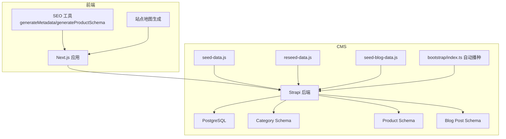
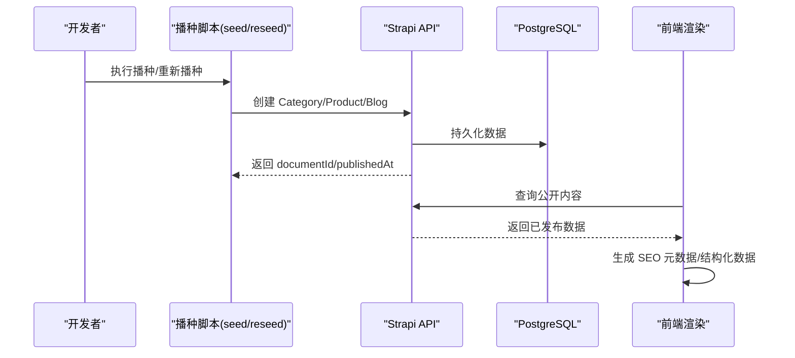
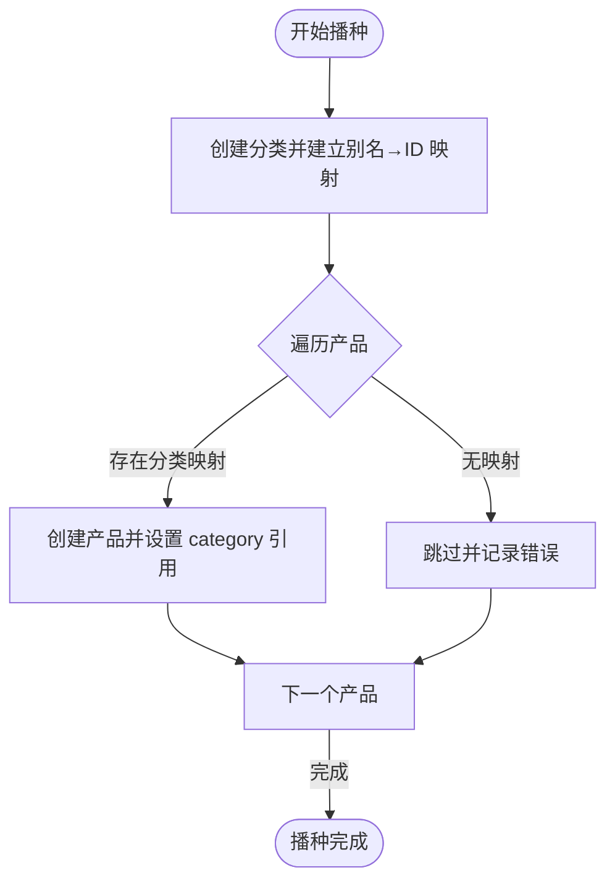
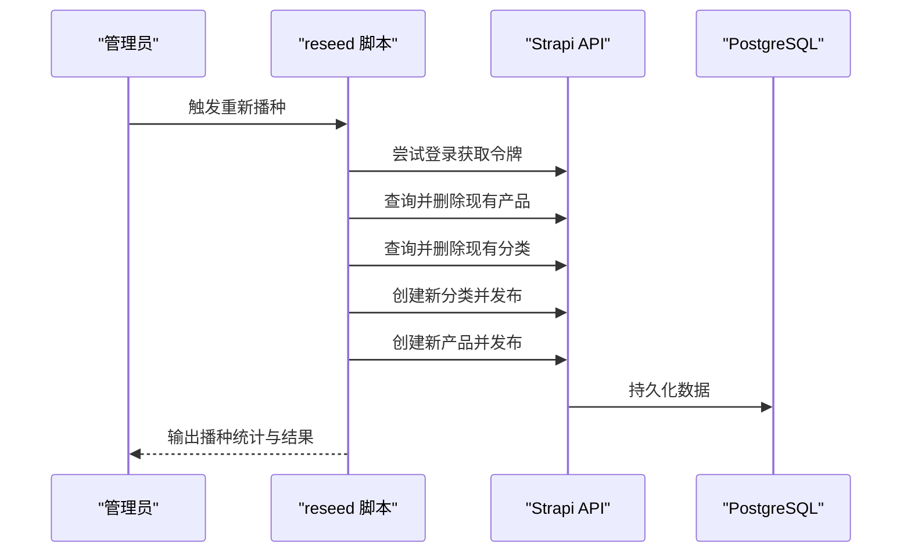
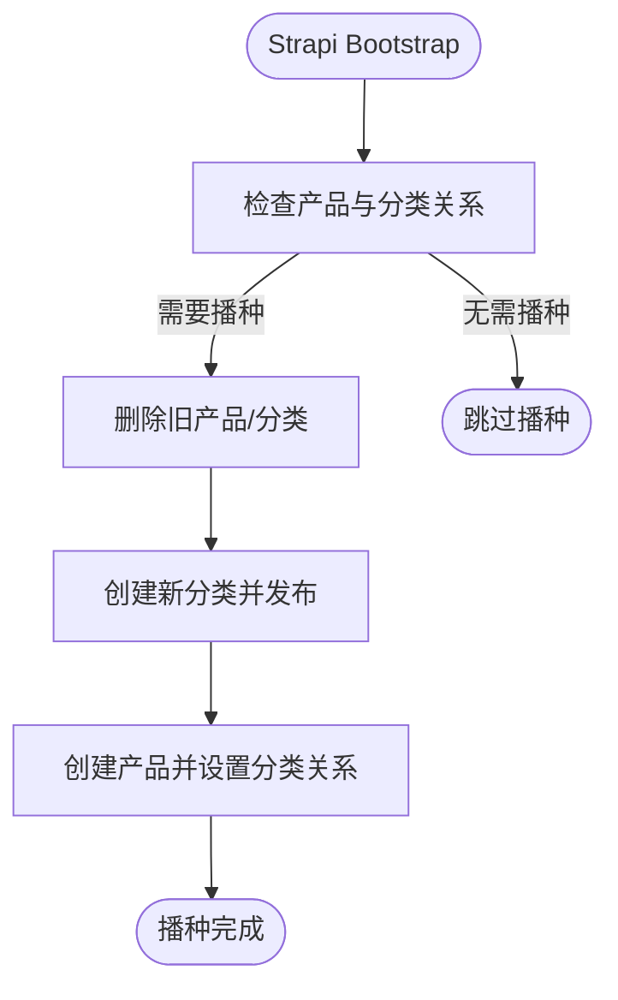
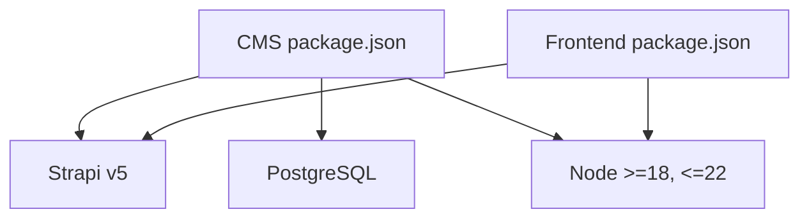

# 数据播种与初始化

<cite>
**本文引用的文件**
- [seed-data.js](file://cms/scripts/seed-data.js)
- [reseed-data.js](file://cms/scripts/reseed-data.js)
- [seed-blog-data.js](file://cms/scripts/seed-blog-data.js)
- [index.ts](file://cms/src/index.ts)
- [category/schema.json](file://cms/src/api/category/content-types/category/schema.json)
- [product/schema.json](file://cms/src/api/product/content-types/product/schema.json)
- [blog-post/schema.json](file://cms/src/api/blog-post/content-types/blog-post/schema.json)
- [database.ts](file://cms/config/database.ts)
- [seo.ts](file://frontend/src/lib/seo.ts)
- [config.ts](file://frontend/src/lib/config.ts)
- [sitemap.ts](file://frontend/src/app/sitemap.ts)
- [package.json (CMS)](file://cms/package.json)
- [package.json (Frontend)](file://frontend/package.json)
- [DEPLOYMENT.md](file://DEPLOYMENT.md)
- [WEBSITE_ARCHITECTURE.md](file://WEBSITE_ARCHITECTURE.md)
</cite>

## 目录
1. [简介](#简介)
2. [项目结构](#项目结构)
3. [核心组件](#核心组件)
4. [架构总览](#架构总览)
5. [详细组件分析](#详细组件分析)
6. [依赖分析](#依赖分析)
7. [性能考量](#性能考量)
8. [故障排查指南](#故障排查指南)
9. [结论](#结论)
10. [附录](#附录)

## 简介
本文档系统化阐述 Battivus 的数据播种与初始化体系，覆盖种子数据结构设计、分类与产品组织、自动播种流程、数据库清理策略、关系完整性保障、业务逻辑与 SEO 配置、前端兼容性、重新播种机制、数据迁移与版本升级、扩展与批量导入方法，以及调试技巧、常见问题与性能优化建议。目标是帮助开发者与运维人员快速理解并高效维护播种与初始化流程。

## 项目结构
系统采用“Next.js 前端 + Strapi CMS + PostgreSQL 数据库”的分层架构。播种与初始化相关能力分布在 CMS 层（内容类型与播种脚本）与前端层（SEO 与站点地图）。关键目录与职责如下：
- cms/scripts：播种与重新播种脚本，负责向 Strapi 写入初始数据
- cms/src/api/*：Strapi 内容类型定义（Category/Product/Blog Post）
- cms/config：数据库连接配置
- frontend/src/lib：SEO 工具与站点配置
- frontend/src/app：站点地图生成
- 根级部署与架构文档：DEPLOYMENT.md、WEBSITE_ARCHITECTURE.md

图示来源
- [package.json (CMS):6-12](file://cms/package.json#L6-L12)
- [package.json (Frontend):5-9](file://frontend/package.json#L5-L9)
- [database.ts:1-15](file://cms/config/database.ts#L1-L15)
- [category/schema.json:1-21](file://cms/src/api/category/content-types/category/schema.json#L1-L21)
- [product/schema.json:1-33](file://cms/src/api/product/content-types/product/schema.json#L1-L33)
- [blog-post/schema.json:1-24](file://cms/src/api/blog-post/content-types/blog-post/schema.json#L1-L24)
- [seed-data.js:1-398](file://cms/scripts/seed-data.js#L1-L398)
- [reseed-data.js:1-461](file://cms/scripts/reseed-data.js#L1-L461)
- [seed-blog-data.js:1-444](file://cms/scripts/seed-blog-data.js#L1-L444)
- [index.ts:149-315](file://cms/src/index.ts#L149-L315)

章节来源
- [package.json (CMS):6-12](file://cms/package.json#L6-L12)
- [package.json (Frontend):5-9](file://frontend/package.json#L5-L9)
- [database.ts:1-15](file://cms/config/database.ts#L1-L15)
- [WEBSITE_ARCHITECTURE.md:48-95](file://WEBSITE_ARCHITECTURE.md#L48-L95)

## 核心组件
- 种子数据脚本
  - 产品线播种：基于电池类型与应用场景的分类与产品数据
  - 博客播种：技术类文章集合，覆盖电池化学、寿命管理、半固态电池等主题
  - 重新播种：与前端导航一致的分类与产品，支持删除现有数据后重建
- Strapi 内容类型
  - Category：名称、别名、描述、SEO 标题/描述、媒体字段
  - Product：名称、SKU、短/长描述、电压/容量/C 级、重量/尺寸/接头/电芯类型、关联 Category、SEO 字段、媒体与资料
  - Blog Post：标题、摘要、正文、作者、标签、SEO 字段
- 前端 SEO 工具
  - 生成 JSON-LD 结构化数据（产品、文章、组织、面包屑、FAQ）
  - 动态元数据（标题、描述、Open Graph、Twitter、canonical）
  - 站点地图生成（静态页面与产品分类页）
- 自动播种与初始化
  - Strapi bootstrap 中按需检测并执行播种，确保关系完整性与发布状态

章节来源
- [seed-data.js:1-398](file://cms/scripts/seed-data.js#L1-L398)
- [seed-blog-data.js:1-444](file://cms/scripts/seed-blog-data.js#L1-L444)
- [reseed-data.js:1-461](file://cms/scripts/reseed-data.js#L1-L461)
- [category/schema.json:12-18](file://cms/src/api/category/content-types/category/schema.json#L12-L18)
- [product/schema.json:12-30](file://cms/src/api/product/content-types/product/schema.json#L12-L30)
- [blog-post/schema.json:12-21](file://cms/src/api/blog-post/content-types/blog-post/schema.json#L12-L21)
- [seo.ts:4-225](file://frontend/src/lib/seo.ts#L4-L225)
- [sitemap.ts:1-50](file://frontend/src/app/sitemap.ts#L1-L50)
- [index.ts:149-315](file://cms/src/index.ts#L149-L315)

## 架构总览
播种与初始化贯穿“脚本驱动写入”“内容类型约束”“前端 SEO 渲染”三个层面，并通过 Strapi 的 bootstrap 实现自动播种与关系发布。

图示来源
- [seed-data.js:364-397](file://cms/scripts/seed-data.js#L364-L397)
- [reseed-data.js:409-458](file://cms/scripts/reseed-data.js#L409-L458)
- [seed-blog-data.js:428-443](file://cms/scripts/seed-blog-data.js#L428-L443)
- [index.ts:214-315](file://cms/src/index.ts#L214-L315)
- [database.ts:1-15](file://cms/config/database.ts#L1-L15)

## 详细组件分析

### 组件一：产品线播种（seed-data.js）
- 数据结构
  - 分类数组：名称、别名、描述、SEO 标题/描述
  - 产品数组：名称、SKU、短/长描述、电压/容量/C 级、重量/尺寸/接头/电芯类型、是否精选、所属分类别名、SEO 标题/描述
- 处理逻辑
  - 逐个创建分类并记录映射（别名→ID），随后按分类映射创建产品并设置关联
  - 错误处理：捕获网络异常与 API 错误，输出失败信息但不中断后续
- 关系完整性
  - 通过分类别名映射确保产品与分类正确关联
- SEO 与前端匹配
  - 分类与产品均包含 SEO 字段，便于前端动态生成 SEO 元数据

图示来源
- [seed-data.js:364-397](file://cms/scripts/seed-data.js#L364-L397)

章节来源
- [seed-data.js:1-398](file://cms/scripts/seed-data.js#L1-L398)

### 组件二：博客播种（seed-blog-data.js）
- 数据结构
  - 文章集合：标题、别名、摘要、正文、作者、标签、SEO 标题/描述
- 处理逻辑
  - 顺序创建文章，记录成功数量，统一输出结果
- SEO 与前端匹配
  - 文章包含 SEO 字段，前端可据此生成 Article Schema 与 Open Graph 标签

章节来源
- [seed-blog-data.js:1-444](file://cms/scripts/seed-blog-data.js#L1-L444)
- [blog-post/schema.json:12-21](file://cms/src/api/blog-post/content-types/blog-post/schema.json#L12-L21)

### 组件三：重新播种（reseed-data.js）
- 目标
  - 与前端导航一致的分类与产品，支持登录后删除现有数据并重建
- 登录与鉴权
  - 尝试使用默认管理员凭据登录，若失败则回退到公共 API
  - 通过 Authorization 头在后续请求中携带令牌
- 数据清理
  - 分页查询并删除所有产品与分类，避免残留关系导致重建失败
- 发布状态
  - 创建后立即发布（publishedAt 设置为当前时间），确保前端可见
- 错误处理
  - 删除阶段捕获异常并提示“无数据可删或错误”，不影响后续播种

图示来源
- [reseed-data.js:12-461](file://cms/scripts/reseed-data.js#L12-L461)

章节来源
- [reseed-data.js:1-461](file://cms/scripts/reseed-data.js#L1-L461)

### 组件四：Strapi 自动播种（bootstrap/index.ts）
- 触发条件
  - 检测数据库中是否存在产品且具备分类关系；若分类缺失或不匹配预期，则触发播种
- 清理策略
  - 删除旧产品与分类，避免关系冲突
- 关系与发布
  - 使用 documentId 建立多对一关系；创建后即发布，确保前端可读取
- 权限配置
  - 自动为公开角色启用内容查询与询盘提交权限

图示来源
- [index.ts:214-315](file://cms/src/index.ts#L214-L315)

章节来源
- [index.ts:149-315](file://cms/src/index.ts#L149-L315)

### 组件五：内容类型与关系约束
- Category
  - 唯一性：名称唯一、别名唯一
  - SEO：支持 SEO 标题与描述
  - 媒体：支持单张图片
- Product
  - 必填字段：名称、SKU、短描述、电压、容量、C 级
  - 关系：多对一关联 Category
  - SEO：支持 SEO 标题与描述
  - 媒体：支持多图与资料文件
- Blog Post
  - 必填字段：标题、摘要、正文
  - SEO：支持 SEO 标题与描述
  - 媒体：支持封面图

章节来源
- [category/schema.json:12-18](file://cms/src/api/category/content-types/category/schema.json#L12-L18)
- [product/schema.json:12-30](file://cms/src/api/product/content-types/product/schema.json#L12-L30)
- [blog-post/schema.json:12-21](file://cms/src/api/blog-post/content-types/blog-post/schema.json#L12-L21)

### 组件六：前端 SEO 与站点地图
- SEO 工具
  - 生成产品、文章、组织、面包屑、FAQ 的 JSON-LD 结构化数据
  - 动态生成元数据（标题、描述、OG、Twitter、canonical）
- 站点地图
  - 生成静态页面与产品分类页的 sitemap 条目
- 前端导航与播种一致性
  - 前端配置中的产品分类与播种脚本保持一致，确保导航与数据匹配

章节来源
- [seo.ts:4-225](file://frontend/src/lib/seo.ts#L4-L225)
- [sitemap.ts:1-50](file://frontend/src/app/sitemap.ts#L1-L50)
- [config.ts:118-147](file://frontend/src/lib/config.ts#L118-L147)

## 依赖分析
- 技术栈与版本
  - CMS：Strapi v5，Node 版本范围要求
  - 前端：Next.js 16，React 19
  - 数据库：PostgreSQL
- 运行时依赖
  - CMS：@strapi/plugin-users-permissions、@strapi/provider-upload-cloudinary、pg、better-sqlite3
  - 前端：next、react、react-dom
- 部署与集成
  - 建议使用 Railway 或 Strapi Cloud 托管后端，Vercel 托管前端，Cloudinary 存储媒体

图示来源
- [package.json (CMS):14-34](file://cms/package.json#L14-L34)
- [package.json (Frontend):11-25](file://frontend/package.json#L11-L25)

章节来源
- [package.json (CMS):14-34](file://cms/package.json#L14-L34)
- [package.json (Frontend):11-25](file://frontend/package.json#L11-L25)
- [DEPLOYMENT.md:29-105](file://DEPLOYMENT.md#L29-L105)

## 性能考量
- 并发与批处理
  - 当前播种脚本为顺序执行，建议在大规模数据时引入并发限制与重试机制
- 数据库连接
  - PostgreSQL 连接池与事务封装可减少锁竞争与超时风险
- 前端渲染
  - SEO 与站点地图生成应避免在热路径中重复计算，可缓存静态条目
- 缓存与 CDN
  - 生产环境建议开启 CDN 与缓存策略，降低 API 响应延迟

## 故障排查指南
- 种子脚本执行失败
  - 检查 Strapi 地址与端口是否可达；确认 API 路径正确
  - 若出现“分类未找到”错误，确认播种脚本中的分类别名与产品中的 category_slug 一致
- 重新播种后前端不可见
  - 确认脚本已调用发布接口；检查 publishedAt 是否设置
  - 若使用公共 API，请确认已授予相应权限
- 自动播种未触发
  - 检查 bootstrap 中的检测逻辑：是否已有产品且具备分类关系
  - 确认数据库连接与内容类型定义一致
- SEO 与站点地图异常
  - 检查 SEO 工具函数参数是否完整；确认站点配置中的 URL 与实际域名一致
  - 站点地图中产品详情页需在生产环境从 API 获取动态条目

章节来源
- [seed-data.js:321-362](file://cms/scripts/seed-data.js#L321-L362)
- [reseed-data.js:313-344](file://cms/scripts/reseed-data.js#L313-L344)
- [index.ts:214-315](file://cms/src/index.ts#L214-L315)
- [seo.ts:168-225](file://frontend/src/lib/seo.ts#L168-L225)
- [sitemap.ts:40-48](file://frontend/src/app/sitemap.ts#L40-L48)

## 结论
Battivus 的播种与初始化体系以“脚本驱动 + 内容类型约束 + 自动播种 + 前端 SEO”为核心，既保证了数据结构的一致性与关系完整性，又兼顾了 SEO 优化与前端兼容性。通过重新播种与数据迁移策略，系统可在不同环境间平滑演进。建议在生产环境中结合 CDN、缓存与监控，持续优化性能与稳定性。

## 附录

### 业务逻辑与 SEO 配置要点
- 分类与产品
  - 分类包含 SEO 标题/描述，产品包含 SEO 标题/描述与结构化数据字段
  - 前端通过 SEO 工具生成 JSON-LD 与动态元数据
- 博客
  - 文章包含 SEO 字段，前端生成 Article Schema 与 Open Graph 标签
- 导航一致性
  - 前端配置的产品分类与播种脚本保持一致，确保导航与数据匹配

章节来源
- [category/schema.json:12-18](file://cms/src/api/category/content-types/category/schema.json#L12-L18)
- [product/schema.json:12-30](file://cms/src/api/product/content-types/product/schema.json#L12-L30)
- [blog-post/schema.json:12-21](file://cms/src/api/blog-post/content-types/blog-post/schema.json#L12-L21)
- [seo.ts:4-225](file://frontend/src/lib/seo.ts#L4-L225)
- [config.ts:118-147](file://frontend/src/lib/config.ts#L118-L147)

### 重新播种机制与数据迁移
- 重新播种
  - 支持登录后删除现有数据并重建；自动发布确保前端可见
- 数据迁移
  - 可使用 Strapi Transfer 在本地与生产环境之间同步内容
- 版本升级
  - 通过 bootstrap 的检测逻辑实现增量播种；如需破坏性变更，先备份数据库再执行重新播种

章节来源
- [reseed-data.js:12-461](file://cms/scripts/reseed-data.js#L12-L461)
- [DEPLOYMENT.md:194-222](file://DEPLOYMENT.md#L194-L222)
- [index.ts:214-315](file://cms/src/index.ts#L214-L315)

### 扩展指南与批量导入
- 扩展播种脚本
  - 新增内容类型时，需同步更新播种脚本与前端 SEO 工具
- 批量导入
  - 建议将 CSV/Excel 转换为 JSON 后，按现有播种脚本格式批量写入
- 关系与发布
  - 导入时注意多对一关系的 documentId 对齐与发布状态设置

章节来源
- [seed-data.js:321-397](file://cms/scripts/seed-data.js#L321-L397)
- [seed-blog-data.js:408-443](file://cms/scripts/seed-blog-data.js#L408-L443)
- [index.ts:266-311](file://cms/src/index.ts#L266-L311)

### 调试技巧与性能优化
- 调试
  - 使用浏览器开发者工具查看 API 请求与响应；检查 publishedAt 与 documentId
  - 在播种脚本中增加日志级别与错误堆栈输出
- 性能
  - 限制并发写入速率；使用事务包裹批量操作；启用数据库索引
  - 前端缓存静态 SEO 与站点地图条目，减少重复计算

章节来源
- [seed-data.js:321-397](file://cms/scripts/seed-data.js#L321-L397)
- [reseed-data.js:313-461](file://cms/scripts/reseed-data.js#L313-L461)
- [index.ts:214-315](file://cms/src/index.ts#L214-L315)