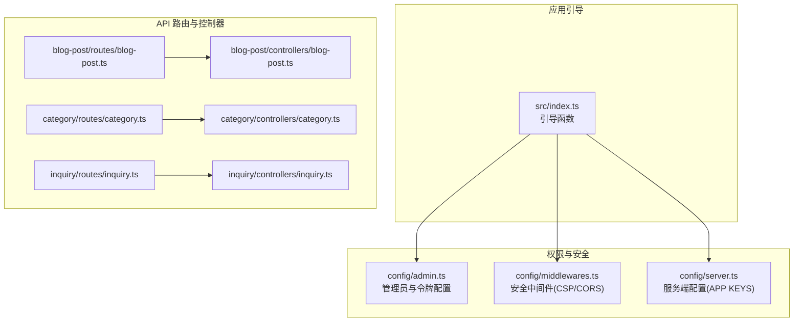
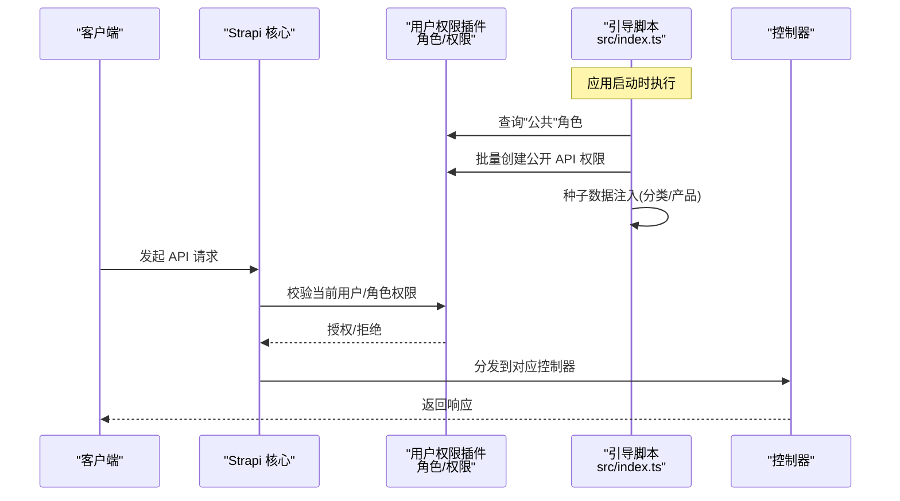
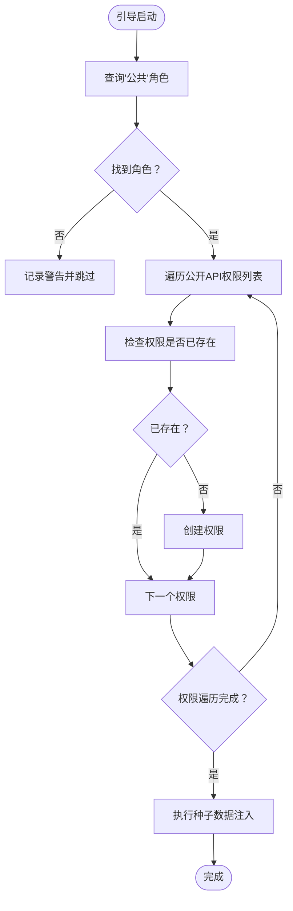
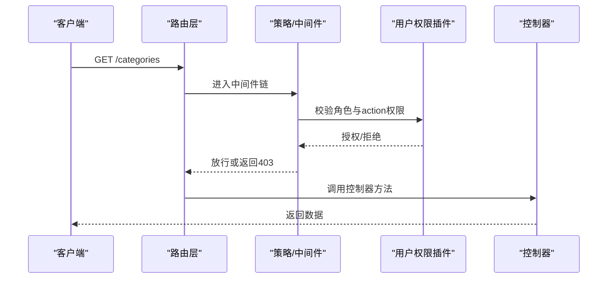
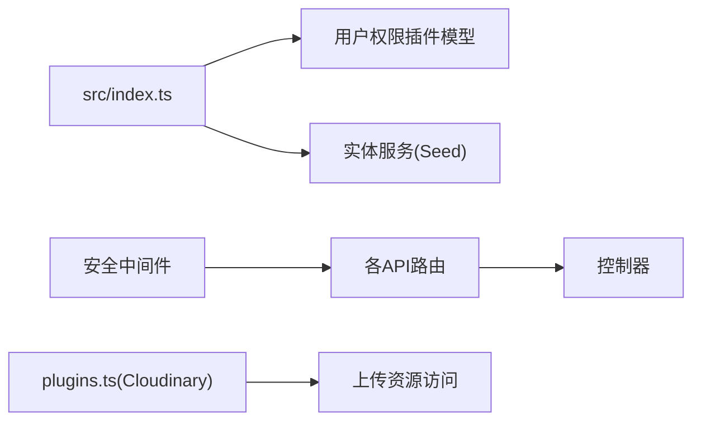

# 权限管理

<cite>
**本文引用的文件**
- [cms/src/index.ts](file://cms/src/index.ts)
- [cms/config/admin.ts](file://cms/config/admin.ts)
- [cms/config/middlewares.ts](file://cms/config/middlewares.ts)
- [cms/config/server.ts](file://cms/config/server.ts)
- [cms/config/plugins.ts](file://cms/config/plugins.ts)
- [cms/src/api/blog-post/routes/blog-post.ts](file://cms/src/api/blog-post/routes/blog-post.ts)
- [cms/src/api/category/routes/category.ts](file://cms/src/api/category/routes/category.ts)
- [cms/src/api/inquiry/routes/inquiry.ts](file://cms/src/api/inquiry/routes/inquiry.ts)
- [cms/src/api/blog-post/controllers/blog-post.ts](file://cms/src/api/blog-post/controllers/blog-post.ts)
- [cms/src/api/category/controllers/category.ts](file://cms/src/api/category/controllers/category.ts)
- [cms/src/api/inquiry/controllers/inquiry.ts](file://cms/src/api/inquiry/controllers/inquiry.ts)
</cite>

## 目录
1. [简介](#简介)
2. [项目结构](#项目结构)
3. [核心组件](#核心组件)
4. [架构总览](#架构总览)
5. [详细组件分析](#详细组件分析)
6. [依赖关系分析](#依赖关系分析)
7. [性能考量](#性能考量)
8. [故障排除指南](#故障排除指南)
9. [结论](#结论)
10. [附录](#附录)

## 简介
本文件面向 Battivus 权限管理系统，聚焦 Strapi 用户权限插件（Users & Permissions）在本项目中的配置与使用。文档围绕以下主题展开：
- 公共角色的权限分配与自动初始化
- API 端点访问控制与安全策略
- 权限继承机制与角色管理流程
- 用户认证集成与令牌策略
- 不同用户组的访问级别与内容编辑权限配置
- 权限扩展指南、自定义权限规则与第三方认证集成思路
- 安全最佳实践、权限审计与故障排除技巧

## 项目结构
本项目的权限体系由以下部分组成：
- 应用启动阶段的权限初始化：在应用引导时自动为“公共”角色授予必要的 API 权限，并进行种子数据注入。
- 中间件层的安全策略：包括 CSP、CORS 以及错误处理等。
- 后台管理安全：管理员 JWT 密钥、API Token 盐值、传输 Token 盐值等。
- 插件配置：如上传插件 Cloudinary 的 Provider 配置，间接影响媒体资源的访问与权限边界。

图表来源
- [cms/src/index.ts:161-216](file://cms/src/index.ts#L161-L216)
- [cms/config/admin.ts:1-21](file://cms/config/admin.ts#L1-L21)
- [cms/config/middlewares.ts:1-32](file://cms/config/middlewares.ts#L1-L32)
- [cms/config/server.ts:1-11](file://cms/config/server.ts#L1-L11)
- [cms/src/api/blog-post/routes/blog-post.ts:1-35](file://cms/src/api/blog-post/routes/blog-post.ts#L1-L35)
- [cms/src/api/category/routes/category.ts:1-50](file://cms/src/api/category/routes/category.ts#L1-L50)
- [cms/src/api/inquiry/routes/inquiry.ts:1-35](file://cms/src/api/inquiry/routes/inquiry.ts#L1-L35)
- [cms/src/api/blog-post/controllers/blog-post.ts:1-53](file://cms/src/api/blog-post/controllers/blog-post.ts#L1-L53)
- [cms/src/api/category/controllers/category.ts:1-40](file://cms/src/api/category/controllers/category.ts#L1-L40)
- [cms/src/api/inquiry/controllers/inquiry.ts:1-40](file://cms/src/api/inquiry/controllers/inquiry.ts#L1-L40)

章节来源
- [cms/src/index.ts:161-216](file://cms/src/index.ts#L161-L216)
- [cms/config/admin.ts:1-21](file://cms/config/admin.ts#L1-L21)
- [cms/config/middlewares.ts:1-32](file://cms/config/middlewares.ts#L1-L32)
- [cms/config/server.ts:1-11](file://cms/config/server.ts#L1-L11)

## 核心组件
- 引导脚本（权限初始化）
  - 在应用启动时，通过查询“公共”角色并为其批量授予公开 API 权限（如分类、产品、博客、解决方案的读取权限，以及询盘的创建权限），确保前端无需登录即可访问公开内容。
  - 同时执行数据库种子逻辑，按需删除旧数据并重建分类与产品及其关联关系，保证演示与生产环境的一致性。
- 安全中间件
  - 内置安全中间件启用默认策略，并对连接源、图片与媒体源进行限制；CORS 允许任意来源以适配部署场景。
- 管理后台安全
  - 管理员 JWT 密钥、API Token 盐值、传输 Token 盐值均通过环境变量配置，确保后台访问与数据迁移的安全性。
- 服务器配置
  - APP KEYS 用于应用加密与签名，保障会话与令牌的完整性。

章节来源
- [cms/src/index.ts:161-216](file://cms/src/index.ts#L161-L216)
- [cms/src/index.ts:219-314](file://cms/src/index.ts#L219-L314)
- [cms/config/middlewares.ts:1-32](file://cms/config/middlewares.ts#L1-L32)
- [cms/config/admin.ts:1-21](file://cms/config/admin.ts#L1-L21)
- [cms/config/server.ts:1-11](file://cms/config/server.ts#L1-L11)

## 架构总览
下图展示了从请求到权限校验与控制器处理的整体流程，以及权限初始化与种子数据注入的关键节点。

图表来源
- [cms/src/index.ts:161-216](file://cms/src/index.ts#L161-L216)
- [cms/src/api/blog-post/controllers/blog-post.ts:1-53](file://cms/src/api/blog-post/controllers/blog-post.ts#L1-L53)
- [cms/src/api/category/controllers/category.ts:1-40](file://cms/src/api/category/controllers/category.ts#L1-L40)
- [cms/src/api/inquiry/controllers/inquiry.ts:1-40](file://cms/src/api/inquiry/controllers/inquiry.ts#L1-L40)

## 详细组件分析

### 组件一：公共角色权限初始化与种子数据
- 功能概述
  - 在应用引导阶段，定位“公共”角色，遍历预设的公开 API 权限列表，若权限不存在则创建，从而实现“无需登录即可访问”的公开内容能力。
  - 同步执行数据库种子：删除旧数据、创建新分类、再创建产品并建立分类-产品关联，确保数据一致性。
- 关键路径
  - 角色查询与权限创建：[cms/src/index.ts:161-216](file://cms/src/index.ts#L161-L216)
  - 种子数据流程：[cms/src/index.ts:219-314](file://cms/src/index.ts#L219-L314)
- 处理逻辑流程图

图表来源
- [cms/src/index.ts:161-216](file://cms/src/index.ts#L161-L216)
- [cms/src/index.ts:219-314](file://cms/src/index.ts#L219-L314)

章节来源
- [cms/src/index.ts:161-216](file://cms/src/index.ts#L161-L216)
- [cms/src/index.ts:219-314](file://cms/src/index.ts#L219-L314)

### 组件二：API 端点访问控制与安全策略
- 访问控制
  - 当前路由未配置自定义策略或中间件，意味着默认遵循用户权限插件的授权模型：只有具备相应 action 权限的角色才能访问对应 API。
  - 公共角色已获得公开读取权限与询盘创建权限，其他写操作默认需要更高权限或登录态。
- 安全策略
  - 内容安全策略（CSP）限制了连接源、图片与媒体源，降低 XSS 与不安全资源加载风险。
  - CORS 允许任意来源，便于部署与跨域调试，但生产环境建议收紧来源白名单。
- 关键路径
  - 路由定义（示例：博客文章）：[cms/src/api/blog-post/routes/blog-post.ts:1-35](file://cms/src/api/blog-post/routes/blog-post.ts#L1-L35)
  - 控制器实现（示例：博客文章）：[cms/src/api/blog-post/controllers/blog-post.ts:1-53](file://cms/src/api/blog-post/controllers/blog-post.ts#L1-L53)
  - 安全中间件配置：[cms/config/middlewares.ts:1-32](file://cms/config/middlewares.ts#L1-L32)

图表来源
- [cms/src/api/category/routes/category.ts:1-50](file://cms/src/api/category/routes/category.ts#L1-L50)
- [cms/src/api/category/controllers/category.ts:1-40](file://cms/src/api/category/controllers/category.ts#L1-L40)
- [cms/config/middlewares.ts:1-32](file://cms/config/middlewares.ts#L1-L32)

章节来源
- [cms/src/api/blog-post/routes/blog-post.ts:1-35](file://cms/src/api/blog-post/routes/blog-post.ts#L1-L35)
- [cms/src/api/blog-post/controllers/blog-post.ts:1-53](file://cms/src/api/blog-post/controllers/blog-post.ts#L1-L53)
- [cms/src/api/category/routes/category.ts:1-50](file://cms/src/api/category/routes/category.ts#L1-L50)
- [cms/src/api/category/controllers/category.ts:1-40](file://cms/src/api/category/controllers/category.ts#L1-L40)
- [cms/src/api/inquiry/routes/inquiry.ts:1-35](file://cms/src/api/inquiry/routes/inquiry.ts#L1-L35)
- [cms/src/api/inquiry/controllers/inquiry.ts:1-40](file://cms/src/api/inquiry/controllers/inquiry.ts#L1-L40)
- [cms/config/middlewares.ts:1-32](file://cms/config/middlewares.ts#L1-L32)

### 组件三：角色管理与权限继承机制
- 角色与权限
  - “公共”角色在引导阶段被赋予一组公开 action 权限，这些权限直接绑定到该角色，形成基础访问能力。
  - 其他角色（如注册用户、管理员）可通过后台或程序化方式创建并分配更细粒度的 action 权限。
- 权限继承
  - 用户权限插件支持角色层级与权限叠加。通常“公共”角色作为基础层，其他角色可在此基础上叠加额外权限。
- 关键路径
  - 公共角色权限创建：[cms/src/index.ts:172-210](file://cms/src/index.ts#L172-L210)

章节来源
- [cms/src/index.ts:172-210](file://cms/src/index.ts#L172-L210)

### 组件四：用户认证集成与令牌策略
- 管理后台认证
  - 管理员 JWT 密钥通过环境变量配置，用于后台登录与会话持久化。
  - API Token 与传输 Token 均配置盐值，用于生成与验证各类令牌。
- 令牌策略
  - 建议为不同用途设置独立的 Token（如管理后台、Webhook、数据迁移），并定期轮换盐值与密钥。
- 关键路径
  - 管理后台配置：[cms/config/admin.ts:1-21](file://cms/config/admin.ts#L1-L21)

章节来源
- [cms/config/admin.ts:1-21](file://cms/config/admin.ts#L1-L21)

### 组件五：为不同用户组配置访问级别与内容编辑权限
- 建议流程
  - 创建专用角色（如“内容编辑者”、“审核员”、“管理员”），分别授予“读取”、“创建/更新”、“完全管理”等 action 权限。
  - 对于需要登录后才能访问的内容（如后台内容管理），仅授予相应角色的 action 权限。
- 实施要点
  - 使用引导脚本或后台界面完成角色与权限的初始配置。
  - 对敏感操作（删除、发布状态变更）采用最小权限原则，避免越权操作。

章节来源
- [cms/src/index.ts:172-210](file://cms/src/index.ts#L172-L210)

### 组件六：权限扩展指南与自定义权限规则
- 扩展方向
  - 自定义策略：在路由层添加策略或中间件，实现基于业务上下文的二次校验（如资源归属校验、IP 白名单等）。
  - 动态权限：结合用户属性（如部门、区域）动态计算 action 权限集合。
- 自定义权限规则
  - 可在控制器中增加业务级校验逻辑（例如仅允许作者修改自己的文章），并在策略层统一拦截。
- 第三方认证集成
  - 可通过策略或中间件对接第三方认证（如 OAuth、SAML），在进入权限插件校验前完成身份绑定与角色映射。

章节来源
- [cms/src/api/blog-post/controllers/blog-post.ts:1-53](file://cms/src/api/blog-post/controllers/blog-post.ts#L1-L53)
- [cms/src/api/category/controllers/category.ts:1-40](file://cms/src/api/category/controllers/category.ts#L1-L40)
- [cms/src/api/inquiry/controllers/inquiry.ts:1-40](file://cms/src/api/inquiry/controllers/inquiry.ts#L1-L40)

## 依赖关系分析
- 组件耦合
  - 引导脚本依赖用户权限插件的数据模型（角色、权限），并通过实体服务完成数据注入。
  - 路由与控制器之间通过字符串 handler 名称解耦，便于扩展与维护。
- 外部依赖
  - 上传插件 Cloudinary 的 Provider 配置影响媒体资源的访问范围与鉴权边界，应与权限策略协同设计。
- 潜在风险
  - CORS 允许任意来源可能带来跨域风险，建议在生产环境限定来源。
  - 若未正确配置角色与 action 权限，可能导致越权访问或功能不可用。

图表来源
- [cms/src/index.ts:161-216](file://cms/src/index.ts#L161-L216)
- [cms/src/index.ts:219-314](file://cms/src/index.ts#L219-L314)
- [cms/src/api/blog-post/routes/blog-post.ts:1-35](file://cms/src/api/blog-post/routes/blog-post.ts#L1-L35)
- [cms/src/api/category/routes/category.ts:1-50](file://cms/src/api/category/routes/category.ts#L1-L50)
- [cms/src/api/inquiry/routes/inquiry.ts:1-35](file://cms/src/api/inquiry/routes/inquiry.ts#L1-L35)
- [cms/config/plugins.ts:1-19](file://cms/config/plugins.ts#L1-L19)
- [cms/config/middlewares.ts:1-32](file://cms/config/middlewares.ts#L1-L32)

章节来源
- [cms/src/index.ts:161-216](file://cms/src/index.ts#L161-L216)
- [cms/src/index.ts:219-314](file://cms/src/index.ts#L219-L314)
- [cms/src/api/blog-post/routes/blog-post.ts:1-35](file://cms/src/api/blog-post/routes/blog-post.ts#L1-L35)
- [cms/src/api/category/routes/category.ts:1-50](file://cms/src/api/category/routes/category.ts#L1-L50)
- [cms/src/api/inquiry/routes/inquiry.ts:1-35](file://cms/src/api/inquiry/routes/inquiry.ts#L1-L35)
- [cms/config/plugins.ts:1-19](file://cms/config/plugins.ts#L1-L19)
- [cms/config/middlewares.ts:1-32](file://cms/config/middlewares.ts#L1-L32)

## 性能考量
- 权限检查开销
  - 在高频读取场景（如公开内容列表页），建议缓存角色与权限映射，减少数据库查询次数。
- 数据种子与迁移
  - 种子流程包含删除与重建，建议在非高峰时段执行，并对大表分批处理以降低锁竞争。
- 中间件顺序
  - 将轻量校验前置，重负载校验（如鉴权）靠后，有助于提升整体吞吐。

## 故障排除指南
- 公共内容无法访问
  - 检查引导脚本是否成功创建“公共”角色的公开权限；确认 action 名称与路由一致。
  - 参考：[cms/src/index.ts:172-210](file://cms/src/index.ts#L172-L210)
- 上传资源访问异常
  - 检查 Cloudinary Provider 配置与凭证；确认 CSP 是否允许 res.cloudinary.com。
  - 参考：[cms/config/plugins.ts:1-19](file://cms/config/plugins.ts#L1-L19)，[cms/config/middlewares.ts:7-15](file://cms/config/middlewares.ts#L7-L15)
- 跨域问题
  - 生产环境建议收紧 CORS 来源白名单，避免任意来源带来的安全风险。
  - 参考：[cms/config/middlewares.ts:20-24](file://cms/config/middlewares.ts#L20-L24)
- 管理后台登录失败
  - 检查 ADMIN_JWT_SECRET 与 APP_KEYS 配置是否正确且一致。
  - 参考：[cms/config/admin.ts:2-4](file://cms/config/admin.ts#L2-L4)，[cms/config/server.ts:4-6](file://cms/config/server.ts#L4-L6)
- 数据不一致或种子失败
  - 查看引导日志，确认角色存在、权限创建成功；检查实体服务调用与关联字段写入。
  - 参考：[cms/src/index.ts:219-314](file://cms/src/index.ts#L219-L314)

章节来源
- [cms/src/index.ts:172-210](file://cms/src/index.ts#L172-L210)
- [cms/src/index.ts:219-314](file://cms/src/index.ts#L219-L314)
- [cms/config/plugins.ts:1-19](file://cms/config/plugins.ts#L1-L19)
- [cms/config/middlewares.ts:7-15](file://cms/config/middlewares.ts#L7-L15)
- [cms/config/middlewares.ts:20-24](file://cms/config/middlewares.ts#L20-L24)
- [cms/config/admin.ts:2-4](file://cms/config/admin.ts#L2-L4)
- [cms/config/server.ts:4-6](file://cms/config/server.ts#L4-L6)

## 结论
本项目通过引导脚本实现了“公共角色”的自动化权限配置与种子数据注入，结合内置安全中间件与管理后台令牌策略，构建了清晰的权限边界。建议在生产环境中进一步收紧 CORS、完善策略与中间件、细化角色与权限矩阵，并引入审计与监控以持续保障系统安全与稳定。

## 附录
- 最佳实践清单
  - 为每个角色明确 action 权限集合，遵循最小权限原则。
  - 生产环境限制 CORS 来源，严格管理 APP_KEYS 与令牌盐值。
  - 对敏感操作增加策略层校验与审计日志。
  - 定期审查与轮换管理员 JWT 密钥与传输 Token 盐值。
  - 在高并发场景下优化权限缓存与实体服务调用。