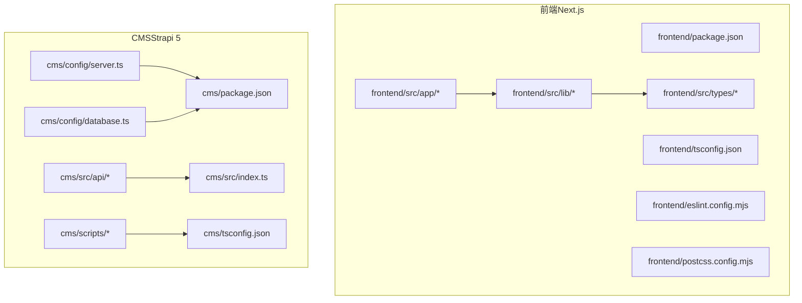
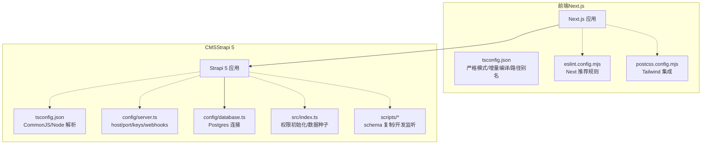
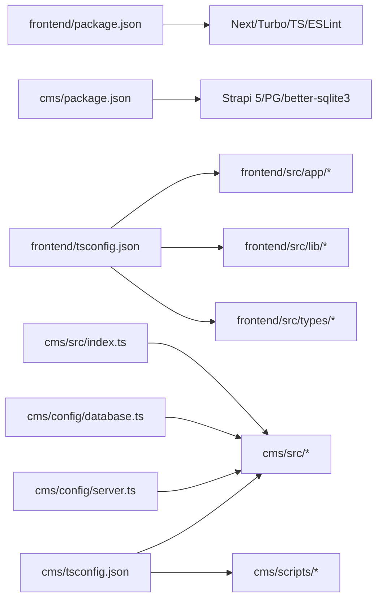
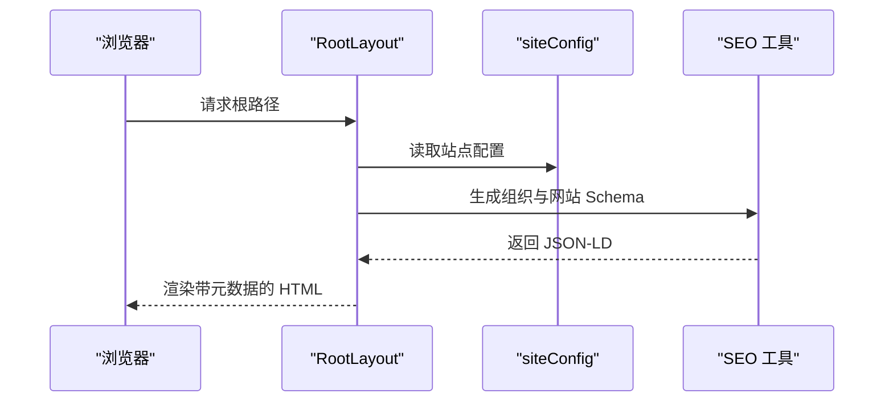
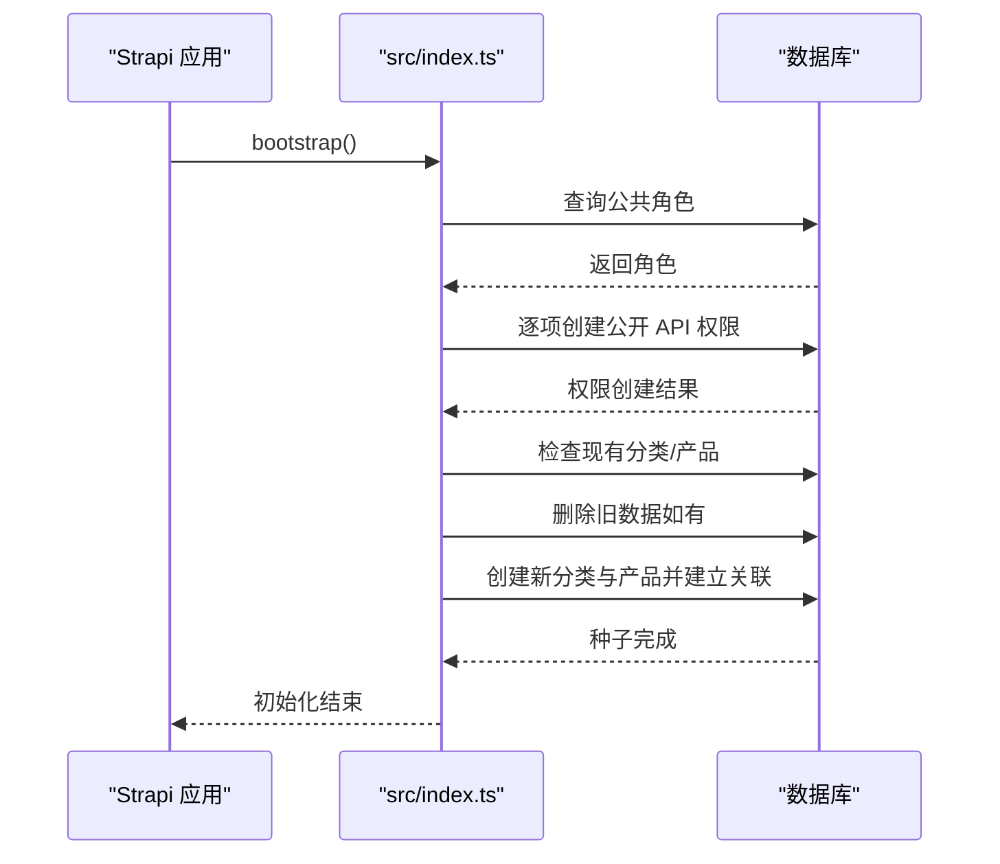
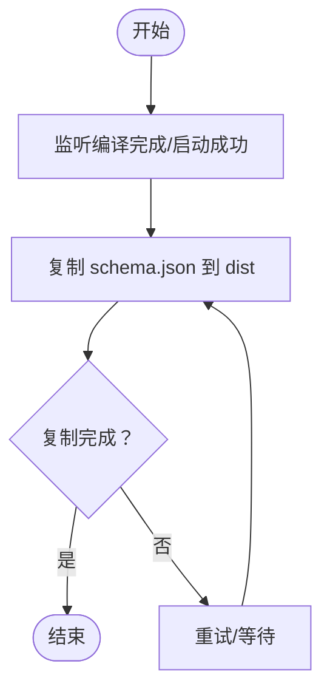

# 代码规范

<cite>
**本文引用的文件**
- [frontend/tsconfig.json](file://frontend/tsconfig.json)
- [frontend/eslint.config.mjs](file://frontend/eslint.config.mjs)
- [frontend/package.json](file://frontend/package.json)
- [frontend/postcss.config.mjs](file://frontend/postcss.config.mjs)
- [cms/tsconfig.json](file://cms/tsconfig.json)
- [cms/package.json](file://cms/package.json)
- [cms/config/server.ts](file://cms/config/server.ts)
- [cms/config/database.ts](file://cms/config/database.ts)
- [cms/src/index.ts](file://cms/src/index.ts)
- [cms/scripts/copy-schemas.js](file://cms/scripts/copy-schemas.js)
- [cms/scripts/dev-with-schemas.js](file://cms/scripts/dev-with-schemas.js)
- [frontend/src/app/layout.tsx](file://frontend/src/app/layout.tsx)
- [frontend/src/lib/config.ts](file://frontend/src/lib/config.ts)
- [frontend/src/app/contact/ContactForm.tsx](file://frontend/src/app/contact/ContactForm.tsx)
- [frontend/src/types/index.ts](file://frontend/src/types/index.ts)
- [cms/src/api/product/controllers/product.ts](file://cms/src/api/product/controllers/product.ts)
- [cms/src/api/product/services/product.ts](file://cms/src/api/product/services/product.ts)
</cite>

## 目录
1. [简介](#简介)
2. [项目结构](#项目结构)
3. [核心组件](#核心组件)
4. [架构总览](#架构总览)
5. [详细组件分析](#详细组件分析)
6. [依赖关系分析](#依赖关系分析)
7. [性能考量](#性能考量)
8. [故障排查指南](#故障排查指南)
9. [结论](#结论)
10. [附录](#附录)

## 简介
本文件为 Battivus 项目的代码规范与质量标准文档，覆盖前端（Next.js）与 CMS（Strapi）两部分的 TypeScript 编译配置、ESLint 规则、代码风格与命名约定、文件组织结构、格式化与注释规范、文档编写标准、IDE 配置建议、安全与性能实践等。文档同时提供配置文件作用说明与可选自定义项，并通过图示展示关键流程与依赖关系。

## 项目结构
项目采用多包结构：frontend（Next.js 应用）、cms（Strapi CMS），各自拥有独立的 TypeScript 配置、构建脚本与开发工具链。前端使用 Next.js 16 与 TypeScript，CMS 使用 Strapi 5 与 TypeScript；两者均通过各自的 package.json 管理依赖与脚本。

图表来源
- [frontend/package.json:1-26](file://frontend/package.json#L1-L26)
- [frontend/tsconfig.json:1-35](file://frontend/tsconfig.json#L1-L35)
- [frontend/eslint.config.mjs:1-19](file://frontend/eslint.config.mjs#L1-L19)
- [frontend/postcss.config.mjs:1-8](file://frontend/postcss.config.mjs#L1-L8)
- [cms/package.json:1-36](file://cms/package.json#L1-L36)
- [cms/tsconfig.json:1-19](file://cms/tsconfig.json#L1-L19)
- [cms/config/server.ts:1-11](file://cms/config/server.ts#L1-L11)
- [cms/config/database.ts:1-15](file://cms/config/database.ts#L1-L15)
- [cms/src/index.ts:1-315](file://cms/src/index.ts#L1-L315)
- [cms/scripts/copy-schemas.js:1-47](file://cms/scripts/copy-schemas.js#L1-L47)
- [cms/scripts/dev-with-schemas.js:1-80](file://cms/scripts/dev-with-schemas.js#L1-L80)

章节来源
- [frontend/package.json:1-26](file://frontend/package.json#L1-L26)
- [cms/package.json:1-36](file://cms/package.json#L1-L36)

## 核心组件
- 前端编译与类型系统：Next.js + TypeScript，严格模式、增量编译、路径别名、JSX 支持、模块解析策略等。
- 前端代码质量：ESLint 使用 Next.js 推荐规则集，覆盖 Core Web Vitals 与 TypeScript 检查，并自定义忽略列表。
- CMS 编译与运行：Strapi 5，CommonJS 模块、Node 解析、严格性适配生产环境、输出目录 dist。
- 构建与开发工具：Tailwind PostCSS 集成、开发脚本与自动 schema 复制流程。
- 数据层与 API：Strapi v5 的内容类型与控制器、服务层空实现、数据库连接配置与服务器参数。

章节来源
- [frontend/tsconfig.json:1-35](file://frontend/tsconfig.json#L1-L35)
- [frontend/eslint.config.mjs:1-19](file://frontend/eslint.config.mjs#L1-L19)
- [cms/tsconfig.json:1-19](file://cms/tsconfig.json#L1-L19)
- [frontend/postcss.config.mjs:1-8](file://frontend/postcss.config.mjs#L1-L8)
- [cms/config/server.ts:1-11](file://cms/config/server.ts#L1-L11)
- [cms/config/database.ts:1-15](file://cms/config/database.ts#L1-L15)

## 架构总览
下图展示前端与 CMS 的关键配置与交互：前端通过 Next.js 运行时消费 CMS 提供的 API；CMS 在启动时进行权限初始化与数据种子逻辑，并在开发阶段通过脚本复制 schema.json 到构建产物中以保证内容类型可用。

图表来源
- [frontend/tsconfig.json:1-35](file://frontend/tsconfig.json#L1-L35)
- [frontend/eslint.config.mjs:1-19](file://frontend/eslint.config.mjs#L1-L19)
- [frontend/postcss.config.mjs:1-8](file://frontend/postcss.config.mjs#L1-L8)
- [cms/tsconfig.json:1-19](file://cms/tsconfig.json#L1-L19)
- [cms/config/server.ts:1-11](file://cms/config/server.ts#L1-L11)
- [cms/config/database.ts:1-15](file://cms/config/database.ts#L1-L15)
- [cms/src/index.ts:1-315](file://cms/src/index.ts#L1-L315)
- [cms/scripts/copy-schemas.js:1-47](file://cms/scripts/copy-schemas.js#L1-L47)
- [cms/scripts/dev-with-schemas.js:1-80](file://cms/scripts/dev-with-schemas.js#L1-L80)

## 详细组件分析

### 前端：TypeScript 编译配置
- 关键特性
  - 目标与库：ES2017 及 DOM/迭代/ESNext。
  - 严格性：启用 strict，禁用 emit（由 Next 管理）。
  - 模块与解析：esnext、bundler 解析、JSON 模块、隔离模块。
  - JSX：react-jsx。
  - 路径别名：@/* 映射到 src/*。
  - 增量编译：开启以提升开发体验。
- 影响与建议
  - 严格模式有助于减少隐式类型问题。
  - bundler 解析与 isolatedModules 适合现代打包器。
  - 路径别名统一导入路径，避免相对路径地狱。

章节来源
- [frontend/tsconfig.json:1-35](file://frontend/tsconfig.json#L1-L35)

### 前端：ESLint 规则与代码质量
- 配置要点
  - 使用 Next.js 推荐规则集（Core Web Vitals 与 TypeScript）。
  - 自定义忽略列表覆盖默认忽略项，确保构建产物与临时目录不被扫描。
- 建议
  - 保持与 Next 版本一致的 eslint-config-next。
  - 如需扩展规则，建议在本地分支添加覆盖，避免影响全局。

章节来源
- [frontend/eslint.config.mjs:1-19](file://frontend/eslint.config.mjs#L1-L19)
- [frontend/package.json:16-25](file://frontend/package.json#L16-L25)

### 前端：PostCSS 与 Tailwind 集成
- 配置要点
  - 使用 @tailwindcss/postcss 插件。
- 建议
  - 与 Tailwind v4 兼容，按需引入插件，避免多余依赖。

章节来源
- [frontend/postcss.config.mjs:1-8](file://frontend/postcss.config.mjs#L1-L8)

### 前端：页面与布局结构
- 页面元数据与 SEO
  - 使用 Metadata 类型与 Open Graph/Twitter 字段。
  - 动态生成 JSON-LD 组织与网站结构化数据。
- 命名与组织
  - 页面组件以 app 目录组织，按路由层级命名。
  - 布局组件拆分 Header/Footer/WhatsAppButton 并通过路径别名导入。

章节来源
- [frontend/src/app/layout.tsx:1-100](file://frontend/src/app/layout.tsx#L1-L100)
- [frontend/src/lib/config.ts:1-177](file://frontend/src/lib/config.ts#L1-L177)

### 前端：表单与状态管理
- 表单组件
  - 使用受控组件与 useState 管理表单字段。
  - 异步提交、错误处理、成功反馈与重置逻辑。
- 建议
  - 对必填字段进行前端校验并在提交前汇总错误。
  - 使用类型安全的事件处理器与表单数据结构。

章节来源
- [frontend/src/app/contact/ContactForm.tsx:1-269](file://frontend/src/app/contact/ContactForm.tsx#L1-L269)

### 前端：类型系统与数据模型
- 类型设计
  - 定义产品、分类、博客、解决方案、页面、询盘等接口。
  - 使用联合类型与可选字段表达业务约束。
- 建议
  - 保持接口与后端内容类型一致，必要时生成或同步类型定义。

章节来源
- [frontend/src/types/index.ts:1-157](file://frontend/src/types/index.ts#L1-L157)

### CMS：TypeScript 编译配置
- 关键特性
  - 目标 ES2019，CommonJS，Node 解析。
  - 严格性关闭，跳过库检查，允许 JS。
  - 输出目录 dist，包含 src 与 config。
- 建议
  - 生产构建时关注输出目录与 schema 复制流程。

章节来源
- [cms/tsconfig.json:1-19](file://cms/tsconfig.json#L1-L19)

### CMS：服务器与数据库配置
- 服务器
  - 主机、端口、应用密钥、webhook 关系填充开关。
- 数据库
  - Postgres 客户端，支持主机、端口、数据库名、用户、密码、SSL。
- 建议
  - 在部署环境中通过环境变量注入敏感配置。

章节来源
- [cms/config/server.ts:1-11](file://cms/config/server.ts#L1-L11)
- [cms/config/database.ts:1-15](file://cms/config/database.ts#L1-L15)

### CMS：启动与数据种子
- 权限初始化
  - 获取公共角色并为公开 API 设置权限。
- 数据种子
  - 按类别与产品清单创建内容，处理关联关系与重复检测。
- 建议
  - 种子逻辑应幂等，避免重复创建；在生产环境谨慎执行。

章节来源
- [cms/src/index.ts:149-315](file://cms/src/index.ts#L149-L315)

### CMS：开发脚本与 schema 复制
- 目标
  - 开发时自动复制 schema.json 到 dist，保证 Strapi 可用。
- 流程
  - 监听编译完成事件或启动成功事件后复制。
- 建议
  - 在 CI 中同样执行复制步骤，确保构建产物完整。

章节来源
- [cms/scripts/copy-schemas.js:1-47](file://cms/scripts/copy-schemas.js#L1-L47)
- [cms/scripts/dev-with-schemas.js:1-80](file://cms/scripts/dev-with-schemas.js#L1-L80)

### CMS：API 控制器与服务
- 控制器
  - 提供通用 CRUD 操作入口，透传查询与请求体。
- 服务
  - 当前为空实现，便于后续扩展。
- 建议
  - 在服务层封装业务逻辑，控制器仅负责参数与响应包装。

章节来源
- [cms/src/api/product/controllers/product.ts:1-40](file://cms/src/api/product/controllers/product.ts#L1-L40)
- [cms/src/api/product/services/product.ts:1-2](file://cms/src/api/product/services/product.ts#L1-L2)

## 依赖关系分析

图表来源
- [frontend/package.json:1-26](file://frontend/package.json#L1-L26)
- [cms/package.json:1-36](file://cms/package.json#L1-L36)
- [frontend/tsconfig.json:1-35](file://frontend/tsconfig.json#L1-L35)
- [cms/tsconfig.json:1-19](file://cms/tsconfig.json#L1-L19)
- [cms/config/server.ts:1-11](file://cms/config/server.ts#L1-L11)
- [cms/config/database.ts:1-15](file://cms/config/database.ts#L1-L15)
- [cms/src/index.ts:1-315](file://cms/src/index.ts#L1-L315)

章节来源
- [frontend/package.json:1-26](file://frontend/package.json#L1-L26)
- [cms/package.json:1-36](file://cms/package.json#L1-L36)

## 性能考量
- 前端
  - 启用严格模式与增量编译，缩短编译时间。
  - 使用 bundler 解析与 isolatedModules，配合现代打包器优化。
  - 合理拆分页面与组件，利用 Next.js 的代码分割与懒加载。
- CMS
  - 数据库连接使用 Postgres，注意索引与查询优化。
  - 开发脚本复制 schema.json 时避免频繁 I/O，可在监听完成后批量处理。
- 通用
  - 避免在渲染路径中执行重型计算；将耗时任务移至后台或缓存。

## 故障排查指南
- ESLint 报错
  - 确认 eslint-config-next 与 Next 版本匹配；检查自定义忽略列表是否覆盖了必要的源码目录。
- TypeScript 编译失败
  - 前端：确认路径别名与 include/exclude 配置；检查严格模式下的类型错误。
  - CMS：确认 CommonJS 与 Node 解析设置；检查 dist 输出与 schema 复制是否成功。
- 开发脚本异常
  - 检查 scripts/dev-with-schemas.js 是否正确监听编译完成事件；确认 copy-schemas.js 目标目录存在且有写权限。
- 权限与种子未生效
  - 查看 cms/src/index.ts 中日志输出，确认公共角色存在与权限创建流程；必要时清理测试数据后重新执行种子。

章节来源
- [frontend/eslint.config.mjs:1-19](file://frontend/eslint.config.mjs#L1-L19)
- [frontend/tsconfig.json:1-35](file://frontend/tsconfig.json#L1-L35)
- [cms/tsconfig.json:1-19](file://cms/tsconfig.json#L1-L19)
- [cms/scripts/dev-with-schemas.js:1-80](file://cms/scripts/dev-with-schemas.js#L1-L80)
- [cms/scripts/copy-schemas.js:1-47](file://cms/scripts/copy-schemas.js#L1-L47)
- [cms/src/index.ts:149-315](file://cms/src/index.ts#L149-L315)

## 结论
本规范文档基于现有配置与代码样例，明确了 Battivus 前后端的 TypeScript 与 ESLint 最佳实践、文件组织与命名约定、注释与文档标准、以及开发与部署相关的脚本与配置。建议在团队内推广统一的编辑器配置与 CI 校验流程，持续维护类型与规则一致性，保障代码质量与可维护性。

## 附录

### 代码风格与命名约定
- 文件与目录
  - 前端：页面按路由层级组织于 app 目录；组件按功能拆分至 components；共享配置与工具置于 lib；类型定义置于 types。
  - CMS：内容类型与控制器按资源划分；配置文件位于 config；开发脚本位于 scripts；入口位于 src。
- 命名
  - 组件与页面：帕斯卡命名（如 ContactForm）。
  - 类型接口：帕斯卡命名（如 Product、Category）。
  - 变量与函数：驼峰命名（如 siteConfig、handleChange）。
  - 路径别名：统一使用 @/*。
- 导入
  - 优先使用路径别名导入，避免深层相对路径。
- 注释
  - 公共 API 与复杂逻辑添加简要注释；避免显而易见的注释。
- 文档
  - README 与架构文档保持更新；类型变更需同步到类型定义文件。

### 代码格式化与提交规范
- 格式化
  - 前端：结合 ESLint 与编辑器格式化；保持缩进与换行一致。
- 提交
  - 提交信息遵循约定式提交；在合并前通过 lint 与类型检查。

### IDE 配置与插件推荐
- VS Code
  - 扩展：ESLint、TypeScript Importer、Tailwind CSS IntelliSense、EditorConfig、Prettier。
  - 设置：启用 ESLint 自动修复、TS/JS 自动格式化、路径映射感知。
- WebStorm/IntelliJ
  - 启用 ESLint、TypeScript、Tailwind CSS 支持；配置路径别名与模块解析。

### 安全编码实践
- 输入验证
  - 前端：对表单输入进行基本校验与清理；对富文本内容进行白名单过滤。
  - 后端：对所有外部输入进行严格校验与参数化查询。
- 错误处理
  - 统一错误捕获与日志记录；避免泄露敏感信息。
- 权限控制
  - CMS：公共 API 权限最小化；仅开放必要端点；定期审计权限。
- 依赖安全
  - 定期更新依赖；使用安全扫描工具；锁定关键依赖版本。

### 配置文件详解与自定义选项
- 前端
  - tsconfig.json：目标、模块、解析、严格性、路径别名、增量编译等；可根据团队需求调整严格性与目标版本。
  - eslint.config.mjs：Next 推荐规则与自定义忽略；可按需扩展规则集。
  - postcss.config.mjs：Tailwind 插件；按需增减插件。
- CMS
  - tsconfig.json：CommonJS、Node 解析、输出目录；根据构建流程调整。
  - server.ts：host、port、app.keys、webhooks.populateRelations；通过环境变量注入。
  - database.ts：client、连接参数、SSL；生产环境建议启用 SSL。
  - scripts：copy-schemas.js 与 dev-with-schemas.js：确保 schema.json 复制到 dist；可扩展为 CI 步骤。

章节来源
- [frontend/tsconfig.json:1-35](file://frontend/tsconfig.json#L1-L35)
- [frontend/eslint.config.mjs:1-19](file://frontend/eslint.config.mjs#L1-L19)
- [frontend/postcss.config.mjs:1-8](file://frontend/postcss.config.mjs#L1-L8)
- [cms/tsconfig.json:1-19](file://cms/tsconfig.json#L1-L19)
- [cms/config/server.ts:1-11](file://cms/config/server.ts#L1-L11)
- [cms/config/database.ts:1-15](file://cms/config/database.ts#L1-L15)
- [cms/scripts/copy-schemas.js:1-47](file://cms/scripts/copy-schemas.js#L1-L47)
- [cms/scripts/dev-with-schemas.js:1-80](file://cms/scripts/dev-with-schemas.js#L1-L80)

### 关键流程时序图

#### 前端页面渲染与 SEO 数据生成

图表来源
- [frontend/src/app/layout.tsx:1-100](file://frontend/src/app/layout.tsx#L1-L100)
- [frontend/src/lib/config.ts:1-177](file://frontend/src/lib/config.ts#L1-L177)

#### CMS 权限初始化与数据种子

图表来源
- [cms/src/index.ts:149-315](file://cms/src/index.ts#L149-L315)

#### 开发脚本复制 schema.json

图表来源
- [cms/scripts/dev-with-schemas.js:1-80](file://cms/scripts/dev-with-schemas.js#L1-L80)
- [cms/scripts/copy-schemas.js:1-47](file://cms/scripts/copy-schemas.js#L1-L47)