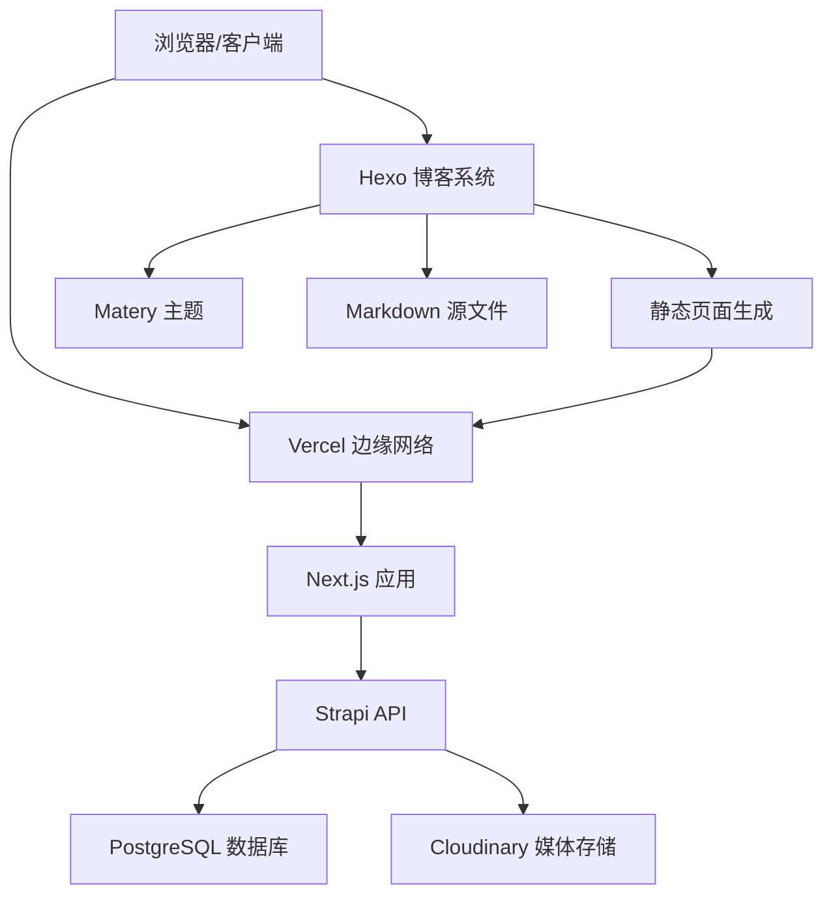

# 开发指南

<cite>
**本文引用的文件**
- [_config.yml](file://_config.yml)
- [package.json](file://package.json)
- [themes/hexo-theme-matery/_config.yml](file://themes/hexo-theme-matery/_config.yml)
- [source/_posts/AI基础概念.md](file://source/_posts/AI基础概念.md)
- [source/about/index.md](file://source/about/index.md)
- [source/categories/index.md](file://source/categories/index.md)
- [source/tags/index.md](file://source/tags/index.md)
- [source/contact/index.md](file://source/contact/index.md)
- [source/friends/index.md](file://source/friends/index.md)
- [source/404.md](file://source/404.md)
- [scaffolds/draft.md](file://scaffolds/draft.md)
- [scaffolds/page.md](file://scaffolds/page.md)
- [scaffolds/post.md](file://scaffolds/post.md)
- [themes/hexo-theme-matery/README.md](file://themes/hexo-theme-matery/README.md)
- [themes/hexo-theme-matery/README_CN.md](file://themes/hexo-theme-matery/README_CN.md)
- [themes/hexo-theme-matery/_config.yml](file://themes/hexo-theme-matery/_config.yml)
- [themes/hexo-theme-matery/layout/layout.ejs](file://themes/hexo-theme-matery/layout/layout.ejs)
- [themes/hexo-theme-matery/layout/post.ejs](file://themes/hexo-theme-matery/layout/post.ejs)
- [themes/hexo-theme-matery/layout/index.ejs](file://themes/hexo-theme-matery/layout/index.ejs)
- [themes/hexo-theme-matery/source/css/matery.css](file://themes/hexo-theme-matery/source/css/matery.css)
- [themes/hexo-theme-matery/source/js/matery.js](file://themes/hexo-theme-matery/source/js/matery.js)
- [themes/hexo-theme-matery/source/libs/materialize/materialize.min.css](file://themes/hexo-theme-matery/source/libs/materialize/materialize.min.css)
- [themes/hexo-theme-matery/source/libs/aos/aos.css](file://themes/hexo-theme-matery/source/libs/aos/aos.css)
- [themes/hexo-theme-matery/source/libs/animate/animate.min.css](file://themes/hexo-theme-matery/source/libs/animate/animate.min.css)
- [themes/hexo-theme-matery/source/libs/lightGallery/css/lightgallery.min.css](file://themes/hexo-theme-matery/source/libs/lightGallery/css/lightgallery.min.css)
- [themes/hexo-theme-matery/source/libs/prism/prism.css](file://themes/hexo-theme-matery/source/libs/prism/prism.css)
- [themes/hexo-theme-matery/source/libs/jquery/jquery.min.js](file://themes/hexo-theme-matery/source/libs/jquery/jquery.min.js)
- [themes/hexo-theme-matery/source/libs/materialize/materialize.min.js](file://themes/hexo-theme-matery/source/libs/materialize/materialize.min.js)
- [themes/hexo-theme-matery/source/libs/aos/aos.js](file://themes/hexo-theme-matery/source/libs/aos/aos.js)
- [themes/hexo-theme-matery/source/libs/lightGallery/js/lightgallery-all.min.js](file://themes/hexo-theme-matery/source/libs/lightGallery/js/lightgallery-all.min.js)
- [themes/hexo-theme-matery/source/libs/prism/prism.js](file://themes/hexo-theme-matery/source/libs/prism/prism.js)
- [themes/hexo-theme-matery/source/libs/instantpage/instantpage.js](file://themes/hexo-theme-matery/source/libs/instantpage/instantpage.js)
- [themes/hexo-theme-matery/source/libs/scrollprogress/scrollProgress.min.js](file://themes/hexo-theme-matery/source/libs/scrollprogress/scrollProgress.min.js)
- [themes/hexo-theme-matery/source/libs/cryptojs/crypto-js.min.js](file://themes/hexo-theme-matery/source/libs/cryptojs/crypto-js.min.js)
- [themes/hexo-theme-matery/source/libs/echarts/echarts.min.js](file://themes/hexo-theme-matery/source/libs/echarts/echarts.min.js)
- [themes/hexo-theme-matery/source/libs/gitalk/gitalk.min.js](file://themes/hexo-theme-matery/source/libs/gitalk/gitalk.min.js)
- [themes/hexo-theme-matery/source/libs/valine/Valine.min.js](file://themes/hexo-theme-matery/source/libs/valine/Valine.min.js)
- [themes/hexo-theme-matery/source/libs/minivaline/MiniValine.js](file://themes/hexo-theme-matery/source/libs/minivaline/MiniValine.js)
- [themes/hexo-theme-matery/source/libs/tocbot/tocbot.min.js](file://themes/hexo-theme-matery/source/libs/tocbot/tocbot.min.js)
- [themes/hexo-theme-matery/source/libs/jqcloud/jqcloud-1.0.4.min.js](file://themes/hexo-theme-matery/source/libs/jqcloud/jqcloud-1.0.4.min.js)
- [themes/hexo-theme-matery/source/libs/aplayer/APlayer.min.js](file://themes/hexo-theme-matery/source/libs/aplayer/APlayer.min.js)
- [themes/hexo-theme-matery/source/libs/dplayer/DPlayer.min.js](file://themes/hexo-theme-matery/source/libs/dplayer/DPlayer.min.js)
- [themes/hexo-theme-matery/source/libs/background/canvas-nest.js](file://themes/hexo-theme-matery/source/libs/background/canvas-nest.js)
- [themes/hexo-theme-matery/source/libs/background/ribbon.min.js](file://themes/hexo-theme-matery/source/libs/background/ribbon.min.js)
- [themes/hexo-theme-matery/source/libs/background/ribbon-dynamic.js](file://themes/hexo-theme-matery/source/libs/background/ribbon-dynamic.js)
- [themes/hexo-theme-matery/source/libs/background/ribbon-refresh.min.js](file://themes/hexo-theme-matery/source/libs/background/ribbon-refresh.min.js)
- [themes/hexo-theme-matery/source/libs/others/clicklove.js](file://themes/hexo-theme-matery/source/libs/others/clicklove.js)
- [themes/hexo-theme-matery/source/libs/others/busuanzi.pure.mini.js](file://themes/hexo-theme-matery/source/libs/others/busuanzi.pure.mini.js)
- [themes/hexo-theme-matery/source/libs/instantpage/instantpage.js](file://themes/hexo-theme-matery/source/libs/instantpage/instantpage.js)
- [themes/hexo-theme-matery/languages/default.yml](file://themes/hexo-theme-matery/languages/default.yml)
- [themes/hexo-theme-matery/languages/zh-CN.yml](file://themes/hexo-theme-matery/languages/zh-CN.yml)
</cite>

## 更新摘要
**变更内容**
- 新增 Hexo 博客系统开发流程章节
- 添加主题定制与配置指南
- 补充内容发布与管理流程
- 增加评论系统与第三方集成配置
- 完善部署与优化策略

## 目录
1. [简介](#简介)
2. [项目结构](#项目结构)
3. [核心组件](#核心组件)
4. [架构总览](#架构总览)
5. [Hexo 博客系统开发流程](#hexo-博客系统开发流程)
6. [主题定制与配置](#主题定制与配置)
7. [内容发布与管理](#内容发布与管理)
8. [评论系统与第三方集成](#评论系统与第三方集成)
9. [部署与优化策略](#部署与优化策略)
10. [性能考虑](#性能考虑)
11. [故障排查指南](#故障排查指南)
12. [结论](#结论)
13. [附录](#附录)

## 简介
本开发指南面向 Battivus 项目的开发者与运维人员，系统性阐述代码规范、开发流程、配置与质量标准、调试与测试策略、性能优化、重构与代码评审流程、团队协作与版本控制、项目结构与命名约定、文档编写标准，以及新功能开发工作流与常见问题解决方案。**本次更新特别增加了 Hexo 博客系统的开发流程、主题定制、内容发布等相关开发指导**，涵盖从基础配置到高级定制的完整开发体验。

## 项目结构
项目采用多包结构：根目录包含前端（frontend）、内容管理（cms）、Hexo 博客系统，以及部署与架构文档。各子项目独立管理依赖与构建配置，通过脚本统一启动与监控。

```mermaid
graph TB
subgraph "项目根目录"
Root["根目录"]
Docs["DEPLOYMENT.md<br/>WEBSITE_ARCHITECTURE.md"]
Scripts["start-dev.sh"]
end
subgraph "前端frontend"
FE_Pkg["package.json"]
FE_TS["tsconfig.json"]
FE_ESL["eslint.config.mjs"]
FE_Next["next.config.ts"]
FE_PostCSS["postcss.config.mjs"]
end
subgraph "CMScms"
CMS_Pkg["package.json"]
CMS_TS["tsconfig.json"]
CMS_Server["config/server.ts"]
CMS_DB["config/database.ts"]
CMS_Plugins["config/plugins.ts"]
CMS_MW["config/middlewares.ts"]
CMS_Admin["config/admin.ts"]
CMS_Index["src/index.ts"]
end
subgraph "Hexo博客系统"
Hexo_Config["_config.yml"]
Hexo_Pkg["package.json"]
Hexo_Theme["themes/hexo-theme-matery/_config.yml"]
Hexo_Source["source/_posts/"]
Hexo_Scaffolds["scaffolds/"]
end
Root --> FE_Pkg
Root --> CMS_Pkg
Root --> Hexo_Config
Root --> Docs
Root --> Scripts
FE_Pkg --> FE_TS
FE_Pkg --> FE_ESL
FE_Pkg --> FE_Next
FE_Pkg --> FE_PostCSS
CMS_Pkg --> CMS_TS
CMS_Pkg --> CMS_Server
CMS_Pkg --> CMS_DB
CMS_Pkg --> CMS_Plugins
CMS_Pkg --> CMS_MW
CMS_Pkg --> CMS_Admin
CMS_Pkg --> CMS_Index
Hexo_Config --> Hexo_Pkg
Hexo_Config --> Hexo_Theme
Hexo_Config --> Hexo_Source
Hexo_Config --> Hexo_Scaffolds
```



**图表来源**
- [_config.yml:1-112](file://_config.yml#L1-L112)
- [package.json:1-30](file://package.json#L1-L30)
- [themes/hexo-theme-matery/_config.yml:1-634](file://themes/hexo-theme-matery/_config.yml#L1-L634)

**章节来源**
- [_config.yml:1-112](file://_config.yml#L1-L112)
- [package.json:1-30](file://package.json#L1-L30)
- [themes/hexo-theme-matery/_config.yml:1-634](file://themes/hexo-theme-matery/_config.yml#L1-L634)

## 核心组件
- 前端（Next.js）
  - 使用 TypeScript 严格模式与 ESNext 模块解析，启用增量编译与隔离模块检查，路径别名 @/* 指向 src。
  - ESLint 配置基于 Next.js 官方规则集，覆盖 Core Web Vitals 与 TypeScript 检查，并自定义忽略列表。
  - PostCSS 使用 TailwindCSS 插件，支持按需样式生成。
  - Next.js 配置关闭开发指示器以减少噪音。
- CMS（Strapi）
  - 使用 TypeScript 编译选项，允许 JS 与 TS 混合，严格级别较低以便快速迭代。
  - 服务器配置暴露 HOST、PORT、APP_KEYS；中间件启用安全策略、CORS、查询、Body 解析等；插件配置 Cloudinary 上传；数据库使用 PostgreSQL；管理员密钥与传输令牌盐值由环境变量注入。
  - 启动时自动为公共角色授予 API 权限并执行种子数据（分类与产品），确保首次运行具备可用内容。
- **Hexo 博客系统**
  - 基于 Hexo 8.1.1 版本，使用 Matery 主题，支持 Markdown 渲染、代码高亮、评论系统集成。
  - 配置丰富的主题选项，包括导航菜单、社交链接、音乐播放器、视频嵌入、打赏功能等。
  - 内置多种页面模板：文章、标签、分类、关于、联系、友链、404 页面等。
  - 支持搜索功能、统计分析、SEO 优化等高级特性。

**章节来源**
- [themes/hexo-theme-matery/_config.yml:1-634](file://themes/hexo-theme-matery/_config.yml#L1-L634)
- [source/_posts/AI基础概念.md:1-106](file://source/_posts/AI基础概念.md#L1-L106)

## 架构总览
系统采用"前端静态站点 + 后台无头 CMS + Hexo 博客系统 + 关系型数据库"的分层架构，前后端通过 API 连接，媒体资源托管于 Cloudinary，博客内容通过 Hexo 静态生成。



**图表来源**
- [_config.yml:95-99](file://_config.yml#L95-L99)
- [themes/hexo-theme-matery/_config.yml:93](file://themes/hexo-theme-matery/_config.yml#L93)

**章节来源**
- [_config.yml:1-112](file://_config.yml#L1-L112)

## Hexo 博客系统开发流程

### 环境搭建与初始化
Hexo 博客系统基于 Node.js 环境，使用 Hexo 8.1.1 版本，通过 npm 管理依赖。

**核心配置文件**
- `_config.yml`：Hexo 主配置文件，包含站点信息、URL 设置、目录配置、写作设置等
- `package.json`：项目依赖管理，包含 Hexo 核心包和各种插件
- `themes/hexo-theme-matery/_config.yml`：Matery 主题配置文件，涵盖所有主题功能开关

**开发环境设置**
```bash
# 安装 Hexo CLI
npm install -g hexo-cli

# 安装项目依赖
npm install

# 本地开发服务器
hexo server

# 生成静态文件
hexo generate

# 部署
hexo deploy
```

**章节来源**
- [package.json:1-30](file://package.json#L1-L30)
- [_config.yml:1-112](file://_config.yml#L1-L112)

### 内容创作工作流
Hexo 提供了完整的 Markdown 内容创作工作流，支持草稿、页面和文章三种基本内容类型。

**内容类型与模板**
- 草稿（Draft）：`scaffolds/draft.md` - 用于未完成的内容草稿
- 页面（Page）：`scaffolds/page.md` - 用于独立页面内容
- 文章（Post）：`scaffolds/post.md` - 用于博客文章内容

**Front-matter 配置**
每篇内容都支持 YAML 格式的 Front-matter 配置，包含标题、日期、作者、标签、分类等元数据。

**章节来源**
- [scaffolds/draft.md](file://scaffolds/draft.md)
- [scaffolds/page.md](file://scaffolds/page.md)
- [scaffolds/post.md](file://scaffolds/post.md)
- [source/_posts/AI基础概念.md:1-17](file://source/_posts/AI基础概念.md#L1-L17)

### 主题开发与定制
Matery 主题提供了丰富的定制选项，支持全局配置和局部覆盖。

**主题配置层次**
1. **全局配置**：`themes/hexo-theme-matery/_config.yml` - 主题默认配置
2. **用户覆盖**：`source/_data/theme_config.yml` - 用户自定义配置覆盖
3. **页面级配置**：`layout/_partial/` - 页面局部定制

**核心功能模块**
- 导航菜单：`menu` - 配置主导航链接和图标
- 社交链接：`socialLink` - 配置社交媒体账号链接
- 首页轮播：`cover` - 配置首页封面轮播图
- 音乐播放器：`music` - 配置网易云音乐集成
- 代码高亮：`prismjs` - 配置代码语法高亮

**章节来源**
- [themes/hexo-theme-matery/_config.yml:1-634](file://themes/hexo-theme-matery/_config.yml#L1-L634)

## 主题定制与配置

### 导航菜单定制
Matery 主题的导航菜单支持多级菜单配置，可通过 `menu` 配置项进行定制。

**菜单配置示例**
```yaml
menu:
  Index:
    url: /
    icon: fas fa-home
  Tags:
    url: /tags
    icon: fas fa-tags
  Categories:
    url: /categories
    icon: fas fa-bookmark
  Archives:
    url: /archives
    icon: fas fa-archive
  About:
    url: /about
    icon: fas fa-user-circle
  Contact:
    url: /contact
    icon: fas fa-comments
  Friends:
    url: /friends
    icon: fas fa-address-book
```

**多级菜单支持**
```yaml
# 二级菜单示例
Medias:
  icon: fas fa-list
  children:
    - name: Musics
      url: /musics
      icon: fas fa-music
    - name: Movies
      url: /movies
      icon: fas fa-film
```

**章节来源**
- [themes/hexo-theme-matery/_config.yml:3-41](file://themes/hexo-theme-matery/_config.yml#L3-L41)

### 社交链接与个人资料
主题支持丰富的社交链接配置和个人信息展示。

**社交链接配置**
```yaml
socialLink:
  github:  https://github.com/doubler12138
  email: 1036460042@qq.com
  facebook: 
  twitter: 
  qq: 1036460042
  weibo: 
  zhihu: 
  rss: false
```

**个人资料配置**
```yaml
profile:
  avatar: /medias/avatar.jpg
  career: Software Engineer
  introduction: If you wish to succeed, you should use persistence as your good friend, experience as your reference, prudence as your brother and hope as your sentry.
```

**章节来源**
- [themes/hexo-theme-matery/_config.yml:134-142](file://themes/hexo-theme-matery/_config.yml#L134-L142)
- [themes/hexo-theme-matery/_config.yml:203-209](file://themes/hexo-theme-matery/_config.yml#L203-L209)

### 首页功能定制
Matery 主题提供了丰富的首页功能模块，包括轮播图、音乐播放器、视频嵌入、推荐文章等。

**首页轮播图配置**
```yaml
cover:
  showPrevNext: false
  showIndicators: false
  autoLoop: false
  duration: 120
  intervalTime: 5000
  useConfig: false
```

**音乐播放器配置**
```yaml
music:
  enable: true
  title: 
    enable: true
    show: 听听音乐
  autoHide: true
  server: netease
  type: playlist
  id: 123216450
  fixed: true
  autoplay: false
  theme: '#42b983'
  loop: 'all'
  order: 'random'
  preload: 'auto'
  volume: 0.7
  listFolded: false
  hideLrc: true
```

**章节来源**
- [themes/hexo-theme-matery/_config.yml:55-62](file://themes/hexo-theme-matery/_config.yml#L55-L62)
- [themes/hexo-theme-matery/_config.yml:74-91](file://themes/hexo-theme-matery/_config.yml#L74-L91)

### 代码高亮与数学公式
主题内置 Prism.js 代码高亮和 MathJax 数学公式支持。

**代码高亮配置**
```yaml
prismjs:
  preprocess: true
  line_number: true
  tab_replace: ''
```

**数学公式配置**
```yaml
mathjax:
  enable: false
  cdn: https://cdn.bootcss.com/mathjax/2.7.5/MathJax.js?config=TeX-AMS-MML_HTMLorMML
```

**章节来源**
- [_config.yml:47-50](file://_config.yml#L47-L50)
- [themes/hexo-theme-matery/_config.yml:176-183](file://themes/hexo-theme-matery/_config.yml#L176-L183)

## 内容发布与管理

### 文章创作流程
Hexo 提供了完整的文章创作和发布流程，支持 Markdown 语法和 Front-matter 元数据。

**文章 Front-matter 字段**
```yaml
---
title: AI基础概念
date: 2026-02-12T20:41:00
author: DoubleR
img: ../images/AI基础概念/cover.jpg
top: true
hide: false
cover: true
password: 8d969eef6ecad3c29a3a629280e686cf0c3f5d5a86aff3ca12020c923adc6c92
toc: false
mathjax: false
summary: 本文简单介绍了AI相关的基础概念...
categories: AI
tags:
  - AI
  - 基础概念
---
```

**章节来源**
- [source/_posts/AI基础概念.md:1-17](file://source/_posts/AI基础概念.md#L1-L17)

### 页面管理
Hexo 支持多种页面类型的管理，包括独立页面、分类页面、标签页面等。

**页面 Front-matter 配置**
```yaml
---
title: about
date: 2026-03-25 22:18:44
type: "about"
layout: "about"
---
```

**核心页面类型**
- 关于页面：`source/about/index.md`
- 分类页面：`source/categories/index.md`
- 标签页面：`source/tags/index.md`
- 联系页面：`source/contact/index.md`
- 友链页面：`source/friends/index.md`
- 404 页面：`source/404.md`

**章节来源**
- [source/about/index.md:1-7](file://source/about/index.md#L1-L7)
- [source/categories/index.md:1-7](file://source/categories/index.md#L1-L7)
- [source/tags/index.md:1-7](file://source/tags/index.md#L1-L7)
- [source/contact/index.md:1-7](file://source/contact/index.md#L1-L7)
- [source/friends/index.md:1-7](file://source/friends/index.md#L1-L7)
- [source/404.md:1-7](file://source/404.md#L1-L7)

### 内容组织与分类
Hexo 支持灵活的内容组织方式，包括分类、标签、归档等功能。

**分类与标签配置**
```yaml
# 分类映射
category_map:
tag_map:
```

**归档配置**
```yaml
archive_dir: archives
yearly: true
monthly: true
daily: false
```

**章节来源**
- [_config.yml:61-64](file://_config.yml#L61-L64)
- [_config.yml:27-28](file://_config.yml#L27-L28)

## 评论系统与第三方集成

### 评论系统配置
Matery 主题支持多种评论系统，包括 Gitalk、Valine、Disqus 等。

**Gitalk 配置**
```yaml
gitalk:
  enable: false
  owner:
  repo:
  oauth:
    clientId:
    clientSecret:
  admin:
```

**Valine 配置**
```yaml
valine:
  enable: false
  appId:
  appKey:
  notify: false
  verify: false
  visitor: true
  avatar: 'mm'
  pageSize: 10
  placeholder: 'just go go'
  background: /medias/comment_bg.png
```

**MiniValine 配置**
```yaml
minivaline:
  enable: false
  appId: zhM0AOiqle17oPoE84CoYw1e-gzGzoHsz
  appKey: itmzT1JbXfAjVwMqDhGPzU45
  mode: DesertsP
  placeholder: Write a Comment
  math: true
  md: true
  enableQQ: false
  NoRecordIP: false
  visitor: true
  maxNest: 6
  pageSize: 6
  adminEmailMd5: de8a7aa53d07e6b6bceb45c64027763d
```

**章节来源**
- [themes/hexo-theme-matery/_config.yml:283-374](file://themes/hexo-theme-matery/_config.yml#L283-L374)

### 统计分析集成
主题集成了多种统计分析工具，包括百度统计、Google Analytics、不蒜子等。

**百度统计配置**
```yaml
baiduAnalytics:
  enable: false
  id:
```

**Google Analytics 配置**
```yaml
googleAnalytics:
  enable: false
  id:
```

**不蒜子统计配置**
```yaml
busuanziStatistics:
  enable: true
  totalTraffic: true
  totalNumberOfvisitors: true
```

**章节来源**
- [themes/hexo-theme-matery/_config.yml:404-415](file://themes/hexo-theme-matery/_config.yml#L404-L415)
- [themes/hexo-theme-matery/_config.yml:397-403](file://themes/hexo-theme-matery/_config.yml#L397-L403)

### 媒体资源管理
主题支持多种媒体资源的管理和展示，包括图片、视频、音乐等。

**图片资源配置**
```yaml
featureImages:
  - /medias/featureimages/0.jpg
  - /medias/featureimages/1.jpg
  # ... 更多图片
```

**视频资源配置**
```yaml
video:
  enable: false
  showTitle: true
  title: 精彩视频
  url:
  pic:
  thumbnails:
  height:
  autoplay: false
  theme: '#42b983'
  loop: false
  preload: 'auto'
  volume: 0.7
```

**章节来源**
- [themes/hexo-theme-matery/_config.yml:463-490](file://themes/hexo-theme-matery/_config.yml#L463-L490)
- [themes/hexo-theme-matery/_config.yml:93-107](file://themes/hexo-theme-matery/_config.yml#L93-L107)

## 部署与优化策略

### 部署配置
Hexo 支持多种部署方式，包括 GitHub Pages、FTP、SFTP 等。

**部署配置示例**
```yaml
# Deployment
## Docs: https://hexo.io/docs/one-command-deployment
deploy:
  type: ''
```

**常用部署方式**
- GitHub Pages：适用于开源项目和静态网站托管
- FTP/SFTP：适用于传统服务器部署
- Coding Pages：适用于国内用户

**章节来源**
- [_config.yml:95-99](file://_config.yml#L95-L99)

### 性能优化配置
主题提供了多种性能优化选项，包括资源压缩、缓存策略、CDN 加速等。

**CDN 加速配置**
```yaml
# CDN访问加速
jsDelivr:
  url: # https://cdn.jsdelivr.net/gh/skyls03/skyls03.github.io
```

**前端库配置**
```yaml
libs:
  css:
    matery: /css/matery.css
    mycss: /css/my.css
    fontAwesome: /libs/awesome/css/all.css
    materialize: /libs/materialize/materialize.min.css
    aos: /libs/aos/aos.css
    animate: /libs/animate/animate.min.css
    lightgallery: /libs/lightGallery/css/lightgallery.min.css
    aplayer: /libs/aplayer/APlayer.min.css
    dplayer: /libs/dplayer/DPlayer.min.css
    gitalk: /libs/gitalk/gitalk.css
    jqcloud: /libs/jqcloud/jqcloud.css
    tocbot: /libs/tocbot/tocbot.css
    prism: /libs/prism/prism.css
  js:
    matery: /js/matery.js
    jquery: /libs/jquery/jquery.min.js
    materialize: /libs/materialize/materialize.min.js
    masonry: /libs/masonry/masonry.pkgd.min.js
    aos: /libs/aos/aos.js
    scrollProgress: /libs/scrollprogress/scrollProgress.min.js
    lightgallery: /libs/lightGallery/js/lightgallery-all.min.js
    clicklove: /libs/others/clicklove.js
    busuanzi: /libs/others/busuanzi.pure.mini.js
    aplayer: /libs/aplayer/APlayer.min.js
    dplayer: /libs/dplayer/DPlayer.min.js
    crypto: /libs/cryptojs/crypto-js.min.js
    echarts: /libs/echarts/echarts.min.js
    gitalk: /libs/gitalk/gitalk.min.js
    valine: /libs/valine/Valine.min.js
    minivaline: /libs/minivaline/MiniValine.js
    jqcloud: /libs/jqcloud/jqcloud-1.0.4.min.js
    tocbot: /libs/tocbot/tocbot.min.js
    canvas_nest: /libs/background/canvas-nest.js
    ribbon: /libs/background/ribbon.min.js
    ribbonRefresh: /libs/background/ribbon-refresh.min.js
    ribbon_dynamic: /libs/background/ribbon-dynamic.js
    instantpage: /libs/instantpage/instantpage.js
```

**章节来源**
- [themes/hexo-theme-matery/_config.yml:592-603](file://themes/hexo-theme-matery/_config.yml#L592-L603)
- [themes/hexo-theme-matery/_config.yml:419-462](file://themes/hexo-theme-matery/_config.yml#L419-L462)

### SEO 优化配置
主题内置了多种 SEO 优化功能，包括 Meta 标签、结构化数据、sitemap 等。

**SEO 相关配置**
```yaml
# Metadata elements
meta_generator: true

# Search
search:
  path: search.xml
  field: post
```

**章节来源**
- [_config.yml:67-68](file://_config.yml#L67-L68)
- [_config.yml:101-105](file://_config.yml#L101-L105)

## 性能考虑
- **构建性能**
  - 使用 Hexo 的增量构建功能，只重新生成变化的内容
  - 合理配置资源压缩和合并，减少 HTTP 请求
  - 利用 CDN 加速静态资源加载
- **运行时性能**
  - 启用浏览器缓存策略，设置合理的缓存头
  - 优化图片资源，使用现代格式如 WebP
  - 实施懒加载策略，提升首屏加载速度
- **SEO 性能**
  - 优化页面结构化数据，提升搜索引擎可见性
  - 实施合理的 URL 结构和面包屑导航
  - 配置 sitemap 和 robots.txt

**章节来源**
- [themes/hexo-theme-matery/_config.yml:592-603](file://themes/hexo-theme-matery/_config.yml#L592-L603)

## 故障排查指南
- **构建失败**
  - 检查 Node.js 版本兼容性
  - 确认依赖包安装完整
  - 查看构建日志中的具体错误信息
- **主题显示异常**
  - 验证主题配置文件语法正确性
  - 检查静态资源路径配置
  - 确认浏览器缓存已清除
- **评论系统问题**
  - 验证第三方服务的 API 密钥配置
  - 检查网络连接和跨域设置
  - 查看浏览器开发者工具中的错误信息
- **部署失败**
  - 确认部署凭证配置正确
  - 检查目标服务器的权限设置
  - 验证网络连接和 DNS 解析

**章节来源**
- [themes/hexo-theme-matery/_config.yml:271-282](file://themes/hexo-theme-matery/_config.yml#L271-L282)

## 结论
本指南从配置、流程、质量、性能与协作五个维度为 Battivus 项目提供了可操作的开发规范与最佳实践。**新增的 Hexo 博客系统开发指南涵盖了从基础配置到高级定制的完整开发体验**，包括开发流程、主题定制、内容发布、评论系统集成等多个方面。遵循本文档可显著提升开发效率、代码质量与系统稳定性，确保项目在高性能与高可维护性的前提下持续演进。

## 附录
- **Hexo 开发命令**
  - 本地开发：`hexo server`
  - 生成静态文件：`hexo generate`
  - 清理缓存：`hexo clean`
  - 部署：`hexo deploy`
- **主题定制参考**
  - Matery 主题官方文档
  - Hexo 官方主题开发指南
  - 前端资源优化最佳实践
- **相关文档**
  - DEPLOYMENT.md
  - WEBSITE_ARCHITECTURE.md

**章节来源**
- [package.json:5-10](file://package.json#L5-L10)
- [themes/hexo-theme-matery/README.md](file://themes/hexo-theme-matery/README.md)
- [themes/hexo-theme-matery/README_CN.md](file://themes/hexo-theme-matery/README_CN.md)