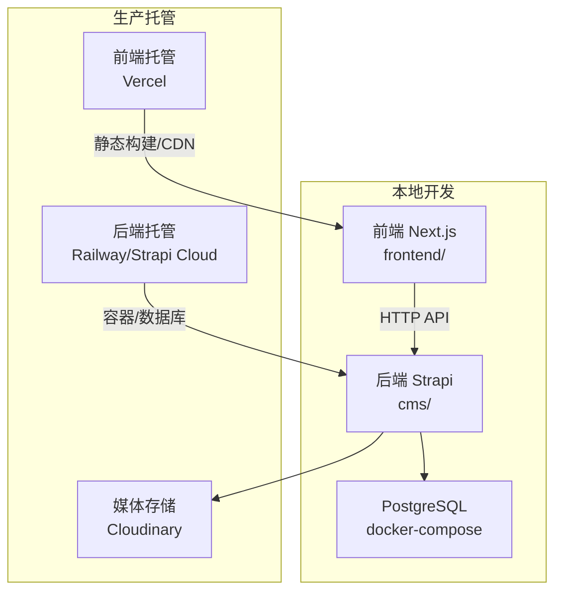
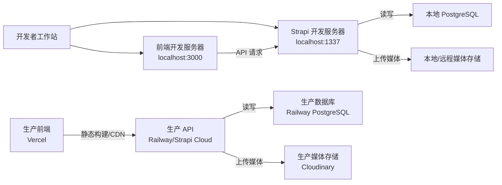
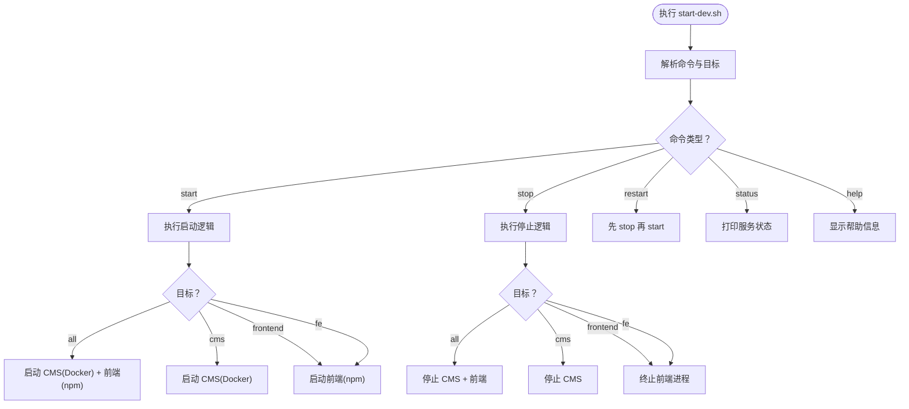
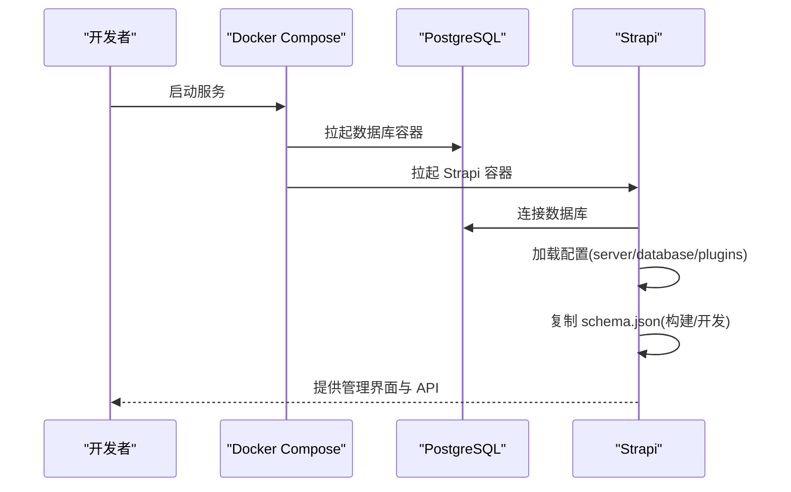
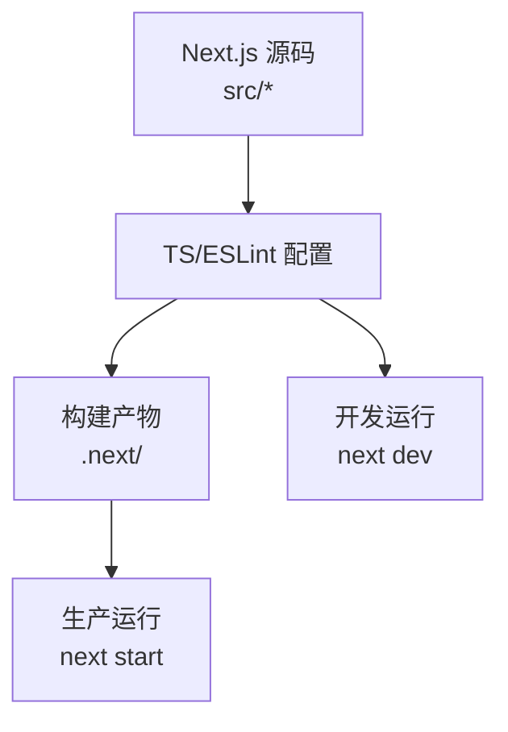
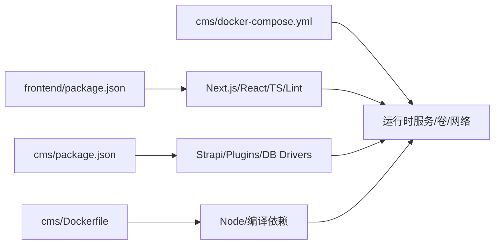

# 开发流程

<cite>
**本文引用的文件**
- [start-dev.sh](file://start-dev.sh)
- [DEPLOYMENT.md](file://DEPLOYMENT.md)
- [WEBSITE_ARCHITECTURE.md](file://WEBSITE_ARCHITECTURE.md)
- [cms/Dockerfile](file://cms/Dockerfile)
- [cms/docker-compose.yml](file://cms/docker-compose.yml)
- [cms/package.json](file://cms/package.json)
- [cms/tsconfig.json](file://cms/tsconfig.json)
- [cms/config/server.ts](file://cms/config/server.ts)
- [cms/config/database.ts](file://cms/config/database.ts)
- [cms/config/plugins.ts](file://cms/config/plugins.ts)
- [cms/scripts/dev-with-schemas.js](file://cms/scripts/dev-with-schemas.js)
- [cms/scripts/copy-schemas.js](file://cms/scripts/copy-schemas.js)
- [frontend/package.json](file://frontend/package.json)
- [frontend/tsconfig.json](file://frontend/tsconfig.json)
- [frontend/next.config.ts](file://frontend/next.config.ts)
- [frontend/eslint.config.mjs](file://frontend/eslint.config.mjs)
</cite>

## 目录
1. [简介](#简介)
2. [项目结构](#项目结构)
3. [核心组件](#核心组件)
4. [架构总览](#架构总览)
5. [详细组件分析](#详细组件分析)
6. [依赖关系分析](#依赖关系分析)
7. [性能与开发体验](#性能与开发体验)
8. [故障排查指南](#故障排查指南)
9. [结论](#结论)
10. [附录](#附录)

## 简介
本文件面向 Battivus 项目团队，提供从本地开发到容器化部署、再到生产托管的完整开发流程文档。内容覆盖：
- 本地开发环境搭建与启动（含 Docker 容器化）
- 开发服务器启动与控制脚本使用
- Git 工作流、分支与合并策略建议
- 新功能开发标准流程、代码审查与测试要求
- 环境变量配置、依赖管理与媒体存储
- 热重载、调试配置与常用开发工具
- 常见开发场景操作步骤与最佳实践

## 项目结构
项目采用前后端分离架构：前端基于 Next.js，后端基于 Strapi，数据库为 PostgreSQL，媒体存储可选 Cloudinary。开发与部署均通过 Docker Compose 实现本地与生产的统一。

图表来源
- [cms/docker-compose.yml:1-67](file://cms/docker-compose.yml#L1-L67)
- [DEPLOYMENT.md:10-17](file://DEPLOYMENT.md#L10-L17)

章节来源
- [WEBSITE_ARCHITECTURE.md:48-95](file://WEBSITE_ARCHITECTURE.md#L48-L95)
- [DEPLOYMENT.md:3-17](file://DEPLOYMENT.md#L3-L17)

## 核心组件
- 前端（Next.js）：负责页面渲染、SEO、静态资源与 API 调用。
- 后端（Strapi）：提供内容管理、数据模型、上传插件与 API。
- 数据库（PostgreSQL）：由 Docker Compose 提供，支持本地开发与生产托管。
- 媒体存储（Cloudinary）：可选，用于图片与文件托管，避免容器重启导致数据丢失。
- 开发控制脚本：统一启动/停止/状态查看，便于本地联调。

章节来源
- [frontend/package.json:1-26](file://frontend/package.json#L1-L26)
- [cms/package.json:1-36](file://cms/package.json#L1-L36)
- [cms/docker-compose.yml:1-67](file://cms/docker-compose.yml#L1-L67)
- [cms/config/plugins.ts:1-19](file://cms/config/plugins.ts#L1-L19)

## 架构总览
下图展示本地与生产的关键交互路径，帮助理解开发与部署的衔接。

图表来源
- [cms/docker-compose.yml:1-67](file://cms/docker-compose.yml#L1-L67)
- [DEPLOYMENT.md:109-130](file://DEPLOYMENT.md#L109-L130)
- [cms/config/plugins.ts:1-19](file://cms/config/plugins.ts#L1-L19)

## 详细组件分析

### 本地开发控制脚本（start-dev.sh）
- 功能：一键启动/停止/重启/查看状态，支持分别控制 CMS 或前端。
- 默认端口：CMS 1337，前端 3000。
- Docker：启动 Strapi 时使用 docker compose；前端使用 npm run dev。
- 健康检查：通过端口占用检测服务状态。

图表来源
- [start-dev.sh:120-195](file://start-dev.sh#L120-L195)

章节来源
- [start-dev.sh:1-195](file://start-dev.sh#L1-L195)

### Strapi 后端（cms）
- 容器化：Dockerfile 使用 Node.js 20 Alpine，安装编译依赖，构建并运行 Strapi。
- 编排：docker-compose 提供 PostgreSQL 与 Strapi 服务，挂载配置、源码与上传目录。
- 配置：server.ts、database.ts、plugins.ts 分别定义主机端口、数据库连接与上传插件。
- 开发辅助：copy-schemas.js 在构建时复制 schema.json；dev-with-schemas.js 在开发模式下监听编译完成事件后复制。

图表来源
- [cms/docker-compose.yml:1-67](file://cms/docker-compose.yml#L1-L67)
- [cms/Dockerfile:1-43](file://cms/Dockerfile#L1-L43)
- [cms/scripts/copy-schemas.js:1-47](file://cms/scripts/copy-schemas.js#L1-L47)
- [cms/scripts/dev-with-schemas.js:1-80](file://cms/scripts/dev-with-schemas.js#L1-L80)
- [cms/config/server.ts:1-11](file://cms/config/server.ts#L1-L11)
- [cms/config/database.ts:1-15](file://cms/config/database.ts#L1-L15)
- [cms/config/plugins.ts:1-19](file://cms/config/plugins.ts#L1-L19)

章节来源
- [cms/Dockerfile:1-43](file://cms/Dockerfile#L1-L43)
- [cms/docker-compose.yml:1-67](file://cms/docker-compose.yml#L1-L67)
- [cms/config/server.ts:1-11](file://cms/config/server.ts#L1-L11)
- [cms/config/database.ts:1-15](file://cms/config/database.ts#L1-L15)
- [cms/config/plugins.ts:1-19](file://cms/config/plugins.ts#L1-L19)
- [cms/scripts/copy-schemas.js:1-47](file://cms/scripts/copy-schemas.js#L1-L47)
- [cms/scripts/dev-with-schemas.js:1-80](file://cms/scripts/dev-with-schemas.js#L1-L80)

### 前端（frontend）
- 构建与运行：使用 Next.js，开发模式端口 3000；生产构建与启动脚本已配置。
- 类型与校验：TypeScript 严格模式；ESLint 配置遵循 Next.js 规范。
- 路径别名：@/* 指向 src/*，便于模块导入。

图表来源
- [frontend/package.json:1-26](file://frontend/package.json#L1-L26)
- [frontend/tsconfig.json:1-35](file://frontend/tsconfig.json#L1-L35)
- [frontend/eslint.config.mjs:1-19](file://frontend/eslint.config.mjs#L1-L19)
- [frontend/next.config.ts:1-9](file://frontend/next.config.ts#L1-L9)

章节来源
- [frontend/package.json:1-26](file://frontend/package.json#L1-L26)
- [frontend/tsconfig.json:1-35](file://frontend/tsconfig.json#L1-L35)
- [frontend/eslint.config.mjs:1-19](file://frontend/eslint.config.mjs#L1-L19)
- [frontend/next.config.ts:1-9](file://frontend/next.config.ts#L1-L9)

### 部署与托管（生产）
- 前端：在 Vercel 导入仓库，根目录选择 frontend，配置 NEXT_PUBLIC_API_URL 与 API_TOKEN。
- 后端：Railway 或 Strapi Cloud，配置数据库连接、密钥与媒体插件。
- 媒体：Cloudinary 插件需在依赖中声明并在 plugins.ts 中启用。
- 域名与 DNS：分别在 Vercel 与 Railway 设置域名并按指引配置记录。

章节来源
- [DEPLOYMENT.md:109-178](file://DEPLOYMENT.md#L109-L178)

## 依赖关系分析
- 前端依赖 Next.js、React 及开发工具链；TypeScript 严格模式提升类型安全。
- 后端依赖 Strapi v5、PostgreSQL 驱动、Cloudinary 上传插件；Dockerfile 显式安装编译依赖。
- 开发脚本与编排文件共同决定本地启动顺序与端口映射。

图表来源
- [frontend/package.json:1-26](file://frontend/package.json#L1-L26)
- [cms/package.json:1-36](file://cms/package.json#L1-L36)
- [cms/Dockerfile:1-43](file://cms/Dockerfile#L1-L43)
- [cms/docker-compose.yml:1-67](file://cms/docker-compose.yml#L1-L67)

章节来源
- [frontend/package.json:1-26](file://frontend/package.json#L1-L26)
- [cms/package.json:1-36](file://cms/package.json#L1-L36)
- [cms/Dockerfile:1-43](file://cms/Dockerfile#L1-L43)
- [cms/docker-compose.yml:1-67](file://cms/docker-compose.yml#L1-L67)

## 性能与开发体验
- 热重载与增量构建
  - 前端：Next.js 开发服务器提供热更新与快速刷新。
  - 后端：dev-with-schemas.js 在编译完成后自动复制 schema.json，减少手动干预。
- 构建优化
  - Dockerfile 中预装编译依赖，减少首次构建时间。
  - TypeScript 严格模式与 ESLint 规则有助于早期发现潜在问题。
- 资源隔离
  - docker-compose 将数据库与应用解耦，便于独立扩展与替换。

章节来源
- [cms/scripts/dev-with-schemas.js:1-80](file://cms/scripts/dev-with-schemas.js#L1-L80)
- [cms/Dockerfile:1-43](file://cms/Dockerfile#L1-L43)
- [frontend/eslint.config.mjs:1-19](file://frontend/eslint.config.mjs#L1-L19)

## 故障排查指南
- 无法访问本地 API
  - 检查 CMS 是否在 1337 端口运行；使用 start-dev.sh status 查看状态。
  - 确认 docker-compose 的端口映射与健康检查是否成功。
- 媒体上传失败或丢失
  - 确认 plugins.ts 中 Cloudinary 配置项齐全且已安装对应依赖。
  - 生产环境需在平台变量中注入密钥。
- 前端无法连接后端
  - 确认前端环境变量 NEXT_PUBLIC_API_URL 指向正确的后端地址（不含尾随斜杠）。
- 开发脚本异常
  - 使用 start-dev.sh help 查看可用命令；确保端口未被占用。

章节来源
- [start-dev.sh:102-118](file://start-dev.sh#L102-L118)
- [cms/docker-compose.yml:57-59](file://cms/docker-compose.yml#L57-L59)
- [cms/config/plugins.ts:1-19](file://cms/config/plugins.ts#L1-L19)
- [DEPLOYMENT.md:119-125](file://DEPLOYMENT.md#L119-L125)

## 结论
本开发流程以 Docker 容器化为核心，结合统一的开发控制脚本与明确的配置文件，实现前后端联调与生产托管的一致性。建议团队在日常开发中遵循本文档的流程与最佳实践，确保开发效率与交付质量。

## 附录

### 本地开发环境搭建与启动
- 准备工作
  - 安装 Docker 与 Node.js（版本满足后端 engines 要求）。
  - 克隆仓库并进入项目根目录。
- 启动服务
  - 执行 start-dev.sh 启动全部服务；或分别启动 CMS 与前端。
  - 访问 http://localhost:1337/admin 初始化管理员账户。
  - 访问 http://localhost:3000 预览前端。
- 停止与状态
  - 使用 start-dev.sh stop 或 restart 控制服务；status 查看在线状态。

章节来源
- [start-dev.sh:125-152](file://start-dev.sh#L125-L152)
- [cms/docker-compose.yml:1-67](file://cms/docker-compose.yml#L1-L67)

### Git 工作流、分支与合并策略
- 分支命名
  - feature/功能主题
  - fix/修复主题
  - hotfix/紧急修复
  - docs/文档更新
- 提交规范
  - 语义化提交（如 feat: 新增产品筛选器；fix: 修复媒体上传问题）。
- 合并策略
  - 使用 Pull Request 进行代码审查，合并前确保通过 Lint 与构建。
  - 主分支仅允许快进或 squash 合并，保持历史整洁。

[本节为通用流程建议，不直接分析具体文件，故无“章节来源”]

### 新功能开发标准流程
- 需求评审：明确功能范围与接口设计。
- 分支开发：基于 feature/xxx 创建分支。
- 接口与模型：在 Strapi 中新增内容类型与字段，必要时编写控制器/服务/路由。
- 前端集成：在 Next.js 中新增页面/组件，调用后端 API 并处理 SEO。
- 测试与校验：本地验证 API 与页面；运行 Lint 与构建。
- 提交与审查：推送 PR，至少一名同事审查通过后合并。

[本节为通用流程建议，不直接分析具体文件，故无“章节来源”]

### 代码审查与测试要求
- 代码审查
  - 关注可维护性、安全性与性能；确保新增逻辑有注释与边界处理。
- 测试
  - 前端：组件与页面的交互测试；API 调用的断言。
  - 后端：控制器/服务的单元测试；数据库迁移与 schema 同步验证。
- 质量门禁
  - 通过 ESLint、TypeScript 类型检查与构建任务。

[本节为通用流程建议，不直接分析具体文件，故无“章节来源”]

### 环境变量与依赖管理
- 后端环境变量（示例）
  - NODE_ENV、DATABASE_CLIENT、DATABASE_URL、JWT_SECRET、ADMIN_JWT_SECRET、API_TOKEN_SALT、APP_KEYS、CLOUDINARY_*。
- 前端环境变量（示例）
  - NEXT_PUBLIC_API_URL、API_TOKEN。
- 依赖管理
  - 前端：Next.js、React、TypeScript、TailwindCSS、ESLint。
  - 后端：Strapi、PostgreSQL/SQLite 驱动、Cloudinary 上传插件。

章节来源
- [DEPLOYMENT.md:66-82](file://DEPLOYMENT.md#L66-L82)
- [DEPLOYMENT.md:119-125](file://DEPLOYMENT.md#L119-L125)
- [cms/package.json:14-29](file://cms/package.json#L14-L29)
- [frontend/package.json:11-25](file://frontend/package.json#L11-L25)

### 热重载、调试与开发工具
- 热重载
  - 前端：next dev 自带 HMR；修改页面与组件即时生效。
  - 后端：dev-with-schemas.js 在编译完成后复制 schema.json，避免手动重复操作。
- 调试
  - 前端：浏览器开发者工具；Node 调试器（VS Code 等）附加到 next dev。
  - 后端：Strapi 日志输出；必要时在 IDE 中附加 Node 调试器。
- 开发工具
  - VS Code 扩展：ESLint、TypeScript、TailwindCSS IntelliSense。
  - 数据库可视化：pgAdmin 或 DBeaver 连接本地/远程 PostgreSQL。

章节来源
- [cms/scripts/dev-with-schemas.js:34-62](file://cms/scripts/dev-with-schemas.js#L34-L62)
- [frontend/eslint.config.mjs:1-19](file://frontend/eslint.config.mjs#L1-L19)

### 常见开发场景操作步骤与最佳实践
- 新增内容类型（Strapi）
  - 在 Strapi 管理后台创建内容类型；生成 schema.json 并同步到 dist。
  - 如使用 TypeScript，确保 copy-schemas.js 在构建阶段执行。
- 集成媒体上传
  - 在 plugins.ts 中启用 Cloudinary；在后端安装依赖并在平台变量中注入密钥。
- 前端页面对接
  - 在 Next.js 中新增页面；使用类型安全的 API 调用；生成 sitemap 与 SEO 元数据。
- 生产部署
  - 前端：Vercel 导入仓库，设置根目录为 frontend，配置环境变量。
  - 后端：Railway/Strapi Cloud，配置数据库与媒体插件；启用 CI 自动部署。

章节来源
- [cms/scripts/copy-schemas.js:1-47](file://cms/scripts/copy-schemas.js#L1-L47)
- [cms/config/plugins.ts:1-19](file://cms/config/plugins.ts#L1-L19)
- [DEPLOYMENT.md:109-178](file://DEPLOYMENT.md#L109-L178)