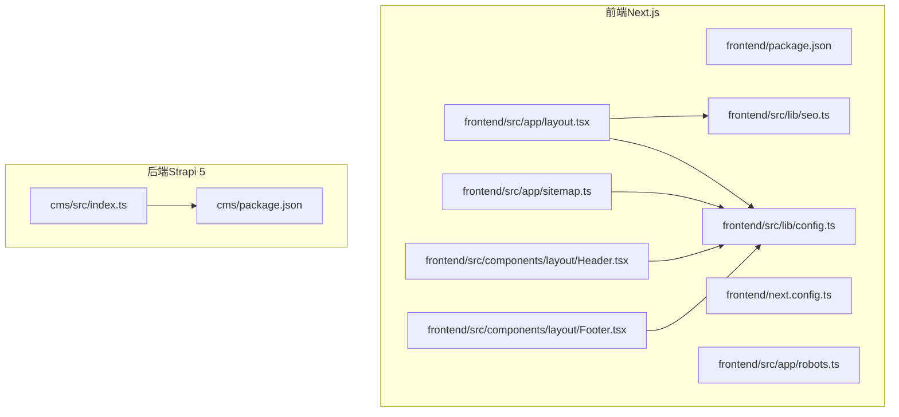
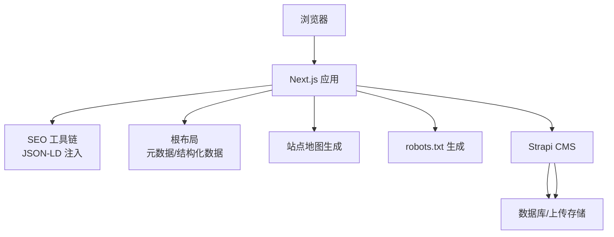
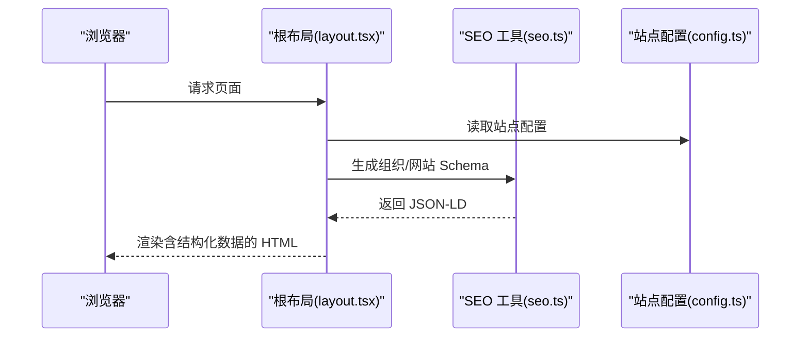
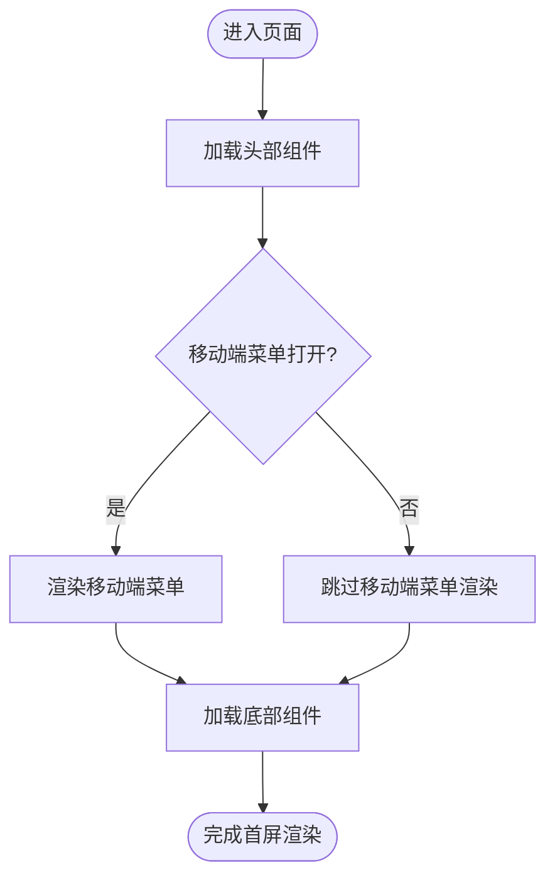
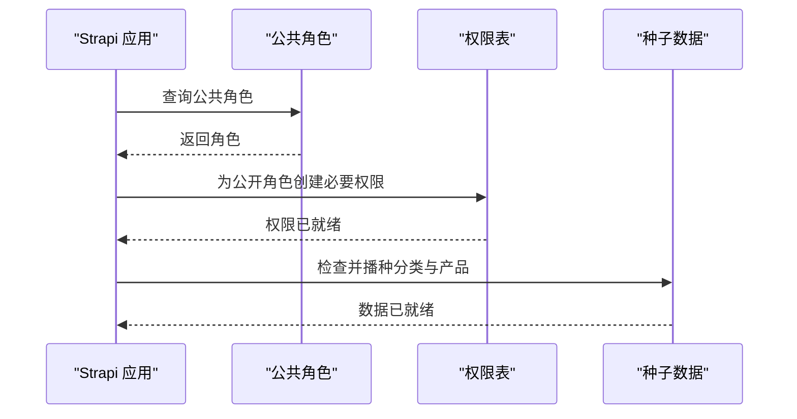

# 性能优化

<cite>
**本文引用的文件**
- [frontend/package.json](file://frontend/package.json)
- [frontend/next.config.ts](file://frontend/next.config.ts)
- [frontend/src/lib/config.ts](file://frontend/src/lib/config.ts)
- [frontend/src/lib/seo.ts](file://frontend/src/lib/seo.ts)
- [frontend/src/app/layout.tsx](file://frontend/src/app/layout.tsx)
- [frontend/src/app/sitemap.ts](file://frontend/src/app/sitemap.ts)
- [frontend/src/app/robots.ts](file://frontend/src/app/robots.ts)
- [frontend/src/components/layout/Header.tsx](file://frontend/src/components/layout/Header.tsx)
- [frontend/src/components/layout/Footer.tsx](file://frontend/src/components/layout/Footer.tsx)
- [cms/package.json](file://cms/package.json)
- [cms/src/index.ts](file://cms/src/index.ts)
</cite>

## 目录
1. [引言](#引言)
2. [项目结构](#项目结构)
3. [核心组件](#核心组件)
4. [架构总览](#架构总览)
5. [详细组件分析](#详细组件分析)
6. [依赖关系分析](#依赖关系分析)
7. [性能考虑](#性能考虑)
8. [故障排查指南](#故障排查指南)
9. [结论](#结论)
10. [附录](#附录)

## 引言
本指南面向 Battivus 项目的前端与后端性能优化，覆盖前端代码分割与懒加载、缓存与资源压缩、Next.js 构建与运行时优化；后端数据库查询与 API 响应时间优化、内存使用优化；SEO 与图片优化、CDN 使用建议；监控指标与瓶颈识别方法；以及移动端优化、离线支持与 PWA 实施要点。内容基于仓库现有实现进行提炼与扩展建议，帮助在不改变业务逻辑的前提下显著提升性能与用户体验。

## 项目结构
项目采用前后端分离架构：前端基于 Next.js 16（App Router），后端基于 Strapi 5（CMS）。前端负责页面渲染、SEO 结构化数据注入、站点地图与机器人协议生成；后端提供产品、分类、博客、解决方案等数据接口，并内置上传与数据库驱动。

图表来源
- [frontend/src/app/layout.tsx:1-100](file://frontend/src/app/layout.tsx#L1-L100)
- [frontend/src/lib/seo.ts:1-225](file://frontend/src/lib/seo.ts#L1-L225)
- [frontend/src/lib/config.ts:1-177](file://frontend/src/lib/config.ts#L1-L177)
- [frontend/src/app/sitemap.ts:1-50](file://frontend/src/app/sitemap.ts#L1-L50)
- [frontend/src/app/robots.ts:1-14](file://frontend/src/app/robots.ts#L1-L14)
- [frontend/src/components/layout/Header.tsx:1-196](file://frontend/src/components/layout/Header.tsx#L1-L196)
- [frontend/src/components/layout/Footer.tsx:1-149](file://frontend/src/components/layout/Footer.tsx#L1-L149)
- [cms/src/index.ts:1-315](file://cms/src/index.ts#L1-L315)
- [cms/package.json:1-36](file://cms/package.json#L1-L36)

章节来源
- [frontend/package.json:1-26](file://frontend/package.json#L1-L26)
- [frontend/next.config.ts:1-9](file://frontend/next.config.ts#L1-L9)
- [cms/package.json:1-36](file://cms/package.json#L1-L36)

## 核心组件
- 站点配置与导航：集中于配置模块，统一管理站点元信息、关键词、导航与分类数据，便于 SEO 与页面复用。
- SEO 结构化数据：通过 JSON-LD 生成组织、网站、产品、文章、面包屑等 Schema，提升搜索可见性。
- 页面布局与元数据：根布局统一注入 Open Graph、Twitter Card、robots 与 Canonical，确保搜索引擎一致性。
- 站点地图与机器人协议：自动生成静态页面与分类页的 sitemap 条目，限制后台路径访问。
- 头部与底部组件：提供导航、社交链接、联系方式等，影响首屏交互与可访问性。
- 后端权限与种子数据：自动配置公开 API 权限与初始数据，保障前端数据可用性。

章节来源
- [frontend/src/lib/config.ts:1-177](file://frontend/src/lib/config.ts#L1-L177)
- [frontend/src/lib/seo.ts:1-225](file://frontend/src/lib/seo.ts#L1-L225)
- [frontend/src/app/layout.tsx:1-100](file://frontend/src/app/layout.tsx#L1-L100)
- [frontend/src/app/sitemap.ts:1-50](file://frontend/src/app/sitemap.ts#L1-L50)
- [frontend/src/app/robots.ts:1-14](file://frontend/src/app/robots.ts#L1-L14)
- [frontend/src/components/layout/Header.tsx:1-196](file://frontend/src/components/layout/Header.tsx#L1-L196)
- [frontend/src/components/layout/Footer.tsx:1-149](file://frontend/src/components/layout/Footer.tsx#L1-L149)
- [cms/src/index.ts:161-217](file://cms/src/index.ts#L161-L217)

## 架构总览
前端通过 Next.js 提供 App Router 路由与服务端渲染能力，结合 SEO 工具链与结构化数据，提升搜索表现。后端 Strapi 提供内容与产品数据，自动开放必要 API 并注入种子数据，保证前端页面数据源稳定。

图表来源
- [frontend/src/app/layout.tsx:13-64](file://frontend/src/app/layout.tsx#L13-L64)
- [frontend/src/lib/seo.ts:70-161](file://frontend/src/lib/seo.ts#L70-L161)
- [frontend/src/app/sitemap.ts:4-49](file://frontend/src/app/sitemap.ts#L4-L49)
- [frontend/src/app/robots.ts:4-13](file://frontend/src/app/robots.ts#L4-L13)
- [cms/src/index.ts:161-217](file://cms/src/index.ts#L161-L217)

## 详细组件分析

### 前端性能配置与构建优化
- Next.js 配置
  - 当前配置关闭开发指示器，减少开发环境冗余输出，有利于本地调试体验。
  - 建议在生产环境启用压缩、图片优化与静态资源缓存策略，以降低传输体积与请求延迟。
- 构建与打包
  - 使用 Next.js 默认打包策略即可获得良好性能；若需进一步优化，可在生产构建中开启更多压缩与 Tree Shaking。
- 运行时性能
  - 利用 App Router 的路由分组与并行数据流，减少不必要的重渲染。
  - 将非关键脚本与第三方资源异步加载，避免阻塞主线程。

章节来源
- [frontend/next.config.ts:1-9](file://frontend/next.config.ts#L1-L9)
- [frontend/package.json:5-10](file://frontend/package.json#L5-L10)

### SEO 与结构化数据优化
- 组织与网站 Schema 注入
  - 在根布局中注入组织与网站 Schema，提升搜索结果丰富度与点击率。
- 产品与文章 Schema
  - 为产品与博客文章生成对应 Schema，包含价格、品牌、发布日期等关键字段，增强搜索可见性。
- 元数据与社交卡片
  - 统一设置标题模板、描述、OG 图片与 Twitter 卡片，确保分享一致性。
- 站点地图与机器人协议
  - 自动生成静态页面与分类页的 sitemap 条目，限制后台路径访问，避免重复索引。

图表来源
- [frontend/src/app/layout.tsx:74-87](file://frontend/src/app/layout.tsx#L74-L87)
- [frontend/src/lib/seo.ts:70-161](file://frontend/src/lib/seo.ts#L70-L161)
- [frontend/src/lib/config.ts:3-70](file://frontend/src/lib/config.ts#L3-L70)

章节来源
- [frontend/src/app/layout.tsx:13-64](file://frontend/src/app/layout.tsx#L13-L64)
- [frontend/src/lib/seo.ts:1-225](file://frontend/src/lib/seo.ts#L1-L225)
- [frontend/src/lib/config.ts:1-177](file://frontend/src/lib/config.ts#L1-L177)
- [frontend/src/app/sitemap.ts:1-50](file://frontend/src/app/sitemap.ts#L1-L50)
- [frontend/src/app/robots.ts:1-14](file://frontend/src/app/robots.ts#L1-L14)

### 导航与首屏交互优化
- 头部组件
  - 使用优先级图片与下拉菜单，减少首屏阻塞；移动端菜单按需展开，避免不必要的 DOM。
- 底部组件
  - 提供清晰的导航与联系信息，减少用户二次查找成本。

图表来源
- [frontend/src/components/layout/Header.tsx:150-191](file://frontend/src/components/layout/Header.tsx#L150-L191)
- [frontend/src/components/layout/Footer.tsx:1-149](file://frontend/src/components/layout/Footer.tsx#L1-L149)

章节来源
- [frontend/src/components/layout/Header.tsx:1-196](file://frontend/src/components/layout/Header.tsx#L1-L196)
- [frontend/src/components/layout/Footer.tsx:1-149](file://frontend/src/components/layout/Footer.tsx#L1-L149)

### 后端性能优化（Strapi 5）
- 权限与 API 可用性
  - 自动为公开角色配置必要的 API 权限，确保前端可直接访问产品、分类、博客与解决方案数据。
- 种子数据与关系
  - 在启动阶段检查并重新播种分类与产品数据，确保关系正确且数据完整，减少前端错误与回退逻辑。
- 数据库与上传
  - 使用高性能数据库驱动与云存储插件，结合 CDN 加速静态资源访问。

图表来源
- [cms/src/index.ts:161-217](file://cms/src/index.ts#L161-L217)
- [cms/src/index.ts:219-315](file://cms/src/index.ts#L219-L315)

章节来源
- [cms/src/index.ts:161-217](file://cms/src/index.ts#L161-L217)
- [cms/src/index.ts:219-315](file://cms/src/index.ts#L219-L315)
- [cms/package.json:14-25](file://cms/package.json#L14-L25)

## 依赖关系分析
- 前端依赖
  - Next.js 16、React 19 与 TypeScript，配合 TailwindCSS 与 ESLint，形成现代化前端栈。
- 后端依赖
  - Strapi 5、better-sqlite3/pg、Cloudinary 上传插件，支持本地开发与云端部署。

图表来源
- [frontend/package.json:11-15](file://frontend/package.json#L11-L15)
- [cms/package.json:14-25](file://cms/package.json#L14-L25)

章节来源
- [frontend/package.json:1-26](file://frontend/package.json#L1-L26)
- [cms/package.json:1-36](file://cms/package.json#L1-L36)

## 性能考虑
- 前端性能
  - 代码分割与懒加载：利用 Next.js 的动态导入与路由分组，将非关键页面与组件按需加载，缩短首屏时间。
  - 缓存策略：启用浏览器与 CDN 缓存，合理设置缓存头与版本化资源，避免陈旧内容。
  - 资源压缩：在生产构建中启用压缩与 Tree Shaking，减少包体大小。
  - 图片优化：使用现代格式（WebP/AVIF）与响应式尺寸，结合占位图与懒加载。
  - 交互优化：减少不必要的状态更新与重渲染，使用 React 18 的并发特性。
- Next.js 配置
  - 生产环境建议开启压缩、图片优化与静态导出（如适用），并根据流量分布选择合适的缓存策略。
- 后端性能
  - 查询优化：对常用查询建立索引，避免 N+1 查询；使用分页与筛选减少单次返回量。
  - API 响应时间：缓存热点数据、合并请求、使用连接池；对上传资源走 CDN。
  - 内存使用：限制单次请求体大小、及时释放临时对象、监控内存泄漏。
- SEO 与 CDN
  - 结构化数据与元标签统一注入，确保搜索引擎一致理解页面内容。
  - 图片与静态资源通过 CDN 分发，缩短边缘节点距离，提升全球访问速度。
- 监控与分析
  - 前端：使用 Web Vitals、Core Web Vitals 工具与 APM（如 Sentry/Lux）监控性能。
  - 后端：记录慢查询日志、请求耗时与错误率，结合数据库性能分析工具定位瓶颈。
- 移动端与 PWA
  - 移动端：采用响应式设计与触摸友好的交互，减少首屏阻塞资源。
  - PWA：添加 service worker、manifest 与离线页面，提升离线可用性与加载速度。

## 故障排查指南
- SEO 与索引问题
  - 若页面未被索引，检查 robots 协议与 sitemap 是否正确生成与可达。
- 结构化数据异常
  - 校验 JSON-LD 输出是否符合 Schema.org 规范，关注缺失字段或 URL 错误。
- API 访问失败
  - 确认 Strapi 启动日志中的权限配置与种子数据播种是否成功。
- 首屏缓慢
  - 使用浏览器性能面板分析关键渲染路径，识别阻塞资源与长任务。

章节来源
- [frontend/src/app/robots.ts:4-13](file://frontend/src/app/robots.ts#L4-L13)
- [frontend/src/app/sitemap.ts:4-49](file://frontend/src/app/sitemap.ts#L4-L49)
- [frontend/src/lib/seo.ts:164-166](file://frontend/src/lib/seo.ts#L164-L166)
- [cms/src/index.ts:161-217](file://cms/src/index.ts#L161-L217)

## 结论
通过合理的前端代码分割与懒加载、缓存与资源压缩策略、Next.js 构建与运行时优化，以及后端数据库与 API 的查询与内存优化，Battivus 项目可以在保持功能完整性的同时显著提升性能与用户体验。配合完善的 SEO、CDN 与监控体系，可进一步增强搜索可见性与稳定性，为全球化用户提供快速、可靠的服务。

## 附录
- 关键实现位置参考
  - 站点配置与导航：[frontend/src/lib/config.ts:1-177](file://frontend/src/lib/config.ts#L1-L177)
  - SEO 结构化数据：[frontend/src/lib/seo.ts:1-225](file://frontend/src/lib/seo.ts#L1-L225)
  - 根布局与元数据：[frontend/src/app/layout.tsx:1-100](file://frontend/src/app/layout.tsx#L1-L100)
  - 站点地图生成：[frontend/src/app/sitemap.ts:1-50](file://frontend/src/app/sitemap.ts#L1-L50)
  - robots 协议生成：[frontend/src/app/robots.ts:1-14](file://frontend/src/app/robots.ts#L1-L14)
  - 头部组件：[frontend/src/components/layout/Header.tsx:1-196](file://frontend/src/components/layout/Header.tsx#L1-L196)
  - 底部组件：[frontend/src/components/layout/Footer.tsx:1-149](file://frontend/src/components/layout/Footer.tsx#L1-L149)
  - 后端权限与种子数据：[cms/src/index.ts:161-217](file://cms/src/index.ts#L161-L217)