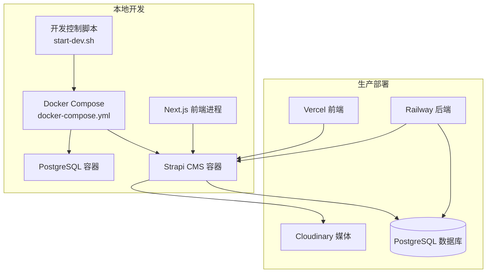
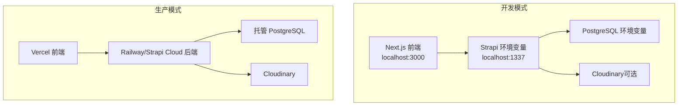
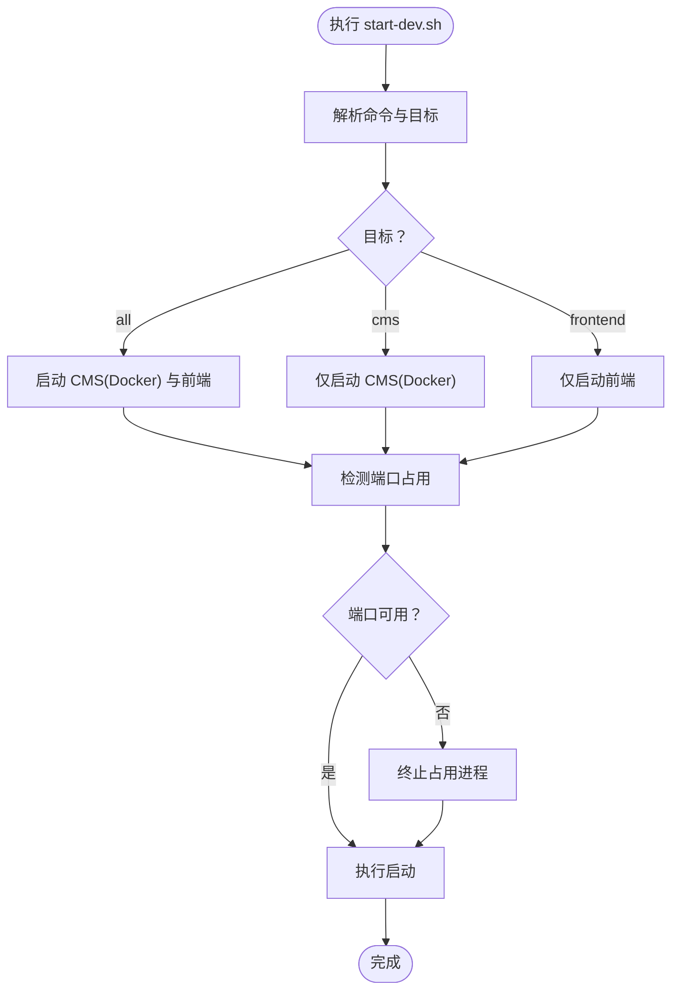
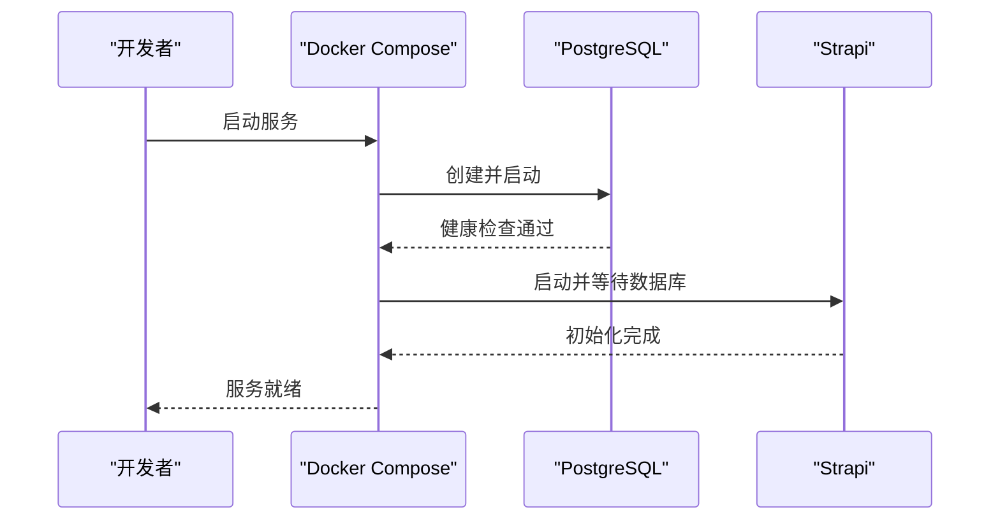
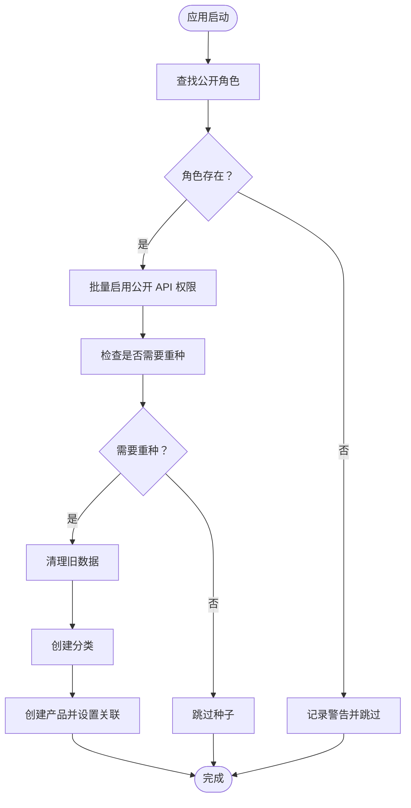
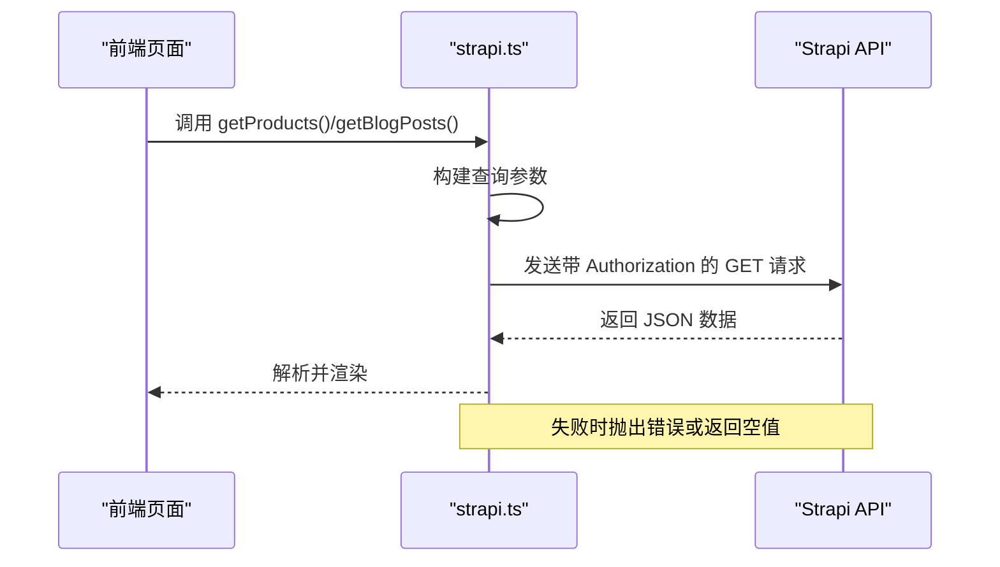
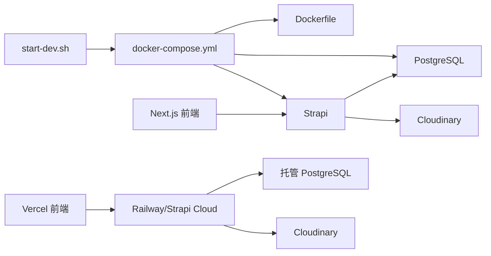

# 故障排除

<cite>
**本文引用的文件**
- [start-dev.sh](file://start-dev.sh)
- [docker-compose.yml](file://cms/docker-compose.yml)
- [Dockerfile](file://cms/Dockerfile)
- [package.json（CMS）](file://cms/package.json)
- [package.json（前端）](file://frontend/package.json)
- [数据库配置](file://cms/config/database.ts)
- [服务器配置](file://cms/config/server.ts)
- [插件配置（上传）](file://cms/config/plugins.ts)
- [CMS 引导与种子](file://cms/src/index.ts)
- [前端配置常量](file://frontend/src/lib/config.ts)
- [Strapi 前端客户端](file://frontend/src/lib/strapi.ts)
- [部署指南](file://DEPLOYMENT.md)
- [网站架构文档](file://WEBSITE_ARCHITECTURE.md)
</cite>

## 目录
1. [简介](#简介)
2. [项目结构](#项目结构)
3. [核心组件](#核心组件)
4. [架构总览](#架构总览)
5. [详细组件分析](#详细组件分析)
6. [依赖关系分析](#依赖关系分析)
7. [性能考虑](#性能考虑)
8. [故障排除指南](#故障排除指南)
9. [结论](#结论)
10. [附录](#附录)

## 简介
本指南面向 Battivus 项目的开发者与运维人员，聚焦于开发与生产环境中的常见问题定位与解决。内容覆盖：
- 数据库连接问题
- API 接口错误
- 前端渲染异常
- Docker 容器问题
- 环境配置错误与依赖冲突
- 调试工具使用、日志分析与错误追踪
- 性能问题诊断、内存泄漏检测与并发问题排查
- 生产环境问题处理流程与紧急修复策略

## 项目结构
Battivus 采用前后端分离架构：前端基于 Next.js，后端基于 Strapi，数据库为 PostgreSQL，媒体存储可选 Cloudinary。开发与部署通过脚本与容器编排实现。

图表来源
- [start-dev.sh:1-195](file://start-dev.sh#L1-L195)
- [docker-compose.yml:1-67](file://cms/docker-compose.yml#L1-L67)
- [Dockerfile:1-43](file://cms/Dockerfile#L1-L43)
- [部署指南:1-223](file://DEPLOYMENT.md#L1-L223)

章节来源
- [start-dev.sh:1-195](file://start-dev.sh#L1-L195)
- [docker-compose.yml:1-67](file://cms/docker-compose.yml#L1-L67)
- [Dockerfile:1-43](file://cms/Dockerfile#L1-L43)
- [部署指南:1-223](file://DEPLOYMENT.md#L1-L223)

## 核心组件
- 开发控制脚本：统一启动/停止/重启/状态查询，支持分别控制 CMS 与前端。
- Docker 编排：定义数据库与 CMS 的服务、网络、卷与健康检查。
- 配置系统：数据库、服务器、上传插件等通过环境变量驱动。
- 引导与种子：应用启动时自动配置公开权限并按需重置示例数据。
- 前端客户端：封装 Strapi API 请求、参数构建、鉴权头注入与错误处理。
- 部署指南：明确生产环境的推荐方案与变量配置。

章节来源
- [start-dev.sh:1-195](file://start-dev.sh#L1-L195)
- [docker-compose.yml:1-67](file://cms/docker-compose.yml#L1-L67)
- [数据库配置:1-15](file://cms/config/database.ts#L1-L15)
- [服务器配置:1-11](file://cms/config/server.ts#L1-L11)
- [插件配置（上传）:1-19](file://cms/config/plugins.ts#L1-L19)
- [CMS 引导与种子:1-315](file://cms/src/index.ts#L1-L315)
- [前端配置常量:1-177](file://frontend/src/lib/config.ts#L1-L177)
- [Strapi 前端客户端:1-412](file://frontend/src/lib/strapi.ts#L1-L412)
- [部署指南:1-223](file://DEPLOYMENT.md#L1-L223)

## 架构总览
下图展示开发与生产两种运行模式下的交互关系与关键依赖。

图表来源
- [前端配置常量:1-177](file://frontend/src/lib/config.ts#L1-L177)
- [Strapi 前端客户端:1-412](file://frontend/src/lib/strapi.ts#L1-L412)
- [数据库配置:1-15](file://cms/config/database.ts#L1-L15)
- [服务器配置:1-11](file://cms/config/server.ts#L1-L11)
- [插件配置（上传）:1-19](file://cms/config/plugins.ts#L1-L19)
- [部署指南:1-223](file://DEPLOYMENT.md#L1-L223)

## 详细组件分析

### 组件一：开发控制脚本（start-dev.sh）
- 功能要点
  - 支持 start/stop/restart/status/help 子命令
  - 可单独或同时控制 CMS（Docker）与前端（本地进程）
  - 端口占用检测与强制终止
- 常见问题
  - 端口被占用导致启动失败
  - Docker 未正确拉起或容器不健康
  - 前端进程后台运行但无日志输出
- 排查建议
  - 使用 status 检查各服务状态
  - 使用 stop 后再 start 清理残留进程
  - 查看 Docker 日志与容器健康检查结果

图表来源
- [start-dev.sh:1-195](file://start-dev.sh#L1-L195)

章节来源
- [start-dev.sh:1-195](file://start-dev.sh#L1-L195)

### 组件二：Docker 编排与镜像（docker-compose.yml / Dockerfile）
- 关键点
  - 数据库镜像与健康检查
  - Strapi 服务环境变量（数据库、密钥、端口）
  - 卷挂载与依赖顺序（等待数据库健康）
- 常见问题
  - 数据库未就绪导致 CMS 启动失败
  - 端口映射冲突或容器间网络不通
  - 环境变量缺失导致认证失败
- 排查建议
  - 使用 healthcheck 验证数据库状态
  - 检查网络与端口映射
  - 对照环境变量清单核对 .env 或 Compose 中的值

图表来源
- [docker-compose.yml:1-67](file://cms/docker-compose.yml#L1-L67)
- [Dockerfile:1-43](file://cms/Dockerfile#L1-L43)

章节来源
- [docker-compose.yml:1-67](file://cms/docker-compose.yml#L1-L67)
- [Dockerfile:1-43](file://cms/Dockerfile#L1-L43)

### 组件三：配置系统（数据库/服务器/上传）
- 数据库配置
  - 通过环境变量设置主机、端口、库名、用户名、密码、SSL
- 服务器配置
  - 主机绑定、端口、应用密钥数组
- 上传插件
  - Cloudinary 提供商配置（名称、Key、Secret）
- 常见问题
  - 连接字符串格式错误
  - 密钥或 Secret 为空导致上传失败
  - 端口或主机地址不正确
- 排查建议
  - 对照环境变量与配置文件逐项核对
  - 在容器内测试网络连通性
  - 临时开启调试日志定位问题

章节来源
- [数据库配置:1-15](file://cms/config/database.ts#L1-L15)
- [服务器配置:1-11](file://cms/config/server.ts#L1-L11)
- [插件配置（上传）:1-19](file://cms/config/plugins.ts#L1-L19)

### 组件四：引导与种子（CMS 引导逻辑）
- 功能要点
  - 自动为“公开角色”启用必要 API 权限
  - 启动时按需删除旧数据并重新导入示例分类与产品
  - 使用文档 API 设置关联关系
- 常见问题
  - 种子数据未导入或关联丢失
  - 权限未生效导致接口返回 403/404
  - 数据库为空但未触发重种
- 排查建议
  - 查看引导日志确认权限创建与种子执行
  - 手动触发重种或检查条件判断逻辑
  - 确认公开角色存在且 ID 正确

图表来源
- [CMS 引导与种子:161-217](file://cms/src/index.ts#L161-L217)
- [CMS 引导与种子:219-315](file://cms/src/index.ts#L219-L315)

章节来源
- [CMS 引导与种子:1-315](file://cms/src/index.ts#L1-L315)

### 组件五：前端客户端（Strapi API 封装）
- 功能要点
  - 自动拼接查询参数（populate/filters/sort/pagination）
  - 注入 Bearer Token（如存在）
  - 错误处理与 404 特判
  - 健康检查接口
- 常见问题
  - API 地址或 Token 配置错误
  - 查询参数构造不当导致过滤无效
  - CORS 或跨域问题
- 排查建议
  - 核对 NEXT_PUBLIC_STRAPI_URL 与 API_TOKEN
  - 使用浏览器开发者工具查看请求与响应
  - 通过健康检查接口快速判断后端可达性

图表来源
- [Strapi 前端客户端:51-119](file://frontend/src/lib/strapi.ts#L51-L119)
- [Strapi 前端客户端:121-164](file://frontend/src/lib/strapi.ts#L121-L164)

章节来源
- [Strapi 前端客户端:1-412](file://frontend/src/lib/strapi.ts#L1-L412)
- [前端配置常量:1-177](file://frontend/src/lib/config.ts#L1-L177)

## 依赖关系分析
- 开发阶段
  - start-dev.sh 依赖 docker-compose.yml 与 Dockerfile
  - CMS 依赖数据库与上传提供商
  - 前端依赖 CMS 提供的数据与媒体资源
- 生产阶段
  - 前端部署在 Vercel，后端部署在 Railway 或 Strapi Cloud
  - 数据库与媒体由平台托管或第三方提供

图表来源
- [start-dev.sh:1-195](file://start-dev.sh#L1-L195)
- [docker-compose.yml:1-67](file://cms/docker-compose.yml#L1-L67)
- [Dockerfile:1-43](file://cms/Dockerfile#L1-L43)
- [部署指南:1-223](file://DEPLOYMENT.md#L1-L223)

章节来源
- [start-dev.sh:1-195](file://start-dev.sh#L1-L195)
- [docker-compose.yml:1-67](file://cms/docker-compose.yml#L1-L67)
- [Dockerfile:1-43](file://cms/Dockerfile#L1-L43)
- [部署指南:1-223](file://DEPLOYMENT.md#L1-L223)

## 性能考虑
- 前端缓存与增量更新
  - 使用 revalidate 控制静态生成/增量更新频率
  - 合理分页与 populate 策略减少请求体积
- 后端查询优化
  - 为常用过滤字段建立索引（如 category.slug、featured）
  - 控制 populate 层级避免 N+1 查询
- 媒体加载
  - 使用 CDN 与懒加载策略
  - 图片尺寸与格式优化
- 容器与资源
  - 合理设置 CPU/内存限制与健康检查
  - 使用只读文件系统与最小化镜像

## 故障排除指南

### 一、数据库连接问题
- 症状
  - 启动时报连接超时或拒绝
  - API 查询失败，数据库相关错误
- 诊断步骤
  - 使用健康检查验证数据库可用性
  - 在容器内执行网络连通性测试
  - 核对数据库主机、端口、凭据与 SSL 配置
- 解决方案
  - 修正环境变量或配置文件
  - 确保数据库已初始化并接受连接
  - 如使用云数据库，检查防火墙与白名单

章节来源
- [docker-compose.yml:17-21](file://cms/docker-compose.yml#L17-L21)
- [数据库配置:1-15](file://cms/config/database.ts#L1-L15)

### 二、API 接口错误
- 症状
  - 前端页面空白或报错
  - 控制台出现 4xx/5xx 错误
- 诊断步骤
  - 使用健康检查接口快速判断后端可达性
  - 检查请求参数与鉴权头
  - 查看后端日志定位具体错误
- 解决方案
  - 修正 API 地址与 Token
  - 修复查询参数与排序规则
  - 确认公开权限已启用

章节来源
- [Strapi 前端客户端:308-316](file://frontend/src/lib/strapi.ts#L308-L316)
- [CMS 引导与种子:172-210](file://cms/src/index.ts#L172-L210)

### 三、前端渲染异常
- 症状
  - 页面无法加载或内容缺失
  - 图片链接为空或 404
- 诊断步骤
  - 检查 NEXT_PUBLIC_STRAPI_URL 与 API_TOKEN
  - 核对媒体 URL 构造逻辑
  - 使用浏览器开发者工具查看网络与控制台
- 解决方案
  - 补充或修正环境变量
  - 修复媒体 URL 前缀逻辑
  - 优化图片懒加载与占位符

章节来源
- [Strapi 前端客户端:11-23](file://frontend/src/lib/strapi.ts#L11-L23)
- [前端配置常量:1-177](file://frontend/src/lib/config.ts#L1-L177)

### 四、Docker 容器问题
- 症状
  - 容器启动后立即退出
  - 服务不可达或端口映射异常
- 诊断步骤
  - 查看容器日志与健康检查状态
  - 检查卷挂载与环境变量
  - 验证依赖服务（数据库）是否健康
- 解决方案
  - 修复镜像构建与启动命令
  - 调整端口与网络配置
  - 等待数据库健康后再启动 CMS

章节来源
- [docker-compose.yml:57-59](file://cms/docker-compose.yml#L57-L59)
- [Dockerfile:40-43](file://cms/Dockerfile#L40-L43)

### 五、环境配置错误
- 症状
  - 认证失败、上传失败、鉴权头缺失
- 诊断步骤
  - 对照部署指南核对所有环境变量
  - 检查密钥长度与格式要求
- 解决方案
  - 生成强随机密钥并正确注入
  - 确保上传提供商的凭据完整

章节来源
- [部署指南:66-82](file://DEPLOYMENT.md#L66-L82)
- [插件配置（上传）:1-19](file://cms/config/plugins.ts#L1-L19)

### 六、依赖冲突
- 症状
  - 构建失败、运行时报模块缺失
- 诊断步骤
  - 比对 package.json 与锁文件
  - 检查 Node 版本与引擎要求
- 解决方案
  - 清理 node_modules 并重新安装
  - 升级/降级到兼容版本

章节来源
- [package.json（CMS）:30-33](file://cms/package.json#L30-L33)
- [package.json（前端）:1-26](file://frontend/package.json#L1-L26)

### 七、调试工具与日志分析
- 工具
  - 浏览器开发者工具（网络/控制台）
  - curl 或 Postman 直接调用 API
  - Docker 日志与健康检查
- 技巧
  - 分层定位：前端 → API → 数据库
  - 关注错误码与响应体
  - 使用最小复现场景隔离问题

章节来源
- [Strapi 前端客户端:109-119](file://frontend/src/lib/strapi.ts#L109-L119)
- [docker-compose.yml:17-21](file://cms/docker-compose.yml#L17-L21)

### 八、性能问题诊断
- 方法
  - 前端：测量首屏时间、图片加载、缓存命中
  - 后端：慢查询分析、连接池监控、CPU/内存使用
- 建议
  - 合理分页与查询参数
  - 使用 CDN 与压缩
  - 定期审查与优化

### 九、内存泄漏与并发问题
- 内存泄漏
  - 检查长生命周期对象与事件监听器
  - 使用内存快照工具定位泄漏点
- 并发问题
  - 识别竞态条件与死锁
  - 使用互斥与队列控制并发访问

### 十、生产环境问题处理与紧急修复
- 流程
  - 快速评估影响范围与风险
  - 制定回滚与热修复方案
  - 逐步发布并持续监控
- 紧急修复
  - 临时禁用问题功能
  - 应用最小化补丁
  - 通知用户与团队

章节来源
- [部署指南:1-223](file://DEPLOYMENT.md#L1-L223)

## 结论
通过梳理开发控制脚本、容器编排、配置系统、引导逻辑与前端客户端，可以形成从底层到上层的完整故障排除路径。建议在日常开发中：
- 建立标准化的环境变量清单与健康检查
- 使用最小化日志与结构化错误输出
- 在生产前进行端到端回归测试
- 制定并演练应急响应预案

## 附录
- 常用命令参考
  - 启动：./start-dev.sh start all
  - 停止：./start-dev.sh stop all
  - 状态：./start-dev.sh status
- 生产部署要点
  - 明确环境变量与密钥管理
  - 使用 CDN 与媒体托管
  - 配置域名与 DNS