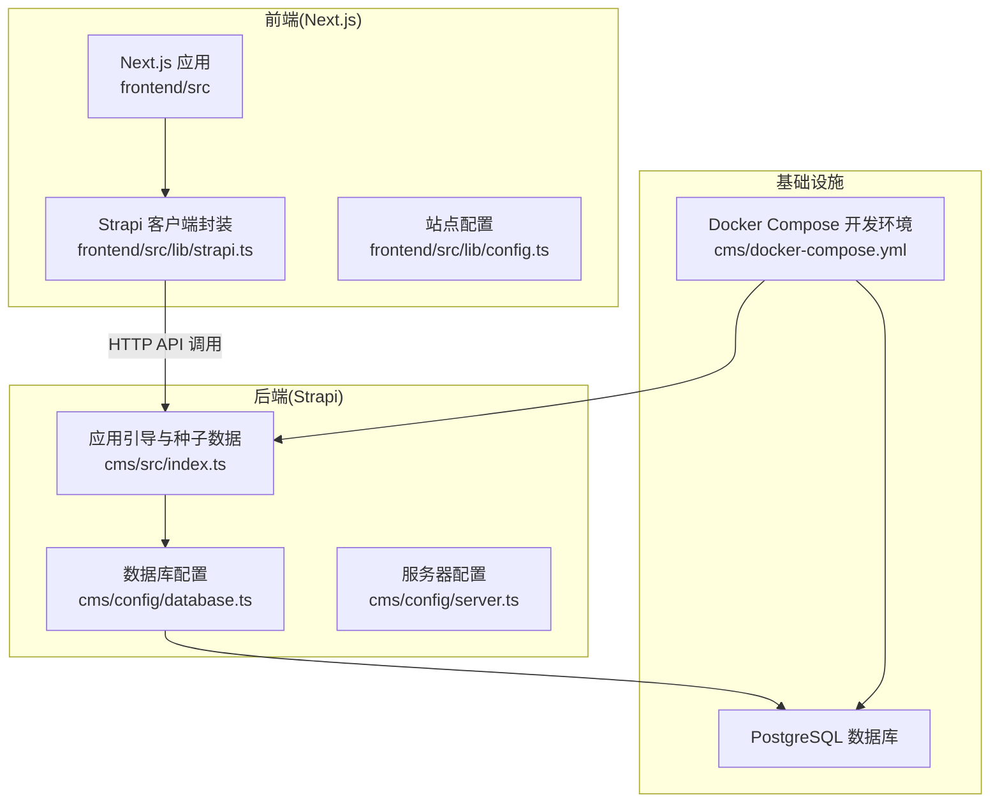
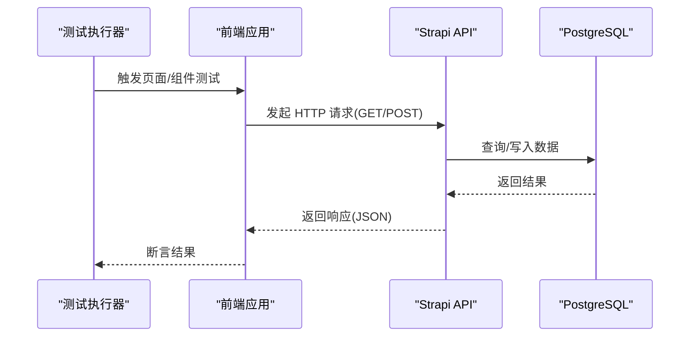
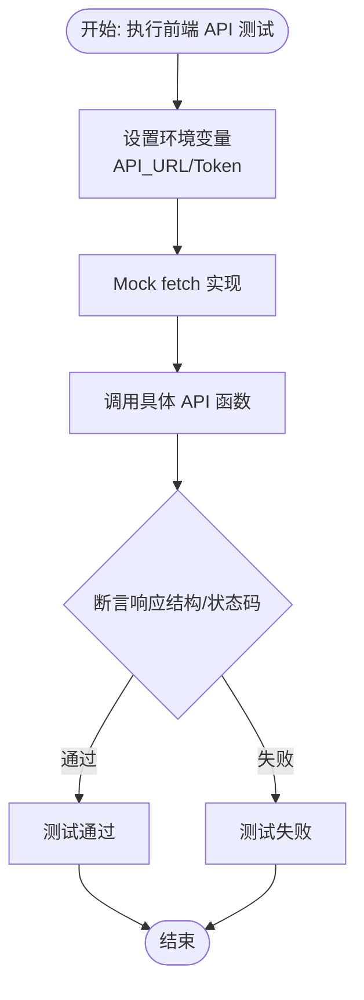
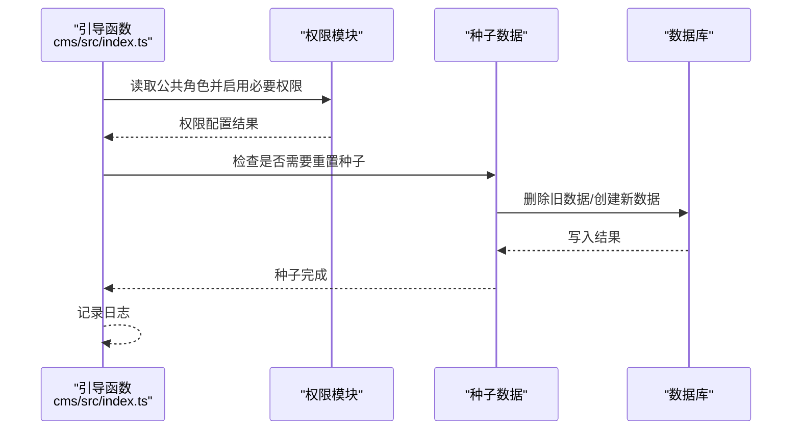
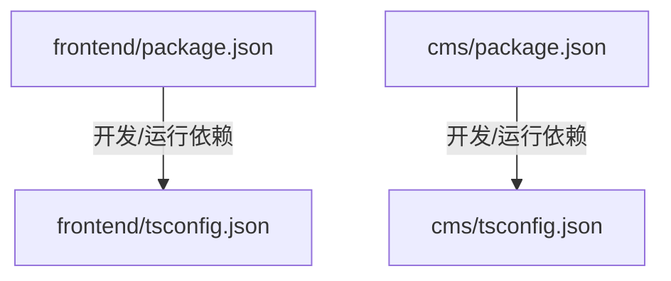

# 测试策略

<cite>
**本文引用的文件**
- [cms/package.json](file://cms/package.json)
- [frontend/package.json](file://frontend/package.json)
- [cms/tsconfig.json](file://cms/tsconfig.json)
- [frontend/tsconfig.json](file://frontend/tsconfig.json)
- [cms/docker-compose.yml](file://cms/docker-compose.yml)
- [DEPLOYMENT.md](file://DEPLOYMENT.md)
- [cms/config/server.ts](file://cms/config/server.ts)
- [cms/config/database.ts](file://cms/config/database.ts)
- [cms/src/index.ts](file://cms/src/index.ts)
- [cms/scripts/seed-data.js](file://cms/scripts/seed-data.js)
- [frontend/src/lib/strapi.ts](file://frontend/src/lib/strapi.ts)
- [frontend/src/lib/config.ts](file://frontend/src/lib/config.ts)
</cite>

## 目录
1. [引言](#引言)
2. [项目结构](#项目结构)
3. [核心组件](#核心组件)
4. [架构总览](#架构总览)
5. [详细组件分析](#详细组件分析)
6. [依赖关系分析](#依赖关系分析)
7. [性能考虑](#性能考虑)
8. [故障排查指南](#故障排查指南)
9. [结论](#结论)
10. [附录](#附录)

## 引言
本测试策略文档面向 Battivus 项目（Next.js 前端 + Strapi 后端 + PostgreSQL 数据库），旨在建立覆盖单元测试、集成测试与端到端测试的完整测试体系。文档涵盖测试框架选型建议、测试工具配置、测试覆盖率目标、API 接口测试、前端组件测试与数据库测试策略，并提供测试用例编写指南、Mock 数据使用与测试环境配置建议。同时，结合现有部署与容器编排信息，给出持续集成中的测试流程与自动化执行思路，以及性能测试、安全测试与兼容性测试的实施方案。

## 项目结构
Battivus 采用前后端分离架构：
- 前端：Next.js 应用，负责页面渲染、用户交互与调用 Strapi API。
- 后端：Strapi 头 CMS，提供内容管理与数据 API；数据存储于 PostgreSQL。
- 部署与运行：通过 Docker Compose 在本地快速搭建开发环境；生产部署可选 Railway 或 Strapi Cloud。

**图表来源**
- [cms/docker-compose.yml:1-67](file://cms/docker-compose.yml#L1-L67)
- [cms/config/database.ts:1-15](file://cms/config/database.ts#L1-L15)
- [cms/config/server.ts:1-11](file://cms/config/server.ts#L1-L11)
- [cms/src/index.ts:149-217](file://cms/src/index.ts#L149-L217)
- [frontend/src/lib/strapi.ts:1-412](file://frontend/src/lib/strapi.ts#L1-L412)
- [frontend/src/lib/config.ts:1-177](file://frontend/src/lib/config.ts#L1-L177)

**章节来源**
- [cms/docker-compose.yml:1-67](file://cms/docker-compose.yml#L1-L67)
- [cms/config/database.ts:1-15](file://cms/config/database.ts#L1-L15)
- [cms/config/server.ts:1-11](file://cms/config/server.ts#L1-L11)
- [cms/src/index.ts:149-217](file://cms/src/index.ts#L149-L217)
- [frontend/src/lib/strapi.ts:1-412](file://frontend/src/lib/strapi.ts#L1-L412)
- [frontend/src/lib/config.ts:1-177](file://frontend/src/lib/config.ts#L1-L177)

## 核心组件
- 前端 API 客户端：封装 Strapi API 请求、查询参数构建、鉴权头注入、错误处理与健康检查。
- 后端引导与种子：在应用启动时自动配置公开 API 权限并按需重置种子数据。
- 数据库与服务器配置：定义数据库连接参数与服务监听配置。
- 开发环境：通过 Docker Compose 提供 PostgreSQL 与 Strapi 的本地联调环境。

**章节来源**
- [frontend/src/lib/strapi.ts:51-164](file://frontend/src/lib/strapi.ts#L51-L164)
- [cms/src/index.ts:161-217](file://cms/src/index.ts#L161-L217)
- [cms/config/database.ts:1-15](file://cms/config/database.ts#L1-15)
- [cms/config/server.ts:1-11](file://cms/config/server.ts#L1-L11)
- [cms/docker-compose.yml:1-67](file://cms/docker-compose.yml#L1-L67)

## 架构总览
下图展示测试视角下的系统交互：前端通过 Strapi API 获取内容，后端访问数据库；测试阶段应分别验证前端请求、后端接口与数据库一致性。

**图表来源**
- [frontend/src/lib/strapi.ts:171-316](file://frontend/src/lib/strapi.ts#L171-L316)
- [cms/config/database.ts:1-15](file://cms/config/database.ts#L1-15)

## 详细组件分析

### 前端 API 客户端测试策略
- 目标：验证请求构造（查询参数、排序、分页）、鉴权头、错误处理与健康检查。
- 方法：
  - 使用浏览器或 Node 环境下的 fetch 模拟库进行单元测试。
  - 对每个 API 函数（如获取分类、产品、博客、解决方案）编写独立用例。
  - 使用 Mock 数据模拟不同响应场景（成功、404、网络异常）。
- 关键点：
  - 环境变量控制 API 地址与令牌，测试中需显式设置。
  - 分页与过滤参数需覆盖边界值与组合条件。
  - 健康检查用于断言后端可用性。

**图表来源**
- [frontend/src/lib/strapi.ts:51-164](file://frontend/src/lib/strapi.ts#L51-L164)
- [frontend/src/lib/strapi.ts:171-316](file://frontend/src/lib/strapi.ts#L171-L316)

**章节来源**
- [frontend/src/lib/strapi.ts:51-164](file://frontend/src/lib/strapi.ts#L51-L164)
- [frontend/src/lib/strapi.ts:171-316](file://frontend/src/lib/strapi.ts#L171-L316)

### 后端 API 与业务逻辑测试策略
- 目标：验证控制器、服务层与数据库交互；确保权限配置正确、种子数据按预期生成。
- 方法：
  - 单元测试：对控制器与服务函数进行隔离测试，使用内存数据库或测试专用数据库实例。
  - 集成测试：启动 Strapi 应用与 PostgreSQL，执行真实 API 请求，验证响应与数据库状态。
  - 种子数据测试：验证引导函数在空库与已有数据场景下的行为。
- 关键点：
  - 公共 API 权限在引导阶段自动配置，测试需覆盖权限启用/禁用场景。
  - 种子数据包含分类与产品，需验证关联关系与字段完整性。

**图表来源**
- [cms/src/index.ts:161-217](file://cms/src/index.ts#L161-L217)
- [cms/src/index.ts:219-314](file://cms/src/index.ts#L219-L314)

**章节来源**
- [cms/src/index.ts:161-217](file://cms/src/index.ts#L161-L217)
- [cms/src/index.ts:219-314](file://cms/src/index.ts#L219-L314)

### 数据库测试策略
- 目标：验证连接配置、迁移与种子脚本、事务一致性与查询性能。
- 方法：
  - 单元测试：针对 SQL 语句与 ORM 调用进行测试，使用测试数据库快照。
  - 集成测试：在 Docker Compose 环境中运行，验证连接字符串、SSL 设置与健康检查。
  - 性能测试：对高频查询（分页、过滤、排序）进行基准测试。
- 关键点：
  - 数据库客户端、主机、端口、用户名、密码、SSL 均来自环境变量。
  - 开发环境使用健康检查确保数据库可用后再启动应用。

**章节来源**
- [cms/config/database.ts:1-15](file://cms/config/database.ts#L1-L15)
- [cms/docker-compose.yml:17-21](file://cms/docker-compose.yml#L17-L21)

### 端到端测试策略
- 目标：从用户视角验证完整流程（导航、筛选、详情页、表单提交）。
- 方法：
  - 使用端到端测试框架（如 Playwright/Cypress），在真实浏览器中运行。
  - 覆盖首页、产品列表、产品详情、博客、联系表单等关键路径。
  - 结合 Mock API 或本地 Strapi 实例，保证可重复性与稳定性。
- 关键点：
  - 前端通过 NEXT_PUBLIC_API_URL 指向后端 API，测试中可替换为本地地址。
  - 表单提交需验证后端接收与响应。

**章节来源**
- [frontend/src/lib/strapi.ts:291-306](file://frontend/src/lib/strapi.ts#L291-L306)
- [DEPLOYMENT.md:119-125](file://DEPLOYMENT.md#L119-L125)

## 依赖关系分析
- 前端依赖 Next.js 与 React，类型检查与 ESLint 作为开发工具。
- 后端依赖 Strapi 与数据库驱动，开发工具包括 TypeScript 编译器。
- Docker Compose 提供 PostgreSQL 与 Strapi 的容器化运行环境。

**图表来源**
- [frontend/package.json:1-26](file://frontend/package.json#L1-L26)
- [cms/package.json:1-36](file://cms/package.json#L1-L36)
- [frontend/tsconfig.json:1-35](file://frontend/tsconfig.json#L1-L35)
- [cms/tsconfig.json:1-19](file://cms/tsconfig.json#L1-L19)

**章节来源**
- [frontend/package.json:1-26](file://frontend/package.json#L1-L26)
- [cms/package.json:1-36](file://cms/package.json#L1-L36)
- [frontend/tsconfig.json:1-35](file://frontend/tsconfig.json#L1-L35)
- [cms/tsconfig.json:1-19](file://cms/tsconfig.json#L1-L19)

## 性能考虑
- API 响应时间：对高频接口（产品列表、博客列表）设定响应阈值，结合负载测试工具评估。
- 数据库查询优化：对分页、过滤与排序参数进行索引设计与查询计划分析。
- 前端缓存与重验证：利用 Next.js 的 revalidate 机制平衡实时性与性能。
- 容器资源：在 Docker Compose 中为 PostgreSQL 与 Strapi 设置合理的 CPU/内存限制，避免资源争用。

[本节为通用指导，无需特定文件引用]

## 故障排查指南
- 健康检查失败：确认数据库健康检查配置与连接参数，确保容器启动顺序正确。
- 权限问题：检查引导函数中公共角色权限是否已启用，必要时重新初始化。
- 环境变量：核对 API 地址与令牌配置，确保前端与后端一致。
- 种子数据异常：当产品无分类或分类缺失时，触发重置流程；记录日志定位失败原因。

**章节来源**
- [cms/docker-compose.yml:57-59](file://cms/docker-compose.yml#L57-L59)
- [cms/src/index.ts:219-314](file://cms/src/index.ts#L219-L314)
- [frontend/src/lib/strapi.ts:309-316](file://frontend/src/lib/strapi.ts#L309-L316)

## 结论
通过分层测试策略（单元、集成、端到端）与完善的工具链配置，Battivus 可以在开发早期发现缺陷、保障 API 稳定性与前端用户体验，并在持续集成中实现自动化测试与部署。建议优先完善前端 API 客户端与后端控制器的单元测试，再扩展到端到端测试与数据库性能测试，逐步提升整体质量与交付效率。

[本节为总结性内容，无需特定文件引用]

## 附录

### 测试框架与工具选型建议
- 前端：Jest + React Testing Library（组件测试）+ MSW（Mock 服务）。
- 后端：Jest + Supertest（HTTP 接口测试）+ 测试数据库（如 SQLite 或 PostgreSQL 测试实例）。
- 端到端：Playwright 或 Cypress（基于浏览器的真实交互）。
- 覆盖率：单元测试覆盖率不低于 80%，集成测试覆盖率不低于 60%。

[本节为通用指导，无需特定文件引用]

### 测试用例编写指南
- 命名规范：以“功能/场景/期望”命名，清晰表达意图。
- 输入输出：明确输入参数、边界值与期望输出，覆盖正常与异常分支。
- Mock 数据：使用稳定、可预测的数据集，避免外部依赖。
- 并发与重试：对易抖动的测试（网络、数据库）增加重试与超时配置。

[本节为通用指导，无需特定文件引用]

### 测试环境配置
- 开发环境：使用 Docker Compose 快速拉起 PostgreSQL 与 Strapi，便于本地联调。
- 测试环境：独立数据库实例与只读 API 密钥，避免污染生产数据。
- CI 环境：在流水线中安装 Node、数据库与测试工具，按阶段执行单元、集成与端到端测试。

**章节来源**
- [cms/docker-compose.yml:1-67](file://cms/docker-compose.yml#L1-L67)
- [DEPLOYMENT.md:181-185](file://DEPLOYMENT.md#L181-L185)

### 持续集成中的测试流程
- 触发条件：主分支推送或 Pull Request 更新。
- 步骤：安装依赖 → 启动数据库容器 → 运行单元测试 → 运行集成测试 → 运行端到端测试 → 生成覆盖率报告。
- 自动化：结合平台提供的工作流，将测试结果与 PR 状态关联。

[本节为通用指导，无需特定文件引用]

### 性能测试、安全测试与兼容性测试
- 性能测试：对关键 API 与页面进行压力与并发测试，关注 P95/P99 延迟与吞吐量。
- 安全测试：验证鉴权头、CSRF、CORS 与敏感信息泄露风险；定期扫描依赖漏洞。
- 兼容性测试：在主流浏览器与移动端进行回归测试，确保布局与交互一致。

[本节为通用指导，无需特定文件引用]