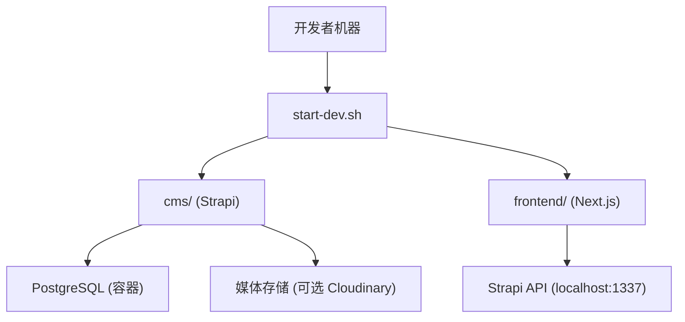
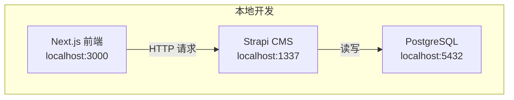
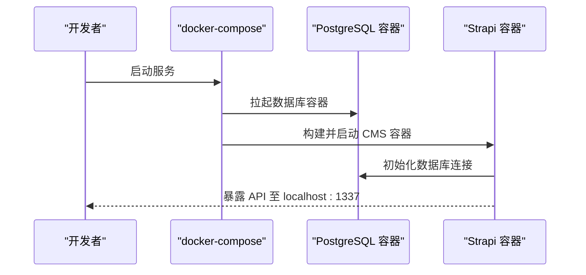
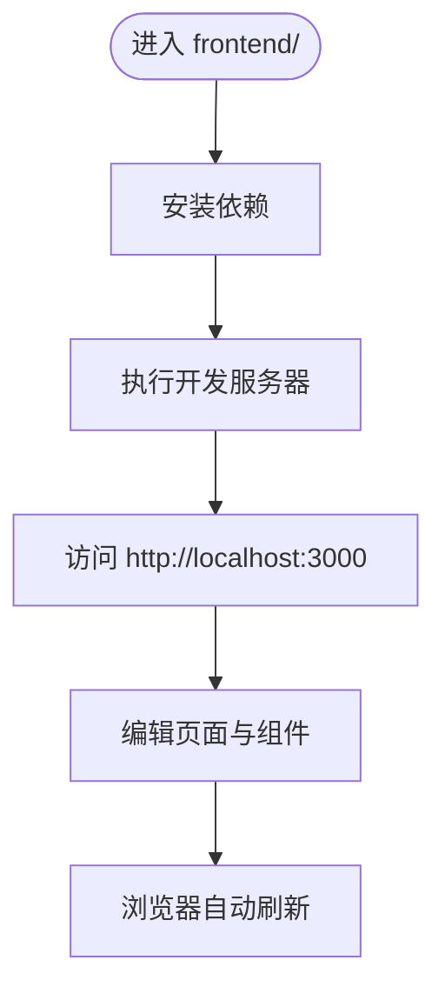
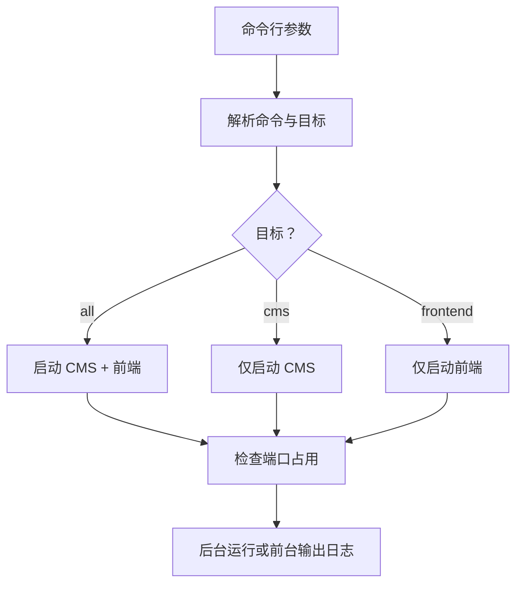
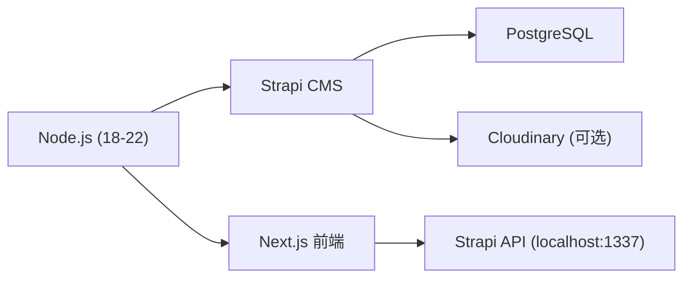

# 快速开始

<cite>
**本文引用的文件**
- [start-dev.sh](file://start-dev.sh)
- [DEPLOYMENT.md](file://DEPLOYMENT.md)
- [WEBSITE_ARCHITECTURE.md](file://WEBSITE_ARCHITECTURE.md)
- [cms/package.json](file://cms/package.json)
- [frontend/package.json](file://frontend/package.json)
- [cms/docker-compose.yml](file://cms/docker-compose.yml)
- [cms/Dockerfile](file://cms/Dockerfile)
- [cms/Dockerfile.prod](file://cms/Dockerfile.prod)
- [cms/config/server.ts](file://cms/config/server.ts)
- [frontend/src/lib/config.ts](file://frontend/src/lib/config.ts)
- [frontend/next.config.ts](file://frontend/next.config.ts)
</cite>

## 目录
1. [简介](#简介)
2. [项目结构](#项目结构)
3. [核心组件](#核心组件)
4. [架构总览](#架构总览)
5. [详细组件分析](#详细组件分析)
6. [依赖关系分析](#依赖关系分析)
7. [性能注意事项](#性能注意事项)
8. [故障排除指南](#故障排除指南)
9. [结论](#结论)
10. [附录](#附录)

## 简介
本指南面向新开发者，帮助你在最短时间内完成 Battivus 项目的本地开发环境搭建与运行。项目采用“Next.js 前端 + Strapi CMS + PostgreSQL 数据库”的分层架构，通过 Docker 容器化实现一键启动。你将学会：
- 克隆仓库与准备环境（Node.js、Docker）
- 启动后端 CMS（Strapi）与数据库（PostgreSQL）
- 启动前端 Next.js 应用
- 配置环境变量与媒体存储
- 使用脚本控制服务启停与状态查看
- 常见问题排查与优化建议

## 项目结构
项目由两个主要子项目组成：
- cms：Strapi 头 CMS，提供内容管理与数据 API
- frontend：Next.js 前端应用，负责页面渲染与用户交互
- 根目录脚本与文档：start-dev.sh 提供统一的服务启停控制；DEPLOYMENT.md 与 WEBSITE_ARCHITECTURE.md 提供部署与架构说明

图表来源
- [start-dev.sh:120-195](file://start-dev.sh#L120-L195)
- [cms/docker-compose.yml:1-67](file://cms/docker-compose.yml#L1-L67)
- [frontend/package.json:1-26](file://frontend/package.json#L1-L26)
- [cms/package.json:1-36](file://cms/package.json#L1-L36)

章节来源
- [start-dev.sh:120-195](file://start-dev.sh#L120-L195)
- [cms/docker-compose.yml:1-67](file://cms/docker-compose.yml#L1-L67)
- [frontend/package.json:1-26](file://frontend/package.json#L1-L26)
- [cms/package.json:1-36](file://cms/package.json#L1-L36)

## 核心组件
- 后端（CMS）：基于 Strapi 的 Headless CMS，使用 PostgreSQL 存储内容与媒体元数据。通过 docker-compose 启动数据库与 CMS 服务，并挂载配置、源码与上传目录。
- 前端（Next.js）：基于 Next.js 16 的 App Router 应用，负责页面渲染、SEO 与用户交互。默认监听本地端口。
- 开发脚本：start-dev.sh 提供统一命令入口，支持启动/停止/重启/状态查询，并自动处理端口占用。

章节来源
- [cms/docker-compose.yml:1-67](file://cms/docker-compose.yml#L1-L67)
- [cms/Dockerfile:1-43](file://cms/Dockerfile#L1-L43)
- [cms/Dockerfile.prod:1-38](file://cms/Dockerfile.prod#L1-L38)
- [start-dev.sh:120-195](file://start-dev.sh#L120-L195)

## 架构总览
系统采用前后端分离架构，前端通过 API 获取 CMS 内容，后端通过 Docker 运行 Strapi 与 PostgreSQL。下图展示本地开发时的典型交互：

图表来源
- [cms/docker-compose.yml:1-67](file://cms/docker-compose.yml#L1-L67)
- [frontend/next.config.ts:1-9](file://frontend/next.config.ts#L1-L9)

章节来源
- [cms/docker-compose.yml:1-67](file://cms/docker-compose.yml#L1-L67)
- [frontend/next.config.ts:1-9](file://frontend/next.config.ts#L1-L9)

## 详细组件分析

### 后端（Strapi CMS）容器化与启动
- 使用 docker-compose 在本地启动 PostgreSQL 与 Strapi 服务，映射必要端口与环境变量。
- Strapi 默认监听 0.0.0.0:1337，开发模式下会自动编译与热更新。
- Dockerfile 与 Dockerfile.prod 分别用于开发与生产构建，均基于 Node.js 20 Alpine。

图表来源
- [cms/docker-compose.yml:1-67](file://cms/docker-compose.yml#L1-L67)
- [cms/Dockerfile:1-43](file://cms/Dockerfile#L1-L43)
- [cms/Dockerfile.prod:1-38](file://cms/Dockerfile.prod#L1-L38)

章节来源
- [cms/docker-compose.yml:1-67](file://cms/docker-compose.yml#L1-L67)
- [cms/Dockerfile:1-43](file://cms/Dockerfile#L1-L43)
- [cms/Dockerfile.prod:1-38](file://cms/Dockerfile.prod#L1-L38)

### 前端（Next.js）开发与配置
- 前端默认使用 Next.js 16，开发模式监听本地端口。
- 项目内含站点配置与导航信息，便于在本地预览页面与 SEO 结构。
- next.config.ts 提供基础配置项，如关闭开发指示器等。

图表来源
- [frontend/package.json:1-26](file://frontend/package.json#L1-L26)
- [frontend/src/lib/config.ts:1-177](file://frontend/src/lib/config.ts#L1-L177)
- [frontend/next.config.ts:1-9](file://frontend/next.config.ts#L1-L9)

章节来源
- [frontend/package.json:1-26](file://frontend/package.json#L1-L26)
- [frontend/src/lib/config.ts:1-177](file://frontend/src/lib/config.ts#L1-L177)
- [frontend/next.config.ts:1-9](file://frontend/next.config.ts#L1-L9)

### 开发脚本（start-dev.sh）使用指南
- 统一入口：./start-dev.sh start all（默认），可选择仅启动 CMS 或前端。
- 支持命令：start、stop、restart、status、help。
- 自动检测端口占用并尝试终止冲突进程，避免端口冲突导致启动失败。

图表来源
- [start-dev.sh:120-195](file://start-dev.sh#L120-L195)

章节来源
- [start-dev.sh:120-195](file://start-dev.sh#L120-L195)

## 依赖关系分析
- Node.js 版本要求：后端与前端均声明了 Node.js 版本范围，建议使用受支持的 LTS 版本以保证兼容性。
- 数据库：后端使用 PostgreSQL，docker-compose 已内置数据库服务与初始化参数。
- 媒体存储：可选集成 Cloudinary，需在后端安装对应 Provider 并配置环境变量。
- 前后端通信：前端通过 API 地址访问后端 Strapi，需确保端口未被占用且网络可达。

图表来源
- [cms/package.json:30-33](file://cms/package.json#L30-L33)
- [frontend/package.json:1-26](file://frontend/package.json#L1-L26)
- [cms/docker-compose.yml:1-67](file://cms/docker-compose.yml#L1-L67)

章节来源
- [cms/package.json:30-33](file://cms/package.json#L30-L33)
- [frontend/package.json:1-26](file://frontend/package.json#L1-L26)
- [cms/docker-compose.yml:1-67](file://cms/docker-compose.yml#L1-L67)

## 性能注意事项
- 使用 Docker 容器化可减少环境差异带来的性能波动，建议优先使用 docker-compose 启动。
- 开发阶段建议启用自动重载与最小化构建，避免不必要的资源消耗。
- 媒体文件较多时，建议使用外部存储（如 Cloudinary）以减轻容器存储压力。
- 前端构建与缓存策略可根据实际页面数量进行调整，以提升首屏加载速度。

## 故障排除指南
- 端口被占用
  - 现象：启动失败或提示端口已被占用
  - 处理：使用脚本的 stop 命令停止冲突服务，或手动终止占用进程
  - 参考：[start-dev.sh:51-70](file://start-dev.sh#L51-L70)
- 数据库无法连接
  - 现象：Strapi 启动后报数据库连接错误
  - 处理：确认 docker-compose 中数据库镜像、凭据与网络配置正确；等待数据库健康检查通过后再启动 Strapi
  - 参考：[cms/docker-compose.yml:17-21](file://cms/docker-compose.yml#L17-L21)
- 媒体上传异常
  - 现象：图片上传失败或丢失
  - 处理：安装并配置 Cloudinary Provider；确保环境变量已设置；重新部署后端
  - 参考：[DEPLOYMENT.md:133-163](file://DEPLOYMENT.md#L133-L163)
- 前端无法访问 API
  - 现象：页面加载空白或请求超时
  - 处理：确认后端已启动且端口开放；检查前端环境变量中的 API 地址是否指向正确的后端地址
  - 参考：[cms/config/server.ts:1-11](file://cms/config/server.ts#L1-L11)
- Node.js 版本不匹配
  - 现象：安装依赖时报错或运行时报错
  - 处理：使用符合版本范围的 Node.js（后端与前端均声明了允许的版本区间）
  - 参考：[cms/package.json:30-33](file://cms/package.json#L30-L33)、[frontend/package.json:1-26](file://frontend/package.json#L1-L26)

章节来源
- [start-dev.sh:51-70](file://start-dev.sh#L51-L70)
- [cms/docker-compose.yml:17-21](file://cms/docker-compose.yml#L17-L21)
- [DEPLOYMENT.md:133-163](file://DEPLOYMENT.md#L133-L163)
- [cms/config/server.ts:1-11](file://cms/config/server.ts#L1-L11)
- [cms/package.json:30-33](file://cms/package.json#L30-L33)
- [frontend/package.json:1-26](file://frontend/package.json#L1-L26)

## 结论
通过本指南，你可以快速完成本地开发环境的搭建与运行。建议按以下顺序操作：
1) 准备 Node.js 与 Docker 环境
2) 使用 start-dev.sh 启动所有服务
3) 访问前端与后端，确认服务正常
4) 如需媒体存储，按部署文档配置 Cloudinary
5) 遇到问题时参考故障排除章节

## 附录

### 环境准备与安装步骤
- Node.js
  - 后端与前端均声明了 Node.js 版本范围，请使用该范围内版本
  - 参考：[cms/package.json:30-33](file://cms/package.json#L30-L33)、[frontend/package.json:1-26](file://frontend/package.json#L1-L26)
- Docker
  - 使用 docker-compose 启动数据库与 CMS 服务
  - 参考：[cms/docker-compose.yml:1-67](file://cms/docker-compose.yml#L1-L67)

章节来源
- [cms/package.json:30-33](file://cms/package.json#L30-L33)
- [frontend/package.json:1-26](file://frontend/package.json#L1-L26)
- [cms/docker-compose.yml:1-67](file://cms/docker-compose.yml#L1-L67)

### 本地开发环境搭建流程
- 克隆项目后，使用 start-dev.sh 启动服务
  - 启动全部：./start-dev.sh start all
  - 仅启动 CMS：./start-dev.sh start cms
  - 仅启动前端：./start-dev.sh start frontend
  - 查看状态：./start-dev.sh status
  - 停止服务：./start-dev.sh stop [all|cms|frontend]
  - 参考：[start-dev.sh:120-195](file://start-dev.sh#L120-L195)
- 访问前端：http://localhost:3000
- 访问后端：http://localhost:1337/admin（首次访问需创建管理员）

章节来源
- [start-dev.sh:120-195](file://start-dev.sh#L120-L195)

### 环境变量与配置要点
- 后端（Strapi）
  - 数据库：DATABASE_CLIENT、DATABASE_HOST、DATABASE_PORT、DATABASE_NAME、DATABASE_USERNAME、DATABASE_PASSWORD
  - 安全密钥：JWT_SECRET、ADMIN_JWT_SECRET、API_TOKEN_SALT、APP_KEYS
  - 端口与主机：host、port、webhooks.populateRelations
  - 参考：[cms/docker-compose.yml:30-47](file://cms/docker-compose.yml#L30-L47)、[cms/config/server.ts:1-11](file://cms/config/server.ts#L1-L11)
- 前端（Next.js）
  - API 地址：NEXT_PUBLIC_API_URL（指向后端地址，无末尾斜杠）
  - API 令牌：API_TOKEN（在后端生成只读令牌）
  - 参考：[DEPLOYMENT.md:119-125](file://DEPLOYMENT.md#L119-L125)

章节来源
- [cms/docker-compose.yml:30-47](file://cms/docker-compose.yml#L30-L47)
- [cms/config/server.ts:1-11](file://cms/config/server.ts#L1-L11)
- [DEPLOYMENT.md:119-125](file://DEPLOYMENT.md#L119-L125)

### Docker 容器化部署流程（生产参考）
- 使用 Dockerfile.prod 构建生产镜像，分阶段优化体积与依赖
- 在平台（如 Railway、Vercel）中配置环境变量与根目录
- 媒体存储建议使用 Cloudinary，确保上传插件与配置正确
- 参考：[cms/Dockerfile.prod:1-38](file://cms/Dockerfile.prod#L1-L38)、[DEPLOYMENT.md:43-105](file://DEPLOYMENT.md#L43-L105)

章节来源
- [cms/Dockerfile.prod:1-38](file://cms/Dockerfile.prod#L1-L38)
- [DEPLOYMENT.md:43-105](file://DEPLOYMENT.md#L43-L105)