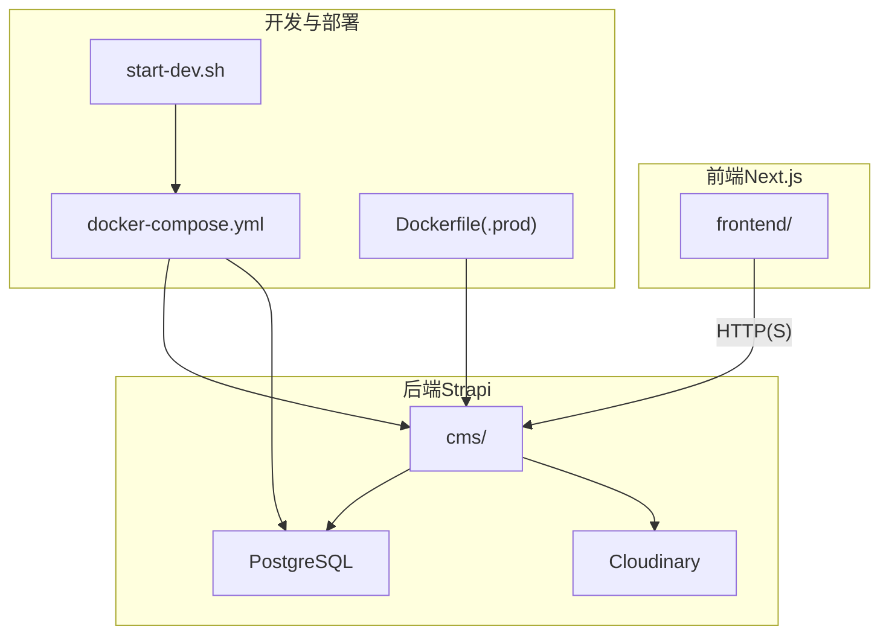
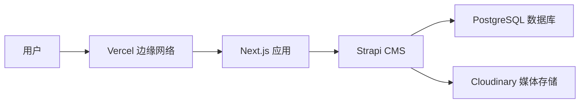
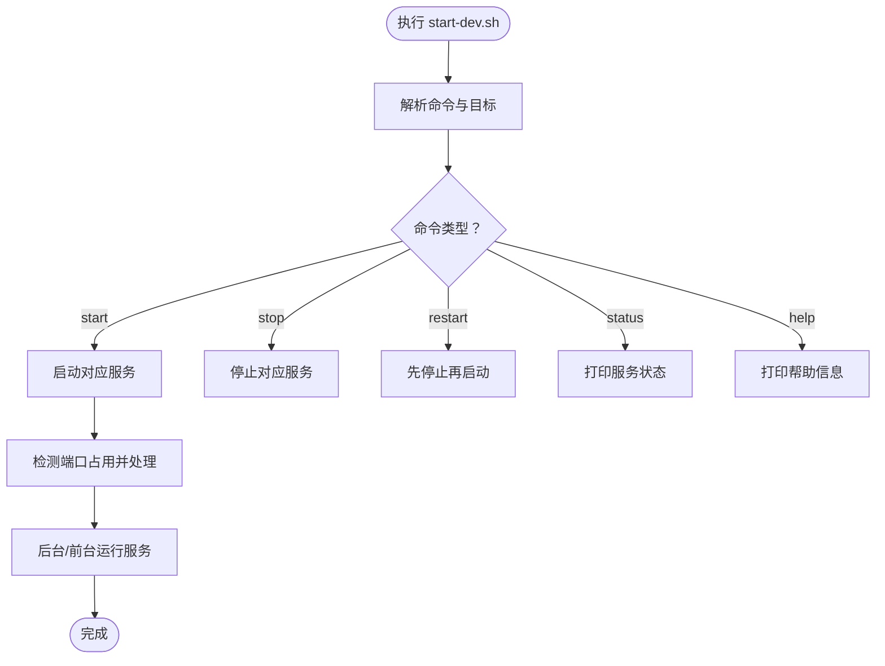
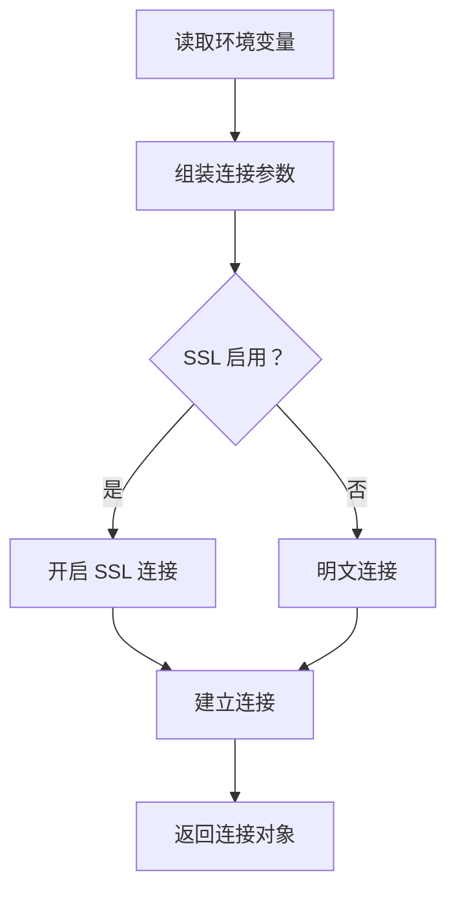
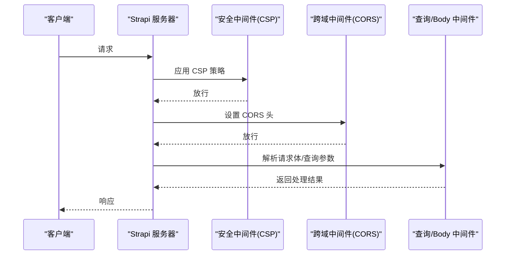
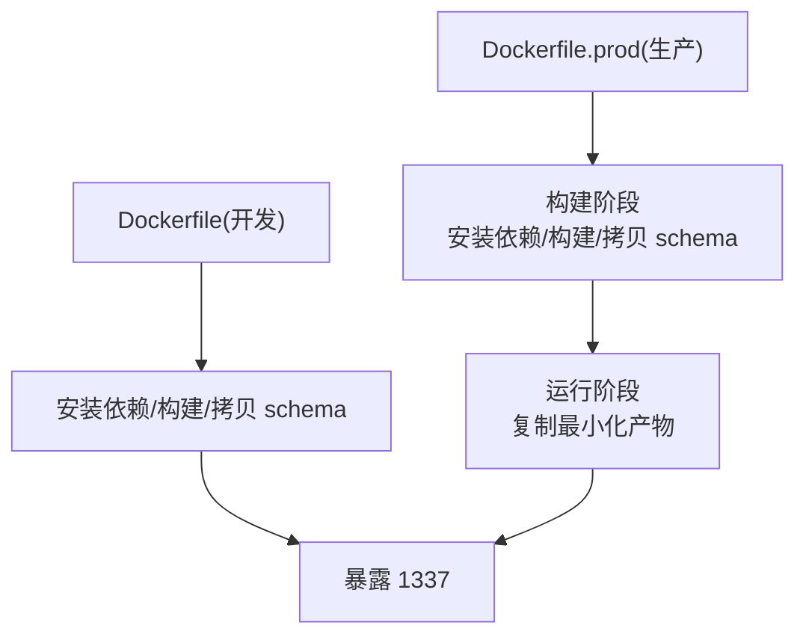
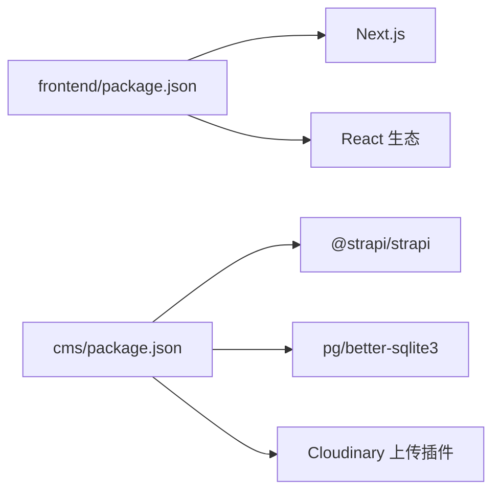

# 故障排除

<cite>
**本文引用的文件**
- [start-dev.sh](file://start-dev.sh)
- [DEPLOYMENT.md](file://DEPLOYMENT.md)
- [WEBSITE_ARCHITECTURE.md](file://WEBSITE_ARCHITECTURE.md)
- [cms/package.json](file://cms/package.json)
- [frontend/package.json](file://frontend/package.json)
- [cms/docker-compose.yml](file://cms/docker-compose.yml)
- [cms/Dockerfile](file://cms/Dockerfile)
- [cms/Dockerfile.prod](file://cms/Dockerfile.prod)
- [cms/config/database.ts](file://cms/config/database.ts)
- [cms/config/server.ts](file://cms/config/server.ts)
- [cms/config/middlewares.ts](file://cms/config/middlewares.ts)
- [cms/config/plugins.ts](file://cms/config/plugins.ts)
- [cms/scripts/dev-with-schemas.js](file://cms/scripts/dev-with-schemas.js)
- [cms/scripts/copy-schemas.js](file://cms/scripts/copy-schemas.js)
</cite>

## 目录
1. [简介](#简介)
2. [项目结构](#项目结构)
3. [核心组件](#核心组件)
4. [架构总览](#架构总览)
5. [详细组件分析](#详细组件分析)
6. [依赖关系分析](#依赖关系分析)
7. [性能考量](#性能考量)
8. [故障排除指南](#故障排除指南)
9. [结论](#结论)
10. [附录](#附录)

## 简介
本故障排除文档面向 Battivus 项目的开发者与运维人员，聚焦于开发环境、数据库连接、API 错误、部署故障等常见问题的识别、诊断与解决。内容涵盖调试工具使用、日志分析技巧、性能问题诊断、网络与权限配置、系统监控指标解读与异常处理流程，并提供预防性维护与健康检查清单，帮助快速定位并恢复服务。

## 项目结构
Battivus 采用前后端分离架构：前端基于 Next.js（App Router），后端基于 Strapi（Headless CMS），数据存储使用 PostgreSQL，媒体资源通过 Cloudinary 托管。开发与生产均支持 Docker 化部署，提供一键启动脚本与多平台部署指南。

图表来源
- [cms/docker-compose.yml:1-67](file://cms/docker-compose.yml#L1-L67)
- [cms/Dockerfile:1-43](file://cms/Dockerfile#L1-L43)
- [cms/Dockerfile.prod:1-38](file://cms/Dockerfile.prod#L1-L38)
- [start-dev.sh:1-195](file://start-dev.sh#L1-L195)

章节来源
- [WEBSITE_ARCHITECTURE.md:48-95](file://WEBSITE_ARCHITECTURE.md#L48-L95)
- [cms/docker-compose.yml:1-67](file://cms/docker-compose.yml#L1-L67)
- [start-dev.sh:1-195](file://start-dev.sh#L1-L195)

## 核心组件
- 开发控制脚本：统一管理前端与后端服务的启动、停止、重启与状态查询，便于本地联调。
- 后端配置：数据库连接、服务器参数、中间件（CORS/安全策略）、插件（上传至 Cloudinary）。
- 前端配置：Next.js 版本与依赖，用于构建与运行。
- 容器化：开发与生产 Dockerfile，确保依赖安装、编译与产物复制一致。
- 部署指南：提供 Railway/Strapi Cloud 的部署步骤、环境变量与域名配置。

章节来源
- [start-dev.sh:120-195](file://start-dev.sh#L120-L195)
- [cms/config/database.ts:1-15](file://cms/config/database.ts#L1-L15)
- [cms/config/server.ts:1-11](file://cms/config/server.ts#L1-L11)
- [cms/config/middlewares.ts:1-32](file://cms/config/middlewares.ts#L1-L32)
- [cms/config/plugins.ts:1-19](file://cms/config/plugins.ts#L1-L19)
- [cms/Dockerfile:1-43](file://cms/Dockerfile#L1-L43)
- [cms/Dockerfile.prod:1-38](file://cms/Dockerfile.prod#L1-L38)
- [DEPLOYMENT.md:1-223](file://DEPLOYMENT.md#L1-L223)

## 架构总览
系统由前端（Next.js）、后端（Strapi）、数据库（PostgreSQL）与媒体存储（Cloudinary）组成。前端通过 API 访问后端，后端负责内容管理与数据持久化，并将媒体资源上传到 Cloudinary。

图表来源
- [DEPLOYMENT.md:8-17](file://DEPLOYMENT.md#L8-L17)
- [WEBSITE_ARCHITECTURE.md:48-82](file://WEBSITE_ARCHITECTURE.md#L48-L82)

## 详细组件分析

### 开发控制脚本（start-dev.sh）
- 功能：一键启动/停止/重启/查看状态；支持同时或分别控制 CMS 与前端。
- 端口占用检测与强制终止：避免端口冲突导致的启动失败。
- Docker 后台启动：Strapi 使用 docker compose 在后台运行，前端使用 npm run dev 前台运行以便查看日志。

图表来源
- [start-dev.sh:120-195](file://start-dev.sh#L120-L195)

章节来源
- [start-dev.sh:1-195](file://start-dev.sh#L1-L195)

### 数据库连接配置（database.ts）
- 连接客户端：PostgreSQL。
- 关键参数：主机、端口、数据库名、用户名、密码、SSL。
- 调试开关：关闭（debug=false）。

图表来源
- [cms/config/database.ts:1-15](file://cms/config/database.ts#L1-L15)

章节来源
- [cms/config/database.ts:1-15](file://cms/config/database.ts#L1-L15)

### 服务器与中间件配置（server.ts, middlewares.ts）
- 服务器：监听地址、端口、应用密钥数组。
- 中间件：安全策略（CSP）、跨域（CORS）、日志、错误处理、查询、Body 解析、会话、静态资源等。
- CORS 允许所有来源，有助于在 Vercel 预览环境下减少跨域问题。

图表来源
- [cms/config/server.ts:1-11](file://cms/config/server.ts#L1-L11)
- [cms/config/middlewares.ts:1-32](file://cms/config/middlewares.ts#L1-L32)

章节来源
- [cms/config/server.ts:1-11](file://cms/config/server.ts#L1-L11)
- [cms/config/middlewares.ts:1-32](file://cms/config/middlewares.ts#L1-L32)

### 插件与媒体上传（plugins.ts）
- 上传提供程序：Cloudinary。
- 配置项：云名称、API Key、Secret。
- 行为选项：上传/删除动作的默认配置。

章节来源
- [cms/config/plugins.ts:1-19](file://cms/config/plugins.ts#L1-L19)

### 构建与模式（Dockerfile 与 Dockerfile.prod）
- 开发镜像：安装编译依赖，拷贝源码，执行构建与 schema 拷贝，暴露 1337 端口，默认 CMD 启动。
- 生产镜像：分阶段构建，仅复制必要产物，精简运行时依赖，暴露 1337 端口。

图表来源
- [cms/Dockerfile:1-43](file://cms/Dockerfile#L1-L43)
- [cms/Dockerfile.prod:1-38](file://cms/Dockerfile.prod#L1-L38)

章节来源
- [cms/Dockerfile:1-43](file://cms/Dockerfile#L1-L43)
- [cms/Dockerfile.prod:1-38](file://cms/Dockerfile.prod#L1-L38)

### 开发脚本（dev-with-schemas.js 与 copy-schemas.js）
- copy-schemas.js：构建前将 schema.json 从 src/api 复制到 dist/src/api，保证类型与模式在构建产物中可用。
- dev-with-schemas.js：开发模式下监听编译事件，在编译完成后自动复制 schema.json，提升迭代效率。

章节来源
- [cms/scripts/copy-schemas.js:1-47](file://cms/scripts/copy-schemas.js#L1-L47)
- [cms/scripts/dev-with-schemas.js:1-80](file://cms/scripts/dev-with-schemas.js#L1-L80)

## 依赖关系分析
- 前端依赖 Next.js 与 React 生态，用于页面渲染与路由。
- 后端依赖 Strapi 与数据库驱动（pg/better-sqlite3），并集成 Cloudinary 上传插件。
- 部署层依赖 Docker 与 docker-compose，实现服务编排与健康检查。

图表来源
- [frontend/package.json:1-26](file://frontend/package.json#L1-L26)
- [cms/package.json:1-36](file://cms/package.json#L1-L36)

章节来源
- [frontend/package.json:1-26](file://frontend/package.json#L1-L26)
- [cms/package.json:1-36](file://cms/package.json#L1-L36)

## 性能考量
- 前端性能：利用 Next.js 的 App Router 与边缘网络（Vercel），优化首屏加载与 SEO。
- 后端性能：合理设置数据库连接池与查询缓存，避免大体积媒体资源直接回源，优先使用 Cloudinary CDN。
- 容器化：生产镜像分阶段构建，减少镜像体积与启动时间；启用健康检查保障数据库可用性。

章节来源
- [WEBSITE_ARCHITECTURE.md:48-95](file://WEBSITE_ARCHITECTURE.md#L48-L95)
- [cms/docker-compose.yml:17-21](file://cms/docker-compose.yml#L17-L21)

## 故障排除指南

### 一、开发环境问题
- 症状：本地无法启动后端或前端，端口被占用。
  - 排查步骤：
    - 使用脚本查看状态：执行 start-dev.sh status。
    - 强制停止占用端口的进程：执行 start-dev.sh stop 对应目标。
    - 再次启动：执行 start-dev.sh start。
  - 参考文件：
    - [start-dev.sh:102-118](file://start-dev.sh#L102-L118)
    - [start-dev.sh:154-171](file://start-dev.sh#L154-L171)

- 症状：开发模式下修改 schema 后未生效。
  - 排查步骤：
    - 确认 dev-with-schemas.js 是否在编译完成后触发 schema 拷贝。
    - 手动执行 copy-schemas.js 确保 dist 中存在 schema.json。
  - 参考文件：
    - [cms/scripts/dev-with-schemas.js:43-62](file://cms/scripts/dev-with-schemas.js#L43-L62)
    - [cms/scripts/copy-schemas.js:12-42](file://cms/scripts/copy-schemas.js#L12-L42)

- 症状：容器内依赖缺失导致构建失败。
  - 排查步骤：
    - 检查 Dockerfile 中是否安装了编译依赖（如 gcc、vips-dev 等）。
    - 生产镜像建议使用 npm ci 并分阶段构建。
  - 参考文件：
    - [cms/Dockerfile:5-13](file://cms/Dockerfile#L5-L13)
    - [cms/Dockerfile.prod:4-13](file://cms/Dockerfile.prod#L4-L13)

章节来源
- [start-dev.sh:102-171](file://start-dev.sh#L102-L171)
- [cms/scripts/dev-with-schemas.js:43-62](file://cms/scripts/dev-with-schemas.js#L43-L62)
- [cms/scripts/copy-schemas.js:12-42](file://cms/scripts/copy-schemas.js#L12-L42)
- [cms/Dockerfile:5-13](file://cms/Dockerfile#L5-L13)
- [cms/Dockerfile.prod:4-13](file://cms/Dockerfile.prod#L4-L13)

### 二、数据库连接问题
- 症状：后端启动时报数据库连接失败。
  - 排查步骤：
    - 检查数据库连接参数（主机、端口、数据库名、用户名、密码、SSL）是否正确。
    - 确认数据库服务已就绪并通过健康检查。
    - 在 docker-compose 中验证网络连通与端口映射。
  - 参考文件：
    - [cms/config/database.ts:1-15](file://cms/config/database.ts#L1-L15)
    - [cms/docker-compose.yml:17-21](file://cms/docker-compose.yml#L17-L21)
    - [cms/docker-compose.yml:32-38](file://cms/docker-compose.yml#L32-L38)

- 症状：生产环境连接字符串不生效。
  - 排查步骤：
    - 确认部署平台（Railway/Strapi Cloud）注入的 DATABASE_URL 是否正确。
    - 检查环境变量命名与值是否与部署指南一致。
  - 参考文件：
    - [DEPLOYMENT.md:66-82](file://DEPLOYMENT.md#L66-L82)

章节来源
- [cms/config/database.ts:1-15](file://cms/config/database.ts#L1-L15)
- [cms/docker-compose.yml:17-21](file://cms/docker-compose.yml#L17-L21)
- [cms/docker-compose.yml:32-38](file://cms/docker-compose.yml#L32-L38)
- [DEPLOYMENT.md:66-82](file://DEPLOYMENT.md#L66-L82)

### 三、API 错误
- 症状：CORS 报错或跨域受限。
  - 排查步骤：
    - 检查 CORS 配置是否允许前端域名或预览域名。
    - 若为 Vercel 预览，确认中间件允许所有来源。
  - 参考文件：
    - [cms/config/middlewares.ts:19-24](file://cms/config/middlewares.ts#L19-L24)

- 症状：安全策略导致图片/媒体加载失败。
  - 排查步骤：
    - 检查 CSP 中 img-src/media-src 是否包含 Cloudinary 域名。
  - 参考文件：
    - [cms/config/middlewares.ts:7-14](file://cms/config/middlewares.ts#L7-L14)

- 症状：上传媒体失败。
  - 排查步骤：
    - 确认 Cloudinary 配置项齐全且可访问。
    - 检查上传插件是否正确加载。
  - 参考文件：
    - [cms/config/plugins.ts:1-19](file://cms/config/plugins.ts#L1-L19)

章节来源
- [cms/config/middlewares.ts:7-24](file://cms/config/middlewares.ts#L7-L24)
- [cms/config/plugins.ts:1-19](file://cms/config/plugins.ts#L1-L19)

### 四、部署故障
- 症状：Railway 构建失败或启动失败。
  - 排查步骤：
    - 确认根目录设置为 cms，Dockerfile 路径正确。
    - 环境变量（NODE_ENV、DATABASE_URL、JWT_SECRET 等）完整且格式正确。
  - 参考文件：
    - [DEPLOYMENT.md:55-82](file://DEPLOYMENT.md#L55-L82)

- 症状：Strapi Cloud 自动注入数据库但内容未同步。
  - 排查步骤：
    - 首次部署后手动同步内容类型与数据（参考迁移章节）。
  - 参考文件：
    - [DEPLOYMENT.md:100-105](file://DEPLOYMENT.md#L100-L105)
    - [DEPLOYMENT.md:194-220](file://DEPLOYMENT.md#L194-L220)

- 症状：域名与证书配置后仍无法访问。
  - 排查步骤：
    - 检查 DNS 记录与 CNAME 设置是否正确。
    - 确认平台域名设置与证书颁发状态。
  - 参考文件：
    - [DEPLOYMENT.md:167-178](file://DEPLOYMENT.md#L167-L178)

章节来源
- [DEPLOYMENT.md:55-82](file://DEPLOYMENT.md#L55-L82)
- [DEPLOYMENT.md:100-105](file://DEPLOYMENT.md#L100-L105)
- [DEPLOYMENT.md:167-178](file://DEPLOYMENT.md#L167-L178)
- [DEPLOYMENT.md:194-220](file://DEPLOYMENT.md#L194-L220)

### 五、调试工具与日志分析
- 前端调试：
  - 使用 Next.js dev 工具链，关注构建日志与运行时错误。
  - 参考文件：
    - [frontend/package.json:5-10](file://frontend/package.json#L5-L10)

- 后端调试：
  - 查看 Strapi 日志输出，结合中间件顺序定位问题。
  - 参考文件：
    - [cms/config/middlewares.ts:1-32](file://cms/config/middlewares.ts#L1-L32)

- 容器调试：
  - 使用 docker compose logs 查看服务日志。
  - 参考文件：
    - [cms/docker-compose.yml:1-67](file://cms/docker-compose.yml#L1-L67)

- 开发脚本辅助：
  - 使用 start-dev.sh status/stop/restart 快速定位端口与进程问题。
  - 参考文件：
    - [start-dev.sh:102-171](file://start-dev.sh#L102-L171)

章节来源
- [frontend/package.json:5-10](file://frontend/package.json#L5-L10)
- [cms/config/middlewares.ts:1-32](file://cms/config/middlewares.ts#L1-L32)
- [cms/docker-compose.yml:1-67](file://cms/docker-compose.yml#L1-L67)
- [start-dev.sh:102-171](file://start-dev.sh#L102-L171)

### 六、网络连接问题
- 常见症状：前端无法访问后端 API 或媒体资源加载失败。
- 排查要点：
  - 确认后端端口映射与防火墙放行。
  - 检查 CORS 与 CSP 配置是否允许前端域名。
  - 确认 Cloudinary 可达性与凭据正确。
- 参考文件：
  - [cms/docker-compose.yml:13-14](file://cms/docker-compose.yml#L13-L14)
  - [cms/config/middlewares.ts:19-24](file://cms/config/middlewares.ts#L19-L24)
  - [cms/config/plugins.ts:1-19](file://cms/config/plugins.ts#L1-L19)

章节来源
- [cms/docker-compose.yml:13-14](file://cms/docker-compose.yml#L13-L14)
- [cms/config/middlewares.ts:19-24](file://cms/config/middlewares.ts#L19-L24)
- [cms/config/plugins.ts:1-19](file://cms/config/plugins.ts#L1-L19)

### 七、权限与配置问题
- 权限配置：
  - 在 Strapi 角色与权限中限制公开用户的写入/删除权限。
  - 参考文件：
    - [DEPLOYMENT.md:186-191](file://DEPLOYMENT.md#L186-L191)

- 密钥与盐值：
  - 确保 APP_KEYS、JWT_SECRET、ADMIN_JWT_SECRET、API_TOKEN_SALT 等随机生成且安全。
  - 参考文件：
    - [cms/docker-compose.yml:43-47](file://cms/docker-compose.yml#L43-L47)
    - [DEPLOYMENT.md:67-80](file://DEPLOYMENT.md#L67-L80)

- 环境变量一致性：
  - 本地与生产环境变量需保持一致，避免路径或端口差异。
  - 参考文件：
    - [cms/config/server.ts:1-11](file://cms/config/server.ts#L1-L11)
    - [cms/config/database.ts:1-15](file://cms/config/database.ts#L1-L15)

章节来源
- [DEPLOYMENT.md:186-191](file://DEPLOYMENT.md#L186-L191)
- [cms/docker-compose.yml:43-47](file://cms/docker-compose.yml#L43-L47)
- [DEPLOYMENT.md:67-80](file://DEPLOYMENT.md#L67-L80)
- [cms/config/server.ts:1-11](file://cms/config/server.ts#L1-L11)
- [cms/config/database.ts:1-15](file://cms/config/database.ts#L1-L15)

### 八、系统监控与异常处理
- 健康检查：
  - 数据库健康检查使用 pg_isready，确保容器启动后数据库可用。
  - 参考文件：
    - [cms/docker-compose.yml:17-21](file://cms/docker-compose.yml#L17-L21)

- 异常处理流程：
  - 后端错误中间件捕获异常并返回标准响应。
  - 参考文件：
    - [cms/config/middlewares.ts:2-4](file://cms/config/middlewares.ts#L2-L4)

章节来源
- [cms/docker-compose.yml:17-21](file://cms/docker-compose.yml#L17-L21)
- [cms/config/middlewares.ts:2-4](file://cms/config/middlewares.ts#L2-L4)

### 九、预防性维护与健康检查清单
- 预防性维护：
  - 定期更新依赖与镜像版本，关注 Node/Strapi/Next.js 安全公告。
  - 使用生产镜像并启用健康检查。
  - 限制公开权限，定期审计角色与令牌。
- 健康检查清单：
  - [ ] 数据库服务健康（pg_isready）
  - [ ] 后端服务可访问（端口 1337）
  - [ ] 媒体上传可用（Cloudinary）
  - [ ] CORS/CSP 配置正确
  - [ ] 环境变量完整且安全
  - [ ] 前后端联调正常（本地/预览）

章节来源
- [cms/docker-compose.yml:17-21](file://cms/docker-compose.yml#L17-L21)
- [cms/config/middlewares.ts:1-32](file://cms/config/middlewares.ts#L1-L32)
- [DEPLOYMENT.md:186-191](file://DEPLOYMENT.md#L186-L191)

## 结论
通过梳理开发脚本、容器化配置、数据库与中间件、部署指南等关键文件，本故障排除文档提供了从开发到生产的全链路问题定位与解决路径。建议团队在日常运维中遵循健康检查清单与预防性维护策略，结合日志与中间件顺序进行快速定位，确保系统稳定与高效运行。

## 附录
- 快速定位指引：
  - 端口/进程问题：使用 start-dev.sh status/stop/restart。
  - 数据库问题：核对 database.ts 与 docker-compose 健康检查。
  - API 问题：检查 middlewares.ts 的 CORS/CSP 配置。
  - 上传问题：核对 plugins.ts 的 Cloudinary 凭据。
  - 部署问题：对照 DEPLOYMENT.md 的环境变量与平台配置。

章节来源
- [start-dev.sh:102-171](file://start-dev.sh#L102-L171)
- [cms/config/database.ts:1-15](file://cms/config/database.ts#L1-L15)
- [cms/docker-compose.yml:17-21](file://cms/docker-compose.yml#L17-L21)
- [cms/config/middlewares.ts:1-32](file://cms/config/middlewares.ts#L1-L32)
- [cms/config/plugins.ts:1-19](file://cms/config/plugins.ts#L1-L19)
- [DEPLOYMENT.md:1-223](file://DEPLOYMENT.md#L1-L223)