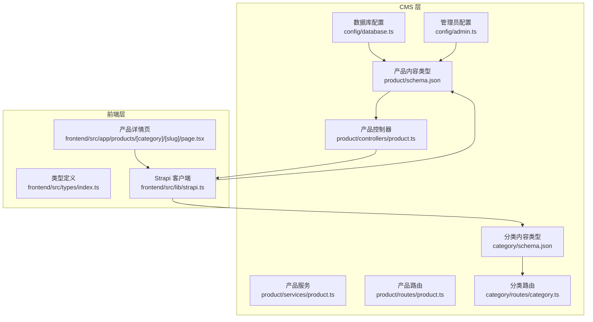
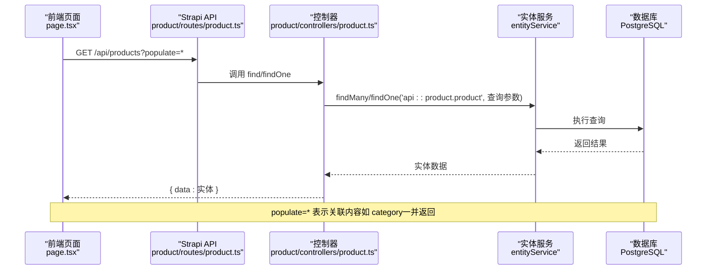
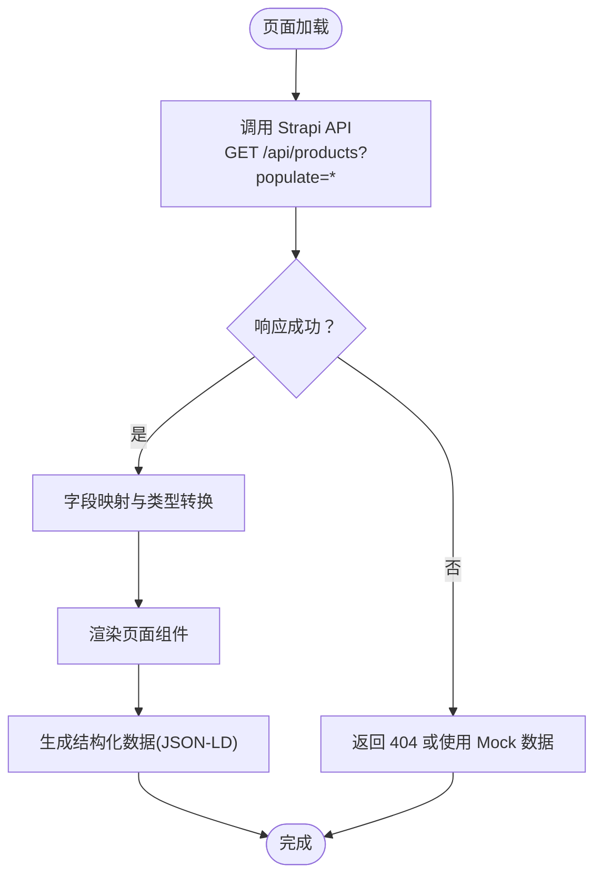
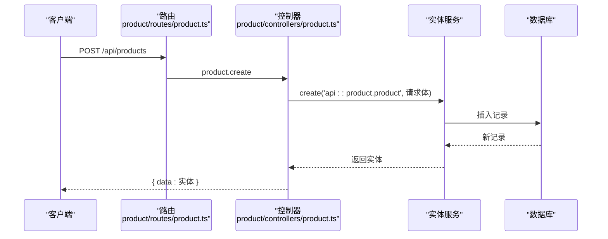
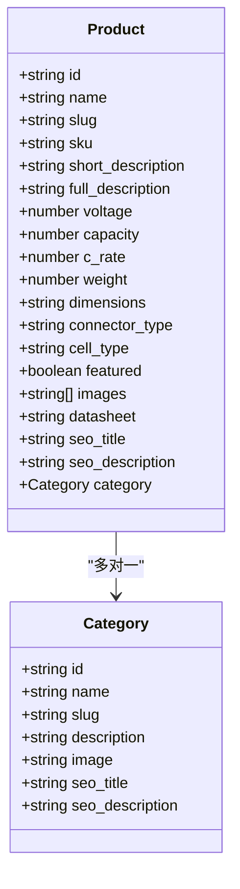
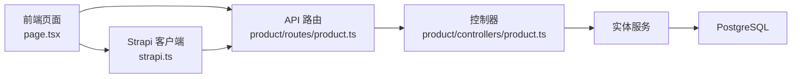

# 产品数据模型

<cite>
**本文档引用的文件**
- [schema.json](file://cms/src/api/product/content-types/product/schema.json)
- [schema.json](file://cms/src/api/category/content-types/category/schema.json)
- [product.ts](file://cms/src/api/product/controllers/product.ts)
- [product.ts](file://cms/src/api/product/services/product.ts)
- [product.ts](file://cms/src/api/product/routes/product.ts)
- [category.ts](file://cms/src/api/category/routes/category.ts)
- [index.ts](file://frontend/src/types/index.ts)
- [page.tsx](file://frontend/src/app/products/[category]/[slug]/page.tsx)
- [strapi.ts](file://frontend/src/lib/strapi.ts)
- [seed-data.js](file://cms/scripts/seed-data.js)
- [database.ts](file://cms/config/database.ts)
- [admin.ts](file://cms/config/admin.ts)
</cite>

## 目录
1. [简介](#简介)
2. [项目结构](#项目结构)
3. [核心组件](#核心组件)
4. [架构总览](#架构总览)
5. [详细组件分析](#详细组件分析)
6. [依赖分析](#依赖分析)
7. [性能考虑](#性能考虑)
8. [故障排除指南](#故障排除指南)
9. [结论](#结论)
10. [附录](#附录)

## 简介
本文件系统性地文档化了产品数据模型，覆盖基础属性、技术规格、电气参数、SEO优化字段，以及产品与分类的多对一关系和媒体文件关联。同时提供字段类型、验证规则、默认值与约束条件说明，结合实际产品数据示例与字段使用场景，并给出扩展指南与最佳实践。

## 项目结构
该仓库采用前后端分离架构：CMS 使用 Strapi 提供内容管理与 API；前端使用 Next.js 通过 API 获取产品与分类数据。产品模型位于 CMS 的 product 内容类型中，分类模型位于 category 内容类型中。前端通过类型定义与页面组件消费这些数据。

**图表来源**
- [schema.json:1-33](file://cms/src/api/product/content-types/product/schema.json#L1-L33)
- [schema.json:1-21](file://cms/src/api/category/content-types/category/schema.json#L1-L21)
- [product.ts:1-40](file://cms/src/api/product/controllers/product.ts#L1-L40)
- [product.ts:1-2](file://cms/src/api/product/services/product.ts#L1-L2)
- [product.ts:1-35](file://cms/src/api/product/routes/product.ts#L1-L35)
- [category.ts:1-50](file://cms/src/api/category/routes/category.ts#L1-L50)
- [index.ts:1-157](file://frontend/src/types/index.ts#L1-L157)
- [page.tsx:1-566](file://frontend/src/app/products/[category]/[slug]/page.tsx#L1-L566)
- [strapi.ts:1-412](file://frontend/src/lib/strapi.ts#L1-L412)
- [database.ts:1-15](file://cms/config/database.ts#L1-L15)
- [admin.ts:1-21](file://cms/config/admin.ts#L1-L21)

**章节来源**
- [schema.json:1-33](file://cms/src/api/product/content-types/product/schema.json#L1-L33)
- [schema.json:1-21](file://cms/src/api/category/content-types/category/schema.json#L1-L21)
- [product.ts:1-40](file://cms/src/api/product/controllers/product.ts#L1-L40)
- [product.ts:1-2](file://cms/src/api/product/services/product.ts#L1-L2)
- [product.ts:1-35](file://cms/src/api/product/routes/product.ts#L1-L35)
- [category.ts:1-50](file://cms/src/api/category/routes/category.ts#L1-L50)
- [index.ts:1-157](file://frontend/src/types/index.ts#L1-L157)
- [page.tsx:1-566](file://frontend/src/app/products/[category]/[slug]/page.tsx#L1-L566)
- [strapi.ts:1-412](file://frontend/src/lib/strapi.ts#L1-L412)
- [database.ts:1-15](file://cms/config/database.ts#L1-L15)
- [admin.ts:1-21](file://cms/config/admin.ts#L1-L21)

## 核心组件
- 产品内容类型（Product）
  - 基础属性：名称、SKU、短描述、富文本描述、别名（UID）
  - 技术规格：电压、容量、C率、重量、尺寸
  - 电气参数：连接器类型、电池类型枚举（LiPo、Li-ion、LiFePO4，默认 LiPo）
  - SEO 字段：SEO 标题、SEO 描述
  - 关系与媒体：分类（多对一）、图片（多图）、数据表（单文件）
  - 其他：精选标记（布尔，默认 false）

- 分类内容类型（Category）
  - 基础属性：名称（唯一）、别名（UID）、描述
  - SEO 字段：SEO 标题、SEO 描述
  - 媒体：分类主图（单图）

- 前端类型与页面
  - 类型定义涵盖产品、规格、FAQ、SEO 字段等
  - 产品详情页负责从 CMS 拉取数据并渲染，生成结构化数据

**章节来源**
- [schema.json:12-31](file://cms/src/api/product/content-types/product/schema.json#L12-L31)
- [schema.json:12-18](file://cms/src/api/category/content-types/category/schema.json#L12-L18)
- [index.ts:23-43](file://frontend/src/types/index.ts#L23-L43)
- [page.tsx:35-66](file://frontend/src/app/products/[category]/[slug]/page.tsx#L35-L66)

## 架构总览
产品数据在 CMS 中以内容类型形式存储，前端通过 API 路由访问。控制器封装 CRUD 操作，服务层为空实现，路由暴露 REST 接口。数据库为 PostgreSQL，管理员令牌用于 API 访问控制。

**图表来源**
- [product.ts:1-35](file://cms/src/api/product/routes/product.ts#L1-L35)
- [product.ts:4-17](file://cms/src/api/product/controllers/product.ts#L4-L17)
- [strapi.ts:208-218](file://frontend/src/lib/strapi.ts#L208-L218)

**章节来源**
- [product.ts:1-35](file://cms/src/api/product/routes/product.ts#L1-L35)
- [product.ts:1-40](file://cms/src/api/product/controllers/product.ts#L1-L40)
- [strapi.ts:208-218](file://frontend/src/lib/strapi.ts#L208-L218)
- [database.ts:1-15](file://cms/config/database.ts#L1-L15)

## 详细组件分析

### 产品内容类型字段定义与约束
- 基础属性
  - 名称：字符串，必填
  - 别名（slug）：UID，基于名称生成，必填且唯一
  - SKU：字符串，必填且唯一
  - 短描述：文本，必填
  - 富文本描述：富文本，可空
- 技术规格
  - 电压：整数，必填（单位：S 数，如 6S）
  - 容量：整数，必填（单位：mAh）
  - C率：整数，必填（单位：C）
  - 重量：整数，可空（单位：g）
  - 尺寸：字符串，可空（格式：L×W×H mm）
- 电气参数
  - 连接器类型：字符串，可空
  - 电池类型：枚举，取值范围为 [LiPo, Li-ion, LiFePO4]，默认 LiPo
- SEO 优化
  - SEO 标题：字符串，可空
  - SEO 描述：文本，可空
- 关系与媒体
  - 分类：多对一关系，目标为 category
  - 图片：媒体，多图，仅允许图片类型
  - 数据表：媒体，单文件，仅允许文件类型
- 其他
  - 精选：布尔，默认 false

字段类型、验证规则、默认值与约束条件均来自内容类型 schema 定义。

**章节来源**
- [schema.json:12-31](file://cms/src/api/product/content-types/product/schema.json#L12-L31)

### 分类内容类型字段定义与约束
- 名称：字符串，必填且唯一
- 别名（slug）：UID，基于名称生成，必填
- 描述：文本，可空
- 主图：媒体，单图，仅允许图片类型
- SEO 标题/描述：文本，可空

**章节来源**
- [schema.json:12-18](file://cms/src/api/category/content-types/category/schema.json#L12-L18)

### 前端类型与页面映射
- 前端类型定义
  - 产品接口包含：id、name、slug、sku、category、shortDescription、fullDescription、specifications、images、datasheet、featured、faqs、seo、createdAt、updatedAt
  - 规格接口包含：voltage、capacity、cRate、weight、dimensions、connectorType、cellType
  - SEO 接口包含：metaTitle、metaDescription、ogImage?
- 页面渲染逻辑
  - 通过 populate=* 获取关联分类与媒体
  - 将后端字段转换为前端类型（如 snake_case → camelCase）
  - 生成结构化数据（产品、面包屑、FAQ）

**图表来源**
- [page.tsx:20-73](file://frontend/src/app/products/[category]/[slug]/page.tsx#L20-L73)
- [strapi.ts:208-218](file://frontend/src/lib/strapi.ts#L208-L218)
- [index.ts:23-43](file://frontend/src/types/index.ts#L23-L43)

**章节来源**
- [index.ts:23-43](file://frontend/src/types/index.ts#L23-L43)
- [page.tsx:35-66](file://frontend/src/app/products/[category]/[slug]/page.tsx#L35-L66)
- [strapi.ts:333-365](file://frontend/src/lib/strapi.ts#L333-L365)

### API 工作流（序列图）

**图表来源**
- [product.ts:16-19](file://cms/src/api/product/routes/product.ts#L16-L19)
- [product.ts:19-24](file://cms/src/api/product/controllers/product.ts#L19-L24)

**章节来源**
- [product.ts:1-35](file://cms/src/api/product/routes/product.ts#L1-L35)
- [product.ts:1-40](file://cms/src/api/product/controllers/product.ts#L1-L40)

### 关系建模（类图）

**图表来源**
- [schema.json:12-31](file://cms/src/api/product/content-types/product/schema.json#L12-L31)
- [schema.json:12-18](file://cms/src/api/category/content-types/category/schema.json#L12-L18)

**章节来源**
- [schema.json:28-28](file://cms/src/api/product/content-types/product/schema.json#L28-L28)
- [schema.json:12-18](file://cms/src/api/category/content-types/category/schema.json#L12-L18)

### 字段使用场景与示例
- 产品详情页展示
  - 快速规格卡片：电压（S 数与标称电压）、容量、放电率、重量
  - 技术规格表格：容量、放电率、重量、尺寸、连接器、电池类型、能量密度
  - 下载资料：数据表 PDF 链接
- SEO 优化
  - 使用 SEO 标题与描述作为页面元信息
  - 生成结构化数据（产品、面包屑、FAQ）
- 示例数据（节选）
  - 产品名称、SKU、短描述、富文本描述、电压、容量、C率、重量、尺寸、连接器类型、电池类型、精选标记、分类别名、SEO 标题与描述
  - 参考种子脚本中的产品条目与分类条目

**章节来源**
- [page.tsx:309-502](file://frontend/src/app/products/[category]/[slug]/page.tsx#L309-L502)
- [seed-data.js:69-319](file://cms/scripts/seed-data.js#L69-L319)

## 依赖分析
- 组件耦合
  - 产品控制器依赖实体服务进行 CRUD 操作
  - 前端页面依赖 Strapi 客户端库进行数据拉取
  - 产品与分类之间存在多对一关系
- 外部依赖
  - 数据库：PostgreSQL
  - 管理：JWT 与 API Token 用于认证
- 潜在循环依赖
  - 当前结构清晰，无明显循环依赖

**图表来源**
- [product.ts:1-40](file://cms/src/api/product/controllers/product.ts#L1-L40)
- [product.ts:1-35](file://cms/src/api/product/routes/product.ts#L1-L35)
- [page.tsx:20-73](file://frontend/src/app/products/[category]/[slug]/page.tsx#L20-L73)
- [strapi.ts:51-119](file://frontend/src/lib/strapi.ts#L51-L119)
- [database.ts:1-15](file://cms/config/database.ts#L1-L15)

**章节来源**
- [product.ts:1-40](file://cms/src/api/product/controllers/product.ts#L1-L40)
- [product.ts:1-35](file://cms/src/api/product/routes/product.ts#L1-L35)
- [page.tsx:20-73](file://frontend/src/app/products/[category]/[slug]/page.tsx#L20-L73)
- [strapi.ts:51-119](file://frontend/src/lib/strapi.ts#L51-L119)
- [database.ts:1-15](file://cms/config/database.ts#L1-L15)

## 性能考虑
- API 查询优化
  - 合理使用 populate 参数，避免过度关联导致查询膨胀
  - 对高频查询（如产品列表）考虑分页与排序
- 前端缓存与重建
  - Next.js 缓存策略（revalidate）减少重复请求
- 媒体资源
  - 图片建议压缩与懒加载，避免阻塞首屏
- 数据库
  - 为常用过滤字段（如 category.slug、voltage、featured）建立索引

## 故障排除指南
- 404 错误
  - 页面找不到产品时回退到 Mock 数据或返回 404
- API 连接失败
  - 检查 Strapi URL 与 Token 配置
  - 确认数据库连接正常
- 字段不一致
  - 前端类型与后端字段命名差异（snake_case vs camelCase）需在转换层处理
- 关系缺失
  - populate 参数未设置可能导致关联对象为空，确保查询时包含 populate=*

**章节来源**
- [page.tsx:174-179](file://frontend/src/app/products/[category]/[slug]/page.tsx#L174-L179)
- [strapi.ts:109-118](file://frontend/src/lib/strapi.ts#L109-L118)
- [database.ts:1-15](file://cms/config/database.ts#L1-L15)
- [admin.ts:1-21](file://cms/config/admin.ts#L1-L21)

## 结论
产品数据模型围绕“基础属性—技术规格—电气参数—SEO—关系与媒体”构建，具备明确的字段类型、验证规则与默认值。通过 Strapi 的内容类型与路由机制，配合前端类型定义与页面渲染，实现了从数据存储到前端展示的完整链路。建议在生产环境中强化索引、缓存与媒体优化，并持续维护字段与类型的一致性。

## 附录

### 字段清单与约束摘要
- 基础属性
  - 名称：字符串，必填
  - 别名（slug）：UID，必填且唯一
  - SKU：字符串，必填且唯一
  - 短描述：文本，必填
  - 富文本描述：富文本，可空
- 技术规格
  - 电压：整数，必填（S 数）
  - 容量：整数，必填（mAh）
  - C率：整数，必填（C）
  - 重量：整数，可空（g）
  - 尺寸：字符串，可空（L×W×H mm）
- 电气参数
  - 连接器类型：字符串，可空
  - 电池类型：枚举 [LiPo, Li-ion, LiFePO4]，默认 LiPo
- SEO
  - SEO 标题：字符串，可空
  - SEO 描述：文本，可空
- 关系与媒体
  - 分类：多对一，必填（种子脚本中通过 category_slug 映射）
  - 图片：媒体，多图，仅图片
  - 数据表：媒体，单文件，仅文件
- 其他
  - 精选：布尔，默认 false

**章节来源**
- [schema.json:12-31](file://cms/src/api/product/content-types/product/schema.json#L12-L31)
- [seed-data.js:341-362](file://cms/scripts/seed-data.js#L341-L362)

### 字段使用场景示例
- 产品详情页
  - 快速规格卡片：电压（S 数与标称电压）、容量、放电率、重量
  - 技术规格表格：容量、放电率、重量、尺寸、连接器、电池类型、能量密度
  - 下载资料：数据表 PDF 链接
- SEO 优化
  - 使用 SEO 标题与描述作为页面元信息
  - 生成结构化数据（产品、面包屑、FAQ）

**章节来源**
- [page.tsx:309-502](file://frontend/src/app/products/[category]/[slug]/page.tsx#L309-L502)
- [seed-data.js:69-319](file://cms/scripts/seed-data.js#L69-L319)

### 扩展指南与最佳实践
- 新增字段
  - 在内容类型 schema 中添加新字段，遵循现有命名与类型规范
  - 在前端类型定义中同步新增字段
- 关系扩展
  - 若需要一对多或多对多，评估是否引入中间表或使用 Strapi 的多对多关系
- SEO 最佳实践
  - 优先使用 SEO 标题与描述，确保每页唯一性
  - 生成结构化数据，提升搜索可见性
- 数据一致性
  - 种子脚本中通过 category_slug 映射分类，确保导入时关系正确
  - 前端统一字段命名转换，避免命名冲突

**章节来源**
- [schema.json:12-31](file://cms/src/api/product/content-types/product/schema.json#L12-L31)
- [seed-data.js:341-362](file://cms/scripts/seed-data.js#L341-L362)
- [index.ts:23-43](file://frontend/src/types/index.ts#L23-L43)