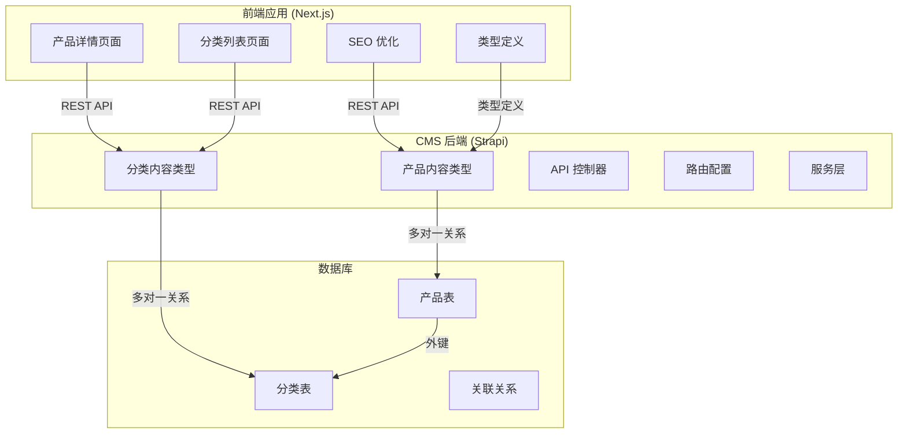
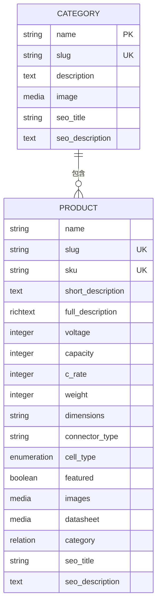
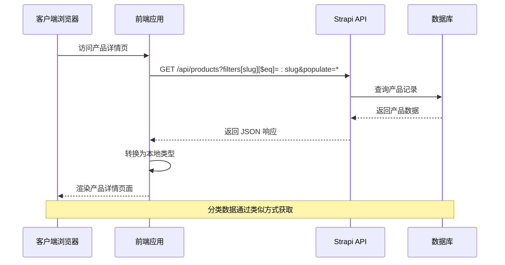
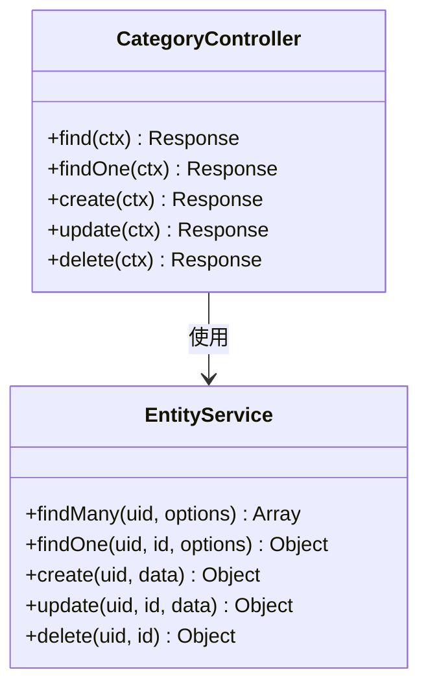
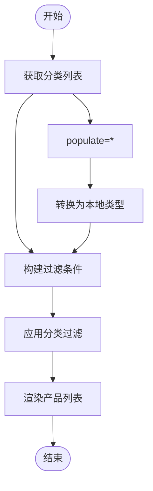
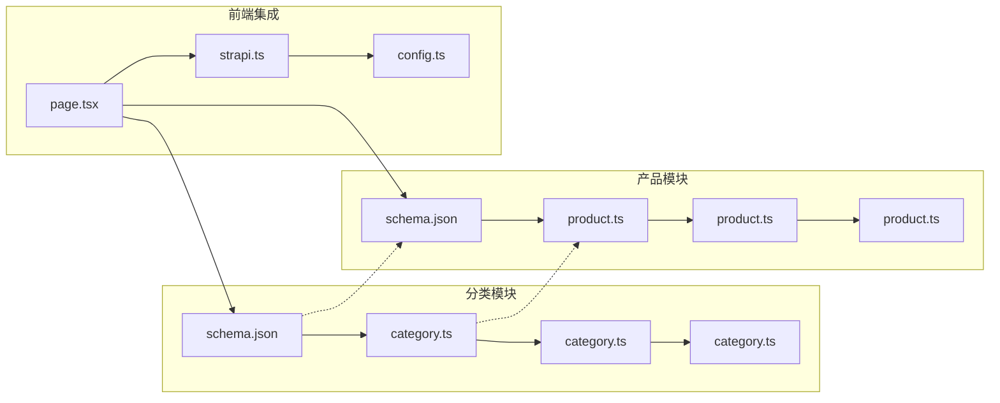
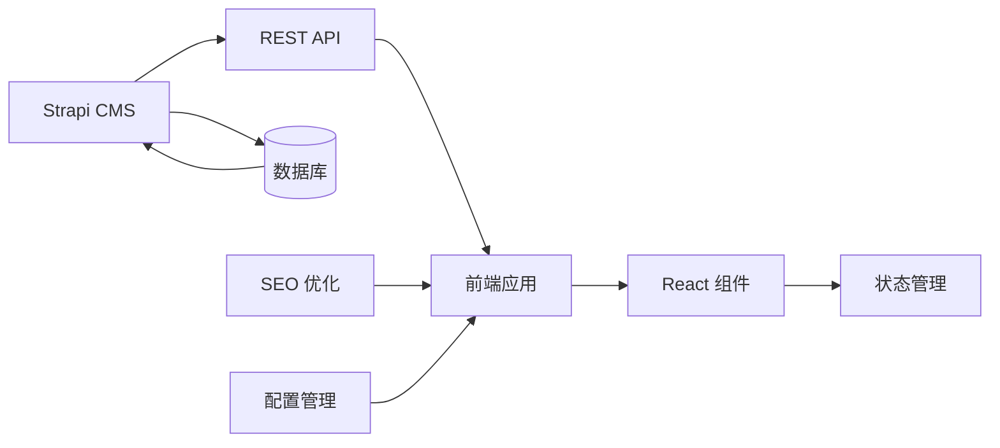

# 分类数据模型

<cite>
**本文档引用的文件**
- [schema.json](file://cms/src/api/category/content-types/category/schema.json)
- [category.ts](file://cms/src/api/category/controllers/category.ts)
- [category.ts](file://cms/src/api/category/routes/category.ts)
- [category.ts](file://cms/src/api/category/services/category.ts)
- [schema.json](file://cms/src/api/product/content-types/product/schema.json)
- [seed-data.js](file://cms/scripts/seed-data.js)
- [page.tsx](file://frontend/src/app/products/[category]/[slug]/page.tsx)
- [strapi.ts](file://frontend/src/lib/strapi.ts)
- [config.ts](file://frontend/src/lib/config.ts)
</cite>

## 目录
1. [简介](#简介)
2. [项目结构](#项目结构)
3. [核心组件](#核心组件)
4. [架构概览](#架构概览)
5. [详细组件分析](#详细组件分析)
6. [依赖分析](#依赖分析)
7. [性能考虑](#性能考虑)
8. [故障排除指南](#故障排除指南)
9. [结论](#结论)
10. [附录](#附录)

## 简介

本文档详细说明了分类数据模型的设计与实现，包括基本字段定义、层级结构、父子关系以及在产品组织中的作用。该系统基于 Strapi 内容管理系统构建，采用头端分离架构，通过 REST API 提供分类和产品数据。分类模型支持 URL 友好的标识符（slug），用于优化 SEO 和用户导航体验。

## 项目结构

该项目采用前后端分离架构，主要由以下部分组成：



**图表来源**
- [schema.json:1-21](file://cms/src/api/category/content-types/category/schema.json#L1-L21)
- [schema.json:1-33](file://cms/src/api/product/content-types/product/schema.json#L1-L33)

**章节来源**
- [schema.json:1-21](file://cms/src/api/category/content-types/category/schema.json#L1-L21)
- [schema.json:1-33](file://cms/src/api/product/content-types/product/schema.json#L1-L33)

## 核心组件

### 分类模型字段定义

分类模型包含以下核心字段：

| 字段名 | 类型 | 必填 | 唯一 | 描述 |
|--------|------|------|------|------|
| name | string | 是 | 是 | 分类名称，全局唯一 |
| slug | uid | 是 | 是 | URL 友好标识符，自动从名称生成 |
| description | text | 否 | 否 | 分类描述文本 |
| image | media | 否 | 否 | 分类图片媒体文件 |
| seo_title | string | 否 | 否 | SEO 标题，用于搜索引擎优化 |
| seo_description | text | 否 | 否 | SEO 描述，用于元标签 |

### 产品模型中的分类关系

产品模型通过多对一关系关联到分类：



**图表来源**
- [schema.json:12-19](file://cms/src/api/category/content-types/category/schema.json#L12-L19)
- [schema.json:12-31](file://cms/src/api/product/content-types/product/schema.json#L12-L31)

**章节来源**
- [schema.json:12-19](file://cms/src/api/category/content-types/category/schema.json#L12-L19)
- [schema.json:12-31](file://cms/src/api/product/content-types/product/schema.json#L12-L31)

## 架构概览

系统采用 RESTful API 架构，前后端通过 HTTP 协议通信：



**图表来源**
- [page.tsx:20-73](file://frontend/src/app/products/[category]/[slug]/page.tsx#L20-L73)
- [strapi.ts:170-182](file://frontend/src/lib/strapi.ts#L170-L182)

## 详细组件分析

### 分类 API 控制器

分类控制器提供了完整的 CRUD 操作接口：



**图表来源**
- [category.ts:3-39](file://cms/src/api/category/controllers/category.ts#L3-L39)

### 分类路由配置

系统提供标准的 REST API 路由：

| HTTP 方法 | 路径 | 处理器 | 功能 |
|-----------|------|--------|------|
| GET | /categories | category.find | 获取所有分类 |
| GET | /categories/:id | category.findOne | 获取单个分类 |
| POST | /categories | category.create | 创建新分类 |
| PUT | /categories/:id | category.update | 更新分类 |
| DELETE | /categories/:id | category.delete | 删除分类 |

**章节来源**
- [category.ts:4-38](file://cms/src/api/category/controllers/category.ts#L4-L38)
- [category.ts:4-47](file://cms/src/api/category/routes/category.ts#L4-L47)

### 前端集成实现

前端通过专门的 API 客户端处理分类数据：



**图表来源**
- [strapi.ts:170-182](file://frontend/src/lib/strapi.ts#L170-L182)
- [strapi.ts:195-218](file://frontend/src/lib/strapi.ts#L195-L218)

**章节来源**
- [strapi.ts:170-182](file://frontend/src/lib/strapi.ts#L170-L182)
- [strapi.ts:195-218](file://frontend/src/lib/strapi.ts#L195-L218)

### 实际使用场景

系统包含预定义的产品分类示例：

| 分类名称 | URL 标识符 | 应用场景 |
|----------|------------|----------|
| 半固态电池 | semi-solid-state-battery | 高端无人机应用，要求最大可靠性 |
| 锂聚合物电池 | lithium-polymer-battery | 高性能无人机，轻量化设计 |
| 锂离子电池 | lithium-ion-battery | 商业无人机运营，长循环寿命 |
| 高能量密度电池 | high-energy-density-battery | 长续航任务和重型载荷应用 |
| 高放电率电池 | high-discharge-rate-battery | 特技飞行和竞速无人机 |
| 高压电池 | high-voltage-battery | 专业航拍和重载应用 |
| 低温电池 | low-temperature-battery | 极地和冬季作业环境 |
| 高温电池 | high-temperature-battery | 沙漠和热带气候作业 |

**章节来源**
- [seed-data.js:9-66](file://cms/scripts/seed-data.js#L9-L66)

## 依赖分析

### 组件间依赖关系



**图表来源**
- [schema.json:1-21](file://cms/src/api/category/content-types/category/schema.json#L1-L21)
- [schema.json:1-33](file://cms/src/api/product/content-types/product/schema.json#L1-L33)
- [page.tsx:1-566](file://frontend/src/app/products/[category]/[slug]/page.tsx#L1-L566)

### 数据流依赖



**图表来源**
- [strapi.ts:51-119](file://frontend/src/lib/strapi.ts#L51-L119)
- [config.ts:118-147](file://frontend/src/lib/config.ts#L118-L147)

**章节来源**
- [schema.json:1-21](file://cms/src/api/category/content-types/category/schema.json#L1-L21)
- [schema.json:1-33](file://cms/src/api/product/content-types/product/schema.json#L1-L33)

## 性能考虑

### 缓存策略

前端应用实现了智能缓存机制：

- **静态参数生成**: 使用 `generateStaticParams()` 预渲染热门产品页面
- **增量静态再生**: 设置 60 秒缓存刷新间隔
- **API 健康检查**: 自动检测后端服务可用性

### 查询优化

- **选择性填充**: 使用 `populate` 参数控制关联数据加载
- **分页处理**: 支持大数据集的分页浏览
- **过滤优化**: 基于 URL 标识符的快速查找

### SEO 优化

- **结构化数据**: 自动生成 JSON-LD 标记
- **面包屑导航**: 改善用户体验和搜索引擎友好性
- **元标签管理**: 支持自定义 SEO 标题和描述

## 故障排除指南

### 常见问题诊断

1. **分类数据无法加载**
   - 检查 API 端点是否正确配置
   - 验证数据库连接状态
   - 确认网络防火墙设置

2. **产品页面显示异常**
   - 检查 slug 格式是否正确
   - 验证分类关联关系
   - 确认媒体文件路径

3. **SEO 优化失效**
   - 检查 meta 标签生成逻辑
   - 验证结构化数据格式
   - 确认 canonical URL 设置

**章节来源**
- [strapi.ts:308-316](file://frontend/src/lib/strapi.ts#L308-L316)
- [page.tsx:164-200](file://frontend/src/app/products/[category]/[slug]/page.tsx#L164-L200)

## 结论

该分类数据模型设计合理，具有以下优势：

1. **清晰的数据结构**: 明确的字段定义和约束条件
2. **灵活的扩展性**: 支持自定义字段和业务需求变更
3. **优秀的用户体验**: URL 友好标识符和 SEO 优化
4. **可靠的架构**: 前后端分离，易于维护和扩展
5. **完善的工具链**: 包含种子数据和开发脚本

系统为无人机电池产品的分类管理提供了完整的技术解决方案，支持从基础分类到复杂产品规格的全面管理需求。

## 附录

### 扩展选项和自定义字段添加指南

#### 添加新的分类字段

1. **更新内容类型定义**
   ```json
   {
     "attributes": {
       "new_field": {
         "type": "string",
         "required": false,
         "unique": false
       }
     }
   }
   ```

2. **更新前端类型定义**
   ```typescript
   interface Category {
     newField?: string;
   }
   ```

3. **更新 API 控制器**
   - 修改验证规则
   - 更新数据处理逻辑

#### 添加分类层级结构

如需支持多级分类，建议：

1. **添加父分类关联**
   ```json
   "parent": {
     "type": "relation",
     "relation": "manyToOne",
     "target": "api::category.category",
     "inversedBy": "children"
   }
   ```

2. **添加子分类关联**
   ```json
   "children": {
     "type": "relation",
     "relation": "oneToMany",
     "target": "api::category.category",
     "mappedBy": "parent"
   }
   ```

3. **更新前端导航逻辑**
   - 实现递归菜单渲染
   - 添加面包屑导航

#### 性能优化建议

1. **数据库索引**
   - 为常用查询字段添加索引
   - 优化关联查询性能

2. **缓存策略**
   - 实现多级缓存架构
   - 使用 CDN 加速静态资源

3. **API 优化**
   - 实现分页和过滤
   - 优化响应时间