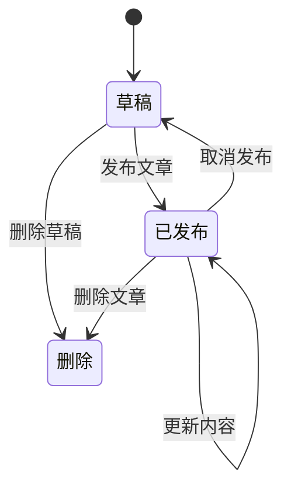
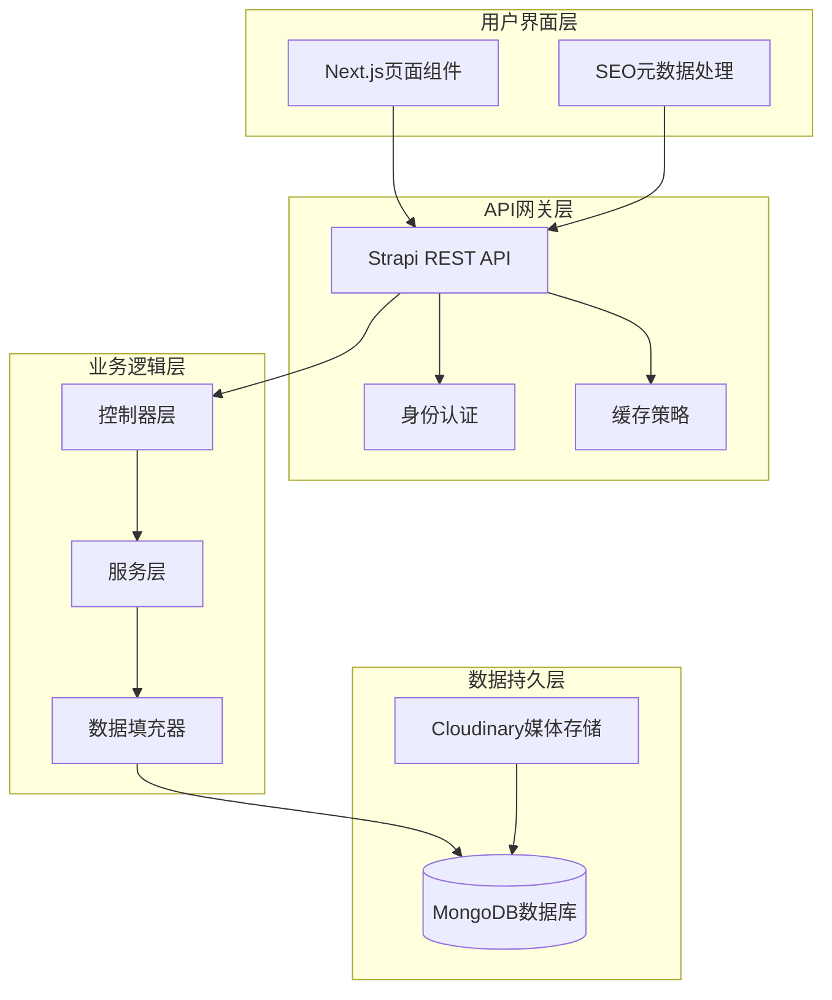
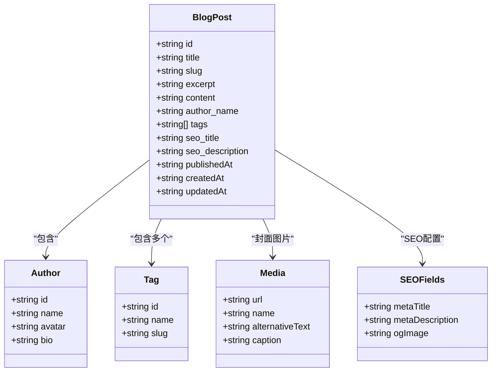
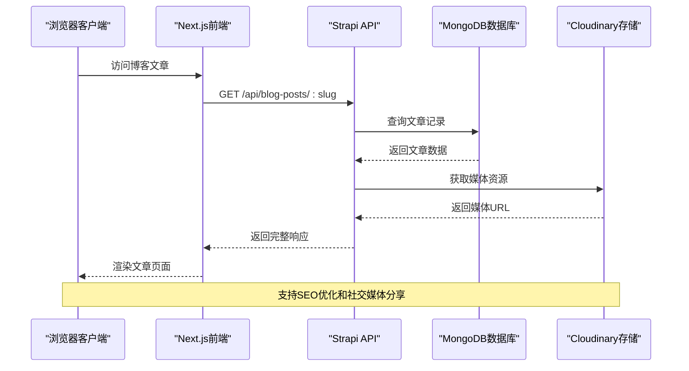
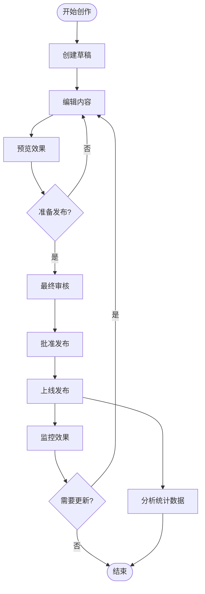
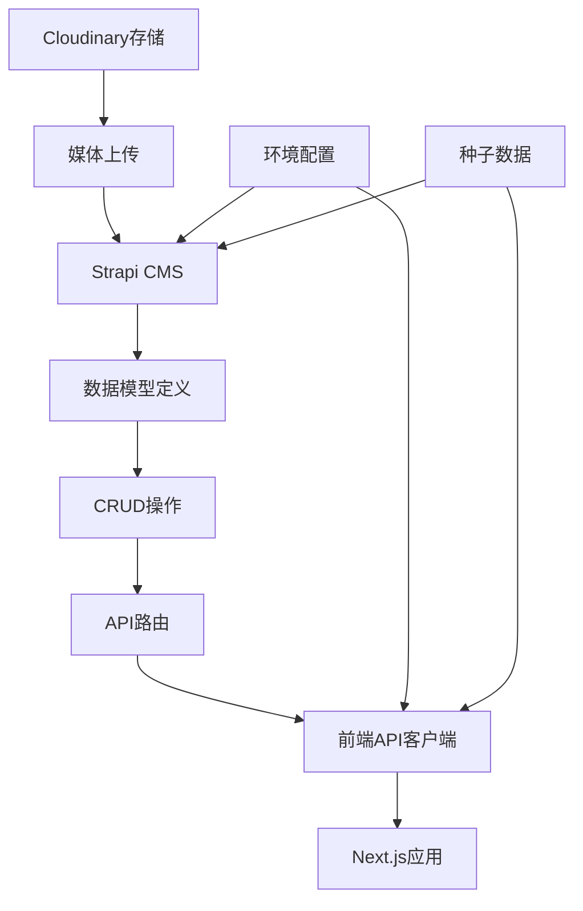
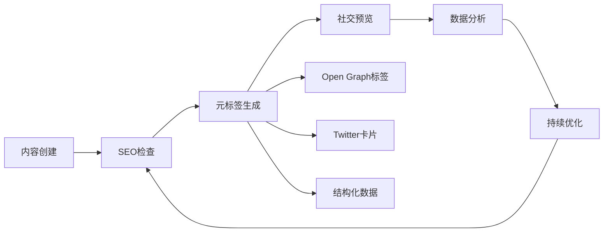

# 博客文章数据模型

<cite>
**本文档引用的文件**
- [schema.json](file://cms/src/api/blog-post/content-types/blog-post/schema.json)
- [blog-post.ts（控制器）](file://cms/src/api/blog-post/controllers/blog-post.ts)
- [blog-post.ts（服务）](file://cms/src/api/blog-post/services/blog-post.ts)
- [blog-post.ts（路由）](file://cms/src/api/blog-post/routes/blog-post.ts)
- [index.ts（CMS引导）](file://cms/src/index.ts)
- [seed-blog-data.js](file://cms/scripts/seed-blog-data.js)
- [strapi.ts（前端API客户端）](file://frontend/src/lib/strapi.ts)
- [types/index.ts（类型定义）](file://frontend/src/types/index.ts)
- [page.tsx（博客列表页面）](file://frontend/src/app/blog/page.tsx)
- [page.tsx（博客详情页面）](file://frontend/src/app/blog/[slug]/page.tsx)
- [plugins.ts（插件配置）](file://cms/config/plugins.ts)
- [admin.ts（管理配置）](file://cms/config/admin.ts)
</cite>

## 目录
1. [简介](#简介)
2. [项目结构](#项目结构)
3. [核心组件](#核心组件)
4. [架构概览](#架构概览)
5. [详细组件分析](#详细组件分析)
6. [依赖关系分析](#依赖关系分析)
7. [性能考虑](#性能考虑)
8. [故障排除指南](#故障排除指南)
9. [结论](#结论)
10. [附录](#附录)

## 简介

本文件为博客文章数据模型的详细技术文档，基于Strapi CMS构建的Battivus无人机电池技术博客系统。该系统采用前后端分离架构，后端使用TypeScript开发的Strapi CMS，前端使用Next.js框架构建静态站点生成的博客页面。

博客系统支持完整的文章生命周期管理，包括草稿功能、SEO优化、媒体资源管理和多语言支持。系统通过UID（唯一标识符）机制确保URL的稳定性和SEO友好性。

## 项目结构

博客系统采用模块化的项目结构，主要分为CMS后台管理系统和前端展示层两个部分：

```mermaid
graph TB
subgraph "CMS后台系统"
A[schema.json<br/>数据模型定义]
B[controllers/<br/>业务逻辑控制器]
C[routes/<br/>API路由配置]
D[services/<br/>服务层实现]
E[index.ts<br/>系统引导与权限]
end
subgraph "前端展示系统"
F[lib/strapi.ts<br/>API客户端封装]
G[types/index.ts<br/>TypeScript类型定义]
H[app/blog/<br/>博客页面组件]
I[app/blog/[slug]<br/>文章详情页面]
end
subgraph "配置系统"
J[plugins.ts<br/>Cloudinary上传配置]
K[admin.ts<br/>管理后台配置]
end
A --> B
B --> C
C --> D
E --> A
F --> A
G --> F
H --> F
I --> F
J --> A
K --> E
```

**图表来源**
- [schema.json:1-24](file://cms/src/api/blog-post/content-types/blog-post/schema.json#L1-L24)
- [blog-post.ts（控制器）:1-53](file://cms/src/api/blog-post/controllers/blog-post.ts#L1-L53)
- [blog-post.ts（路由）:1-35](file://cms/src/api/blog-post/routes/blog-post.ts#L1-L35)

**章节来源**
- [schema.json:1-24](file://cms/src/api/blog-post/content-types/blog-post/schema.json#L1-L24)
- [blog-post.ts（控制器）:1-53](file://cms/src/api/blog-post/controllers/blog-post.ts#L1-L53)
- [blog-post.ts（路由）:1-35](file://cms/src/api/blog-post/routes/blog-post.ts#L1-L35)

## 核心组件

### 数据模型定义

博客文章数据模型采用Strapi的集合类型（collectionType），启用了草稿和发布功能。核心字段定义如下：

| 字段名称 | 类型 | 必填 | 描述 | 默认值 |
|---------|------|------|------|--------|
| title | string | 是 | 文章标题 | - |
| slug | uid | 是 | URL友好标识符 | 基于title自动生成 |
| excerpt | text | 是 | 文章摘要 | - |
| content | richtext | 是 | 富文本内容 | - |
| featured_image | media | 否 | 封面图片 | - |
| author_name | string | 否 | 作者姓名 | "Battivus Team" |
| tags | json | 否 | 标签数组 | - |
| seo_title | string | 否 | SEO标题 | - |
| seo_description | text | 否 | SEO描述 | - |

### 发布流程与草稿功能

系统通过`draftAndPublish`选项启用完整的发布工作流：



**图表来源**
- [schema.json:9-11](file://cms/src/api/blog-post/content-types/blog-post/schema.json#L9-L11)

**章节来源**
- [schema.json:12-22](file://cms/src/api/blog-post/content-types/blog-post/schema.json#L12-L22)

## 架构概览

博客系统采用分层架构设计，确保了良好的可维护性和扩展性：



**图表来源**
- [blog-post.ts（控制器）:3-52](file://cms/src/api/blog-post/controllers/blog-post.ts#L3-L52)
- [strapi.ts（前端API客户端）:51-119](file://frontend/src/lib/strapi.ts#L51-L119)

## 详细组件分析

### 数据模型类图



**图表来源**
- [schema.json:12-22](file://cms/src/api/blog-post/content-types/blog-post/schema.json#L12-L22)
- [types/index.ts:54-79](file://frontend/src/types/index.ts#L54-L79)

### API工作流程序列图



**图表来源**
- [blog-post.ts（控制器）:11-30](file://cms/src/api/blog-post/controllers/blog-post.ts#L11-L30)
- [strapi.ts（前端API客户端）:261-265](file://frontend/src/lib/strapi.ts#L261-L265)

### 内容发布流程



**图表来源**
- [schema.json:10-10](file://cms/src/api/blog-post/content-types/blog-post/schema.json#L10-L10)

**章节来源**
- [blog-post.ts（控制器）:14-30](file://cms/src/api/blog-post/controllers/blog-post.ts#L14-L30)

### 元数据字段系统

博客系统实现了完整的元数据管理机制：

| 元数据类别 | 字段名称 | 数据类型 | 用途 | SEO影响 |
|-----------|----------|----------|------|---------|
| 基础信息 | title | string | 页面标题 | ✅ 主要关键词 |
| 基础信息 | slug | uid | URL路径 | ✅ 结构化URL |
| 基础信息 | excerpt | text | 摘要描述 | ✅ 搜索结果摘要 |
| SEO优化 | seo_title | string | 自定义SEO标题 | ✅ 替代主标题 |
| SEO优化 | seo_description | text | 自定义SEO描述 | ✅ 搜索结果描述 |
| 社交媒体 | featured_image | media | 社交分享图片 | ✅ Open Graph图片 |
| 内容组织 | tags | json | 标签分类系统 | ✅ 内容关联 |
| 版本控制 | publishedAt | datetime | 发布时间戳 | ✅ 内容新鲜度 |

**章节来源**
- [schema.json:12-22](file://cms/src/api/blog-post/content-types/blog-post/schema.json#L12-L22)
- [types/index.ts:17-21](file://frontend/src/types/index.ts#L17-L21)

## 依赖关系分析

### 组件耦合度分析

```mermaid
graph LR
subgraph "核心依赖"
Schema[schema.json] --> Controller[blog-post.ts]
Controller --> Service[blog-post.ts]
Controller --> Routes[blog-post.ts]
Routes --> API[REST API]
end
subgraph "前端集成"
Types[types/index.ts] --> FrontendAPI[strapi.ts]
FrontendAPI --> API
BlogList[blog/page.tsx] --> FrontendAPI
BlogDetail[blog/[slug]/page.tsx] --> FrontendAPI
end
subgraph "外部服务"
Cloudinary[Cloudinary] --> MediaUpload[媒体上传]
Strapi[Strapi CMS] --> MongoDB[(MongoDB)]
end
Controller --> Cloudinary
FrontendAPI --> Strapi
MediaUpload --> Cloudinary
```

**图表来源**
- [plugins.ts:3-16](file://cms/config/plugins.ts#L3-L16)
- [strapi.ts（前端API客户端）:1-412](file://frontend/src/lib/strapi.ts#L1-L412)

### 数据流依赖



**图表来源**
- [seed-blog-data.js:1-444](file://cms/scripts/seed-blog-data.js#L1-L444)
- [index.ts（CMS引导）:219-315](file://cms/src/index.ts#L219-L315)

**章节来源**
- [plugins.ts:1-19](file://cms/config/plugins.ts#L1-L19)
- [admin.ts:1-21](file://cms/config/admin.ts#L1-L21)

## 性能考虑

### 缓存策略

系统采用了多层次的缓存机制来优化性能：

1. **CDN缓存**: Cloudinary提供的全球CDN加速媒体资源加载
2. **浏览器缓存**: Next.js的静态生成页面具备内置缓存
3. **API缓存**: Strapi的查询结果缓存机制
4. **数据库索引**: 关键字段建立适当的索引以提升查询性能

### 性能优化建议

- **媒体资源优化**: 使用Cloudinary自动压缩和格式转换
- **内容分发网络**: 配置CDN以减少全球访问延迟
- **数据库连接池**: 优化Strapi的数据库连接配置
- **API响应压缩**: 启用Gzip压缩以减少传输体积

## 故障排除指南

### 常见问题诊断

| 问题类型 | 症状 | 可能原因 | 解决方案 |
|---------|------|----------|----------|
| 文章无法发布 | 发布按钮不可用 | 权限不足或字段验证失败 | 检查用户权限和必填字段 |
| 图片加载失败 | 媒体资源404错误 | Cloudinary配置错误 | 验证Cloudinary凭据和网络连接 |
| SEO元数据无效 | 社交分享显示空白 | SEO字段未正确设置 | 检查SEO字段配置和Open Graph标签 |
| API请求超时 | 前端页面加载缓慢 | 数据库查询性能问题 | 优化查询和添加索引 |

### 调试工具

- **浏览器开发者工具**: 检查网络请求和响应
- **Strapi管理面板**: 查看数据模型和内容管理
- **日志监控**: 分析系统运行状态和错误信息
- **性能分析**: 使用Next.js Profiler分析页面渲染性能

**章节来源**
- [blog-post.ts（控制器）:1-53](file://cms/src/api/blog-post/controllers/blog-post.ts#L1-L53)
- [strapi.ts（前端API客户端）:114-164](file://frontend/src/lib/strapi.ts#L114-L164)

## 结论

博客文章数据模型为Battivus无人机电池技术博客系统提供了完整的技术解决方案。系统通过精心设计的数据结构、完善的发布流程和强大的SEO优化功能，为用户提供了一个功能丰富且易于维护的内容管理系统。

该模型的主要优势包括：
- **灵活的数据结构**: 支持富文本内容和多媒体资源
- **完整的发布工作流**: 草稿到发布的无缝转换
- **强大的SEO功能**: 全面的元数据管理和社交媒体优化
- **可扩展的设计**: 易于添加新字段和功能模块
- **高性能架构**: 多层次缓存和优化策略

## 附录

### 完整数据示例

以下是一个典型的博客文章数据结构示例：

```json
{
  "id": "1",
  "title": "无人机电池化学：LiPo vs Li-ion vs LiFePO4",
  "slug": "understanding-drone-battery-chemistry-lipo-vs-liion-vs-lifepo4",
  "excerpt": "现代无人机电池化学的全面比较，帮助您为应用场景选择合适的电源。",
  "content": "<h2>引言</h2><p>选择正确的无人机电池是最重要的决定之一...</p>",
  "featured_image": {
    "url": "/uploads/drone_battery_comparison_abc123.jpg"
  },
  "author_name": "Battivus Engineering Team",
  "tags": ["Battery Technology", "LiPo", "Li-ion", "Guide"],
  "seo_title": "LiPo vs Li-ion vs LiFePO4：无人机电池化学完整指南",
  "seo_description": "比较无人机电池化学。了解LiPo、Li-ion和LiFePO4电池在UAV应用中的优缺点。",
  "publishedAt": "2024-01-15T10:30:00Z",
  "createdAt": "2024-01-10T14:20:00Z",
  "updatedAt": "2024-01-15T16:45:00Z"
}
```

### 扩展功能与自定义字段添加方法

#### 添加新字段的方法

1. **修改数据模型** (`schema.json`):
   ```javascript
   "new_field": {
     "type": "string",
     "required": false,
     "maxLength": 255
   }
   ```

2. **更新前端类型定义** (`types/index.ts`):
   ```typescript
   export interface BlogPost {
     // ... 现有字段
     newField?: string;
   }
   ```

3. **更新API客户端** (`lib/strapi.ts`):
   ```typescript
   export interface BlogPost {
     // ... 现有字段
     newField?: string;
   }
   ```

4. **更新页面组件** (`app/blog/[slug]/page.tsx`):
   ```typescript
   // 在渲染逻辑中使用新字段
   {post.newField && (
     <div className="new-field">
       {post.newField}
     </div>
   )}
   ```

#### 推荐的扩展字段

| 字段名称 | 类型 | 用途 | 实现建议 |
|---------|------|------|----------|
| reading_time | integer | 预计阅读时间（分钟） | 自动计算内容字数 |
| difficulty_level | enum | 难度级别（入门/中级/高级） | 下拉选择框 |
| related_posts | relation | 相关文章推荐 | 多对多关系 |
| video_embed | text | 视频嵌入代码 | 富文本字段 |
| downloadable_files | media | 下载附件 | 多媒体字段 |
| internal_links | json | 内部链接映射 | JSON数组 |

#### SEO优化增强功能



**章节来源**
- [seed-blog-data.js:8-406](file://cms/scripts/seed-blog-data.js#L8-L406)
- [types/index.ts:54-79](file://frontend/src/types/index.ts#L54-L79)