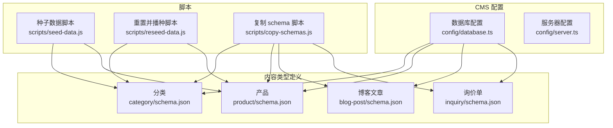
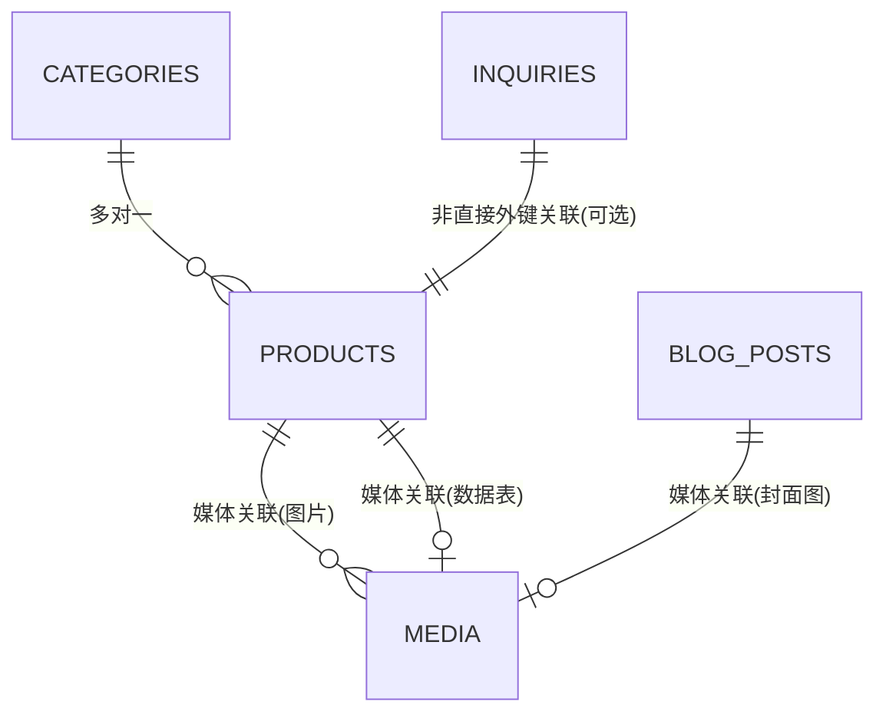
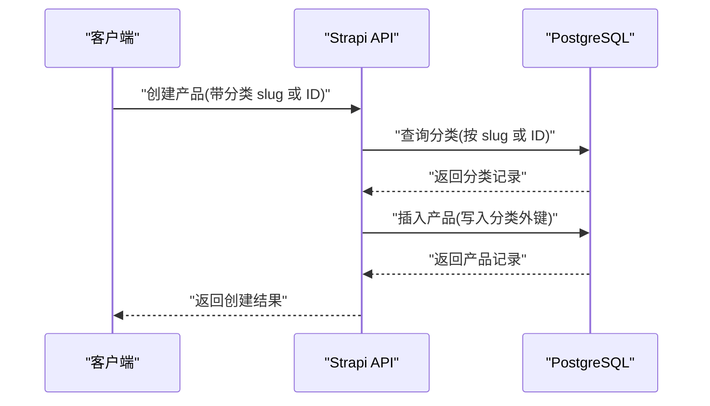
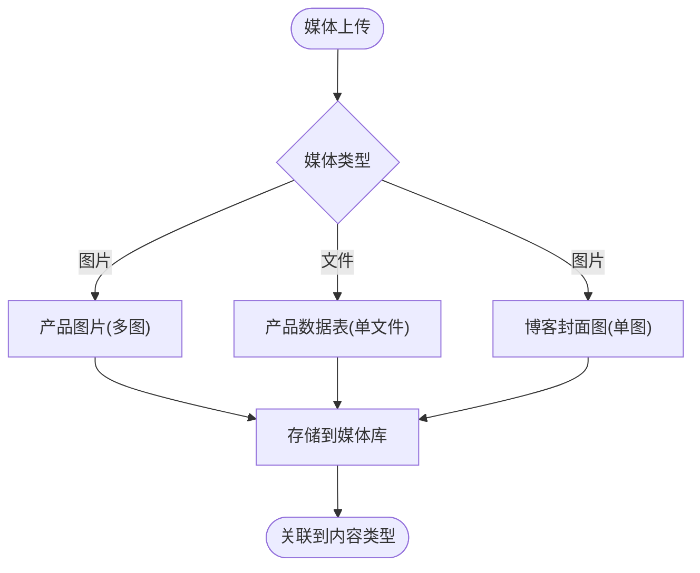
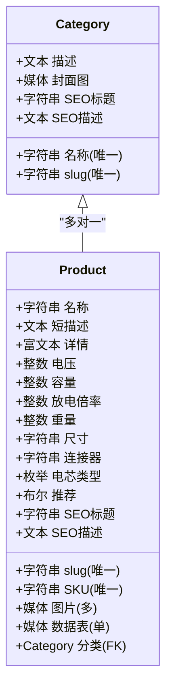
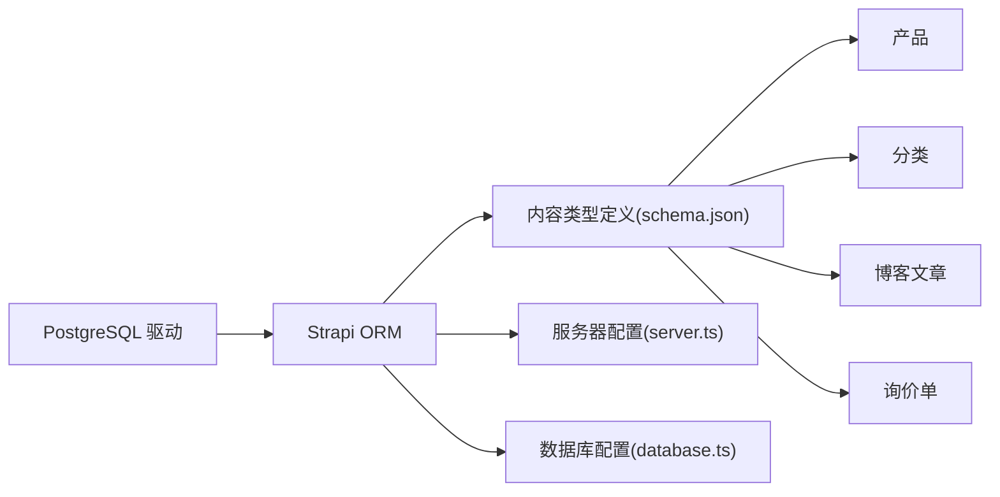

# 数据库关系与约束

<cite>
**本文引用的文件**
- [cms/src/api/product/content-types/product/schema.json](file://cms/src/api/product/content-types/product/schema.json)
- [cms/src/api/category/content-types/category/schema.json](file://cms/src/api/category/content-types/category/schema.json)
- [cms/src/api/blog-post/content-types/blog-post/schema.json](file://cms/src/api/blog-post/content-types/blog-post/schema.json)
- [cms/src/api/inquiry/content-types/inquiry/schema.json](file://cms/src/api/inquiry/content-types/inquiry/schema.json)
- [cms/config/database.ts](file://cms/config/database.ts)
- [cms/config/server.ts](file://cms/config/server.ts)
- [cms/scripts/seed-data.js](file://cms/scripts/seed-data.js)
- [cms/scripts/reseed-data.js](file://cms/scripts/reseed-data.js)
- [cms/scripts/copy-schemas.js](file://cms/scripts/copy-schemas.js)
- [cms/package.json](file://cms/package.json)
</cite>

## 目录
1. [简介](#简介)
2. [项目结构](#项目结构)
3. [核心组件](#核心组件)
4. [架构总览](#架构总览)
5. [详细组件分析](#详细组件分析)
6. [依赖分析](#依赖分析)
7. [性能考量](#性能考量)
8. [故障排查指南](#故障排查指南)
9. [结论](#结论)
10. [附录](#附录)

## 简介
本文件聚焦于数据库关系与约束，系统性梳理 Strapi 后端在本项目中定义的数据模型及其关系映射，明确主键、外键与唯一性约束，解释索引策略与性能优化思路，并给出 ER 图与数据流图。同时覆盖数据库迁移策略、版本兼容性管理以及数据完整性检查与业务规则实现。

## 项目结构
后端采用 Strapi v5，默认使用 PostgreSQL 作为数据库。内容类型（Content Types）通过 schema.json 定义字段、验证与关系；数据库连接在配置文件中声明；脚本用于初始化与重置数据。

图表来源
- [cms/config/database.ts:1-15](file://cms/config/database.ts#L1-L15)
- [cms/config/server.ts:1-11](file://cms/config/server.ts#L1-L11)
- [cms/src/api/category/content-types/category/schema.json:1-21](file://cms/src/api/category/content-types/category/schema.json#L1-L21)
- [cms/src/api/product/content-types/product/schema.json:1-33](file://cms/src/api/product/content-types/product/schema.json#L1-L33)
- [cms/src/api/blog-post/content-types/blog-post/schema.json:1-24](file://cms/src/api/blog-post/content-types/blog-post/schema.json#L1-L24)
- [cms/src/api/inquiry/content-types/inquiry/schema.json:1-25](file://cms/src/api/inquiry/content-types/inquiry/schema.json#L1-L25)
- [cms/scripts/seed-data.js:1-398](file://cms/scripts/seed-data.js#L1-L398)
- [cms/scripts/reseed-data.js:1-461](file://cms/scripts/reseed-data.js#L1-L461)
- [cms/scripts/copy-schemas.js:1-47](file://cms/scripts/copy-schemas.js#L1-L47)

章节来源
- [cms/config/database.ts:1-15](file://cms/config/database.ts#L1-L15)
- [cms/config/server.ts:1-11](file://cms/config/server.ts#L1-L11)
- [cms/scripts/copy-schemas.js:1-47](file://cms/scripts/copy-schemas.js#L1-L47)

## 核心组件
本项目的核心数据模型包括：分类（Category）、产品（Product）、博客文章（Blog Post）、询价单（Inquiry）。其中产品与分类之间存在多对一关系，产品还与媒体文件（图片、数据表 PDF）建立关联；博客文章与媒体文件建立关联；询价单为独立实体。

- 分类（Category）
  - 字段要点：名称、slug、描述、封面图、SEO 标题与描述
  - 唯一性：名称唯一
- 产品（Product）
  - 字段要点：名称、slug、SKU、短描述、富文本详情、电气参数、尺寸重量、连接器、电芯类型、是否推荐、图片、数据表、SEO 标题与描述
  - 关系：多对一 → 分类
  - 唯一性：SKU 唯一
- 博客文章（Blog Post）
  - 字段要点：标题、slug、摘要、富文本内容、封面图、作者名、标签、SEO 标题与描述
- 询价单（Inquiry）
  - 字段要点：姓名、邮箱、公司、国家、数量、消息、产品名称/SKU、来源、状态（枚举）

章节来源
- [cms/src/api/category/content-types/category/schema.json:1-21](file://cms/src/api/category/content-types/category/schema.json#L1-L21)
- [cms/src/api/product/content-types/product/schema.json:1-33](file://cms/src/api/product/content-types/product/schema.json#L1-L33)
- [cms/src/api/blog-post/content-types/blog-post/schema.json:1-24](file://cms/src/api/blog-post/content-types/blog-post/schema.json#L1-L24)
- [cms/src/api/inquiry/content-types/inquiry/schema.json:1-25](file://cms/src/api/inquiry/content-types/inquiry/schema.json#L1-L25)

## 架构总览
下图展示数据库层面的内容类型关系与媒体文件关联。产品与分类之间为多对一关系；产品与媒体（图片、文件）为一对多/一对一；博客文章与媒体为一对一；询价单为独立无外键关系。

图表来源
- [cms/src/api/product/content-types/product/schema.json:26-28](file://cms/src/api/product/content-types/product/schema.json#L26-L28)
- [cms/src/api/category/content-types/category/schema.json:16-16](file://cms/src/api/category/content-types/category/schema.json#L16-L16)
- [cms/src/api/blog-post/content-types/blog-post/schema.json:17-17](file://cms/src/api/blog-post/content-types/blog-post/schema.json#L17-L17)
- [cms/src/api/inquiry/content-types/inquiry/schema.json:1-25](file://cms/src/api/inquiry/content-types/inquiry/schema.json#L1-L25)

## 详细组件分析

### 产品与分类的关系映射
- 外键关系：产品表包含一个指向分类表的外键字段，表示“多对一”关系
- 关系方向：多个产品属于一个分类
- 业务含义：便于按分类检索产品、构建导航与搜索过滤

图表来源
- [cms/scripts/seed-data.js:341-362](file://cms/scripts/seed-data.js#L341-L362)
- [cms/scripts/reseed-data.js:376-397](file://cms/scripts/reseed-data.js#L376-L397)
- [cms/src/api/product/content-types/product/schema.json:28-28](file://cms/src/api/product/content-types/product/schema.json#L28-L28)

章节来源
- [cms/src/api/product/content-types/product/schema.json:28-28](file://cms/src/api/product/content-types/product/schema.json#L28-L28)
- [cms/scripts/seed-data.js:341-362](file://cms/scripts/seed-data.js#L341-L362)
- [cms/scripts/reseed-data.js:376-397](file://cms/scripts/reseed-data.js#L376-L397)

### 媒体文件的关联关系
- 产品
  - 图片：多张图片（媒体类型为 images）
  - 数据表：单个文件（媒体类型为 files）
- 博客文章
  - 封面图：单张图片
- 询价单
  - 无直接媒体字段

图表来源
- [cms/src/api/product/content-types/product/schema.json:26-27](file://cms/src/api/product/content-types/product/schema.json#L26-L27)
- [cms/src/api/blog-post/content-types/blog-post/schema.json:17-17](file://cms/src/api/blog-post/content-types/blog-post/schema.json#L17-L17)

章节来源
- [cms/src/api/product/content-types/product/schema.json:26-27](file://cms/src/api/product/content-types/product/schema.json#L26-L27)
- [cms/src/api/blog-post/content-types/blog-post/schema.json:17-17](file://cms/src/api/blog-post/content-types/blog-post/schema.json#L17-L17)

### 主键、外键与唯一性约束
- 主键
  - Strapi 默认使用全局唯一标识符（GUID/CUID）作为记录主键，对应内容类型内部的文档标识
- 外键
  - 产品 → 分类：通过关系字段维护外键语义（由 Strapi ORM 在应用层保证）
- 唯一性
  - 分类：名称唯一
  - 产品：SKU 唯一
  - Slug：基于 UID 字段生成，要求唯一且依赖目标字段

图表来源
- [cms/src/api/category/content-types/category/schema.json:12-18](file://cms/src/api/category/content-types/category/schema.json#L12-L18)
- [cms/src/api/product/content-types/product/schema.json:12-30](file://cms/src/api/product/content-types/product/schema.json#L12-L30)

章节来源
- [cms/src/api/category/content-types/category/schema.json:12-18](file://cms/src/api/category/content-types/category/schema.json#L12-L18)
- [cms/src/api/product/content-types/product/schema.json:12-30](file://cms/src/api/product/content-types/product/schema.json#L12-L30)

### 索引策略与性能优化
- 唯一索引
  - 分类名称、产品 SKU、内容类型 slug（UID）应具备唯一索引以保障查询与去重效率
- 查询热点
  - 产品列表页按分类筛选、按推荐标志筛选、按 SKU/名称模糊匹配等场景建议建立复合索引或 GIN/BTree 索引
- 媒体访问
  - 媒体文件通常通过 CDN 或对象存储访问，数据库仅存元信息与路径；建议对媒体关联字段进行必要索引以加速 JOIN
- 分页与排序
  - 使用基于时间戳或自增序号的分页策略，避免深度分页导致的性能问题
- 缓存
  - 对热门分类与产品详情启用缓存，降低数据库压力

[本节为通用性能指导，不直接分析具体文件，故不附“章节来源”]

### 数据完整性检查与业务规则
- 必填字段
  - 产品：名称、slug、SKU、短描述、电压、容量、放电倍率
  - 分类：名称、slug
  - 博客文章：标题、slug、摘要、内容
  - 询价单：姓名、邮箱、消息
- 枚举与默认值
  - 产品电芯类型默认值、询价单状态默认值
- 关系一致性
  - 创建产品时必须确保分类存在且有效；脚本通过 slug 映射到分类 ID，保证关系正确性
- 发布控制
  - 内容类型开启“草稿/发布”，通过时间戳字段控制可见性

章节来源
- [cms/src/api/product/content-types/product/schema.json:12-30](file://cms/src/api/product/content-types/product/schema.json#L12-L30)
- [cms/src/api/category/content-types/category/schema.json:12-18](file://cms/src/api/category/content-types/category/schema.json#L12-L18)
- [cms/src/api/blog-post/content-types/blog-post/schema.json:12-21](file://cms/src/api/blog-post/content-types/blog-post/schema.json#L12-L21)
- [cms/src/api/inquiry/content-types/inquiry/schema.json:12-22](file://cms/src/api/inquiry/content-types/inquiry/schema.json#L12-L22)
- [cms/scripts/seed-data.js:341-362](file://cms/scripts/seed-data.js#L341-L362)
- [cms/scripts/reseed-data.js:376-397](file://cms/scripts/reseed-data.js#L376-L397)

### 数据库迁移策略与版本兼容性
- 迁移方式
  - 使用 Strapi 的内容类型定义变更驱动数据库结构同步；通过 schema.json 的字段增删改实现迁移
- 版本兼容
  - 保持字段命名与类型稳定；新增字段建议设置默认值，避免破坏现有记录
- 构建与部署
  - 构建阶段复制 schema.json 到 dist，确保生产环境加载到最新定义
- 开发与测试
  - 开发模式下可使用内存数据库或本地 Postgres；生产使用云数据库，确保连接参数安全

章节来源
- [cms/scripts/copy-schemas.js:1-47](file://cms/scripts/copy-schemas.js#L1-L47)
- [cms/package.json:6-12](file://cms/package.json#L6-L12)
- [cms/config/database.ts:1-15](file://cms/config/database.ts#L1-L15)

## 依赖分析
- 数据库驱动
  - PostgreSQL 驱动依赖于项目依赖声明
- 服务器配置
  - 主机、端口、密钥与 Webhook 设置影响应用运行与内容同步
- 内容类型依赖
  - 产品依赖分类；媒体字段依赖上传插件与存储服务

图表来源
- [cms/package.json:14-24](file://cms/package.json#L14-L24)
- [cms/config/server.ts:1-11](file://cms/config/server.ts#L1-L11)
- [cms/config/database.ts:1-15](file://cms/config/database.ts#L1-L15)
- [cms/src/api/product/content-types/product/schema.json:1-33](file://cms/src/api/product/content-types/product/schema.json#L1-L33)
- [cms/src/api/category/content-types/category/schema.json:1-21](file://cms/src/api/category/content-types/category/schema.json#L1-L21)
- [cms/src/api/blog-post/content-types/blog-post/schema.json:1-24](file://cms/src/api/blog-post/content-types/blog-post/schema.json#L1-L24)
- [cms/src/api/inquiry/content-types/inquiry/schema.json:1-25](file://cms/src/api/inquiry/content-types/inquiry/schema.json#L1-L25)

章节来源
- [cms/package.json:14-24](file://cms/package.json#L14-L24)
- [cms/config/server.ts:1-11](file://cms/config/server.ts#L1-L11)
- [cms/config/database.ts:1-15](file://cms/config/database.ts#L1-L15)

## 性能考量
- 索引设计
  - 对唯一字段（SKU、分类名称、UID）建立唯一索引
  - 对常用过滤字段（分类外键、推荐标志、创建时间）建立复合索引
- 查询优化
  - 避免 N+1 查询；优先使用预加载或一次性批量查询
  - 对大字段（富文本）采用延迟加载或分页
- 存储与网络
  - 媒体文件走对象存储，数据库仅存元数据；合理设置 CDN 缓存头
- 并发与事务
  - 对高并发写入场景使用批量提交与重试机制

[本节为通用性能指导，不直接分析具体文件，故不附“章节来源”]

## 故障排查指南
- 数据重复
  - 检查唯一性字段（SKU、分类名称、UID）是否冲突；确认迁移脚本执行顺序
- 关系缺失
  - 确认产品创建时传入的分类 ID/Slug 是否正确；查看脚本映射逻辑
- 媒体无法访问
  - 检查上传插件与存储配置；确认媒体库权限与路径
- 构建失败
  - 确认 schema.json 已复制到 dist；检查构建脚本与依赖版本

章节来源
- [cms/scripts/seed-data.js:321-362](file://cms/scripts/seed-data.js#L321-L362)
- [cms/scripts/reseed-data.js:346-407](file://cms/scripts/reseed-data.js#L346-L407)
- [cms/scripts/copy-schemas.js:12-42](file://cms/scripts/copy-schemas.js#L12-L42)
- [cms/package.json:6-12](file://cms/package.json#L6-L12)

## 结论
本项目通过内容类型定义清晰表达了产品与分类的多对一关系及媒体文件的关联策略；唯一性约束与必填字段保障了数据完整性；结合合理的索引与查询策略可满足常见业务场景的性能需求。迁移与版本兼容可通过内容类型定义与构建流程统一管理。

## 附录
- 数据模型字段清单与约束
  - 分类：名称（唯一）、slug（唯一）、描述、封面图、SEO 标题、SEO 描述
  - 产品：名称、slug（唯一）、SKU（唯一）、短描述、富文本详情、电气参数、尺寸重量、连接器、电芯类型、是否推荐、图片（多）、数据表（单）、SEO 标题、SEO 描述、分类（外键）
  - 博客文章：标题、slug（唯一）、摘要、富文本内容、封面图、作者名、标签、SEO 标题、SEO 描述
  - 询价单：姓名、邮箱、公司、国家、数量、消息、产品名称、产品 SKU、来源、状态（枚举）

[本节为汇总说明，不直接分析具体文件，故不附“章节来源”]