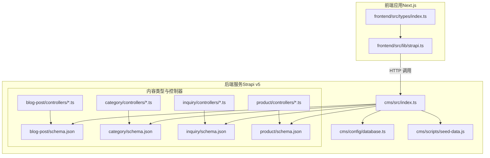
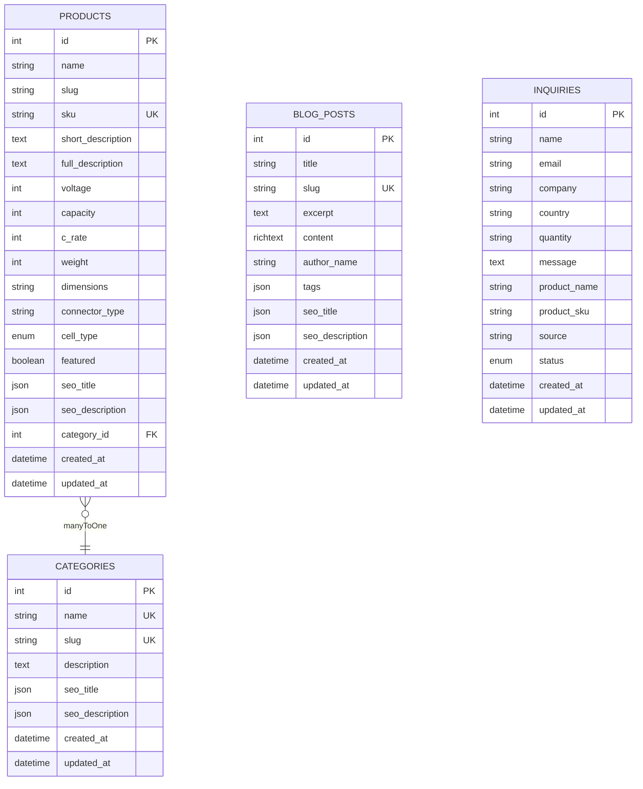
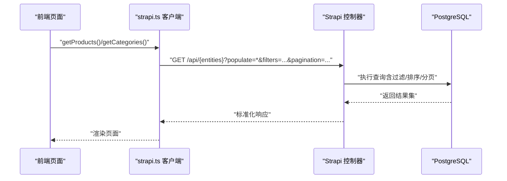
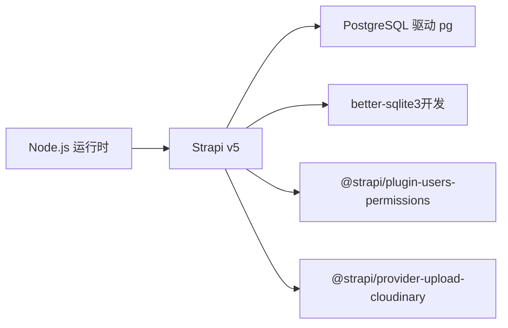

# 数据模型

<cite>
**本文引用的文件**
- [cms/config/database.ts](file://cms/config/database.ts)
- [cms/src/api/blog-post/content-types/blog-post/schema.json](file://cms/src/api/blog-post/content-types/blog-post/schema.json)
- [cms/src/api/category/content-types/category/schema.json](file://cms/src/api/category/content-types/category/schema.json)
- [cms/src/api/inquiry/content-types/inquiry/schema.json](file://cms/src/api/inquiry/content-types/inquiry/schema.json)
- [cms/src/api/product/content-types/product/schema.json](file://cms/src/api/product/content-types/product/schema.json)
- [cms/src/api/blog-post/controllers/blog-post.ts](file://cms/src/api/blog-post/controllers/blog-post.ts)
- [cms/src/api/category/controllers/category.ts](file://cms/src/api/category/controllers/category.ts)
- [cms/src/api/inquiry/controllers/inquiry.ts](file://cms/src/api/inquiry/controllers/inquiry.ts)
- [cms/src/api/product/controllers/product.ts](file://cms/src/api/product/controllers/product.ts)
- [cms/src/index.ts](file://cms/src/index.ts)
- [cms/scripts/seed-data.js](file://cms/scripts/seed-data.js)
- [frontend/src/lib/strapi.ts](file://frontend/src/lib/strapi.ts)
- [frontend/src/types/index.ts](file://frontend/src/types/index.ts)
- [cms/package.json](file://cms/package.json)
</cite>

## 目录
1. [简介](#简介)
2. [项目结构](#项目结构)
3. [核心组件](#核心组件)
4. [架构总览](#架构总览)
5. [详细组件分析](#详细组件分析)
6. [依赖分析](#依赖分析)
7. [性能考虑](#性能考虑)
8. [故障排查指南](#故障排查指南)
9. [结论](#结论)
10. [附录](#附录)

## 简介
本文件系统性梳理 Battivus 项目的“数据模型”，覆盖实体与关系、字段定义与数据类型、主键/外键与约束、索引与约束、数据验证与业务规则、数据库架构图、示例数据、数据访问模式与缓存策略、性能考量、数据生命周期与归档、迁移与版本管理、安全与隐私、访问控制以及扩展与最佳实践建议。目标是帮助开发者与运维人员快速理解并高效维护该数据模型。

## 项目结构
Battivus 采用前后端分离架构：前端 Next.js 应用通过 HTTP 客户端调用后端 Strapi CMS 的 REST API；CMS 使用 PostgreSQL 作为持久化存储，并在启动时自动配置公共 API 权限与种子数据。

图表来源
- [frontend/src/lib/strapi.ts:1-412](file://frontend/src/lib/strapi.ts#L1-L412)
- [frontend/src/types/index.ts:1-157](file://frontend/src/types/index.ts#L1-L157)
- [cms/src/index.ts:1-315](file://cms/src/index.ts#L1-L315)
- [cms/config/database.ts:1-15](file://cms/config/database.ts#L1-L15)
- [cms/scripts/seed-data.js:1-398](file://cms/scripts/seed-data.js#L1-L398)
- [cms/src/api/blog-post/content-types/blog-post/schema.json:1-24](file://cms/src/api/blog-post/content-types/blog-post/schema.json#L1-L24)
- [cms/src/api/category/content-types/category/schema.json:1-21](file://cms/src/api/category/content-types/category/schema.json#L1-L21)
- [cms/src/api/inquiry/content-types/inquiry/schema.json:1-25](file://cms/src/api/inquiry/content-types/inquiry/schema.json#L1-L25)
- [cms/src/api/product/content-types/product/schema.json:1-33](file://cms/src/api/product/content-types/product/schema.json#L1-L33)
- [cms/src/api/blog-post/controllers/blog-post.ts:1-53](file://cms/src/api/blog-post/controllers/blog-post.ts#L1-L53)
- [cms/src/api/category/controllers/category.ts:1-40](file://cms/src/api/category/controllers/category.ts#L1-L40)
- [cms/src/api/inquiry/controllers/inquiry.ts:1-40](file://cms/src/api/inquiry/controllers/inquiry.ts#L1-L40)
- [cms/src/api/product/controllers/product.ts:1-40](file://cms/src/api/product/controllers/product.ts#L1-L40)

章节来源
- [cms/config/database.ts:1-15](file://cms/config/database.ts#L1-L15)
- [cms/src/index.ts:161-217](file://cms/src/index.ts#L161-L217)
- [frontend/src/lib/strapi.ts:1-412](file://frontend/src/lib/strapi.ts#L1-L412)

## 核心组件
本项目的核心数据实体包括：分类（Category）、产品（Product）、博客文章（Blog Post）、询价单（Inquiry）。这些实体由 Strapi 内容类型定义，配合控制器与前端客户端共同实现数据的增删改查、关系查询与过滤。

- 分类（Category）
  - 用途：对产品进行分组与展示，支持 SEO 字段。
  - 关键字段：名称、唯一 slug、描述、图片、SEO 标题与描述。
  - 约束：名称唯一、slug 唯一。
- 产品（Product）
  - 用途：描述电池规格、参数与关联分类。
  - 关键字段：名称、唯一 slug、SKU、短/长描述、电压/容量/C 速率、重量、尺寸、连接器、电芯类型、是否推荐、媒体资源、分类关系、SEO。
  - 约束：SKU 唯一、多处必填。
- 博客文章（Blog Post）
  - 用途：发布技术文章、新闻与知识内容。
  - 关键字段：标题、UID slug、摘要、富文本内容、封面图、作者名、标签、SEO。
  - 约束：标题、摘要、内容必填；slug 唯一。
- 询价单（Inquiry）
  - 用途：收集客户询盘信息，支持状态流转。
  - 关键字段：姓名、邮箱、公司、国家、数量、消息、产品名称/SKU、来源、状态枚举。
  - 约束：姓名、邮箱、消息必填；状态默认值与枚举受限。

章节来源
- [cms/src/api/category/content-types/category/schema.json:1-21](file://cms/src/api/category/content-types/category/schema.json#L1-L21)
- [cms/src/api/product/content-types/product/schema.json:1-33](file://cms/src/api/product/content-types/product/schema.json#L1-L33)
- [cms/src/api/blog-post/content-types/blog-post/schema.json:1-24](file://cms/src/api/blog-post/content-types/blog-post/schema.json#L1-L24)
- [cms/src/api/inquiry/content-types/inquiry/schema.json:1-25](file://cms/src/api/inquiry/content-types/inquiry/schema.json#L1-L25)

## 架构总览
下图展示数据库层、CMS 层与前端层之间的交互关系，以及内容类型与控制器的映射。

图表来源
- [cms/src/api/category/content-types/category/schema.json:1-21](file://cms/src/api/category/content-types/category/schema.json#L1-L21)
- [cms/src/api/product/content-types/product/schema.json:1-33](file://cms/src/api/product/content-types/product/schema.json#L1-L33)
- [cms/src/api/blog-post/content-types/blog-post/schema.json:1-24](file://cms/src/api/blog-post/content-types/blog-post/schema.json#L1-L24)
- [cms/src/api/inquiry/content-types/inquiry/schema.json:1-25](file://cms/src/api/inquiry/content-types/inquiry/schema.json#L1-L25)

## 详细组件分析

### 分类（Category）数据模型
- 表名与集合：collectionName 对应数据库表名。
- 主键：自增整型 id。
- 唯一约束：name、slug。
- 典型字段与类型：字符串（名称/描述/SEO）、媒体（图片）、时间戳。
- 业务规则：slug 由名称派生；SEO 字段用于搜索引擎优化。
- 验证规则：名称必填且唯一；slug 必填且唯一；可选图片与 SEO。

章节来源
- [cms/src/api/category/content-types/category/schema.json:1-21](file://cms/src/api/category/content-types/category/schema.json#L1-L21)

### 产品（Product）数据模型
- 表名与集合：collectionName 对应数据库表名。
- 主键：自增整型 id。
- 唯一约束：sku。
- 外键：category_id 指向分类表。
- 典型字段与类型：字符串（名称/描述/SKU/连接器）、整数（电压/容量/C 速率/重量）、枚举（cell_type）、布尔（featured）、媒体（图片/数据表）、JSON（SEO）。
- 业务规则：产品必须属于一个分类；SKU 唯一；cell_type 默认值与枚举受控。
- 验证规则：多字段必填；SKU 唯一；容量/电压/C 速率等数值字段需满足产品参数范围。

章节来源
- [cms/src/api/product/content-types/product/schema.json:1-33](file://cms/src/api/product/content-types/product/schema.json#L1-L33)

### 博客文章（Blog Post）数据模型
- 表名与集合：collectionName 对应数据库表名。
- 主键：自增整型 id。
- 唯一约束：slug。
- 典型字段与类型：字符串（标题/作者名/SEO）、文本（摘要/内容）、媒体（封面图）、JSON（标签）、时间戳。
- 业务规则：支持草稿与发布；slug 由标题派生；SEO 字段用于 SEO 优化。
- 验证规则：标题、摘要、内容必填；slug 唯一。

章节来源
- [cms/src/api/blog-post/content-types/blog-post/schema.json:1-24](file://cms/src/api/blog-post/content-types/blog-post/schema.json#L1-L24)

### 询价单（Inquiry）数据模型
- 表名与集合：collectionName 对应数据库表名。
- 主键：自增整型 id。
- 典型字段与类型：字符串（姓名/邮箱/公司/国家/数量/产品名称/SKU/来源）、文本（消息）、枚举（status）。
- 业务规则：状态枚举限定；默认状态为“new”；仅允许公开提交。
- 验证规则：姓名、邮箱、消息必填；邮箱格式校验。

章节来源
- [cms/src/api/inquiry/content-types/inquiry/schema.json:1-25](file://cms/src/api/inquiry/content-types/inquiry/schema.json#L1-L25)

### 控制器与数据访问模式
- 控制器统一提供 find/findOne/create/update/delete 接口。
- 文章控制器支持按 ID 或 slug 查询；其他控制器按 ID 查询。
- 前端通过 strapi.ts 封装的 fetchAPI/fetchSingleAPI 统一访问后端 API，支持 populate、filters、sort、pagination 参数。

图表来源
- [frontend/src/lib/strapi.ts:170-225](file://frontend/src/lib/strapi.ts#L170-L225)
- [cms/src/api/category/controllers/category.ts:1-40](file://cms/src/api/category/controllers/category.ts#L1-L40)
- [cms/src/api/product/controllers/product.ts:1-40](file://cms/src/api/product/controllers/product.ts#L1-L40)
- [cms/src/api/blog-post/controllers/blog-post.ts:1-53](file://cms/src/api/blog-post/controllers/blog-post.ts#L1-L53)
- [cms/src/api/inquiry/controllers/inquiry.ts:1-40](file://cms/src/api/inquiry/controllers/inquiry.ts#L1-L40)

章节来源
- [cms/src/api/category/controllers/category.ts:1-40](file://cms/src/api/category/controllers/category.ts#L1-L40)
- [cms/src/api/product/controllers/product.ts:1-40](file://cms/src/api/product/controllers/product.ts#L1-L40)
- [cms/src/api/blog-post/controllers/blog-post.ts:1-53](file://cms/src/api/blog-post/controllers/blog-post.ts#L1-L53)
- [cms/src/api/inquiry/controllers/inquiry.ts:1-40](file://cms/src/api/inquiry/controllers/inquiry.ts#L1-L40)
- [frontend/src/lib/strapi.ts:170-225](file://frontend/src/lib/strapi.ts#L170-L225)

### 示例数据与种子脚本
- 种子脚本提供电池分类与产品的示例数据，涵盖不同应用场景（如 FPV、农业无人机、工业巡检等）。
- 前端侧也有对应的种子数据，用于匹配导航与产品分类。
- 种子脚本会根据 slug 建立产品与分类的关系，并处理媒体资源与 SEO 字段。

章节来源
- [cms/scripts/seed-data.js:1-398](file://cms/scripts/seed-data.js#L1-L398)
- [cms/src/index.ts:1-315](file://cms/src/index.ts#L1-L315)
- [frontend/src/lib/strapi.ts:170-225](file://frontend/src/lib/strapi.ts#L170-L225)

## 依赖分析
- 数据库驱动：PostgreSQL（pg），开发环境可使用 better-sqlite3。
- 用户权限插件：users-permissions，用于配置公共角色与 API 权限。
- 上传提供商：cloudinary（用于媒体资源上传）。
- 版本与引擎：Strapi v5，Node >=18 且 <=22。

图表来源
- [cms/package.json:14-24](file://cms/package.json#L14-L24)

章节来源
- [cms/package.json:1-36](file://cms/package.json#L1-L36)
- [cms/config/database.ts:1-15](file://cms/config/database.ts#L1-L15)

## 性能考虑
- 缓存策略
  - 前端 Next.js 使用 fetch 的 next.revalidate 设置为 60 秒，平衡新鲜度与性能。
  - 建议在 CDN 层开启静态缓存与压缩，结合 Strapi Cloud 可获得更佳性能。
- 查询优化
  - 合理使用 populate 与 filters，避免过度加载。
  - 对高频查询（如首页推荐、分类筛选）可考虑在前端做本地缓存或分页缓存。
- 数据库层面
  - 为常用过滤字段（如 slug、SKU、category_id）建立索引以提升查询效率。
  - 对富文本与大字段使用懒加载或分页展示，减少网络传输。
- 并发与事务
  - 批量导入时建议使用事务或分批写入，避免长时间锁表。

章节来源
- [frontend/src/lib/strapi.ts:109-118](file://frontend/src/lib/strapi.ts#L109-L118)
- [cms/src/index.ts:219-315](file://cms/src/index.ts#L219-L315)

## 故障排查指南
- API 权限问题
  - 若前端无法访问某些接口，检查 bootstrap 中对公共角色的权限配置是否生效。
- 关系缺失或孤儿数据
  - 若产品存在但无分类，bootstrap 会检测并触发重播种流程。
- 数据库连接
  - 确认 DATABASE_HOST/DATABASE_PORT/DATABASE_NAME/DATABASE_USERNAME/DATABASE_PASSWORD/DATABASE_SSL 环境变量正确。
- 媒体资源
  - 确认 Cloudinary 提供商已正确配置，媒体上传与访问正常。

章节来源
- [cms/src/index.ts:161-217](file://cms/src/index.ts#L161-L217)
- [cms/src/index.ts:219-315](file://cms/src/index.ts#L219-L315)
- [cms/config/database.ts:1-15](file://cms/config/database.ts#L1-L15)

## 结论
Battivus 的数据模型围绕“分类-产品-文章-询价单”展开，结构清晰、约束明确，配合 Strapi 的内容类型与控制器实现了灵活的内容管理与高效的前端访问。通过合理的索引、缓存与权限设计，可在保证数据一致性的同时兼顾性能与可维护性。

## 附录

### 数据验证与业务规则清单
- 分类
  - 名称必填且唯一；slug 唯一；可选 SEO 字段。
- 产品
  - 名称/短描述/电压/容量/C 速率为必填；SKU 唯一；cell_type 枚举受控；featured 为布尔；category_id 外键。
- 博客文章
  - 标题/摘要/内容必填；slug 唯一；支持草稿与发布。
- 询价单
  - 姓名/邮箱/消息必填；邮箱格式；状态枚举默认 new。

章节来源
- [cms/src/api/category/content-types/category/schema.json:1-21](file://cms/src/api/category/content-types/category/schema.json#L1-L21)
- [cms/src/api/product/content-types/product/schema.json:1-33](file://cms/src/api/product/content-types/product/schema.json#L1-L33)
- [cms/src/api/blog-post/content-types/blog-post/schema.json:1-24](file://cms/src/api/blog-post/content-types/blog-post/schema.json#L1-L24)
- [cms/src/api/inquiry/content-types/inquiry/schema.json:1-25](file://cms/src/api/inquiry/content-types/inquiry/schema.json#L1-L25)

### 数据生命周期、保留与归档
- 生命周期
  - 产品与分类：随业务需求更新，遵循草稿/发布流程。
  - 博客文章：定期更新，支持历史归档。
  - 询价单：按业务流程流转（new → contacted → quoted → closed）。
- 保留策略
  - 建议对历史询价单设置保留期限（例如 12 个月），到期后清理或迁移至归档库。
- 归档规则
  - 对不再展示但需审计的历史数据进行离线归档，保留关键字段与元数据。

[本节为通用指导，无需特定文件来源]

### 数据迁移路径与版本管理
- 版本升级
  - 使用 Strapi 的内置迁移工具与备份策略，升级前先导出数据。
- 字段变更
  - 新增字段建议默认值与非空约束谨慎评估；必要时分阶段上线。
- 关系变更
  - 多对多/一对多关系变更需同步更新控制器与前端消费逻辑。
- 自动化
  - 在 CI/CD 中加入迁移脚本与数据校验步骤，确保生产环境一致性。

[本节为通用指导，无需特定文件来源]

### 数据安全、隐私与访问控制
- 访问控制
  - 公共角色仅开放部分读取与提交权限；后台管理使用管理员账户。
- 数据隐私
  - 询价单包含个人敏感信息，需遵守隐私政策与最小化原则。
- 传输安全
  - 生产环境启用 SSL；API 令牌与密钥通过环境变量管理。

章节来源
- [cms/src/index.ts:161-217](file://cms/src/index.ts#L161-L217)
- [cms/config/database.ts:1-15](file://cms/config/database.ts#L1-L15)

### 扩展指南与最佳实践
- 扩展实体
  - 新增实体时，优先定义内容类型与控制器，再在前端补充类型与调用。
- 字段命名
  - 遵循一致的命名规范（snake_case 存储，前端适配）。
- 关系建模
  - 明确主从关系与级联行为；对外键字段建立索引。
- 性能优化
  - 合理分页与懒加载；缓存热点数据；CDN 加速媒体资源。
- 可观测性
  - 记录关键操作日志与错误追踪，便于定位问题。

[本节为通用指导，无需特定文件来源]