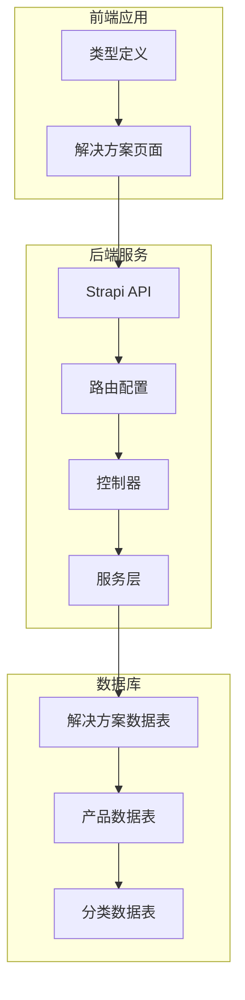
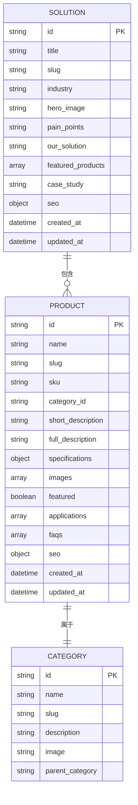
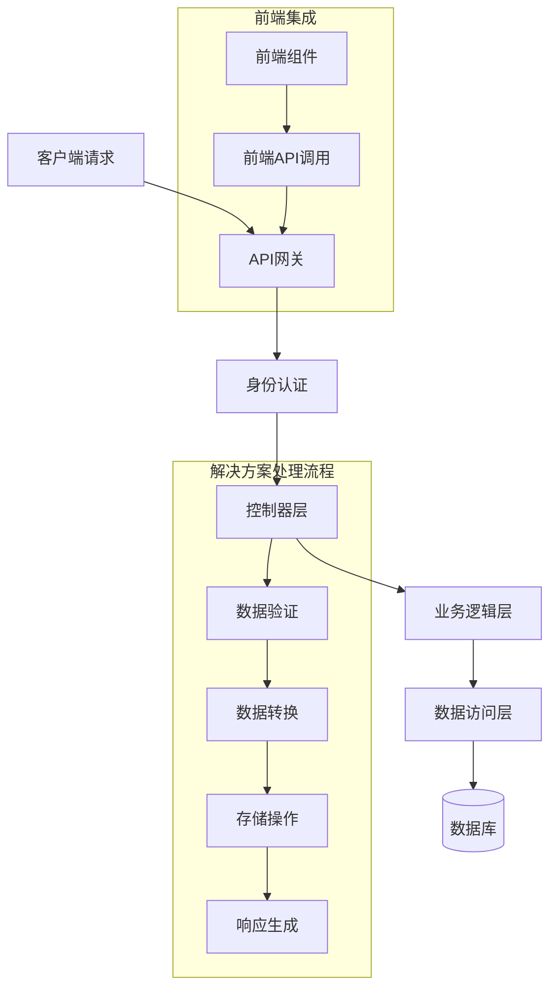
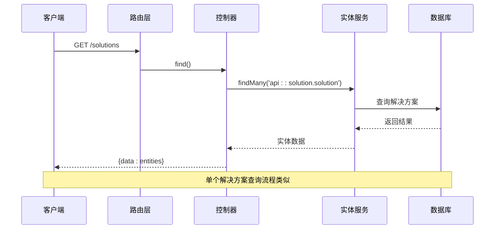
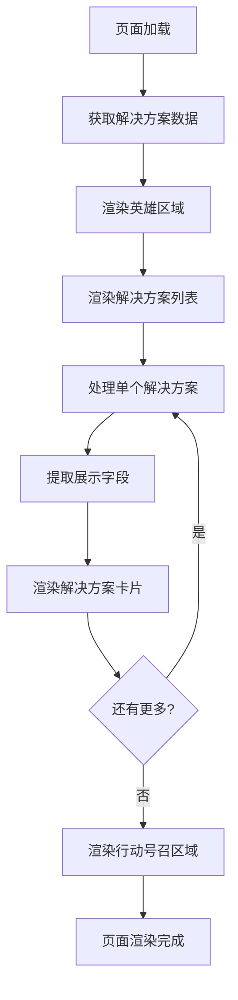
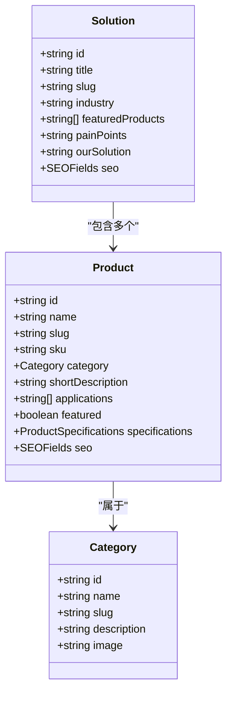
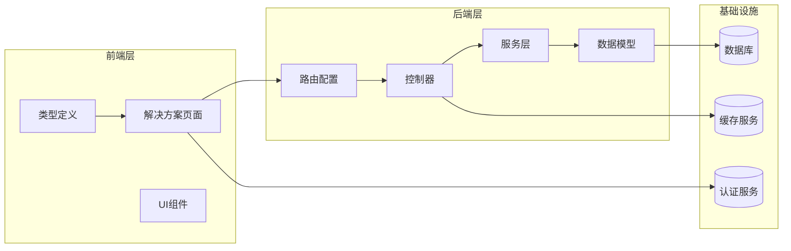

# 解决方案数据模型

<cite>
**本文档引用的文件**
- [cms/src/api/solution/controllers/solution.ts](file://cms/src/api/solution/controllers/solution.ts)
- [cms/src/api/solution/routes/solution.ts](file://cms/src/api/solution/routes/solution.ts)
- [cms/src/api/solution/services/solution.ts](file://cms/src/api/solution/services/solution.ts)
- [cms/src/index.ts](file://cms/src/index.ts)
- [frontend/src/app/solutions/page.tsx](file://frontend/src/app/solutions/page.tsx)
- [frontend/src/types/index.ts](file://frontend/src/types/index.ts)
</cite>

## 目录
1. [简介](#简介)
2. [项目结构](#项目结构)
3. [核心组件](#核心组件)
4. [架构概览](#架构概览)
5. [详细组件分析](#详细组件分析)
6. [依赖关系分析](#依赖关系分析)
7. [性能考虑](#性能考虑)
8. [故障排除指南](#故障排除指南)
9. [结论](#结论)
10. [附录](#附录)

## 简介

本文件为解决方案数据模型的详细技术文档，涵盖了解决方案的内容结构、数据模型设计、与产品的关联关系以及完整的编辑和发布管理流程。解决方案在本系统中用于展示针对特定工业应用的电池解决方案，包括标题、描述、应用场景、技术规格等核心信息，并通过产品组合形成完整的产品解决方案体系。

## 项目结构

解决方案功能在前后端分离的架构中实现，采用Strapi作为CMS后端，Next.js作为前端展示框架。整体结构如下：

**图表来源**
- [cms/src/api/solution/controllers/solution.ts:1-40](file://cms/src/api/solution/controllers/solution.ts#L1-L40)
- [cms/src/api/solution/routes/solution.ts:1-35](file://cms/src/api/solution/routes/solution.ts#L1-L35)
- [frontend/src/app/solutions/page.tsx:1-274](file://frontend/src/app/solutions/page.tsx#L1-L274)

**章节来源**
- [cms/src/api/solution/controllers/solution.ts:1-40](file://cms/src/api/solution/controllers/solution.ts#L1-L40)
- [cms/src/api/solution/routes/solution.ts:1-35](file://cms/src/api/solution/routes/solution.ts#L1-L35)
- [frontend/src/app/solutions/page.tsx:1-274](file://frontend/src/app/solutions/page.tsx#L1-L274)

## 核心组件

### 数据模型定义

解决方案数据模型采用标准化的结构设计，支持多语言和SEO优化需求：

**图表来源**
- [frontend/src/types/index.ts:81-93](file://frontend/src/types/index.ts#L81-L93)
- [frontend/src/types/index.ts:23-43](file://frontend/src/types/index.ts#L23-L43)
- [frontend/src/types/index.ts:45-52](file://frontend/src/types/index.ts#L45-L52)

### 展示字段配置

解决方案页面的核心展示字段包括：

| 字段类别 | 字段名称 | 类型 | 描述 |
|---------|----------|------|------|
| 基础信息 | title | string | 解决方案标题 |
| 基础信息 | slug | string | URL友好标识符 |
| 基础信息 | description | string | 解决方案描述 |
| 基础信息 | icon | ReactNode | 图标组件 |
| 核心内容 | painPoints | string[] | 行业痛点列表 |
| 核心内容 | solutions | string[] | 解决方案要点 |
| 技术规格 | specs | string[] | 技术参数规格 |

**章节来源**
- [frontend/src/types/index.ts:81-93](file://frontend/src/types/index.ts#L81-L93)
- [frontend/src/app/solutions/page.tsx:10-96](file://frontend/src/app/solutions/page.tsx#L10-L96)

## 架构概览

解决方案系统的整体架构采用分层设计，确保数据的一致性和可维护性：

**图表来源**
- [cms/src/api/solution/controllers/solution.ts:3-39](file://cms/src/api/solution/controllers/solution.ts#L3-L39)
- [cms/src/api/solution/routes/solution.ts:1-35](file://cms/src/api/solution/routes/solution.ts#L1-L35)

## 详细组件分析

### 后端API组件

#### 控制器层实现

解决方案控制器提供了完整的CRUD操作接口，基于Strapi的entityService进行数据管理：

**图表来源**
- [cms/src/api/solution/controllers/solution.ts:4-17](file://cms/src/api/solution/controllers/solution.ts#L4-L17)
- [cms/src/api/solution/routes/solution.ts:2-14](file://cms/src/api/solution/routes/solution.ts#L2-L14)

#### 路由配置

解决方案API路由采用RESTful设计，支持标准的HTTP方法：

| HTTP方法 | 路径 | 功能 | 权限要求 |
|---------|------|------|----------|
| GET | /solutions | 获取所有解决方案 | 公共访问 |
| GET | /solutions/:id | 获取单个解决方案 | 公共访问 |
| POST | /solutions | 创建新解决方案 | 管理员 |
| PUT | /solutions/:id | 更新解决方案 | 管理员 |
| DELETE | /solutions/:id | 删除解决方案 | 管理员 |

**章节来源**
- [cms/src/api/solution/controllers/solution.ts:1-40](file://cms/src/api/solution/controllers/solution.ts#L1-L40)
- [cms/src/api/solution/routes/solution.ts:1-35](file://cms/src/api/solution/routes/solution.ts#L1-L35)

### 前端组件实现

#### 解决方案页面组件

前端解决方案页面采用静态数据驱动的方式，展示了四个主要的工业应用解决方案：

**图表来源**
- [frontend/src/app/solutions/page.tsx:98-202](file://frontend/src/app/solutions/page.tsx#L98-L202)

#### 数据结构映射

前端类型定义确保了数据结构的一致性和类型安全：

| 接口名称 | 字段数量 | 主要用途 |
|---------|----------|----------|
| Solution | 9个字段 | 解决方案核心数据 |
| Product | 43个字段 | 产品详细信息 |
| Category | 5个字段 | 产品分类信息 |
| SEOFields | 3个字段 | SEO元数据 |

**章节来源**
- [frontend/src/types/index.ts:81-93](file://frontend/src/types/index.ts#L81-L93)
- [frontend/src/types/index.ts:23-43](file://frontend/src/types/index.ts#L23-L43)

### 数据关系与组合

#### 解决方案与产品的关系

解决方案通过`featuredProducts`字段与产品建立关联关系，形成完整的解决方案组合：

**图表来源**
- [frontend/src/types/index.ts:81-93](file://frontend/src/types/index.ts#L81-L93)
- [frontend/src/types/index.ts:23-43](file://frontend/src/types/index.ts#L23-L43)
- [frontend/src/types/index.ts:45-52](file://frontend/src/types/index.ts#L45-L52)

**章节来源**
- [frontend/src/types/index.ts:81-93](file://frontend/src/types/index.ts#L81-L93)
- [frontend/src/types/index.ts:23-43](file://frontend/src/types/index.ts#L23-L43)

## 依赖关系分析

### 组件耦合度分析

解决方案系统展现了良好的模块化设计，各组件间依赖关系清晰：

**图表来源**
- [cms/src/api/solution/controllers/solution.ts:1-40](file://cms/src/api/solution/controllers/solution.ts#L1-L40)
- [cms/src/api/solution/routes/solution.ts:1-35](file://cms/src/api/solution/routes/solution.ts#L1-L35)
- [frontend/src/app/solutions/page.tsx:1-274](file://frontend/src/app/solutions/page.tsx#L1-L274)

### 外部依赖

系统对外部依赖的管理遵循最小化原则：

| 依赖类型 | 名称 | 版本 | 用途 |
|---------|------|------|------|
| 框架 | Strapi | v5.x | 内容管理系统 |
| 框架 | Next.js | v14.x | 前端应用框架 |
| 工具 | TypeScript | v5.x | 类型安全 |
| 工具 | Tailwind CSS | v3.x | 样式框架 |

**章节来源**
- [cms/src/index.ts:161-216](file://cms/src/index.ts#L161-L216)

## 性能考虑

### 数据加载优化

解决方案系统的性能优化策略包括：

1. **懒加载机制**：前端组件按需加载，减少初始渲染时间
2. **缓存策略**：利用浏览器缓存和CDN加速静态资源
3. **数据压缩**：API响应采用JSON格式，传输效率高
4. **图片优化**：使用现代图片格式和响应式设计

### 扩展性设计

系统具备良好的扩展能力：

- 支持动态添加新的解决方案类型
- 可配置的SEO字段以适应不同市场
- 灵活的产品组合机制
- 可扩展的认证和权限系统

## 故障排除指南

### 常见问题诊断

#### API访问问题

当遇到API访问异常时，建议检查：

1. **权限配置**：确认公共角色已启用相应API权限
2. **路由映射**：验证路由配置是否正确
3. **数据库连接**：检查数据库连接状态
4. **服务可用性**：确认Strapi服务正常运行

#### 数据显示异常

前端数据显示问题的排查步骤：

1. **网络请求检查**：使用浏览器开发者工具查看API响应
2. **数据格式验证**：确认返回数据符合类型定义
3. **组件渲染调试**：检查React组件的props传递
4. **样式冲突检测**：排除CSS样式覆盖问题

**章节来源**
- [cms/src/index.ts:161-216](file://cms/src/index.ts#L161-L216)

## 结论

解决方案数据模型通过标准化的数据结构设计和清晰的组件分离，成功实现了工业应用解决方案的数字化管理。该模型不仅满足了当前的功能需求，还为未来的扩展和定制提供了坚实的基础。

系统的主要优势包括：
- 完整的CRUD操作支持
- 清晰的数据关系设计
- 响应式的前端展示
- 可扩展的架构设计
- 完善的SEO优化支持

## 附录

### 配置选项参考

#### 解决方案配置参数

| 参数名称 | 类型 | 必填 | 默认值 | 描述 |
|---------|------|------|--------|------|
| title | string | 是 | - | 解决方案标题 |
| slug | string | 是 | - | URL友好标识符 |
| industry | string | 否 | - | 所属行业类别 |
| heroImage | string | 否 | - | 英雄图片URL |
| painPoints | string | 是 | - | 行业痛点描述 |
| ourSolution | string | 是 | - | 解决方案说明 |
| featuredProducts | string[] | 否 | [] | 推荐产品ID数组 |
| caseStudy | string | 否 | - | 案例研究链接 |
| seo.metaTitle | string | 否 | - | SEO标题 |
| seo.metaDescription | string | 否 | - | SEO描述 |

#### 编辑流程规范

1. **内容准备**：收集行业痛点、解决方案要点和技术规格
2. **数据录入**：通过CMS后台录入解决方案基本信息
3. **产品关联**：选择相关的推荐产品进行绑定
4. **SEO优化**：完善SEO元数据和关键词
5. **预览测试**：在预览环境中验证显示效果
6. **发布审核**：经过审核后正式上线
7. **监控维护**：定期更新内容和性能监控

**章节来源**
- [frontend/src/types/index.ts:81-93](file://frontend/src/types/index.ts#L81-L93)
- [cms/src/api/solution/controllers/solution.ts:19-32](file://cms/src/api/solution/controllers/solution.ts#L19-L32)