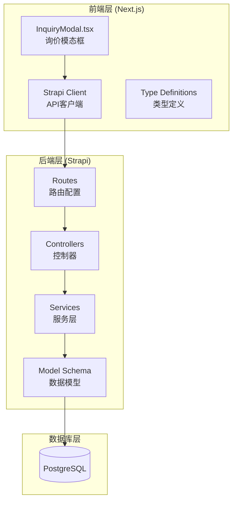
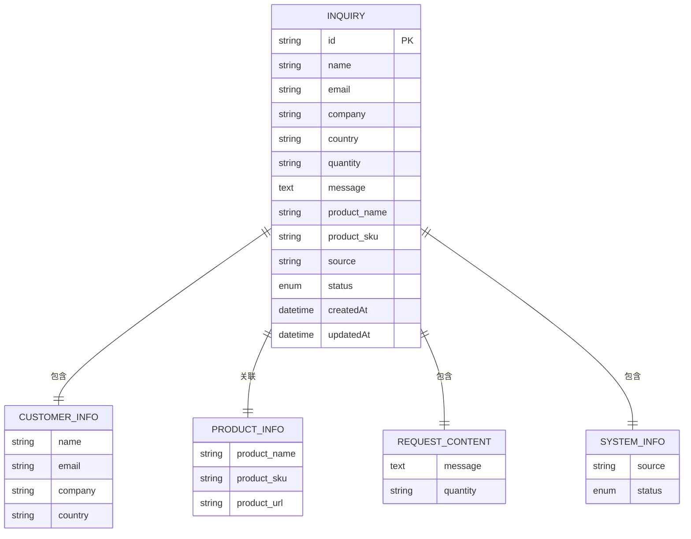
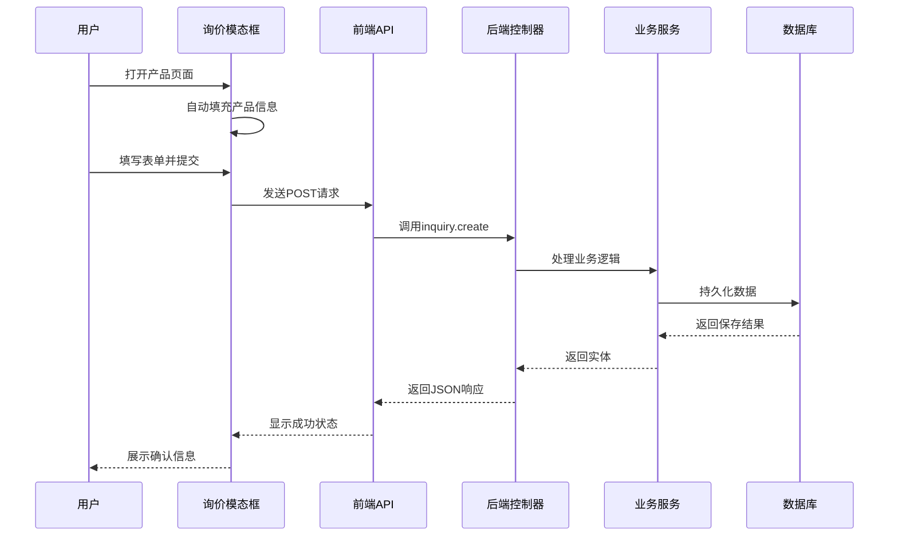
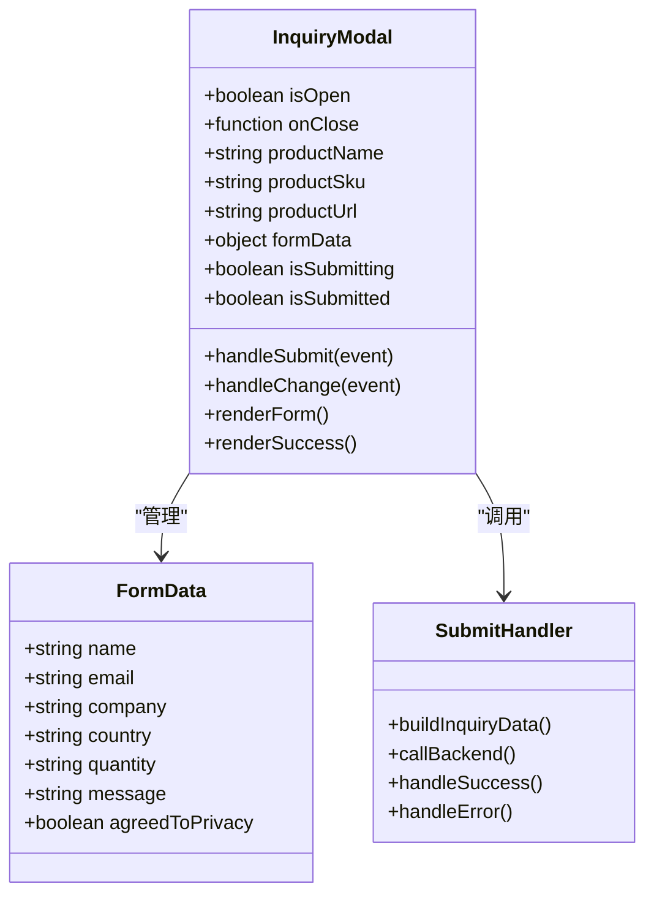
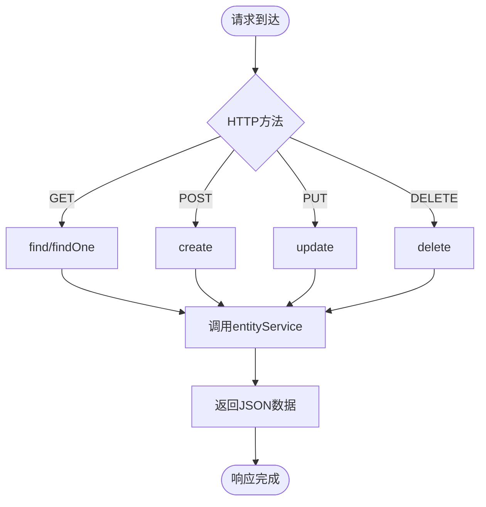
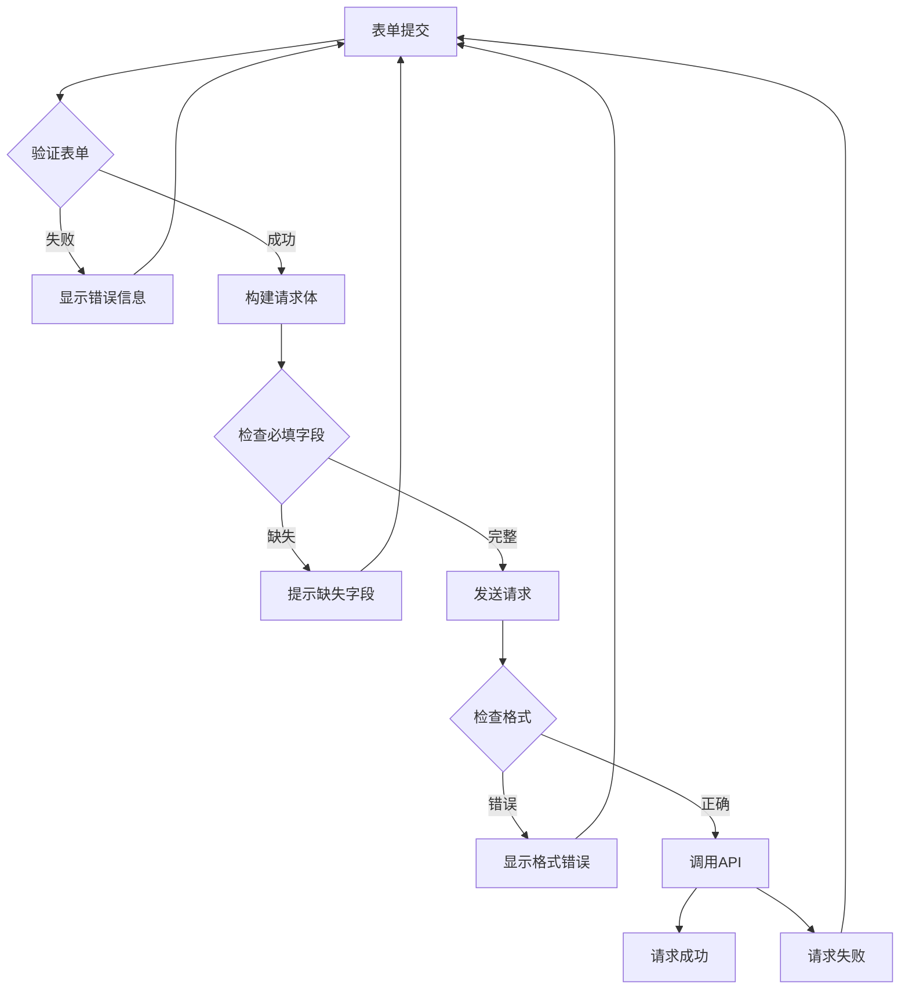
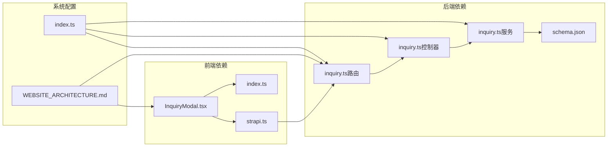
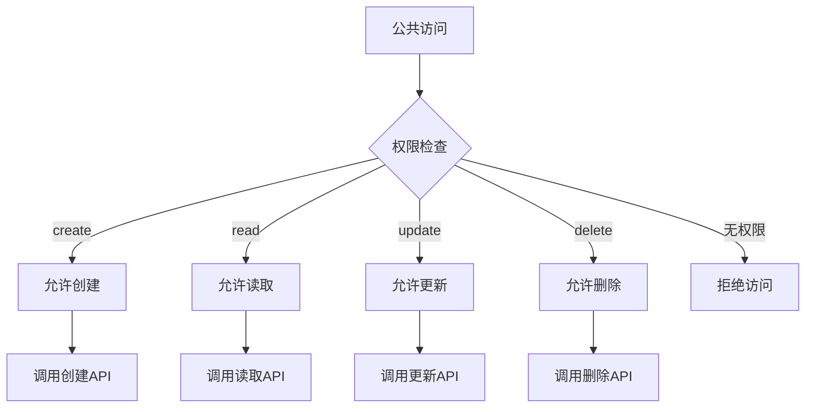

# 询价请求数据模型

<cite>
**本文档引用的文件**
- [schema.json](file://cms/src/api/inquiry/content-types/inquiry/schema.json)
- [inquiry.ts](file://cms/src/api/inquiry/controllers/inquiry.ts)
- [inquiry.ts](file://cms/src/api/inquiry/services/inquiry.ts)
- [inquiry.ts](file://cms/src/api/inquiry/routes/inquiry.ts)
- [index.ts](file://cms/src/index.ts)
- [InquiryModal.tsx](file://frontend/src/components/forms/InquiryModal.tsx)
- [strapi.ts](file://frontend/src/lib/strapi.ts)
- [index.ts](file://frontend/src/types/index.ts)
- [WEBSITE_ARCHITECTURE.md](file://WEBSITE_ARCHITECTURE.md)
</cite>

## 目录
1. [简介](#简介)
2. [项目结构](#项目结构)
3. [核心组件](#核心组件)
4. [架构概览](#架构概览)
5. [详细组件分析](#详细组件分析)
6. [依赖关系分析](#依赖关系分析)
7. [性能考虑](#性能考虑)
8. [故障排除指南](#故障排除指南)
9. [结论](#结论)

## 简介

本文档详细描述了Battivus无人机电池B2B网站中的询价请求数据模型。该系统采用Next.js + Strapi的技术架构，实现了完整的询价流程管理，包括前端表单收集、后端数据存储、状态管理和业务逻辑处理。

询价系统支持两种使用场景：
- **通用询价**：访客通过联系页面提交一般性咨询
- **产品上下文询价**：用户在产品详情页直接针对特定产品发起询价

系统设计注重用户体验和数据完整性，提供了自动填充的产品信息、状态跟踪和响应机制。

## 项目结构

询价系统由前后端两部分组成，采用分层架构设计：

**图表来源**
- [InquiryModal.tsx:1-370](file://frontend/src/components/forms/InquiryModal.tsx#L1-L370)
- [strapi.ts:290-306](file://frontend/src/lib/strapi.ts#L290-L306)
- [inquiry.ts:1-35](file://cms/src/api/inquiry/routes/inquiry.ts#L1-L35)

**章节来源**
- [WEBSITE_ARCHITECTURE.md:50-95](file://WEBSITE_ARCHITECTURE.md#L50-L95)

## 核心组件

### 数据模型定义

询价请求数据模型基于Strapi的内容类型系统，定义了完整的字段结构和约束条件：

**图表来源**
- [schema.json:12-23](file://cms/src/api/inquiry/content-types/inquiry/schema.json#L12-L23)

### 字段详细说明

#### 客户基本信息
- **name** (`string`, 必填): 客户姓名，用于个性化沟通
- **email** (`email`, 必填): 联系邮箱，验证格式正确性
- **company** (`string`, 可选): 公司名称，便于企业级询价
- **country** (`string`, 可选): 国家信息，支持国际业务

#### 产品需求详情
- **product_name** (`string`, 可选): 产品名称，自动从产品页面传递
- **product_sku** (`string`, 可选): 产品SKU编号，唯一标识产品
- **quantity** (`string`, 可选): 预估数量，提供量级选择

#### 请求内容
- **message** (`text`, 必填): 详细需求描述，支持长文本输入
- **source** (`string`, 可选): 来源页面URL，追踪询价渠道

#### 状态管理
- **status** (`enumeration`, 默认值: "new"): 询价状态，支持状态流转

**章节来源**
- [schema.json:13-22](file://cms/src/api/inquiry/content-types/inquiry/schema.json#L13-L22)

## 架构概览

询价系统采用RESTful API架构，实现了完整的CRUD操作和状态管理：

**图表来源**
- [InquiryModal.tsx:46-95](file://frontend/src/components/forms/InquiryModal.tsx#L46-L95)
- [strapi.ts:290-306](file://frontend/src/lib/strapi.ts#L290-L306)
- [inquiry.ts:19-24](file://cms/src/api/inquiry/controllers/inquiry.ts#L19-L24)

## 详细组件分析

### 前端组件实现

#### 询价模态框 (InquiryModal)
前端采用React组件实现，提供完整的用户交互体验：

**图表来源**
- [InquiryModal.tsx:15-105](file://frontend/src/components/forms/InquiryModal.tsx#L15-L105)

#### 表单字段验证
前端实现了完整的表单验证机制：

| 字段 | 类型 | 必填 | 验证规则 | 描述 |
|------|------|------|----------|------|
| name | string | 是 | 非空检查 | 客户姓名，必填字段 |
| email | email | 是 | 格式验证 | 联系邮箱，必须有效 |
| company | string | 否 | 可选字段 | 公司名称，可为空 |
| country | string | 否 | 可选字段 | 国家信息，可为空 |
| quantity | select | 否 | 选项选择 | 数量范围选择 |
| message | textarea | 是 | 非空检查 | 详细需求描述 |
| agreedToPrivacy | checkbox | 是 | 必须勾选 | 隐私政策同意 |

**章节来源**
- [InquiryModal.tsx:176-318](file://frontend/src/components/forms/InquiryModal.tsx#L176-L318)

### 后端API实现

#### 控制器层 (Controllers)
后端控制器提供标准的RESTful接口：

**图表来源**
- [inquiry.ts:4-38](file://cms/src/api/inquiry/controllers/inquiry.ts#L4-L38)

#### 路由配置
系统提供完整的CRUD路由映射：

| 方法 | 路径 | 功能 | 权限 |
|------|------|------|------|
| GET | /api/inquiries | 获取所有询价请求 | 公共访问 |
| GET | /api/inquiries/:id | 获取特定询价请求 | 公共访问 |
| POST | /api/inquiries | 创建新询价请求 | 公共访问 |
| PUT | /api/inquiries/:id | 更新询价请求 | 公共访问 |
| DELETE | /api/inquiries/:id | 删除询价请求 | 公共访问 |

**章节来源**
- [inquiry.ts:1-35](file://cms/src/api/inquiry/routes/inquiry.ts#L1-L35)

### 数据完整性保证

#### 前端数据验证
前端实现了多层次的数据验证：

#### 后端数据验证
后端通过Strapi的Schema验证确保数据完整性：

- **必填字段验证**: name、email、message字段强制验证
- **格式验证**: email字段使用内置的email格式验证
- **枚举验证**: status字段限制在预定义集合内
- **长度限制**: 字符串字段遵循合理的长度限制

**章节来源**
- [schema.json:13-22](file://cms/src/api/inquiry/content-types/inquiry/schema.json#L13-L22)

## 依赖关系分析

### 组件间依赖

**图表来源**
- [InquiryModal.tsx:1-10](file://frontend/src/components/forms/InquiryModal.tsx#L1-L10)
- [strapi.ts:290-306](file://frontend/src/lib/strapi.ts#L290-L306)
- [inquiry.ts:1-35](file://cms/src/api/inquiry/routes/inquiry.ts#L1-L35)

### 权限控制

系统通过Strapi的权限管理系统实现安全访问控制：

**图表来源**
- [index.ts:186-208](file://cms/src/index.ts#L186-L208)

**章节来源**
- [index.ts:161-217](file://cms/src/index.ts#L161-L217)

## 性能考虑

### 前端性能优化

1. **懒加载**: 询价模态框仅在需要时渲染
2. **防抖处理**: 表单输入采用防抖机制减少不必要的验证
3. **缓存策略**: API响应使用适当的缓存头
4. **资源优化**: 图片和静态资源使用CDN加速

### 后端性能优化

1. **数据库索引**: 关键查询字段建立适当索引
2. **分页处理**: 列表查询支持分页避免大量数据传输
3. **连接池**: 使用连接池管理数据库连接
4. **缓存层**: 适当使用Redis缓存热点数据

## 故障排除指南

### 常见问题及解决方案

#### 表单提交失败
**症状**: 提交按钮禁用但无响应
**可能原因**:
- 网络连接问题
- API端点不可达
- 前端JavaScript错误

**解决步骤**:
1. 检查浏览器开发者工具的网络面板
2. 验证API端点URL配置
3. 查看控制台错误日志

#### 数据验证错误
**症状**: 表单显示验证错误但无法提交
**可能原因**:
- 必填字段未填写
- 邮箱格式不正确
- 隐私政策未同意

**解决步骤**:
1. 检查每个字段的验证规则
2. 确认必填字段均已填写
3. 验证邮箱格式是否符合要求

#### 状态同步问题
**症状**: 页面状态与实际数据不一致
**可能原因**:
- 异步操作未正确处理
- 状态更新时机不当

**解决步骤**:
1. 检查异步操作的Promise链
2. 确保状态更新在正确的生命周期中执行
3. 添加适当的错误处理机制

**章节来源**
- [InquiryModal.tsx:85-95](file://frontend/src/components/forms/InquiryModal.tsx#L85-L95)

## 结论

Battivus询价请求数据模型实现了完整的B2B业务流程，具有以下特点：

### 技术优势
- **模块化设计**: 前后端分离，职责清晰
- **类型安全**: TypeScript提供编译时类型检查
- **状态管理**: 完整的生命周期管理
- **扩展性**: 支持未来功能扩展

### 业务价值
- **用户体验**: 简洁直观的表单设计
- **数据质量**: 多层次验证确保数据完整性
- **业务流程**: 支持完整的询价到报价流程
- **可维护性**: 清晰的代码结构便于维护

### 改进建议
1. **状态机实现**: 可以考虑引入更复杂的状态机管理
2. **自动化处理**: 集成邮件通知和自动回复功能
3. **数据分析**: 添加询价转化率统计和分析功能
4. **多语言支持**: 为国际化业务做好准备

该数据模型为B2B无人机电池销售业务提供了坚实的技术基础，能够有效支撑企业的营销和销售活动。