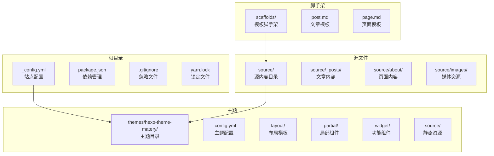
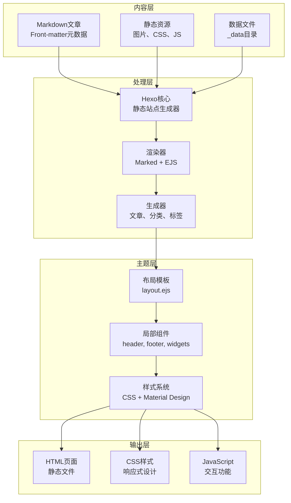
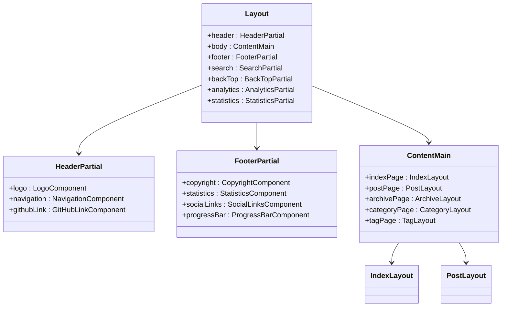
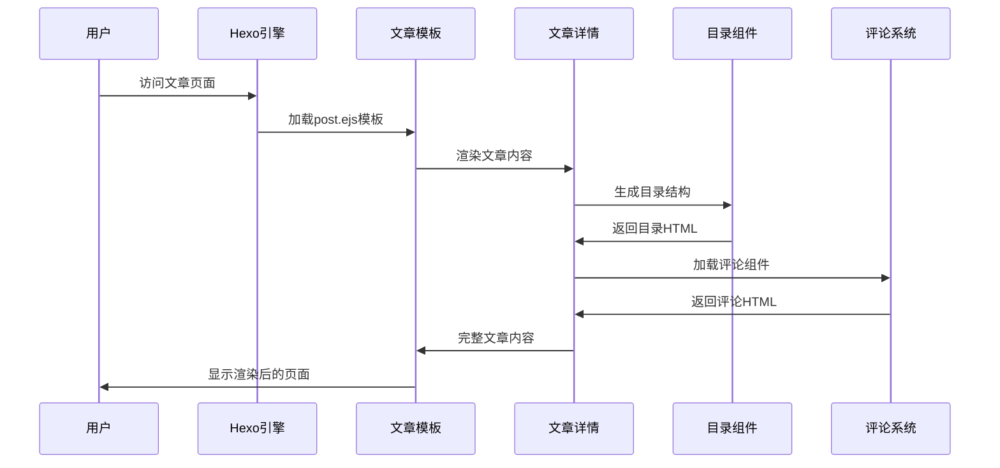
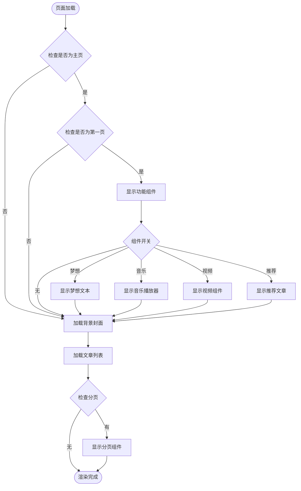
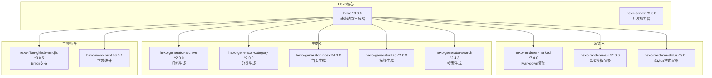

# Hexo博客系统

<cite>
**本文档引用的文件**
- [_config.yml](file://_config.yml)
- [package.json](file://package.json)
- [themes/hexo-theme-matery/_config.yml](file://themes/hexo-theme-matery/_config.yml)
- [themes/hexo-theme-matery/README_CN.md](file://themes/hexo-theme-matery/README_CN.md)
- [themes/hexo-theme-matery/layout/layout.ejs](file://themes/hexo-theme-matery/layout/layout.ejs)
- [themes/hexo-theme-matery/layout/index.ejs](file://themes/hexo-theme-matery/layout/index.ejs)
- [themes/hexo-theme-matery/layout/post.ejs](file://themes/hexo-theme-matery/layout/post.ejs)
- [themes/hexo-theme-matery/layout/_partial/header.ejs](file://themes/hexo-theme-matery/layout/_partial/header.ejs)
- [themes/hexo-theme-matery/layout/_partial/footer.ejs](file://themes/hexo-theme-matery/layout/_partial/footer.ejs)
- [themes/hexo-theme-matery/layout/_partial/post-detail.ejs](file://themes/hexo-theme-matery/layout/_partial/post-detail.ejs)
- [themes/hexo-theme-matery/layout/_partial/post-detail-toc.ejs](file://themes/hexo-theme-matery/layout/_partial/post-detail-toc.ejs)
- [themes/hexo-theme-matery/layout/_widget/recommend.ejs](file://themes/hexo-theme-matery/layout/_widget/recommend.ejs)
- [source/_posts/AI基础概念.md](file://source/_posts/AI基础概念.md)
- [scaffolds/post.md](file://scaffolds/post.md)
- [scaffolds/page.md](file://scaffolds/page.md)
</cite>

## 目录
1. [简介](#简介)
2. [项目结构](#项目结构)
3. [核心组件](#核心组件)
4. [架构概览](#架构概览)
5. [详细组件分析](#详细组件分析)
6. [依赖分析](#依赖分析)
7. [性能考虑](#性能考虑)
8. [故障排除指南](#故障排除指南)
9. [结论](#结论)

## 简介

这是一个基于Hexo框架构建的静态博客系统，采用Material Design设计风格的主题。该博客系统具有现代化的界面设计，支持多种功能特性，包括文章置顶、打赏功能、数学公式渲染、TOC目录、评论系统集成等。

系统采用前后端分离的架构模式，前端使用EJS模板引擎进行页面渲染，后端通过Hexo静态站点生成器处理Markdown内容。博客内容存储在Markdown文件中，通过主题模板进行样式渲染和功能扩展。

## 项目结构

**图表来源**
- [_config.yml:1-112](file://_config.yml#L1-L112)
- [package.json:1-30](file://package.json#L1-L30)

**章节来源**
- [_config.yml:1-112](file://_config.yml#L1-L112)
- [package.json:1-30](file://package.json#L1-L30)

## 核心组件

### 配置管理系统

系统采用分层配置架构，包含站点配置和主题配置两个层面：

- **站点配置**：位于根目录的_config.yml，管理站点基本信息、URL设置、目录结构、写作配置等
- **主题配置**：位于themes/hexo-theme-matery/_config.yml，管理主题外观、功能开关、第三方集成等

### 内容管理系统

采用Markdown作为内容标记语言，支持：
- 文章Front-matter元数据
- 分类和标签系统
- 附件资源管理
- 自动摘要生成

### 主题渲染引擎

基于EJS模板引擎的动态渲染系统：
- 布局模板统一页面结构
- 局部组件实现功能模块化
- 组件化设计支持功能扩展

**章节来源**
- [_config.yml:1-112](file://_config.yml#L1-L112)
- [themes/hexo-theme-matery/_config.yml:1-634](file://themes/hexo-theme-matery/_config.yml#L1-L634)

## 架构概览

**图表来源**
- [themes/hexo-theme-matery/layout/layout.ejs:1-114](file://themes/hexo-theme-matery/layout/layout.ejs#L1-L114)
- [themes/hexo-theme-matery/layout/index.ejs:1-132](file://themes/hexo-theme-matery/layout/index.ejs#L1-L132)

## 详细组件分析

### 布局系统架构

**图表来源**
- [themes/hexo-theme-matery/layout/layout.ejs:1-114](file://themes/hexo-theme-matery/layout/layout.ejs#L1-L114)
- [themes/hexo-theme-matery/layout/_partial/header.ejs:1-21](file://themes/hexo-theme-matery/layout/_partial/header.ejs#L1-L21)
- [themes/hexo-theme-matery/layout/_partial/footer.ejs:1-96](file://themes/hexo-theme-matery/layout/_partial/footer.ejs#L1-L96)

### 文章渲染流程

**图表来源**
- [themes/hexo-theme-matery/layout/post.ejs:1-41](file://themes/hexo-theme-matery/layout/post.ejs#L1-L41)
- [themes/hexo-theme-matery/layout/_partial/post-detail.ejs:1-252](file://themes/hexo-theme-matery/layout/_partial/post-detail.ejs#L1-L252)
- [themes/hexo-theme-matery/layout/_partial/post-detail-toc.ejs:1-189](file://themes/hexo-theme-matery/layout/_partial/post-detail-toc.ejs#L1-L189)

### 主页展示逻辑

**图表来源**
- [themes/hexo-theme-matery/layout/index.ejs:1-132](file://themes/hexo-theme-matery/layout/index.ejs#L1-L132)
- [themes/hexo-theme-matery/layout/_widget/recommend.ejs:1-132](file://themes/hexo-theme-matery/layout/_widget/recommend.ejs#L1-L132)

**章节来源**
- [themes/hexo-theme-matery/layout/layout.ejs:1-114](file://themes/hexo-theme-matery/layout/layout.ejs#L1-L114)
- [themes/hexo-theme-matery/layout/index.ejs:1-132](file://themes/hexo-theme-matery/layout/index.ejs#L1-L132)
- [themes/hexo-theme-matery/layout/post.ejs:1-41](file://themes/hexo-theme-matery/layout/post.ejs#L1-L41)

### 评论系统集成

系统支持多种第三方评论服务，采用条件加载机制：

- **Gitalk**: 基于GitHub Issues的评论系统
- **Gitment**: 基于GitHub OAuth的评论系统  
- **Valine**: 基于LeanCloud的评论系统
- **Disqus**: 国外主流评论服务
- **Minivaline**: Valine的轻量化版本

每种评论系统都有独立的配置项和加载逻辑，确保在不同环境下都能正常工作。

**章节来源**
- [themes/hexo-theme-matery/_config.yml:283-374](file://themes/hexo-theme-matery/_config.yml#L283-L374)
- [themes/hexo-theme-matery/layout/_partial/post-detail.ejs:165-193](file://themes/hexo-theme-matery/layout/_partial/post-detail.ejs#L165-L193)

## 依赖分析

### 核心依赖关系

**图表来源**
- [package.json:14-28](file://package.json#L14-L28)

### 主题功能依赖

系统功能模块的依赖关系：

- **代码高亮**: PrismJS (配置在主配置文件中)
- **统计分析**: 不蒜子统计、Google Analytics、百度统计
- **多媒体**: APlayer、DPlayer音频视频播放器
- **交互效果**: AOS动画、Materialize CSS框架
- **搜索功能**: hexo-generator-search插件

**章节来源**
- [package.json:14-28](file://package.json#L14-L28)
- [themes/hexo-theme-matery/_config.yml:419-462](file://themes/hexo-theme-matery/_config.yml#L419-L462)

## 性能考虑

### 静态资源优化

系统采用多种策略优化加载性能：

- **CDN加速**: 支持jsDelivr CDN配置，提升资源加载速度
- **懒加载**: 图片和组件采用延迟加载机制
- **缓存策略**: 利用浏览器缓存和CDN缓存
- **资源压缩**: 自动压缩CSS和JavaScript文件

### 渲染性能优化

- **分页机制**: 通过per_page配置控制页面加载数量
- **条件渲染**: 功能组件按需加载，避免不必要的DOM元素
- **响应式设计**: 适配不同设备的显示需求
- **异步加载**: 第三方组件采用异步加载方式

## 故障排除指南

### 常见问题诊断

**文章无法显示**
1. 检查Front-matter格式是否正确
2. 验证文章路径和文件名
3. 确认分类和标签配置

**主题样式异常**
1. 检查CDN配置是否正确
2. 验证CSS文件加载状态
3. 清除浏览器缓存

**评论系统不工作**
1. 检查第三方服务配置
2. 验证HTTPS环境要求
3. 查看浏览器控制台错误

**搜索功能失效**
1. 确认hexo-generator-search插件安装
2. 检查search配置项
3. 重新生成站点

**章节来源**
- [themes/hexo-theme-matery/README_CN.md:306-405](file://themes/hexo-theme-matery/README_CN.md#L306-L405)

## 结论

该Hexo博客系统采用现代化的架构设计，具有以下特点：

**优势特性**
- 模块化设计，功能组件可独立配置
- Material Design风格，视觉体验优秀
- 响应式布局，支持多设备访问
- 丰富的第三方集成功能
- 良好的扩展性和维护性

**适用场景**
- 个人技术博客
- 专业内容展示
- 学术论文发布
- 作品集展示

系统通过合理的架构设计和丰富的功能配置，为用户提供了完整的静态博客解决方案。其模块化的组件设计使得功能扩展变得简单直观，适合不同技术水平的用户使用和维护。