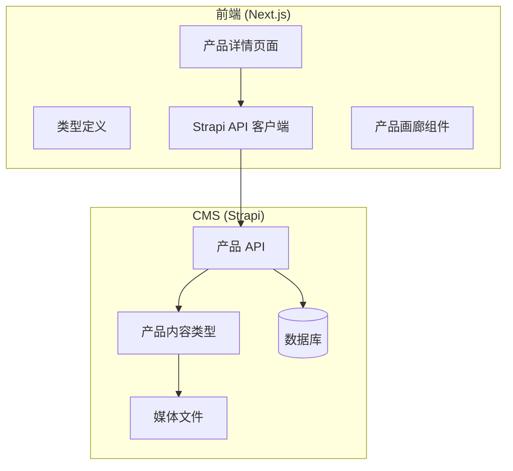
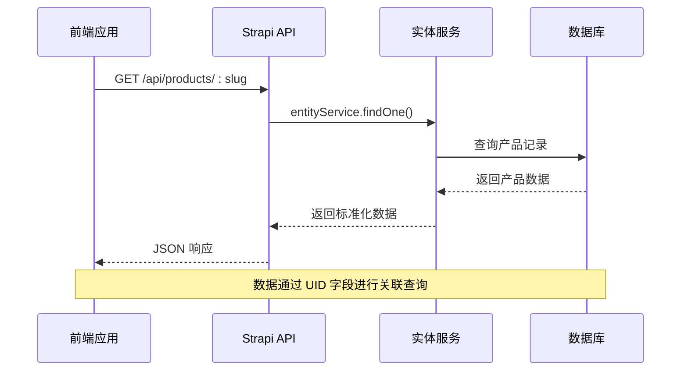
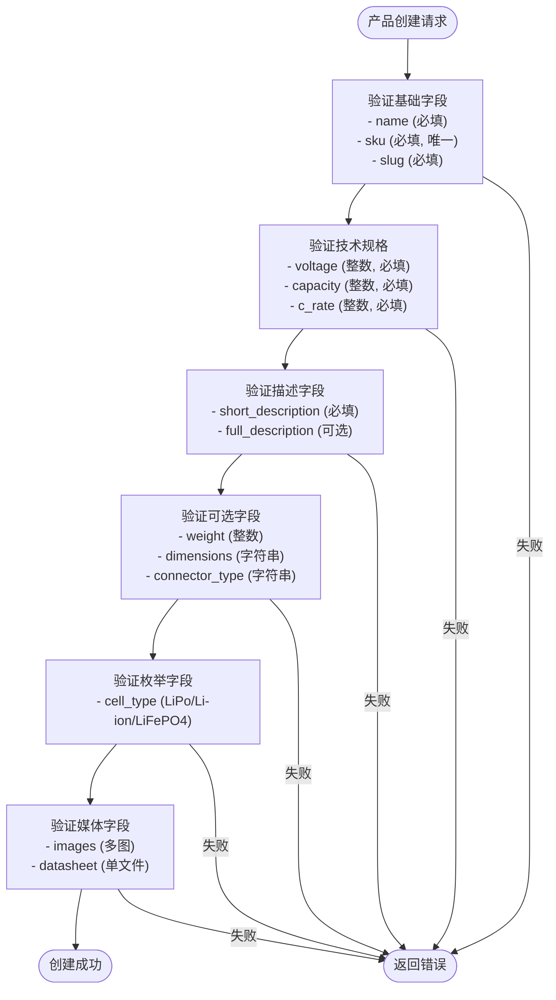
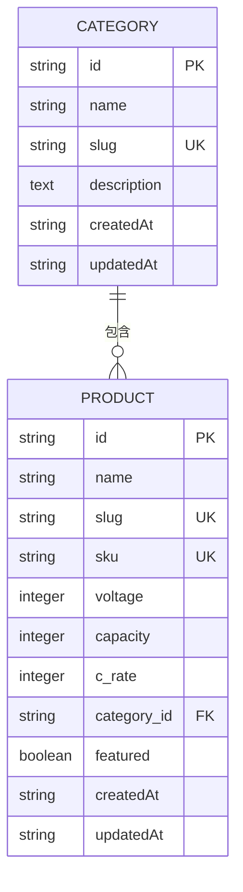
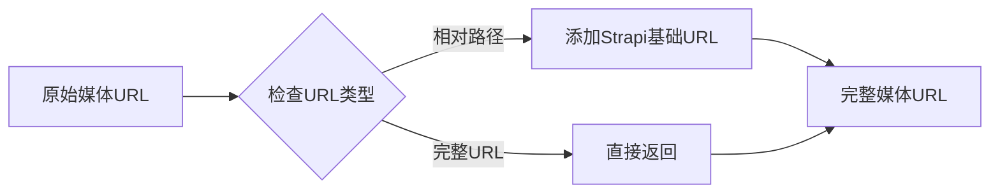
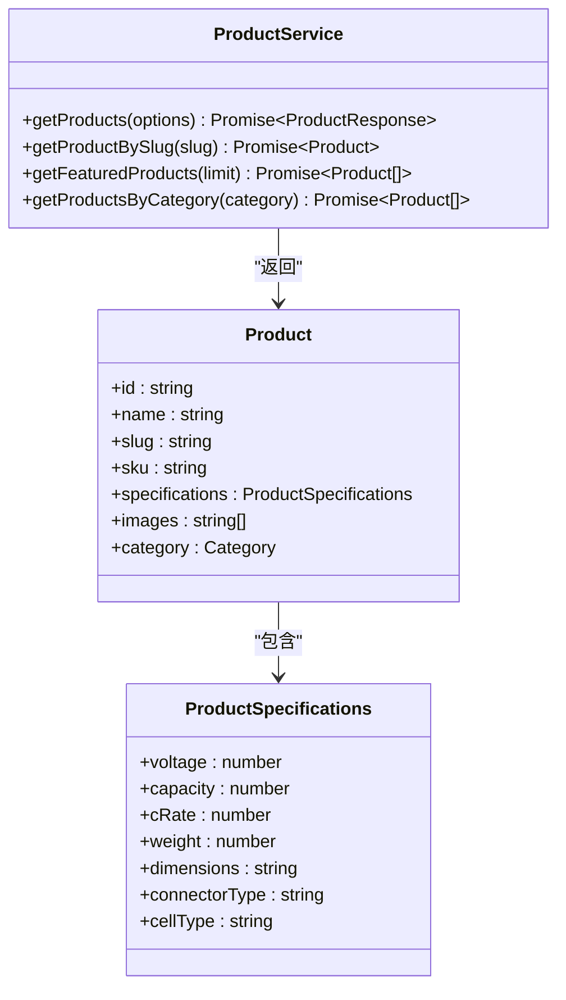
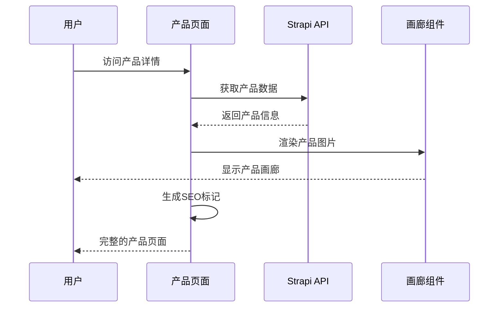
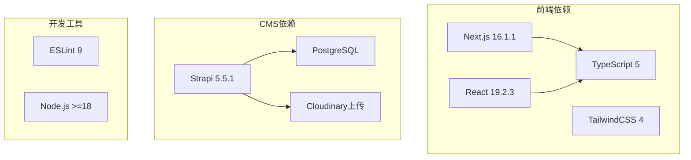

# 产品数据模型

<cite>
**本文档引用的文件**
- [schema.json](file://cms/src/api/product/content-types/product/schema.json)
- [index.ts](file://frontend/src/types/index.ts)
- [product.ts](file://cms/src/api/product/controllers/product.ts)
- [product.ts](file://cms/src/api/product/services/product.ts)
- [strapi.ts](file://frontend/src/lib/strapi.ts)
- [page.tsx](file://frontend/src/app/products/[category]/[slug]/page.tsx)
- [ProductGallery.tsx](file://frontend/src/components/products/ProductGallery.tsx)
- [schema.json](file://cms/src/api/category/content-types/category/schema.json)
- [database.ts](file://cms/config/database.ts)
- [package.json](file://cms/package.json)
- [package.json](file://frontend/package.json)
</cite>

## 目录
1. [简介](#简介)
2. [项目结构](#项目结构)
3. [核心组件](#核心组件)
4. [架构概览](#架构概览)
5. [详细组件分析](#详细组件分析)
6. [依赖分析](#依赖分析)
7. [性能考虑](#性能考虑)
8. [故障排除指南](#故障排除指南)
9. [结论](#结论)

## 简介

本文件详细文档化了基于 Strapi 的产品数据模型，涵盖产品实体的完整字段定义、内容类型结构设计、前后端类型定义以及数据接口规范。该系统支持电池产品的技术规格管理、媒体文件处理、SEO 优化以及与分类系统的关联。

## 项目结构

该项目采用前后端分离架构，使用 Next.js 作为前端框架，Strapi 作为 Headless CMS：



**图表来源**
- [page.tsx:1-566](file://frontend/src/app/products/[category]/[slug]/page.tsx#L1-L566)
- [strapi.ts:1-412](file://frontend/src/lib/strapi.ts#L1-L412)
- [schema.json:1-33](file://cms/src/api/product/content-types/product/schema.json#L1-L33)

**章节来源**
- [package.json:1-36](file://cms/package.json#L1-L36)
- [package.json:1-26](file://frontend/package.json#L1-L26)

## 核心组件

### 产品实体字段定义

产品数据模型包含以下核心字段类别：

#### 基础信息字段
- **名称 (name)**: 必填字符串，用于产品显示名称
- **SKU (sku)**: 必填唯一字符串，产品唯一标识符
- **Slug (slug)**: UID 字段，自动生成，用于 SEO 友好的 URL

#### 描述字段
- **简短描述 (short_description)**: 必填文本，用于产品摘要
- **完整描述 (full_description)**: 富文本格式，详细产品说明

#### 技术规格参数
- **电压 (voltage)**: 整数，表示电池节数 (S count)
- **容量 (capacity)**: 整数，单位毫安时 (mAh)
- **放电率 (c_rate)**: 整数，连续放电倍率
- **重量 (weight)**: 整数，单位克 (g)
- **尺寸 (dimensions)**: 字符串，格式 L×W×H mm
- **连接器类型 (connector_type)**: 字符串，电池连接器规格
- **电池类型 (cell_type)**: 枚举值，支持 LiPo、Li-ion、LiFePO4

#### 业务属性
- **精选产品 (featured)**: 布尔值，默认 false
- **SEO 标题 (seo_title)**: 字符串，自定义 SEO 标题
- **SEO 描述 (seo_description)**: 文本，自定义 SEO 描述

#### 媒体文件
- **产品图片 (images)**: 多媒体字段，允许上传多张图片
- **数据表 (datasheet)**: 单文件多媒体，存储技术规格文档
- **MSDS 文件 (msds)**: 单文件多媒体，存储安全数据表

#### 关系映射
- **分类关联 (category)**: 多对一关系，关联到产品分类

**章节来源**
- [schema.json:12-31](file://cms/src/api/product/content-types/product/schema.json#L12-L31)
- [index.ts:23-43](file://frontend/src/types/index.ts#L23-L43)

### 前端类型定义

前端使用 TypeScript 定义强类型接口：

#### 产品规格接口 (ProductSpecifications)
```typescript
interface ProductSpecifications {
  voltage: number;     // 电压等级 (S count)
  capacity: number;    // mAh
  cRate: number;       // 放电倍率
  weight: number;      // 克
  dimensions: string;  // L×W×H mm
  connectorType: string;
  cellType: 'LiPo' | 'Li-ion' | 'LiFePO4';
}
```

#### 产品主接口 (Product)
```typescript
interface Product {
  id: string;
  name: string;
  slug: string;
  sku: string;
  category: Category;
  shortDescription: string;
  fullDescription: string;
  specifications: ProductSpecifications;
  images: string[];
  datasheet?: string;
  featured: boolean;
  faqs: FAQ[];
  seo: SEOFields;
  createdAt: string;
  updatedAt: string;
}
```

**章节来源**
- [index.ts:1-157](file://frontend/src/types/index.ts#L1-L157)

## 架构概览

系统采用分层架构设计，确保数据流的清晰性和可维护性：



**图表来源**
- [product.ts:11-16](file://cms/src/api/product/controllers/product.ts#L11-L16)
- [strapi.ts:221-225](file://frontend/src/lib/strapi.ts#L221-L225)

**章节来源**
- [product.ts:1-40](file://cms/src/api/product/controllers/product.ts#L1-L40)
- [strapi.ts:1-412](file://frontend/src/lib/strapi.ts#L1-L412)

## 详细组件分析

### 产品内容类型设计

#### 字段验证规则
产品内容类型实现了严格的字段验证机制：



**图表来源**
- [schema.json:13-29](file://cms/src/api/product/content-types/product/schema.json#L13-L29)

#### 关系映射设计
产品与分类采用多对一关系设计：



**图表来源**
- [schema.json:12-18](file://cms/src/api/category/content-types/category/schema.json#L12-L18)
- [schema.json:28-28](file://cms/src/api/product/content-types/product/schema.json#L28-L28)

**章节来源**
- [schema.json:1-33](file://cms/src/api/product/content-types/product/schema.json#L1-L33)
- [schema.json:1-21](file://cms/src/api/category/content-types/category/schema.json#L1-L21)

### 媒体文件处理

#### 媒体字段配置
系统支持多种媒体类型的灵活处理：

| 媒体类型 | 字段名 | 配置说明 |
|---------|--------|----------|
| 图片 | images | 多图上传，允许类型: images |
| PDF文档 | datasheet | 单文件上传，允许类型: files |
| PDF文档 | msds | 单文件上传，允许类型: files |

#### 媒体 URL 处理
前端提供统一的媒体 URL 处理函数：



**图表来源**
- [strapi.ts:11-23](file://frontend/src/lib/strapi.ts#L11-L23)

**章节来源**
- [strapi.ts:11-23](file://frontend/src/lib/strapi.ts#L11-L23)

### 前端数据接口

#### 产品查询接口
前端提供了完整的 CRUD 操作接口：



**图表来源**
- [strapi.ts:185-234](file://frontend/src/lib/strapi.ts#L185-L234)
- [index.ts:23-43](file://frontend/src/types/index.ts#L23-L43)

#### 产品详情页面渲染
产品详情页面采用静态生成方式，支持 SEO 优化：



**图表来源**
- [page.tsx:202-566](file://frontend/src/app/products/[category]/[slug]/page.tsx#L202-L566)
- [ProductGallery.tsx:10-104](file://frontend/src/components/products/ProductGallery.tsx#L10-L104)

**章节来源**
- [strapi.ts:185-234](file://frontend/src/lib/strapi.ts#L185-L234)
- [page.tsx:1-566](file://frontend/src/app/products/[category]/[slug]/page.tsx#L1-L566)
- [ProductGallery.tsx:1-104](file://frontend/src/components/products/ProductGallery.tsx#L1-L104)

## 依赖分析

### 技术栈依赖



**图表来源**
- [package.json:11-25](file://frontend/package.json#L11-L25)
- [package.json:14-29](file://cms/package.json#L14-L29)

### 数据库配置
系统使用 PostgreSQL 作为主要数据库：

| 配置项 | 默认值 | 说明 |
|--------|--------|------|
| 主机 | postgres | 数据库主机地址 |
| 端口 | 5432 | PostgreSQL 默认端口 |
| 数据库名 | strapi | 数据库名称 |
| 用户名 | strapi | 数据库用户名 |
| 密码 | strapi_password | 数据库密码 |
| SSL | false | 是否启用 SSL 连接 |

**章节来源**
- [database.ts:1-15](file://cms/config/database.ts#L1-L15)

## 性能考虑

### 缓存策略
前端实现了智能缓存机制：

- **Revalidation**: 60 秒自动刷新
- **静态生成**: 产品详情页支持静态预渲染
- **条件加载**: 媒体资源按需加载

### 查询优化
- 使用 UID 字段进行快速查找
- 支持多字段过滤查询
- 分页查询优化大数据集

## 故障排除指南

### 常见问题及解决方案

#### 产品数据获取失败
1. **检查 API 连接**: 验证 STRAPI_URL 环境变量配置
2. **确认认证令牌**: 确保 STRAPI_API_TOKEN 正确设置
3. **验证数据格式**: 检查返回的数据结构是否符合预期

#### 媒体文件显示问题
1. **URL 格式检查**: 确认媒体 URL 是完整链接还是相对路径
2. **CDN 配置**: 验证 Cloudinary 或本地上传配置
3. **权限设置**: 检查文件访问权限

#### 类型定义不匹配
1. **同步更新**: 前后端类型定义需要保持一致
2. **字段映射**: 注意 Strapi 返回的 snake_case 与前端 camelCase 的转换
3. **可选字段处理**: 区分可选字段和必需字段

**章节来源**
- [strapi.ts:114-119](file://frontend/src/lib/strapi.ts#L114-L119)
- [strapi.ts:153-156](file://frontend/src/lib/strapi.ts#L153-L156)

## 结论

该产品数据模型设计充分考虑了电池行业的特殊需求，提供了完整的技术规格管理、灵活的媒体处理能力和强大的 SEO 支持。通过前后端分离架构，系统具备良好的扩展性和维护性。建议在后续开发中重点关注数据一致性验证、性能监控和用户体验优化。