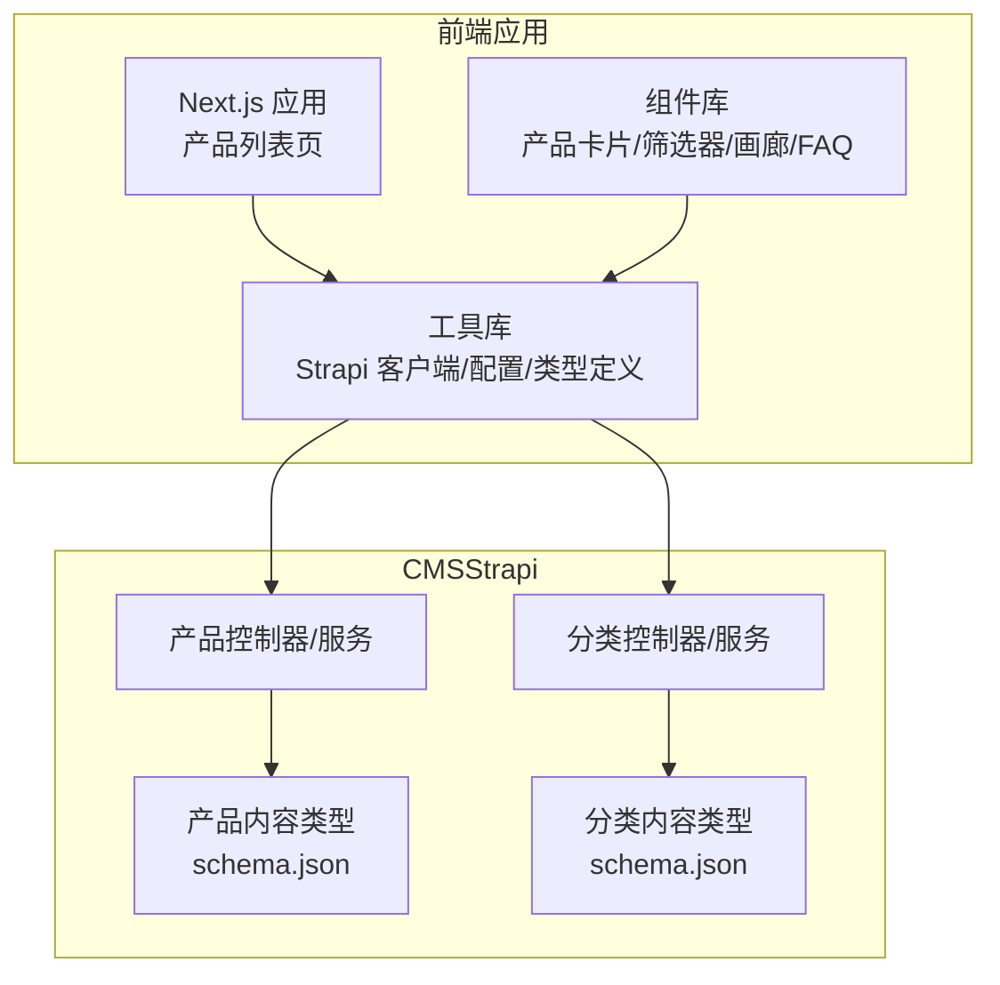
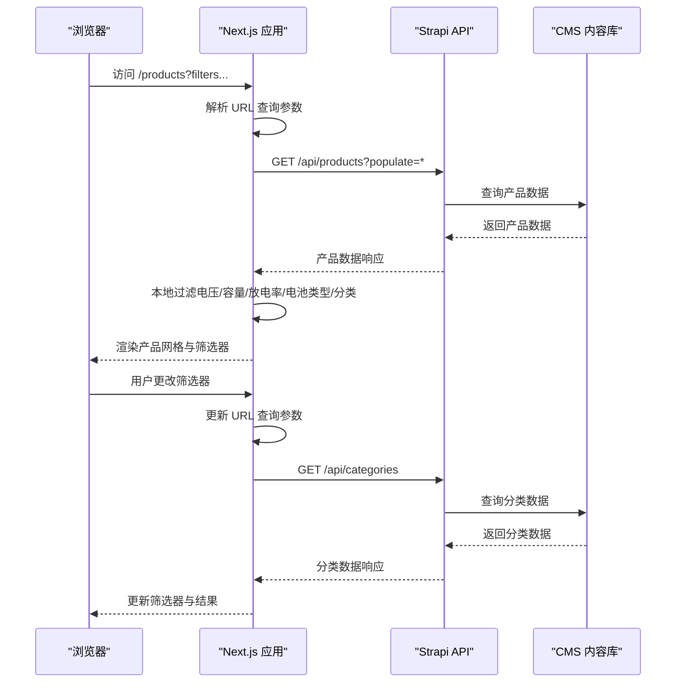
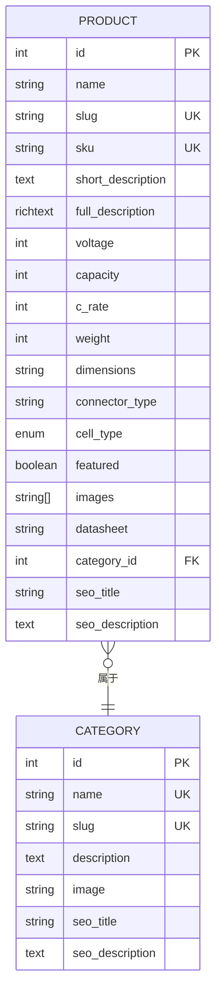
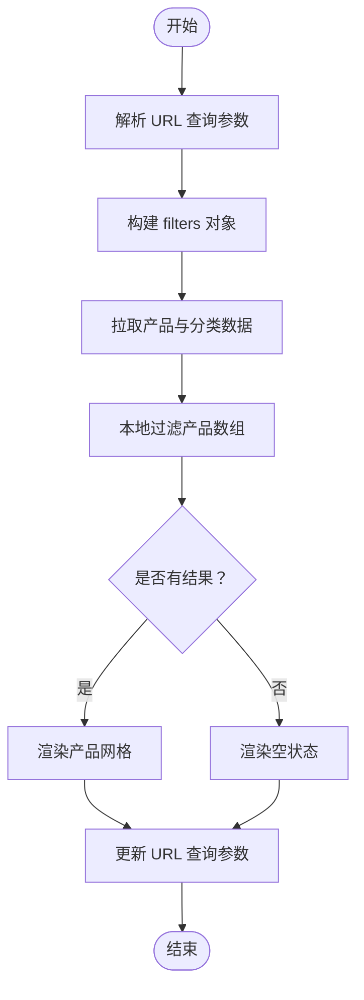
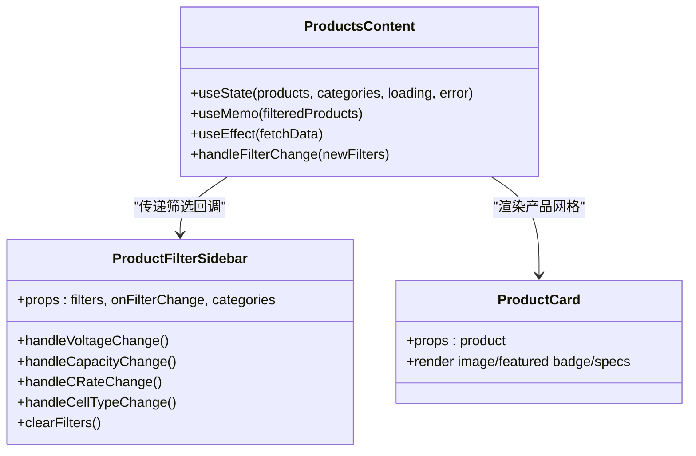
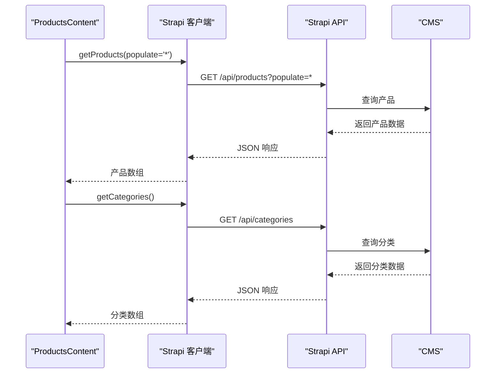
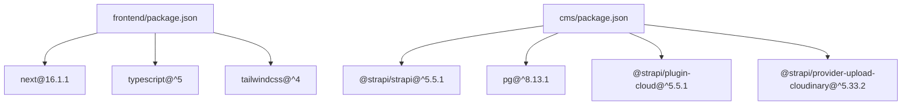

# 产品管理系统

<cite>
**本文档引用的文件**
- [cms/src/api/product/content-types/product/schema.json](file://cms/src/api/product/content-types/product/schema.json)
- [cms/src/api/product/controllers/product.ts](file://cms/src/api/product/controllers/product.ts)
- [cms/src/api/product/services/product.ts](file://cms/src/api/product/services/product.ts)
- [cms/src/api/category/content-types/category/schema.json](file://cms/src/api/category/content-types/category/schema.json)
- [cms/src/api/category/controllers/category.ts](file://cms/src/api/category/controllers/category.ts)
- [cms/src/api/category/services/category.ts](file://cms/src/api/category/services/category.ts)
- [frontend/src/app/products/page.tsx](file://frontend/src/app/products/page.tsx)
- [frontend/src/lib/strapi.ts](file://frontend/src/lib/strapi.ts)
- [frontend/src/lib/config.ts](file://frontend/src/lib/config.ts)
- [frontend/src/types/index.ts](file://frontend/src/types/index.ts)
- [frontend/src/components/products/ProductGallery.tsx](file://frontend/src/components/products/ProductGallery.tsx)
- [frontend/src/components/products/ProductFAQ.tsx](file://frontend/src/components/products/ProductFAQ.tsx)
- [frontend/package.json](file://frontend/package.json)
- [cms/package.json](file://cms/package.json)
</cite>

## 目录
1. [简介](#简介)
2. [项目结构](#项目结构)
3. [核心组件](#核心组件)
4. [架构总览](#架构总览)
5. [详细组件分析](#详细组件分析)
6. [依赖关系分析](#依赖关系分析)
7. [性能考虑](#性能考虑)
8. [故障排除指南](#故障排除指南)
9. [结论](#结论)
10. [附录](#附录)

## 简介
本文件为 Battivus 项目的“产品管理系统”提供全面技术文档，涵盖产品数据模型、参数化筛选功能、前端组件架构、数据流与状态管理、URL 参数同步机制、产品分类与特色标记、图片处理方案，以及性能优化建议。文档面向开发者与非技术读者，力求以循序渐进的方式呈现系统设计与实现细节。

## 项目结构
项目采用前后端分离架构：
- 前端：Next.js 应用，负责产品列表页、详情页、筛选器、图片画廊与FAQ等组件渲染与交互。
- CMS（内容管理系统）：基于 Strapi 的 Headless CMS，提供产品与分类的数据模型与 API。

图表来源
- [frontend/src/app/products/page.tsx:1-580](file://frontend/src/app/products/page.tsx#L1-L580)
- [frontend/src/lib/strapi.ts:1-412](file://frontend/src/lib/strapi.ts#L1-L412)
- [cms/src/api/product/content-types/product/schema.json:1-33](file://cms/src/api/product/content-types/product/schema.json#L1-L33)
- [cms/src/api/category/content-types/category/schema.json:1-21](file://cms/src/api/category/content-types/category/schema.json#L1-L21)

章节来源
- [frontend/src/app/products/page.tsx:1-580](file://frontend/src/app/products/page.tsx#L1-L580)
- [frontend/src/lib/strapi.ts:1-412](file://frontend/src/lib/strapi.ts#L1-L412)
- [cms/src/api/product/content-types/product/schema.json:1-33](file://cms/src/api/product/content-types/product/schema.json#L1-L33)
- [cms/src/api/category/content-types/category/schema.json:1-21](file://cms/src/api/category/content-types/category/schema.json#L1-L21)

## 核心组件
- 产品数据模型：由 Strapi 的产品内容类型定义，包含名称、SKU、短描述、电压、容量、放电率、重量、尺寸、连接器类型、电池类型、特色标记、图片、数据表、分类、SEO 字段等字段。
- 分类数据模型：包含名称、slug、描述、图片、SEO 字段。
- 前端产品列表页：负责从 Strapi 拉取产品与分类数据，解析 URL 查询参数，构建筛选条件，渲染产品卡片与筛选侧边栏，并处理加载状态与错误回退。
- Strapi 客户端：封装通用的 API 请求方法，支持 populate、filters、sort、pagination 等参数，统一处理媒体资源 URL 前缀与认证头。
- 配置与类型：定义筛选选项、产品分类、过滤器接口与产品类型定义，保证前端与 CMS 数据结构一致。

章节来源
- [cms/src/api/product/content-types/product/schema.json:12-31](file://cms/src/api/product/content-types/product/schema.json#L12-L31)
- [cms/src/api/category/content-types/category/schema.json:12-19](file://cms/src/api/category/content-types/category/schema.json#L12-L19)
- [frontend/src/app/products/page.tsx:11-39](file://frontend/src/app/products/page.tsx#L11-L39)
- [frontend/src/lib/strapi.ts:51-119](file://frontend/src/lib/strapi.ts#L51-L119)
- [frontend/src/lib/config.ts:149-176](file://frontend/src/lib/config.ts#L149-L176)
- [frontend/src/types/index.ts:23-52](file://frontend/src/types/index.ts#L23-L52)

## 架构总览
产品数据从 CMS 通过 API 提供给前端，前端根据 URL 查询参数动态构建筛选条件，完成本地过滤与展示；同时保持 URL 与筛选状态同步，便于分享与历史记录恢复。

图表来源
- [frontend/src/app/products/page.tsx:288-376](file://frontend/src/app/products/page.tsx#L288-L376)
- [frontend/src/lib/strapi.ts:184-218](file://frontend/src/lib/strapi.ts#L184-L218)
- [cms/src/api/product/controllers/product.ts:4-9](file://cms/src/api/product/controllers/product.ts#L4-L9)
- [cms/src/api/category/controllers/category.ts:4-9](file://cms/src/api/category/controllers/category.ts#L4-L9)

## 详细组件分析

### 产品数据模型与字段
- 产品模型字段覆盖了无人机电池的关键参数：电压（S 数）、容量（mAh）、放电率（C）、重量（g）、尺寸（mm）、连接器类型、电池类型枚举（LiPo/Li-ion/LiFePO4）、特色标记、图片、数据表、分类关联、SEO 字段。
- 分类模型包含名称、slug、描述、图片与 SEO 字段，用于产品分类导航与 SEO 优化。

图表来源
- [cms/src/api/product/content-types/product/schema.json:12-31](file://cms/src/api/product/content-types/product/schema.json#L12-L31)
- [cms/src/api/category/content-types/category/schema.json:12-19](file://cms/src/api/category/content-types/category/schema.json#L12-L19)

章节来源
- [cms/src/api/product/content-types/product/schema.json:12-31](file://cms/src/api/product/content-types/product/schema.json#L12-L31)
- [cms/src/api/category/content-types/category/schema.json:12-19](file://cms/src/api/category/content-types/category/schema.json#L12-L19)

### 参数化筛选功能实现
- URL 同步：组件解析 URL 查询参数作为初始筛选状态，并在筛选器变更时更新 URL，确保状态可分享与历史记录恢复。
- 本地过滤：前端对产品数组进行过滤，支持多选电压、容量区间、多选放电率阈值、多选电池类型、单选分类。
- 过滤逻辑要点：
  - 电压：必须包含于用户选择的电压集合。
  - 容量：产品容量需在最小值与最大值之间。
  - 放电率：产品放电率需不小于任一用户选择的阈值。
  - 电池类型：必须包含于用户选择的类型集合。
  - 分类：产品所属分类 slug 必须等于当前选择的分类 slug。

图表来源
- [frontend/src/app/products/page.tsx:288-401](file://frontend/src/app/products/page.tsx#L288-L401)

章节来源
- [frontend/src/app/products/page.tsx:288-401](file://frontend/src/app/products/page.tsx#L288-L401)

### 前端产品页面组件架构
- 产品卡片（ProductCard）：展示产品图片、类别、名称、简述、快速规格（电压/容量/放电率/SKU），并显示“特色”标记。
- 筛选侧边栏（ProductFilterSidebar）：提供电压、容量区间、放电率、电池类型与分类的筛选控件，支持清空筛选与移动端弹窗。
- 主内容区（ProductsContent）：负责数据加载、错误处理、结果统计、排序下拉、加载骨架屏、空状态与“清空筛选”按钮。
- 布局与交互：桌面端固定侧边栏，移动端使用模态抽屉；使用 Suspense 提供首屏骨架屏。

图表来源
- [frontend/src/app/products/page.tsx:41-276](file://frontend/src/app/products/page.tsx#L41-L276)

章节来源
- [frontend/src/app/products/page.tsx:41-276](file://frontend/src/app/products/page.tsx#L41-L276)

### 数据流与状态管理
- API 调用：前端通过 Strapi 客户端发起请求，支持 populate、filters、sort、pagination 等参数。
- 数据转换：将 Strapi 返回的 snake_case 字段映射到前端类型定义的驼峰命名，确保一致性。
- 状态管理：使用 React hooks 管理产品、分类、加载、错误与筛选状态；通过 URLSearchParams 同步筛选状态。
- 错误处理：产品与分类分别请求，分类失败时回退到配置中的分类列表，避免整页崩溃。

图表来源
- [frontend/src/lib/strapi.ts:184-218](file://frontend/src/lib/strapi.ts#L184-L218)
- [frontend/src/app/products/page.tsx:314-360](file://frontend/src/app/products/page.tsx#L314-L360)

章节来源
- [frontend/src/lib/strapi.ts:51-119](file://frontend/src/lib/strapi.ts#L51-L119)
- [frontend/src/lib/strapi.ts:184-218](file://frontend/src/lib/strapi.ts#L184-L218)
- [frontend/src/app/products/page.tsx:314-360](file://frontend/src/app/products/page.tsx#L314-L360)

### URL 参数同步机制
- 初始化：读取 URL 中的电压、容量区间、放电率、电池类型与分类参数，设置为初始筛选状态。
- 变更同步：当筛选器变化时，将新筛选状态写入 URL 查询字符串，使用路由 push 更新地址栏但不触发滚动重置。
- 状态恢复：监听搜索参数变化，当用户前进/后退或直接访问带参数的链接时，自动恢复筛选状态。

章节来源
- [frontend/src/app/products/page.tsx:288-312](file://frontend/src/app/products/page.tsx#L288-L312)
- [frontend/src/app/products/page.tsx:362-376](file://frontend/src/app/products/page.tsx#L362-L376)

### 产品分类系统与特色产品标记
- 分类系统：产品与分类为多对一关系，前端通过分类 slug 进行筛选；若分类 API 失败，则回退到配置中的静态分类列表。
- 特色产品标记：产品模型包含布尔字段“featured”，前端在产品卡片顶部显示“Featured”徽章，提升曝光度。

章节来源
- [cms/src/api/product/content-types/product/schema.json:28-28](file://cms/src/api/product/content-types/product/schema.json#L28-L28)
- [frontend/src/app/products/page.tsx:241-245](file://frontend/src/app/products/page.tsx#L241-L245)
- [frontend/src/lib/config.ts:118-147](file://frontend/src/lib/config.ts#L118-L147)

### 图片处理与展示
- 媒体 URL 处理：Strapi 客户端提供 getStrapiMedia 方法，自动拼接完整 URL，兼容相对路径与绝对路径。
- 产品画廊组件：支持主图与缩略图切换、左右滚动浏览、悬停显示箭头、选中高亮等交互。
- FAQ 组件：折叠式问答，点击展开对应答案。

章节来源
- [frontend/src/lib/strapi.ts:11-23](file://frontend/src/lib/strapi.ts#L11-L23)
- [frontend/src/components/products/ProductGallery.tsx:10-103](file://frontend/src/components/products/ProductGallery.tsx#L10-L103)
- [frontend/src/components/products/ProductFAQ.tsx:10-56](file://frontend/src/components/products/ProductFAQ.tsx#L10-L56)

## 依赖关系分析
- 前端依赖：Next.js、React、TailwindCSS、TypeScript。
- CMS 依赖：Strapi 核心、云存储插件、数据库驱动、Users & Permissions 插件。
- 前端与 CMS 的耦合点：URL 与查询参数约定、populate 与 filters 参数格式、媒体 URL 规范。

图表来源
- [frontend/package.json:11-25](file://frontend/package.json#L11-L25)
- [cms/package.json:14-34](file://cms/package.json#L14-L34)

章节来源
- [frontend/package.json:11-25](file://frontend/package.json#L11-L25)
- [cms/package.json:14-34](file://cms/package.json#L14-L34)

## 性能考虑
- 缓存与增量更新：Strapi 客户端使用 Next.js 的 revalidate 机制，每 60 秒重新验证，平衡新鲜度与性能。
- 本地过滤：在客户端进行过滤，减少不必要的网络请求；建议对大列表启用虚拟滚动以进一步优化渲染性能。
- 媒体资源：使用 CDN 或云存储优化图片加载，前端统一通过 getStrapiMedia 拼接 URL，避免重复逻辑。
- 并发请求：产品与分类请求可并发执行，缩短首屏等待时间。
- 错误降级：分类请求失败时回退到配置中的分类列表，保障用户体验。

章节来源
- [frontend/src/lib/strapi.ts:109-118](file://frontend/src/lib/strapi.ts#L109-L118)
- [frontend/src/app/products/page.tsx:333-349](file://frontend/src/app/products/page.tsx#L333-L349)

## 故障排除指南
- 无法加载产品或分类：
  - 检查 NEXT_PUBLIC_STRAPI_URL 环境变量是否正确指向 CMS 地址。
  - 确认 Strapi API 健康检查可用。
  - 查看网络面板与控制台错误信息。
- 筛选状态未同步到 URL：
  - 确认 handleFilterChange 是否被调用且正确生成查询字符串。
  - 检查 router.push 的调用是否传入正确的路径与选项。
- 图片不显示：
  - 使用 getStrapiMedia 确保返回完整 URL。
  - 检查媒体上传与权限配置。
- 分类回退：
  - 若分类 API 失败，组件会回退到配置中的分类列表，确认配置项是否正确。

章节来源
- [frontend/src/lib/strapi.ts:309-316](file://frontend/src/lib/strapi.ts#L309-L316)
- [frontend/src/app/products/page.tsx:362-376](file://frontend/src/app/products/page.tsx#L362-L376)
- [frontend/src/lib/strapi.ts:11-23](file://frontend/src/lib/strapi.ts#L11-L23)

## 结论
Battivus 的产品管理系统通过清晰的前后端分层、严谨的数据模型与灵活的参数化筛选，实现了高效的产品浏览体验。前端以 URL 同步为核心，结合本地过滤与错误回退策略，确保在不同网络与设备环境下均具备良好的稳定性与可维护性。后续可在虚拟滚动、缓存策略与图片优化方面继续深化，以进一步提升性能与用户体验。

## 附录
- 关键配置与类型定义：
  - 筛选选项与默认分类：参见配置文件。
  - 产品与分类类型定义：参见类型文件。
- API 调用参考：
  - 获取产品列表与详情、获取分类列表与详情、健康检查等。

章节来源
- [frontend/src/lib/config.ts:118-176](file://frontend/src/lib/config.ts#L118-L176)
- [frontend/src/types/index.ts:23-52](file://frontend/src/types/index.ts#L23-L52)
- [frontend/src/lib/strapi.ts:170-182](file://frontend/src/lib/strapi.ts#L170-L182)
- [frontend/src/lib/strapi.ts:184-234](file://frontend/src/lib/strapi.ts#L184-L234)
- [frontend/src/lib/strapi.ts:309-316](file://frontend/src/lib/strapi.ts#L309-L316)