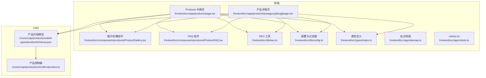
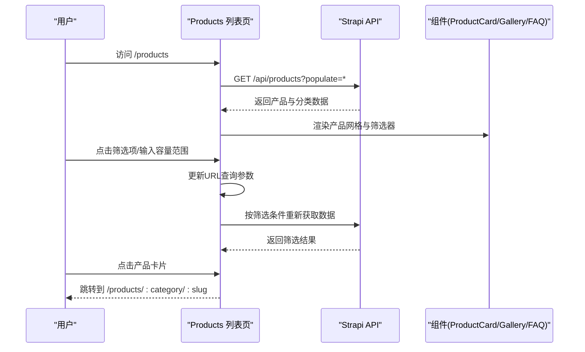
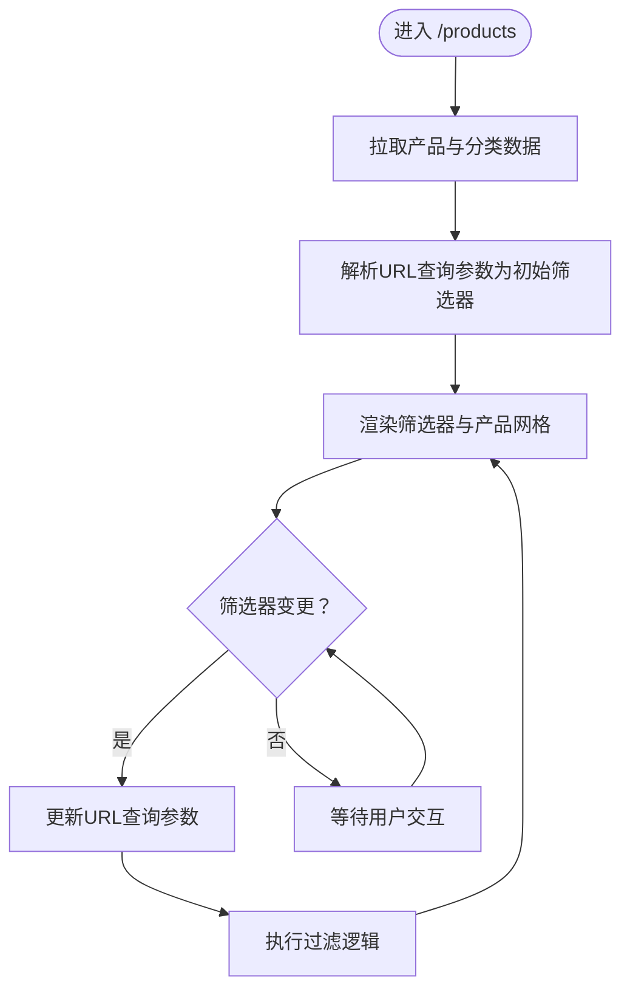
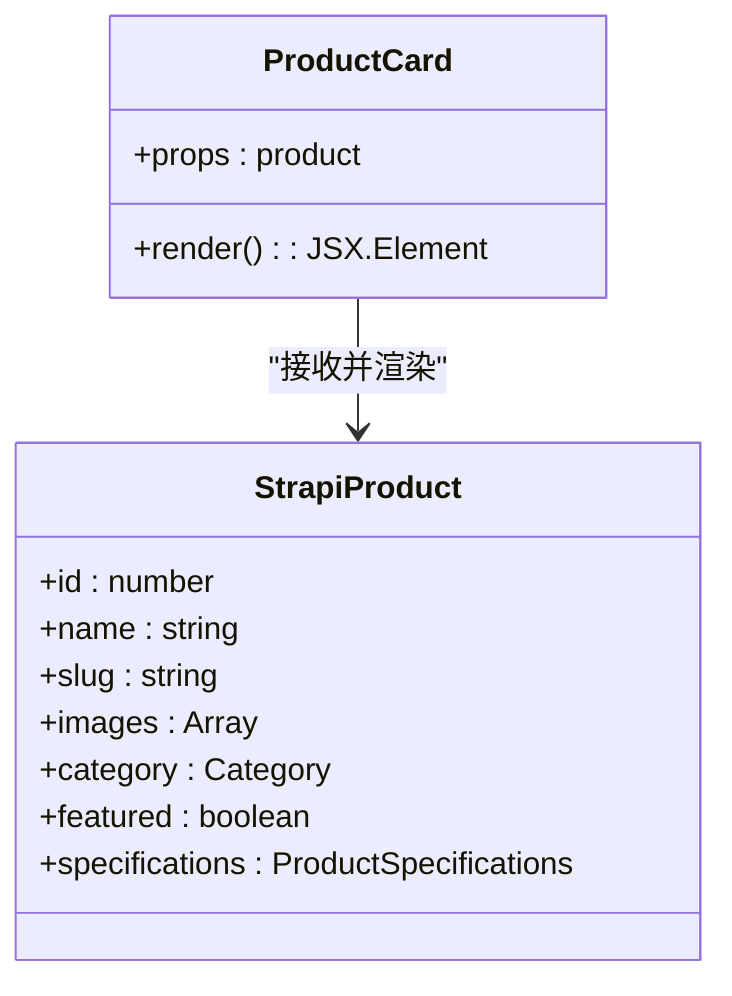
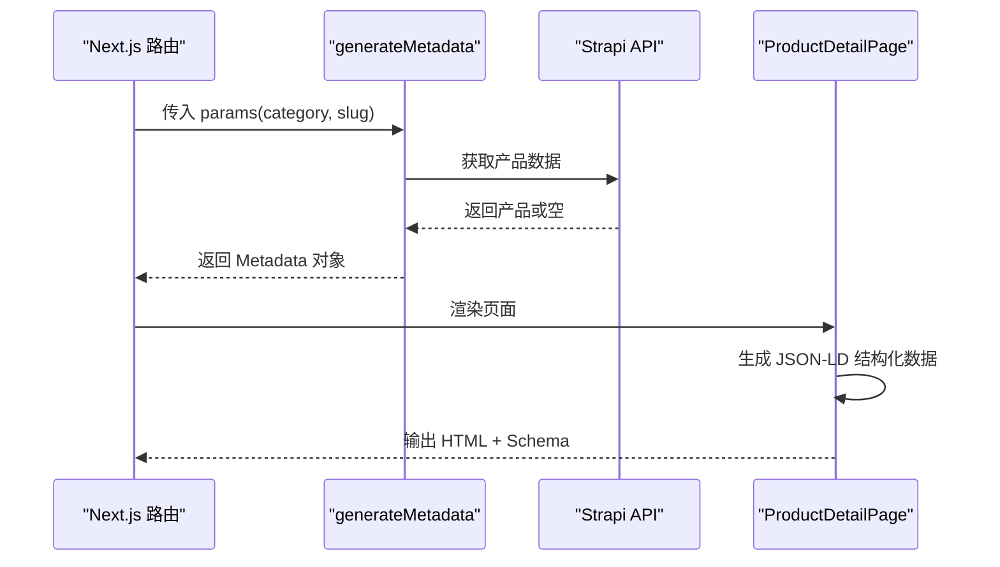
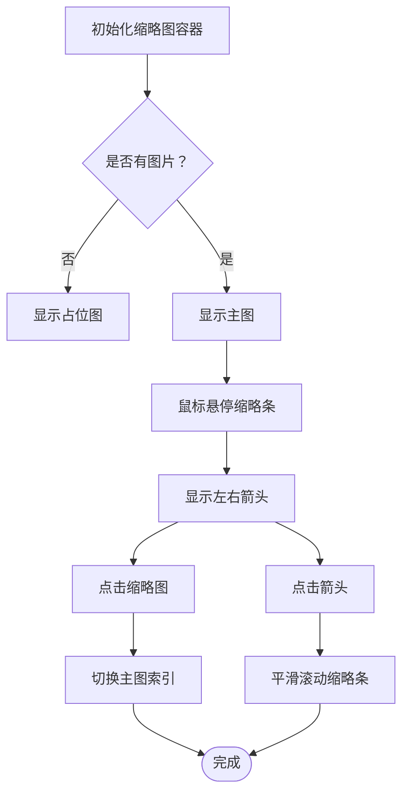
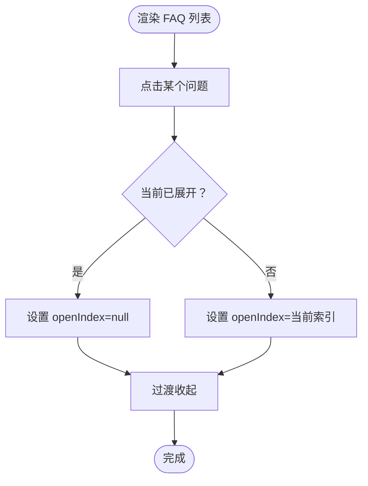
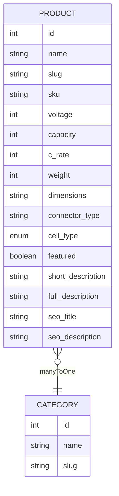

# 产品页面组件

<cite>
**本文引用的文件**
- [frontend/src/app/products/page.tsx](file://frontend/src/app/products/page.tsx)
- [frontend/src/app/products/[category]/[slug]/page.tsx](file://frontend/src/app/products/[category]/[slug]/page.tsx)
- [frontend/src/components/products/ProductGallery.tsx](file://frontend/src/components/products/ProductGallery.tsx)
- [frontend/src/components/products/ProductFAQ.tsx](file://frontend/src/components/products/ProductFAQ.tsx)
- [frontend/src/lib/seo.ts](file://frontend/src/lib/seo.ts)
- [frontend/src/lib/config.ts](file://frontend/src/lib/config.ts)
- [frontend/src/lib/strapi.ts](file://frontend/src/lib/strapi.ts)
- [frontend/src/types/index.ts](file://frontend/src/types/index.ts)
- [frontend/src/app/sitemap.ts](file://frontend/src/app/sitemap.ts)
- [frontend/src/app/robots.ts](file://frontend/src/app/robots.ts)
- [cms/src/api/product/content-types/product/schema.json](file://cms/src/api/product/content-types/product/schema.json)
- [cms/src/api/product/controllers/product.ts](file://cms/src/api/product/controllers/product.ts)
</cite>

## 目录
1. [简介](#简介)
2. [项目结构](#项目结构)
3. [核心组件](#核心组件)
4. [架构总览](#架构总览)
5. [详细组件分析](#详细组件分析)
6. [依赖关系分析](#依赖关系分析)
7. [性能考虑](#性能考虑)
8. [故障排查指南](#故障排查指南)
9. [结论](#结论)
10. [附录](#附录)

## 简介
本文件面向产品页面组件，系统化梳理产品网格布局、产品卡片组件、产品详情页路由与SEO、图片轮播、规格对比与FAQ等模块的设计与实现。文档同时覆盖可复用性设计、样式定制、响应式适配、组件测试策略与性能监控指标，帮助开发者在Next.js前端与Strapi后端之间高效协作。

## 项目结构
- 前端采用App Router目录结构，产品相关页面位于 `frontend/src/app/products/`，包含列表页与详情页。
- 组件层位于 `frontend/src/components/products/`，包含可复用的图片轮播与FAQ组件。
- SEO与配置位于 `frontend/src/lib/`，类型定义位于 `frontend/src/types/index.ts`。
- 后端CMS（Strapi）位于 `cms/`，产品内容模型与控制器定义于 `cms/src/api/product/`。

图表来源
- [frontend/src/app/products/page.tsx:1-580](file://frontend/src/app/products/page.tsx#L1-L580)
- [frontend/src/app/products/[category]/[slug]/page.tsx:1-566](file://frontend/src/app/products/[category]/[slug]/page.tsx#L1-L566)
- [frontend/src/components/products/ProductGallery.tsx:1-104](file://frontend/src/components/products/ProductGallery.tsx#L1-L104)
- [frontend/src/components/products/ProductFAQ.tsx:1-57](file://frontend/src/components/products/ProductFAQ.tsx#L1-L57)
- [frontend/src/lib/seo.ts:1-225](file://frontend/src/lib/seo.ts#L1-L225)
- [frontend/src/lib/config.ts:1-177](file://frontend/src/lib/config.ts#L1-L177)
- [frontend/src/types/index.ts:1-157](file://frontend/src/types/index.ts#L1-L157)
- [frontend/src/app/sitemap.ts:1-50](file://frontend/src/app/sitemap.ts#L1-L50)
- [frontend/src/app/robots.ts:1-14](file://frontend/src/app/robots.ts#L1-L14)
- [cms/src/api/product/content-types/product/schema.json:1-33](file://cms/src/api/product/content-types/product/schema.json#L1-L33)
- [cms/src/api/product/controllers/product.ts:1-40](file://cms/src/api/product/controllers/product.ts#L1-L40)

章节来源
- [frontend/src/app/products/page.tsx:1-580](file://frontend/src/app/products/page.tsx#L1-L580)
- [frontend/src/app/products/[category]/[slug]/page.tsx:1-566](file://frontend/src/app/products/[category]/[slug]/page.tsx#L1-L566)
- [frontend/src/lib/config.ts:118-177](file://frontend/src/lib/config.ts#L118-L177)
- [frontend/src/types/index.ts:23-43](file://frontend/src/types/index.ts#L23-L43)

## 核心组件
- 产品网格与筛选：Products 列表页负责从Strapi拉取产品与分类数据，构建参数化筛选器（电压、容量、放电率、电池类型、分类），并以URL查询参数同步状态。
- 产品卡片：展示缩略图、类别、名称、简述、快速规格（电压/容量/C）、SKU与“查看详情”链接；支持特色标签显示。
- 图片轮播：主图与缩略图滚动切换，支持左右箭头与悬停显示。
- 规格对比：详情页表格展示完整技术参数，并提供数据表与MSDS下载入口。
- FAQ：折叠问答，支持展开/收起动画。
- SEO与元数据：详情页生成结构化数据（JSON-LD）、面包屑、OpenGraph与canonical链接；列表页使用Suspense骨架屏提升首屏体验。

章节来源
- [frontend/src/app/products/page.tsx:214-276](file://frontend/src/app/products/page.tsx#L214-L276)
- [frontend/src/app/products/page.tsx:472-538](file://frontend/src/app/products/page.tsx#L472-L538)
- [frontend/src/components/products/ProductGallery.tsx:10-104](file://frontend/src/components/products/ProductGallery.tsx#L10-L104)
- [frontend/src/components/products/ProductFAQ.tsx:10-57](file://frontend/src/components/products/ProductFAQ.tsx#L10-L57)
- [frontend/src/app/products/[category]/[slug]/page.tsx:284-534](file://frontend/src/app/products/[category]/[slug]/page.tsx#L284-L534)
- [frontend/src/lib/seo.ts:4-68](file://frontend/src/lib/seo.ts#L4-L68)

## 架构总览
前端通过Next.js App Router管理路由与数据流，组件间通过props传递数据，SEO工具统一生成结构化数据与元信息。CMS提供产品内容模型与REST接口，前端通过Strapi客户端封装请求与缓存策略。

图表来源
- [frontend/src/app/products/page.tsx:278-401](file://frontend/src/app/products/page.tsx#L278-L401)
- [frontend/src/lib/strapi.ts:184-234](file://frontend/src/lib/strapi.ts#L184-L234)

## 详细组件分析

### 产品网格与筛选（Products 列表页）
- 数据获取与容错：优先从Strapi获取产品与分类，失败时回退到本地配置；错误状态用于提示用户。
- URL同步：筛选器变更时更新URL查询参数，保持浏览器前进后退一致性。
- 过滤逻辑：基于电压数组、容量上下限、放电率阈值、电池类型集合与分类slug进行过滤。
- 响应式布局：桌面端侧边栏，移动端弹窗筛选；网格按1/2/3列自适应。
- 加载态：骨架屏提升首屏体验。

图表来源
- [frontend/src/app/products/page.tsx:278-401](file://frontend/src/app/products/page.tsx#L278-L401)
- [frontend/src/app/products/page.tsx:472-538](file://frontend/src/app/products/page.tsx#L472-L538)

章节来源
- [frontend/src/app/products/page.tsx:278-401](file://frontend/src/app/products/page.tsx#L278-L401)
- [frontend/src/app/products/page.tsx:472-538](file://frontend/src/app/products/page.tsx#L472-L538)
- [frontend/src/lib/config.ts:149-177](file://frontend/src/lib/config.ts#L149-L177)

### 产品卡片组件（ProductCard）
- 图片懒加载：通过媒体URL转换函数与占位符SVG实现无图时的优雅降级。
- 特色标签：当产品标记为特色时显示“Featured”徽标。
- 快速规格：展示电压、容量、放电率三要素，便于快速识别产品能力。
- 链接跳转：点击卡片跳转至详情页，路径包含分类与slug。

图表来源
- [frontend/src/app/products/page.tsx:214-276](file://frontend/src/app/products/page.tsx#L214-L276)
- [frontend/src/types/index.ts:23-43](file://frontend/src/types/index.ts#L23-L43)

章节来源
- [frontend/src/app/products/page.tsx:214-276](file://frontend/src/app/products/page.tsx#L214-L276)

### 产品详情页路由与SEO（[category]/[slug]）
- 动态路由参数：从params中读取category与slug，优先从Strapi获取产品，失败则回退mock数据。
- 静态生成：根据产品数据生成静态路由参数，提升SEO与首屏性能。
- 元数据生成：title/description/openGraph/canonical由generateMetadata返回；结构化数据通过JSON-LD注入。
- 面包屑：导航到当前产品所在分类与详情页。
- 技术规格表：展示电压、容量、放电率、重量、尺寸、连接器、电池类型与能量密度等。
- 文档下载：数据表与MSDS下载入口。

图表来源
- [frontend/src/app/products/[category]/[slug]/page.tsx:163-200](file://frontend/src/app/products/[category]/[slug]/page.tsx#L163-L200)
- [frontend/src/app/products/[category]/[slug]/page.tsx:202-250](file://frontend/src/app/products/[category]/[slug]/page.tsx#L202-L250)
- [frontend/src/lib/seo.ts:4-68](file://frontend/src/lib/seo.ts#L4-L68)

章节来源
- [frontend/src/app/products/[category]/[slug]/page.tsx:163-200](file://frontend/src/app/products/[category]/[slug]/page.tsx#L163-L200)
- [frontend/src/app/products/[category]/[slug]/page.tsx:202-250](file://frontend/src/app/products/[category]/[slug]/page.tsx#L202-L250)
- [frontend/src/lib/seo.ts:4-68](file://frontend/src/lib/seo.ts#L4-L68)

### 图片轮播组件（ProductGallery）
- 主图与缩略图：主图区域展示当前选中图片，缩略条支持横向滚动与悬停显示左右箭头。
- 交互行为：点击缩略图切换主图；点击箭头平滑滚动缩略条；无图片时显示占位图。
- 可访问性：按钮提供aria-label；选中缩略图带高亮边框与环形光晕。

图表来源
- [frontend/src/components/products/ProductGallery.tsx:10-104](file://frontend/src/components/products/ProductGallery.tsx#L10-L104)

章节来源
- [frontend/src/components/products/ProductGallery.tsx:10-104](file://frontend/src/components/products/ProductGallery.tsx#L10-L104)

### FAQ 组件（ProductFAQ）
- 展开/收起：每个FAQ项独立控制开关，点击切换对应展开高度。
- 动画过渡：使用max-height与transition实现平滑展开/收起。
- 可访问性：按钮内含旋转箭头指示当前状态。

图表来源
- [frontend/src/components/products/ProductFAQ.tsx:10-57](file://frontend/src/components/products/ProductFAQ.tsx#L10-L57)

章节来源
- [frontend/src/components/products/ProductFAQ.tsx:10-57](file://frontend/src/components/products/ProductFAQ.tsx#L10-L57)

### 规格对比与数据表
- 规格表：详情页表格展示电压配置、容量、放电率、重量、尺寸、连接器、电池类型与能量密度。
- 文档下载：提供数据表与MSDS PDF下载入口，增强信任度与合规性。

章节来源
- [frontend/src/app/products/[category]/[slug]/page.tsx:429-534](file://frontend/src/app/products/[category]/[slug]/page.tsx#L429-L534)

### SEO与结构化数据
- 产品Schema：品牌、制造商、图像、价格有效期、规格属性等。
- FAQ Schema：FAQPage结构化数据，提升搜索可见性。
- 面包屑Schema：导航层级结构化，改善用户体验与SEO。
- 元数据：title、description、OpenGraph、Twitter Card、canonical、robots等。

章节来源
- [frontend/src/lib/seo.ts:4-68](file://frontend/src/lib/seo.ts#L4-L68)
- [frontend/src/app/products/[category]/[slug]/page.tsx:224-249](file://frontend/src/app/products/[category]/[slug]/page.tsx#L224-L249)

## 依赖关系分析
- 类型与配置：产品类型、过滤器类型、站点配置与产品分类在多个页面与组件间共享。
- 数据流：列表页与详情页均依赖Strapi API；SEO工具在详情页注入结构化数据。
- CMS模型：产品内容模型包含名称、slug、SKU、短描述、长描述、电压、容量、放电率、重量、尺寸、连接器、电池类型、特色标志、图片、数据表、分类、SEO标题与描述等字段。

图表来源
- [frontend/src/types/index.ts:23-43](file://frontend/src/types/index.ts#L23-L43)
- [cms/src/api/product/content-types/product/schema.json:12-32](file://cms/src/api/product/content-types/product/schema.json#L12-L32)

章节来源
- [frontend/src/types/index.ts:23-43](file://frontend/src/types/index.ts#L23-L43)
- [cms/src/api/product/content-types/product/schema.json:12-32](file://cms/src/api/product/content-types/product/schema.json#L12-L32)

## 性能考虑
- 缓存与增量更新：Strapi客户端默认60秒revalidate，减少重复请求；列表页Suspense骨架屏降低首屏阻塞。
- 图片优化：通过媒体URL转换函数确保CDN可用；图片轮播使用object-contain避免变形。
- 过滤与排序：前端过滤在小规模数据集下可行；大规模场景建议在后端实现分页与索引。
- SEO与爬虫：robots.txt允许爬虫抓取，sitemap提供站点地图；详情页结构化数据提升搜索表现。

章节来源
- [frontend/src/lib/strapi.ts:109-119](file://frontend/src/lib/strapi.ts#L109-L119)
- [frontend/src/app/products/page.tsx:560-579](file://frontend/src/app/products/page.tsx#L560-L579)
- [frontend/src/app/robots.ts:1-14](file://frontend/src/app/robots.ts#L1-L14)
- [frontend/src/app/sitemap.ts:1-50](file://frontend/src/app/sitemap.ts#L1-L50)

## 故障排查指南
- 产品未显示：检查Strapi服务连通性与健康检查；确认产品数据存在且发布状态正确。
- 分类筛选异常：确认URL查询参数格式与过滤器映射；检查分类slug是否匹配。
- 图片不显示：确认媒体URL转换函数与CDN配置；检查图片字段是否为空。
- SEO缺失：确认generateMetadata返回值与JSON-LD脚本注入；检查canonical与OpenGraph图片。
- 静态生成失败：检查generateStaticParams返回值与mock回退逻辑。

章节来源
- [frontend/src/lib/strapi.ts:308-316](file://frontend/src/lib/strapi.ts#L308-L316)
- [frontend/src/app/products/[category]/[slug]/page.tsx:142-161](file://frontend/src/app/products/[category]/[slug]/page.tsx#L142-L161)
- [frontend/src/lib/seo.ts:164-166](file://frontend/src/lib/seo.ts#L164-L166)

## 结论
该产品页面组件体系以清晰的数据流与可复用组件为核心，结合Strapi内容模型与Next.js App Router，实现了从产品网格筛选、卡片展示、图片轮播、规格对比到FAQ与SEO的完整闭环。通过合理的缓存策略、骨架屏与结构化数据，兼顾了性能与SEO表现。建议在生产环境中进一步完善后端索引与分页，以及增加组件单元测试与性能监控埋点。

## 附录

### 可复用性设计与样式定制
- 组件解耦：ProductCard、ProductGallery、ProductFAQ通过props传参，便于在不同页面复用。
- 样式定制：组件内部使用Tailwind类名，可通过父容器覆盖样式；建议为组件提供className扩展点。
- 响应式适配：网格列数与筛选器布局随屏幕宽度变化，移动端使用弹窗与悬停显示交互。

章节来源
- [frontend/src/app/products/page.tsx:436-538](file://frontend/src/app/products/page.tsx#L436-L538)
- [frontend/src/components/products/ProductGallery.tsx:40-104](file://frontend/src/components/products/ProductGallery.tsx#L40-L104)
- [frontend/src/components/products/ProductFAQ.tsx:17-57](file://frontend/src/components/products/ProductFAQ.tsx#L17-L57)

### 组件测试策略
- 单元测试：对ProductFAQ的展开/收起逻辑、ProductGallery的缩略图切换与滚动行为进行断言。
- 集成测试：模拟Strapi返回数据，验证Products 列表页筛选与URL同步功能。
- 端到端测试：验证详情页结构化数据注入、面包屑导航与canonical链接。

章节来源
- [frontend/src/components/products/ProductFAQ.tsx:10-57](file://frontend/src/components/products/ProductFAQ.tsx#L10-L57)
- [frontend/src/components/products/ProductGallery.tsx:10-104](file://frontend/src/components/products/ProductGallery.tsx#L10-L104)
- [frontend/src/app/products/page.tsx:278-401](file://frontend/src/app/products/page.tsx#L278-L401)

### 性能监控指标
- 首屏时间：FCP/LCP/CLS等指标，关注骨架屏与图片加载。
- 导航性能：路由切换延迟与重渲染次数。
- SEO指标：结构化数据覆盖率、OpenGraph图片加载、robots与sitemap有效性。

章节来源
- [frontend/src/app/products/page.tsx:560-579](file://frontend/src/app/products/page.tsx#L560-L579)
- [frontend/src/lib/seo.ts:164-166](file://frontend/src/lib/seo.ts#L164-L166)
- [frontend/src/app/sitemap.ts:1-50](file://frontend/src/app/sitemap.ts#L1-L50)
- [frontend/src/app/robots.ts:1-14](file://frontend/src/app/robots.ts#L1-L14)